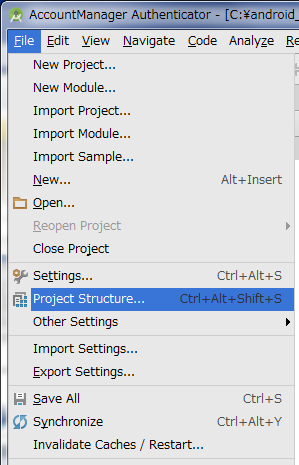

ガイド文書の構成
================

開発者コンテキスト <!-- Developer's Context -->
------------------

セキュアコーディング系のガイド文書は「こういうコーディングは危ない、だからこのようにコーディングすべき」といった内容で構成されることが多いのですが、このような構成はすでにコーディングされたソースコードをレビューするときには役立つ反面、これから開発者がコーディングしようというときには、どの記事を読んだらよいのか分かりにくいという問題があります。

このガイド文書では、開発者がいま何をしようとしているか？という開発者コンテキストに着目し、開発者コンテキストに合わせた切り口の記事を用意する方針をとっています。たとえば「Activityを作る・利用する」や「SQLiteを使う」という開発者が行うであろう作業単位ごとに記事を用意しています。

開発者コンテキストに合わせて記事を用意することにより、開発者は必要な記事を見つけやすく、業務にすぐ役立つようになると考えています。

サンプルコード、ルールブック、アドバンスト <!-- Sample Code, Rule Book, Advanced Topics -->
------------------------------------------

それぞれの記事はサンプルコード、ルールブック、アドバンストの3つのセクションで構成されています。お急ぎの方はサンプルコードとルールブックをご覧ください。ある程度再利用可能なパターンに落とし込んだ内容にしてあります。サンプルコードセクションとルールブックセクションに収まらない課題をお持ちの方はアドバンストをご覧ください。個別課題の解決方法を検討するための考慮材料を記載してあります。

なお、サンプルコードおよび記事の内容は特別な記述がない限りAndroid
4.0.3(API Level 15)以降を対象にしています。Android 4.0.3(API Level
15)より前のバージョンにおいては動作確認をしておらず、対策として効果がない場合もありますのでご注意ください。また、対象範囲内のバージョンであっても、組み込んだ端末で動作をご確認の上、ご自身の責任のもとでご利用ください。

### サンプルコード

サンプルコードセクションでは、その記事がテーマとする開発者コンテキストにおいて基本的なお手本となるサンプルコードを掲載しています。複数のパターンがある場合はその分類方法とそれぞれのパターンのサンプルコードを用意しています。解説においては簡潔さを心がけており、セキュリティ上考慮すべきポイントを本文中で「**ポイント：**」部分に番号付き箇条書きで記載し、その箇条書き番号Nに対応するサンプルコードにも「**★ポイントN★**」と記載しコメントで解説しています。一つのポイントがサンプルコード上では複数個所に対応する場合があることにご注意ください。このようにセキュリティを考慮すべき個所はソースコード全体に対して僅かな量ですが、それらの個所は点在します。セキュリティの考慮が必要な個所を見渡すことができるように、サンプルコードはクラス単位でまるごと掲載するようにしています。

このガイド文書で掲載しているサンプルコードは一部です。すべてのサンプルコードをまとめた圧縮ファイルも下記のURLに公開しています。Apache
License, Version
2.0で公開していますので、自由にサンプルコードをコピー&ペーストしてご利用いただけます。ただしエラー処理についてはサンプルコードが長くなり過ぎないように最小限にしていますのでご注意ください。

-   [http://www.jssec.org/dl/android\_securecoding.pdf](http://www.jssec.org/dl/android_securecoding.pdf)
    ガイド文書

-   [http://www.jssec.org/dl/android\_securecoding.zip](http://www.jssec.org/dl/android_securecoding.zip)
    サンプルコード一式

サンプルコードに添付するProjects/keystoreファイルはAPK署名用の開発者鍵を含んだキーストアファイルです。パスワードは「android」です。自社限定系のサンプルコードをAPK署名する際にご利用ください。

デバッグ用にキーストアファイルdebug.keystoreを用意しているので、Android
Studioで開発する場合は、Android
Studioの個別のプロジェクトで設定しておくと、自社限定系のサンプルコードの動作確認に便利です。また、複数のAPKから成るサンプルコードにおいて、各APK間の連携動作を確認するためには、各々のAndroidManifest.xml内のandroid:debuggableの設定を合わせる必要があります。Android
StudioからAPKをインストールする場合は、明示的に設定が無ければ自動的にandroid:debuggable="true"になります。

サンプルコードおよびキーストアファイルをAndroid
Studioに取り込む方法については「2.5 サンプルコードのAndroid
Studioへの取り込み手順」をご参照ください。

### ルールブック

ルールブックセクションでは、その記事がテーマとする開発者コンテキストにおいて、セキュリティ観点から守るべきルールや考慮事項を掲載しています。ルールブックセクションの冒頭にはそのセクションで扱っているルールを表形式で一覧表示し、「必須」または「推奨」のレベル分けをしています。ルールには肯定文または否定文の2種類がありますので、必須の肯定文は「やらなきゃだめ」、推奨の肯定文は「やったほうがよい」、必須の否定文は「やったらだめ」、推奨の否定文は「やらないほうがよい」といったレベル感で表現しています。もちろんこのレベル分けは執筆者の主観に基づくものですので、参考程度としてお取扱いください。

サンプルコードセクションに掲載されているサンプルコードはこれらのルールや考慮事項が反映されたものとなっていますが、その詳しい説明はルールブックセクションに記載されています。また、サンプルコードセクションでは扱っていないルールや考慮事項についてもルールブックセクションでは扱っています。

### アドバンスト

アドバンストセクションでは、その記事がテーマとする開発者コンテキストにおいて、サンプルコードセクションやルールブックセクションで説明できなかった、しかし注意を要する事項について記載しています。その記事がテーマとする開発者コンテキストにまつわる、コラム的な話題やAndroid
OSの限界に関する話題など、サンプルコードセクションやルールブックセクションの内容で解決できなかった個別課題の解決方法を検討するための考慮材料として役立てることができます。

開発者のみなさんは常に多忙です。開発者の多くは、Androidの深遠なるセキュリティの構造について深く理解することよりも、ある程度のAndroidセキュリティの知識を持って、迅速にかつ安全なAndroidアプリケーションをどんどん生産することが求められます。一方、セキュリティ設計が重要なアプリケーションもあります。このようなアプリケーションの開発者はAndroidのセキュリティについて深く理解している必要があります。

このようにスピード重視の開発者とセキュリティ重視の開発者の両方を支援するために、このガイド文書のすべての記事はサンプルコード、ルールブック、アドバンストの3つのセクションに分けて記述しています。サンプルコードとルールブックセクションは「そういうことがしたければ、これをしておけば安全ですよ」といった一般化できる内容が書いてあり、可能な限りソースコードのコピー&ペーストで自動的に安全なコーディングができることを狙っています。アドバンストセクションは「こんなときはこういう問題があって、こういう考え方をするとよい」といった考えるための材料が書いてあり、開発者が取り組んでいる個別のアプリケーションで最適なセキュア設計、セキュアコーディングを検討できることを狙っています。

ガイド文書のスコープ
--------------------

このガイド文書は一般のAndroidアプリケーション開発者に必要なセキュリティTipsを集めることを目的としています。そのため主にマーケットで配布されるAndroidアプリケーションの開発におけるセキュリティTips（下図の「アプリのセキュリティ」）が主なスコープとなっています。


```eval_rst
.. {width="6.889763779527559in" height="3.6992125984251967in"}
```

図 2.3‑1

Android
OS層以下のAndroid端末実装に関するセキュリティ（上図の「端末のセキュリティ」）はスコープ外です。またAndroid端末にユーザーがインストールする一般のAndroidアプリケーションと、Android端末メーカーがプレインストールするAndroidアプリケーションでは気を付けるべきセキュリティの観点で異なるところがありますが、特に現行版においては前者のみを扱っており、後者については扱っていません。現行版ではJavaにより実装するTipsだけを記載しておりますが、JNI実装についても今後の版で記載していく予定です。

root権限が奪取される脅威についても今のところ扱っていません。基本的にはroot権限が奪われていないセキュアなAndroid端末を前提とし、Android
OSのセキュリティモデルを活用したセキュリティTipsをまとめています。なお、資産と脅威の扱いについては「3.1.3
資産分類と保護施策」にて詳しく説明しておりますので、合わせてご確認ください。

Androidセキュアコーディング関連書籍の紹介
-----------------------------------------

このガイド文書ではAndroidセキュアコーディングのすべてを扱うことはとてもできないので、下記で紹介する書籍を併用することをお勧めします。

-   Android Security 安全なアプリケーションを作成するために<br/>
    著者：タオソフトウェア株式会社　ISBN978-4-8443-3134-6<br/>
    [http://www.amazon.co.jp/dp/4844331345/](http://www.amazon.co.jp/dp/4844331345/)

-   Javaセキュアコーディングスタンダード CERT/ Oracle版<br/>
    著者：Fred Long, Dhruv Mohindra, Robert C. Seacord, Dean F.
    Sutherland, David Svoboda<br/>
    監修：歌代和正　翻訳：久保正樹, 戸田洋三　ISBN978-4-04-886070-3<br/>
    [http://www.amazon.co.jp/dp/4048860704/](http://www.amazon.co.jp/dp/4048860704/)

サンプルコードのAndroid Studioへの取り込み手順
----------------------------------------------

サンプルコードのAndroid
Studioへの取り込み手順を説明します。サンプルコードは目的ごとに複数のプロジェクトにわかれています。これらのプロジェクトをまとめて取り込む方法を「2.5.1
サンプルプロジェクトを取り込む」に、選択して取り込む方法を「2.5.2サンプルの各プロジェクトを選択して取り込む」に示します。プロジェクトの取り込みが終わったら「2.5.3
サンプルコード動作確認用debug.keystoreを設定する」を参照してdebug.keystoreファイルをAndroid
Studioに設定してください。なお、確認は下記の環境で行っております。

-   OS
    -   Windows 7 Ultimate SP1
-   Android Studio
    -   2.1.2
-   Android SDK
    -   Android 6.0(API 23)
        -   特に注意のないサンプルプロジェクトはAndroid 6.0(API
            23)でビルドできます。

### サンプルプロジェクトを取り込む

#### サンプルコードをダウンロードする

「2.2.1 サンプルコード」で紹介したURLよりサンプルコードを取得します。

#### サンプルコードを展開する

Zipで圧縮されたサンプルコードを右クリックし、表示されたメニューの"すべて展開"をクリックします。


```eval_rst
.. {width="4.6875in" height="1.6666666666666667in"}
```

図 2.5‑1

#### 展開先を指定する

ここでは"C:\\android\_securecoding"という名前でワークスペースを作成します。そのため、"C:\\
"を指定し"展開"ボタンをクリックします。


```eval_rst
.. {width="3.8645833333333335in"
.. height="3.1354166666666665in"}
```

図 2.5‑2

\"展開\"ボタンをクリックすると"C:\\"直下に"android\_securecoding"というフォルダが作成されます。


```eval_rst
.. {width="5.458333333333333in"
.. height="3.0104166666666665in"}
```

図 2.5‑3

"android\_securecoding"フォルダの中にはサンプルコードが含まれています。

例えば、「4.1 Activityを作る・利用する」の「4.1.1.3
パートナー限定Activityを作る・利用する」においてサンプルコードを参照したい場合は以下をご覧ください。

    android_securecoding/
        Create Use Activity/
            Activity PartnerActivity/

以上のように、"android\_securecoding"フォルダ配下は、節ごとに「サンプルコードのプロジェクト」が配置された構成となります。

#### Android Studioを起動しワークスペースを指定する

スタートメニューやデスクトップアイコンなどからAndroid
Studioを起動します。


```eval_rst
.. {width="4.1672484689413825in"
.. height="3.125436351706037in"}
```

図 2.5‑4

起動後、表示されたダイアログからインポートを行います。


```eval_rst
.. {width="4.145574146981628in"
.. height="3.2916666666666665in"}
```

図 2.5‑5

また、既にプロジェクトを読み込んでいる場合は、そのWindowが表示されるため、メニューより\"File
-\> Close Project\"で表示しているプロジェクトをクローズします。


```eval_rst
.. {width="2.5416666666666665in"
.. height="3.888246937882765in"}
```

図 2.5‑6

#### インポートを開始する

表示されているダイアログの\"Import project (Eclipse ADT, Gradle,
etc.)\"をクリックします。


```eval_rst
.. {width="3.9375in" height="3.1264501312335957in"}
```

図 2.5‑7

#### プロジェクトを選択する

インポートするプロジェクトフォルダを展開し、同フォルダ内の
\"gradle\\build.gradle\" を選択します。


```eval_rst
.. {width="3.15625in" height="3.6427154418197727in"}
```

図 2.5‑8

本ガイドのサンプルコードプロジェクトと使用しているAndroid
StudioのGradleバージョンが異なる場合、Gradleが最適化されます。


```eval_rst
.. {width="4.46875in" height="0.859686132983377in"}
```

図 2.5‑9

画面に従い、\"Update\"をクリックし、Android Gradle
Pluginのアップデートを開始してください。


```eval_rst
.. {width="4.645833333333333in"
.. height="2.2020713035870516in"}
```

図 2.5‑10

以下のメッセージが表示されるので\"Fix Gradle wapper and re-import
project Gradle setting\"をクリックし、Gradle
Wrapperの更新を行ってください。


```eval_rst
.. {width="6.1375in" height="1.4638888888888888in"}
```

図 2.5‑11

#### インポートの完了

プロジェクトがインポートされ完了します。


```eval_rst
.. {width="4.928546587926509in"
.. height="2.9895833333333335in"}
```

図 2.5‑12

Android
Studioは、Eclipseとは違い、１つのプロジェクトに対して１つのWindowで表示されます。違うプロジェクトをインポートし開く場合は、\"File
-\> Import Project\...\"をクリックしインポートします。


```eval_rst
.. {width="2.1770833333333335in"
.. height="3.3672222222222223in"}
```

図 2.5‑13

### サンプルコード動作確認用debug.keystoreを設定する <!-- Setup the debug.keystore to run and test the Sample Code -->

サンプルコードから作成したアプリをAndroid端末やエミュレーターで動作させるためには署名が必要です。この署名に使うデバッグ用の鍵ファイル"debug.keystore"をAndroid
Studioのプロジェクトに設定します。

#### File -\>Project Structure\...をクリックする


```eval_rst
.. {width="2.1875in" height="3.401966316710411in"}
```

図 2.5‑14

#### Signingを追加する

左欄のModulesからプロジェクト名を選択し、Signingタブを選択後、「＋」ボタンをクリックします。


```eval_rst
.. {width="4.572916666666667in"
.. height="3.7520034995625546in"}
```

図 2.5‑15

#### "debug.keystore"を選択する

debug.keystoreはサンプルコードに含まれています。(android\_securecodingフォルダ直下)


```eval_rst
.. {width="3.0132010061242345in"
.. height="3.4583333333333335in"}
```

図 2.5‑16

#### Signingの名前を入力


```eval_rst
.. {width="5.177083333333333in"
.. height="4.247711067366579in"}
```

図 2.5‑17

#### Build TypesでSigning Configを設定

Build Typesタブを選択し、debugビルド用のSigning
ConfigをSingningで追加した\"debug\"を選択し、OKをクリックします。


```eval_rst
.. {width="5.4375in" height="4.461379046369204in"}
```

図 2.5‑18

#### build.gradleファイルで確認

signingConfigsに選択したdebug.keystoreのパスが表示され、buildTypesのdebugにsigningConfigが表示されます。


```eval_rst
.. {width="5.5in" height="4.7354538495188105in"}
```

図 2.5‑19
