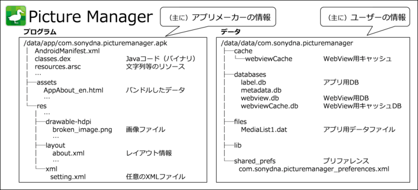
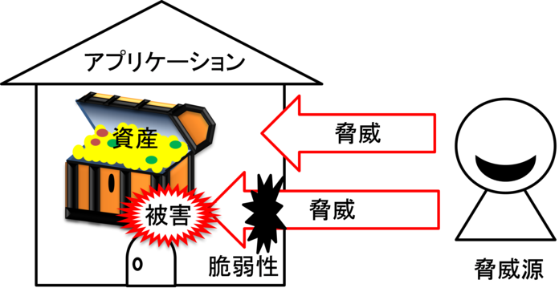
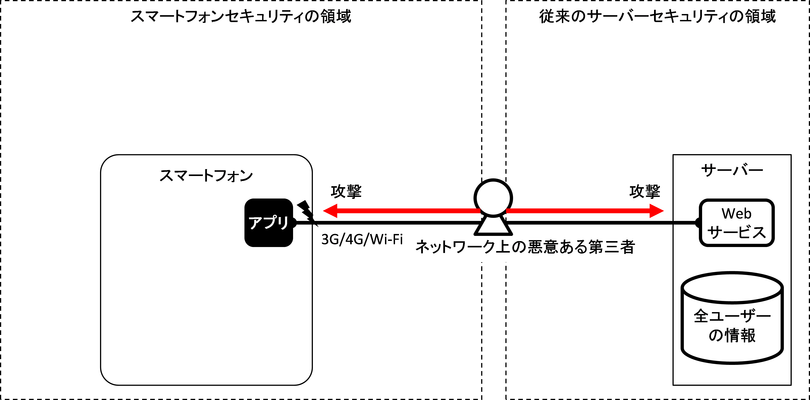
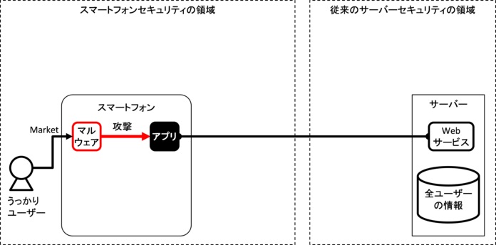
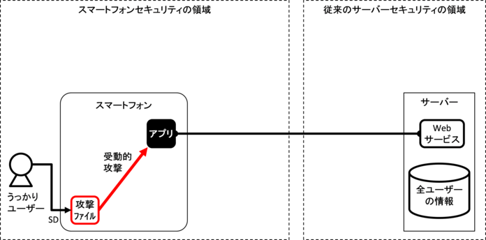
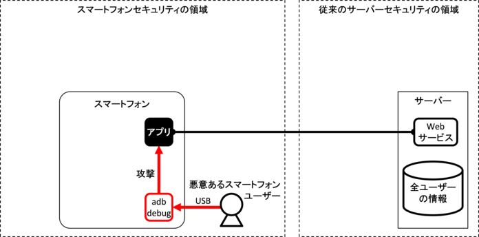
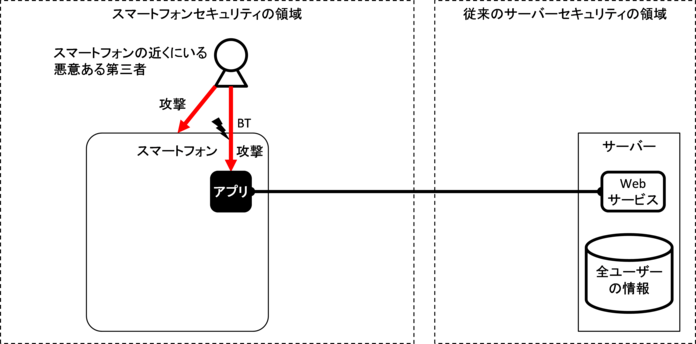
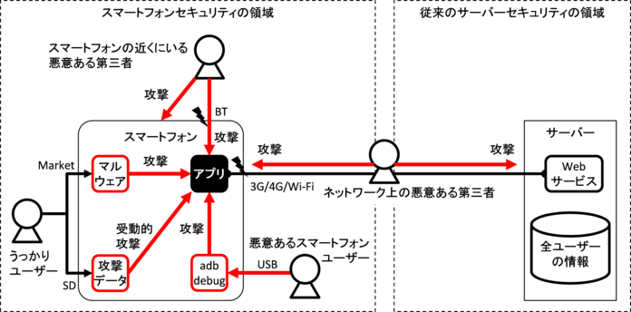

セキュア設計・セキュアコーディングの基礎知識
============================================

このガイド文書はAndroidアプリ開発におけるセキュリティTipsをまとめるものであるが、この章ではAndroidスマートフォン／タブレットを例に一般的なセキュア設計・セキュアコーディングの基礎知識を扱う。後続の章において一般的なセキュア設計・セキュアコーディングの解説が必要なときに、本章の記事を参照するため、後続の章を読み進める前に本章の内容に一通り目を通しておくことをお勧めする。

Androidアプリのセキュリティ
---------------------------

システムやアプリのセキュリティについて検討するとき、定番の考え方のフレームワークがある。まずそのシステムやアプリにおいて守るべき対象を把握する。これを「資産」と呼ぶ。次にその資産を脅かす攻撃を把握する。これを「脅威」と呼ぶ。最後に「資産」を「脅威」から守るための施策を検討・実施する。この施策を「対策」と呼ぶ。

ここで「対策」とは、システムやアプリに適切なセキュア設計・セキュアコーディングを施すことであり、このガイド文書では4章以降でこれを扱っている。本節では「資産」および「脅威」について焦点を当てる。

### 「資産」　守るべき対象

システムやアプリにおける「守るべき対象」には「情報」と「機能」の2つがある。これらをそれぞれ「情報資産」と「機能資産」と呼ぶ。「情報資産」とは、許可された人だけが参照や変更ができる情報のことであり、それ以外の人には一切参照や変更ができてはならない情報のことである。「機能資産」とは許可された人だけが利用できる機能のことであり、それ以外の人には一切利用できてはならない機能のことである。

以下、Androidスマートフォン／タブレットにおける情報資産と機能資産にどのようなものがあるかを紹介する。AndroidアプリやAndroidスマートフォン／タブレットを活用したシステムを開発するときの資産の洗い出しの参考にしてほしい。以降では、Androidスマートフォン／タブレットを総称してAndroidスマートフォンと呼ぶ。

#### Androidスマートフォンにおける情報資産

表 3.1‑1および表
3.1‑2はAndroidスマートフォンに入っている情報の一例である。これらの情報はスマートフォンユーザーに関する個人情報、プライバシー情報またはそれらに類する情報に該当するため適切な保護が必要である。

表 3.1‑1
Androidスマートフォンが管理する情報の例

```eval_rst
================ =================================
情報             備考
================ =================================
電話番号         スマートフォン自身の電話番号
通話履歴         受発信の日時や相手番号
IMEI             スマートフォンの端末ID
IMSI             回線契約者ID
センサー情報     GPS、地磁気、加速度...
各種設定情報     WiFi設定値...
アカウント情報   各種アカウント情報、認証情報...
メディアデータ   写真、動画、音楽、録音...
...
================ =================================
```

表 3.1‑2 アプリが管理する情報の例
```eval_rst
======================= ===========================
情報                    備考
======================= ===========================
電話帳                  知人の連絡先
Eメールアドレス         ユーザーのメールアドレス
Eメールメールボックス   送受信メール本文、添付...
Webブックマーク         ブックマーク
Web閲覧履歴             閲覧履歴
カレンダー              予定、ToDo、イベント...
Facebook                SNSコンテンツ...
Twitter                 SNSコンテンツ...
...
======================= ===========================
```
表
3.1‑1の情報は主にAndroidスマートフォン本体またはSDカードに含まれる情報であり、表
3.1‑2の情報は主にアプリが管理する情報である。特に表
3.1‑2の情報については、アプリがインストールされればされるほど、どんどん本体の中に増えていくことになるのである。

表
3.1‑3は電話帳の1件のエントリに含まれる情報である。この情報はスマートフォンユーザーに関する情報ではなく、スマートフォンユーザーの知人、友人等に関する情報である。つまりスマートフォンにはその利用者であるユーザーのみならず、ほかの人々の情報も含まれていることに注意が必要だ。

表 3.1‑3
電話帳（Contacts）の1件のエントリに含まれる情報の例
```eval_rst
=========================== ======================================================================
情報                        内容
=========================== ======================================================================
電話番号                    自宅、携帯電話、仕事、FAX、MMS...
Eメールアドレス             自宅、仕事、携帯電話...
プロフィール画像            サムネール画像、大きな画像...
インスタントメッセンジャー  AIM、MSN、Yahoo、Skype、QQ、Google Talk、

                            ICQ、Jabber、Netmeeting...

ニックネーム                略称、イニシャル、旧姓、別名...
住所                        国、郵便番号、地域、地方、町、通り...
グループ                    お気に入り、家族、友達、同僚...
ウェブサイト                ブログ、プロフィールサイト、ホームページ、

                            FTPサーバー、自宅、会社...

イベント                    誕生日、記念日、その他...
関係する人物                配偶者、子供、父、母、マネージャー、助手、

                            同棲関係、パートナー...

SIPアドレス                 自宅、仕事、その他...
...                         ...
=========================== ======================================================================
```
これまでの説明では主にスマートフォンユーザーの情報を紹介してきたが、アプリはユーザー以外の情報も扱っている。図
3.1‑1は1つのアプリが管理している情報を表しており、大きく分けるとプログラム部分とデータ部分に分かれる。プログラム部分は主にアプリメーカーの情報であり、データ部分は主にユーザーの情報である。アプリメーカーの情報の中には、勝手にユーザーに利用されたくない情報もあり得るため、そうした情報についてはユーザーが参照・変更できないような保護が必要である。


```eval_rst
.. {width="7.26875in" height="3.3047561242344705in"}
```
図 3.1‑1 アプリが抱えている情報

Androidアプリを作る場合には図
3.1‑1のようなアプリ自身が管理する情報のみならず、表 3.1‑1、表 3.1‑2、表
3.1‑3のようなAndroidスマートフォン本体や他のアプリから取得した情報に関しても適切に保護する必要があることにも注意が必要だ。

#### Androidスマートフォンにおける機能資産

表 3.1‑4はAndroid
OSがアプリに提供する機能の一例である。これらの機能がマルウェア等に勝手に利用されてしまうとユーザーの意図しない課金が生じたり、プライバシーが損なわれるなどの被害が生じたりする。そのため情報資産と同様にこうした機能資産も適切に保護されなければならない。

表 3.1‑4 Android OSがアプリに提供する機能
の一例
```eval_rst
=============================== ================================
機能                            機能
=============================== ================================
SMSメッセージを送受する機能     カメラ撮影機能
電話を掛ける機能                音量変更機能
ネットワーク通信機能            電話番号、携帯状態の読み取り機能
GPS等で現在位置を得る機能       SDカード書き込み機能
Bluetooth通信機能               システム設定変更機能
NFC通信機能                     ログデータの読み取り機能
インターネット通話（SIP）機能   実行中アプリ情報の取得機能
...                             ...
=============================== ================================
```
Android
OSがアプリに提供する機能に加え、Androidアプリのアプリ間連携機能も機能資産に含まれる。Androidアプリはそのアプリ内で実現している機能を他のアプリから利用できるように提供することができ、このような仕組みをアプリ間連携と呼んでいる。この機能は便利である反面、Android
アプリの開発者がセキュアコーディングの知識がないために、アプリ内部だけで利用する機能を誤って他のアプリから利用できるようにしてしまっているケースもある。他のアプリから利用できる機能の内容によっては、マルウェアから利用されては困ることもあるため、意図したアプリだけから利用できるように適切な保護が必要となることがある。

### 「脅威」　資産を脅かす攻撃

前節ではAndroidスマートフォンにおける資産について解説した。ここではそれらの脅威、つまり資産を脅かす攻撃について解説する。資産が脅かされるとは簡単に言えば、情報資産が他人に勝手に参照・変更・削除・作成されることを言い、機能資産が他人に勝手に利用されることを言う、といった具合だ。こうした資産を直接的および間接的に操作する攻撃行為を「脅威」と呼ぶ。また攻撃行為を行う人や物のことを「脅威源」と呼ぶ。攻撃者やマルウェアは脅威源であって脅威ではない。攻撃者やマルウェアが行う攻撃行為のことを脅威と呼ぶのである。これら用語間の関係を図
3.1‑2 資産、脅威、脅威源、脆弱性、被害の関係に示す。


```eval_rst
.. {width="5.854166666666667in"
.. height="3.1041666666666665in"}
```

図 3.1‑2
資産、脅威、脅威源、脆弱性、被害の関係

図
3.1‑3はAndroidアプリが動作する一般的な環境を表現したものだ。以降ではこの図をベースにしてAndroidアプリにおける脅威の説明を展開するため、初めにこの図の見方を解説する。


```eval_rst
.. {width="7.020833333333333in" height="3.46875in"}
```

図 3.1‑3 Androidアプリが動作する一般的な環境

図の左右にスマートフォンとサーバーを配置している。スマートフォンやサーバーは3G/4G/Wi-Fiおよびインターネットを経由して通信している。スマートフォンの中には複数のアプリが存在するが、以降の説明で1つのアプリに関する脅威を説明するため、この図では1つのアプリに絞って説明している。スマートフォン上のアプリはそのユーザーの情報を主に扱うが、サーバー上のWebサービスは全ユーザーの情報を集中管理することを表現している。そのため従来同様にサーバーセキュリティの重要性は変わらない。サーバーセキュリティについては、このガイド文書ではスコープ外であるため言及しない。

以降ではこの図を使ってAndroidアプリにおける脅威を説明していく。

#### ネットワーク上の第三者による脅威


```eval_rst
.. {width="7.020833333333333in" height="3.46875in"}
```

図 3.1‑4
ネットワーク上の悪意ある第三者がアプリを攻撃する

スマートフォンアプリはユーザーの情報をサーバーで管理する形態が一般的である。そのため情報資産がネットワーク上を移動することになる。図
3.1‑4に示すように、ネットワーク上の悪意ある第三者は通信中の情報を参照（盗聴）したり、情報を変更（改ざん）したりしようとする。また本物のサーバーになりすまして、アプリの通信相手になろうとする。もちろん従来同様、ネットワーク上の悪意ある第三者はサーバーも攻撃する。

#### ユーザーがインストールしたマルウェアによる脅威


```eval_rst
.. {width="7.020833333333333in" height="3.46875in"}
```

図 3.1‑5
ユーザーがインストールしてしまったマルウェアがアプリを攻撃する

スマートフォンは多種多様なアプリをマーケットから入手しインストールすることで機能拡張できることがその最大の特徴である。ユーザーがうっかりマルウェアアプリをインストールしてしまうこともある。図
3.1‑5が示すように、マルウェアはアプリ間連携機能やアプリの脆弱性を悪用してアプリの情報資産や機能資産にアクセスしようとする。

#### アプリの脆弱性を悪用する攻撃ファイルによる脅威


```eval_rst
.. {width="7.020833333333333in" height="3.46875in"}
```

図 3.1‑6
アプリの脆弱性を悪用する攻撃ファイルがアプリを攻撃する

インターネット上には音楽や写真、動画、文書など、様々なタイプのファイルが大量に公開されており、ユーザーがそれらのファイルをSDカードにダウンロードし、スマートフォンで利用する形態が一般的である。またスマートフォンで受信したメールに添付されるファイルを利用する形態も一般的である。これらのファイルは閲覧用や編集用のアプリでオープンされ利用される。

こうしたファイルを処理するアプリの機能に脆弱性があると、攻撃ファイルにより、そのアプリの情報資産や機能資産が悪用されてしまう。特に複雑なデータ構造を持ったファイル形式の処理においては脆弱性が入り込みやすい。攻撃ファイルは巧みに脆弱性を悪用してアプリを操作し、攻撃ファイルの作成者の目的を達成する。

図
3.1‑6に示すように、攻撃ファイルは脆弱なアプリによってオープンされるまでは何もせず、いったんオープンされるとアプリの脆弱性を悪用した攻撃を始める。攻撃者が能動的に行う攻撃行為と比較して、このような攻撃手法を受動的攻撃（Passive
Attack）と呼ぶ。

#### 悪意あるスマートフォンユーザーによる脅威


```eval_rst
.. {width="7.020833333333333in" height="3.46875in"}
```

図 3.1‑7
悪意あるスマートフォンユーザーがアプリを攻撃する

Androidスマートフォンのアプリ開発においては、一般ユーザーに対してアプリを開発、解析する環境や機能が公式に提供されている。提供されている機能の中でも、特にADBと呼ばれる充実したデバッグ機能は、誰でも何の登録・審査もなく利用可能であり、この機能によりAndroidスマートフォンユーザーはOS解析行為やアプリ解析行為を容易に行うことができる。

図
3.1‑7に示すように、悪意あるスマートフォンユーザーはADB等のデバッグ機能を利用してアプリを解析し、アプリが抱える情報資産や機能資産にアクセスしようとする。アプリが抱える資産がユーザー自身のものである場合には問題とならないが、アプリメーカー等ユーザー以外のステークホルダーの資産である場合に問題となる。このようにスマートフォンのユーザー自身が悪意を持ってアプリ内の資産を狙うことがあることにも注意が必要だ。

#### スマートフォンの近くにいる第三者による脅威


```eval_rst
.. {width="7.020833333333333in" height="3.46875in"}
```

図 3.1‑8
スマートフォンの近くにいる悪意ある第三者がアプリを攻撃する

スマートフォンはその携帯性の良さや、Bluetooth等の近距離無線通信機能を標準搭載していることから、物理的にスマートフォンの近くにいる悪意ある第三者から攻撃され得ることも忘れてはならない。攻撃者はユーザーが入力中のパスワードを肩越しに覗き見したり、図
3.1‑8に示すように、Bluetooth通信機能を持つアプリに対してBluetoothでアクセスしたり、スマートフォン自体を盗んだり破壊したりする。特にスマートフォン自体の窃盗や破壊については、機密度の高さからスマートフォン内から一切外に出さない運用としている情報資産が失われてしまう脅威であり、アプリ設計の段階で見過ごされてしまうこともあるので注意が必要だ。

#### 様々な脅威


```eval_rst
.. {width="7.020833333333333in" height="3.46875in"}
```

図 3.1‑9
スマートフォンアプリは様々な攻撃にさらされている

図
3.1‑9はこれまで説明した脅威をひとまとめにした図である。このようにスマートフォンアプリを取り巻く脅威には様々なものがあり、この図はそのすべてを書き出しているものではない。日々の情報収集により、Androidアプリを取り巻く脅威について認識を広め、アプリのセキュア設計・セキュアコーディングに活かしていく努力が必要である。一般社団法人日本スマートフォンセキュリティ協会が作成した次の文書もスマートフォンの脅威について役立つ情報を提供しているので参考にしていただきたい。

-   『スマートフォン＆タブレットの業務利用に関するセキュリティガイドライン』【第二版】<br/>
    [http://www.jssec.org/dl/guidelines\_v2.pdf](http://www.jssec.org/dl/guidelines_v2.pdf)<br/>
    [http://www.jssec.org/dl/guidelines2012enew\_v1.0.pdf](http://www.jssec.org/dl/guidelines2012enew_v1.0.pdf)
    (English)

-   『スマートフォンネットワークセキュリティ実装ガイド』 【第一版】<br/>
    [http://www.jssec.org/dl/NetworkSecurityGuide1.pdf](http://www.jssec.org/dl/NetworkSecurityGuide1.pdf)

-   『スマートフォンの業務利用におけるクラウド活用ガイド』 【ベータ版】<br/>
    [http://www.jssec.org/dl/cloudguide2012\_beta.pdf](http://www.jssec.org/dl/cloudguide2012_beta.pdf)

-   『MDM導入・運用検討ガイド』【第一版】<br/>
    [http://www.jssec.org/dl/MDMGuideV1.pdf](http://www.jssec.org/dl/MDMGuideV1.pdf)

### 資産分類と保護施策

前節までで解説した通りAndroidスマートフォンには様々な脅威が存在する。それら脅威から、アプリが扱うすべての資産を保護することは、開発にかかる時間や技術的限界などから困難な場合がある。そのため、Androidアプリ開発者は、アプリが扱う資産の重要度や容認される被害レベルを判断基準とした優先度に応じて、資産に対する妥当な対策を検討することが必要になる。

資産毎の保護施策を決めるため、アプリが扱うそれぞれの資産について、その重要度・保護に関する法的根拠・被害発生時の影響・開発者（または組織）の社会的責任などを検討した上で、資産を分類し、分類毎に保護施策のレベルを定める。これが、それぞれの資産をどのように扱い、どのような対策を施すかを決める判断基準となる。この分類はアプリ開発者（または組織）として資産をどのように扱い保護するかを定める基準そのものであるため、アプリ開発者（または組織）がそれぞれの事情に合わせて、分類方法や対策内容を定める必要がある。

参考までに、本ガイドにおける資産分類と保護施策のレベルを以下に示す。

表 3.1‑5　資産分類と保護施策のレベル
```eval_rst
========= ================================ ===================================== 
資産分類  資産のレベル                          保護施策のレベル
========= ================================ ===================================== 
高位 [*]_ | 資産が被害にあった場合、組織   | Android OSのセキュリティモデルを
          | または個人の活動に致命的または | 破る、root権限を奪取した状態から
          | 壊滅的な影響をあたえるもの。   | の攻撃やAPKのdex部分を改造すると
          |                                | いった、高度な攻撃に対しても保護
          | 例）資産が被害にあった場合、   | する。
          | 当該組織が事業を継続できなく   | UX等の他要素よりもセキュリティ確
          | なるレベル。                   | 保を優先する。
中位      | 資産が被害にあった場合、組織   | Android OSのセキュリティモデルを
          | または個人の活動に重大な影響   | 活用し、その範囲内で保護する。
          | をあたえるもの。               |
          |
          | 例）資産が被害にあった場合、   | UX等の他要素よりもセキュリティ
          | 当該組織の利益が悪化し、事業   | 確保を優先する。
          | に影響を及ぼすレベル。
低位      | 資産が被害にあった場合、組織   | Android OSのセキュリティモデルを
          | または個人の活動に限定的な影   | 活用し、その範囲内で保護する。
          | 響をあたえるもの。             |
          |
          | 例）資産が被害にあった場合、   | UX等の他要素とセキュリティを比
          | 当該組織の利益に影響を与え     | 較し、他要素を優先しても良い。
          | 得るが、他の要素により利益の
          | 補てんが可能なレベル。
========= ================================ ===================================== 

本ガイドにおける資産分類と保護施策は、基本的にはroot権限が奪われていないセキュアなAndroid端末を前提とし、Android OSのセキュリティモデルを活用したセキュリティ施策を基準にしている。具体的には、資産分類で中位レベル以下の資産に対してAndroid OSのセキュリティモデルが機能していることを前提に、Android OSのセキュリティモデルを活用した保護施策を想定している。

.. [*] 高位レベルの資産は、root権限が奪取された状態からの攻撃や、APK解析・改造による攻撃といった、Android OSのセキュリティモデルが破られた状態での攻撃からも、保護が必要な資産であると想定している。このような資産を守るためには、Android OSのセキュリティモデルが活用できないため、暗号化、難読化、ハードウェア支援、サーバー支援など複数の手段を組み合わせて高度な防御設計をする。これはガイド文書に簡潔に書けるようなノウハウではないし、個別の状況に応じて適切な防御設計は異なるため本ガイドの対象外としている。root権限奪取からの攻撃やAPK解析・改造などの高度な攻撃に対する保護が必要な場合は、Androidの耐タンパ設計に詳しいセキュリティ専門家に相談することをお勧めする。
```

### センシティブな情報

本ガイドのこれ以降の文章において情報資産を「センシティブな情報」と表現している。前節で述べたようにアプリが扱う個々の情報資産ごとに資産のレベルや保護施策のレベルを判断しなければならない。

入力データの安全性を確認する
----------------------------

入力データの安全性確認はもっとも基礎的で効果の高いセキュアコーディング作法である。プログラムに入力されるデータのうち、攻撃者が直接的、間接的にそのデータの値を操作可能であるものはすべて、入力データの安全性確認が必要である。以下、Activityをプログラムに見立て、Intentを入力データに見立てた場合を例にして、入力データの安全性確認の在り方について解説する。

Activityが受け取ったIntentには攻撃者が細工した​データが含まれている可能性がある。攻撃者はプログラマが想定していない形式・値のデータを送り付けることで、アプリの誤動作を誘発し、結果として何らかのセキュリティ被害を生じさせるのである。ユーザーも攻撃者の一人となり得ることも忘れてはならない。

Intentはactionやdata、extrasなどのデータで構成されるが、攻撃者が制御可能なデータはすべて気を付けなければならない。攻撃者が制御可能なデータを扱うコードでは、必ず次の事項を確認しなければならない。

(a) 受け取ったデータは、プログラマが想定した形式であって、値は想定の範囲内に収まっているか？

(b) 想定している形式、値のあらゆるデータを受け取っても、そのデータを扱うコードが想定外の動作をしないと保証できるか？

次の例は指定URL のInternet 上のWeb ページのHTML
を取得し、画面上のTextView に表示するだけの簡単なサンプルである。
しかしこれには不具合がある。

Internet上のWebページのHTMLをTextViewに表示するサンプルコード
```java
TextView tv = (TextView) findViewById(R.id.textview);
InputStreamReader isr = null;
char[] text = new char[1024];
int read;
try {
    String urlstr = getIntent().getStringExtra("WEBPAGE_URL");
    URL url = new URL(urlstr);
    isr = new InputStreamReader(url.openConnection().getInputStream());
    while ((read=isr.read(text)) != -1) {
        tv.append(new String(text, 0, read));
    }
} catch (MalformedURLException e) { //...
```

(a)の観点で「urlstrが正しいURLである」ことをnew
URL()でMalformedURLExceptionが発生しないことに​より確認している。しかしこれは不十分であり、urlstrに「file://～」形式のURLが指定されるとInternet上のWebページではなく、内部ファイルシステム上のファイルを開いてTextViewに表示してしまう。プログラマが想定した動作を保証していないため、(b)の観点を満たしていない。

次は改善例である。(a)の観点で「urlstrは正規のURLであって、protocolはhttpまたはhttpsに限定される」ことを確認している。これにより(b)の観点でもurl.openConnection().getInputStream()でInternet経由のInputStreamを取得することが保証される。

Internet上のWebページのHTMLをTextViewに表示するサンプルコードの修正版
```java
TextView tv = (TextView) findViewById(R.id.textview);
InputStreamReader isr = null;
char[] text = new char[1024];
int read;
try {
    String urlstr = getIntent().getStringExtra("WEBPAGE_URL");
    URL url = new URL(urlstr);
    String prot = url.getProtocol();
    if (!"http".equals(prot) && !"https".equals(prot)) {
        throw new MalformedURLException("invalid protocol");
    }
    isr = new InputStreamReader(url.openConnection().getInputStream());
    while ((read=isr.read(text)) != -1) {
        tv.append(new String(text, 0, read));
    }
} catch (MalformedURLException e) { //...
```

入力データの安全性確認はInput
Validationと呼ばれる基礎的なセキュアコーディング作法である。Input
Validationという言葉の語感から(a)の観点のみ気を付けて(b)の観点を忘れてしまいがちである。データはプログラムに入ってきたときではなく、プログラムがそのデータを「使う」ときに被害が発生することに気を付けていただきたい。下記URLもぜひ参考にしていただきたい。

-   IPA 「セキュアプログラミング講座」\
    [http://www.ipa.go.jp/security/awareness/vendor/programmingv2/clanguage.html](http://www.ipa.go.jp/security/awareness/vendor/programmingv2/clanguage.html)

-   JPCERT CC 「Java セキュアコーディングスタンダード CERT/Oracle 版」\
    [http://www.jpcert.or.jp/java-rules/](http://www.jpcert.or.jp/java-rules/)

-   JPCERT CC 「Java Androidアプリケーション開発へのルールの適用」\
    [http://www.jpcert.or.jp/java-rules/android-j.html](http://www.jpcert.or.jp/java-rules/android-j.html)
