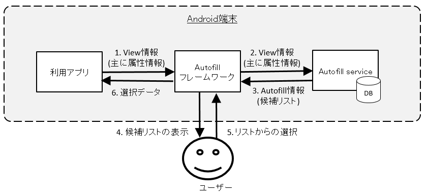
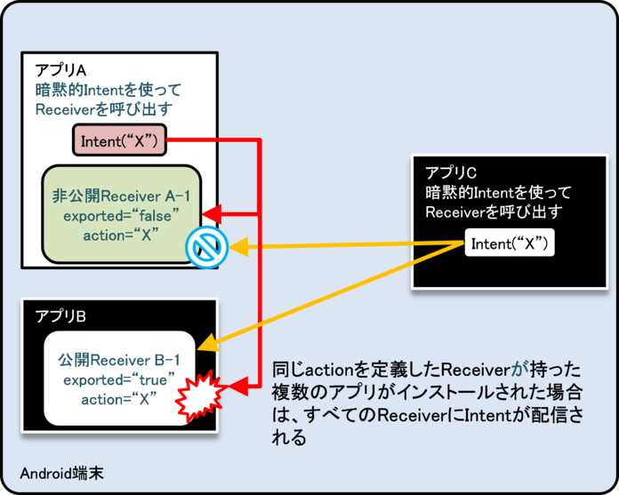
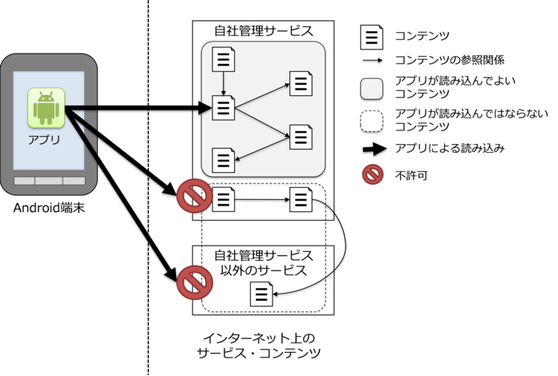

安全にテクノロジーを活用する
============================

Androidで言えばActivityやSQLiteなど、テクノロジーごとにセキュリティ観点の癖というものがある。そうしたセキュリティの癖を知らずに設計、コーディングしていると思わぬ脆弱性をつくりこんでしまうことがある。この章では開発者がAndroidのテクノロジーを活用するシーンを想定した記事を扱う。

Activityを作る・利用する
------------------------

### サンプルコード<!-- 6207eabf -->

Activityがどのように利用されるかによって、Activityが抱えるリスクや適切な防御手段が異なる。ここでは、Activityがどのように利用されるかという観点で、Activityを4つのタイプに分類した。次の判定フローによって作成するActivityがどのタイプであるかを判断できる。なお、どのような相手を利用するかによって適切な防御手段が決まるため、Activityの利用側の実装についても合わせて説明する。


```eval_rst
.. {width="6.889763779527559in"
.. height="3.0074803149606297in"}
```

図 4.1‑1

#### 非公開Activityを作る・利用する

非公開Activityは、同一アプリ内でのみ利用されるActivityであり、もっとも安全性の高いActivityである。

同一アプリ内だけで利用されるActivity（非公開Activity）を利用する際は、クラスを指定する明示的Intentを使えば誤って外部アプリにIntentを送信してしまうことがない。ただし、Activityを呼び出す際に使用するIntentは第三者によって読み取られる恐れがある。そのため、Activityに送信するIntentにセンシティブな情報を格納する場合には、その情報が悪意のある第三者に読み取られることのないように、適切な対応を実施する必要がある。

以下に非公開Activityを作る側のサンプルコードを示す。

ポイント(Activityを作る)：

1.  taskAffinityを指定しない
2.  launchModeを指定しない
3.  exported=\"false\"により、明示的に非公開設定する
4.  同一アプリからのIntentであっても、受信Intentの安全性を確認する
5.  利用元アプリは同一アプリであるから、センシティブな情報を返送してよい

Activityを非公開設定するには、AndroidManifest.xmlのactivity要素のexported属性をfalseと指定する。

AndroidManifest.xml
```eval_rst
.. literalinclude:: CodeSamples/Activity PrivateActivity.app.src.main.AndroidManifest.xml
   :language: xml
   :encoding: shift-jis
```
PrivateActivity.java
```eval_rst
.. literalinclude:: CodeSamples/Activity PrivateActivity.PrivateActivity.java
   :language: java
   :encoding: shift-jis
```

次に非公開Activityを利用する側のサンプルコードを示す。

```eval_rst
ポイント(Activityを利用する)：

6.  Activityに送信するIntentには、フラグFLAG\_ACTIVITY\_NEW\_TASKを設定しない
7.  同一アプリ内Activityはクラス指定の明示的Intentで呼び出す
8.  利用先アプリは同一アプリであるから、センシティブな情報をputExtra()を使う場合に限り送信してもよい [1]_
9.  同一アプリ内Activityからの結果情報であっても、受信データの安全性を確認する

.. [1] ただし、ポイント1, 2, 6を遵守している場合を除いてはIntentが第三者に読み取られるおそれがあることに注意する必要がある。詳細はルールブックセクションの4.1.2.2、4.1.2.3を参照すること。
```

PrivateUserActivity.java
```eval_rst
.. literalinclude:: CodeSamples/Activity PrivateActivity.PrivateUserActivity.java
   :language: java
   :encoding: shift-jis
```

#### 公開Activityを作る・利用する

公開Activityは、不特定多数のアプリに利用されることを想定したActivityである。マルウェアが送信したIntentを受信することがあることに注意が必要である。また、公開Activityを利用する場合には、送信するIntentがマルウェアに受信される、あるいは読み取られることがあることに注意が必要である。

以下に公開Activityを作る側のサンプルコードを示す。

ポイント(Activityを作る)：

1.  exported=\"true\"により、明示的に公開設定する
2.  受信Intentの安全性を確認する
3.  結果を返す場合、センシティブな情報を含めない

AndroidManifest.xml
```eval_rst
.. literalinclude:: CodeSamples/Activity PublicActivity.app.src.main.AndroidManifest.xml
   :language: xml
   :encoding: shift-jis
```
PublicActivity.java
```eval_rst
.. literalinclude:: CodeSamples/Activity PublicActivity.PublicActivity.java
   :language: java
   :encoding: shift-jis
```

次に公開Activityを利用する側のサンプルコードを示す。

ポイント(Activityを利用する)：

4.  センシティブな情報を送信してはならない
5.  結果を受け取る場合、結果データの安全性を確認する

PublicUserActivity.java
```eval_rst
.. literalinclude:: CodeSamples/Activity PublicUser.PublicUserActivity.java
   :language: java
   :encoding: shift-jis
```

#### パートナー限定Activityを作る・利用する

パートナー限定Activityは、特定のアプリだけから利用できるActivityである。パートナー企業のアプリと自社アプリが連携してシステムを構成し、パートナーアプリとの間で扱う情報や機能を守るために利用される。

Activityを呼び出す際に使用するIntentは第三者によって読み取られる恐れがある。そのため、Activityに送信するIntentにセンシティブな情報を格納する場合には、その情報が悪意のある第三者に読み取られることのないように、適切な対応を実施する必要がある。

以下にパートナー限定Activityを作る側のサンプルコードを示す。

ポイント(Activityを作る)：

1.  taskAffinityを指定しない
2.  launchModeを指定しない
3.  Intent Filterを定義せず、exported=\"true\"を明示的に設定する
4.  利用元アプリの証明書がホワイトリストに登録されていることを確認する
5.  パートナーアプリからのIntentであっても、受信Intentの安全性を確認する
6.  パートナーアプリに開示してよい情報に限り返送してよい

ホワイトリストを用いたアプリの確認方法については、「4.1.3.2 利用元アプリを確認する」を参照すること。また、ホワイトリストに指定する利用先アプリの証明書ハッシュ値の確認方法は「5.2.1.3 アプリの証明書のハッシュ値を確認する方法」を参照すること。

AndroidManifest.xml
```eval_rst
.. literalinclude:: CodeSamples/Activity PartnerActivity.activityPartnerActivity.src.main.AndroidManifest.xml
   :language: xml
   :encoding: shift-jis
```

PartnerActivity.java
```eval_rst
.. literalinclude:: CodeSamples/Activity PartnerActivity.PartnerActivity.java
   :language: java
   :encoding: shift-jis
```

PkgCertWhitelists.java
```eval_rst
.. literalinclude:: CodeSamples/JSSEC Shared.PkgCertWhitelists.java
   :language: java
   :encoding: shift-jis
```

PkgCert.java
```eval_rst
.. literalinclude:: CodeSamples/JSSEC Shared.PkgCert.java
   :language: java
   :encoding: shift-jis
```


次にパートナー限定Activityを利用する側のサンプルコードを示す。ここではパートナー限定Activityを呼び出す方法を説明する。

ポイント(Activityを利用する)：

7.  利用先パートナー限定Activityアプリの証明書がホワイトリストに登録されていることを確認する
8.  Activityに送信するIntentには、フラグFLAG\_ACTIVITY\_NEW\_TASKを設定しない
9.  利用先パートナー限定アプリに開示してよい情報はputExtra()を使う場合に限り送信してよい
10.  明示的Intentによりパートナー限定Activityを呼び出す
11.  startActivityForResult()によりパートナー限定Activityを呼び出す
12.  パートナー限定アプリからの結果情報であっても、受信Intentの安全性を確認する

ホワイトリストを用いたアプリの確認方法については、「4.1.3.2
利用元アプリを確認する」を参照すること。また、ホワイトリストに指定する利用先アプリの証明書ハッシュ値の確認方法は「5.2.1.3
アプリの証明書のハッシュ値を確認する方法」を参照すること。

AndroidManifest.xml
```eval_rst
.. literalinclude:: CodeSamples/Activity PartnerUser.activityPartnerUser.src.main.AndroidManifest.xml
   :language: xml
   :encoding: shift-jis
```

PartnerUserActivity.java
```eval_rst
.. literalinclude:: CodeSamples/Activity PartnerUser.PartnerUserActivity.java
   :language: java
   :encoding: shift-jis
```


PkgCertWhitelists.java
```eval_rst
.. literalinclude:: CodeSamples/JSSEC Shared.PkgCertWhitelists.java
   :language: java
   :encoding: shift-jis
```


PkgCert.java
```eval_rst
.. literalinclude:: CodeSamples/JSSEC Shared.PkgCert.java
   :language: java
   :encoding: shift-jis
```


#### 自社限定Activityを作る・利用する

自社限定Activityは、自社以外のアプリから利用されることを禁止するActivityである。複数の自社製アプリでシステムを構成し、自社アプリが扱う情報や機能を守るために利用される。

Activityを呼び出す際に使用するIntentは第三者によって読み取られる恐れがある。そのため、Activityに送信するIntentにセンシティブな情報を格納する場合には、その情報が悪意のある第三者に読み取られることのないように、適切な対応を実施する必要がある。

以下に自社限定Activityを作る側のサンプルコードを示す。

ポイント(Activityを作る)：

1.  独自定義Signature Permissionを定義する
2.  taskAffinityを指定しない
3.  launchModeを指定しない
4.  独自定義Signature Permissionを要求宣言する
5.  Intent Filterを定義せず、exported=\"true\"を明示的に設定する
6.  独自定義Signature Permissionが自社アプリにより定義されていることを確認する
7.  自社アプリからのIntentであっても、受信Intentの安全性を確認する
8.  利用元アプリは自社アプリであるから、センシティブな情報を返送してよい
9.  利用元アプリと同じ開発者鍵でAPKを署名する

AndroidManifest.xml
```eval_rst
.. literalinclude:: CodeSamples/Activity InhouseActivity.activityInhouseActivity.src.main.AndroidManifest.xml
   :language: xml
   :encoding: shift-jis
```


InhouseActivity.java
```eval_rst
.. literalinclude:: CodeSamples/Activity InhouseActivity.InhouseActivity.java
   :language: java
   :encoding: shift-jis
```


SigPerm.java
```eval_rst
.. literalinclude:: CodeSamples/JSSEC Shared.SigPerm.java
   :language: java
   :encoding: shift-jis
```


PkgCert.java
```eval_rst
.. literalinclude:: CodeSamples/JSSEC Shared.PkgCert.java
   :language: java
   :encoding: shift-jis
```


★ポイント9★APKをExportするときに、利用元アプリと同じ開発者鍵でAPKを署名する。


```eval_rst
.. {width="4.647222222222222in"
.. height="3.2743055555555554in"}
```

図 4.1‑2

次に自社限定Activityを利用する側のサンプルコードを示す。ここでは自社限定Activityを呼び出す方法を説明する。

ポイント(Activityを利用する)：

10.  独自定義Signature Permissionを利用宣言する
11.  独自定義Signature Permissionが自社アプリにより定義されていることを確認する
12.  利用先アプリの証明書が自社の証明書であることを確認する
13.  利用先アプリは自社アプリであるから、センシティブな情報をputExtra()を使う場合に限り送信してもよい
14.  明示的Intentにより自社限定Activityを呼び出す
15.  自社アプリからの結果情報であっても、受信Intentの安全性を確認する
16.  利用先アプリと同じ開発者鍵でAPKを署名する

AndroidManifest.xml
```eval_rst
.. literalinclude:: CodeSamples/Activity InhouseUser.activityInhouseUser.src.main.AndroidManifest.xml
   :language: xml
   :encoding: shift-jis
```


InhouseUserActivity.java
```eval_rst
.. literalinclude:: CodeSamples/Activity InhouseUser.InhouseUserActivity.java
   :language: java
   :encoding: shift-jis
```


SigPerm.java
```eval_rst
.. literalinclude:: CodeSamples/JSSEC Shared.SigPerm.java
   :language: java
   :encoding: shift-jis
```


PkgCert.java
```eval_rst
.. literalinclude:: CodeSamples/JSSEC Shared.PkgCert.java
   :language: java
   :encoding: shift-jis
```


★ポイント16★APKをExportするときに、利用先アプリと同じ開発者鍵でAPKを署名する。


```eval_rst
.. {width="4.647222222222222in"
.. height="3.2743055555555554in"}
```

図 4.1‑3

### ルールブック<!-- 28ac098a -->

Activityを作る際、またはActivityにIntentを送信する際には以下のルールを守ること。

1.  アプリ内でのみ使用するActivityは非公開設定する （必須）
2.  taskAffinityを指定しない （必須）
3.  launchModeを指定しない （必須）
4.  Activityに送信するIntentにはFLAG\_ACTIVITY\_NEW\_TASKを設定しない （必須）
5.  受信Intentの安全性を確認する （必須）
6.  独自定義Signature Permissionは、自社アプリが定義したことを確認して利用する （必須）
7.  結果情報を返す場合には、返送先アプリからの結果情報漏洩に注意する （必須）
8.  利用先Activityが固定できる場合は明示的IntentでActivityを利用する （必須）
9.  利用先Activityからの戻りIntentの安全性を確認する （必須）
10. 他社の特定アプリと連携する場合は利用先Activityを確認する （必須）
11. 資産を二次的に提供する場合には、その資産の従来の保護水準を維持する （必須）
12. センシティブな情報はできる限り送らない （推奨）

#### アプリ内でのみ使用するActivityは非公開設定する （必須）

同一アプリ内からのみ利用されるActivityは他のアプリからIntentを受け取る必要がない。またこのようなActivityでは開発者もActivityを攻撃するIntentを想定しないことが多い。このようなActivityは明示的に非公開設定し、非公開Activityとする。

AndroidManifest.xml

``` xml
        <!-- 非公開Activity -->
        <!-- ★ポイント3★ exported="false"により、明示的に非公開設定する -->
        <activity
            android:name=".PrivateActivity"
            android:label="@string/app_name"
            android:exported="false" />
```

同一アプリ内からのみ利用されるActivityではIntent Filterを設置するような設計はしてはならない。Intent Filterの性質上、同一アプリ内の非公開Activityを呼び出すつもりでも、Intent Filter経由で呼び出したときに意図せず他アプリのActivityを呼び出してしまう可能性もある。詳細は、アドバンスト「4.1.3.1 exported 設定とintent-filter設定の組み合わせ(Activityの場合)」を参照すること。

AndroidManifest.xml(非推奨)

``` xml
        <!-- 非公開Activity -->
        <!-- ★ポイント3★ exported="false"により、明示的に非公開設定する -->
        <activity
            android:name=".PictureActivity"
            android:label="@string/picture_name"
            android:exported="false" >
            <intent-filter>
                <action android:name=”org.jssec.android.activity.OPEN />
            </intent-filter>
        </activity>
```
#### taskAffinityを指定しない （必須）

Androidでは、Activityはタスクによって管理される。タスクの名前は、ルートActivityの持つアフィニティによって決定される。一方でルート以外のActivityに関しては、所属するタスクがアフィニティだけでは決定されず、Activityの起動モードにも依存する。詳細は「4.1.3.4
ルートActivityについて」を参照すること。

デフォルト設定では各Activityはパッケージ名をアフィニティとして持つ。その結果、タスクはアプリごとに割り当てられるので、同一アプリ内の全てのActivityは同一タスクに所属する。タスクの割り当てを変更するには、AndroidManifest.xmlへの明示的なアフィニティ記述や、Activityに送信するIntentへのフラグ設定をすればよい。ただし、タスクの割り当てを変更した場合は、異なるタスクに属するActivityに送信したIntentを別アプリによって読み出せる可能性がある。

センシティブな情報を含む送信Intentおよび受信Intentの内容を読み取られないようにするには、AndroidManifest.xml内のapplication要素およびactivity要素でandroid:taskAffinityを指定せず、デフォルト(パッケージ名と同一)のままにすべきである。

以下に非公開Activityの作成側と利用側におけるAndroidManifest.xmlを示す。

AndroidManifest.xml

``` xml
    <!-- ★ポイント1★ taskAffinityを指定しない -->
    <application
        android:icon="@drawable/ic_launcher"
        android:label="@string/app_name" >

        <!-- ★ポイント1★ taskAffinityを指定しない -->
        <activity
            android:name=".PrivateUserActivity"
            android:label="@string/app_name" >
            <intent-filter>
                <action android:name="android.intent.action.MAIN" />
                <category android:name="android.intent.category.LAUNCHER" />
            </intent-filter>
        </activity>

        <!-- 非公開Activity -->
        <!-- ★ポイント1★ taskAffinityを指定しない -->
        <activity
            android:name=".PrivateActivity"
            android:label="@string/app_name"
            android:exported="false" />
    </application>
```
```eval_rst
タスクとアフィニティの詳細な解説は、「Google Android プログラミング入門」 [2]_、あるいは、Google Developers API Guide "Tasks and Back Stack" [3]_ の解説および「4.1.3.3 Activityに送信されるIntentの読み取り」、「4.1.3.4 ルートActivityについて」を参照すること。

.. [2] 江川、藤井、麻野、藤田、山田、山岡、佐野、竹端著「Google Android
    プログラミング入門」 (アスキー・メディアワークス、2009年7月)
.. [3] http://developer.android.com/guide/components/tasks-and-back-stack.html
```

#### launchModeを指定しない （必須）

Activityの起動モードとは、Activityを呼び出す際に、Activityのインスタンスの新規生成や、タスクの新規生成を制御するための設定である。デフォルト設定は"standard"である。"standard"設定では、Intentを使ってActivityを呼び出すときには常に新規インスタンスを生成し、タスクは呼び出し側Activityが属するタスクに従い、新規にタスクが生成されることはない。タスクが新規に生成されると、呼び出しに使ったIntentが別のアプリから読み取り可能になる。そのため、センシティブな情報をIntentに含む場合には、Activityの起動モードには"standard"を用いるべきである。

Activityの起動モードはAndroidManifest.xml内にてandroid:launchModeで明示的に設定可能であるが、上記の理由により、各Activityに対してandroid:launchModeを指定せず、値をデフォルトのまま"standard"とするべきである。

AndroidManifest.xml

``` xml
        <!-- ★ポイント2★ ActivityにはlaunchModeを指定せず、値をデフォルトのまま”standard”とする -->
        <activity
            android:name=".PrivateUserActivity"
            android:label="@string/app_name" >
            <intent-filter>
                <action android:name="android.intent.action.MAIN" />
                <category android:name="android.intent.category.LAUNCHER" />
            </intent-filter>
        </activity>

        <!-- 非公開Activity -->
        <!-- ★ポイント2★ ActivityにはlaunchModeを指定せず、値をデフォルトのまま”standard”とする -->
        <activity
            android:name=".PrivateActivity"
            android:label="@string/app_name"
            android:exported="false" />
    </application>
```
「4.1.3.3 Activityに送信されるIntentの読み取り」、「4.1.3.4 ルートActivityについて」を参照すること。

#### Activityに送信するIntentにはFLAG\_ACTIVITY\_NEW\_TASKを設定しない （必須）

Activityの起動モードはstartActivity()あるいはstartActivityForResult()の実行時にも変更することが可能であり、タスクが新規に生成される場合がある。そのため、Activityの起動モードを実行時に変更しないようにする必要がある。

Activityの起動モードを変更するには、setFlags()やaddFlags()を用いてIntentにフラグを設定し、そのIntentをstartActivity()またはstartActivityForResult()の引数とする。タスクを新規に生成するためのフラグはFLAG\_ACTIVITY\_NEW\_TASKである。FLAG\_ACTIVITY\_NEW\_TASKが設定されると、呼び出されたActivityのタスクがバックグラウンドあるいはフォアグラウンド上に存在しない場合に、新規にタスクが生成される。FLAG\_ACTIVITY\_MULTIPLE\_TASK はFLAG\_ACTIVITY\_NEW\_TASKと同時に設定することもできる。この場合には、タスクが必ず新規生成される。どちらの設定もタスクを生成する可能性があるため、センシティブな情報を扱うIntentには設定しないようにすべきである。

Intentの送信例
``` java
        Intent intent = new Intent();

        // ★ポイント6★ Activityに送信するIntentには、フラグFLAG_ACTIVITY_NEW_TASKを設定しない

        intent.setClass(this, PrivateActivity.class);
        intent.putExtra("PARAM", "センシティブな情報");

        startActivityForResult(intent, REQUEST_CODE);
```

なお、Activityに送信するIntentにFLAG\_ACTIVITY\_EXCLUDE\_FROM\_RECENTSフラグを明示的に設定することで、タスクが生成されたとしてもその内容が読み取られないようにできると考えるかもしれない。しかしながら、この方法を用いても送信されたIntentの内容を読み取ることが可能である。したがって、FLAG\_ACTIVITY\_NEW\_TASKの使用は避けるべきである。

「4.1.3.1 exported 設定とintent-filter設定の組み合わせ(Activityの場合)」および「4.1.3.3 Activityに送信されるIntentの読み取り」、「4.1.3.4 ルートActivityについて」も参照すること。

#### 受信Intentの安全性を確認する （必須）<!-- 97618625 -->

Activityのタイプによって若干リスクは異なるが、受信Intentのデータを処理する際には、まず受信Intentの安全性を確認しなければならない。

公開Activityは不特定多数のアプリからIntentを受け取るため、マルウェアの攻撃Intentを受け取る可能性がある。非公開Activityは他のアプリからIntentを直接受け取ることはない。しかし同一アプリ内の公開Activityが他のアプリから受け取ったIntentのデータを非公開Activityに転送することがあるため、受信Intentを無条件に安全であると考えてはならない。パートナー限定Activityや自社限定Activityはその中間のリスクであるため、やはり受信Intentの安全性を確認する必要がある。

「3.2入力データの安全性を確認する」を参照すること。

#### 独自定義Signature Permissionは、自社アプリが定義したことを確認して利用する （必須）<!-- 5261853e -->

自社アプリだけから利用できる自社限定Activityを作る場合、独自定義Signature Permissionにより保護しなければならない。AndroidManifest.xmlでのPermission定義、Permission要求宣言だけでは保護が不十分であるため、「5.2 PermissionとProtection Level」の「5.2.1.2 独自定義のSignature Permissionで自社アプリ連携する方法」を参照すること。

#### 結果情報を返す場合には、返送先アプリからの結果情報漏洩に注意する （必須）<!-- 607bcc1f -->

Activityのタイプによって、setResult()を用いて結果情報を返送する際の返送先アプリの信用度が異なる。公開Activityが結果情報を返送する場合、結果返送先アプリがマルウェアである可能性があり、結果情報が悪意を持って使われる危険性がある。非公開Activityや自社限定Activityの場合は、結果返送先は自社アプリであるため結果情報の扱いをあまり心配する必要はない。パートナー限定Activityの場合はその中間に位置する。

このようにActivityから結果情報を返す場合には、返送先アプリからの結果情報の漏洩に配慮しなければならない。

結果情報を返送する場合の例
``` java
    public void onReturnResultClick(View view) {

        // ★ポイント6★ パートナーアプリに開示してよい情報に限り返送してよい
        Intent intent = new Intent();
        intent.putExtra("RESULT", "パートナーアプリに開示してよい情報");
        setResult(RESULT_OK, intent);
        finish();
    }
```

#### 利用先Activityが固定できる場合は明示的IntentでActivityを利用する （必須）

暗黙的IntentによりActivityを利用すると、最終的にどのActivityにIntentが送信されるかはAndroid OS任せになってしまう。もしマルウェアにIntentが送信されてしまうと情報漏洩が生じる。一方、明示的IntentによりActivityを利用すると、指定したActivity以外がIntentを受信することはなく比較的安全である。

処理を任せるアプリ（のActivity）をユーザーに選択させるなど、利用先Activityを実行時に決定したい場合を除けば、利用先Activityはあらかじめ特定できる。このようなActivityを利用する場合には明示的Intentを利用すべきである。

同一アプリ内のActivityを明示的Intentで利用する
``` java
        Intent intent = new Intent(this, PictureActivity.class);
        intent.putExtra("BARCODE", barcode);
        startActivity(intent);
```
他のアプリの公開Activityを明示的Intentで利用する
``` java
        Intent intent = new Intent();
        intent.setClassName(
            "org.jssec.android.activity.publicactivity",
            "org.jssec.android.activity.publicactivity.PublicActivity");
        startActivity(intent);
```
ただし他のアプリの公開Activityを明示的Intentで利用した場合も、相手先Activityを含むアプリがマルウェアである可能性がある。宛先をパッケージ名で限定したとしても、相手先アプリが実は本物アプリと同じパッケージ名を持つ偽物アプリである可能性があるからだ。このようなリスクを排除したい場合は、パートナー限定Activityや自社限定Activityの使用を検討する必要がある。

「4.1.3.1 exported
設定とintent-filter設定の組み合わせ(Activityの場合)」も参照すること。

#### 利用先Activityからの戻りIntentの安全性を確認する （必須）

Activityのタイプによって若干リスクは異なるが、戻り値として受信したIntentのデータを処理する際には、まず受信Intentの安全性を確認しなければならない。

利用先Activityが公開Activityの場合、不特定のアプリから戻りIntentを受け取るため、マルウェアの攻撃Intentを受け取る可能性がある。利用先Activityが非公開Activityの場合、同一アプリ内から戻りIntentを受け取るのでリスクはないように考えがちだが、他のアプリから受け取ったIntentのデータを間接的に戻り値として転送することがあるため、受信Intentを無条件に安全であると考えてはならない。利用先Activityがパートナー限定Activityや自社限定Activityの場合、その中間のリスクであるため、やはり受信Intentの安全性を確認する必要がある。

「3.2入力データの安全性を確認する」を参照すること。

#### 他社の特定アプリと連携する場合は利用先Activityを確認する （必須）

他社の特定アプリと連携する場合にはホワイトリストによる確認方法がある。自アプリ内に利用先アプリの証明書ハッシュを予め保持しておく。利用先の証明書ハッシュと保持している証明書ハッシュが一致するかを確認することで、なりすましアプリにIntentを発行することを防ぐことができる。具体的な実装方法についてはサンプルコードセクション「4.1.1.3
パートナー限定Activityを作る・利用する」を参照すること。また、技術的な詳細に関しては「4.1.3.2
利用元アプリを確認する」を参照すること。

#### 資産を二次的に提供する場合には、その資産の従来の保護水準を維持する （必須）<!-- 9bfe7d86 -->

Permissionにより保護されている情報資産および機能資産を他のアプリに二次的に提供する場合には、提供先アプリに対して同一のPermissionを要求するなどして、その保護水準を維持しなければならない。AndroidのPermissionセキュリティモデルでは、保護された資産に対するアプリからの直接アクセスについてのみ権限管理を行う。この仕様上の特性により、アプリに取得された資産がさらに他のアプリに、保護のために必要なPermissionを要求することなく提供される可能性がある。このことはPermissionを再委譲(Redelegation)していることと実質的に等価なので、Permissionの再委譲問題と呼ばれる。「5.2.3.4　Permissionの再委譲問題」を参照すること。

#### センシティブな情報はできる限り送らない （推奨）<!-- 7f40888a -->

不特定多数のアプリと連携する場合にはセンシティブな情報を送ってはならない。特定のアプリと連携する場合においても、意図しないアプリにIntentを発行してしまった場合や第三者によるIntentの盗聴などで情報が漏洩してしまうリスクがある。「4.1.3.5
Activity利用時のログ出力について」を参照すること。

センシティブな情報をActivityに送付する場合、その情報の漏洩リスクを検討しなければならない。公開Activityに送付した情報は必ず漏洩すると考えなければならない。またパートナー限定Activityや自社限定Activityに送付した情報もそれらActivityの実装に依存して情報漏洩リスクの大小がある。非公開Activityに送付する情報に至っても、Intentのdataに含めた情報はLogCat経由で漏洩するリスクがある。IntentのextrasはLogCatに出力されないので、センシティブな情報はextrasで送付するとよい。

センシティブな情報はできるだけ送付しないように工夫すべきである。送付する場合も、利用先Activityは信頼できるActivityに限定し、Intentの情報がLogCatへ漏洩しないように配慮しなければならない。

また、ルートActivityにはセンシティブな情報を送ってはならない。ルートActivityとは、タスクが生成された時に最初に呼び出されたActivityのことである。例えば、ランチャーから起動されたActivityは常にルートActivityである。

ルートActivityに関しての詳細は、「4.1.3.3
Activityに送信されるIntentの読み取り」、「4.1.3.4
ルートActivityについて」も参照すること。

### アドバンスト<!-- 41b17f42 -->

#### exported 設定とintent-filter設定の組み合わせ(Activityの場合)


このガイド文書では、Activityの用途から非公開Activity、公開Activity、パートナー限定Activity、自社限定Activityの4タイプのActivityについて実装方法を述べている。各タイプに許されているAndroidManifest.xmlのexported属性とintent-filter要素の組み合わせを次の表にまとめた。作ろうとしているActivityのタイプとexported属性およびintent-filter要素の対応が正しいことを確認すること。

表 4.1‑1
```eval_rst
+-------------------------+--------------------------------------------------------------+
|                         | exported属性の値                                             |
+                         +--------------------------------+--------------+--------------+
|                         | true                           | false        | 無指定       |
+=========================+================================+==============+==============+
| intent-filter定義がある | 公開                           | （使用禁止） | （使用禁止） |
+-------------------------+--------------------------------+--------------+--------------+
| intent-filter定義がない | 公開、パートナー限定、自社限定 | 非公開       | （使用禁止） |
+-------------------------+--------------------------------+--------------+--------------+

Activityのexported属性が無指定である場合にそのActivityが公開されるか非公開となるかは、intent-filterの定義の有無により決まるが [4]_、本ガイドではActivityのexported属性を「無指定」にすることを禁止している。前述のようなAPIのデフォルトの挙動に頼る実装をすることは避けるべきであり、exported属性のようなセキュリティ上重要な設定を明示的に有効化する手段があるのであればそれを利用すべきであると考えられるためである。

.. [4] intent-filterが定義されていれば公開Activity、定義されていなければ非公開Activityとなる。
   https://developer.android.com/guide/topics/manifest/activity-element.html#exported を参照のこと。
```

exported属性の値で「intent-filter定義がある」&「exported="false"」を使用禁止にしているのは、Androidの振る舞いに抜け穴があり、Intent
Filterの性質上、意図せず他アプリのActivityを呼び出してしまう場合が存在するためである。以下の2つの図は、その説明のためのものである。図
4.1‑4は、同一アプリ内からしか非公開Activity(アプリA）を暗黙的Intentで呼び出せない正常な動作の例である。Intent-filter(図中action=\"X\")を定義しているのが、アプリAしかいないので意図通りの動きとなっている。


```eval_rst
.. {width="4.739583333333333in" height="2.9375in"}
```

図 4.1‑4

図
4.1‑5は、アプリAに加えてアプリBでも同じintent-filter(図中action=\"X\")を定義している場合である。図
4.1‑5では、アプリAが暗黙的Intentを送信して同一アプリ内の非公開Activityを呼び出そうとするが、「アプリケーションの選択」ダイアログが表示され、ユーザーの選択によって公開Activity(B-1)が呼び出されてしまう例を示している。これにより他アプリに対してセンシティブな情報を送信したり、意図せぬ戻り値を受け取る可能性が生じてしまう。


```eval_rst
.. {width="4.739583333333333in"
.. height="3.8020833333333335in"}
```

図 4.1‑5

このように、Intent
Filterを用いた非公開Activityの暗黙的Intent呼び出しは、意図せぬアプリとの情報のやり取りを許してしまうので行うべきではない。なお、この挙動はアプリA、アプリBのインストール順序には依存しないことを確認している。

#### 利用元アプリを確認する

ここではパートナー限定Activityの実装に関する技術情報を解説する。パートナー限定Activityはホワイトリストに登録された特定のアプリからのアクセスを許可し、それ以外のアプリからはアクセスを拒否するActivityである。自社以外のアプリもアクセス許可対象となるため、Signature
Permissionによる防御手法は利用できない。

基本的な考え方は、パートナー限定Activityの利用元アプリの身元を確認し、ホワイトリストに登録されたアプリであればサービスを提供する、登録されていないアプリであればサービスを提供しないというものである。利用元アプリの身元確認は、利用元アプリが持つ証明書を取得し、その証明書のハッシュ値をホワイトリストのハッシュ値と比較することで行う。

ここでわざわざ利用元アプリの「証明書」を取得せずとも、利用元アプリの「パッケージ名」との比較で十分ではないか？と疑問を持たれた方もいるかと思う。しかしパッケージ名は任意に指定できるため他のアプリへの成りすましが簡単である。成りすまし可能なパラメータは身元確認用には使えない。一方、アプリの持つ証明書であれば身元確認に使うことができる。証明書に対応する署名用の開発者鍵は本物のアプリ開発者しか持っていないため、第三者が同じ証明書を持ち、尚且つ署名検証が成功するアプリを作成することはできないからだ。ホワイトリストはアクセスを許可したいアプリの証明書データを丸ごと保持してもよいが、サンプルコードではホワイトリストのデータサイズを小さくするために証明書データのSHA-256ハッシュ値を保持することにしている。

この方法には次の二つの制約条件がある。

-   利用元アプリにおいてstartActivity()ではなくstartActivityForResult()を使用しなければならない

-   利用元アプリにおいてActivity以外から呼び出すことはできない

2つ目の制約事項はいわば1つ目の制約事項の結果として課される制約であるので、厳密には1つの同じ制約と言える。この制約は呼び出し元アプリのパッケージ名を取得するActivity.getCallingPackage()の制約により生じている。Activity.getCallingPackage()はstartActivityForResult()で呼び出された場合にのみ利用元アプリのパッケージ名を返すが、残念ながらstartActivity()で呼び出された場合にはnullを返す仕様となっている。そのためここで紹介する方法は必ず利用元アプリが、たとえ戻り値が不要であったとしても、startActivityForResult()を使わなければならないという制約がある。さらにstartActivityForResult()はActivityクラスでしか使えないため、利用元はActivityに限定されるという制約もある。

PartnerActivity.java
```eval_rst
.. literalinclude:: CodeSamples/Activity PartnerActivity.PartnerActivity.java
   :language: java
   :encoding: shift-jis
```


PkgCertWhitelists.java
```eval_rst
.. literalinclude:: CodeSamples/JSSEC Shared.PkgCertWhitelists.java
   :language: java
   :encoding: shift-jis
```


PkgCert.java
```eval_rst
.. literalinclude:: CodeSamples/JSSEC Shared.PkgCert.java
   :language: java
   :encoding: shift-jis
```


#### Activityに送信されるIntentの読み取り(Android 5.0より前のバージョンについて)

Android 5.0(API Level
21)以降では、getRecentTasks()から取得できる情報が、自分自身のタスク情報およびホームアプリのような機密情報ではないものに限定された。しかし、Android
5.0より前のバージョンでは、自分自身のタスク以外の情報も読み取ることができる。以下にAndroid
5.0より前のバージョンで発生する本問題の内容を解説する。

タスクのルートActivityに送信されたIntentは、タスク履歴に追加される。ルートActivityとはタスクの起点となるActivityのことである。タスク履歴に追加されたIntentは、ActivityManagerクラスを使うことでどのアプリからも自由に読み出すことが可能である。

アプリからタスク履歴を参照するためのサンプルコードを以下に示す。タスク履歴を参照するためには、AndroidManifest.xmlにGET\_TASKS
Permissionの利用を指定する。

AndroidManifest.xml
```eval_rst
.. literalinclude:: CodeSamples/Activity MaliciousActivity.app.src.main.AndroidManifest.xml
   :language: xml
   :encoding: shift-jis
```

MaliciousActivity.java
```eval_rst
.. literalinclude:: CodeSamples/Activity MaliciousActivity.MaliciousActivity.java
   :language: java
   :encoding: shift-jis
```


ActivityManagerクラスのgetRecentTasks()により、指定した件数のタスク履歴を取得することができる。各タスクの情報はActivityManager.RecentTaskInfoクラスのインスタンスに格納されるが、そのメンバー変数baseIntentには、タスクのルートActivityに送信されたIntentが格納されている。ルートActivityとはタスクが生成された時に呼び出されたActivityであるので、Activityを呼び出す際には、以下の条件をどちらも満たさないように注意しなければならない。

-   Activityが呼び出された際に、タスクが新規に生成される

-   呼び出されたActivityがバックグラウンドあるいはフォアグラウンド上に既に存在するタスクのルートActivityである

#### ルートActivityについて

ルートActivityとはタスクの起点となるActivityのことである。タスクが生成された時に起動されたActivityのことである、と言ってもよい。例えば、デフォルト設定のActivityがランチャーから起動された場合、そのActivityはルートActivityとなる。Androidの仕様によると、ルートActivityに送信されるIntentの内容は任意のアプリによって読み取られる恐れがある。そこで、ルートActivityへセンシティブな情報を送信しないように対策を講じる必要がある。本ガイドでは、呼び出されたActivityがルートとなるのを防ぐために以下の3点をルールに掲げた。

-   taskAffinityを指定しない

-   launchModeを指定しない

-   Activityに送信するIntentにはFLAG\_ACTIVITY\_NEW\_TASKを設定しない

以下、Activityがルートとなるのはどのような場合かを中心にルートActivityについて考察する。呼び出されたActivityがルートとなるための条件に関連するのは、以下に挙げる項目である。

-   呼び出されるActivityの起動モード

-   呼び出されるActivityのタスクとその起動状態

まず、「呼び出されるActivityの起動モード」について説明する。Activityの起動モードは、AndroidManifest.xmlにandroid:launchModeを記述することで設定できる。記述しない場合は"standard"とみなされる。また、起動モードはIntentに設定するフラグによっても変更可能である。FLAG\_ACTIVITY\_NEW\_TASKフラグは、Activityを"singleTask"モードで起動させる。

指定可能な起動モードは次のとおりである。特に、ルートActivityとの関連に焦点を当てて説明する。

##### standard

このモードで呼び出されたActivityはルートとなることはなく、呼び出し側のタスクに所属する。また、呼び出しの度にActivityのインスタンスが生成される。

##### singleTop

"standard"と同様であるが、フォアグラウンドタスクの最前面に表示されているActivityを起動する場合には、インスタンスが生成されないという点が異なる。

##### singleTask

Activityはアフィニティの値に従って所属するタスクが決まる。Activityのアフィニティと一致するタスクがバックグラウンドあるいはフォアグラウンドに存在しない場合には、タスクがActivityのインスタンスとともに新規に生成される。存在する場合にはどちらも生成されない。前者では、起動されたActivityのインスタンスはルートとなる。

##### singleInstance

"singleTask"と同様であるが、次の点で異なる。新規に生成されたタスクには、ルートActivityのみが所属できる点である。したがって、このモードで起動されたActivityのインスタンスは常にルートである。ここで注意が必要なのは、呼び出されるActivityが持つアフィニティと同じ名前のタスクが既に存在している場合であっても、呼び出されるActivityとタスクに含まれるActivityのクラス名が異なる場合である。その場合は、新規にタスクが生成される。

以上より、"singleTask"または"singleInstance"で起動されたActivityはルートになる可能性があることが分かる。アプリの安全性を確保するためには、これらのモードで起動しないようにしなければならない。

次に、「呼び出されるActivityのタスクとその起動状態」について説明する。たとえ、Activityが"standard"モードで呼び出されたとしても、そのActivityが所属するタスクの状態によってルートActivityとなる場合がある。

例として、呼び出されるActivityのタスクが既にバックグラウンドで起動している場合を考える。問題となるのは、そのタスクのActivityインスタンスが"singleInstance"で起動している場合である。"standard"で呼び出されたActivityのアフィニティがタスクと同じだった時に、既存の"singleInstance"のActivityの制限により、新規タスクが生成される。ただし、それぞれのActivityのクラス名が同じ場合は、タスクは生成されず、インスタンスは既存のものが利用される。いずれにしろ、呼び出されたActivityはルートActivityになる。

以上のように、ルートActivityが呼び出される条件は実行時の状態に依存するなど複雑である。アプリ開発の際には、"standard"モードでActivityを呼び出すように工夫すべきである。

非公開Activityに送信されるIntentが他アプリから読み取られる例として、非公開Activityの呼び出し側Activityを"singleInstance"モードで起動する場合のサンプルコードを以下に示す。このサンプルコードでは、非公開Activityが"standard"モードで起動されるが、呼び出し側Activityの"singleInstance"モードの条件により、非公開Activityは新規タスクのルートActivityとなってしまう。この時、非公開Activityに送信されるセンシティブな情報はタスク履歴に記録されるため、任意のアプリから読み取り可能である。なお、呼び出し側Activity、非公開Activityともに同一のアフィニティを持つ。

AndroidManifest.xml(非推奨)
```eval_rst
.. literalinclude:: CodeSamples/Activity SingleInstanceActivity.app.src.main.AndroidManifest.xml
   :language: xml
   :encoding: shift-jis
```


非公開Activityは、受信したIntentに対して結果を返すのみである。

PrivateActivity.java
```eval_rst
.. literalinclude:: CodeSamples/Activity SingleInstanceActivity.PrivateActivity.java
   :language: java
   :encoding: shift-jis
```


非公開Activityの呼び出し側では、Intentにフラグを設定せずに、"standard"モードで非公開Activityを起動している。

PrivateUserActivity.java
```eval_rst
.. literalinclude:: CodeSamples/Activity SingleInstanceActivity.PrivateUserActivity.java
   :language: java
   :encoding: shift-jis
```


#### Activity利用時のログ出力について

Activityを利用する際にActivityManagerがIntentの内容をLogCatに出力する。以下の内容はLogCatに出力されるため、センシティブな情報が含まれないように注意すべきだ。

-   利用先パッケージ名
-   利用先クラス名
-   Intent#setData()で設定したURI

例えば、メール送信する場合、URIにメールアドレスを指定してIntentを発行するとメールアドレスがLogCatに出力されてしまう。Intent\#putExtra()で設定した値はLogCatに出力されないため、Extrasに設定して送るようにした方が良い。

次のようにメール送信するとLogCatにメールアドレスが表示されてしまう

MainActivity.java
``` java
        // URIはLogCatに出力される
        Uri uri = Uri.parse("mailto:test@gmail.com");
        Intent intent = new Intent(Intent.ACTION_SENDTO, uri);
        startActivity(intent);
```

次のようにExtrasを使用するとLogCatにメールアドレスが表示されなくなる

MainActivity.java
``` java
        // Extraに設定した内容はLogCatに出力されない
        Uri uri = Uri.parse("mailto:");
        Intent intent = new Intent(Intent.ACTION_SENDTO, uri);
        intent.putExtra(Intent.EXTRA_EMAIL, new String[] {"test@gmail.com"});
        startActivity(intent);
```

ただし、ActivityManager\#getRecentTasks() によって IntentのExtrasを他のアプリから直接読める場合があるので、注意すること。詳しくは「4.1.2.2 taskAffinityを指定しない （必須）」、「4.1.2.3 launchModeを指定しない （必須）」および「4.1.2.4Activityに送信するIntentにはFLAG\_ACTIVITY\_NEW\_TASKを設定しない （必須）」を参照のこと。

#### PreferenceActivityのFragment Injection対策について
```eval_rst
PreferenceActivityを継承したクラスが公開Activityとなっている場合、Fragment Injection [5]_ と呼ばれる問題が発生する可能性がある。この問題を防ぐためには PreferenceActivity.IsValidFragment()をoverrideし、引数の値を適切にチェックすることでActivityが意図しないFragmentを扱わないようにする必要がある。(入力データの安全性については「3.2入力データの安全性を確認する」参照)

.. [5] Fragment Injectionの詳細は以下のURLを参照のこと https://securityintelligence.com/new-vulnerability-android-framework-fragment-injection/
```
以下に、IsValidFragment()をoverrideしたサンプルを示す。なお、ソースコードの難読化を行うと、クラス名が変わり、引数の値との比較結果が変わってまう可能性があるので、別途対応が必要になる。

overrideしたisValidFragment()メソッドの例

``` java
    protected boolean isValidFragment(String fragmentName) {
        // 難読化時の対応は別途行うこと
        return PreferenceFragmentA.class.getName().equals(fragmentName)
                || PreferenceFragmentB.class.getName().equals(fragmentName)
                || PreferenceFragmentC.class.getName().equals(fragmentName)
                || PreferenceFragmentD.class.getName().equals(fragmentName);
    }
```

なお、アプリのtargetSdkVersionが19以上である場合、PreferenceActivity.isValidFragment()をoverrideしないと、Fragmentが挿入された段階（isValidFragment()が呼ばれた段階）でセキュリティ例外が発生しアプリが終了するため、PreferenceActivity.isValidFragment()のoverrideが必須である。

#### Autofillフレームワークについて

AutofillフレームワークはAndroid 8.0(API Level 26)で追加された仕組みである。この仕組みを利用することで、ユーザー名、パスワード、住所、電話番号、クレジットカード情報等が入力されたときにそれらを保存しておき、再度必要になった時に取り出してアプリに自動入力(Autofill)する機能を実現することができる。ユーザーの入力負荷を軽減することができる便利な仕組みであるが、あるアプリが扱うパスワードやクレジットカード情報等のセンシティブな情報を他のアプリ（Autofill service）に渡すことを想定しており、取り扱いには十分に気をつける必要がある。

##### 仕組み(概要)

###### 2つのコンポーネント
```eval_rst
以下に、Autofillフレームワークに登場する2つのコンポーネント [6]_ の概要を示す。

-   Autofillの対象となるアプリ（利用アプリ）：

    -   Viewの情報（テキストおよび属性)をAutofill serviceに渡したり、Autofill serviceからAutofillに必要な情報を提供されたりする。
    -   Activityを持つすべてのアプリが利用アプリとなる（Foreground時)。
    -   利用アプリが持つすべてのViewがAutofillの対象になる可能性がある。View単位で明示的にAutofillの対象外とすることも可能。
    -   Autofill機能の利用を同一パッケージ内のAutofill serviceに限定することも可能。

-   Autofill serviceを提供するサービス（Autofill service）：

    -   アプリから渡されたViewの情報を保存したり（ユーザーの許可が必要）、ViewにAutofillするための情報（候補リスト）をアプリに提供したりする。
    -   保存対象のViewはAutofill  serviceが決定する（AutofillフレームワークはデフォルトでActivityに含まれるすべてのViewの情報をAutofill  serviceに渡す）。
    -   3rd Party製のAutofill serviceも作成できる。
    -   端末内に複数存在することが可能でユーザーにより「設定」から選択されたServiceのみ有効になる（「なし」も選択可能）。
    -   Serviceが、扱うユーザー情報を保護するためにパスワード入力等によってユーザー認証をするためのUIを持つことも可能。

.. [6] 「利用アプリ」と「Autofill service」は、それぞれ同じパッケージ(APKファイル)であることも、別パッケージであることもあり得る。
```
###### Autofillフレームワークの処理フロー

**図 4.1‑6**はAutofill時のAutofill関連コンポーネント間の処理フローを示している。利用アプリのViewのフォーカス移動等を契機にAutoillフレームワークを介してViewの情報（主にViewの親子関係や個々の属性）が「設定」で選択されたAutofill serviceに渡る。Autofill serviceは渡された情報を元にAutofillに必要な情報（候補リスト）をDBから取り出し、フレームワークに返信する。フレームワークは候補リストをユーザーに提示し、ユーザーが選択したデータによりアプリでAutofillが行われる。


```eval_rst
.. {width="7.266666666666667in" height="3.325in"}
```

**図** **4.1‑6Autofill時のコンポーネント間の処理フロー**

一方、**図 4.1‑7**はAutofillによるユーザーデータ保存時の処理フローを示している。AutofillManager\#commit()の呼び出しやActivityの終了を契機に、AutofillしたViewの値に変更があり、かつ、Autofillフレームワークが表示する保存許可ダイアログに対してユーザーが許可した場合、Viewの情報（テキスト含む）がAutofillフレームワークを介して「設定」で選択されたAutofill serviceに渡され、Autofill serviceがViewの情報をDBに保存して一連の処理が完了となる。


```eval_rst
.. {width="7.258333333333334in" height="3.3333333333333335in"}
```

**図** **4.1‑7 ユーザーデータ保存時のコンポーネント間の処理フロー**

##### Autofill利用アプリにおけるセキュリティ上の懸案

「仕組み（概要）」の項で示した通りAutofillフレームワークにおけるセキュリティモデルでは、ユーザーが「設定」で安全なAutofill serviceを選択し、保存時にどのデータをどのAutofill serviceに渡してもよいか適切に判断できることを前提としている。

ところが、ユーザーがうっかり安全でないAutofill serviceを選択したり、Autofill serviceに渡すべきでないセンシティブな情報の保存を許可してしまったりする可能性がある。以下に、この場合に起きうる被害について考察する。

保存時、ユーザーがAutofill serviceを選択し、保存許可ダイアログに対して許可した場合、利用アプリで表示されているActivityに含まれるすべてのViewの情報がAutofill serviceに渡る可能性がある。ここで、Autofill serviceがマルウェアの場合や、Autofill serviceにViewの情報を外部ストレージや安全でないクラウドサービスに保存する等のセキュリティ上の問題があった場合には、利用アプリで扱う情報の漏洩につながってしまうリスクが考えられる。

一方、Autofill時、ユーザーがAutofill serviceとしてマルウェアを選択してしまっていた場合、マルウェアが送信した値を入力してしまう可能性がある。ここで、アプリやアプリのデータを送信した先のクラウドサービスが入力データの安全性を十分に確認していなかった場合、情報漏洩やアプリ／サービスの停止等につながってしまうリスクが考えられる。

なお、「2つのコンポーネント」で書いたように、Activityを持つアプリが自動的にAutofillの対象になるため、Activityを持つアプリのすべての開発者は上記のリスクを考慮して設計や実装を行う必要がある。以下に、上記のリスクに対する対策案を示すが、「3.1.3 資産分類と保護施策」なども参考にして、アプリに必要な対策を検討した上で、適用することをお勧めする。

##### リスクに対する対策-1
```eval_rst
前述のように、Autofillフレームワークでは基本的にユーザーの裁量によってセキュリティが担保されている。そのためアプリでできる対策は限られているが、Viewに対してimportantForAutofill 属性で"no"等を指定してAutofill serviceにViewの情報を渡さないようにする（Autofillの対象外とする）ことで、ユーザーが適切な選択や許可をできなかった場合（マルウェアをAutofill serviceとして利用するように選択する等）でも、上記の懸案を軽減することができる。[7]_

.. [7] ユーザーが意図的にAutofill機能を利用した場合など、本対策でも上記の懸案を回避できないことがある。「リスクに対する対策-2」を実施することでこのような場合にも対応することができる。
```
importantForAutofill 属性は、以下のいずれかの方法によって指定することができる。

-   レイアウトXMLのimportantForAutofill属性を指定する
-   View\#setImportantForAutofill()を呼び出す

以下に指定可能な値を示す。指定する範囲によって適切な値を使うこと。特に、"no"を指定した場合、指定したViewはAutofillの対象外になるが、子供はAutofillの対象になることに注意すること。デフォルト値は、"auto"となっている。

表 4.1‑2

<table border="yes" bordercolor="gray">
    <thead bgcolor="lightgray">
		<tr>
			<th rowspan="2">値</th>
			<th rowspan="2">定数名</th>
			<th colspan="2">Autofillの対象になるか</th>
		</tr>
		<tr>
			<th width="10%">指定したView</th>
			<th width="10%">子供のView</th>
		</tr>
    </thead>
	<tbody>
		<tr>
			<td>"auto"</td>
			<td>IMPORTANT_FOR_AUTOFILL_AUTO</td>
			<td>Autofillフレームワークが決定</td>
			<td>Autofillフレームワークが決定</td>
		</tr>
		<tr>
			<td>"no"</td>
			<td>IMPORTANT_FOR_AUTOFILL_NO</td>
			<td>対象外</td>
			<td>対象</td>
		</tr>
		<tr>
			<td>"noExcludeDescendants"</td>
			<td>IMPORTANT_FOR_AUTOFILL_NO_EXCLUDE_DESCENDANTS</td>
			<td>対象外</td>
			<td>対象外</td>
		</tr>
		<tr>
			<td>"yes"</td>
			<td>IMPORTANT_FOR_AUTOFILL_YES</td>
			<td>対象</td>
			<td>対象</td>
		</tr>
		<tr>
			<td>"yesExcludeDescendants"</td>
			<td>IMPORTANT_FOR_AUTOFILL_YES_EXCLUDE_DESCENDANTS</td>
			<td>対象</td>
			<td>対象外</td>
		</tr>
	</tbody>
</table>

また、AutofillManager\#hasEnabledAutofillServices()を利用して、Autofill機能の利用を同一パッケージ内のAutofill serviceに限定することも可能である。

以下に、「設定」で同一パッケージ内のAutofill serviceを利用するように設定されている場合のみ、Activityの全てのViewをAutofillの対象にする（実際にAutofillの対象になるかはAutofill service次第）場合の例を示す。個別のViewに対してView\#setImportantForAutofill()を呼び出すことも可能である。

DisableForOtherServiceActivity.java
```eval_rst
.. literalinclude:: CodeSamples/Autofill Sample.DisableForOtherServiceActivity.java
   :language: java
   :encoding: shift-jis
```

##### リスクに対する対策-2

アプリで「リスクに対する対策-1」を施した場合でも、ユーザーがViewの長押しでフローティングツールバーなどを表示させて「自動入力」を選択すると、強制的にAutofillを利用できてしまう。この場合、importantForAutofill属性で"no"等を指定したViewを含む全てのViewの情報がAutofill Servicceに渡ることになる。

「リスクに対する対策-1」に加えて、フローティングツールバーなどのメニューから「自動入力」を削除することで、上記のような場合でも、情報漏えいのリスクを回避することができる。

以下にサンプルコードを示す。

DisableAutofillActivity.java
```eval_rst
.. literalinclude:: CodeSamples/Autofill Sample.DisableAutofillActivity.java
   :language: java
   :encoding: shift-jis
```

Broadcastを受信する・送信する
-----------------------------

### サンプルコード<!-- a4bc3cfd -->

Broadcastを受信するにはBroadcast
Receiverを作る必要がある。どのようなBroadcastを受信するかによって、Broadcast
Receiverが抱えるリスクや適切な防御手段が異なる。次の判定フローによって作成するBroadcast
Receiverがどのタイプであるかを判断できる。ちなみに、パートナー限定の連携に必要なBroadcast送信元アプリのパッケージ名を受信側アプリで確認する手段がないため、パートナー限定Broadcast
Receiverを作る事はできない。


```eval_rst
.. {width="6.395833333333333in"
.. height="3.4895833333333335in"}
```

図 4.2‑1

またBroadcast Receiverにはその定義方法により、静的Broadcast
Receiverと動的Broadcast
Receiverとの2種類があり、下表のような特徴の違いがある。サンプルコード中では両方の実装方法を紹介している。なお、どのような相手にBroadcastを送信するかによって送信する情報の適切な防御手段が決まるため、送信側の実装についても合わせて説明する。

表 4.2‑1
```eval_rst
======================= ====================== =======================================
..                      定義方法                             特徴
======================= ====================== =======================================
静的Broadcast Receiver  | AndroidManifest.xml  | ・システムから送信される一部の
                        | に<receiver>要素を   | Broadcast（ACTION_BATTERY_CHANGED
                        | 記述することで定義   | など）を受信できない制約がある。
                        | する                 | ・アプリが初回起動してからアンインス
                        |                      | トールされるまでの間、Broadcastを受信
                        |                      | できる。
                        |                      | ・アプリのtargetSDKVersionが26以上の
                        |                      | 場合、Android 8.0（API level 26）以降
                        |                      | の端末では、暗黙的Broadcast Intentに
                        |                      | 対するBroadcast Receiverを登録できない [8]_
動的Broadcast Receiver  | プログラム中で       | ・静的Broadcast Receiverでは受信でき
                        | registerReceiver()   | ないBroadcastでも受信できる。
                        | および               | ・Activityが前面に出ている期間だけ
                        | unregisterReceiver() | Broadcastを受信したいなど、
                        | を呼び出すことにより | Broadcastの受信可能期間をプログラムで
                        | 動的にBroadcast      | 制御できる。
                        | Receiverを登録／     | ・非公開のBroadcast Receiverを作る
                        | 登録解除する         | ことはできない。
======================= ====================== =======================================

.. [8] システムが送信する暗黙的Broadcast Intentの中には例外的に利用可能なものも存在する。詳細は以下のURLを参照のこと
   https://developer.android.com/guide/components/broadcast-exceptions.html
```

#### 非公開Broadcast Receiver - Broadcastを受信する・送信する

非公開Broadcast
Receiverは、同一アプリ内から送信されたBroadcastだけを受信できるBroadcast
Receiverであり、もっとも安全性の高いBroadcast
Receiverである。動的Broadcast
Receiverを非公開で登録することはできないため、非公開Broadcast
Receiverでは静的Broadcast Receiverだけで構成される。

ポイント(Broadcastを受信する)：

1.  exported=\"false\"により、明示的に非公開設定する
2.  同一アプリ内から送信されたBroadcastであっても、受信Intentの安全性を確認する
3.  結果を返す場合、送信元は同一アプリ内であるから、センシティブな情報を返送してよい

AndroidManifest.xml
```eval_rst
.. literalinclude:: CodeSamples/Broadcast PrivateReceiver.app.src.main.AndroidManifest.xml
   :language: xml
   :encoding: shift-jis
```


PrivateReceiver.java
```eval_rst
.. literalinclude:: CodeSamples/Broadcast PrivateReceiver.PrivateReceiver.java
   :language: java
   :encoding: shift-jis
```


次に非公開Broadcast ReceiverへBroadcast送信するサンプルコードを示す。

ポイント(Broadcastを送信する)：

4.  同一アプリ内Receiverはクラス指定の明示的IntentでBroadcast送信する
5.  送信先は同一アプリ内Receiverであるため、センシティブな情報を送信してよい
6.  同一アプリ内Receiverからの結果情報であっても、受信データの安全性を確認する

PrivateSenderActivity.java
```eval_rst
.. literalinclude:: CodeSamples/Broadcast PrivateReceiver.PrivateSenderActivity.java
   :language: java
   :encoding: shift-jis
```


#### 公開Broadcast Receiver - Broadcastを受信する・送信する

公開Broadcast
Receiverは、不特定多数のアプリから送信されたBroadcastを受信できるBroadcast
Receiverである。マルウェアが送信したBroadcastを受信することがあることに注意が必要だ。

ポイント(Broadcastを受信する)：

1.  exported=\"true\"により、明示的に公開設定する
2.  受信Intentの安全性を確認する
3.  結果を返す場合、センシティブな情報を含めない

公開Broadcast ReceiverのサンプルコードであるPublic
Receiverは、静的Broadcast Receiverおよび動的Broadcast
Receiverの両方で利用される。

PublicReceiver.java
```eval_rst
.. literalinclude:: CodeSamples/Broadcast PublicReceiver.PublicReceiver.java
   :language: java
   :encoding: shift-jis
```


静的Broadcast ReceiverはAndroidManifest.xmlで定義する。「表 4.2‑1」のように、端末のバージョンによって暗黙的Broadcst
Intentの受信に制限があるので注意すること。

AndroidManifest.xml
```eval_rst
.. literalinclude:: CodeSamples/Broadcast PublicReceiver.app.src.main.AndroidManifest.xml
   :language: xml
   :encoding: shift-jis
```


動的Broadcast
Receiverはプログラム中でregisterReceiver()およびunregisterReceiver()を呼び出すことにより登録／登録解除する。ボタン操作により登録／登録解除を行うためにPublicReceiverActivity上にボタンを配置している。動的Broadcast
ReceiverインスタンスはPublicReceiverActivityより生存期間が長いためPublicReceiverActivityのメンバー変数として保持することはできない。そのためDynamicReceiverServiceのメンバー変数として動的Broadcast
Receiverのインスタンスを保持させ、DynamicReceiverServiceをPublicReceiverActivityから開始／終了することにより動的Broadcast
Receiverを間接的に登録／登録解除している。

DynamicReceiverService.java
```eval_rst
.. literalinclude:: CodeSamples/Broadcast PublicReceiver.DynamicReceiverService.java
   :language: java
   :encoding: shift-jis
```


PublicReceiverActivity.java
```eval_rst
.. literalinclude:: CodeSamples/Broadcast PublicReceiver.PublicReceiverActivity.java
   :language: java
   :encoding: shift-jis
```


次に公開Broadcast
ReceiverへBroadcast送信するサンプルコードを示す。公開Broadcast
ReceiverにBroadcastを送信する場合、送信するBroadcastがマルウェアに受信されることがあることに注意が必要である。

ポイント(Broadcastを送信する)：

4.  センシティブな情報を送信してはならない
5.  結果を受け取る場合、結果データの安全性を確認する

PublicSenderActivity.java
```eval_rst
.. literalinclude:: CodeSamples/Broadcast PublicSender.PublicSenderActivity.java
   :language: java
   :encoding: shift-jis
```


#### 自社限定Broadcast Receiver - Broadcastを受信する・送信する

自社限定Broadcast
Receiverは、自社以外のアプリから送信されたBroadcastを一切受信しないBroadcast
Receiverである。複数の自社製アプリでシステムを構成し、自社アプリが扱う情報や機能を守るために利用される。

ポイント(Broadcastを受信する)：

1.  Broadcast受信用の独自定義Signature Permissionを定義する
2.  結果受信用の独自定義Signature Permissionを利用宣言する
3.  exported=\"true\"により、明示的に公開設定する
4.  静的Broadcast Receiver定義にて、独自定義Signature
    Permissionを要求宣言する
5.  動的Broadcast Receiverを登録するとき、独自定義Signature
    Permissionを要求宣言する
6.  独自定義Signature
    Permissionが自社アプリにより定義されていることを確認する
7.  自社アプリからのBroadcastであっても、受信Intentの安全性を確認する
8.  Broadcast送信元は自社アプリであるから、センシティブな情報を返送してよい
9.  Broadcast送信元アプリと同じ開発者鍵でAPKを署名する

自社限定Broadcast
ReceiverのサンプルコードであるProprietaryReciverは、静的Broadcast
Receiverおよび動的Broadcast Receiverの両方で利用される。

InhouseReceiver.java
```eval_rst
.. literalinclude:: CodeSamples/Broadcast InhouseReceiver.InhouseReceiver.java
   :language: java
   :encoding: shift-jis
```


静的Broadcast ReceiverはAndroidManifest.xmlで定義する。「表 4.2‑1」のように、端末のバージョンによって暗黙的Broadcst
Intentの受信に制限があるので注意すること。

AndroidManifest.xml
```eval_rst
.. literalinclude:: CodeSamples/Broadcast InhouseReceiver.broadcastInhouseReceiver.src.main.AndroidManifest.xml
   :language: xml
   :encoding: shift-jis
```


動的Broadcast
Receiverはプログラム中でregisterReceiver()およびunregisterReceiver()を呼び出すことにより登録／登録解除する。ボタン操作により登録／登録解除を行うためにProprietaryReceiverActivity上にボタンを配置している。動的Broadcast
ReceiverインスタンスはProprietaryReceiverActivityより生存期間が長いためProprietaryReceiverActivityのメンバー変数として保持することはできない。そのためDynamicReceiverServiceのメンバー変数として動的Broadcast
Receiverのインスタンスを保持させ、DynamicReceiverServiceをProprietaryReceiverActivityから開始／終了することにより動的Broadcast
Receiverを間接的に登録／登録解除している。

InhouseReceiverActivity.java
```eval_rst
.. literalinclude:: CodeSamples/Broadcast InhouseReceiver.InhouseReceiverActivity.java
   :language: java
   :encoding: shift-jis
```


DynamicReceiverService.java
```eval_rst
.. literalinclude:: CodeSamples/Broadcast InhouseReceiver.DynamicReceiverService.java
   :language: java
   :encoding: shift-jis
```


SigPerm.java
```eval_rst
.. literalinclude:: CodeSamples/JSSEC Shared.SigPerm.java
   :language: java
   :encoding: shift-jis
```


PkgCert.java
```eval_rst
.. literalinclude:: CodeSamples/JSSEC Shared.PkgCert.java
   :language: java
   :encoding: shift-jis
```


★ポイント9★APKをExportするときに、Broadcast送信元アプリと同じ開発者鍵でAPKを署名する。


```eval_rst
.. {width="4.647222222222222in"
.. height="3.2743055555555554in"}
```

図 4.2‑2

次に自社限定Broadcast ReceiverへBroadcast送信するサンプルコードを示す。

ポイント(Broadcastを送信する)：

10.  結果受信用の独自定義Signature Permissionを定義する
11.  Broadcast受信用の独自定義Signature Permissionを利用宣言する
12.  独自定義Signature Permissionが自社アプリにより定義されていることを確認する
13.  Receiverは自社アプリ限定であるから、センシティブな情報を送信してもよい
14.  Receiverに独自定義Signature Permissionを要求する
15.  結果を受け取る場合、結果データの安全性を確認する
16.  Receiver側アプリと同じ開発者鍵でAPKを署名する

AndroidManifest.xml
```eval_rst
.. literalinclude:: CodeSamples/Broadcast InhouseSender.broadcastInhouseSender.src.main.AndroidManifest.xml
   :language: xml
   :encoding: shift-jis
```


InhouseSenderActivity.java
```eval_rst
.. literalinclude:: CodeSamples/Broadcast InhouseSender.InhouseSenderActivity.java
   :language: java
   :encoding: shift-jis
```


SigPerm.java
```eval_rst
.. literalinclude:: CodeSamples/JSSEC Shared.SigPerm.java
   :language: java
   :encoding: shift-jis
```

PkgCert.java
```eval_rst
.. literalinclude:: CodeSamples/JSSEC Shared.PkgCert.java
   :language: java
   :encoding: shift-jis
```

★ポイント16★APKをExportするときに、Receiver側アプリと同じ開発者鍵でAPKを署名する。


```eval_rst
.. {width="4.647222222222222in"
.. height="3.2743055555555554in"}
```

図 4.2‑3

### ルールブック<!-- 11babdbd -->

Broadcastを送受信する際には以下のルールを守ること。

1.  アプリ内でのみ使用するBroadcast Receiverは非公開設定する （必須）
2.  受信Intentの安全性を確認する （必須）
3.  独自定義Signature Permissionは、自社アプリが定義したことを確認して利用する （必須）
4.  結果情報を返す場合には、返送先アプリからの結果情報漏洩に注意する （必須）
5.  センシティブな情報をBroadcast送信する場合は、受信可能なReceiverを制限する （必須）
6.  Sticky Broadcastにはセンシティブな情報を含めない （必須）
7.  receiverPermissionパラメータの指定なしOrdered Broadcastは届かないことがあることに注意 （必須）
8.  Broadcast Receiverからの返信データの安全性を確認する （必須）
9.  資産を二次的に提供する場合には、その資産の従来の保護水準を維持する （必須）

#### アプリ内でのみ使用するBroadcast Receiverは非公開設定する （必須）

アプリ内でのみ使用されるBroadcast Receiverは非公開設定する。これにより、他のアプリから意図せずBroadcastを受け取ってしまうことがなくなり、アプリの機能を利用されたり、アプリの動作に異常をきたしたりするのを防ぐことができる。

同一アプリ内からのみ利用されるReceiverではIntent Filterを設置するような設計はしてはならない。Intent Filterの性質上、同一アプリ内の非公開Receiverを呼び出すつもりでも、Intent Filter経由で呼び出したときに意図せず他アプリの公開Receiverを呼び出してしまう場合が存在するからである。

AndroidManifest.xml(非推奨)
``` xml
        <!-- 外部アプリに非公開とするBroadcast Receiver -->
        <!-- ポイント1: exported=“false”とする -->
        <receiver android:name=".PrivateReceiver"
            android:exported="false" >
            <intent-filter>
                <action android:name="org.jssec.android.broadcast.MY_ACTION" />
            </intent-filter>
        </receiver>
```

「4.2.3.1 使用してよいexported 設定とintent-filter設定の組み合わせ(Receiverの場合)」も参照すること。

#### 受信Intentの安全性を確認する （必須）<!-- 5cd46f87 -->

Broadcast
Receiverのタイプによって若干リスクは異なるが、受信Intentのデータを処理する際には、まず受信Intentの安全性を確認しなければならない。

公開Broadcast
Receiverは不特定多数のアプリからIntentを受け取るため、マルウェアの攻撃Intentを受け取る可能性がある。非公開Broadcast
Receiverは他のアプリからIntentを直接受け取ることはない。しかし同一アプリ内の公開Componentが他のアプリから受け取ったIntentのデータを非公開Broadcast
Receiverに転送することがあるため、受信Intentを無条件に安全であると考えてはならない。自社限定Broadcast
Receiverはその中間のリスクであるため、やはり受信Intentの安全性を確認する必要がある。

「3.2入力データの安全性を確認する」を参照すること。

#### 独自定義Signature Permissionは、自社アプリが定義したことを確認して利用する （必須）<!-- bcb6e4c7 -->

自社のアプリから送信されたBroadcastだけを受信し、それ以外のBroadcastを一切受信しない自社限定Broadcast
Receiverを作る場合、独自定義Signature
Permissionにより保護しなければならない。AndroidManifest.xmlでのPermission定義、Permission要求宣言だけでは保護が不十分であるため、「5.2
PermissionとProtection Level」の「5.2.1.2 独自定義のSignature
Permissionで自社アプリ連携する方法」を参照すること。また独自定義Signature
PermissionをreceiverPermissionパラメータに指定してBroadcast送信する場合も同様に確認する必要がある。

#### 結果情報を返す場合には、返送先アプリからの結果情報漏洩に注意する （必須）<!-- c3efd1f9 -->

Broadcast
ReceiverのタイプによってsetResult()により結果情報を返すアプリの信用度が異なる。公開Broadcast
Receiverの場合は、結果返送先のアプリがマルウェアである可能性もあり、結果情報が悪意を持って使われる危険性がある。非公開Broadcast
Receiverや自社限定Broadcast
Receiverの場合は、結果返送先は自社開発アプリであるため結果情報の扱いをあまり心配する必要はない。

このようにBroadcast
Receiverから結果情報を返す場合には、返送先アプリからの結果情報の漏洩に配慮しなければならない。

#### センシティブな情報をBroadcast送信する場合は、受信可能なReceiverを制限する （必須）

Broadcastという名前が表すように、そもそもBroadcastは不特定多数のアプリに情報を一斉送信したり、タイミングを通知したりすることを意図して作られた仕組みである。そのためセンシティブな情報をBroadcast送信する場合には、マルウェアに情報を取得されないような注意深い設計が必要となる。

センシティブな情報をBroadcast送信する場合、信頼できるBroadcast
Receiverだけが受信可能であり、他のBroadcast
Receiverは受信不可能である必要がある。そのためのBroadcast送信方法には以下のようなものがある。

-   明示的IntentでBroadcast送信することで宛先を固定し、意図した信頼できるBroadcast
    ReceiverだけにBroadcastを届ける方法。この方法には次の2つのパターンがある。

    -   同一アプリ内Broadcast
        Receiver宛てであればIntent\#setClass(Context,
        Class)により宛先を限定する。具体的なコードについてはサンプルコードセクション「4.2.1.1非公開Broadcast
        Receiver - Broadcast」を参考にすること。

    -   他のアプリのBroadcast
        Receiver宛てであればIntent\#setClassName(String,
        String)により宛先を限定するが、Broadcast送信に先立ち宛先パッケージのAPK署名の開発者鍵をホワイトリストと照合して許可したアプリであることを確認してからBroadcastを送信する。実際には暗黙的Intentを利用できる次の方法が実用的である。

-   receiverPermissionパラメータに独自定義Signature
    Permissionを指定してBroadcast送信し、信頼するBroadcast
    Receiverに当該Signature
    Permissionを利用宣言してもらう方法。具体的なコードについてはサンプルコードセクション「4.2.1.3自社限定Broadcast
    Receiver」を参考にすること。またこのBroadcast送信方法を実装するにはルール「4.2.2.3独自定義Signature
    Permissionは、自社アプリが定義したことを確認して利用する
    （必須）」も適用しなければならない。

#### Sticky Broadcastにはセンシティブな情報を含めない （必須）

通常のBroadcastは、Broadcast送信時に受信可能状態にあるBroadcast
Receiverに受信処理されると、そのBroadcastは消滅してしまう。一方Sticky
Broadcast（およびSticky Ordered
Broadcast、以下同様）は、送信時に受信状態にあるBroadcast
Receiverに受信処理された後もシステム上に存在しつづけ、その後registerReceiver()により受信できることが特徴である。不要になったSticky
BroadcastはremoveStickyBroadcast()により任意のタイミングで削除できる。

Sticky
Broadcastは暗黙的Intentによる使用が前提であり、receiverPermissionパラメータを指定したBroadcast送信はできない。そのためSticky
Broadcastで送信した情報はマルウェアを含む不特定多数のアプリから取得できてしまう。したがってセンシティブな情報をSticky
Broadcastで送信してはならない。なお、Sticky Broadcastの使用はAndroid
5.0（API Level 21）において非推奨となっている。

#### receiverPermissionパラメータの指定なしOrdered Broadcastは届かないことがあることに注意 （必須）

receiverPermissionパラメータを指定せずに送信されたOrdered
Broadcastは、マルウェアを含む不特定多数のアプリが受信可能である。Ordered
BroadcastはReceiverからの返り情報を受け取るため、または複数のReceiverに順次処理をさせるために利用される。優先度の高いReceiverから順次Broadcastが配送されるため、優先度を高くしたマルウェアが最初にBroadcastを受信しabortBroadcast()すると、後続のReceiverにBroadcastが配信されなくなる。

#### Broadcast Receiverからの返信データの安全性を確認する （必須）

結果データを送り返してきたBroadcast
Receiverのタイプによって若干リスクは異なるが、基本的には受信した結果データが攻撃データである可能性を考慮して安全に処理しなければならない。

返信元Broadcast Receiverが公開Broadcast
Receiverの場合、不特定のアプリから戻りデータを受け取るため、マルウェアの攻撃データを受け取る可能性がある。返信元Broadcast
Receiverが非公開Broadcast
Receiverの場合、同一アプリ内からの結果データであるのでリスクはないように考えがちだが、他のアプリから受け取ったデータを間接的に結果データとして転送することがあるため、結果データを無条件に安全であると考えてはならない。返信元Broadcast
Receiverが自社限定Broadcast
Receiverの場合、その中間のリスクであるため、やはり結果データが攻撃データである可能性を考慮して安全に処理しなければならない。

「3.2入力データの安全性を確認する」を参照すること。

#### 資産を二次的に提供する場合には、その資産の従来の保護水準を維持する （必須）<!-- 7c35e628 -->

Permissionにより保護されている情報資産および機能資産を他のアプリに二次的に提供する場合には、提供先アプリに対して同一のPermissionを要求するなどして、その保護水準を維持しなければならない。AndroidのPermissionセキュリティモデルでは、保護された資産に対するアプリからの直接アクセスについてのみ権限管理を行う。この仕様上の特性により、アプリに取得された資産がさらに他のアプリに、保護のために必要なPermissionを要求することなく提供される可能性がある。このことはPermissionを再委譲していることと実質的に等価なので、Permissionの再委譲問題と呼ばれる。「5.2.3.4　Permissionの再委譲問題」を参照すること。

### アドバンスト<!-- acfc87e9 -->

#### 使用してよいexported 設定とintent-filter設定の組み合わせ(Receiverの場合)

表
4.2‑2は、Receiverを実装するときに使用してもよいexported属性とintent-filter要素の組み合わせを示している。「exported="false"かつintent-filter定義あり」の使用を原則禁止としている理由については以下で説明する。

表 4.2‑2
exported属性とintent-filter要素の組み合わせの使用可否
```eval_rst
+-------------------------+--------------------------+
|                         | exported属性の値         |
+                         +------+----------+--------+
|                         | true | false    | 無指定 |
+=========================+======+==========+========+
| intent-filter定義がある | 可   | 原則禁止 | 禁止   |
+-------------------------+------+----------+--------+
| intent-filter定義がない | 可   | 可       | 禁止   |
+-------------------------+------+----------+--------+

Receiverのexported属性が無指定である場合にそのReceiverが公開されるか非公開となるかは、intent-filterの定義の有無により決まるが [9]_、本ガイドではReceiverのexported属性を「無指定」にすることを禁止している。前述のようなAPIのデフォルトの挙動に頼る実装をすることは避けるべきであり、exported属性のようなセキュリティ上重要な設定を明示的に有効化する手段があるのであればそれを利用すべきであると考えられるためである。

.. [9] intent-filterが定義されていれば公開Receiver、定義されていなければ非公開Receiverとなる。https://developer.android.com/guide/topics/manifest/receiver-element.html#exported を参照のこと。
```

intent-filterを定義し、かつ、exported="false"を指定することを原則禁止としているのは、同一アプリ内の非公開Receiverに向けてBroadcastを送信したつもりでも、意図せず他アプリの公開Receiverを呼び出してしまう場合が存在するからである。以下の2つの図で意図せぬ呼び出しが起こる様子を説明する。

図
4.2‑4は、同一アプリ内からしか非公開Receiver(アプリA）を暗黙的Intentで呼び出せない正常な動作の例である。Intent-filter(図中action=\"X\")を定義しているのが、アプリAしかいないので意図通りの動きとなっている。


```eval_rst
.. {width="4.739583333333333in"
.. height="3.8020833333333335in"}
```

図 4.2‑4

図
4.2‑5は、アプリAに加えてアプリBでも同じintent-filter(図中action=\"X\")を定義している場合である。まず、他のアプリ(アプリC)が暗黙的IntentでBroadcastを送信するのは、非公開Receiver(A-1)側は受信をしないので特にセキュリティ的には問題にならない(図の橙色の矢印)。

セキュリティ面で問題になるのは、アプリAによる同一アプリ内の非公開Receiverの呼び出しである。アプリAが暗黙的IntentをBroadcastすると、同一アプリ内の非公開Receiverに加えて、同じIntent-filterを定義したBの持つ公開Receiver(B-1)もそのIntentを受信できてしまうからである(図の赤色の矢印)。AからアプリBに対してセンシティブな情報を送信する可能性が生じてしまう。アプリBがマルウェアであれば、そのままセンシティブな情報の漏洩に繋がる。また、BroadcastがOrdered
Broadcastであった場合は、意図しない結果情報を受け取ってしまう可能性もある。


```eval_rst
.. {width="4.739583333333333in"
.. height="3.8020833333333335in"}
```

図 4.2‑5

ただし、システムの送信するBroadcast
Intentのみを受信するBroadcastReceiverを実装する場合には、「exported="false"かつintent-filter定義あり」を使用すること。かつ、これ以外の組み合わせは使っていけない。これは、システムが送信するBroadcast
Intentに関してはexported="false"でも受信可能であるという事実にもとづく。システムが送信するBroadcast
Intentと同じACTIONのIntentを他アプリが送信した場合、それを受信してしまうと意図しない動作を引き起こす可能性があるが、これはexported="false"を指定することによって防ぐことができる。

#### Receiverはアプリを起動しないと登録されない
```eval_rst
AndroidManifest.xmlに静的に定義したBroadcast
Receiverは、インストールしただけでは有効にならないので注意が必要である [10]_。アプリを1回起動することで、それ以降のBroadcastを受信できるようになるため、インストール後にBroadcast受信をトリガーにして処理を起動させることはできない。ただしBroadcastの送信側でIntentにIntent.FLAG\_INCLUDE\_STOPPED_PACKAGES
を設定してBroadcast送信した場合は、一度も起動していないアプリであってもこのBroadcast
を受信することができる。

.. [10] Android 3.0未満ではアプリのインストールをしただけでReceiverが登録される
```
#### 同じUIDを持つアプリから送信されたBroadcastは、非公開Broadcast Receiverでも受信できる

複数のアプリに同じUIDを持たせることができる。この場合、たとえ非公開Broadcast
Receiverであっても、同じUIDのアプリから送信されたBroadcastは受信してしまう。

しかしこれはセキュリティ上問題となることはない。同じUIDを持つアプリはAPKを署名する開発者鍵が一致することが保証されており、非公開Broadcast　Receiverが受信するのは自社アプリから送信されたBroadcastに限定されるからである。

#### Broadcastの種類とその特徴

送信するBroadcastはOrderedかそうでないか、Stickyかそうでないかの組み合わせにより4種類のBroadcastが存在する。Broadcast送信用メソッドに応じて、送信するBroadcastの種類が決まる。なお、Sticky
Broadcastの使用はAndroid 5.0（API Level 21）において非推奨となっている。

表 4.2‑3
```eval_rst
========================== ============================== ========== =========
Broadcastの種類            送信用メソッド                 Ordered?   Sticky?
========================== ============================== ========== =========
Normal Broadcast           sendBroadcast()                No         No
Ordered Broadcast          sendOrderedBroadcast()         Yes        No
Sticky Broadcast           sendStickyBroadcast()          No         Yes
Sticky Ordered Broadcast   sendStickyOrderedBroadcast()   Yes        Yes
========================== ============================== ========== =========
```
それぞれのBroadcastの特徴は次のとおりである。

表 4.2‑4
```eval_rst
========================= ===========================================================
Broadcastの種類           Broadcastの種類ごとの特徴
========================= ===========================================================
Normal Broadcast          | Normal Broadcastは送信時に受信可能な状態にあるBroadcast
                          | Receiverに配送されて消滅する。Ordered Broadcastと異なり、
                          | 複数のBroadcast Receiverが同時にBroadcastを受信するのが
                          | 特徴である。特定のPermissionを持つアプリのBroadcast
                          | ReceiverだけにBroadcastを受信させることもできる。
Ordered Broadcast         | Ordered Broadcastは送信時に受信可能な状態にあるBroadcast
                          | Receiverが一つずつ順番にBroadcastを受信することが特徴で
                          | ある。よりpriority値が大きいBroadcast Receiverが先に受信
                          | する。すべてのBroadcast Receiverに配送完了するか、途中の
                          | Broadcast　ReceiverがabortBroadcast()を呼び出した場合に、
                          | Broadcastは消滅する。特定のPermissionを利用宣言したアプリ
                          | のBroadcast ReceiverだけにBroadcastを受信させることもでき
                          | る。またOrdered Broadcastでは送信元がBroadcast Receiverか
                          | らの結果情報を受け取ることもできる。SMS受信通知Broadcast
                          | （SMS_RECEIVED）はOrdered Broadcastの代表例である。
Sticky Broadcast          | Sticky Broadcastは送信時に受信可能な状態にあるBroadcast
                          | Receiverに配送された後に消滅することはなくシステムに残り
                          | 続け、後にregisterReceiver()を呼び出したアプリがSticky
                          | Broadcastを受信することができることが特徴である。Sticky
                          | Broadcastは他のBroadcastと異なり自動的に消滅することはな
                          | いので、Sticky Broadcastが不要になったときに、明示的に
                          | removeStickyBroadcast()を呼び出してSticky Broadcastを消滅
                          | させる必要がある。他のBroadcastと異なり、特定のPermission
                          | を持つアプリのBroadcast ReceiverだけにBroadcastを受信させ
                          | ることはできない。バッテリー状態変更通知Broadcast
                          | （ACTION_BATTERY_CHANGED）はSticky Broadcastの代表例
                          | である。
Sticky Ordered Broadcast  | Ordered BroadcastとSticky Broadcastの両方の特徴を持った
                          | Broadcastである。Sticky Broadcastと同様、特定のPermission
                          | を持つアプリのBroadcast ReceiverだけにBroadcastを受信させ
                          | ることはできない。
========================= ===========================================================
```
Broadcastの特徴的な振る舞いの視点で、上表を逆引き的に再整理すると下表になる。

表 4.2‑5
```eval_rst
+----------------------+-----------+-----------+-----------+-----------+
|| Broadcastの         | Normal    | Ordered   | Sticky    | Sticky    |
|| 特徴的な            | Broadcast | Broadcast | Broadcast | Ordered   |
|| 振る舞い            |           |           |           | Broadcast |
+======================+===========+===========+===========+===========+
|| 受信可能なBroadcast || o        || o        || \-       || \-       |
|| ReceiverをPermission|           |           |           |           |
|| により制限する      |           |           |           |           |
+----------------------+-----------+-----------+-----------+-----------+
|| Broadcast           || \-       || o        || \-       || o        |
|| Receiverからの      |           |           |           |           |
|| 処理結果を取得する  |           |           |           |           |
+----------------------+-----------+-----------+-----------+-----------+
|| 順番にBroadcast     || \-       || o        || \-       || o        |
|| ReceiverにBroadcast |           |           |           |           |
|| を処理させる        |           |           |           |           |
+----------------------+-----------+-----------+-----------+-----------+
|| 既に送信されている  || \-       || \-       || o        || o        |
|| Broadcastを後から   |           |           |           |           |
|| 受信する            |           |           |           |           |
+----------------------+-----------+-----------+-----------+-----------+
```

#### Broadcast送信した情報がLogCatに出力される場合がある

Broadcastの送受信は基本的にLogCatに出力されない。しかし、受信側のPermission不足によるエラーや、送信側のPermission不足によるエラーの際にLogCatにエラーログが出力される。エラーログにはBroadcastで送信するIntent情報も含まれるので、エラー発生時にはBroadcast送信する場合はLogCatに表示されることに注意してほしい。

送信側のPermission不足時のエラー
```
W/ActivityManager(266): Permission Denial: broadcasting Intent {
act=org.jssec.android.broadcastreceiver.creating.action.MY_ACTION }
from org.jssec.android.broadcast.sending (pid=4685, uid=10058) requires
org.jssec.android.permission.MY_PERMISSION due to receiver
org.jssec.android.broadcastreceiver.creating/org.jssec.android.broadcastreceiver.creating.CreatingType3Receiver
```

受信側のPermission不足時のエラー
```
W/ActivityManager(275): Permission Denial: receiving Intent {
act=org.jssec.android.broadcastreceiver.creating.action.MY_ACTION } to
org.jssec.android.broadcastreceiver.creating requires
org.jssec.android.permission.MY_PERMISSION due to sender
org.jssec.android.broadcast.sending (uid 10158)
```

#### ホーム画面（アプリ）にショートカットを配置する際の注意点

ホーム画面にアプリを起動するためのショートカットボタンやWebブラウザのブックマークのようなURLショートカットを作成する場合の注意点について説明する。例として、以下のような実装を考えてみる。

ホーム画面（アプリ）にショートカットを配置する
``` java
        Intent targetIntent = new Intent(this, TargetActivity.class);

       // ショートカット作成依頼のためのIntent
        Intent intent = new Intent("com.android.launcher.action.INSTALL_SHORTCUT");

        // ショートカットのタップ時に起動するIntentを指定
        intent.putExtra(Intent.EXTRA_SHORTCUT_INTENT, targetIntent);
        Parcelable icon = Intent.ShortcutIconResource.fromContext(context, iconResource);
        intent.putExtra(Intent.EXTRA_SHORTCUT_ICON_RESOURCE, icon);
        intent.putExtra(Intent.EXTRA_SHORTCUT_NAME, title);
        intent.putExtra("duplicate", false);

        // BroadCastを使って、システムにショートカット作成を依頼する
        context.sendBroadcast(intent);
```

上記で送信しているBroadcastは、受け手がホーム画面アプリであり、パッケージ名を特定することが難しいため、暗黙的Intentによる公開Receiverへの送信となっていることに注意が必要である。つまり、上記で送信したBroadcastはマルウェアを含めた任意のアプリが受信することができ、そのため、Intentにセンシティブな情報が含まれていると情報漏洩の被害につながる可能性がある。URLを基にしたショートカットを作成する場合、URLに秘密の情報が含まれていることもあるため、特に注意が必要である。

対策方法としては、「4.2.1.2公開Broadcast Receiver -
Broadcastを受信する・送信する」に記載されているポイントに従い、送信するIntentにセンシティブな情報が含まないようにすることが必要である。

Content Providerを作る・利用する
--------------------------------

ContentResolverとSQLiteDatabaseのインターフェースが似ているため、Content
ProviderはSQLiteDatabaseと密接に関係があると勘違いされることが多い。しかし実際にはContent
Providerはアプリ間データ共有のインターフェースを規定するだけで、データ保存の形式は一切問わないことに注意が必要だ。作成するContent
Provider内部でデータの保存にSQLiteDatabaseを使うこともできるし、XMLファイルなどの別の保存形式を使うこともできる。なお、ここで紹介するサンプルコードにはデータを保存する処理を含まないので、必要に応じて追加すること。

### サンプルコード<!-- 45c21b70 -->

Content Providerがどのように利用されるかによって、Content
Providerが抱えるリスクや適切な防御手段が異なる。次の判定フローによって作成するContent
Providerがどのタイプであるかを判断できる。


```eval_rst
.. {width="6.889763779527559in"
.. height="3.0866141732283463in"}
```

図 4.3‑1

#### 非公開Content Providerを作る・利用する
```eval_rst
非公開Content Providerは、同一アプリ内だけで利用されるContent Providerであり、
もっとも安全性の高いContent Providerである [11]_。

.. [11] ただし、Content Providerの非公開設定はAndroid 2.2 (API Level 8)
    以前では機能しない。
```

以下、非公開Content Providerの実装例を示す。

ポイント(Content Providerを作る）：

1.  exported=\"false\"により、明示的に非公開設定する
2.  同一アプリ内からのリクエストであっても、パラメータの安全性を確認する
3.  利用元アプリは同一アプリであるから、センシティブな情報を返送してよい

AndroidManifest.xml
```eval_rst
.. literalinclude:: CodeSamples/Provider PrivateProvider.app.src.main.AndroidManifest.xml
   :language: xml
   :encoding: shift-jis
```

PrivateProvider.java
```eval_rst
.. literalinclude:: CodeSamples/Provider PrivateProvider.PrivateProvider.java
   :language: java
   :encoding: shift-jis
```

次に、非公開Content Providerを利用するActivityの例を示す。

ポイント(Content Providerを利用する)：

4.  同一アプリ内へのリクエストであるから、センシティブな情報をリクエストに含めてよい
5.  同一アプリ内からの結果情報であっても、受信データの安全性を確認する

PrivateUserActivity.java
```eval_rst
.. literalinclude:: CodeSamples/Provider PrivateProvider.PrivateUserActivity.java
   :language: java
   :encoding: shift-jis
```

#### 公開Content Providerを作る・利用する

公開Content
Providerは、不特定多数のアプリに利用されることを想定したContent
Providerである。クライアントを限定しないことにより、マルウェアからselect()によって保持しているデータを抜き取られたり、update()によってデータを書き換えられたり、insert()/delete()によって偽のデータの挿入やデータの削除といった攻撃を受けたりして改ざんされ得ることに注意が必要だ。

また、Android OS既定ではない独自作成の公開Content
Providerを利用する場合、その公開Content
Providerに成り済ましたマルウェアにリクエストパラメータを受信されることがあること、および、攻撃結果データを受け取ることがあることに注意が必要である。Android
OS既定のContactsやMediaStore等も公開Content
Providerであるが、マルウェアはそれらContent
Providerに成り済ましできない。

以下、公開Content Providerの実装例を示す。

ポイント(Content Providerを作る)：

1.  exported=\"true\"により、明示的に公開設定する
2.  リクエストパラメータの安全性を確認する
3.  センシティブな情報を返送してはならない

AndroidManifest.xml
```eval_rst
.. literalinclude:: CodeSamples/Provider PublicProvider.app.src.main.AndroidManifest.xml
   :language: xml
   :encoding: shift-jis
```

PublicProvider.java
```eval_rst
.. literalinclude:: CodeSamples/Provider PublicProvider.PublicProvider.java
   :language: java
   :encoding: shift-jis
```

次に、公開Content Providerを利用するActivityの例を示す。

ポイント(Content Providerを利用する)：

4.  センシティブな情報をリクエストに含めてはならない
5.  結果データの安全性を確認する

PublicUserActivity.java
```eval_rst
.. literalinclude:: CodeSamples/Provider PublicUser.PublicUserActivity.java
   :language: java
   :encoding: shift-jis
```

#### パートナー限定Content Providerを作る・利用する

パートナー限定Content Providerは、特定のアプリだけから利用できるContent
Providerである。パートナー企業のアプリと自社アプリが連携してシステムを構成し、パートナーアプリとの間で扱う情報や機能を守るために利用される。

以下、パートナー限定Content Providerの実装例を示す。

ポイント(Content Providerを作る)：

1.  exported=\"true\"により、明示的に公開設定する
2.  利用元アプリの証明書がホワイトリストに登録されていることを確認する
3.  パートナーアプリからのリクエストであっても、パラメータの安全性を確認する
4.  パートナーアプリに開示してよい情報に限り返送してよい

AndroidManifest.xml
```eval_rst
.. literalinclude:: CodeSamples/Provider PartnerProvider.providerPartnerProvider.src.main.AndroidManifest.xml
   :language: xml
   :encoding: shift-jis
```

PartnerProvider.java
```eval_rst
.. literalinclude:: CodeSamples/Provider PartnerProvider.PartnerProvider.java
   :language: java
   :encoding: shift-jis
```

次に、パートナー限定Content Providerを利用するActivityの例を示す。

ポイント(Content Providerを利用する)：

5.  利用先パートナー限定Content Providerアプリの証明書がホワイトリストに登録されていることを確認する
6.  パートナー限定Content Providerアプリに開示してよい情報に限りリクエストに含めてよい
7.  パートナー限定Content Providerアプリからの結果であっても、結果データの安全性を確認する

PartnerUserActivity.java
```eval_rst
.. literalinclude:: CodeSamples/Provider PartnerUser.PartnerUserActivity.java
   :language: java
   :encoding: shift-jis
```

PkgCertWhitelists.java
```eval_rst
.. literalinclude:: CodeSamples/JSSEC Shared.PkgCertWhitelists.java
   :language: java
   :encoding: shift-jis
```

PkgCert.java
```eval_rst
.. literalinclude:: CodeSamples/JSSEC Shared.PkgCert.java
   :language: java
   :encoding: shift-jis
```


#### 自社限定Content Providerを作る・利用する

自社限定Content
Providerは、自社以外のアプリから利用されることを禁止するContent
Providerである。複数の自社製アプリでシステムを構成し、自社アプリが扱う情報や機能を守るために利用される。

以下、自社限定Content Providerの実装例を示す。

ポイント(Content Providerを作る)：

1.  独自定義Signature Permissionを定義する
2.  独自定義Signature Permissionを要求宣言する
3.  exported=\"true\"により、明示的に公開設定する
4.  独自定義Signature Permissionが自社アプリにより定義されていることを確認する
5.  自社アプリからのリクエストであっても、パラメータの安全性を確認する
6.  利用元アプリは自社アプリであるから、センシティブな情報を返送してよい
7.  利用元アプリと同じ開発者鍵でAPKを署名する

AndroidManifest.xml
```eval_rst
.. literalinclude:: CodeSamples/Provider InhouseProvider.providerInhouseProvider.src.main.AndroidManifest.xml
   :language: xml
   :encoding: shift-jis
```

InhouseProvider.java
```eval_rst
.. literalinclude:: CodeSamples/Provider InhouseProvider.InhouseProvider.java
   :language: java
   :encoding: shift-jis
```


SigPerm.java
```eval_rst
.. literalinclude:: CodeSamples/JSSEC Shared.SigPerm.java
   :language: java
   :encoding: shift-jis
```


PkgCert.java
```eval_rst
.. literalinclude:: CodeSamples/JSSEC Shared.PkgCert.java
   :language: java
   :encoding: shift-jis
```


★ポイント7★　APKをExportするときに、利用元アプリと同じ開発者鍵でAPKを署名する。


```eval_rst
.. {width="4.647222222222222in"
.. height="3.2743055555555554in"}
```

図 4.3‑2

次に、自社限定Content Providerを利用するActivityの例を示す。

ポイント(Content Providerを利用する)：

8.  独自定義Signature Permissionを利用宣言する
9.  独自定義Signature Permissionが自社アプリにより定義されていることを確認する
10.  利用先Content Providerアプリの証明書が自社の証明書であることを確認する
11.  自社限定Content Providerアプリに開示してよい情報に限りリクエストに含めてよい
12.  自社限定Content Providerアプリからの結果であっても、結果データの安全性を確認する
13.  利用先アプリと同じ開発者鍵でAPKを署名する

AndroidManifest.xml
```eval_rst
.. literalinclude:: CodeSamples/Provider InhouseUser.inhouseUserActivity.src.main.AndroidManifest.xml
   :language: xml
   :encoding: shift-jis
```


InhouseUserActivity.java
```eval_rst
.. literalinclude:: CodeSamples/Provider InhouseUser.InhouseUserActivity.java
   :language: java
   :encoding: shift-jis
```


SigPerm.java
```eval_rst
.. literalinclude:: CodeSamples/JSSEC Shared.SigPerm.java
   :language: java
   :encoding: shift-jis
```


PkgCert.java
```eval_rst
.. literalinclude:: CodeSamples/JSSEC Shared.PkgCert.java
   :language: java
   :encoding: shift-jis
```


★ポイント13★APKをExportするときに、利用先アプリと同じ開発者鍵でAPKを署名する。


```eval_rst
.. {width="4.647222222222222in"
.. height="3.2743055555555554in"}
```

図 4.3‑3

#### 一時許可Content Providerを作る・利用する

一時許可Content Providerは、基本的には非公開のContent
Providerであるが、特定のアプリに対して一時的に特定URIへのアクセスを許可するContent
Providerである。特殊なフラグを指定したIntentを対象アプリに送付することにより、そのアプリに一時的なアクセス権限が付されるようになっている。Content
Provider側アプリが能動的に他のアプリにアクセス許可を与えることもできるし、一時的なアクセス許可を求めてきたアプリにContent
Provider側アプリが受動的にアクセス許可を与えることもできる。

以下、一時許可Content Providerの実装例を示す。

ポイント(Content Providerを作る)：

1.  exported=\"false"により、一時許可するPath以外を非公開設定する
2.  grant-uri-permissionにより、一時許可するPathを指定する
3.  一時的に許可したアプリからのリクエストであっても、パラメータの安全性を確認する
4.  一時的に許可したアプリに開示してよい情報に限り返送してよい
5.  一時的にアクセスを許可するURIをIntentに指定する
6.  一時的に許可するアクセス権限をIntentに指定する
7.  一時的にアクセスを許可するアプリに明示的Intentを送信する
8.  一時許可の要求元アプリにIntentを返信する

AndroidManifest.xml
```eval_rst
.. literalinclude:: CodeSamples/Provider TemporaryProvider.app.src.main.AndroidManifest.xml
   :language: xml
   :encoding: shift-jis
```


TemporaryProvider.java
```eval_rst
.. literalinclude:: CodeSamples/Provider TemporaryProvider.TemporaryProvider.java
   :language: java
   :encoding: shift-jis
```


TemporaryActiveGrantActivity.java
```eval_rst
.. literalinclude:: CodeSamples/Provider TemporaryProvider.TemporaryActiveGrantActivity.java
   :language: java
   :encoding: shift-jis
```


TemporaryPassiveGrantActivity.java
```eval_rst
.. literalinclude:: CodeSamples/Provider TemporaryProvider.TemporaryPassiveGrantActivity.java
   :language: java
   :encoding: shift-jis
```


次に、一時許可Content Providerを利用するActivityの例を示す。

ポイント(Content Providerを利用する)：

9.  センシティブな情報をリクエストに含めてはならない
10.  結果データの安全性を確認する

TemporaryUserActivity.java
```eval_rst
.. literalinclude:: CodeSamples/Provider TemporaryUser.TemporaryUserActivity.java
   :language: java
   :encoding: shift-jis
```

### ルールブック<!-- f7f5d0a0 -->

Content Providerの実装時には以下のルールを守ること。

1.  アプリ内でのみ使用するContent Providerは非公開設定する （必須）

2.  リクエストパラメータの安全性を確認する （必須）

3.  独自定義Signature Permissionは、自社アプリが定義したことを確認して利用する （必須）

4.  結果情報を返す場合には、返送先アプリからの結果情報漏洩に注意する （必須）

5.  資産を二次的に提供する場合には、その資産の従来の保護水準を維持する （必須）

また、利用側は、以下のルールも守ること。

1.  Content Providerの結果データの安全性を確認する （必須）

#### アプリ内でのみ使用するContent Providerは非公開設定する （必須）

同一アプリ内からのみ利用されるContent
Providerは他のアプリからアクセスできる必要がないだけでなく、開発者もContent
Providerを攻撃するアクセスを考慮しないことが多い。Content
Providerはデータ共有するための仕組みであるため、デフォルトでは公開扱いになってしまう。同一アプリ内からのみ利用されるContent
Providerは明示的に非公開設定し、非公開Content Providerとすべきである。

AndroidManifest.xml
```xml
        <!-- ★ポイント2★ exported="false"により、明示的に非公開設定する -->
        <provider
            android:name=".PrivateProvider"
            android:authorities="org.jssec.android.provider.privateprovider"
            android:exported="false" />
```

#### リクエストパラメータの安全性を確認する （必須）

Content
Providerのタイプによって若干リスクは異なるが、リクエストパラメータを処理する際には、まずその安全性を確認しなければならない。

Content
Providerの各メソッドはSQL文の構成要素パラメータを受け取ることを想定したインターフェースになってはいるものの、仕組みの上では単に任意の文字列を受け渡すだけのものであり、Content
Provider側では想定外のパラメータが与えられるケースを想定しなければならないことに注意が必要だ。

公開Content
Providerは不特定多数のアプリからリクエストを受け取るため、マルウェアの攻撃リクエストを受け取る可能性がある。非公開Content
Providerは他のアプリからリクエストを直接受け取ることはない。しかし同一アプリ内の公開Activityが他のアプリから受け取ったIntentのデータを非公開Content
Providerに転送するといったケースも考えられるため、リクエストを無条件に安全であると考えてはならない。その他のContent
Providerについても、やはりリクエストの安全性を確認する必要がある。

「3.2入力データの安全性を確認する」を参照すること。

#### 独自定義Signature Permissionは、自社アプリが定義したことを確認して利用する （必須）<!-- 24dcfd7e -->

自社アプリだけから利用できる自社限定Content
Providerを作る場合、独自定義Signature
Permissionにより保護しなければならない。AndroidManifest.xmlでのPermission定義、Permission要求宣言だけでは保護が不十分であるため、「5.2
PermissionとProtection Level」の「5.2.1.2 独自定義のSignature
Permissionで自社アプリ連携する方法」を参照すること。

#### 結果情報を返す場合には、返送先アプリからの結果情報漏洩に注意する （必須）<!-- a9a47c42 -->

query()やinsert()ではリクエスト要求元アプリに結果情報としてCursorやUriが返送される。結果情報にセンシティブな情報が含まれる場合、返送先アプリから情報漏洩する可能性がある。またupdate()やdelete()では更新または削除されたレコード数がリクエスト要求元アプリに結果情報として返送される。まれにアプリ仕様によっては更新または削除されたレコード数がセンシティブな意味を持つ場合があるので注意すべきだ。

#### 資産を二次的に提供する場合には、その資産の従来の保護水準を維持する （必須）<!-- 2db21801 -->

Permissionにより保護されている情報資産および機能資産を他のアプリに二次的に提供する場合には、提供先アプリに対して同一のPermissionを要求するなどして、その保護水準を維持しなければならない。AndroidのPermissionセキュリティモデルでは、保護された資産に対するアプリからの直接アクセスについてのみ権限管理を行う。この仕様上の特性により、アプリに取得された資産がさらに他のアプリに、保護のために必要なPermissionを要求することなく提供される可能性がある。このことはPermissionを再委譲していることと実質的に等価なので、Permissionの再委譲問題と呼ばれる。「5.2.3.4　Permissionの再委譲問題」を参照すること。

#### Content Providerの結果データの安全性を確認する （必須）

Content
Providerのタイプによって若干リスクは異なるが、結果データを処理する際には、まず結果データの安全性を確認しなければならない。

利用先Content Providerが公開Content Providerの場合、公開Content
Providerに成り済ましたマルウェアが攻撃結果データを返送してくる可能性がある。利用先Content
Providerが非公開Content
Providerの場合、同一アプリ内から結果データを受け取るのでリスクは少ないが、結果データを無条件に安全であると考えてはならない。その他のContent
Providerについても、やはり結果データの安全性を確認する必要がある。

「3.2入力データの安全性を確認する」を参照すること。

Serviceを作る・利用する
-----------------------

### サンプルコード<!-- d4d5857c -->

Serviceがどのように利用されるかによって、Serviceが抱えるリスクや適切な防御手段が異なる。次の判定フローによって作成するServiceがどのタイプであるかを判断できる。なお、作成するServiceのタイプによってServiceを利用する側の実装も決まるので、利用側の実装についても合わせて説明する。


```eval_rst
.. {width="7.26875in" height="3.186301399825022in"}
```

図 4.4‑1

Serviceには複数の実装方法があり、その中から作成するServiceのタイプに合った方法を選択することになる。下表の縦の項目が本文書で扱う実装方法であり、5種類に分類した。表中のo印は実現可能な組み合わせを示し、その他は実現不可能もしくは困難なものを示す。

なお、Serviceの実装方法の詳細については、「4.4.3.2 Serviceの実装方法について」および各Serviceタイプのサンプルコード（表中で\*印の付いたもの）を参照すること。

表 4.4‑1
```eval_rst
================ ========= ========= ============= ===========
分類             | 非公開  | 公開    | パートナー  | 自社限定
                 | Service | Service | 限定Service | Service
================ ========= ========= ============= ===========
startService型   | **o\*** | o       | \-          | o
IntentService型  | o       | **o\*** | \-          | o
local bind型     | o       | \-      | \-          | \-
Messenger bind型 | o       | o       | \-          | **o\***
AIDL bind型      | o       | o       | **o\***     | o
================ ========= ========= ============= ===========
```
以下では表 4.4‑1中の\*印の組み合わせを使って各セキュリティタイプのServiceのサンプルコードを示す。

#### 非公開Serviceを作る・利用する

非公開Serviceは、同一アプリ内でのみ利用されるServiceであり、もっとも安全性の高いServiceである。

また、非公開Serviceを利用するには、クラスを指定する明示的Intentを使えば誤って外部アプリにIntentを送信してしまうことがない。

以下、startService型のServiceを使用した例を示す。

ポイント(Serviceを作る）：

1.  exported=\"false\"により、明示的に非公開設定する
2.  同一アプリからのIntentであっても、受信Intentの安全性を確認する
3.  結果を返す場合、利用元アプリは同一アプリであるから、センシティブな情報を返送してよい

AndroidManifest.xml
```eval_rst
.. literalinclude:: CodeSamples/Service PrivateService.app.src.main.AndroidManifest.xml
   :language: xml
   :encoding: shift-jis
```


PrivateStartService.java
```eval_rst
.. literalinclude:: CodeSamples/Service PrivateService.PrivateStartService.java
   :language: java
   :encoding: shift-jis
```


次に非公開Serviceを利用するActivityのサンプルコードを示す。

ポイント(Serviceを利用する）：

4.  同一アプリ内Serviceはクラス指定の明示的Intentで呼び出す
5.  利用先アプリは同一アプリであるから、センシティブな情報を送信してもよい
6.  結果を受け取る場合、同一アプリ内Serviceからの結果情報であっても、受信データの安全性を確認する

PrivateUserActivity.java
```eval_rst
.. literalinclude:: CodeSamples/Service PrivateService.PrivateUserActivity.java
   :language: java
   :encoding: shift-jis
```


#### 公開Serviceを作る・利用する

公開Serviceは、不特定多数のアプリに利用されることを想定したServiceである。マルウェアが送信した情報（Intentなど）を受信することがあることに注意が必要である。また、公開Serviceを利用するには、送信する情報（Intentなど）がマルウェアに受信されることがあることに注意が必要である。

以下、IntentService型のServiceを使用した例を示す。

ポイント（Serviceを作る）：

1.  exported=\"true\"により、明示的に公開設定する
2.  受信Intentの安全性を確認する
3.  結果を返す場合、センシティブな情報を含めない

AndroidManifest.xml
```eval_rst
.. literalinclude:: CodeSamples/Service PublicService.app.src.main.AndroidManifest.xml
   :language: xml
   :encoding: shift-jis
```


PublicIntentService.java
```eval_rst
.. literalinclude:: CodeSamples/Service PublicService.PublicIntentService.java
   :language: java
   :encoding: shift-jis
```

次に公開Serviceを利用するActivityのサンプルコードを示す。

ポイント（Serviceを利用する）：

4.  センシティブな情報を送信してはならない
5.  結果を受け取る場合、結果データの安全性を確認する

AndroidManifest.xml
```eval_rst
.. literalinclude:: CodeSamples/Service PublicServiceUser.app.src.main.AndroidManifest.xml
   :language: xml
   :encoding: shift-jis
```

PublicUserActivity.java
```eval_rst
.. literalinclude:: CodeSamples/Service PublicServiceUser.PublicUserActivity.java
   :language: java
   :encoding: shift-jis
```


#### パートナー限定Service

パートナー限定Serviceは、特定のアプリだけから利用できるServiceである。パートナー企業のアプリと自社アプリが連携してシステムを構成し、パートナーアプリとの間で扱う情報や機能を守るために利用される。

以下、AIDL bind型のServiceを使用した例を示す。

ポイント(Serviceを作る)：

1.  Intent Filterを定義せず、exported=\"true\"を明示的に設定する
2.  利用元アプリの証明書がホワイトリストに登録されていることを確認する
3.  onBind(onStartCommand,onHandleIntent)で呼び出し元がパートナーかどうか判別できない
4.  パートナーアプリからのIntentであっても、受信Intentの安全性を確認する
5.  パートナーアプリに開示してよい情報に限り返送してよい

なお、ホワイトリストに指定する利用先アプリの証明書ハッシュ値の確認方法は「[5.2.1.3 アプリの証明書のハッシュ値を確認する方法」を参照すること。

AndroidManifest.xml
```eval_rst
.. literalinclude:: CodeSamples/Service PartnerServiceAIDL.servicePartnerServiceAIDL.src.main.AndroidManifest.xml
   :language: xml
   :encoding: shift-jis
```


今回の例ではAIDLファイルを２つ作成する。１つは、ServiceからActivityにデータを渡すためのコールバックインターフェースで、もう１つはActivityからServiceにデータを渡し、情報を取得するインターフェースである。なお、AIDLファイルに記述するパッケージ名は、javaファイルに記述するパッケージ名と同様に、AIDLファイルを作成するディレクトリ階層に一致させる必要がある。

IPartnerAIDLServiceCallback.aidl
```java
package org.jssec.android.service.partnerservice.aidl;

interface IPartnerAIDLServiceCallback {
    /**
     * 値が変わった時に呼び出される
     */
    void valueChanged(String info);
}
```

IPartnerAIDLService.aidl
```java
package org.jssec.android.service.partnerservice.aidl;

import org.jssec.android.service.partnerservice.aidl.IExclusiveAIDLServiceCallback;

interface IPartnerAIDLService {

    /**
     * コールバックを登録する
     */
    void registerCallback(IPartnerAIDLServiceCallback cb);
    
    /**
     * 情報を取得する
     */     
    String getInfo(String param);

    /**
     * コールバックを解除する
     */
    void unregisterCallback(IPartnerAIDLServiceCallback cb);
}
```

PartnerAIDLService.java
```eval_rst
.. literalinclude:: CodeSamples/Service PartnerServiceAIDL.PartnerAIDLService.java
   :language: java
   :encoding: shift-jis
```

PkgCertWhitelists.java
```eval_rst
.. literalinclude:: CodeSamples/JSSEC Shared.PkgCertWhitelists.java
   :language: java
   :encoding: shift-jis
```

PkgCert.java
```eval_rst
.. literalinclude:: CodeSamples/JSSEC Shared.PkgCert.java
   :language: java
   :encoding: shift-jis
```


次にパートナー限定Serviceを利用するActivityのサンプルコードを示す。

ポイント(Serviceを利用する)：

6.  利用先パートナー限定Serviceアプリの証明書がホワイトリストに登録されていることを確認する
7.  利用先パートナー限定アプリに開示してよい情報に限り送信してよい
8.  明示的Intentによりパートナー限定Serviceを呼び出す
9.  パートナー限定アプリからの結果情報であっても、受信Intentの安全性を確認する

PartnerAIDLUserActivity.java
```eval_rst
.. literalinclude:: CodeSamples/Service PartnerServiceAIDLUser.PartnerAIDLUserActivity.java
   :language: java
   :encoding: shift-jis
```


PkgCertWhitelists.java
```eval_rst
.. literalinclude:: CodeSamples/JSSEC Shared.PkgCertWhitelists.java
   :language: java
   :encoding: shift-jis
```


PkgCert.java
```eval_rst
.. literalinclude:: CodeSamples/JSSEC Shared.PkgCert.java
   :language: java
   :encoding: shift-jis
```


#### 自社限定Service

自社限定Serviceは、自社以外のアプリから利用されることを禁止するServiceである。複数の自社製アプリでシステムを構成し、自社アプリが扱う情報や機能を守るために利用される。

以下、Messenger bind型のServiceを使用した例を示す。

ポイント（Serviceを作る）：

1.  独自定義Signature Permissionを定義する
2.  独自定義Signature Permissionを要求宣言する
3.  Intent Filterを定義せず、exported=\"true\"を明示的に設定する
4.  独自定義Signature Permissionが自社アプリにより定義されていることを確認する
5.  自社アプリからのIntentであっても、受信Intentの安全性を確認する
6.  利用元アプリは自社アプリであるから、センシティブな情報を返送してよい
7.  利用元アプリと同じ開発者鍵でAPKを署名する

AndroidManifest.xml
```eval_rst
.. literalinclude:: CodeSamples/Service InhouseServiceMessenger.serviceInhouseServiceMessenger.src.main.AndroidManifest.xml
   :language: xml
   :encoding: shift-jis
```


InhouseMessengerService.java
```eval_rst
.. literalinclude:: CodeSamples/Service InhouseServiceMessenger.InhouseMessengerService.java
   :language: java
   :encoding: shift-jis
```

SigPerm.java
```eval_rst
.. literalinclude:: CodeSamples/JSSEC Shared.SigPerm.java
   :language: java
   :encoding: shift-jis
```

PkgCert.java
```eval_rst
.. literalinclude:: CodeSamples/JSSEC Shared.PkgCert.java
   :language: java
   :encoding: shift-jis
```


★ポイント7★APKをExportするときに、利用元アプリと同じ開発者鍵でAPKを署名する。


```eval_rst
.. {width="4.647222222222222in"
.. height="3.2743055555555554in"}
```

図 4.4‑2

次に自社限定Serviceを利用するActivityのサンプルコードを示す。

ポイント(Serviceを利用する)：

8.  独自定義Signature Permissionを利用宣言する
9.  独自定義Signature Permissionが自社アプリにより定義されていることを確認する
10.  利用先アプリの証明書が自社の証明書であることを確認する
11.  利用先アプリは自社アプリであるから、センシティブな情報を送信してもよい
12.  明示的Intentにより自社限定Serviceを呼び出す
13.  自社アプリからの結果情報であっても、受信Intentの安全性を確認する
14.  利用先アプリと同じ開発者鍵でAPKを署名する

AndroidManifest.xml
```eval_rst
.. literalinclude:: CodeSamples/Service InhouseServiceMessengerUser.serviceInhouseServiceMessengerUser.src.main.AndroidManifest.xml
   :language: xml
   :encoding: shift-jis
```

InhouseMessengerUserActivity.java
```eval_rst
.. literalinclude:: CodeSamples/Service InhouseServiceMessengerUser.InhouseMessengerUserActivity.java
   :language: java
   :encoding: shift-jis
```

SigPerm.java
```eval_rst
.. literalinclude:: CodeSamples/JSSEC Shared.SigPerm.java
   :language: java
   :encoding: shift-jis
```

PkgCert.java
```eval_rst
.. literalinclude:: CodeSamples/JSSEC Shared.PkgCert.java
   :language: java
   :encoding: shift-jis
```


★ポイント14★APKをExportするときに、利用先アプリと同じ開発者鍵でAPKを署名する。


```eval_rst
.. {width="4.647222222222222in"
.. height="3.2743055555555554in"}
```

図 4.4‑3

### ルールブック<!-- b4210f43 -->

Service実装時には以下のルールを守ること。

1.  アプリ内でのみ使用するServiceは非公開設定する （必須）
1.  受信データの安全性を確認する （必須）
2.  独自定義Signature Permissionは、自社アプリが定義したことを確認して利用する （必須）
3.  連携するタイミングでServiceの機能を提供するかを判定する （必須）
4.  結果情報を返す場合には、返送先アプリからの結果情報漏洩に注意する （必須）
5.  利用先Serviceが固定できる場合は明示的IntentでServiceを利用する （必須）
6.  他社の特定アプリと連携する場合は利用先Serviceを確認する （必須）
7.  資産を二次的に提供する場合には、その資産の従来の保護水準を維持する （必須）
8.  センシティブな情報はできる限り送らない （推奨）

#### アプリ内でのみ使用するServiceは非公開設定する （必須）

アプリ内（または、同じUID）でのみ使用されるServiceは非公開設定する。これにより、他のアプリから意図せずIntentを受け取ってしまうことがなくなり、アプリの機能を利用される、アプリの動作に異常をきたす等の被害を防ぐことができる。

実装上はAndroidManifest.xmlでServiceを定義する際に、exported属性をfalseにするだけである。

AndroidManifest.xml
```xml
        <!-- 非公開Service -->
        <!-- ★ポイント1★ exported="false"により、明示的に非公開設定する -->
        <service android:name=".PrivateStartService" android:exported="false"/>
```

また、ケースは少ないと思われるが、同一アプリ内からのみ利用されるServiceであり、かつIntent
Filterを設置するような設計はしてはならない。Intent
Filterの性質上、同一アプリ内の非公開Serviceを呼び出すつもりでも、Intent
Filter経由で呼び出したときに意図せず他アプリの公開Serviceを呼び出してしまう場合が存在するからである。

AndroidManifest.xml(非推奨)
```xml
        <!-- 非公開Service -->
        <!-- ★ポイント1★ exported="false"により、明示的に非公開設定する -->
        <service android:name=".PrivateStartService" android:exported="false">
            <intent-filter>
                <action android:name=”org.jssec.android.service.OPEN />
            </intent-filter>
        </service>
```

「4.4.3.1 exported
設定とintent-filter設定の組み合わせ(Serviceの場合)」も参照すること。

#### 受信データの安全性を確認する （必須）

ServiceもActivityと同様に、受信Intentのデータを処理する際には、まず受信Intentの安全性を確認しなければならない。Serviceを利用する側もServiceからの結果(として受信した）情報の安全性を確認する必要がある。Activityの「4.1.2.5
受信Intentの安全性を確認する （必須）」「4.1.2.9
利用先Activityからの戻りIntentの安全性を確認する
（必須）」も参照すること。

Serviceにおいては、Intent以外にもメソッドの呼び出しやMessageによるデータの送受信などがあるため、それぞれ注意して実装を行わなければならない。

「3.2入力データの安全性を確認する」を参照すること。

#### 独自定義Signature Permissionは、自社アプリが定義したことを確認して利用する （必須）<!-- f8ccf894 -->

自社アプリだけから利用できる自社限定Serviceを作る場合、独自定義Signature
Permissionにより保護しなければならない。AndroidManifest.xmlでのPermission定義、Permission要求宣言だけでは保護が不十分であるため、「5.2
PermissionとProtection Level」の「5.2.1.2 独自定義のSignature
Permissionで自社アプリ連携する方法」を参照すること。

#### 連携するタイミングでServiceの機能を提供するかを判定する （必須）

Intentパラメータの確認や独自定義Signature
Permissionの確認といったセキュリティチェックをonCreateに入れてはいけない。その理由は、Serviceが起動中に新しい要求を受けたときにonCreateの処理が実施されないためである。したがって、startServiceによって開始されるServiceを実装する場合は、onStartCommand（IntentServiceを利用する場合はonHandleIntent）で判定を行わなければならない。bindServiceで開始するServiceを実装する場合も同様のことが言えるので、onBindで判定をしなければならない。

#### 結果情報を返す場合には、返送先アプリからの結果情報漏洩に注意する （必須）<!-- ee466beb -->

Serviceのタイプによって結果情報の返送先（コールバックの呼び出し先やMessageの送信先）アプリの信用度が異なる。返送先がマルウェアである可能性も考慮して十分に情報漏洩に対する配慮をしなければならない。

詳細は、Activityの「4.1.2.7
結果情報を返す場合には、返送先アプリからの結果情報漏洩に注意する
（必須）」を参照すること。

#### 利用先Serviceが固定できる場合は明示的IntentでServiceを利用する （必須）

暗黙的IntentによりServiceを利用すると、Intent
Filterの定義が同じ場合には先にインストールしたServiceにIntentが送信されてしまう。もし意図的に同じIntent
Filterを定義したマルウェアが先にインストールされていた場合、マルウェアにIntentが送信されてしまい、情報漏洩が生じる。一方、明示的IntentによりServiceを利用すると、指定したService以外がIntentを受信することはなく比較的安全である。

ただし、別途考慮すべき点があるので、Activityの「4.1.2.8
利用先Activityが固定できる場合は明示的IntentでActivityを利用する
（必須）」を参照すること。

#### 他社の特定アプリと連携する場合は利用先Serviceを確認する （必須）

他社の特定アプリと連携する場合にはホワイトリストによる確認方法がある。自アプリ内に利用先アプリの証明書ハッシュを予め保持しておく。利用先の証明書ハッシュと保持している証明書ハッシュが一致するかを確認することで、なりすましアプリにIntentを発行することを防ぐことができる。具体的な実装方法についてはサンプルコードセクション「4.4.1.3パートナー限定Service」を参照すること。

#### 資産を二次的に提供する場合には、その資産の従来の保護水準を維持する （必須）<!-- d4124f77 -->

Permissionにより保護されている情報資産および機能資産を他のアプリに二次的に提供する場合には、提供先アプリに対して同一のPermissionを要求するなどして、その保護水準を維持しなければならない。AndroidのPermissionセキュリティモデルでは、保護された資産に対するアプリからの直接アクセスについてのみ権限管理を行う。この仕様上の特性により、アプリに取得された資産がさらに他のアプリに、保護のために必要なPermissionを要求することなく提供される可能性がある。このことはPermissionを再委譲していることと実質的に等価なので、Permissionの再委譲問題と呼ばれる。「5.2.3.4　Permissionの再委譲問題」を参照すること。

#### センシティブな情報はできる限り送らない （推奨）<!-- 900385e7 -->

不特定多数のアプリと連携する場合にはセンシティブな情報を送ってはならない。

センシティブな情報をServiceと受け渡しする場合、その情報の漏洩リスクを検討しなければならない。公開Serviceに送付した情報は必ず漏洩すると考えなければならない。またパートナー限定Serviceや自社限定Serviceに送付した情報もそれらServiceの実装に依存して情報漏洩リスクの大小がある。

センシティブな情報はできるだけ送付しないように工夫すべきである。送付する場合も、利用先Serviceは信頼できるServiceに限定し、情報がLogCatなどに漏洩しないように配慮しなければならない。

### アドバンスト<!-- 78f16a9a -->

#### exported 設定とintent-filter設定の組み合わせ(Serviceの場合)

このガイド文書では、Serviceの用途から非公開Service、公開Service、パートナー限定Service、自社限定Serviceの4タイプのServiceについて実装方法を述べている。各タイプに許されているAndroidManifest.xmlのexported属性とintent-filter要素の組み合わせを次の表にまとめた。作ろうとしているServiceのタイプとexported属性およびintent-filter要素の対応が正しいことを確認すること。

表 4.4‑2
```eval_rst
+-------------------------+--------------------------------------------------------------+
|                         | exported属性の値                                             |
+                         +--------------------------------+--------------+--------------+
|                         | true                           | false        | 無指定       |
+=========================+================================+==============+==============+
| intent-filter定義がある | 公開                           | （使用禁止） | （使用禁止） |
+-------------------------+--------------------------------+--------------+--------------+
| intent-filter定義がない | 公開、パートナー限定、自社限定 | 非公開       | （使用禁止） |
+-------------------------+--------------------------------+--------------+--------------+

Serviceのexported属性が無指定である場合にそのServiceが公開されるか非公開となるかは、intent-filterの定義の有無により決まるが [12]_、本ガイドではServiceのexported属性を「無指定」にすることを禁止している。前述のようなAPIのデフォルトの挙動に頼る実装をすることは避けるべきであり、exported属性のようなセキュリティ上重要な設定を明示的に有効化する手段があるのであればそれを利用すべきであると考えられるためである。

.. [12] intent-filterが定義されていれば公開Service、定義されていなければ非公開Serviceとなる。
    https://developer.android.com/guide/topics/manifest/service-element.html\exported
    を参照のこと。
```

「intent-filter定義がある」&「exported="false"」を使用禁止にしているのは、Androidの振る舞いとして、同一アプリ内の非公開Serviceを呼び出したつもりでも、意図せず他アプリの公開Serviceを呼び出してしまう場合が存在するためである。

具体的には、Androidは以下のような振る舞いをするのでアプリ設計時に検討が必要である。

-   複数のServiceで同じ内容のintent-filterを定義した場合、先にインストールしたアプリ内のServiceの定義が優先される

-   暗黙的Intentを使った場合は、OSによって優先のServiceが自動的に選ばれて、呼び出される。

以下の3つの図でAndroidの振る舞いによる意図せぬ呼び出しが起こる仕組みを説明する。図
4.4‑4は、同一アプリ内からしか非公開Service(アプリA）を暗黙的Intentで呼び出せない正常な動作の例である。Intent-filter(図中action=\"X\")を定義しているのが、アプリAしかいないので意図通りの動きとなっている。


```eval_rst
.. {width="4.739583333333333in" height="2.9375in"}
```

図 4.4‑4

図 4.4‑5および図
4.4‑6は、アプリAに加えてアプリBでも同じintent-filter(図中action=\"X\")を定義している場合である。

図
4.4‑5は、アプリA→アプリBの順でインストールされた場合である。この場合、アプリCが暗黙的Intentを送信すると、非公開のService(A-1)を呼び出そうとして失敗する。一方、アプリAは暗黙的Intentを使って意図通りに同一アプリ内の非公開Serviceを呼び出せるので、セキュリティの(マルウェア対策の)面では問題は起こらない。


```eval_rst
.. {width="4.739583333333333in"
.. height="3.8020833333333335in"}
```

図 4.4‑5

図
4.4‑6は、アプリB→アプリAの順でインストールされた場合であり、セキュリティ面からみて問題がある。アプリAが暗黙的Intentを送信して同一アプリ内の非公開Serviceを呼び出そうとするが、先にインストールしたアプリBの公開Activity(B-1)が呼び出されてしまう例を示している。これによりアプリAからアプリBに対してセンシティブな情報を送信する可能性が生じてしまう。アプリBがマルウェアであれば、そのままセンシティブな情報の漏洩に繋がる。


```eval_rst
.. {width="4.739583333333333in"
.. height="3.8020833333333335in"}
```

図 4.4‑6

このように、Intent
Filterを用いた非公開Serviceの暗黙的Intent呼び出しは、意図せぬアプリの呼び出しや意図せぬアプリへのセンシティブな情報の送信を避けるためにも行うべきではない。

#### Serviceの実装方法について

Serviceの実装方法は多様であり、サンプルコードで分類したセキュリティ上のタイプとの相性もあるため簡単に特徴を示す。startServiceを利用する場合とbindServiceを利用する場合とに大きく分かれるが、startServiceとbindServiceの両方で利用できるServiceを作成することも可能である。Serviceの実装方法を決定するために、次のような項目について検討を行うことになる。

-   Serviceを別アプリに公開するか（Serviceの公開）

-   実行中にデータのやり取りを行うか(データの相互送受信)

-   Serviceを制御するか（起動や終了など）

-   別プロセスとして実行するか（プロセス間通信）

-   複数の処理を同時に行うか(並行処理)

実装方法の分類と各々の項目の実現の可否を表にすると、表
4.4‑3のようになる。xは実現不可能かもしくは提供される機能とは別の枠組みが必要な場合を表す。

表 4.4‑3 Serviceの実装方法の分類
```eval_rst
=============== ========== ============= ================ =========== ==========
分類            | Service  | データの    | Serviceの制御  | プロセス  並行処理
                | の公開   | 相互送受信  | (起動・終了)   | 間通信
=============== ========== ============= ================ =========== ==========
startService型  | o        | x           | o              | o          x
IntentService型 | o        | x           | x              | o          x
localbind型     | x        | o           | o              | x          x
Messengerbind型 | o        | o           | o              | o          x
AIDLbind型      | o        | o           | o              | o          o
=============== ========== ============= ================ =========== ==========
```

##### startService型

最も基本的なServiceである。Serviceクラスを継承し、onStartCommandで処理を行うServiceのことを指す。

利用する側は、Service
をIntentで指定してstartServiceを使用して呼び出す。Intentの送信元に対して、結果などのデータを直接返すことはできないため、Broadcastなど別の方法を組み合わせて実現する必要がある。具体的な実装例は、「4.4.1.1非公開Serviceを作る・利用する」を参照のこと。

セキュリティ上のチェックはonStartCommandで行う必要があるが、送信元のパッケージ名が取得できないためパートナー限定Serviceには使用できない。

##### IntentService型

IntentServiceはServiceを継承して作られているクラスである。呼び出し方は、startService型と同様である。通常のService（startService型）に比べて以下の特徴がある。

-   Intentの処理はonHandleIntentで行う。（onStartCommandは使わない）

-   別スレッドで実行される

-   処理がキューイングされる

処理が別スレッドのため呼び出しは即座に返され、キューイング機構によりシーケンシャルにIntentに対する処理が行われる。各Intentの並行処理はされないが、製品の要件によっては実装の簡素化の一つとして選択が可能である。Intentの送信元に対して、結果などのデータを直接返すことはできないため、Broadcastなど別の方法を組み合わせて実現する必要がある。具体的な実装例は、「4.4.1.2公開Serviceを作る・利用する」を参照のこと。

セキュリティ上のチェックはonHandleIntentで行う必要があるが、送信元のパッケージ名が取得できないためパートナー限定Serviceには使用できない。

##### local bind型

アプリと同じプロセス内でのみ動くローカルServiceを実装するための方法を指す。Binderクラスから派生したクラスを定義して、Serviceで実装した機能（メソッド）を呼び出し元に提供できるようにする。

利用する側は、Service
をIntentで指定してbindServiceを使用して呼び出す。Serviceをbindする方法の中では、最もシンプルな実装であるが、別プロセスでの起動やServiceの公開ができないため用途は限定される。具体的な実装例は、サンプルコードに含まれるプロジェクト「Service
PrivateServiceLocalBind」を参照のこと。

セキュリティ的には非公開Serviceのみ実装可能である。

##### Messenger bind型

Messengerの仕組みを利用してServiceとの連携を実現する方法を指す。

Serviceを利用する側からもMessageの返信先としてMessengerを渡すことができるため、双方でのデータのやり取りが比較的容易に実現可能である。また、処理はキューイングされるため、スレッドセーフに動作する特徴がある。各Messageの並行処理はされないが、製品の要件によっては実装の簡素化の一つとして選択が可能である。利用する側は、Service
をIntentで指定してbindServiceを使用して呼び出す。具体的な実装例は、「4.4.1.4自社限定Service」を参照のこと。

セキュリティ上のチェックはonBindやMessage
Handlerで行う必要があるが、送信元のパッケージ名が取得できないためパートナー限定Serviceには使用できない。

##### AIDL bind型

AIDLの仕組みを利用してServiceとの連携を実現する方法を指す。AIDLによってインターフェースを定義し、Serviceの持つ機能をメソッドとして提供する。また、AIDLで定義したインターフェースを利用側で実装することで、コールバックを実現することもできる。マルチスレッド呼び出しは可能だが、排他処理はされないのでService側で明示的に実装する必要がある。

利用する側は、Service
をIntentで指定してbindServiceを使用して呼び出す。具体的な実装例は、「4.4.1.3パートナー限定Service」を参照のこと。

セキュリティ上のチェックは自社限定ServiceではonBindで、パートナー限定ServiceではAIDLで定義したインターフェースの各メソッドで行う必要がある。本文書で分類した全セキュリティタイプのServiceに利用可能である。

SQLiteを使う
------------

本文書ではSQLiteを使用してデータベースの作成および操作を行う際にセキュリティ上で注意すべき点をまとめる。主なポイントは、データベースファイルのアクセス権の適切な設定と
SQL
インジェクションに対する対策である。ここでは、直接外部からデータベースファイルの読み書きを許す(複数アプリで共有する)ようなデータベースはここでは想定せずContent
Provider
のバックエンドやアプリ単体での使用を前提とする。また、ある程度センシティブな情報を扱っていることを想定しているが、そうでない場合も他アプリからの想定外の読み書きを避けるためにもここで挙げる対策を適用することをお勧めする。

### サンプルコード<!-- b48a65ad -->

#### データベースの作成と操作　
```eval_rst
Androidのアプリでデータベースを扱う場合、SQLiteOpenHelperを使用することでデータベースファイルの適切な配置およびアクセス権の設定（他のアプリがアクセスできない設定）ができる [13]_。ここでは、アプリ起動時にデータベースを作成し、UI上からデータの検索・追加・変更・削除を行う簡単なアプリを例に、外部からの入力に対して不正なSQLが実行されないようにSQLインジェクション対策したサンプルコードを示す。

.. [13] ファイルの配置に関しては、SQLiteOpenHelperのコンストラクタの第2引数（name）にファイルの絶対パスも指定できる。そのため、誤ってSDカードを直接指定した場合には他のアプリからの読み書きが可能になるので注意が必要である。
```

```eval_rst
.. {width="5.541666666666667in"
.. height="4.395833333333333in"}
```

図 4.5‑1

ポイント：

1.  データベース作成にはSQLiteOpenHelperを使用する
2.  SQLインジェクションの対策として入力値をSQL文に使用する場合にはプレースホルダを利用する
3.  SQLインジェクションの保険的な対策としてアプリ要件に従って入力値をチェックする

SampleDbOpenHelper.java
```eval_rst
.. literalinclude:: CodeSamples/SQLite Database.SampleDbOpenHelper.java
   :language: java
   :encoding: shift-jis
```

DataSearchTask.java （SQLite Databaseプロジェクト）
```eval_rst
.. literalinclude:: CodeSamples/SQLite Database.DataSearchTask.java
   :language: java
   :encoding: shift-jis
```


DataValidator.java
```eval_rst
.. literalinclude:: CodeSamples/SQLite Database.DataValidator.java
   :language: java
   :encoding: shift-jis
```


### ルールブック<!-- 48e87243 -->

SQLiteを使用する際には以下のルールを守ること。

1.  DBファイルの配置場所、アクセス権を正しく設定する （必須）

1.  他アプリとDBデータを共有する場合はContent Providerでアクセス制御する （必須）

2.  DB 操作時に可変パラメータを扱う場合はプレースホルダを使用する （必須）


#### DBファイルの配置場所、アクセス権を正しく設定する （必須）

DBファイルのデータの保護を考えた場合、DBファイルの配置場所とアクセス権の設定は合わせて考慮すべき重要な要素である。

例えば、ファイルのアクセス権を正しく設定したつもりでも、SD
カードなどアクセス権の設定を行えない場所に配置している場合には、誰からでもアクセス可能なDBファイルになってしまう。また、アプリディレクトリに配置した場合でも、アクセス権を正しく設定しないと意図しないアクセスを許してしまうことになる。ここでは、配置場所とアクセス権設定について守るべき点を挙げた後、それを実現するための方法について説明する。

まず配置場所とアクセス権設定については、DBファイル(データ)を保護する観点から考えると、以下の2点を実施する必要がある。
```eval_rst
1. 配置場所

Context\#getDatabasePath(String name)で取得できるファイルパスや場合によってはContext\#getFilesDir で取得できるディレクトリの場所に配置する [14]_

2. アクセス権

MODE_PRIVATE（=ファイルを作成したアプリのみがアクセス可能）モードに設定する

.. [14] どちらのメソッドも該当するアプリだけが読み書き権限を与えられ、他のアプリからはアクセスができないディレクトリ（パッケージディレクトリ）のサブディレクトリ以下のパスが取得できる。
```
この2点を実施することで、他のアプリからアクセスできないDBファイルの作成を行うことができる。これらを実施するためには以下の方法が挙げられる。

1\. SQLiteOpenHelperを使用する

2\. Context\#openOrCreateDatabaseを使用する

DBファイルの作成に際しては、SQLiteDatabase\#openOrCreateDatabaseを使用することもできる。しかし、このメソッドを使用した場合、Androidスマートフォンの機種によっては、他のアプリから読み取り可能なDBファイルが作成されることが分かっている。そのため、このメソッドの使用は避けて、他の方法を利用することを推奨する。上に挙げた2つの方法について、それぞれの特徴を以下で説明する。

##### SQLiteOpenHelperを使用する
```eval_rst
SQLiteOpenHelperを使用する場合、開発者はあまり多くのことを考えなくてもよい。SQLiteOpenHelperを派生したクラスを作成し、コンストラクタの引数にDBの名前（ファイル名に使われる） [15]_ を指定すれば、自動的に上記のセキュリティ要件を満たすDBファイルを作成してくれる。

「4.5.1.1 データベースの作成と操作」に具体的な使用方法を示しているので参照すること。

.. [15] （ドキュメントに記述はないが）SQLiteOpenHelper
    の実装ではDBの名前にはファイルのフルパスを指定できるので、SDカードなどアクセス権の設定できない場所のパスが意図せず入力されないように注意が必要である。
```
##### Context\#openOrCreateDatabaseを使用する

Context\#openOrCreateDatabaseメソッドを使用してDBの作成を行う場合、ファイルのアクセス権をオプションで指定する必要があり、明示的にMODE\_PRIVATEを指定する。

ファイルの配置に関しては、DB名（ファイル名に使用される）の指定をSQLiteOpenHelperと同様に行えるので、自動的に前述のセキュリティ要件を満たすファイルパスにファイルが作成される。ただし、フルパスも指定できるのでSDカードなどを指定した場合、MODE\_PRIVATEを指定しても他アプリからアクセス可能になってしまうため注意が必要である。

DBに対して明示的にアクセス許可設定を行う例：MainActivity.java
```java
public void onCreate(Bundle savedInstanceState) {
        super.onCreate(savedInstanceState);
        setContentView(R.layout.main);
        
        //データベースの構築
        try {
           //MODE_PRIVATEを設定してDBを作成
           db = Context.openOrCreateDatabase("Sample.db", 
                                                     MODE_PRIVATE, null);
        } catch (SQLException e) {
            //データベース構築に失敗した場合ログ出力
            Log.e(this.getClass().toString(), getString(R.string.DATABASE_OPEN_ERROR_MESSAGE));
            return;
        }
        //省略 その他の初期化処理
    }
```
```eval_rst
なお、アクセス権の設定はMODE_PRIVATEと合わせて以下の3種類があり、MODE\_WORLD\_READABLEとMODE\_WORLD\_WRITEABLEはOR演算で同時指定することもできる。ただし、MODE\_PRIVATE以外はAPI Level 17以降ではdeprecatedとなっており、API Level 24 以降ではセキュリティ例外が発生する。API Level 15以降を対象とする場合でも、通常はこのフラグを使用しないことが望ましい [16]_。

-   MODE\_PRIVATE 作成アプリのみ読み書き可能

-   MODE\_WORLD\_READABLE 作成アプリは読み書き可能、他は読み込みのみ

-   MODE\_WORLD\_WRITEABLE 作成アプリは読み書き可能、他は書き込みのみ

.. [16] MODE\_WORLD\_READABLEおよびMODE\_WORLD\_WRITEABLEの性質と注意点については、「4.6.3.2
    ディレクトリのアクセス権設定」を参照
```
#### 他アプリとDBデータを共有する場合はContent Providerでアクセス制御する （必須）

他のアプリとDBデータを共有する手段として、DBファイルをWORLD\_READABLE、WORLD\_WRITABLEとして作成し、他のアプリから直接アクセスできるようにするという方法がある。しかし、この方法ではDBにアクセスするアプリやDBへの操作を制限できないため、意図しない相手（アプリ）にデータを読み書きされることもある。結果として、データの機密性や整合性に問題が生じたり、マルウェアの攻撃対象となったりする可能性も考えられる。

以上のことから、AndroidにおいてDBデータを他のアプリと共有する場合は、Content
Providerを使うことを強くお勧めする。Content
Providerを使うことにより、DBに対するアクセス制御を実現できるというセキュリティの観点からのメリットだけでなく、DBスキーマ構造をContent
Provider内に隠ぺいできるといった設計観点のメリットもある。

#### DB 操作時に可変パラメータを扱う場合はプレースホルダを使用する （必須）

SQLインジェクションを防ぐという意味で、任意の入力値を　SQL文に組み込む時はプレースホルダを使用するべきである。プレースホルダを使用したSQLの実行方法としては以下の2つの方法を挙げることができる。

1.  SQLiteDatabase\#compileStatement()を使用して SQLiteStatement
    を取得する。その後、
    SQLiteStatement\#bindString()、bindLong()などを使用してパラメータをプレースホルダに配置する

2.  SQLiteDatabeseクラスのexecSQL()、insert()、update()、delete()、query()、rawQuery()、replace()などを呼び出す際にプレースホルダを持ったSQL文を使用する

なお、SQLiteDatabase\#compileStatement()を使用して、SELECT
コマンドを実行する場合、

「SELECTコマンドの結果として先頭の1要素(1行1列目)しか取得できない」

という制限があるので用途が限られる。

どちらの方式を使う場合でも、プレースホルダに与えるデータの内容は事前にアプリ要件に従ってチェックされていることが望ましい。以下で、それぞれの方法について説明する。

##### SQLiteDatabase\#compileStatement()を使用する場合：

以下の手順でプレースホルダへデータを渡す。

1.  SQLiteDatabase\#compileStatement()を使用してプレースホルダを含んだSQL文をSQLiteStatementとして取得する。

2.  作成したSQLiteStatementオブジェクトに対して、bindLong()、bindString()などのメソッドを使用してプレースホルダに設定する。

3.  SQLiteStatementオブジェクトのexecute()などのメソッドによってSQLを実行する。

プレースホルダ使用例：DataInsertTask.java（抜粋）
```java
//データ追加タスク
public class DataInsertTask extends AsyncTask<String, Void, Void> {
    private MainActivity    mActivity;
    private SQLiteDatabase  mSampleDB;

    public DataInsertTask(SQLiteDatabase db, MainActivity activity) {
        mSampleDB = db;
        mActivity = activity;
    }

    @Override
    protected Void doInBackground(String... params) {
        String  idno = params[0];
        String  name = params[1];
        String  info = params[2];

        //★ポイント3★ アプリケーション要件に従って入力値をチェックする
       if (!DataValidator.validateData(idno, name, info))
        {
        	return null;
        }
        //データ追加処理
        //プレースホルダを使用する
        String commandString = "INSERT INTO " + CommonData.TABLE_NAME + " (idno, name, info) VALUES (?, ?, ?)";
        SQLiteStatement sqlStmt = mSampleDB.compileStatement(commandString);
        sqlStmt.bindString(1, idno);
        sqlStmt.bindString(2, name);
        sqlStmt.bindString(3, info);
        try {
            sqlStmt.executeInsert();
        } catch (SQLException e) {
            Log.e(DataInsertTask.class.toString(), mActivity.getString(R.string.UPDATING_ERROR_MESSAGE));
        } finally {
        	sqlStmt.close();
        }
        return null;
    }

    // ～省略～
}
```

あらかじめ実行するSQL文をオブジェクトとして作成しておきパラメータを当てはめる形である。実行する処理が確定しているので、SQLインジェクションが発生する余地はない。また、SQLiteStatementオブジェクトを再利用することで処理効率を高めることができるというメリットもある。

##### SQLiteDatabaseが提供する各処理用のメソッドを使用する場合：

SQLiteDatabaseが提供するDB操作メソッドには、SQL文を使用するものとそうでないものがある。SQL文を使用するメソッドにSQLiteDatabase\#
execSQL()/rawQuery()などがあり、以下の手順で実行する。

1.  プレースホルダを含んだSQL文を用意する。

2.  プレースホルダに割り当てるデータを作成する。

3.  SQL文とデータを引数として渡して処理用メソッドを実行する。

一方、SQL文を使用しないメソッドには、SQLiteDatabase\#insert()/update()/delete()/query()/replace()などがある。これらを使用する場合には、以下の手順でデータを渡す。

1.  DBに対して挿入/更新するデータがある場合には、ContentValuesに登録する。

2.  ContentValuesを引数として渡して、各処理用メソッド（以下の例ではSQLiteDatabase\#insert()）を実行する。

各処理用メソッド（SQLiteDatabase\#insert()）を使用する例
```java
    private SQLiteDatabase  mSampleDB;
    private void addUserData(String idno, String name, String info) {

       //値の妥当性（型、範囲）チェック、エスケープ処理
       if (!validateInsertData(idno, name, info)) {
           //バリデーションを通過しなかった場合、ログ出力
           Log.e(this.getClass().toString(), getString(R.string.VALIDATION_ERROR_MESSAGE));
           return 
       }

        //挿入するデータの準備
        ContentValues insertValues = new ContentValues();
        insertValues.put("idno", idno);
        insertValues.put("name", name);
        insertValues.put("info", info);

        //Insert実行
        try {
            mSampleDb.insert("SampleTable", null, insertValues);
        } catch (SQLException e) {
            Log.e(this.getClass().toString(), getString(R.string.DB_INSERT_ERROR_MESSAGE));
            return;
        }
    }
```

この例では、SQLコマンドを直接記述せず、SQLiteDatabaseが提供する挿入用のメソッドを使用している。SQLコマンドを直接使用しないため、この方法もSQLインジェクションの余地はないと言える。

### アドバンスト<!-- 6461be2f -->

#### SQL文のLIKE述語でワイルドカードを使用する際にエスケープ処理を施す

LIKE述語のワイルドカード（%、\_）を含む文字列をプレースホルダの入力値として使用した場合、そのままだとワイルドカードとして機能するため、必要に応じて事前にエスケープ処理を施す必要がある。必要なケースとしてはワイルドカードを単体の文字（\"%\"や\"\_\"）として扱いたい場合が当てはまる。

実際のエスケープ処理は、以下のサンプルコードのようにESCAPE句を使用して行うことができる。

LIKEを利用した場合のエスケープ処理の例
```java
//データ検索タスク
public class DataSearchTask extends AsyncTask<String, Void, Cursor> {
    private MainActivity        mActivity;
    private SQLiteDatabase      mSampleDB;
    private ProgressDialog      mProgressDialog;

    public DataSearchTask(SQLiteDatabase db, MainActivity activity) {
        mSampleDB = db;
        mActivity = activity;
    }

    @Override
    protected Cursor doInBackground(String... params) {
        String  idno = params[0];
        String  name = params[1];
        String  info = params[2];
        String  cols[]  =   {"_id", "idno","name","info"};

        Cursor cur;

        // ～省略～

        //infoを条件にしてlike検索（部分一致）
        //ポイント：ワイルドカードに相当する文字はエスケープ処理する
        String argString = info.replaceAll("@", "@@"); //入力として受け取ったinfo内の$をエスケープ
        argString = argString.replaceAll("%", "@%"); //入力として受け取ったinfo内の%をエスケープ
        argString = argString.replaceAll("_", "@_"); //入力として受け取ったinfo内の_をエスケープ
        String selectionArgs[] = {argString};

        try {
            //ポイント：プレースホルダを使用する
            cur = mSampleDB.query("SampleTable", cols, "info LIKE '%' || ? || '%' ESCAPE '@'", 
                                   selectionArgs, null, null, null);
        } catch (SQLException e) {
            Toast.makeText(mActivity, R.string.SERCHING_ERROR_MESSAGE, Toast.LENGTH_LONG).show();
            return null;
        }
        return cur;
    }
    
    @Override
    protected void onPostExecute(Cursor resultCur) {
        mProgressDialog.dismiss();
        mActivity.updateCursor(resultCur);
    }
}
```

#### プレースホルダを使用できないSQLコマンドに対して外部入力を使う

テーブルの作成や削除などのDBオブジェクトを処理対象としたSQL文を実行する場合、テーブル名などの値に対してプレースホルダを使うことはできない。基本的には、プレースホルダの使用できない値に対して、外部から入力された任意の文字列を使用するようなデータベースの設計はすべきでない。

仕様や機能上の制限でプレースホルダを使用できない場合は、入力値に危険が無いかどうか実行前に確認し、必要な処理を施すことが必須となる。

基本的には、

1.  文字列パラメータとして使用する場合、文字のエスケープやクォート処理を施す

2.  数値パラメータとして使用する場合、数字以外の文字が混入していないことを確認する

3.  識別子、コマンドとして使用する場合、1．に加え、使用できない文字が含まれていないことを確認する

を実施する。

> 参照：[http://www.ipa.go.jp/security/vuln/documents/website\_security\_sql.pdf](http://www.ipa.go.jp/security/vuln/documents/website_security_sql.pdf)

#### 不用意にデータベースの書き換えが行われないための対策を行う
```eval_rst
SQLiteOpenHelper\#getReadableDatabase、getWritableDatabaseを使用してDBのインスタンスを取得した場合、どちらのメソッドを利用してもDBは読み書き可能な状態でオープンされる [17]_。また、Context\#openOrCreateDatabase、SQLiteDatabase\#openOrCreateDatabaseなども同様である。

.. [17] getReableDatabase
    は基本的にはgetWritableDatabaseで取得するのと同じオブジェクトを返す。ディスクフルなどの状況で書き込み可能オブジェクトを生成できない場合にリードオンリーのオブジェクトを返すという仕様である（getWritableDatabaseはディスクフルなどの状況では実行エラーとなる）。
```
これは、アプリ操作や実装の不具合により意図せずDBの中身を書き換えてしまう（書き換えられてしまう）可能性を意味している。基本的にはアプリの仕様と実装の範囲で対応できると考えられるが、アプリの検索機能など、読み取りしか必要のない機能を実装する場合は、データベースを読み取り専用でオープンすることで、設計や検証の簡素化ひいてはアプリ品質の向上に繋がる場合があるので、状況に応じて検討をお勧めする。

具体的には、SQLiteDatabase\#openDatabaseにOPEN\_READONLYを指定してデータベースをオープンする。

読み取り専用でデータベースをオープンする
```java
    // ～省略～

    // データベースのオープン(データベースは作成済みとする)
    SQLiteDatabase db 
           = SQLiteDatabase.openDatabase(SQLiteDatabase.getDatabasePath("Sample.db"), null, OPEN_READONLY);
```

> 参照：[http://developer.android.com/reference/android/database/sqlite/SQLiteOpenHelper.html - getReadableDatabase()](http://developer.android.com/reference/android/database/sqlite/SQLiteOpenHelper.html#getReadableDatabase())

#### アプリの要件に従ってDBの入出力データの妥当性をチェックする

SQLiteは型に寛容なデータベースであり、DB上でIntegerとして宣言されているカラムに対して文字型のデータを格納することが可能である。DB内のデータは、数値型を含む全てのデータが平文の文字データとしてDB内に格納されている。このため、Integer型のカラムに対して文字列型の検索（　LIKE
'%123%' など）を行うことも可能である。また、VARCHAR(100)
のようにデータの最大長を記述してもそれ以上の長さのデータが入力可能であるなど、SQLiteでの値の制限（正当性確認）は期待できない。

このため、SQLiteを使用するアプリは、このようなDBの特性に注意して予期せぬデータをDBに格納したり取得したりしないようにアプリの要件に従って対処する必要がある。対処の方法としては次の2つがある。

1.  データをデータベースに格納する際、型や長さなどの条件が一致しているか確認する

2.  データベースから値を取得した際、データが想定外の型や長さでないか確認する

以下では、例として入力値が1以上の数字であることを検証するコードを示す。

例：入力データが1以上の数字であることを確認する（MainActivity.javaより抜粋）
```java
public class MainActivity extends Activity {

    // ～省略～

    //追加処理
    private void addUserData(String idno, String name, String info) {
        //Noのチェック
        if (!validateNo(idno, CommonData.REQUEST_NEW)) {
            return;
        }

        //データ追加処理
        DataInsertTask task = new DataInsertTask(mSampleDb, this);
        task.execute(idno, name, info);        
    }

    // ～省略～

    private boolean validateNo(String idno, int request) {
        if (idno == null || idno.length() == 0) {
            if (request == CommonData.REQUEST_SEARCH) {
                //検索処理の時は未指定をOKにする
                return true;
            } else {   
                //検索処理以外の時はnull、空文字はエラー
                Toast.makeText(this, R.string.IDNO_EMPTY_MESSAGE, Toast.LENGTH_LONG).show();
                return false;
            }
        }

        //数字であることを確認する
        try {
            // 1以上の値
            if (!idno.matches("[1-9][0-9]*")) {
                //数字以外の時はエラー
                Toast.makeText(this, R.string.IDNO_NOT_NUMERIC_MESSAGE, Toast.LENGTH_LONG).show();
                return false;
            }
        } catch (NullPointerException e) {
            //今回のケースではあり得ない
            return false;
        }

        return true;
    }

    // ～省略～
}
```

#### DBに格納するデータについての考察

SQLiteでは、データをファイルに格納する際に以下のような実装になっている。

-   数値型を含む全てのデータが平文の文字データとしてDBファイル内に格納される

-   DBに対してデータの削除を行ってもデータ自体はDBファイルから削除されない（削除マークが付くのみ）

-   データを更新した場合もDBファイル内には更新前のデータも削除されず残っている

よって、削除された「はず」の情報がDBファイル内に残ったままの状態になっている可能性がある。この場合でも、本文書に従って対策を施し、Android
のセキュリティ機能が有効であれば、他アプリを含む第三者からデータ・ファイルに直接アクセスされる心配はない。ただし、root権限を奪取されるなどAndroidの保護機構を迂回してファイルを抜き出される可能性を考えると、ビジネスに大きな影響を与えるデータが格納されている場合には、Android保護機構に頼らないデータ保護も検討しなければならない。

これらの理由により、端末のroot権限が奪取された場合でも守る必要があるような重要なデータはSQLiteのDBにそのまま格納すべきではない。どうしても重要なデータを格納せざるを得ない場合には暗号化したデータを格納する、DB全体を暗号化する、などの対策が必要となる。

実際に暗号化が必要な場合、暗号化に使う鍵の扱いやコードの難読化など本文書の範囲を超える課題が多いので、現時点でビジネスインパクトの大きなデータを扱うアプリの開発には専門家への相談をお勧めする。

参考として「4.5.3.6 \[参考\]SQLiteデータベースを暗号化する(SQLCipher for
Android)」に、データベースを暗号化するライブラリを紹介しておく。

#### \[参考\]SQLiteデータベースを暗号化する(SQLCipher for Android)

SQLCipherは、データベースファイルの透過的な256ビットAESの暗号化を提供するSQLite拡張である。現在は、オープンソース(BSDライセンス)化され、Zetetic
LLCによって維持・管理されている。モバイルの世界では、SQLCipherは、ノキア/QT
、アップルのiOSで広く使用されている。

SQLCipher for
Androidプロジェクトは、Android環境におけるSQLiteデータベースの標準の統合化された暗号化をサポートすることを目的としている。標準のSQLiteのAPIをSQLCipher用に作成することで、開発者は通常と同じコーディングで暗号化されたデータベースを利用できるようになっている。

参照：[https://guardianproject.info/code/sqlcipher/](https://guardianproject.info/code/sqlcipher/)

##### 使い方

アプリ開発者は以下の３つの作業をすることでSQLCipherの利用が可能になる。

1.  アプリの lib ディレクトリに sqlcipher.jar
    および、libdatabase\_sqlcipher.so、libsqlcipher\_android.so、libstlport\_shared.soを配置する。

2.  全てのソースファイルについて、import で指定されている
    android.database.sqlite.\*
    を全てinfo.guardianproject.database.sqlite.\*
    に変更する。なお、android.database.Cursorはそのまま使用可能である。

3.  onCreate()の中でデータベースを初期化し、データベースをオープンする際にパスワードを設定する。

簡単なコード例
```java
SQLiteDatabase.loadLibs(this);                   //まず ライブラリをContextを使用して初期化する
SQLiteOpenHelper.getWritableDatabase(passwoed):  //引数はパスワード（String型 セキュアに取得したものと仮定）
```

SQLiteDatabase.loadLibs(this); //まず
ライブラリをContextを使用して初期化する

SQLiteOpenHelper.getWritableDatabase(passwoed):
//引数はパスワード（String型 セキュアに取得したものと仮定）

SQLCipher for
Androidは執筆時点でバージョン1.1.0であり、2.0.0版が開発進行中でRC4が公開されている状況である。Android
における使用実績やAPIの安定性という点で今後検証が必要となるが、現時点でAndroidで利用可能なSQLiteの暗号化ソリューションとして検討する余地はある。

##### ライブラリ構成

SQLCipherを使用するためにはSDKとして含まれている以下のファイルが必要となる。

-   assets/icudt46l.zip 2,252KB<br/>
    端末の /system/usr/icu/ 以下にicudt46l.datが存在しない場合に必要となる。<br/>
    icudt46l.datが見つからない場合、このzipが解凍されて使用される。
-   libs/armeabi/libdatabase\_sqlcipher.so 44KB
-   libs/armeabi/libsqlcipher\_android.so 1,117KB
-   libs/armeabi/libstlport\_shared.so 555KB<br/>
    Nativeライブラリ。<br/>
    SQLCipherの初期ロード時（SQLiteDatabase\#loadLibs()呼び出し時）に読み込まれる。
-   libs/commons-codec.jar 46KB
-   libs/guava-r09.jar 1,116KB
-   libs/sqlcipher.jar 102KB<br/>
    Nativeライブラリを呼び出すJavaライブラリ。<br/>
    sqlcipher.jarがメイン。あとはsqlcipher.jarから参照されている。

合計：約5.12MB

ただし、icudt46l.zipは解凍されると7MB程度になる。

ファイルを扱う
--------------

Androidのセキュリティ設計思想に従うと、ファイルは情報を永続化又は一時保存(キャッシュ)する目的にのみ利用し、原則非公開にするべきである。アプリ間の情報交換はファイルを直接アクセスさせるのではなく、ファイル内の情報をContent
ProviderやServiceといったアプリ間連携の仕組みによって交換するべきである。これによりアプリ間のアクセス制御も実現できる。

SDカード等の外部記憶デバイスは十分なアクセス制御ができないため、容量の大きなファイルを扱う場合や別の場所(PCなど)への情報の移動目的など、機能上どうしても必要な場合のみに使用を限定するべきである。基本的に外部記憶デバイス上にはセンシティブな情報を含んだファイルを配置してはならない。もしセンシティブな情報を外部記憶デバイス上のファイルに保存しなければならない場合は暗号化等の対策が必要になるが、ここでは言及しない。

### サンプルコード<!-- 267a2965 -->

前述のようにファイルは原則非公開にするべきである。しかしながらさまざまな事情によって、他のアプリにファイルを直接読み書きさせるべきときもある。セキュリティの観点から分類したファイルの種類と比較を表
4.6‑1に示す。ファイルの格納場所や他アプリへのアクセス許可の組み合わせにより4種類のファイルに分類している。以降ではこのファイルの分類ごとにサンプルコードを示し説明を加えていく。

表
4.6‑1　セキュリティ観点によるファイルの分類と比較
```eval_rst
+-----------+-----------+-------------+------------------------------------------+
|| ファイル || 他アプリ | 格納場所    || 概要                                    |
|| の分類   || へのアク |             |                                          |
|           || セス許可 |             |                                          |
+===========+===========+=============+==========================================+
|| 非公開   || なし     || アプリディ || ・アプリ内でのみ読み書きできる。        |
|| ファイル |           || レクトリ内 || ・センシティブな情報を扱うことができる。|
|           |           |             || ・ファイルは原則このタイプにするべき。  |
+-----------+-----------+-------------+------------------------------------------+
|| 読み取り || 読み取り || アプリディ || ・他アプリおよびユーザーも読み取り可能。|
|| 公開     |           || レクトリ内 || ・アプリ外部に公開（閲覧）可能な情報を  |
|| ファイル |           |             || 扱う。                                  |
+-----------+-----------+-------------+------------------------------------------+
|| 読み書き || 読み取り || アプリディ || ・他アプリおよびユーザーも読み書き可能。|
|| 公開     || 書き込み || レクトリ内 || ・セキュリティの観点からもアプリ設計の  |
|| ファイル |           |             || 観点からも使用は避けるべき。            |
+-----------+-----------+-------------+------------------------------------------+
|| 外部記憶 || 読み取り || SDカードな || ・アクセス権のコントロールができない。  |
|| ファイル || 書き込み || どの外部記 || ・他アプリやユーザーによるファイルの読み|
|| (読み書  |           || 憶装置     || 書き・削除が常に可能。                  |
|| き公開)  |           |             || ・使用は必要最小限にするべき。          |
|           |           |             || ・比較的容量の大きなファイルを扱うことが|
|           |           |             || できる。                                |
+-----------+-----------+-------------+------------------------------------------+
```
#### 非公開ファイルを扱う

同一アプリ内でのみ読み書きされるファイルを扱う場合であり、安全なファイルの使い方である。ファイルに格納する情報が公開可能かどうかに関わらず、できるだけファイルは非公開の状態で保持し、他アプリとの必要な情報のやり取りは別のAndroidの仕組み（Content
Provider、Service)を利用して行うことを原則とする。

ポイント：

1.  ファイルは、アプリディレクトリ内に作成する
2.  ファイルのアクセス権は、他のアプリが利用できないようにプライベートモードにする
3.  センシティブな情報を格納することができる
4.  ファイルに格納する(された)情報に対しては、その入手先に関わらず内容の安全性を確認する

PrivateFileActivity.java
```eval_rst
.. literalinclude:: CodeSamples/File PrivateFile.PrivateFileActivity.java
   :language: java
   :encoding: shift-jis
```


PrivateUserActivity.java
```eval_rst
.. literalinclude:: CodeSamples/File PrivateFile.PrivateUserActivity.java
   :language: java
   :encoding: shift-jis
```


#### 読み取り公開ファイルを扱う

不特定多数のアプリに対して内容を公開するためのファイルである。以下のポイントに気を付けて実装すれば、比較的安全なファイルの使い方になる。ただし、公開ファイルを作成するための、MODE\_WORLD\_READABLE変数はAPI
Level17以降ではdeprecatedとなっており、API Level 24
以降ではセキュリティ例外が発生するため、Content
Providerによるファイル共有方法が望ましい。

ポイント：

1.  ファイルは、アプリディレクトリ内に作成する
2.  ファイルのアクセス権は、他のアプリに対しては読み取り専用モードにする
3.  センシティブな情報は格納しない
4.  ファイルに格納する(された)情報に対しては、その入手先に関わらず内容の安全性を確認する

PublicFileActivity.java
```eval_rst
.. literalinclude:: CodeSamples/File PublicROFile.PublicFileActivity.java
   :language: java
   :encoding: shift-jis
```


PublicUserActivity.java
```eval_rst
.. literalinclude:: CodeSamples/File PublicROUser.PublicUserActivity.java
   :language: java
   :encoding: shift-jis
```


#### 読み書き公開ファイルを扱う

不特定多数のアプリに対して、読み書き権限を許可するファイルの使い方である。

不特定多数のアプリが読み書き可能ということは、マルウェアも当然内容の書き換えが可能であり、データの信頼性も安全性も全く保証されない。また、悪意のない場合でもファイル内のデータの形式や書き込みを行うタイミングなど制御が困難であり、そのようなファイルは機能面からも実用性が無いに等しい。

以上のように、セキュリティの観点からもアプリ設計の観点からも、読み書き公開ファイルを安全に運用することは不可能であり、読み書き公開ファイルの使用は避けなければならない。

ポイント：

1.  他アプリから読み書き可能なアクセス権を設定したファイルは作らない

#### 外部記憶(読み書き公開)ファイルを扱う

SDカードのような外部記憶デバイス上にファイルを格納する場合である。比較的容量の大きな情報を格納する(Webからダウンロードしたファイルを置くなどの)場合や外部に情報を持ち出す(バックアップなどの)場合に利用することが想定される。

「外部記憶(読み書き公開)ファイル」は不特定多数のアプリに対して「読み取り公開ファイル」と同等の性質を持つ。さらにandroid.permission.WRITE\_EXTERNAL\_STORAGE
Permissionを利用宣言している不特定多数のアプリに対しては「読み書き公開ファイル」と同等の性質を持つ。そのため、外部記憶(読み書き公開)ファイルの使用は必要最小限にとどめるべきである。

Androidアプリの慣例として、バックアップファイルは外部記憶デバイス上に作成されることが多い。しかし外部記憶デバイス上のファイルは前述のようにマルウェアを含む他のアプリから改ざんや削除されてしまうリスクがある。ゆえにバックアップを出力するアプリでは「バックアップファイルは速やかにPC等の安全な場所にコピーしてください」といった警告表示をするなど、アプリの仕様や設計面でのリスク最小化の工夫も必要となる。

ポイント：

1.  センシティブな情報は格納しない
2.  アプリ毎にユニークなディレクトリにファイルを配置する
3.  ファイルに格納する(された)情報に対しては、その入手先に関わらず内容の安全性を確認する
4.  利用側のアプリで書き込みを行わない仕様にする

AndroidManifest.xml
```eval_rst
.. literalinclude:: CodeSamples/File ExternalFile.app.src.main.AndroidManifest.xml
   :language: xml
   :encoding: shift-jis
```


ExternalFileActivity.java
```eval_rst
.. literalinclude:: CodeSamples/File ExternalFile.ExternalFileActivity.java
   :language: java
   :encoding: shift-jis
```


利用側のサンプルコード

ExternalUserActivity.java
```eval_rst
.. literalinclude:: CodeSamples/File ExternalUser.ExternalUserActivity.java
   :language: java
   :encoding: shift-jis
```


AndroidManifest.xml
```eval_rst
.. literalinclude:: CodeSamples/File ExternalUser.app.src.main.AndroidManifest.xml
   :language: xml
   :encoding: shift-jis
```


### ルールブック<!-- 2b11bdc8 -->

ファイルを扱う場合には以下のルールを守ること。

1.  ファイルは原則非公開ファイルとして作成する （必須）
2.  他のアプリから読み書き権限でアクセス可能なファイルは作成しない （必須）
3.  SDカードなど外部記憶デバイスに格納するファイルの利用は必要最小限にする （必須）
4.  ファイルの生存期間を考慮してアプリの設計を行う （必須）

#### ファイルは原則非公開ファイルとして作成する （必須）

「4.6ファイルを扱う」「4.6.1.1非公開ファイルを扱う」で述べたように、格納する情報の内容に関わらずファイルは原則非公開にするべきである。Androidのセキュリティ設計の観点からも、情報のやり取りとそのアクセス制御はContent
ProviderやServiceなどのAndroidの仕組みの中で行うべきであり、できない事情がある場合のみファイルのアクセス権で代用することを検討することになる。

各ファイルタイプのサンプルコードや以下のルールの項も参照のこと。

#### 他のアプリから読み書き権限でアクセス可能なファイルは作成しない （必須）

「4.6.1.3読み書き公開ファイルを扱う」で述べたように、他のアプリに対してファイルの読み書きを許可すると、ファイルに格納される情報の制御ができない。そのため、セキュリティ的な観点からも機能・設計的な観点からも読み書き公開ファイルを利用した情報の共有を考えるべきではない。

#### SDカードなど外部記憶デバイスに格納するファイルの利用は必要最小限にする （必須）

「4.6.1.4外部記憶(読み書き公開)ファイルを扱う」で述べたように、SDカードをはじめとする外部記憶デバイスにファイルを置くことは、セキュリティおよび機能の両方の観点から潜在的な問題を抱えることに繋がる。一方で、SDカードはアプリディレクトリより生存期間の長いファイルを扱え、アプリ外部にデータを持ち出すのに常時使える唯一のストレージなので、アプリの仕様によっては使用せざるを得ないケースも多いと考えられる。

外部記憶デバイスにファイルを格納する場合、不特定多数のアプリおよびユーザーが読み・書き・削除できることを考慮して、サンプルコードで述べたポイントを含めて以下のようなポイントに気をつけてアプリの設計を行う必要がある。

-   原則としてセンシティブな情報は外部記憶デバイス上のファイルに保存しない

-   もしセンシティブな情報を外部記憶デバイス上のファイルに保存する場合は暗号化する

-   他アプリやユーザーに改ざんされては困る情報を外部記憶デバイス上のファイルに保存する場合は電子署名も一緒に保存する

-   外部記憶デバイス上のファイルを読み込む場合、読み込むデータの安全性を確認してからデータを利用する

-   他のアプリやユーザーによって外部記憶デバイス上のファイルはいつでも削除されることを想定してアプリを設計しなければならない

「4.6.2.4ファイルの生存期間を考慮してアプリの設計を行う
（必須）」も参照すること。

#### ファイルの生存期間を考慮してアプリの設計を行う （必須）

アプリディレクトリに保存されたデータは以下のユーザー操作により消去される。アプリの生存期間と一致する、またはアプリの生存期間より短いのが特徴である。

-   アプリのアンインストール

-   各アプリのデータおよびキャッシュの消去（「設定」→「アプリケーション」→「アプリケーションの管理」）

SDカード等の外部記憶デバイス上に保存されたファイルは、アプリの生存期間よりファイルの生存期間が長いことが特徴である。さらに次の状況も想定する必要がある。

-   ユーザーによるファイルの消去

-   SDカードの抜き取り・差し替え・アンマウント

-   マルウェアによるファイルの消去

このようにファイルの保存場所によってファイルの生存期間が異なるため、本節で説明したようなセンシティブな情報を保護する観点だけでなく、アプリとして正しい動作を実現する観点でもファイルの保存場所を正しく選択する必要がある。

### アドバンスト<!-- c8492450 -->

#### ファイルディスクリプタ経由のファイル共有

他のアプリに公開ファイルを直接アクセスさせるのではなく、ファイルディスクリプタ経由でファイル共有する方法がある。Content
ProviderとServiceでこの方法が使える。Content
ProviderやServiceの中で非公開ファイルをオープンし、そのファイルディスクリプタを相手のアプリに渡す。相手アプリはファイルディスクリプタ経由でファイルを読み書きできる。

他のアプリにファイルを直接アクセスさせるファイル共有方法とファイルディスクリプタ経由のファイル共有方法の比較を表
4.6‑2に示す。アクセス権のバリエーションとアクセス許可するアプリの範囲でメリットがある。特にアクセスを許可するアプリを細かく制御できるところがセキュリティ観点ではメリットが大きい。

表 4.6‑2　アプリ間ファイル共有方法の比較
```eval_rst
+-------------------------+--------------------------------+--------------------------------+
| ファイル共有方法        | アクセス権設定のバリエーション | アクセスを許可するアプリの範囲 |
+=========================+================================+================================+
|| 他のアプリにファイルを || 読み取り                      || すべてのアプリに対して        |
|| 直接アクセスさせる     || 書き込み                      || 一律アクセス許可して          |
|| ファイル共有           || 読み取り＋書き込み            || てしまう                      |
+-------------------------+--------------------------------+--------------------------------+
|| ファイルディスクリプタ || 読み取り                      || Content ProviderやService     |
|| 経由のファイル共有     || 書き込み                      || にアクセスしてくるアプリに    |
|                         || 追記のみ                      || 対して個別に一時的にアクセ    |
|                         || 読み取り＋書き込み            || ス許可・不許可を制御できる    |
|                         || 読み取り＋追記のみ            |                                |
+-------------------------+--------------------------------+--------------------------------+
```
上記ファイル共有方法のどちらにも共通することであるが、他のアプリにファイルの書き込みを許可するとファイル内容の完全性が保証しづらくなる。特に複数のアプリから同時に書き込みが行われると、ファイル内容のデータ構造が壊れてしまいアプリが正常に動作しなくなるリスクがある。他のアプリとのファイル共有においては、読み込み権限だけを許可するのが望ましい。

以下では、Content
Providerでファイルを共有する実装例(非公開Providerの場合)をサンプルコードとして掲載する。

ポイント

1.  利用元アプリは自社アプリであるから、センシティブな情報を保存してよい
2.  自社限定Content Providerアプリからの結果であっても、結果データの安全性を確認する

InhouseProvider.java
```eval_rst
.. literalinclude:: CodeSamples/File InhouseProvider.InhouseProvider.java
   :language: java
   :encoding: shift-jis
```


InhouseUserActivity.java
```eval_rst
.. literalinclude:: CodeSamples/File InhouseProviderUser.InhouseUserActivity.java
   :language: java
   :encoding: shift-jis
```


#### ディレクトリのアクセス権設定

これまでファイルに着目してセキュリティの考慮点を説明してきた。ファイルのコンテナであるディレクトリについてもセキュリティの考慮が必要である。ここではディレクトリのアクセス権設定についてセキュリティ上の考慮ポイントを説明する。

Androidには、アプリディレクトリ内にサブディレクトリを取得・作成するメソッドがいくつか用意されている。主なものを表
4.6‑3に示す。

表
4.6‑3 アプリディレクトリ配下のサブディレクトリ取得・作成メソッド
```eval_rst
====================================== ====================== ========================
 ..                                    | 他アプリに対する     | ユーザーによる削除
                                       | アクセス権の指定     |
====================================== ====================== ========================
Context\#getFilesDir()                 | 不可(実行権限のみ)   | 「設定」→「アプリ」→
                                                              | アプリケーションを選択
                                                              | →「データを消去」
Context\#getCacheDir()                 | 不可(実行権限のみ)   | 「設定」→「アプリ」→
                                                              | アプリケーションを選択
                                                              | →「キャッシュを消去」
                                                              | ※「データを消去」でも
                                                              | 削除される。
Context\#getDir(String name, int mode) | modeに以下を指定可能 | 「設定」→「アプリ」→
                                       | MODE_PRIVATE         | アプリケーションを選択
                                       | MODE_WORLD_READABLE  | →「データを消去」
                                       | MODE_WORLD_WRITEABLE
====================================== ====================== ========================
```
ここで特に気を付けるのはContext\#getDir()によるアクセス権の設定である。ファイルの作成でも説明しているように、Androidのセキュリティ設計の観点からディレクトリも基本的には非公開にするべきであり、アクセス権の設定によって情報の共有を行うと思わぬ副作用があるので、情報の共有には他の手段を考えるべきである。

##### MODE\_WORLD\_READABLE
```eval_rst
すべてのアプリに対してディレクトリの読み取り権限を与えるフラグである。すべてのアプリがディレクトリ内のファイル一覧や個々のファイルの属性情報を取得可能になる。このディレクトリ配下に秘密のファイルを配置することはできないため、通常はこのフラグを使用してはならない [18]_。

.. [18] MODE\_WORLD\_READABLEおよびMODE\_WORLD\_WRITEABLEは API Level17 以降ではdeprecated となっており、API Level 24 以降ではセキュリティ例外が発生するため使用できなくなっている。
```

##### MODE\_WORLD\_WRITEABLE
```eval_rst
他アプリに対してディレクトリの書き込み権限を与えるフラグである。すべてのアプリがディレクトリ内のファイルを作成、移動 [19]_、リネーム、削除が可能になる。これらの操作はファイル自体のアクセス権設定（読み取り、書き込み、実行）とは無関係であり、ディレクトリの書き込み権限があるだけで可能となる操作であることに注意が必要だ。他のアプリから勝手にファイルを削除されたり置き換えられたりするため、通常はこのフラグを使用してはならない [18]_。

.. [19] 内部ストレージから外部記憶装置(SDカードなど)への移動などマウントポイントを超えた移動はできない。そのため、読み取り権限のない内部ストレージファイルが外部記憶装置に移動されて読み書き可能になるようなことはない。
```
表 4.6‑3の「ユーザーによる削除」に関しては、「4.6.2.4ファイルの生存期間を考慮してアプリの設計を行う （必須）」を参照のこと。

#### Shared Preferenceやデータベースファイルのアクセス権設定

Shared
Preferenceやデータベースもファイルで構成される。アクセス権設定についてはファイルと同じことが言える。したがってShared
Preferenceもデータベースもファイルと同様に基本的には非公開ファイルとして作成し、内容の共有はAndroidのアプリ間連携の仕組みによって実現するべきである。

Shared
Preferenceの使用例を次に示す。MODE\_PRIVATEにより非公開ファイルとしてShared
Preferenceを作成している。

Shared Preferenceファイルにアクセス制限を設定する例
```java
import android.content.SharedPreferences;
import android.content.SharedPreferences.Editor;

// ～省略～

        // Shared Preferenceを取得する（なければ作成される）
        // ポイント：基本的にMODE_PRIVATEモードを指定する
        SharedPreferences preference = getSharedPreferences(
                PREFERENCE_FILE_NAME, MODE_PRIVATE);

        // 値が文字列のプリファレンスを書き込む例
        Editor editor = preference.edit();
        editor.putString("prep_key", "prep_value");// key:"prep_key", value:"prep_value"
        editor.commit();
```

データベースについては「4.5 SQLiteを使う」を参照すること。

#### Android 4.4 (API Level 19)における外部ストレージへのアクセスに関する仕様変更について

Android 4.4 (API Level
19)以降の端末において、外部ストレージへのアクセスに関して以下のように仕様が変更された。

(1) 外部ストレージ上のアプリ固有ディレクトリに読み書きする場合は、WRITE\_EXTERNAL\_STORAGE/READ\_EXTERNAL\_STORAGE Permissionが不要である(変更箇所)

(2) 外部ストレージ上のアプリ固有ディレクトリ以外の場所にあるファイルを読み込む場合は、READ\_EXTERNAL\_STORAGE Permissionが必要である(変更箇所)

(3) プライマリ外部ストレージ上のアプリ固有ディレクトリ以外の場所にファイルを書き込む場合は、WRITE\_EXTERNAL\_STORAGE Permissionが必要である

(4) セカンダリ以降の外部ストレージにはアプリ固有ディレクトリ以外の場所に書き込みは出来ない

この仕様では、Android
OSのバージョンによってPermissionの利用宣言の要・不要が変わっているため、Android
4.4 (API Level
19)をまたいで端末のサポートが必要なアプリの場合は、インストールする端末のバージョンによって不要なPermissionをユーザーに要求することになり、好ましい状況とは言えない。よって、上記仕様(1)のみに該当するアプリの場合は、\<uses-permission\>タグのmaxSdkVersion属性を以下のように記述して対応することをお薦めする。

AndroidManifest.xml
```eval_rst
.. literalinclude:: CodeSamples/File ExternalFile.app.src.main.AndroidManifest.xml
   :language: xml
   :encoding: shift-jis
```


#### Android 7.0（API Level 24）における外部ストレージの特定ディレクトリへのアクセスに関する仕様変更について

Android 7.0（API Level
24）以降の端末において、外部ストレージの特定ディレクトリに対し、Permissionの利用宣言なしにアクセスできるための仕組みとして、「Scoped
Directory Access」が導入された。

Scoped Directory
Accessでは、StorageVolume\#createAccessIntentメソッドの引数にEnviromentクラスで定義されたディレクトリを指定し、Intentを生成する。生成されたIntentをstartActivityForResultで送信することで、画面上にアクセスの許可を求めるダイアログが表示され、ユーザーが許可をするとストレージボリュームごとの指定されたディレクトリへアクセスが可能となる。

表　4.6-4 Scoped Directory Accessによってアクセスできるディレクトリ
```eval_rst
========================== ========================================================
DIRECTORY\_MUSIC           一般的な音楽ファイルの標準ディレクトリ
DIRECTORY\_PODCASTS        ポッドキャストの標準ディレクトリ
DIRECTORY\_RINGTONES       着信音の標準ディレクトリ
DIRECTORY\_ALARMS          アラーム音の標準ディレクトリ
DIRECTORY\_NOTIFICATIONS   通知音の標準ディレクトリ
DIRECTORY\_PICTURES        画像ファイルの標準ディレクトリ
DIRECTORY\_MOVIES          動画ファイルの標準ディレクトリ
DIRECTORY\_DOWNLOADS       ユーザーがダウンロードしたファイルの標準ディレクトリ
DIRECTORY\_DCIM            カメラによる画像・動画ファイルの標準ディレクトリ
DIRECTORY\_DOCUMENTS       ユーザーによって作られたドキュメントの標準ディレクトリ
========================== ========================================================
```
アプリがアクセスする必要のある領域が上記のディレクトリであるならば、Android
7.0以上の端末で動作させる場合は、以下の理由によりScoped Directory
Access機能を利用することを推奨する。Android7.0をまたいで端末のサポートが必要なアプリの場合は、「4.6.3.4
Android 4.4 (API Level
19)における外部ストレージへのアクセスに関する仕様変更について」で掲載したAndroidManifestの記述例を参照すること。

-   外部ストレージにアクセスできるPermissionを付与した場合、アプリの目的外のディレクトリにもアクセスできてしまう。

-   Storage Access
    Frameworkでアクセスできるディレクトリをユーザーに選択させる場合、その都度ピッカー上で煩雑な操作を求められる。また、外部ストレージのルートディレクトリにアクセス許可を与えた場合は、外部ストレージ全体にアクセスできる。

Browsable Intentを利用する
--------------------------

ブラウザからWebページのリンクに対応して起動するようにアプリを作ることができる。Browsable
Intentという機能である。アプリは、URIスキームをManifestファイルで指定することで、そのURIスキームを持つリンクへの移動(ユーザーのタップなど)に反応し、リンクをパラメータとして起動することが可能になる。

また、URIスキームを利用することでブラウザから対応するアプリを起動する方法は、AndroidのみならずiOS他のプラットフォームでも対応しており、Webアプリとの外部アプリ連携などに一般的に使われている。例えば、TwitterアプリやFacebookアプリでは次のようなURIスキームが定義されており、AndroidでもiOSでもブラウザから対応するアプリが起動するようになっている。

表 4.7‑1
```eval_rst
============= ================
URIスキーム   対応するアプリ
============= ================
fb://         Facebook
twitter://    Twitter
============= ================
```
このように連携や利便性を考えた便利な機能であるが、悪意ある第三者に悪用される危険性も潜んでいる。悪意のあるWebサイトを用意してリンクのURLに不正なパラメータを仕込むことでアプリの機能を悪用したり、同じURIスキームに対応したマルウェアをインストールさせてURLに含まれる情報を横取りしたりするなどが考えられる。

このような危険性に対応するために、利用する際にはいくつかのポイントに気をつけなければならない。

### サンプルコード<!-- bde3d2b5 -->

以下に、Browsable Intentを利用したアプリのサンプルコードを示す。

ポイント：

1.  (Webページ側)対応するURIスキーマを使ったリンクのパラメータにセンシティブな情報を含めない
2.  URLのパラメータを利用する前に値の安全性を確認する

Starter.html
```html
<html>
    <body>
<!-- ★ポイント1★ URLにセンシティブな情報を含めない -->
<!-- URLパラメータとして渡す文字列は、UTF-8で、かつURIエンコードしておくこと -->
        <a href="secure://jssec?user=user_id"> Login </a>
    </body>
</html>
```

AndroidManifest.xml
```eval_rst
.. literalinclude:: CodeSamples/Browsable Intent.app.src.main.AndroidManifest.xml
   :language: xml
   :encoding: shift-jis
```


BrowsableIntentActivity.java
```eval_rst
.. literalinclude:: CodeSamples/Browsable Intent.BrowsableIntentActivity.java
   :language: java
   :encoding: shift-jis
```


### ルールブック<!-- f1ed81a9 -->

Browsable Intentを利用する場合には以下のルールを守ること。

1.  （Webページ側）対応するリンクのパラメータにセンシティブな情報を含めない （必須）
2.  URLのパラメータを利用する前に値の安全性を確認する （必須）

#### （Webページ側）対応するリンクのパラメータにセンシティブな情報を含めない （必須）

ブラウザ上でリンクをタップした際、data（Intent\#getDataにて取得)にURLの値が入ったIntentが発行され、システムにより該当するIntent
Filterを持つアプリが起動する。

この時、同じURIスキームを受け付けるようIntent
Filterが設定されたアプリが複数存在する場合は、通常の暗黙的Intentによる起動と同様にアプリ選択のダイアログが表示され、ユーザーの選択したアプリが起動することになる。仮に、アプリ選択画面の選択肢としてマルウェアが存在していた場合は、ユーザーが誤ってマルウェアを起動させてしまう危険性があり、パラメータがマルウェアに渡ることになる。

このようにWebページのリンクURLに含めたパラメータはすべてマルウェアに渡る可能性があるので、一般のWebページのリンクを作るときと同様に、URLのパラメータに直接センシティブな情報を含めることは避けなければならない。

URLにユーザーIDとパスワードが入っている例
```
insecure://sample/login?userID=12345&password=abcdef
```

また、URLのパラメータがユーザーIDなどセンシティブでない情報のみの場合でも、アプリ起動時のパスワード入力をアプリ側でさせるような仕様では、ユーザーが気付かずにマルウェアを起動してしまい、マルウェアに対してパスワードを入力してしまう危険性もある。そのため、一連のログイン処理自体はアプリ側で完結するような仕様を検討すべきである。Browsable
Intentによるアプリ起動はあくまで暗黙的Intentによるアプリ起動であり、意図したアプリが起動される保証がないことを念頭に置いたアプリ・サービス設計を心がける必要がある。

#### URLのパラメータを利用する前に値の安全性を確認する （必須）

URIスキーマに合わせたリンクは、アプリ開発者に限らず誰でも作成可能なので、アプリに渡されたURLのパラメータが正規のWebページから送られてくるとは限らない。また、渡されたURLのパラメータが正規のWebページから送られてきたかどうかを調べる方法もない。

そのため、渡されたURLのパラメータを利用する前に、パラメータに想定しない値が入っていないかなど、値の安全性を確認する必要がある。

LogCatにログ出力する
--------------------
```eval_rst
AndroidはLogCatと呼ばれるシステムログ機構があり、システムのログ情報だけでなくアプリのログ情報もLogCatに出力される。LogCatのログ情報は同じ端末内の他のアプリからも読み取り可能 [20]_ であるため、センシティブな情報をLogCatにログ出力してしまうアプリには情報漏洩の脆弱性があるとされる。LogCatにはセンシティブな情報をログ出力すべきではない。

.. [20] LogCat に出力されたログ情報は、READ\_LOGS Permissionを利用宣言したアプリであれば読み取り可能である。ただしAndroid
    4.1 以降ではLogCatに出力された他のアプリのログ情報は読み取り不可となった。また、スマートフォンユーザーであれば、ADB
    経由でLogCat のログ情報を参照することも可能である。
```
セキュリティ観点ではリリース版アプリでは一切ログ出力しないことが望ましい。しかし様々な理由によりリリース版アプリでもログ出力するケースがある。ここではリリース版アプリにおいてもログ出力しつつ、センシティブな情報はログ出力しない方法を紹介する。また「4.8.3.1
リリース版アプリにおけるログ出力の2つの考え方」も参照すること。

### サンプルコード<!-- a0d9430e -->

ここではProGuardを利用してリリース版アプリでのLogCatへのログ出力を制御する方法を紹介する。ProGuard
は使用されていないメソッド等、実質的に不要なコードを自動削除する最適化ツールの一つである。

Androidのandroid.util.Logクラスには5種類のログ出力メソッドLog.e()、Log.w()、Log.i()、Log.d()、Log.v()がある。ログ情報は、リリース版アプリで出力することを意図したログ情報（以下、運用ログ情報と呼ぶ）と、リリース版アプリで出力してはならない（たとえばデバッグ用の）ログ情報（以下、開発ログ情報と呼ぶ）を区別するべきである。運用ログ出力のためにはLog.e()/w()/i()を使用し、開発ログ出力のためにはLog.d()/v()を使用するとよい。5種類のログ出力メソッドの使い分けの詳細については「4.8.3.2
ログレベルとログ出力メソッドの選択基準」を参照すること。また、「4.8.3.3
DEBUGログとVERBOSEログは自動的に削除されるわけではない」も参照すること。

次ページ以降で、Log.d()/v()で出力する開発ログ情報を開発版アプリではログ出力し、リリース版アプリではログ出力しないサンプルコードを紹介する。このサンプルコードではLog.d()/v()呼び出しコードを自動削除するために、ProGuardを使用している。

ポイント：

1.  センシティブな情報はLog.e()/w()/i()、System.out/errで出力しない
2.  センシティブな情報をログ出力する場合はLog.d()/v()で出力する
3.  Log.d()/v()の呼び出しでは戻り値を使用しない(代入や比較)
4.  リリースビルドではLog.d()/v()の呼び出しが自動削除される仕組みを導入する
5.  リリース版アプリのAPKファイルはリリースビルドで作成する

ProGuardActivity.java
```eval_rst
.. literalinclude:: CodeSamples/Log ProGuard.ProGuardActivity.java
   :language: java
   :encoding: shift-jis
```


proguard-project.txt
```shell
# クラス名、メソッド名等の変更を防ぐ
-dontobfuscate

# ★ポイント4★ リリースビルドではLog.d()/v()の呼び出しが自動削除される仕組みを導入する
-assumenosideeffects class android.util.Log {
    public static int d(...);
    public static int v(...);
}
```

★ポイント5★ リリース版アプリのAPKファイルはリリースビルドで作成する


```eval_rst
.. {width="7.26875in" height="2.7849146981627295in"}
```

図 4.8‑1リリース版アプリを作成する方法(Exportする)

開発版アプリ（デバッグビルド）とリリース版アプリ（リリースビルド）のLogCat出力の違いを図
4.8‑2に示す。


```eval_rst
.. {width="6.889763779527559in"
.. height="2.2236220472440946in"}
```

図 4.8‑2
Logメソッドの開発版アプリとリリース版アプリのLogCat出力の違い

### ルールブック<!-- 7121bb68 -->

LogCatにログを出力する際は、以下のルールを守ること。

1.  運用ログ情報にセンシティブな情報を含めない （必須）

2.  開発ログ情報を出力するコードをリリースビルド時に自動削除する仕組みを導入する （推奨）

3.  Throwableオブジェクトをログ出力するときはLog.d()/v()メソッドを使う （推奨）

4.  ログ出力にはandroid.util.Logクラスのメソッドのみ使用する （推奨）

#### 運用ログ情報にセンシティブな情報を含めない （必須）

LogCatに出力したログは他のアプリから読むことができるので、リリース版アプリがユーザーのログイン情報などのセンシティブな情報をログ出力することがあってはならない。開発中にセンシティブな情報をログ出力するコードを書かないようにするか、あるいは、リリース前にそのようなコードを全て削除することが必要である。

このルールを順守するためには、運用ログ情報にセンシティブな情報を含めないこと。さらに、センシティブな情報を出力するコードをリリースビルド時に削除する仕組みを導入することを強く推奨する。「4.8.2.2
開発ログ情報を出力するコードをリリースビルド時に自動削除する仕組みを導入する
（推奨）」を参照すること。

#### 開発ログ情報を出力するコードをリリースビルド時に自動削除する仕組みを導入する （推奨）

アプリ開発中は、複雑なロジックの処理過程の中間的な演算結果、プログラム内部の状態情報、通信プロトコルの通信データ構造など、処理内容の確認やデバッグ用でセンシティブな情報をログ出力させたいことがある。アプリ開発時にセンシティブな情報をデバッグログとして出力するのは構わないが、この場合は、「4.8.2.1
運用ログ情報にセンシティブな情報を含めない
（必須）」で述べたように、リリース前に必ず該当するログ出力コードを削除すること。

リリースビルド時に開発ログ情報を出力するコードを確実に削除するために、何らかのツールを用いてコード削除を自動化する仕組みを導入すべきである。そのためのツールに4.8.1で紹介したProGuardがある。以下では、ProGuardを使ったコード削除の仕組みを導入する際の注意を説明する。ここでは、「4.8.3.2
ログレベルとログ出力メソッドの選択基準」に準拠し、開発ログ情報をLog.d()/v()のいずれかのみで出力しているアプリに対して仕組みを適用することを想定している。

ProGuardは使用されていないメソッド等、実質的に不要なコードを自動削除する。Log.d()/v()を-assumenosideeffectsオプションの引数に指定することにより、Log.d()、Log.v()の呼び出しが実質的に不要なコードとみなされ、自動削除される。

Log.d()/v()を-assumenosideeffectsと指定することで、自動削除の対象にする
```shell
-assumenosideeffects class android.util.Log {
    public static int d(...);
    public static int v(...);
}
```

この自動削除の仕組みを利用する場合は、Log.v(),
Log.d()の戻り値を使用してしまうとLog.v()/d()のコードが削除されない点に注意が必要である。よって、Log.v(),
Log.d()の戻り値を使用してはならない。たとえば、次の実験コードにおいては、Log.v()が削除されない。

削除指定したLog.v()が削除されない実験コード削除指定したLog.v()が削除されない実験コード
```java
int i = android.util.Log.v("tag", "message");
System.out.println(String.format("Log.v()が%dを返した。", i));  // 実験のためLog.v()の戻り値を使用。
```

また、上記ProGuard設定により、Log.d()及びLog.v()が自動削除されることを前提としたソースコードがあったとする。もしそのソースコードをProGuard設定がされていない他のプロジェクトで再利用してしまうと、Log.d()及びLog.v()が削除されないため、センシティブな情報が漏洩してしまう危険性がある。ソースコードを再利用する際は、ProGuard設定を含めたプロジェクト環境の整合性を確保すること。

#### Throwableオブジェクトをログ出力するときはLog.d()/v()メソッドを使う （推奨）

「4.8.1 サンプルコード」および「4.8.3.2
ログレベルとログ出力メソッドの選択基準」に示した通り、Log.e()/w()/i()ではセンシティブな情報をログ出力してはならない。一方で、開発者がプログラムの異常を詳細にログ出力するために、例外発生時にLog.e(...,
Throwable tr)/w(..., Throwable tr)/i(..., Throwable
tr)でスタックトレースをLogCatにログ出力しているケースがみられる。しかしながら、スタックトレースはプログラムの内部構造を詳細に出力してしまうので、アプリケーションによってはセンシティブな情報が含まれてしまう場合がある。例えば、SQLiteExceptionをそのまま出力してしまうと、どのようなSQLステートメントが発行されたかが明らかになるので、SQLインジェクション攻撃の手がかりを与えてしまうことがある。よって、Throwableオブジェクトをログ出力する際には、Log.d()/Log.v()メソッドのみを使用することを推奨する。

#### ログ出力にはandroid.util.Logクラスのメソッドのみ使用する （推奨）

開発中にアプリが想定通りに動作していることを確認するために、System.out/errでログを出力することがあるだろう。もちろんSystem.out/errのprint()/println()メソッドでもLogCatにログを出力することは可能だが、以下の理由からログ出力にはandroid.util.Logクラスのメソッドのみを使用することを強く推奨する。

ログを出力するときは、一般には情報の緊急度に応じて出力メソッドを使い分け、出力を制御する。たとえば、深刻なエラー、警告、単なるアプリ情報通知などの区分が使われる。この区分をSystem.out/errに適用する手段の一つには、エラーと警告はSystem.err、それ以外はSystem.outで出力する方法がある。しかし、この場合、リリース時にも出力する必要のあるセンシティブでない情報(運用ログ情報)とセンシティブな情報が含まれている可能性のある情報(開発ログ情報)が同じメソッドによって出力されてしまう。よって、センシティブな情報を出力するコードを削除する際に、削除漏れが発生するおそれがある。

また、ログ出力にandroid.util.LogとSystem.out/errを使う場合は、android.util.Logのみを使う場合と比べて、ログ出力コードを削除する際に考慮することが増えるため、削除漏れなどのミスが生じるおそれがある。

上記のようなミスが生じる危険を減らすために、android.util.Logクラスのメソッドのみ使用することを推奨する。

### アドバンスト<!-- 309f2fdf -->

#### リリース版アプリにおけるログ出力の2つの考え方

リリース版Androidアプリにおけるログ出力の考え方には大きく分けて、一切ログ出力すべきではないという考え方と、後の解析のために必要な情報をログ出力すべきという考え方の2つがある。セキュリティ観点ではリリース版アプリでは一切ログ出力しないことが望ましい。しかし様々な理由によりリリース版アプリでもログ出力するケースがある。ここでは両者のそれぞれの考え方について述べる。

1つ目は、リリース版アプリにおいてログ出力することにはあまり価値がなく、しかもセンシティブな情報を漏洩してしまうリスクがあるので、「一切ログ出力すべきではない」という考え方である。この考え方は、多くのWeb
アプリ運用環境などと違い、Androidアプリ運用環境ではリリース後のアプリのログ情報を開発者が収集する手段が用意されていないことによるものである。この考え方に基づくと、開発中に使用したログ出力コードを最終版のソースコードから削除してリリース版アプリを作成するという運用がなされる。

2つ目は、カスタマーサポート等でアプリの不具合解析を行う最終手段として、「後の解析のために必要な情報をログ出力すべき」という考え方である。この考え方に基づくと、リリース版アプリではセンシティブな情報を誤ってログ出力してしまわないよう細心の注意が必要となるため、サンプルコードセクションで紹介したような人為的ミスを排除する運用が必要となる。なお、下記のGoogleのCode
Style Guidelineも2つ目の考え方に基づいている。

Code Style Guidelines for Contributors / Log Sparingly

[http://source.android.com/source/code-style.html\#log-sparingly](http://source.android.com/source/code-style.html#log-sparingly)

#### ログレベルとログ出力メソッドの選択基準

Androidのandroid.util.LogクラスにはERROR、WARN、INFO、DEBUG,VERBOSEの5段階のログレベルが定義されている。出力したいログ情報のログレベルに応じて、適切なandroid.util.Logクラスのログ出力メソッドを選択する必要がある。選択基準を表
4.8‑1にまとめた。

表 4.8‑1 ログレベルとログ出力メソッドの選択基準
```eval_rst
+------------+----------+--------------------------------+----------------------------------+
| ログレベル | メソッド | 出力するログ情報の趣旨         | アプリリリース時の注意           |
+============+==========+================================+==================================+
| ERROR      | Log.e()  | | アプリが致命的な状況         | | 左記のログ情報はユーザーも参   |
|            |          | | に陥ったときに出力す         | | 照することが想定される情報であ |
|            |          | | るログ情報。                 | | るため、開発版アプリとリリース |
|            |          |                                | | 版アプリの両方でログ出力される |
|            |          |                                | | べき情報である。そのためこのロ |
|            |          |                                | | グレベルではセンシティブな情報 |
|            |          |                                | | をログ出力してはならない。     |
+------------+----------+--------------------------------+                                  |
| WARN       | Log.w()  | | アプリが深刻な予期せ         |                                  |
|            |          | | ぬ状況に遭遇したとき         |                                  |
|            |          | | に出力するログ情報。         |                                  |
+------------+----------+--------------------------------+                                  |
| INFO       | Log.i()  | | 上記以外で、アプリの         |                                  |
|            |          | | 注目すべき状態の変化         |                                  |
|            |          | | や結果を知らせる目的         |                                  |
|            |          | | で出力するログ情報。         |                                  |
+------------+----------+--------------------------------+----------------------------------+
| DEBUG      | Log.d()  | | アプリ開発時に特定の         | | 左記のログ情報はアプリ開発者   |
|            |          | | バグの原因究明のため         | | 専用の情報であるため、リリース |
|            |          | | に一時的にログ出力し         | | 版アプリではログ出力されてはな |
|            |          | | たいプログラム内部の         | | らない情報である。開発版アプリ |
|            |          | | 状態情報。                   | | ではセンシティブな情報を出力し |
|            |          |                                | | ても構わないが、リリース版アプ |
|            |          |                                | | リでは絶対にセンシティブな情報 |
|            |          |                                | | をログ出力してはならない。     |
+------------+----------+--------------------------------+                                  |
| VERBOSE    | Log.v()  | | 以上のいずれにも該当         |                                  |
|            |          | | しないログ情報。アプ         |                                  |
|            |          | | リ開発者がさまざまな         |                                  |
|            |          | | 目的で出力するログ情         |                                  |
|            |          | | 報が該当する。               |                                  |
|            |          | | サーバーとの通信デー         |                                  |
|            |          | | タをダンプ出力したい         |                                  |
|            |          | | 場合など。                   |                                  |
+------------+----------+--------------------------------+----------------------------------+
```
より詳細なログ出力の作法については下記URLを参照すること。

Code Style Guidelines for Contributors / Log Sparingly

[http://source.android.com/source/code-style.html\#log-sparingly](http://source.android.com/source/code-style.html#log-sparingly)

#### DEBUGログとVERBOSEログは自動的に削除されるわけではない
```eval_rst
Developer Referenceのandroid.util.Logクラスの解説 [21]_ には次のような記載がある。

The order in terms of verbosity, from least to most is ERROR, WARN,
INFO, DEBUG, VERBOSE. Verbose should never be compiled into an
application except during development. Debug logs are compiled in but
stripped at runtime. Error, warning and info logs are always kept.

.. [21] http://developer.android.com/intl/ja/reference/android/util/Log.html
```
開発者の中には、この文章からLogクラスの動作を次のように誤った解釈をしている人がいる。

-   Log.v()呼び出しはリリースビルド時にはコンパイルされず、VERBOSEログが出力されることがなくなる

-   Log.d()呼び出しはコンパイルされるが、実行時にはDEBUGログが出力されることはない

しかし実際にはLog
クラスはこのようには動作せず、デバッグビルド、リリースビルドを問わず全てのログを出力してしまう。よく読んでみるとわかるが、この英文はLogクラスの動作について語っているのではなく、ログ情報とはこうあるべきということを説明しているだけである。

この記事のサンプルコードでは、ProGuardを使って上記英文のような動作を実現する方法を紹介している。

#### ログ情報の組み立て処理を削除する

下記ソースコードをProGuardでリリースビルドしてLog.d()を削除した場合、Log.d()の呼び出し処理（下記コードの2行目）は削除されるものの、その前段でセンシティブな情報を組み立てる処理（下記コードの1行目）は削除されないことに注意が必要である。

```java
    String debug_info = String.format("%s:%s", "センシティブな情報1", "センシティブな情報2");
    if (BuildConfig.DEBUG) android.util.Log.d(TAG, debug_info);
```
上記ソースコードをリリースビルドしたAPKファイルを逆アセンブルすると次のようになる。確かにLog.d()の呼び出し処理は存在しないが、"センシティブな情報1"といった文字列定数定義とString\#format()メソッドの呼び出し処理が削除されず残っていることが分かる。

```
    const-string v1, "%s:%s"
    const/4 v2, 0x2
    new-array v2, v2, [Ljava/lang/Object;
    const/4 v3, 0x0
    const-string v4, "センシティブな情報1"
    aput-object v4, v2, v3
    const/4 v3, 0x1
    const-string v4, "センシティブな情報2"
    aput-object v4, v2, v3
    invoke-static {v1, v2}, Ljava/lang/String;->format(Ljava/lang/String;[Ljava/lang/Object;)Ljava/lang/String;
    move-result-object v0
```

実際にはAPKファイルを逆アセンブルして、上記のようにログ出力情報を組み立てている箇所を発見するのは容易なことではない。しかし非常に機密度の高い情報を扱っているアプリにおいては、このような処理がAPKファイルに残ってしまってはならない場合もあり得る。
```eval_rst
もし上記のようなログ出力情報の組み立て処理も削除してしまいたい場合には、次のように記述するとよい [22]_。リリースビルド時にはコンパイラの最適化処理によって、下記サンプルコードの処理は丸ごと削除される。

.. [22] 前述のサンプルコードを、条件式にBuildConfig.DEBUGを用いたif文で囲った。Log.d()呼び出し前のif文は不要であるが、前述のサンプルコードと対比させるため、そのまま残した。
```
```java
    if (BuildConfig.DEBUG) { 
        String debug_info = String.format("%s:%s", "センシティブな情報1", "センシティブな情報2");
        if (BuildConfig.DEBUG) android.util.Log.d(TAG, debug_info);
    }
```

なお、下記ソースコードにProGuardを適用した場合も、同様にログ情報の組み立て処理（"result:"+ valueの部分）が残ってしまう。

```java
    Log.d(TAG, "result:" + value);
```

この場合も下記のように対処すればよい。

```java
    if (BuildConfig.DEBUG) Log.d(TAG, "result:" + value);
```

#### Intentの内容がLogCatに出力される

Activityを利用する際にActivityManagerがIntentの内容をLogCatに出力するため、注意が必要である。「4.1.3.5
Activity利用時のログ出力について」を参照すること。

#### System.out/errに出力されるログの抑制

System.out/errの出力先はLogCatである。System.out/errに出力されるのは、開発者がデバッグのために出力したログに限らない。例えば、次の場合、スタックトレースはSystem.errに出力される。

-   Exception\#printStackTrace()を使った場合

-   暗黙的にSystem.errに出力される場合\
（例外をアプリでキャッチしていない場合、システムがException\#printStackTrace()に渡すため。）

スタックトレースにはアプリ固有の情報が含まれるため、例外は開発者が正しくハンドリングすべきである。

保険的対策として、System.out/errの出力先をLogCat以外に変更する方法がある。以下に、リリースビルド時にSystem.out/errの出力先を変更し、どこにもログ出力しないようにする実装例を挙げる。ただし、この対応はSystem.out/errの出力先をアプリの実行時に一時的に書き換えるので、アプリやシステムの誤動作に繋がらないかどうかを充分に検討する必要がある。また、この対策はアプリ自身のプロセスには有効であるが、システムプロセスが生成するエラーログを抑制することはできない。すべてのエラーを抑制できるわけではないことに注意すること。

OutputRedirectApplication.java
```eval_rst
.. literalinclude:: CodeSamples/Log OutputRedirection.OutputRedirectApplication.java
   :language: java
   :encoding: shift-jis
```


AndroidManifest.xml
```eval_rst
.. literalinclude:: CodeSamples/Log OutputRedirection.app.src.main.AndroidManifest.xml
   :language: xml
   :encoding: shift-jis
```


proguard-project.txt
```shell
# クラス名、メソッド名等の変更を防ぐ
-dontobfuscate

# リリースビルド時にLog.d()/v()の呼び出しを自動的に削除する
-assumenosideeffects class android.util.Log {
    public static int d(...);
    public static int v(...);
}

# リリースビルド時にresetStreams()を自動的に削除する
-assumenosideeffects class org.jssec.android.log.outputredirection.OutputRedirectApplication {
    private void resetStreams(...);
}
```

開発版アプリ（デバッグビルド）とリリース版アプリ（リリースビルド）のLogCat出力の違いを図
4.8‑3に示す。


```eval_rst
.. {width="7.26875in" height="2.237303149606299in"}
```

図 4.8‑3
System.out/errの開発版アプリとリリース版アプリのLogCat出力の違い

WebViewを使う
-------------

WebサイトやHTMLファイルを閲覧する機能を実装する方法として、WebViewを使用することができる。WebViewはHTMLをレンダリングする、JavaScriptを実行するなど、この目的のために有用な機能を提供する。

### サンプルコード<!-- 1363357c -->

WebViewを使用することにより容易にWebサイト、HTMLファイル閲覧機能を実現することができるが、アクセスするコンテンツの特性によってWebViewが抱えるリスクや適切な防衛手段が異なってくる。

特に気をつけなければいけないのはJavaScriptの使用である。WebViewのデフォルト設定ではJavaScriptの機能が無効になっているが、WebSettings\#setJavaScriptEnabled()メソッドにより有効にすることが可能である。JavaScriptを使用することでインタラクティブなコンテンツの表示が可能になるが、悪意のある第三者により端末の情報を取得される、あるいは端末を操作されるという被害が発生する可能性がある。
```eval_rst
WebViewを用いてコンテンツにアクセスするアプリを開発する際は、次の原則に従うこと [23]_。

(1) 自社が管理しているコンテンツにのみアクセスする場合に限りJavaScriptを有効にしてよい

(2) 上記以外の場合には、JavaScriptを有効にしてはならない

.. [23] 厳密に言えば安全性を保証できるコンテンツであればJavaScriptを有効にしてよい。自社管理のコンテンツであれば自社の努力で安全性を確保できるし責任も取れる。では信頼できる提携会社のコンテンツは安全だろうか？これは会社間の信頼関係により決まる。信頼できる提携会社のコンテンツを安全であると信頼してJavaScriptを有効にしてもよいが、万一の場合は自社責任も伴うため、ビジネス責任者の判断が必要となる。
```
開発しているアプリがアクセスするコンテンツの特性を踏まえ、図 4.9‑1に従いサンプルコードを選択することが必要である。


```eval_rst
.. {width="6.889763779527559in"
.. height="2.912204724409449in"}
```

図 4.9‑1
WebViewのサンプルコードを選択するフローチャート

#### assetsまたはresディレクトリに配置したコンテンツのみを表示する

端末内のローカルコンテンツをWebViewで表示するアプリに関しては、アプリのAPKに含まれるassetsあるいはresディレクトリ内のコンテンツにアクセスする場合に限りJavaScriptを有効にしてもよい。

以下にWebViewを使用してassetsディレクトリ内にあるHTMLファイルを表示するサンプルコードを示す。

ポイント：

1.  assetsとresディレクトリ以外の場所に配置したファイルへのアクセスを禁止にする
2.  JavaScriptを有効にしてよい

WebViewAssetsActivity.java
```eval_rst
.. literalinclude:: CodeSamples/WebView Assets.WebViewAssetsActivity.java
   :language: java
   :encoding: shift-jis
```


#### インターネット上の自社管理コンテンツを表示する

自社の管理するサービス上のコンテンツを表示する場合、サービス側、アプリ側の双方で適切な対策を施し、安全が確保できるならば、JavaScriptを有効にしてもよい。

-   サービス側の対策

図 4.9‑2に示したように、サービス側に用意するコンテンツは自社の管理していないコンテンツを参照してはならない。加えて、サービスに適切なセキュリティ対策が施されていることも必要である。その理由は、サービスを構成するコンテンツへの攻撃コードの埋め込みや改ざんを防止することにある。「4.9.2.1 JavaScriptを有効にするのはコンテンツを自社が管理している場合に限定する （必須）」を参照すること。

-   アプリ側の対策

次にアプリ側での対策を述べる。アプリ側では、接続先が自社管理サービスであることを確認することが必要である。そのために、通信プロトコルはHTTPSを使用し、証明書が信頼できる場合のみ接続するように実装する。

以下では、アプリ側での実装の例として、WebViewを使って自社管理コンテンツを表示するActivityの例を示す。


```eval_rst
.. {width="6.471653543307086in"
.. height="4.366141732283465in"}
```

図 4.9‑2アプリが読み込んでよい自社管理コンテンツ

ポイント：

1.  WebViewのSSL通信エラーを適切にハンドリングする
2.  WebViewのJavaScriptを有効にしてもよい
3.  WebViewで表示するURLをHTTPSプロトコルだけに限定する
4.  WebViewで表示するURLを自社管理コンテンツだけに限定する

WebViewTrustedContentsActivity.java
```eval_rst
.. literalinclude:: CodeSamples/WebView TrustedContents.WebViewTrustedContentsActivity.java
   :language: java
   :encoding: shift-jis
```


#### 自社管理以外のコンテンツを表示する

自社で管理していないコンテンツをWebViewで接続・表示する場合は、JavaScriptを有効にしてはならない。攻撃者が用意したコンテンツに接続する可能性があるからである。

以下のサンプルコードはWebViewを使用して自社管理以外のコンテンツを表示するアプリである。このアプリは、アドレスバーに入力したURLの指すHTMLファイルなどのコンテンツを読み込み、画面に表示する。安全の確保のためにJavaScriptを無効化しているほか、HTTPSで通信していてSSLエラーが発生した場合は接続を中止する実装となっている。SSLエラーは「4.9.1.2
インターネット上の自社管理コンテンツを表示する」と同様の方法によりハンドリングしている。HTTPS通信についての詳細は、「5.4
HTTPSで通信する」を参照すること。

ポイント：

1.  HTTPS 通信の場合にはSSL通信のエラーを適切にハンドリングする
2.  JavaScriptを有効にしない

WebViewUntrustActivity.java
```eval_rst
.. literalinclude:: CodeSamples/WebView Untrust.WebViewUntrustActivity.java
   :language: java
   :encoding: shift-jis
```


### ルールブック<!-- c6c109b5 -->

WebViewを使用する際には以下のルールを守ること。

1.  JavaScriptを有効にするのはコンテンツを自社が管理している場合に限定する （必須）

2.  自社管理サービスとの通信にはHTTPSを使用する （必須）

3.  Intent経由など、他から受け取ったURLはJavaScriptが有効なWebViewには表示しない （必須）

4.  SSL通信のエラーを適切にハンドリングする （必須）

#### JavaScriptを有効にするのはコンテンツを自社が管理している場合に限定する （必須）

WebViewを用いてコンテンツやサービスにアクセスするアプリを開発する際に、セキュリティの面で最も注意しなければならない点はJavaScriptを有効にするかどうかである。原則的には、自社が管理しているサービスにのみアプリがアクセスする場合に限りJavaScriptを有効にしてもよい。しかし、そうでないサービスにアクセスする可能性が少しでもある場合には、JavaScriptを有効にしてはならない。

##### 自社で管理しているサービス

自社で作成あるいは、運用、管理に責任を持つサービスは、自社が安全を保証できる。例として、自社管理サーバー上の自社開発コンテンツにアプリがアクセスする場合を考える。各コンテンツがサーバー内部のコンテンツのみを参照しており、かつ、自社管理サーバーに対して適切なセキュリティ対策が施されているならば、このサービスは自社以外が内容を書き換えていることはないとみなせる。この場合、自社管理サービスにアクセスするアプリのJavaScriptを有効にしてもよい。「4.9.1.2
インターネット上の自社管理コンテンツを表示する」を参照すること。また、他のアプリによる書き換えが不可能な端末内コンテンツ(APKのassetsまたはresディレクトリ内に配置されたコンテンツやアプリディレクトリ下のコンテンツ)にアクセスするアプリの場合も同様に考え、JavaScriptを有効にしてもよい。「4.9.1.1
assetsまたはresディレクトリに配置したコンテンツのみを表示する」を参照すること。

##### 自社で管理していないサービス

自社で管理していないコンテンツ・サービスは自社が安全を保証できると考えてはならない。それゆえ、アプリのJavaScriptを無効にしなければならない。「4.9.1.3
自社管理以外のコンテンツを表示する」を参照すること。加えて、SDカードのような端末の外部記憶装置に配置されたコンテンツは他のアプリによる書き換えが可能なので、自社が管理しているとは言えない。そのようなコンテンツにアクセスするアプリについてもJavaScriptを無効にしなければならない。

#### 自社管理サービスとの通信にはHTTPSを使用する （必須）

自社管理サービスにアクセスするアプリは、悪意ある第三者によるサービスのなりすましによる被害を防ぎ、対象サービスへ確実に接続する必要がある。そのためには、サービスとの通信にHTTPSを使用する。

詳細は「4.9.2.4 SSL通信のエラーを適切にハンドリングする
（必須）」、「5.4 HTTPSで通信する」を参照すること。

#### Intent経由など、他から受け取ったURLはJavaScriptが有効なWebViewには表示しない （必須）

他のアプリからIntentを受信し、そのIntentのパラメータで渡されたURLをWebViewに表示する実装が多くのアプリで見られる。ここでWebViewのJavaScriptが有効である場合、悪意あるWebページのURLをWebViewで表示してしまい、悪意あるJavaScriptがWebView上で実行されて何らかの被害が生じる可能性がある。この実装の問題点は、安全を保証できない不特定のURLをJavaScriptが有効なWebViewで表示してしまうことである。

サンプルコード「4.9.1.2
インターネット上の自社管理コンテンツを表示する」では、固定URL文字列定数で自社管理コンテンツを指定することで、WebViewで表示するコンテンツを自社管理コンテンツに限定し安全を確保している。

もしIntent等で受け取ったURLをJavaScriptが有効なWebViewで表示したい場合は、そのURLが自社管理コンテンツであることを保証しなければならない。あらかじめアプリ内に自社管理コンテンツURLのホワイトリストを正規表現等で保持しておき、このホワイトリストと照合して合致したURLだけをWebViewで表示することで安全を確保することができる。この場合も、ホワイトリスト登録するURLはHTTPSでなければならないことにも注意が必要だ。

#### SSL通信のエラーを適切にハンドリングする （必須）

HTTPS通信でSSLエラーが発生した場合は、エラーが発生した旨をダイアログ表示するなどの方法でユーザーに通知して、通信を終了しなければならない。

SSLエラーの発生は、サーバー証明書に不備がある可能性、あるいは中間者攻撃を受けている可能性を示唆する。しかし、WebViewには、サービスとの通信時に発生したSSLエラーに関する情報をユーザーに通知する仕組みが備わっていない。そこで、SSLエラーが発生した場合にはその旨をダイアログなどで表示することで、脅威にさらされている可能性があることをユーザーに通知する必要がある。エラー通知の例は、「4.9.1.2
インターネット上の自社管理コンテンツを表示する」のサンプルコードあるいは「4.9.1.3
自社管理以外のコンテンツを表示する」のサンプルコードを参照すること。

また、エラーの通知に加えて、アプリはサービスとの通信を終了しなければならない。特に、次のような実装を行ってはならない。

-   発生したエラーを無視してサービスとの通信を継続する

-   HTTPなどの非暗号化通信を使ってサービスと改めて通信する

HTTP通信/HTTPS通信の詳細は「5.4 HTTPSで通信する」を参照すること。

SSLエラーが発生した際には対象のサーバーと接続を行わないことがWebViewのデフォルトの挙動である。よって、WebViewのデフォルトの挙動にSSLエラーの通知機能を実装することで適切に通信エラーを取り扱うことができる。

### アドバンスト<!-- bbb3af0f -->

#### Android 4.2未満の端末におけるaddJavascriptInterface()に起因する脆弱性について

Android 4.2（API Level
17）未満の端末にはaddJavascriptInterface()に起因する脆弱性があり、JavaScriptからJavaのリフレクションを行うことにより任意のJavaメソッドが実行できてしまう問題が存在する。

そのため、「4.9.2.1
JavaScriptを有効にするのはコンテンツを自社が管理している場合に限定する
（必須）」で解説した通り、自社で管理していないコンテンツ・サービスにアクセスする可能性がある場合は、JavaScriptを無効にする必要がある。

Android 4.2（API Level
17）以降の端末では、Javaのソースコード上で@JavascriptInterfaceというアノテーションが指定されたメソッドしかJavaScriptから操作できないようにAPIが仕様変更され、脆弱性の対策がされた。ただし、自社で管理していないコンテンツ・サービスにアクセスする可能性がある場合は、コンテンツ・サービス提供者が悪意あるJavaScriptを送信する恐れがあるため、JavaScriptを無効化する対策は引き続き必要である。

#### fileスキームに起因する問題について

WebViewをデフォルト設定で使用している場合、fileスキームを利用してアクセスすると当該アプリがアクセス可能なすべてのファイルにアクセスすることが可能になる。この動作を悪用された場合、例えば、JavaScriptからfileスキーム使ったリクエストすることで、アプリの専用フォルダに保存したファイル等を攻撃者に取得されてしまう可能性がある。

対策としては、「4.9.2.1
JavaScriptを有効にするのはコンテンツを自社が管理している場合に限定する
（必須）」で解説した通り、自社で管理していないコンテンツ・サービスにアクセスする可能性がある場合はJavaScriptを無効にする。この対策により意図しないfileスキームによるリクエストが送信されないようにする。

また、Android 4.1（API Level
16）以降の場合、setAllowFileAccessFromFileURLs()およびsetAllowUniversalAccessFromFileURLs()を利用することでfileスキームによるアクセスを禁止することができる。

fileスキームの無効化
```java
		webView = (WebView) findViewById(R.id.webview);
		webView.setWebViewClient(new WebViewUnlimitedClient());
		WebSettings settings = webView.getSettings();
		settings.setAllowUniversalAccessFromFileURLs(false);
		settings.setAllowFileAccessFromFileURLs(false);
```

#### Web Messaging利用時の送信先オリジン指定について
```eval_rst
Android 6.0(API Level 23)において、HTML5 Web Messagingを実現するためのAPIが追加された。Web Messagingは異なるブラウジング・コンテキスト間でデータを送受信するための仕組みであり、HTML5で定義されている [24]_。

.. [24] http://www.w3.org/TR/webmessaging/

WebViewクラスに追加されたpostWebMessage()はWeb Messagingで定義されているCross-domain messagingによるデータ送信を処理するメソッドである。このメソッドは第一引数で指定されたメッセージオブジェクトをWebViewに読み込んでいるブラウジング・コンテキストに対して送信するのだが、その際第二引数として送信先のオリジンを指定する必要がある。指定されたオリジン [25]_ が送信先コンテキストのオリジンと一致しない限りメッセージは送信されない。送信先オリジンを制限することで、意図しない送信先にメッセージを渡してしまうことを防いでいるのである。

.. [25] オリジンとは、URLのスキーム、ホスト名、ポート番号の組み合わせのこと。詳細な定義は http://tools.ietf.org/html/rfc6454 を参照。

ただし、postWebMessage()メソッドではオリジンとしてワイルドカードを指定できることに注意が必要である [26]_。ワイルドカードを指定するとメッセージの送信先オリジンがチェックされず、どのようなオリジンに対してもメッセージを送信してしまう。もしWebViewに悪意のあるコンテンツが読み込まれている状況でオリジンの制限なしに重要なメッセージを送信してしまうと何らかの被害につながる可能性も生じる。WebViewを用いてWeb messagingを行う際は、postWebMessage()メソッドに特定のオリジンを明示的に指定するべきである。

.. [26] Uri.EMPTYおよびUri.parse(\"\")がワイルドカードとして機能する(2016年9月1日版執筆時)
```

Notificationを使用する
----------------------

Androidにはエンドユーザーへのメッセージを通知するNotification機能がある。Notificationを使うと、画面上部のステータスバーと呼ばれる領域に、アイコンやメッセージを表示することができる。


```eval_rst
.. {width="3.716666666666667in"
.. height="6.603472222222222in"}
```

図 4.10‑1　Notifcationの表示例

Notificationの通知機能は、Android 5.0(API Level
21)で強化され、アプリやユーザー設定によって、画面がロックされている状態であってもNotificationによる通知を表示することが可能になった。ただし、Notificationの使い方を誤ると、端末ユーザー本人にのみ見せるべきプライベートな情報が第三者の目に触れる恐れがある。したがって、プライバシーやセキュリティを考慮して適切に実装を行うことが重要である。

なお、Visibilityが取り得る値とNotificationの振る舞いは以下の通りである。
```eval_rst
==============  ================================================================================
Visibilityの値  Notificationの振る舞い
==============  ================================================================================
Public          | すべてのロック画面上でNotificationが表示される
Private         | すべてのロック画面上でNotifcationが表示されるが、パスワード等で保護された
                | ロック画面（セキュアロック）上では、Notificationのタイトルやテキスト等が
                | 隠される（プライベート情報が隠された公開可能な文に置き換わる）
Secret          | パスワード等で保護されたロック画面（セキュアロック）上では、Notification
                | が表示されなくなる（セキュアロック以外のロック画面ではNotificationは表示
                | される）
==============  ================================================================================
```
### サンプルコード<!-- 2de6db20 -->

Notificationに端末ユーザーのプライベートな情報を含む場合、プライベート情報を取り除いた通知を画面ロック時の表示用に作成し、加えておくこと。


```eval_rst
.. {width="3.716666666666667in"
.. height="6.603472222222222in"}
```

図 4.10‑2　ロック画面上のNotification

プライベート情報を含んだ通知を行うサンプルコードを以下に示す。

ポイント：

1.  プライベート情報を含んだ通知を行う場合は、公開用（画面ロック時の表示用）のNotification
    を用意する
2.  公開用（画面ロック時の表示用）の Notificationにはプライベート情報を含めない
3.  Visibility を明示的にPrivate に設定して、Notification を作成する
4.  Visibility が Private の場合、プライベート情報を含めて通知してもよい

VisibilityPrivateNotificationActivity.java
```eval_rst
.. literalinclude:: CodeSamples/Notification VisibilityPrivate.VisibilityPrivateNotificationActivity.java
   :language: java
   :encoding: shift-jis
```


### ルールブック<!-- a8692504 -->

Notificationを利用する際には以下のルールを守ること。

1.  Visibilityの設定に依らず、Notificationにはセンシティブな情報を含めない（プライベート情報は例外）（必須）
2.  Visibility PublicのNotificationには プライベート情報を含めない （必須）
3.  （特にVisibility Privateにする場合）Visibility は明示的に設定する （必須）
4.  VisibilityがPrivateのNotificationを利用する場合、VisibilityをPublicにした公開用のNotificationを併せて設定する （推奨）

#### Visibilityの設定に依らず、Notificationにはセンシティブな情報を含めない（プライベート情報は例外） （必須）

Android4.3(API Level
18)以降の端末では、設定画面からユーザーがNotificationの読み取り許可をアプリに与えることができる。許可されたアプリは、全てのNotificationの情報を読み取ることが可能になるため、センシティブな情報をNotificationに含めてはならない。（ただし、プライベート情報はVisibilityの設定によってはNotificationに含めて良い）

Notificationに含まれた情報は、通常はNotificationを送信したアプリを除き、他のアプリから読み取ることはできない。しかし、ユーザーが明示的に許可を与えることで、ユーザーが指定したアプリは全てのNotificationの情報を読み取ることが可能になる。ユーザーが許可を与えたアプリのみがNotificationの情報を読み取れることから、ユーザー自身のプライベート情報をNotificationに含めることは問題ない。一方で、ユーザーのプライベート情報以外のセンシティブな情報（例えば、アプリ開発者のみが知り得る機密情報）をNotificationに含めると、ユーザー自身がNotificationに含まれた情報を読みとろうとしてNotificationへの閲覧をアプリに許可する可能性があるため、利用者のプライベート情報以外のセンシティブな情報を含めることは問題となる。

具体的な方法と条件は、「4.10.3.1
ユーザー許可によるNotificationの閲覧について」を参照の事。

#### Visibility PublicのNotificationには プライベート情報を含めない （必須）

VisibilityがPublicに設定されたNotificationによって通知を行う場合、ユーザーのプライベート情報をNotificationに含めてはならない。VisibilityがPublicに設定されたNotificationは、画面ロック中にもNotificationの情報が表示され、端末に物理的に接近できる第三者がプライベート情報を盗み見るリスクにつながるためである。

VisibilityPrivateNotificationActivity.java
```java
    // 公開用（画面ロック時の表示用）の センシティブな情報を持たない Notification を用意する
    Notification.Builder publicNotificationBuilder = new Notification.Builder(this).setContentTitle("Notification : Public");

    publicNotificationBuilder.setVisibility(Notification.VISIBILITY_PUBLIC);
    // 公開用（画面ロック時の表示用）の Notificationにはプライベート情報を含めない
    publicNotificationBuilder.setContentText("Visibility Public : センシティブな情報は含めずに通知");
    publicNotificationBuilder.setSmallIcon(R.drawable.ic_launcher);
```

プライベート情報の典型例としては、ユーザー宛てに送信されたメールやユーザーの位置情報など、「5.5.
プライバシー情報を扱う」で言及されている情報が挙げられる。

#### （特にVisibility Privateにする場合）Visibility は明示的に設定する （必須）

「4.10.2.2 Visibility PublicのNotificationには
プライベート情報を含めない （必須）」の通り、Android 5.0(API Level
21)以降の端末では、画面ロック中にもNotificationが表示されるため、Visibilityの設定が重要であり、デフォルト値に頼らず明示的に設定すること。

現状では、NotificationのVisibilityのデフォルト値はPrivateに設定されており、明示的にPublicを指定しない限りプライベート情報が盗み見られるリスクは発生しない。しかし、Visibilityのデフォルト値が将来変更になる可能性もあり、含める情報の取り扱いを常に意識するためにも、たとえVisiblityをPrivateにする場合であっても、NotificationのVisibilityは明示的に設定することを必須としている。

VisibilityPrivateNotificationActivity.java
```java
        // プライベート情報を含む Notification を作成する
        Notification.Builder priavteNotificationBuilder = new Notification.Builder(this).setContentTitle("Notification : Private");

        // ★ポイント★ 明示的に Visibility を Private に設定して、Notification を作成する
        priavteNotificationBuilder.setVisibility(Notification.VISIBILITY_PRIVATE);
```

####  VisibilityがPrivateのNotificationを利用する場合、VisibilityをPublicにした公開用のNotificationを併せて設定する （推奨）

VisibilityがPrivateに設定されたNotificationを使って通知する場合、画面ロック中に表示される情報を制御するため、VisibilityをPublicにした公開用のNotificationを併せて設定することが望ましい。

VisibilityがPrivateに設定されたNotificationに公開用のNotificationを設定しない場合、画面ロック中にはシステムで用意されたデフォルトの文言が表示されるためセキュリティ上の問題はない。しかし、Notificationに含める情報の取り扱いを常に意識するためにも、公開用のNotificationを明示的に用意し設定することを推奨する。

VisibilityPrivateNotificationActivity.java
```java
    // プライベート情報を含む Notification を作成する
    Notification.Builder privateNotificationBuilder = new Notification.Builder(this).setContentTitle("Notification : Private");

    // ★ポイント★ 明示的に Visibility を Private に設定して、Notification を作成する
    if (Build.VERSION.SDK_INT >= 21)
        privateNotificationBuilder.setVisibility(Notification.VISIBILITY_PRIVATE);
    // ★ポイント★ Visibility が Private の場合、プライベート情報を含めて通知してもよい
    privateNotificationBuilder.setContentText("Visibility Private : Including user info.");
    privateNotificationBuilder.setSmallIcon(R.drawable.ic_launcher);
    // VisibilityがPrivateのNotificationを利用する場合、VisibilityをPublicにした公開用のNotificationを合わせて設定する
    if (Build.VERSION.SDK_INT >= 21)
        privateNotificationBuilder.setPublicVersion(publicNotification);
```

### アドバンスト<!-- 5fe6bbe1 -->

#### ユーザー許可によるNotificationの閲覧について

「4.10.2.1
Visibilityの設定に依らず、Notificationにはセンシティブな情報を含めない（プライベート情報は例外）
（必須）」で述べたように、Android4.3(API Level
18)以降の端末では、ユーザーが許可を与えた場合、指定されたアプリは全てのNotificationの情報を読み取ることが可能になる。ただし、ユーザー許可の対象となるためには、アプリがNotificationListenerServiceを継承したServiceを実装しておく必要がある。


```eval_rst
.. {width="3.71875in" height="6.604166666666667in"}
```

図 4.10‑3　Notificationの読み取りを設定する「通知へのアクセス」画面

NotificationListenerServiceを使ったサンプルコードを以下に示す。

AndroidManifest.xml
```eval_rst
.. literalinclude:: CodeSamples/NotificationListenerService.app.src.main.AndroidManifest.xml
   :language: xml
   :encoding: shift-jis
```


MyNotificationListenerService.java
```eval_rst
.. literalinclude:: CodeSamples/NotificationListenerService.MyNotificationListenerService.java
   :language: java
   :encoding: shift-jis
```


上記の通り、NotificationListenerServiceを使い、ユーザーの許可を得ることで、Notificationを読み取ることが可能になるが、Notificationに含まれる情報には端末のプライベート情報が含まれることが多いため、取り扱いには十分な注意が必要である。