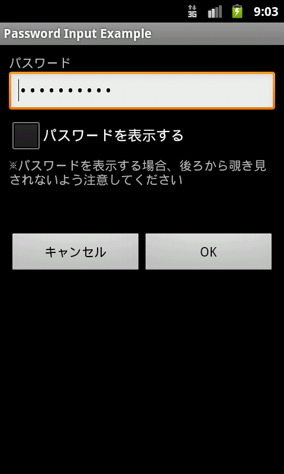
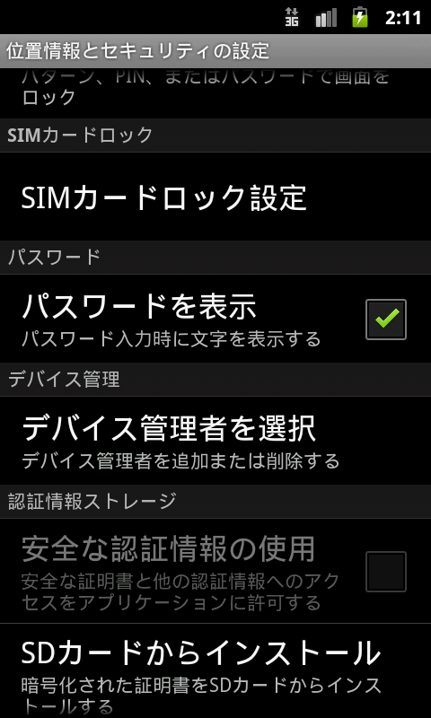
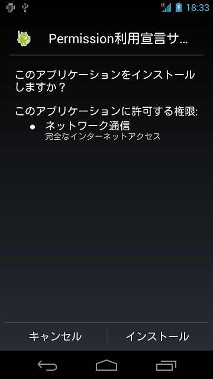

セキュリティ機能の使い方
========================

暗号や電子署名、Permissionなど、Androidにはさまざまなセキュリティ機能が用意されている。これらのセキュリティ機能は取り扱いを間違えるとセキュリティ機能が十分に発揮されず抜け道ができてしまう。この章では開発者がセキュリティ機能を活用するシーンを想定した記事を扱う。

パスワード入力画面を作る
------------------------

### サンプルコード<!-- fac12c7b -->

パスワード入力画面を作る際、セキュリティ上考慮すべきポイントについて述べる。ここではパスワードの入力に関する内容のみとする。パスワードの保存方法については今後の版にて別途記事を設ける予定である。


```eval_rst
.. {width="2.0in"
.. height="3.345138888888889in"}
```

図 5.1‑1

ポイント：

1.  入力したパスワードはマスク表示（●で表示）する
2.  パスワードを平文表示するオプションを用意する
3.  パスワード平文表示時の危険性を注意喚起する

ポイント：　前回入力したパスワードを扱う場合には上記ポイントに加え、下記ポイントにも気を付けること

4.  Activity初期表示時に前回入力したパスワードがある場合、前回入力パスワードの桁数を推測されないよう固定桁数の●文字でダミー表示する
5.  前回入力パスワードをダミー表示しているとき、「パスワードを表示」した場合、前回入力パスワードをクリアして、新規にパスワードを入力できる状態とする
6.  前回入力パスワードをダミー表示しているとき、ユーザーがパスワードを入力しようとした場合、前回入力パスワードをクリアし、ユーザーの入力を新たなパスワードとして扱う

password_activity.xml
```eval_rst
.. literalinclude:: CodeSamples/Password PasswordInputUI.app.src.main.res.layout.password_activity.xml
   :language: xml
   :encoding: shift-jis
```


次のPasswordActivity.javaの最後に配置した3つのメソッドは用途に合わせて実装内容を調整すること。

-   private String getPreviousPassword()

-   private void onClickCancelButton(View view)

-   private void onClickOkButton(View view)

PasswordActivity.java
```eval_rst
.. literalinclude:: CodeSamples/Password PasswordInputUI.PasswordActivity.java
   :language: java
   :encoding: shift-jis
```


### ルールブック<!-- c4ed2029 -->

パスワード入力画面を作る際には以下のルールを守ること。

1.  パスワードを入力するときにはマスク表示（●で表示する）機能を用意する （必須）

1.  パスワードを平文表示するオプションを用意する （必須）

2.  Activity起動時はパスワードをマスク表示にする （必須）

3.  前回入力したパスワードを表示する場合、ダミーパスワードを表示する （必須）

#### パスワードを入力するときにはマスク表示（●で表示する）機能を用意する （必須）

スマートフォンは電車やバス等の人混みで利用されることが多く、第三者にパスワードを盗み見られるリスクが大きい。アプリの仕様として、パスワードをマスク表示する機能が必要である。

パスワードを入力するEditTextをマスク表示する方法には、静的にレイアウトXMLで指定する方法と、動的にプログラム上で切り替える方法の2種類がある。前者は、android:inputType属性に\"textPassword\"を指定することで実現でき、またandroid:password属性でも実現できる。後者は、EditTextクラスのsetInputType()メソッドでEditTextの入力タイプにInputType.TYPE\_TEXT\_VARIATION\_PASSWORDを追加することで実装できる。

以下、それぞれのサンプルコードを示す。

レイアウトXMLで指定する方法

password_activity.xml
```xml
    <!-- パスワード入力項目 -->
    <!-- android:passwordをtrueに設定する -->
    <EditText
        android:id="@+id/password_edit"
        android:layout_width="fill_parent"
        android:layout_height="wrap_content"
        android:hint="@string/hint_password"
        android:inputType="textPassword" />
```

Activity内で指定する方法

PasswordActivity.java
```java
        // パスワード表示タイプを設定
        // InputTypeにTYPE_TEXT_VARIATION_PASSWORDを設定する
        EditText passwordEdit = (EditText) findViewById(R.id.password_edit);
        int type = InputType.TYPE_CLASS_TEXT
                | InputType.TYPE_TEXT_VARIATION_PASSWORD;
        passwordEdit.setInputType(type);
```

#### パスワードを平文表示するオプションを用意する （必須）

スマートフォンにおけるパスワード入力はタッチパネルでの入力となるため、PC
でキーボード入力する場合と比較すると誤入力が生じやすい。その入力の煩わしさからユーザーは単純なパスワードを利用してしまう可能性があり、かえって危険である。また複数回のパスワード入力失敗によりアカウントをロックするなどのポリシーがある場合、誤入力はできるだけ避けるようにする必要もある。それらの解決策として、パスワードを平文表示できるオプションを用意することで、安全なパスワードを利用してもらえるようになる。

ただし、パスワードを平文表示した際に覗き見される可能性もあるため、そのオプションを使う際に、ユーザーに背後からの覗き見への注意を促す必要がある。また、平文表示するオプションをつけた場合、平文表示の時間を設定するなど平文表示の自動解除を行う仕組みも用意する必要がある。パスワードの平文表示の制限については今後の版にて別途記事を設ける予定である。そのため、この版のサンプルコードにはパスワードの平文表示の制限は含めていない。


図 5.1‑2

EditTextのInputType指定で、マスク表示と平文表示を切り替えることができる

PasswordActivity.java
```java
    /**
     * パスワードの表示オプションチェックを変更した場合の処理
     */
    private class OnPasswordDisplayCheckedChangeListener implements
            OnCheckedChangeListener {

        public void onCheckedChanged(CompoundButton buttonView,
                boolean isChecked) {
            // ★ポイント5★ ダミー表示時は空表示にする
            if (mIsDummyPassword && isChecked) {
                // ダミーパスワードフラグを設定する
                mIsDummyPassword = false;
                // パスワードを空表示にする
                mPasswordEdit.setText(null);
            }

            // カーソル位置が最初に戻るので今のカーソル位置を記憶する
            int pos = mPasswordEdit.getSelectionStart();

            // ★ポイント2★ チェックに応じてパスワードを平文表示する
            // InputTypeの作成
            int type = InputType.TYPE_CLASS_TEXT;
            if (isChecked) {
                // チェックON時は平文表示
                type |= InputType.TYPE_TEXT_VARIATION_VISIBLE_PASSWORD;
            } else {
                // チェックOFF時はマスク表示
                type |= InputType.TYPE_TEXT_VARIATION_PASSWORD;
            }

            // パスワードEditTextにInputTypeを設定
            mPasswordEdit.setInputType(type);

            // カーソル位置を設定する
            mPasswordEdit.setSelection(pos);
        }

    }
```

#### Activity起動時はパスワードをマスク表示にする （必須）

意図せずパスワード表示してしまい、第三者に見られることを防ぐため、Activity起動時にパスワードを表示するオプションのデフォルト値はオフにするべきである。デフォルト値は安全側に定めるのが基本である。

#### 前回入力したパスワードを表示する場合、ダミーパスワードを表示する （必須）

前回入力したパスワードを指定する場合、第三者にパスワードのヒントを与えないように、固定文字数のマスク文字（●など）でダミー表示するべきである。また、ダミー表示時に「パスワードを表示する」とした場合は、パスワードをクリアしてから平文表示モードにする。これにより、スマートフォンが盗難される等によって第三者の手に渡ったとしても前回入力したパスワードが盗み見られる危険性を低く抑えることができる。なお、ダミー表示時にユーザーがパスワードを入力しようとした場合には、ダミー表示を解除して通常の入力状態に戻す必要がある。

前回入力したパスワードを表示する場合、ダミーパスワードを表示する

PasswordActivity.java
```java
    @Override
    public void onCreate(Bundle savedInstanceState) {

        // ～省略～

        // 前回入力パスワードがあるか
        if (getPreviousPassword() != null) {
            // ★ポイント4★ 前回入力パスワードがある場合はダミーパスワードを表示する

            // 表示はダミーパスワードにする
            mPasswordEdit.setText("**********");
            // パスワード入力時にダミーパスワードをクリアするため、テキスト変更リスナーを設定
            mPasswordEdit.addTextChangedListener(new PasswordEditTextWatcher());
            // ダミーパスワードフラグを設定する
            mIsDummyPassword = true;
        }

        // ～省略～

    }

    /**
     * 前回入力パスワードを取得する
     *
     * @return 前回入力パスワード
     */
    private String getPreviousPassword() {
        // 保存パスワードを復帰させたい場合にパスワード文字列を返す
        // パスワードを保存しない用途ではnullを返す
        return "hirake5ma";
    }
```

ダミー表示時は、パスワードを表示するオプションをオンにすると表示内容をクリアする

PasswordActivity.java
```java
    /**
     * パスワードの表示オプションチェックを変更した場合の処理
     */
    private class OnPasswordDisplayCheckedChangeListener implements
            OnCheckedChangeListener {

        public void onCheckedChanged(CompoundButton buttonView,
                boolean isChecked) {
            // ★ポイント5★ ダミー表示時は空表示にする
            if (mIsDummyPassword && isChecked) {
                // ダミーパスワードフラグを設定する
                mIsDummyPassword = false;
                // パスワードを空表示にする
                mPasswordEdit.setText(null);
            }

            // ～省略～

        }

    }
```

ダミー表示時にユーザーがパスワードを入力した場合には、ダミー表示を解除する

PasswordActivity.java
```java
    // 状態保存用のキー
    private static final String KEY_DUMMY_PASSWORD = "KEY_DUMMY_PASSWORD";

    // ～省略～

    // パスワードがダミー表示かを表すフラグ
    private boolean mIsDummyPassword;

    @Override
    public void onCreate(Bundle savedInstanceState) {

        // ～省略～

        // 前回入力パスワードがあるか
        if (getPreviousPassword() != null) {
            // ★ポイント4★ 前回入力パスワードがある場合はダミーパスワードを表示する

            // 表示はダミーパスワードにする
            mPasswordEdit.setText("**********");
            // パスワード入力時にダミーパスワードをクリアするため、テキスト変更リスナーを設定
            mPasswordEdit.addTextChangedListener(new PasswordEditTextWatcher());
            // ダミーパスワードフラグを設定する
            mIsDummyPassword = true;
        }

        // ～省略～

    }

    @Override
    public void onSaveInstanceState(Bundle outState) {
        super.onSaveInstanceState(outState);

        // 画面の縦横変更でActivityが再生成されないよう指定した場合には不要
        // Activityの状態保存
        outState.putBoolean(KEY_DUMMY_PASSWORD, mIsDummyPassword);
    }

    @Override
    public void onRestoreInstanceState(Bundle savedInstanceState) {
        super.onRestoreInstanceState(savedInstanceState);

        // 画面の縦横変更でActivityが再生成されないよう指定した場合には不要
        // Activityの状態の復元
        mIsDummyPassword = savedInstanceState.getBoolean(KEY_DUMMY_PASSWORD);
    }

    /**
     * パスワードを入力した場合の処理
     */
    private class PasswordEditTextWatcher implements TextWatcher {

        public void beforeTextChanged(CharSequence s, int start, int count,
                int after) {
            // 未使用
        }

        public void onTextChanged(CharSequence s, int start, int before,
                int count) {
            // ★ポイント6★ ダミー表示時にパスワードを再入力した場合は入力内容に応じた表示にする
            if (mIsDummyPassword) {
                // ダミーパスワードフラグを設定する
                mIsDummyPassword = false;
                // パスワードを入力した文字だけにする
                CharSequence work = s.subSequence(start, start + count);
                mPasswordEdit.setText(work);
                // カーソル位置が最初に戻るので最後にする
                mPasswordEdit.setSelection(work.length());
            }
        }

        public void afterTextChanged(Editable s) {
            // 未使用
        }

    }
```

### アドバンスト<!-- c699a7d7 -->

#### ログイン処理について

パスワード入力が求められる場面の代表例はログイン処理である。ログイン処理で気を付けるポイントをいくつか紹介する。

##### ログイン失敗時のエラーメッセージ

ログイン処理ではID（アカウント）とパスワードの2つの情報を入力する。ログイン失敗時にはIDが存在しない場合と、IDは存在するがパスワードが間違っている場合の2つがある。ログイン失敗のメッセージでこの2つの場合を区別して表示すると、攻撃者は「指定したIDが存在するか否か」を推測できてしまう。このような推測を許さないためにも、ログイン失敗時のメッセージでは、上記2つの場合を区別せずに下記のように表示すべきである。

メッセージ例： ログインID または パスワード が間違っています。

##### 自動ログイン機能

一度、ログイン処理が成功すると次回以降はログインIDとパスワードの入力を省略して、自動的にログインを行う機能がある。自動ログイン機能は煩わしい入力が省略できるので利便性が高まるが、その反面スマートフォンが盗難された場合に第三者に悪用されるリスクが伴う。

第三者に悪用された場合の被害が受け入れられる用途か、十分なセキュリティ対策が可能な場合にのみ、自動ログイン機能は利用することができる。例えば、オンラインバンキングアプリの場合、第三者に端末を操作されると金銭的な被害が出るので自動ログイン機能に合わせてセキュリティ対策が必須となる。対策としては、「決済処理などの金銭的な処理が発生する直前にはパスワードの再入力を求める」、「自動ログイン設定時にユーザーに対して十分に注意を喚起し、確実な端末のロックを促す」などいくつか考えられる。自動ログインの利用にあたっては、これらの対策を前提に利便性とリスクを勘案して、慎重な検討を行うべきである。

#### パスワード変更について

一度設定したパスワードを別のパスワードに変更する場合、以下の入力項目を画面上に用意すべきである。

-   現在のパスワード

-   新しいパスワード

-   新しいパスワード（入力確認用）

自動ログイン機能がついている場合、第三者がアプリを利用できる可能性がある。その場合、勝手にパスワードを変更されないよう、現在のパスワードの入力を求める必要がある。また、新しいパスワードが入力ミスで使用不能に陥る危険を減らすため、新しいパスワードは2回、入力を求める必要がある。

#### システムの「パスワードを表示」設定メニューについて

Androidの設定メニューの中に「パスワードを表示」という設定がある。
```
設定 >セキュリティ > パスワードを表示
```

Android 5.0より前のバージョンまで、この手順で設定できる。ただしAndroid
5.0以降では、「パスワードを表示」はチェックボックスからトグルボタンに変更されている。


```eval_rst
.. {width="1.6598425196850393in"
.. height="2.7598425196850394in"}
```

図 5.1‑3

「パスワードを表示」設定をオンにすると最後に入力した１文字が平文表示となる。一定時間（2秒程度）経過後、または次の文字が入力されると平文表示されていた文字はマスク表示される。オフにすると、入力直後からマスク表示となる。これはシステム全体に影響する設定であり、EditTextのパスワード表示機能を使用しているすべてのアプリに適用される。


図 5.1‑4

#### スクリーンキャプチャの無効化

パスワード入力画面ではパスワードなどの個人情報が画面上に表示される可能性がある。そのような画面では第三者によってスクリーンキャプチャから個人情報が流出してしまう恐れがある。よってパスワード入力画面などの個人情報が表示されてしまう恐れのある画面ではスクリーンキャプチャを無効にしておく必要がある。スクリーンキャプチャの無効化はWindowManagerにaddFlagでFLAG\_SECUREを設定することで実現できる。

PermissionとProtection Level
----------------------------

PermissionのProtection Levelにはnormal, dangerous, signature,
signatureOrSystemの4種類がある。その他に「development」「system」「appop」も存在するが、一般的なアプリでは使用しないので本章での説明は省略する。PermissionはどのProtection
Levelであるかによってそれぞれ、Normal Permission, Dangerous Permission,
Signature Permission, SignatureOrSystem
Permissionと呼ばれる。以下、このような名称を使う。

### サンプルコード<!-- 93d9a76c -->

#### Android　OS既定のPermissionを利用する方法
```eval_rst
Android OSは電話帳やGPSなどのユーザー資産をマルウェアから保護するためのPermissionというセキュリティの仕組みがある。Android
OSが保護対象としている、こうした情報や機能にアクセスするアプリは、明示的にそれらにアクセスするための権限（Permission）を利用宣言しなければならない。ユーザー確認が必要なPermissionでは、そのPermissionを利用宣言したアプリがインストールされるときに次のようなユーザー確認画面が表示される [27]_。

.. [27] Android 6.0(API Level 23)以降では、ユーザー確認と権限の付与はインストール時に行われず、アプリの実行中に権限の利用を要求する仕様に変更された。詳細は「5.2.1.4 Android 6.0以降でDangerous Permissionを利用する方法」および「5.2.3.6 Android 6.0以降のPermissionモデルの仕様変更について」を参照すること。
```


```eval_rst
.. {width="1.8645833333333333in"
.. height="3.34375in"}
```

図 5.2‑1

この確認画面により、ユーザーはそのアプリがどのような機能や情報にアクセスしようとしているのかを知ることができる。もし、アプリの動作に明らかに不必要な機能や情報にアクセスしようとしている場合は、そのアプリは悪意があるアプリの可能性が高い。ゆえに自分のアプリがマルウェアであると疑われないためにも、利用宣言するPermissionは最小限にしなければならない。

ポイント：

1.  利用するPermissionをAndroidManifest.xmlにuses-permissionで利用宣言する
2.  不必要なPermissionは利用宣言しない

AndroidManifest.xml
```eval_rst
.. literalinclude:: CodeSamples/Permission UsesPermission.app.src.main.AndroidManifest.xml
   :language: xml
   :encoding: shift-jis
```

#### 独自定義のSignature Permissionで自社アプリ連携する方法

Android
OSが定義する既定のPermissionの他に、アプリが独自にPermissionを定義することができる。独自定義のPermission（正確には独自定義のSignature　Permission）を使えば、自社アプリだけが連携できる仕組みを作ることができる。複数の自社製アプリをインストールした場合に、それぞれのアプリの単機能に加え、アプリ間連携による複合機能を提供することで、複数の自社製アプリをシリーズ販売して収益を上げる、といった用途がある。

サンプルプログラム「独自定義Signature
Permission（UserApp）」はサンプルプログラム「独自定義Signature
Permission（ProtectedApp）」にstartActivity()する。両アプリは同じ開発者鍵で署名されている必要がある。もし署名した開発者鍵が異なる場合は、UserAppはIntentを送信せず、ProtectedAppは受信したIntentを処理しない。またアドバンストセクションで説明しているインストール順序によるSignature
Permission回避の問題にも対処している。


```eval_rst
.. {width="6.889763779527559in"
.. height="2.0933070866141734in"}
```

図 5.2‑2

ポイント：Componentを提供するアプリ

1.  独自PermissionをprotectionLevel=\"signature\"で定義する
2.  Componentにはpermission属性で独自Permission名を指定する
3.  ComponentがActivityの場合にはintent-filterを定義しない
4.  ソースコード上で、独自定義Signature Permissionが自社アプリにより定義されていることを確認する
5.  Componentを利用するアプリと同じ開発者鍵でAPKを署名する

AndroidManifest.xml
```eval_rst
.. literalinclude:: CodeSamples/Permission CustomSignaturePermission ProtectedApp.permissionCustomSignaturePermissionProtectedApp.src.main.AndroidManifest.xml
   :language: xml
   :encoding: shift-jis
```

ProtectedActivity.java
```eval_rst
.. literalinclude:: CodeSamples/Permission CustomSignaturePermission ProtectedApp.ProtectedActivity.java
   :language: java
   :encoding: shift-jis
```


SigPerm.java
```eval_rst
.. literalinclude:: CodeSamples/JSSEC Shared.SigPerm.java
   :language: java
   :encoding: shift-jis
```

PkgCert.java
```eval_rst
.. literalinclude:: CodeSamples/JSSEC Shared.PkgCert.java
   :language: java
   :encoding: shift-jis
```


★ポイント5★ Android Studioからメニュー：Build -\> Generated Signed
APKと選択し、Componentを提供するアプリと同じ開発者鍵で署名する。


```eval_rst
.. {width="4.646481846019247in"
.. height="3.2817082239720037in"}
```

図 5.2‑3

ポイント：Componentを利用するアプリ

6.  独自定義Signature Permissionは定義しない
7.  uses-permissionにより独自Permissionを利用宣言する
8.  ソースコード上で、独自定義Signature Permissionが自社アプリにより定義されていることを確認する
9.  利用先アプリが自社アプリであることを確認する
10.  利用先ComponentがActivityの場合、明示的Intentを使う
11.  Componentを提供するアプリと同じ開発者鍵でAPKを署名する

AndroidManifest.xml
```eval_rst
.. literalinclude:: CodeSamples/Permission CustomSignaturePermission UserApp.permissionCustomSignaturePermissionUserApp.src.main.AndroidManifest.xml
   :language: xml
   :encoding: shift-jis
```

UserActivity.java
```eval_rst
.. literalinclude:: CodeSamples/Permission CustomSignaturePermission UserApp.UserActivity.java
   :language: java
   :encoding: shift-jis
```

PkgCertWhitelists.java
```eval_rst
.. literalinclude:: CodeSamples/JSSEC Shared.PkgCertWhitelists.java
   :language: java
   :encoding: shift-jis
```

PkgCert.java
```eval_rst
.. literalinclude:: CodeSamples/JSSEC Shared.PkgCert.java
   :language: java
   :encoding: shift-jis
```


★ポイント11★ Android Studioからメニュー：Build -\> Generated Signed
APKと選択し、Componentを提供するアプリと同じ開発者鍵で署名する。


```eval_rst
.. {width="4.646481846019247in"
.. height="3.2817082239720037in"}
```

図 5.2‑4

#### アプリの証明書のハッシュ値を確認する方法

このガイド文書の各所で出てくるアプリの証明書のハッシュ値を確認する方法を紹介する。厳密には「APKを署名するときに使った開発者鍵の公開鍵証明書のSHA256ハッシュ値」を確認する方法である。

##### Keytoolにより確認する方法

JDKに付属するkeytoolというプログラムを利用すると開発者鍵の公開鍵証明書のハッシュ値（証明書のフィンガープリントとも言う）を求めることができる。ハッシュ値にはハッシュアルゴリズムの違いによりMD5やSHA1、SHA256など様々なものがあるが、このガイド文書では暗号ビット長の安全性を考慮してSHA256の利用を推奨している。残念なことにAndroid
SDKで利用されているJDK6に付属するkeytoolはSHA256でのハッシュ値出力に対応しておらず、JDK7以降に付属するkeytoolを使う必要がある。

Androidのデバッグ証明書の内容をkeytoolで出力する例
```shell
> keytool -list -v -keystore <キーストアファイル> -storepass <パスワード>

キーストアのタイプ: JKS
キーストア・プロバイダ: SUN

キーストアには1エントリが含まれます

別名: androiddebugkey
作成日: 2012/01/11
エントリ・タイプ: PrivateKeyEntry
証明書チェーンの長さ: 1
証明書[1]:
所有者: CN=Android Debug, O=Android, C=US
発行者: CN=Android Debug, O=Android, C=US
シリアル番号: 4f0cef98
有効期間の開始日: Wed Jan 11 11:10:32 JST 2012終了日: Fri Jan 03 11:10:32 JST 2042
証明書のフィンガプリント:
         MD5:  9E:89:53:18:06:B2:E3:AC:B4:24:CD:6A:56:BF:1E:A1
         SHA1: A8:1E:5D:E5:68:24:FD:F6:F1:ED:2F:C3:6E:0F:09:A3:07:F8:5C:0C
         SHA256: FB:75:E9:B9:2E:9E:6B:4D:AB:3F:94:B2:EC:A1:F0:33:09:74:D8:7A:CF:42:58:22:A2:56:85:1B:0F:85:C6:35
         署名アルゴリズム名: SHA1withRSA
         バージョン: 3


*******************************************
*******************************************
```

##### JSSEC証明書ハッシュ値チェッカーにより確認する方法

JDK7以降をインストールしなくても、JSSEC証明書ハッシュ値チェッカーを使えば簡単に証明書ハッシュ値を確認できる。


```eval_rst
.. {width="3.93125in"
.. height="2.2180555555555554in"}
```

図 5.2‑5

これは端末にインストールされているアプリの証明書ハッシュ値を一覧表示するAndroidアプリである。上図中、「sha-256」の右に表示されている16進数文字列64文字が証明書ハッシュ値である。このガイド文書と一緒に配布しているサンプルコードの「JSSEC
CertHash
Checker」フォルダがそのソースコード一式である。ビルドして活用していただきたい。

#### Android 6.0以降でDangerous Permissionを利用する方法

アプリに対するPermission付与のタイミングについて、Android 6.0(API Level
23)でアプリの実装にかかわる仕様変更が行われた。

Android 5.1(API Level 22)以前のPermissionモデル（「5.2.3.6 Android
6.0以降のPermissionモデルの仕様変更について」参照）では、アプリが利用宣言しているPermissionは全てアプリのインストール時に付与される。しかし、Android
6.0以降では、Dangerous
Permissionについてはアプリが適切なタイミングでPermissionを要求するよう、アプリ開発者が明示的に実装しなければならない。アプリがPermissionを要求すると、Android
OSはユーザーに対して下記のような確認画面を表示し、そのPermissionの利用を許可するかどうかの判断を求めることになる。ユーザーがPermissionの利用を許可すれば、アプリはそのPermissionを必要とする処理を実行することができる。


```eval_rst
.. {width="2.0072648731408576in"
.. height="3.571259842519685in"}
```

図 5.2‑6

Permissionを付与する単位にも変更が加えられている。従来はすべてのPermissionが一括して付与されていたが、Android
6.0（API Level 23）以降ではPermission Group毎に、Android 8.0(API Level
26)以降ではPermission個別に付与される。これに伴いユーザー確認画面も個別に表示され、ユーザーはPermission利用の可・不可について従来よりも柔軟に判断できるようになった。アプリ開発者は、Permissionの付与が拒否された場合も考慮して、アプリの仕様や設計を見直す必要がある。

Android 6.0以降のPermissionモデルについての詳細は「5.2.3.6 Android
6.0以降のPermissionモデルの仕様変更について」を参照すること。

ポイント：

1.  アプリで利用するPermissionを利用宣言する
2.  不必要なPermissionは利用宣言しない
3.  Permissionがアプリに付与されているか確認する
4.  Permissionを要求する（ユーザーに許可を求めるダイアログを表示する）
5.  Permissionの利用が許可されていない場合の処理を実装する

AndroidManifest.xml
```eval_rst
.. literalinclude:: CodeSamples/PermissionRequestingPermissionAtRunTime.app.src.main.AndroidManifest.xml
   :language: xml
   :encoding: shift-jis
```


MainActivity.java
```eval_rst
.. literalinclude:: CodeSamples/PermissionRequestingPermissionAtRunTime.MainActivity.java
   :language: java
   :encoding: shift-jis
```


### ルールブック<!-- 9e17b769 -->

独自Permission利用時には以下のルールを守ること。

1.  Android OS規定のDangerous Permissionはユーザーの資産を保護するためにだけ利用する （必須）

1.  独自定義のDangerous Permissionは利用してはならない （必須）

2.  独自定義Signature PermissionはComponentの提供側アプリでのみ定義する （必須）

3.  独自定義Signature Permissionは自社アプリにより定義されていることを確認する （必須）

4.  独自定義のNormal Permissionは利用してはならない （推奨）

5.  独自定義のPermission名はアプリのパッケージ名を拡張した文字列にする （推奨）

#### Android OS規定のDangerous Permissionはユーザーの資産を保護するためにだけ利用する （必須）

独自定義のDangerous Permissionの利用は非推奨（「5.2.2.2
独自定義のDangerous Permissionは利用してはならない
（必須）」参照）のため、ここではAndroid OS規定のDangerous
Permissionを前提に話をする。

Dangerous
Permissionは他の3つのPermissionと異なり、アプリにその権限を付与するかどうかをユーザーに判断を求める機能がある。Dangerous
Permissionを利用宣言しているアプリを端末にインストールするとき、次のような画面が表示される。これにより、そのアプリがどのような権限（Dangerous
PermissionおよびNormal
Permission）を利用しようとしているのかをユーザーが知ることができる。ユーザーが「インストール」をタップすることで、そのアプリは利用宣言した権限が付与され、インストールされるようになっている。


```eval_rst
.. {width="1.6666666666666667in"
.. height="2.7736111111111112in"}
```

図 5.2‑7

アプリの中には、ユーザーの資産とアプリ開発者が保護したい資産がある。それらのうち、Dangerous
Permissionで保護できるのはユーザーの資産だけであることに注意が必要である。なぜなら、権限の付与がユーザーの判断に委ねられているためである。一方、アプリ開発者が保護したい資産については、この方法では保護できない。

例えば、自社アプリだけと連携するComponentは他社アプリからのアクセスを禁止したい場合を考える。このようなComponentをDangerous
Permissionにより保護するように実装したとする。他社アプリがインストールされるときに、ユーザーの判断により他社アプリに対して権限の付与を許可してしまうと、保護すべき自社の資産が他社アプリに悪用される危険が生じる。このような場合に自社の資産を保護するためには、独自定義のSignature
Permissionを使うとよい。

#### 独自定義のDangerous Permissionは利用してはならない （必須）

独自定義のDangerous
Permissionを使用しても、インストール時に「ユーザーに権限の許可を求める」画面が表示されない場合がある。つまりDangerous
Permissionの特徴であるユーザーに判断を求める機能が働かないことがあるのだ。よって本ガイドでは「独自定義のDangerous
Permissionを利用しない」ことをルールとする。

まず説明のために2つのアプリを想定する。1つは独自のDangerous
Permissionを定義し、このPermissionにより保護したComponentを公開するアプリである。これをProtectedAppとする。もう1つはProtectedAppのComponentを悪用しようとする別のアプリでこれをAttackerAppとする。ここでAttackerAppはProtectedAppが定義したPermissionの利用宣言とともに同じPermissionの定義も行っているものとする。

AttackerAppがユーザーの許可なしにProtectedAppのComponentを利用できてしまうケースは以下のような場合に起きる。

1.  ユーザーがまずAttackerAppをインストールすると、Dangerous
    Permissionの利用許可を求める画面は表示されずに、そのままインストールが完了してしまう

2.  次にProtectedAppをインストールすると、ここでも特に警告もなくインストールできてしまう

3.  その後、ユーザーがAttackerAppを起動すると、AttackerAppはユーザーの気づかぬうちにProtectedAppのComponentにアクセスできてしまい、場合によっては被害に繋がる

このケースの原因は次の通りである。先にAttackerAppをインストールしようとするとuses-permissionにより利用宣言されたPermissionはまだその端末上では定義されていない。このときAndroid
OSはエラーとすることもなくインストールを続行してしまう。Dangerous
Permissionのユーザー確認はインストール時だけしか実施されないため、一度インストールされたアプリは権限を許可されたものとして扱われる。したがって後からインストールされるアプリのComponentを同名のDangerous
Permissionで保護していた場合、ユーザーの許可なく先にインストールされたアプリからそのComponentが利用できてしまうのである。

なお、Android OS既定のDangerous
Permissionはアプリがインストールされるときにはその存在が保証されているので、uses-permissionしているアプリがインストールされるときには必ずユーザー確認画面が表示される。独自定義のDangerous
Permissionの場合にだけこの問題は生じる。

現在、このケースでComponentへのアクセスを防止するよい方法は見つかっていない。したがって、独自定義のDangerous
Permissionは利用してはならない。

#### 独自定義Signature PermissionはComponentの提供側アプリでのみ定義する （必須）

自社アプリ間で連携する場合、実行時にSignature
Permissionをチェックすることでセキュリティを担保できることを「5.2.1.2
独自定義のSignature
Permissionで自社アプリ連携する方法」で例示した。この仕組みを利用する際には、Protection
LevelがSignatureの独自Permissionの定義は、Component提供側アプリのAndroidManifest.xmlでのみ行い、利用側アプリでは独自のSignature
Permissionを定義してはならない。

なお、signatureOrSystem　Permissionについても同様である。

以下がその理由となる。

提供側アプリより先にインストールされた利用側アプリが複数あり、どの利用側アプリも独自定義Permissionの利用宣言とともにPermissionの定義もしている場合を考える。この状況で提供側アプリをインストールすると、すべての利用側アプリから提供側アプリにアクセスすることが可能になる。次に、最初にインストールした利用側アプリをアンインストールすると、Permissionの定義が削除され、Permissionが未定義となる。そのため、残った利用側アプリからの提供側アプリの利用が不可能となってしまう。

このように、利用側アプリでPermissionの定義を行うと思わぬPermissionの未定義状態が発生するので、Permissionの定義は保護するComponentの提供側アプリのみ行い、利用側アプリでPermissionを定義するのは避けなければならない。

```eval_rst
こうすることで、提供側アプリのインストール時に権限付与が行われ、かつ、アンインストール時にPermissionが未定義となり、提供側アプリとPermissionの定義の存在期間が必ず一致するので、適正なComponentの提供と保護が可能である。
なお、独自定義Signature Permissionに関しては、連携するアプリのインストール順によらず、利用側アプリにPermission利用権限が付与されるため、この議論が成り立つことに注意 [28]_。

.. [28] Normal/Dangerous
    Permissionを利用する場合には、Permissionが未定義のまま利用側アプリが先にインストールされると、利用側アプリへの権限の付与が行われず、提供側アプリがインストールされた後もアクセスができない
```

#### 独自定義Signature Permissionは自社アプリにより定義されていることを確認する （必須）

AnroidManifest.xmlでSignature
Permissionを宣言し、ComponentをそのPermissionで保護しただけでは、実は保護が十分ではない。この詳細はアドバンストセクションの「5.2.3.1
独自定義Signature Permissionを回避できるAndroid
OSの特性とその対策」を参照すること。

以下、独自定義Signature Permissionを安全に正しく使う手順である。

まず、AndroidManifest.xmlにて次を行う。

1.  保護したいComponentのあるアプリのAndroidManifest.xmlにて、独自Signature
    Permissionを定義する（Permissionの定義）<br/>
    例： \<permission android:name="xxx"
    android:protectionLevel="signature" /\>

2.  保護したいComponentのあるAndroidManifest.xmlにて、そのComponentの定義タグのpermission属性で、独自定義Signature Permissionを指定する（Permissionの要求宣言）<br/>
    例： \<activity android:permission="xxx" ... \>...\</activity\>

3.  保護したいComponentにアクセスする連携アプリのAndroidManifest.xmlにて、uses-permissionタグに独自定義Signature
    Permissionを指定する（Permissionの利用宣言）<br/>
    例： \<uses-permission android:name="xxx" /\>

続いて、ソースコード上にて次を実装する。

4.  保護したいComponentでリクエストを処理する前に、独自定義したSignature Permissionが自社アプリにより定義されたものかどうかを確認し、そうでなければリクエストを無視する（Component提供側による保護）

5.  保護したいComponentにアクセスする前に、独自定義したSignature Permissionが自社アプリにより定義されたものかどうかを確認し、そうでなければComponentにアクセスしない（Component利用側による保護）

最後にAndroid Studioの署名機能にて次を行う。

6.  連携するすべてのアプリのAPKを同じ開発者鍵で署名する

ここで「独自定義したSignature Permissionが、自社アプリにより定義されたものかどうかを確認」する必要があるが、具体的な実装方法についてはサンプルコードセクションの「5.2.1.2 独自定義のSignature Permissionで自社アプリ連携する方法」を参照すること。

なお、signatureOrSystem　Permissionについても同様である。

#### 独自定義のNormal Permissionは利用してはならない （推奨）

Normal Permissionを利用するアプリはAndroid Manifest.xmlにuses-permissionで利用宣言するだけでその権限を得ることができる。そのため、一度インストールされてしまったマルウェアからComponentを保護するような目的にNormal Permissionは利用できない。

さらに独自定義Normal Permissionを用いてアプリ間連携を行う場合、連携する各アプリへのPermissionの付与はインストール順に依存する。例えば、Permissionを定義したコンポーネントを持つアプリよりも先にそのPermissionを利用宣言したアプリをインストールすると、Permissionを定義したアプリをインストールした後も利用側アプリはPermissionで保護されたコンポーネントにアクセスすることができない。

インストール順によりアプリ間連携ができなくなる問題を回避する方法として、連携する全てのアプリにPermissionを定義することも考えられる。そうすることにより最初に利用側アプリがインストールされた場合でも、全ての利用側アプリが提供側アプリにアクセスすることが可能となる。しかし、最初にインストールした利用側アプリがアンインストールされた際にPermissionが未定義な状態となり、他に利用側アプリが存在していても、それらのアプリから提供側アプリにアクセスすることができなくなってしまうのである。

以上のようにアプリの可用性が損なわれる恐れがあることから、独自定義Normal Permissionの利用は控えるべきである。

#### 独自定義のPermission名はアプリのパッケージ名を拡張した文字列にする （推奨）

複数のアプリが同じ名前でPermissionを定義する場合、先にインストールされたアプリが定義するProtection Levelが適用される。先にインストールされたアプリがNormal Permissionを定義し、後にインストールされたアプリが同じ名前でSignature
Permissionを定義した場合、Signature Permissionによる保護がまったく効かない。悪意がない場合でも、複数のアプリにおいてPermission名が衝突して意図しないProtection Levelで動作する可能性がある。このような事故を防ぐため、Permission名にはアプリのパッケージ名を入れた方が良い。

```
(パッケージ名).permission.(識別する文字列)
```

例えば、org.jssec.android.sampleというパッケージにREADアクセスのPermissionを定義するならば、次の様な命名が好ましい。

```java
org.jssec.android.sample.permission.READ
```

### アドバンスト<!-- 8340873a -->

#### 独自定義Signature Permissionを回避できるAndroid OSの特性とその対策

独自定義Signature Permissionは、同じ開発者鍵で署名されたアプリ間だけでアプリ間連携を実現するPermissionである。開発者鍵はプライベート鍵であり絶対に公開してはならないものであるため、Signature Permissionによる保護は自社アプリだけで連携する場合に使われることが多い。

まずは、AndroidのDev Guide（[http://developer.android.com/guide/topics/security/security.html](http://developer.android.com/guide/topics/security/security.html)）で説明されている独自定義Signature Permissionの基本的な使い方を紹介する。ただし、後述するように、この使い方にはPermission回避の問題があることが分かっており、本ガイドに掲載した対策が必要となる。

以下、独自定義Signature Permissionの基本的な使い方である。

1.  保護したいComponentのあるアプリのAndroidManifest.xmlにて、独自Signature Permissionを定義する<br/>
例： \<permission android:name="xxx" android:protectionLevel="signature" />

2.  保護したいComponentを持つアプリのAndroidManifest.xmlで、保護したいComponentにandroid:permission属性を指定し、1.で定義したSignature Permissionを要求する<br/>
例： \<activity android:permission="xxx" ... \>...\</activity\>

3.  保護したいComponentにアクセスしたい連携アプリのAndroidManifest.xmlにて、独自定義Signature Permissionを利用宣言する<br/>
例： \<uses-permission android:name="xxx" /\>

4.  連携するすべてのアプリのAPKを同じ開発者鍵で署名する

実は、この使い方だけでは、次の条件が成立するとSignature Permission回避の抜け道ができてしまう。

説明のために独自定義のSignature Permissionで保護したアプリをProtectedAppとし、ProtectedAppとは異なる開発者鍵で署名したアプリをAttackerAppとする。
ここでSignature Permission回避の抜け道とは、AttackerAppは署名が一致していないにもかかわらず、ProtectedAppのComponentにアクセス可能になることである。

条件1.  AttackerAppもProtectedAppが独自定義したSignature Permissionと同じ名前でNormal Permissionを定義する（厳密にはSignature
    Permissionでも構わない）<br/>
例: \<permission android:name=\" xxx \" android:protectionLevel=\"normal\" /\>

条件2.  AttackerAppは独自定義したNormal Permissionをuses-permissionで利用宣言する<br/>
例: \<uses-permission android:name=\"xxx\" /\>

条件3.  AttackerAppをProtectedAppより先に端末にインストールする


```eval_rst
.. {width="6.5in" height="4.270833333333333in"}
```

図 5.2‑8

条件1および条件2の成立に必要なProtectedApp独自定義のPermission名は、APKファイルからAndroidManifest.xmlを取り出せば攻撃者にとって容易に知ることができる。条件3もユーザーを騙すなどの方法により攻撃者にある程度制御の余地がある。

このように独自定義のSignature
Permissionには基本的な使い方だけでは保護を回避されてしまう危険性があり、抜け道をふさぐような対策が必要である。具体的にはルールセクションの「5.2.2.4
独自定義Signature
Permissionは自社アプリにより定義されていることを確認する
（必須）」に掲載している方法で対処できるので、そちらを参照のこと。

#### ユーザーがAndroidManifest.xmlを改ざんする

独自PermissionのProtection
Levelが意図しないものになるケースは既に説明した。そのことによる不具合を防ぐために、Javaのソースコード側で何らかの対応を実施する必要があった。ここでは、AndroidManifest.xmlが改ざんされるという視点から、ソースコード側の対応について述べる。改ざんを検知する簡易な実装例を提示するが、犯罪意識をもって改ざんを行うプロのハッカーに対してはほとんど効果がない方法であることに注意すること。

この節はアプリの改ざんに関するものであり、ユーザー自身が悪意を持っているケースである。本来はガイドラインの範囲外であるが、Permissionに関する事、これを行うツールがアプリとして公開されている事、から「プロでないハッカーに対する簡易な対策」として述べておくことにした。

Androidアプリは、root権限無しに改ざんできることを頭に置いておく必要がある。なぜなら、AndroidManifest.xmlを変更してAPKファイルを再生成、署名するツールが配布されているためである。このツールを使用する事で、誰でも任意のアプリからPermissionを削除することが可能になっている。

事例としてはINTERNET
Permissionを取り除いたAndroidManifest.xmlから別署名のAPKを生成し、アプリに組み込まれた広告モジュールが動作しないようにするケースが多いようである。個人情報がどこかに送信されているかもしれない等の不安が払拭されるということで、この種のツールの存在を評価しているユーザーも存在する。このような行為は、アプリに組み込まれた広告が機能しなくなるため、広告収入を期待している開発者に対して金銭的被害を与える行動であるとも言える。ユーザーのほとんどは罪の意識無くこれらの行為を行っていると思われる。

インターネットPermissionをuses-permissionで宣言しているアプリが、実行時に自身のAndroidManifest.xmlに記載されているPermissionを確認する実装例を次に示す。

```java
public class CheckPermissionActivity extends Activity {
    
    @Override
    public void onCreate(Bundle savedInstanceState) {
        super.onCreate(savedInstanceState);
        setContentView(R.layout.main);
        
        // AndroidManifest.xmlに定義したPermissionを取得
        List<String> list = getDefinedPermissionList();
        
        // 改ざんを検知する
        if( checkPermissions(list) ){
            // OK
            Log.d("dbg", "OK.");
        }else{
            Log.d("dbg", "manifest file is stale.");
            finish();
        }
    }

    /**
     * AndroidManifest.xmlに定義したPermissionをリストで取得する
     * @return
     */
    private List<String> getDefinedPermissionList(){
        List<String> list = new ArrayList<String>();
        list.add("android.permission.INTERNET");
        return list;
    }
    
    /**
     * Permissionが変更されていないことを確認する。
     * @param permissionList
     * @return
     */
    private boolean checkPermissions(List<String> permissionList){
        try {
            PackageInfo packageInfo = getPackageManager().getPackageInfo(
                    getPackageName(), PackageManager.GET_PERMISSIONS);
            String[] permissionArray = packageInfo.requestedPermissions;
            if (permissionArray != null) {
                for (String permission : permissionArray) {
                    if(! permissionList.remove(permission)){
                        // 意図しないPermissionが付加されている
                        return false;
                    }
                }
            }
            
            if(permissionList.size() == 0){
                // OK
                return true;
            }
            
        } catch (NameNotFoundException e) {
        }
        
        return false;
    }
}
```

#### APKの改ざんを検出する

「5.2.3.2
ユーザーがAndroidManifest.xmlを改ざんする」ではユーザーによるPermission改ざんの検出について説明した。しかし、アプリの改ざんはPermissionに限らず、リソースを差し替えて別のアプリとしてマーケットで配布するなど、ソースコードを変更することなく改ざんし流用する事例が多様に存在する。ここではAPKファイルが改ざんされたことを検出するためのより汎用的な方法を紹介する。

APKの改ざんを行うには、APKファイルを一度展開し、内容を改変した後に再びAPKファイルとして再構成する必要がある。その際に改ざん者は元の開発者の鍵を持ち得ないので、改ざん者自身の鍵でAPKを署名することになる。このようにAPKの改ざんには署名(証明書)の変更を伴うため、アプリ起動時にAPKの証明書と予めソースコードに埋め込んだ開発者の証明書を比較することで改ざんの有無を検出することができる。

以下にサンプルコードを示す。なお、実装例のままではプロのハッカーであれば改ざん検出の無効化が容易である。あくまで簡易な実装例であることを念頭においてアプリへの適用を検討するべきである。

ポイント：

1.  主要な処理を行うまでの間に、アプリの証明書が開発者の証明書であることを確認する

SignatureCheckActivity.java
```eval_rst
.. literalinclude:: CodeSamples/Permission ActivitySignatureCheck.SignatureCheckActivity.java
   :language: java
   :encoding: shift-jis
```


PkgCert.java
```eval_rst
.. literalinclude:: CodeSamples/JSSEC Shared.PkgCert.java
   :language: java
   :encoding: shift-jis
```


#### Permissionの再委譲問題

アプリがAndroid
OSに保護されている電話帳やGPSといった情報や機能にアクセスするためにはPermissionを利用宣言しなければならない。Permissionを利用宣言し許可されると、そのアプリにはそのPermissionが委譲されたことになり、そのPermissionにより保護された情報や機能にアクセスできるようになる。

プログラムの組み方によっては、Permissionを委譲された（許可された）アプリはPermissionで保護されたデータを取得し、そのデータを別のアプリに何のPermissionも要求せずに提供することもできてしまう。これはPermissionを持たないアプリがPermissionで保護されたデータにアクセスできることに他ならない。実質的にPermissionを再委譲していることと等価になるので、これをPermissionの再委譲問題と呼ぶ。このようにAndroidのPermissionセキュリティモデルでは、保護されたデータへのアプリからの直接アクセスだけしか権限管理ができないという仕様上の性質がある。

具体例を図
5.2‑9に示す。中央のアプリはandroid.permission.READ\_CONTACTSを利用宣言したアプリが連絡先情報を読み取って自分のDBに蓄積している。何の制限もなくContent
Provider経由で蓄積した情報を他のアプリに提供した場合に、Permissionの再委譲問題が生じる。


```eval_rst
.. {width="5.375in" height="3.8020833333333335in"}
```

図
5.2‑9　Permissionを持たないアプリが連絡先情報を取得する

同様の例として、android.permission.CALL\_PHONEを利用宣言したアプリが、同Permissionを利用宣言していない他のアプリからの任意の電話番号を受け付け、ユーザーの確認もなくその番号に電話を掛けることができるならば、Permissionの再委譲問題がある。

Permissionの利用宣言をして得た情報資産・機能資産をほぼそのままの形で他のアプリに二次提供する場合には、提供先アプリに対し同じPermissionを要求するなどして、元の保護水準を維持しなければならない。また情報資産・機能資産の一部分のみを他のアプリに二次提供する場合には、その情報資産・機能資産の一部分が悪用されたときの被害度合に応じた適切な保護が必要である。たとえば前述と同様に同じPermissionを要求したり、ユーザーへ利用許諾を確認したり、「4.1.1.1
非公開Activityを作る・利用する」「4.1.1.4
自社限定Activityを作る・利用する」などを利用して対象アプリの制限を設けるなどの保護施策がある。

このような再委譲問題はPermissionに限ったことではない。Androidアプリでは、アプリに必要な情報･機能を他のアプリやネットワーク・記憶媒体から調達することが一般に行われている。提供元がAndroidアプリであればPermission、ネットワークであればログイン、記憶媒体であればアクセス制限といったように、それぞれ調達する際に必要な権限や制限が存在することも多い。こうして調達した情報や機能をその所有者であるユーザーから二次的に他のアプリに提供したり、ネットワークや記憶媒体に転送する際には、ユーザーの意図に反した利用がないように慎重に検討してアプリに対策を施すべきである。必要に応じて、Permissionの例と同様に提供先に対して権限の要求や使用の制限を行わなければならない。ユーザーへの利用許諾もその一環である。

以下では、READ\_CONTACTS　Permissionを利用して連絡先DBから一覧を取得したアプリが、情報提供先のアプリに対して同じREAD\_CONTACTS　Permissionを要求する例を示す。

ポイント：

1.  Manifestで提供元と同じPermissionを要求する

AndroidManifest.xml
```xml
<?xml version="1.0" encoding="utf-8"?>
<manifest xmlns:android="http://schemas.android.com/apk/res/android"
    package="org.jssec.android.permission.transferpermission" >

    <uses-permission android:name="android.permission.READ_CONTACTS"/>

    <application
        android:allowBackup="false"
        android:icon="@drawable/ic_launcher"
        android:label="@string/app_name"
        android:theme="@style/AppTheme" >
        <activity
            android:name=".TransferPermissionActivity"
            android:label="@string/title_activity_transfer_permission" >
            <intent-filter>
                <action android:name="android.intent.action.MAIN" />
                <category android:name="android.intent.category.LAUNCHER" />
            </intent-filter>
        </activity>

        <!-- ★ポイント1★ Manifestで提供元と同じPermissionを要求する-->
        <provider
            android:name=".TransferPermissionContentProvider"
            android:authorities="org.jssec.android.permission.transferpermission"
            android:enabled="true"
            android:exported="true"
            android:readPermission="android.permission.READ_CONTACTS" >
        </provider>
    </application>

</manifest>
```


アプリが複数のPermissionを要求する必要がある場合は、上記の方法では解決することができない。ソースコード上でContext\#checkCallingPermission()やPackageManager\#checkPermission()を使用して、呼び出し元のアプリがManifestですべてのPermissionの利用宣言を行っているかどうかを確認することになる。

Activityの場合
```java
public void onCreate(Bundle savedInstanceState) {
// ～省略～
	if (checkCallingPermission("android.permission.READ_CONTACTS") == PackageManager.PERMISSION_GRANTED
	 && checkCallingPermission("android.permission.WRITE_CONTACTS") == PackageManager.PERMISSION_GRANTED) {
		// 呼び出し元が正しくPermissionを利用宣言していた時の処理
		return;
	}
	finish();
}

```

#### 独自定義Permissionの署名チェック機構について (Android 5.0以降)

Android 5.0(API Level
21)以降の端末では、独自のPermissionを定義したアプリにおいて以下のような条件に合致するとインストールに失敗するように仕様変更された。

1.  既に同名のPermissionを定義したアプリがインストールされている

2.  そのインストール済みのアプリと署名が一致しない

この仕様変更により、保護対象の機能
(Component)の提供側アプリと利用側アプリの双方でPermissionを定義した場合には、同じPermissionを定義した署名の異なる他社アプリが両アプリと同時にインストールされるのを防ぐことができる。しかしながら、「5.2.2.3
独自定義Signature PermissionはComponentの提供側アプリでのみ定義する
（必須）」で言及した通り、アプリのアンインストール操作などによって、双方のアプリにPermissionを定義するとそのPermissionが意図せず未定義状態になる場合があるため、この仕様を自社の定義したSignature
Permissionが他アプリに定義されていないことのチェックに活用することはできないことが分かっている。

結果として、自社限定アプリで独自定義Signature
Permissionを利用する場合は、引き続き「5.2.2.3 独自定義Signature
PermissionはComponentの提供側アプリでのみ定義する
（必須）」、「5.2.2.4　独自定義Signature
Permissionは自社アプリにより定義されていることを確認する
（必須）」のルールを順守する必要がある。

#### Android 6.0以降のPermissionモデルの仕様変更について

Android 6.0(API Level
23)においてアプリの仕様や設計にも影響を及ぼすPermissionモデルの仕様変更が行われた。本節ではAndroid
6.0以降のPermissionモデルの概要を解説する。またAndroid
8.0以降での変更点についても記載する。

##### 権限の付与・取り消しのタイミング

ユーザー確認が必要な権限（Dangerous Permission）をアプリが利用宣言している場合（「5.2.2.1 Android　OS既定のPermissionを利用する方法」参照）、Android 5.1（API Level 22）以前の仕様では、アプリのインストール時にその権限一覧が表示され、ユーザーがすべての権限を許可することでインストールが行われる。この時点で、アプリが利用宣言している(Dangerous Permission以外の権限を含め)全ての権限はアプリに付与され、一度付与された権限はアプリが端末からアンインストールされるまで有効である。
```eval_rst
しかしAndroid 6.0以降の仕様では、権限の付与はアプリの実行時に行う仕様となり、アプリのインストール時には権限の付与もユーザーへの確認も行われない。アプリは、Dangerous Permissionを必要とする処理を実行する際、事前にその権限がアプリに付与されているかどうかを確認し、権限が付与されていない場合にはAndroid OSに確認画面を表示させ、ユーザーに権限利用の許可を求める必要がある [29]_。ユーザーが確認画面で許可することでその権限はアプリに付与される。ただし、ユーザーは一度アプリに許可した権限(Dangerous
Permission)を、設定メニューを通じて任意のタイミングで取り消すことができる（図 5.2‑10）ため、権限がアプリに付与されておらず必要な情報や機能にアクセスすることができない状況においても、アプリが異常な動作を起こすことがないよう適切な処理を実装する必要がある。

.. [29] Normal PermissionおよびSignature PermissionはAndroid OSにより自動的に付与されるため、ユーザー確認を行う必要はない。
```

```eval_rst
.. {width="1.9999628171478565in"
.. height="3.558266622922135in"}
```

図 5.2‑10

##### 権限の付与・取り消しの単位

いくつかのPermissionはその機能や関連する情報の種類に応じて、Permission
Groupと呼ばれる単位でグループ化されている。例えば、カレンダー情報の読み取りに必要なPermissionであるandroid.permission.READ\_CALENDARと、カレンダー情報の書き込みに必要なPermissionであるandroid.permission.WRITE\_CALENDARは、どちらもandroid.permission-group.CALENDARというPermission
Groupに属している。

Android 6.0（API Level
23）以降のPermissionモデルにおいて、権限の付与や取り消しはこのPermission
Groupを単位として行われる。ただし、OSとSDKのバージョンの組み合わせによってこの単位が変わるので注意が必要となる（下記参照）。

-   端末：Android 6.0(API Level
    23)以降、アプリのtargetSdkVersion：23\~25の場合

Manifestにandroid.permission.READ\_CALENDARとandroid.permission.WRITE\_CALENDARが記載されている状態で、アプリの実行時にandroid.permission.READ\_CALENDARの要求が行われ、ユーザーがこれを許可すると、Android
OSはandroid.permission.READ\_CALENDARとandroid.permission.WRITE\_CALENDARの利用が両方とも許可されたとみなし権限が付与される。

-   端末：Android 8.0（API Level
    26）以降、アプリのtargetSdkVersion：26以上の場合

```eval_rst
要求したPermissionの権限のみが付与される。つまりManifestにandroid.permission.READ\_CALENDARとandroid.permission.WRITE\_CALENDARが記載されていても、android.permission.READ\_CALENDARのみを要求しユーザーに許可されたのならandroid.permission.READ\_CALENDARの権限のみが付与される。ただし、その後android.permission.WRITE\_CALENDARが要求された場合は、ユーザーに確認ダイアログが表示されることなく即時に権限が付与される [30]_。

.. [30] この場合も、アプリによるandroid.permission.READ\_CALENDARとandroid.permission.WRITE\_CALENDARの利用宣言はともに必要である。
```
また、権限の付与とは異なり、設定メニューからの権限の取り消しはAndroid
8.0以降でもPermission Group単位で行われる。

Permission Groupの分類についてはDeveloper Reference
(http://developer.android.com/intl/ja/guide/topics/security/permissions.html\#perm-groups)を参照すること。

##### 仕様変更の影響範囲

アプリの実行時にPermission要求が必要なのは、端末がAndroid 6.0以降で動作していることに加え、アプリのtargetSdkVersionが23以上に設定されている場合に限られる。端末がAndroid 5.1以前で動作している場合や、アプリのtargetSdkVersionが23未満である場合、権限は従来通りアプリのインストール時にまとめて付与される。ただし、アプリのtargetSDKVersionが23未満であっても、端末がAndroid 6.0(API Level 23)以降であれば、インストールされたアプリのPermissionをユーザーが任意のタイミングで取り消すことができるため、意図しないアプリの異常終了が起きる可能性がある。早急に仕様変更に対応するか、アプリのmaxSdkVersionを22以前に設定して、Android 6.0(API Level 23)以降の端末にイントールされないようにするなどの対応が必要である（表 5.2‑1）。

表 5.2‑1
```eval_rst
============================ ========================== ===================================== =========================
端末のAndroid OSバージョン   アプリのtargetSDKVersion   アプリへの権限付与のタイミング        ユーザーによる権限制御
============================ ========================== ===================================== =========================
≧8.0                         | ≧26                      | アプリ実行時(付与はPermission単位)  | あり
                             | ＜26                     | アプリ実行時(付与はGroup単位)       | あり
                             | ＜23                     | インストール時                      | あり(早急な対応が必要)
≧6.0                         | ≧23                      | アプリ実行時(付与はGroup単位)       | あり
                             | ＜23                     | インストール時                      | あり(早急な対応が必要)
≦5.1                         | ≧23                      | インストール時                      | なし
                             | ＜23                     | インストール時                      | なし
============================ ========================== ===================================== =========================
```
ただし、maxSdkVersion の効果は限定的であることに注意が必要である。maxSdkVersionを22以前に設定した場合、アプリをGoogle Play経由で配布したときには、Android 6.0(API Level 23)以降の端末が対象アプリのインストール可能端末としてリスト表示されなくなる。一方、Google Play以外のマーケットプレイスではmaxSdkVersionの値がチェックされないことがあるため、Android 6.0(API Level 23)以降の端末に対象アプリをインストールできる場合がある。

このようにmaxSdkVersionの効果は限定的であること、さらにGoogleがmaxSdkVersionの使用を推奨していないことを踏まえ、早急に仕様変更に対応することをお勧めする。

なお、以下のネットワーク通信に関するPermissionは、Android 6.0(API Level 23)以降Protection Levelがdangerousからnormalに変更されている。つまり、これらのPermissionは利用宣言していても、ユーザーの明示的な許可を必要としないため、今回の仕様変更の影響を受けない。

-   android.permission.BLUETOOTH

-   android.permission.BLUETOOTH\_ADMIN

-   android.permission.CHANGE\_WIFI\_MULTICAST\_STATE

-   android.permission.CHANGE\_WIFI\_STATE

-   android.permission.CHANGE\_WIMAX\_STATE

-   android.permission.DISABLE\_KEYGUARD

-   android.permission.INTERNET

-   android.permission.NFC

Account Managerに独自アカウントを追加する
-----------------------------------------
```eval_rst
Account Managerはアプリがオンラインサービスへアクセスするために必要となるアカウント情報（アカウント名、パスワード）および認証トークンを一元管理するAndroid OSの仕組みである [31]_。ユーザーは事前にアカウント情報をAccount Managerに登録しておき、アプリがオンラインサービスにアクセスしようとしたときにユーザーの許可を得て、Account Managerがアプリに認証トークンを自動提供する仕組みである。パスワードという極めてセンシティブな情報をアプリが扱わなくて済むことがAccount Managerの利点である。

.. [31] Account Managerはオンラインサービスとの同期の仕組みも提供するが、本節では扱っていない。
```
Account Managerを使用したアカウント管理機能は図
5.3‑1のような構成となる。「利用アプリ」は認証トークンの提供を受けてオンラインサービスにアクセスするアプリであり、前述のアプリのことである。一方、「Authenticatorアプリ」はAccount
Managerの機能拡張であり、Authenticatorと呼ばれるオブジェクトをAccount
Managerに提供することにより、Account
Managerがそのオンラインサービスのアカウント情報および認証トークンを一元管理できるようになる。利用アプリとAuthenticatorアプリは別のアプリである必要はなく、一つのアプリとして実装することもできる。


```eval_rst
.. {width="6.889763779527559in" height="1.9748031496062992in"}
```

図 5.3‑1Account
Managerを使用したアカウント管理機能の構成

本来、利用アプリとAuthenticatorアプリは開発者の署名鍵が異なっていてもよい。しかしAndroid
4.0.x の端末に限りAndroid
Frameworkのバグがあり、利用アプリとAuthenticatorアプリの署名鍵が異なっていると利用アプリで例外が発生してしまい、独自アカウントが利用できない。ここで紹介するサンプルコードはこの不具合には対応できていない。詳しくは「5.3.3.2
Android
4.0.xでは利用アプリとAuthenticatorアプリの署名鍵が異なると例外が発生する」を参照すること。

### サンプルコード<!-- ff53be23 -->

Authenticatorアプリのサンプルとして「5.3.1.1
独自アカウントを作る」を、利用アプリのサンプルとして「5.3.1.2
独自アカウントを利用する」を用意した。JSSECのWebサイトで配布しているサンプルコード一式ではそれぞれAccountManager
AuthenticatorおよびAccountManager Userに対応している。

#### 独自アカウントを作る

ここではAccount
Managerが独自アカウントを扱えるようにするAuthenticatorアプリのサンプルコードを紹介する。このアプリはホーム画面から起動できるActivityは存在しない。もう一つのサンプルアプリ「5.3.1.2
独自アカウントを利用する」からAccount
Manager経由で間接的に呼び出されることに注意してほしい。

ポイント：

1.  Authenticatorを提供するServiceは非公開Serviceとする
2.  ログイン画面ActivityはAuthenticatorアプリで実装する
3.  ログイン画面Acitivityは公開Activityとする
4.  KEY\_INTENTには、ログイン画面Activityのクラス名を指定した明示的Intentを与える
5.  アカウント情報や認証トークンなどのセンシティブな情報はログ出力しない
6.  Account Managerにパスワードを保存しない
7.  Authenticatorとオンラインサービスとの通信はHTTPSで行う

AndroidManifest.xmlにてAuthenticatorのIBinderをAccount
Managerに提供するサービスを定義。meta-dataにてAuthenticatorを記述したリソースXMLファイルを指定。

AccountManager Authenticator/AndroidManifest.xml
```eval_rst
.. literalinclude:: CodeSamples/AccountManager Authenticator.app.src.main.AndroidManifest.xml
   :language: xml
   :encoding: shift-jis
```


XMLファイルでAuthenticatorを定義。独自アカウントのアカウントタイプ等を指定する。

res/xml/authenticator.xml
```eval_rst
.. literalinclude:: CodeSamples/AccountManager Authenticator.app.src.main.res.xml.authenticator.xml
   :language: xml
   :encoding: shift-jis
```


AuthenticatorのインスタンスをAccount
Managerに提供するサービス。このサンプルで実装するAuthenticatorであるJssecAuthenticatorクラスのインスタンスをonBind()でreturnするだけの簡単な実装でよい。

AuthenticationService.java
```eval_rst
.. literalinclude:: CodeSamples/AccountManager Authenticator.AuthenticationService.java
   :language: java
   :encoding: shift-jis
```


このサンプルで実装するAuthenticatorであるJssecAuthenticator。AbstractAccountAuthenticatorを継承してabstractメソッドをすべて実装する。これらのメソッドはAccount
Managerから呼ばれる。addAccount()およびgetAuthToken()では、オンラインサービスから認証トークンを取得するためのLoginActivityを起動するintentをAccount
Managerに返している。

JssecAuthenticator.java
```eval_rst
.. literalinclude:: CodeSamples/AccountManager Authenticator.JssecAuthenticator.java
   :language: java
   :encoding: shift-jis
```


オンラインサービスにアカウント名、パスワードを送信してログイン認証を行い、その結果として認証トークンを取得するLoginActivity。新規アカウント追加および認証トークン再取得の場合に表示される。オンラインサービスへの実際のアクセスはWebServiceクラス内で実装されるものとしている。

LoginActivity.java
```eval_rst
.. literalinclude:: CodeSamples/AccountManager Authenticator.LoginActivity.java
   :language: java
   :encoding: shift-jis
```


実際にはWebServiceクラスはダミー実装となっており、常に認証が成功し固定文字列を認証トークンとして返すサンプル実装になっている。

WebService.java
```eval_rst
.. literalinclude:: CodeSamples/AccountManager Authenticator.WebService.java
   :language: java
   :encoding: shift-jis
```


#### 独自アカウントを利用する

独自アカウントの追加と認証トークンの取得を行うアプリのサンプルコードを以下に示す。もう一つのサンプルアプリ「5.3.1.1
独自アカウントを作る」が端末にインストールされているときに、独自アカウントの追加や認証トークンの取得ができる。「アクセスリクエスト」　画面は両アプリの署名鍵が異なる場合にだけ表示される。


```eval_rst
.. {width="6.889763779527559in"
.. height="2.296456692913386in"}
```

図 5.3‑2 サンプルアプリAccountManager Userの動作画面

ポイント：

1.  Authenticatorが正規のものであることを確認してからアカウント処理を実施する

利用アプリのAndroidManifest.xml。必要なPermissionを利用宣言。必要なPermissionについては「5.3.3.1
Account Managerの利用とPermission」を参照。

AccountManager User/AndroidManifest.xml
```eval_rst
.. literalinclude:: CodeSamples/AccountManager User.accountManagerUser.src.main.AndroidManifest.xml
   :language: xml
   :encoding: shift-jis
```


利用アプリのActivity。画面上のボタンをタップするとaddAcount()またはgetAuthToken()が実行される。指定のアカウントタイプに対応したAuthenticatorが偽物であるケースがあるので、正規のAuthenticatorであることを確認してからアカウント処理を始めていることに注意。

UserActivity.java
```eval_rst
.. literalinclude:: CodeSamples/AccountManager User.UserActivity.java
   :language: java
   :encoding: shift-jis
```


PkgCert.java
```eval_rst
.. literalinclude:: CodeSamples/JSSEC Shared.PkgCert.java
   :language: java
   :encoding: shift-jis
```


### ルールブック<!-- b26235fa -->

Authenticatorアプリを実装する際には以下のルールを守ること。

1.  Authenticatorを提供するServiceは非公開Serviceとする （必須）

2.  ログイン画面ActivityはAuthenticatorアプリで実装する （必須）

3.  ログイン画面Activityは公開Activityとして他のアプリからの攻撃アクセスを想定する （必須）

4.  KEY\_INTENTには、ログイン画面Activityのクラス名を指定した明示的Intentを与える （必須）

5.  アカウント情報や認証トークンなどのセンシティブな情報はログ出力しない （必須）

6.  Account Managerにパスワードを保存しない （推奨）

7.  Authenticatorとオンラインサービスとの通信はHTTPSで行う （必須）

利用アプリを実装する際には以下のルールを守ること。

1.  Authenticatorが正規のものであることを確認してからアカウント処理を実施する （必須）

#### Authenticatorを提供するServiceは非公開Serviceとする （必須）

Authenticatorを提供するServiceはAccount
Managerから利用されることを前提としており、他のアプリがアクセスできてはならない。非公開Serviceとすることにより、他のアプリからのアクセスを排除することができる。またAccount
Managerはsystem権限で動作しているので非公開Serviceであってもアクセスできる。

#### ログイン画面ActivityはAuthenticatorアプリで実装する （必須）

新規アカウント追加および認証トークン再取得の場合に表示されるログイン画面はAuthenticatorアプリで実装すべきである。利用アプリ側で独自にログイン画面を用意してはならない。この記事の冒頭で「パスワードという極めてセンシティブな情報をアプリが扱わなくて済むことがAccount
Managerの利点である。」と呼べた。もし利用アプリ側でログイン画面を用意してしまうと、利用アプリがパスワードを扱ってしまうことになり、Account
Managerの思想から逸脱した設計となってしまう。

Authenticatorアプリがログイン画面を用意することにより、ログイン画面を操作できるのは端末のユーザーだけに限定される。これは悪意あるアプリが直接ログインを試みたり、アカウントを作成したりといったアカウント攻撃をする手段がないということである。

#### ログイン画面Activityは公開Activityとして他のアプリからの攻撃アクセスを想定する （必須）

ログイン画面Activityは利用アプリの権限で起動する仕組みとなっている。利用アプリとAuthenticatorアプリの署名鍵が異なる場合にもログイン画面Activityが表示されるためには、ログイン画面Activityは公開Activityとして実装しなければならない。

ログイン画面Activityが公開Activityであるということは、悪意あるアプリからも起動される可能性があるということである。入力データは一切信用してはならない。したがって「3.2
入力データの安全性を確認する」で述べたような対策が必要となる。

#### KEY\_INTENTには、ログイン画面Activityのクラス名を指定した明示的Intentを与える （必須）

Authenticatorがログイン画面Activityを開きたいときには、Account
Managerに返すBundleの中にログイン画面Activityを起動するIntentをKEY\_INTENTで与えることになっている。ここで与えるIntentはログイン画面Activityをクラス名で指定する明示的Intentでなければならない。暗黙的Intentを与えた場合は、フレームワークがAuthenticatorアプリがログイン画面のために用意したActivity以外のActivityの起動を試みる可能性がある。これによって、Andorid
4.4（API Level 19）以降のバージョンではアプリがクラッシュしたり、Android
4.4（API Level
19）より前のバージョンでは他のアプリの用意した意図しないActivityが起動したりする場合がある。

Android 4.4（API Level
19）以降のバージョンでは、フレームワークがKEY\_INTENTで与えるIntentで起動されるアプリの署名とAuthenticatorアプリの署名が一致しない場合にはSecurityExceptionを発生させるため、偽のログイン画面を起動される恐れはないが、正規のログイン画面を起動できずユーザーの正常なアプリ利用を妨げられるおそれがある。Android
4.4（API Level
19）より前のバージョンでは、悪意のあるアプリの用意した偽のログイン画面を起動され、ユーザーが悪意のあるアプリにパスワード等認証情報を入力してしまう危険がある。よって、いずれにバージョンであっても、KEY\_INTENTで与えるIntentは明示的Intentでなければならない。

#### アカウント情報や認証トークンなどのセンシティブな情報はログ出力しない （必須）

オンラインサービスに接続するアプリは、その開発時だけでなく運用時においても、オンラインサービスにうまく接続できないトラブルに悩まされることがある。接続できない原因は多岐に渡り、ネットワーク環境の整備不足、通信プロトコルの実装ミス、Permission不足、認証エラーなど様々である。こうした原因の切り分けを目的として、プログラム内部で得られた情報をログ出力する実装もよくみられる。

パスワードや認証トークンなどのセンシティブな情報は決してログ出力してはならない。ログ情報は他のアプリからも読み取ることができるため情報漏洩の原因となりかねないからだ。アカウント名も漏洩も被害につながる場合にはログ出力してはならない。

#### Account Managerにパスワードを保存しない （推奨）

Account
Managerに登録するアカウントには、パスワードと認証トークンの2つの認証情報を保存することができる。これらの情報は次のディレクトリのaccounts.dbの中に平文で（つまり暗号化されず）保存される。
- Android 4.1以前<br/>
/data/system/accounts.db
- Android 4.2以降Android 6.0以前<br/>
/data/system/users/0/accounts.db
- Android 7.0以降
/data/system\_ce/0/accounts\_ce.db<br/>

※Android 4.2以降はマルチユーザー機能がサポートされているため、ユーザーに合わせたディレクトリへ保存されるように変更されている。また、Android 7.0以降ではDirect Boot対応のため、ロック時にデータを扱う際のデータベース /data/system\_de/0/accounts\_de\_db とアンロック時にデータを扱う /data/system\_ce/0/accounts\_ce.db にデータベースファイルが分割された。認証情報は平文の状態で後者のデータベースファイルに保存される。

このaccounts.dbの内容を読み取るためにはroot権限またはsystem権限が必要であり、市販のAndroid端末では読み取ることができない。もし、攻撃者にroot権限やsystem権限が奪われてしまう脆弱性がAndroid OSにある場合には、accounts.dbの中に保存された認証情報が危険にさらされることになる。

この記事で紹介しているAuthenticatorアプリは、Account Managerに認証トークンは保存するが、ユーザーのパスワードは保存しない設計としている。一定の期間以内にオンラインサービスに継続的に接続していれば、認証トークンの有効期間が延長されるのが一般的であるため、パスワードを保存しない設計で十分であることが多い。

認証トークンは一般にパスワードよりも有効期限が短く、いつでも無効化できる特徴がある、いわば使い捨ての認証情報である。万一、認証トークンが漏洩したとしても、認証トークンを無効化することができるため、認証トークンはパスワードに比べ安全性が高いとされている。認証トークンが無効化された場合には、ユーザーはもう一度パスワードを入力して新しい認証トークンを取得すればよい。

パスワードが漏洩した場合、パスワードを無効化してしまうと、そのユーザーはオンラインサービスを利用できなくなってしまう。このような場合、コールセンター対応等が必要となってしまうため大きなコストが発生する。ゆえにAccount
Managerにパスワードを保存する設計はできるだけ避けるべきである。どうしてもパスワードを保存する設計をしなければならない場合は、パスワードを暗号化して、暗号化の鍵を難読化するなど、高度なリバースエンジニアリング対策を実施することになる。

#### Authenticatorとオンラインサービスとの通信はHTTPSで行う （必須）

パスワードや認証トークンはいわゆる認証情報といい、これを第三者に奪われてしまうと、第三者がユーザーになりすましできることになる。Authenticatorはオンラインサービスとこうした認証情報を送受信することになるので、HTTPS等の安全性の確立した暗号化通信方式で通信しなければならない。

#### Authenticatorが正規のものであることを確認してからアカウント処理を実施する （必須）

端末に同一のアカウントタイプを定義したAuthenticatorが複数存在する場合、先にインストールされたAuthenticatorが有効になる。自分のAuthenticatorが後にインストールされた場合には利用されないということである。

もし先にインストールされたAuthenticatorがマルウェアによる偽装であった場合には、ユーザーが入力したアカウント情報がマルウェアに奪われてしまう恐れがある。利用アプリはアカウント操作を行うアカウントタイプについて、正規のAuthenticatorがそのアカウントタイプに割り当てられていることを確認してから、アカウント操作を実施しなければならない。

あるアカウントタイプに割り当てられているAuthenticatorが正規のものであるかは、そのAuthenticatorを含むパッケージの証明書ハッシュ値を、事前に確認している正規の証明書ハッシュ値と一致するかどうかで確認できる。もし証明書ハッシュ値が一致しないことが判明した場合、そのアカウントタイプに割り当てられている意図しないAuthenticatorを含むパッケージをアンインストールするようユーザーを促すといった対処を施すことが望ましい。

### アドバンスト<!-- 1b5bcc77 -->

#### Account Managerの利用とPermission

AccountManagerクラスの各メソッドを利用するためには、アプリのAndroidManifest.xmlにそれぞれ適正なPermissionの利用宣言をする必要がある。Android
5.1(API Level
22)以前のバージョンではAUTHENTICATE\_ACCOUNTSやGET\_ACCOUNTS,
MANAGE\_ACCOUNTSといった権限が必要であり、メソッドとの対応を表
5.3‑1に示す。

表 5.3‑1　Account Managerの機能とPermission

```eval_rst
+------------------------------+---------------------------------------------------------------------+
|                              | Account Managerが提供する機能                                       |
+------------------------------+--------------------------------+------------------------------------+
|| Permission                  | メソッド                       || 説明                              |
+==============================+================================+====================================+
|| AUTHENTICATE_ACCOUNTS       | getPassword()                  || パスワードの取得                  |
|| (Authenticatorと同じ        +--------------------------------+------------------------------------+
|| 鍵で署名されたPackage       | getUserData()                  || 利用者情報の取得                  |
|| のみ利用可能)               +--------------------------------+------------------------------------+
|                              | addAccountExplicitly()         || アカウントのDBへの追加            |
|                              +--------------------------------+------------------------------------+
|                              | peekAuthToken()                || キャッシュされた                  |
|                              |                                || トークンの取得                    |
|                              +--------------------------------+------------------------------------+
|                              | setAuthToken()                 || 認証トークンの登録                |
|                              +--------------------------------+------------------------------------+
|                              | setPassword()                  || パスワードの変更                  |
|                              +--------------------------------+------------------------------------+
|                              | setUserData()                  || 利用者情報の設定                  |
|                              +--------------------------------+------------------------------------+
|                              | renameAccount()                || アカウント名の変更                |
+------------------------------+--------------------------------+------------------------------------+
|| GET_ACCOUNTS                | getAccounts()                  || すべてのアカウントの              |
|                              |                                || 一覧取得                          |
|                              +--------------------------------+------------------------------------+
|                              | getAccountsByType()            || アカウントタイプが同じ            |
|                              |                                || アカウントの一覧取得              |
|                              +--------------------------------+------------------------------------+
|                              | getAccountsByTypeAndFeatures() || 指定した機能を持った              |
|                              |                                || アカウントの一覧取得              |
|                              +--------------------------------+------------------------------------+
|                              | addOnAccountsUpdatedListener() || イベントリスナーの登録            |
|                              +--------------------------------+------------------------------------+
|                              | hasFeatures()                  || 指定した機能の有無                |
+------------------------------+--------------------------------+------------------------------------+
|| MANAGE_ACCOUNTS             | getAuthTokenByFeatures()       || 指定した機能を持つアカウ          |
|                              |                                || ントの認証トークンの取得          |
|                              +--------------------------------+------------------------------------+
|                              | addAccount()                   || ユーザーへのアカウント            |
|                              |                                || 追加要請                          |
|                              +--------------------------------+------------------------------------+
|                              | removeAccount()                || アカウントの削除                  |
|                              +--------------------------------+------------------------------------+
|                              | clearPassword()                || パスワードの初期化                |
|                              +--------------------------------+------------------------------------+
|                              | updateCredentials()            || ユーザーへのパスワード            |
|                              |                                || 変更要請                          |
|                              +--------------------------------+------------------------------------+
|                              | editProperties()               || Authenticatorの設定変更           |
|                              +--------------------------------+------------------------------------+
|                              | confirmCredentials()           || ユーザーへのパスワード            |
|                              |                                || 再入力要請                        |
+------------------------------+--------------------------------+------------------------------------+
|| USE_CREDENTIALS             | getAuthToken()                 || 認証トークンの取得                |
|                              +--------------------------------+------------------------------------+
|                              | blockingGetAuthToken()         || 認証トークンの取得                |
+------------------------------+--------------------------------+------------------------------------+
|| MANAGE_ACCOUNTS             | invalidateAuthToken()          || キャッシュされた                  |
|| または                      |                                || トークンの削除                    |
|| USE_CREDENTIALS             |                                |                                    |
+------------------------------+--------------------------------+------------------------------------+
```

ここで、AUTHENTICATE\_ACCOUNTS
Permissionが必要なメソッド群を使う場合にはPermissionに加えてパッケージの署名鍵に関する制限が設けられている。具体的には、Authenticatorを提供するパッケージの署名に使う鍵とメソッドを使うアプリのパッケージの署名に使う鍵が同じでなければならない。そのため、Authenticator以外にAUTHENTICATE\_ACCOUNTS
Permissionが必要なメソッド群を使うアプリを配布する際には、Authenticatorと同じ鍵で署名を施すことになる。

Android 6.0(API Level
23)以降のバージョンではGET\_ACCOUNTS以外のPermissionは使用されておらず、宣言してもしなくてもできることに差はない。Android
5.1(API Level
22)以前のバージョンにおいてAUTHENTICATE\_ACCOUNTSを要求していたメソッドについては、Permissionを要求しないものの、同様に署名が一致する場合のみしか呼び出せない
(署名が一致しない場合にはSecurityExceptionが発生する) ことに注意する。

さらに、Android 8.0（API Level
26）でGET\_ACCOUNTSを必要としていたAPIのアクセス制御も変更された。Android
8.0（API Level
26）以降のバージョンで、アカウント情報の利用側のアプリのtargetSdkVersionが26以上の場合には、GET\_ACCOUNTSが付与されていたとしても原則としてAuthenticatorアプリと署名が一致する場合にしかアカウントの情報は取得できない。ただし、AuthenticatorアプリはsetAccountVisibilityメソッドを呼び出してパッケージ名を指定することで、署名の一致しないアプリに対してもアカウント情報を提供することができる。

Android
Studioでの開発の際には設定した署名鍵が固定で使われるため、鍵のことを意識せずにPermissionだけで実装や動作確認が出来てしまう。特にアプリによって署名鍵を使い分けている開発者は、この制限を考慮してアプリに使う鍵を選定する必要があるので注意をすること。また、Account
Managerから取得するデータにはセンシティブな情報が含まれるため、漏洩や不正利用などのリスクを減らすように扱いには十分注意すること。

#### Android 4.0.xでは利用アプリとAuthenticatorアプリの署名鍵が異なると例外が発生する

Authenticatorを含むAuthenticatorアプリと異なる開発者鍵で署名された利用アプリから認証トークンの取得機能が要求された場合、Account
Managerは認証トークン使用許諾画面（GrantCredentialsPermissionActivity）を表示してユーザーに認証トークンの使用可否を確認する。しかし、Android
4.0.xのAndroid Frameworkには不具合があり、Account
Managerによってこの画面が開かれた途端、例外が発生し、アプリが強制終了してしまう（図
5.3‑3）。不具合の詳細は
[https://code.google.com/p/android/issues/detail?id=23421](https://code.google.com/p/android/issues/detail?id=23421)
に記載されている。Android 4.1.x以降ではこの不具合はない。


```eval_rst
.. {width="6.3597222222222225in" height="4.5in"}
```

図
5.3‑3Android標準の認証トークン使用許諾画面を表示した場合

#### Android 8.0（API Level 26）以降で署名の一致しないAuthenticatorのアカウントを読めるケース

Android 8.0（API Level 26）から、アカウント情報の取得などAndroid
7.1（API Level 25）以前ではGET\_ACCOUNTS
Permissionが必要であったメソッドの呼び出しに対してGET\_ACCOUNTS
Permissionが不要になり、代わりに署名が一致する場合やAuthenticatorアプリ側でsetAccountVisibilityメソッドによってアカウント情報の提供先アプリとして指定された場合にのみアカウントの情報が取得できるようになった。ただし、フレームワークの課すこのルールにはいくつかの例外があり、注意が必要である。その例外について以下に述べる。

まず、アカウント情報利用側アプリのtargetSdkVersionが25 (Android 7.1)
以下の場合には、上記のルールが適用されず、GET\_ACCOUNTS
Permissionを持っているアプリは署名に関係なく端末内のアカウント情報を取得できる。ただし、この挙動はAuthenticator側の実装によって変更することができることを後に述べる。
```eval_rst
次に、WRITE\_CONTACTS Permissionを利用宣言しているAuthenticatorのアカウント情報は、READ\_CONTACTS Permissionを持っている他アプリから、署名に関係なく読めてしまう。これは、バグではなくフレームワークの仕様である [32]_。ただし、この挙動もまた、Authenticator側の実装によって変更することができる。

.. [32] WRITE\_CONTACTS Permissionを利用宣言しているAuthenticatorはアカウント情報をContactsProviderに書き込むとの想定で、READ\_CONTACTS Permissionを持つアプリにアカウント情報取得を許可していると考えられる。
```
以上のように署名が一致しておらず、かつsetAccountVisibilityメソッドの呼び出しによってアカウント情報の提供先に指定していないアプリにもアカウント情報を読まれてしまう例外的なケースはあるのだが、これらの挙動はAuthenticator側で予め次のスニペットのようにsetAccountVisibilityメソッドを呼び出しておくことで変更できる。

第三者アプリにアカウント情報を提供しない
```java
accountManager.setAccountVisibility(account, // visibilityを変更するアカウント
        AccountManager.PACKAGE_NAME_KEY_LEGACY_VISIBLE,
        AccountManager.VISIBILITY_USER_MANAGED_NOT_VISIBLE);

```

この通りにsetAccountVisibilityメソッドを呼び出したAuthenticatorのアカウント情報については、フレームワークはデフォルトの挙動ではなく、targetSdkVersion
\<=
25のケースやREAD\_CONTACTSを持っている場合であってもアカウント情報を提供しないように挙動を変更する。

HTTPSで通信する
---------------
```eval_rst
スマートフォンアプリはインターネット上のWebサーバーと通信するものが多い。その通信方式として当ガイドではHTTPとHTTPSの2方式に着目する。この2方式のうち、セキュリティの観点ではHTTPSによる通信が望ましい。近年GoogleやFacebookなど大手のWebサービスはHTTPSによる接続を基本とするように変わってきた。ただし、HTTPSによる接続の中でもSSLv3を用いた接続に関しては脆弱性の存在(通称POODLE)が知られており、極力使用しないことを推奨する [33]_。

.. [33] Android 8.0(API Level 26)以降ではプラットフォームレベルでSSLv3を用いた接続が非サポートになっている。
```

2012年以降AndroidアプリのHTTPS通信の実装方法における欠陥が多く指摘されている。これは信頼できる第三者認証局から発行されたサーバー証明書ではなく、私的に発行されたサーバー証明書（以降、プライベート証明書と呼ぶ）により運用されているテスト用Webサーバーに接続するために実装された欠陥であると推察される。

この記事では、HTTPおよびHTTPS通信の方法について説明する。HTTPS通信の方法には、プライベート証明書で運用されているWebサーバーに安全に接続する方法も含む。

### サンプルコード<!-- 628700df -->

開発しているアプリの通信処理の特性を踏まえ、図
5.4‑1に従いサンプルコードを選択すること。


```eval_rst
.. {width="6.900393700787402in"
.. height="4.751968503937008in"}
```

図 5.4‑1
HTTP/HTTPSのサンプルコードを選択するフローチャート

センシティブな情報を送受信する場合はSSL/TLSで通信経路が暗号化されるHTTPS通信を用いる。HTTPS通信を用いたほうが良いセンシティブな情報としては以下のようなものがある。

-   WebサービスへのログインID、パスワード

-   認証状態を維持するための情報（セッションID、トークン、Cookieの情報など）

-   その他Webサービスの特性に応じた重要情報・秘密情報（個人情報やクレジットカード情報など）

ここで対象となっているスマートフォンアプリは、サーバーと通信を行うことで連携し、構築されるシステムの一部を担っている。従って、通信のどの部分をHTTPもしくはHTTPSとするのかについては、システム全体を考慮して適切なセキュア設計・セキュアコーディングを施すこと。HTTPとHTTPSの通信方式の違いは表
5.4‑1を参考にすること。またサンプルコードの違いについては表
5.4‑2を参考にすること。

表 5.4‑1 HTTP通信方式、HTTPS通信方式の比較
```eval_rst
+--------+--------------------------------+-----------------+------------------+
|        | HTTP                           | HTTPS           |                  |
+========+================================+=================+==================+
| 特徴   | URL                            | http://で始まる | https://で始まる |
|        |                                |                 |                  |
|        | 通信内容の暗号化               | なし            | あり             |
|        |                                |                 |                  |
|        | 通信内容の改ざん検知           | 不可            | 可               |
|        |                                |                 |                  |
|        | 接続先サーバーの認証           | 不可            | 可               |
+--------+--------------------------------+-----------------+------------------+
| 被害\  | 攻撃者による通信内容の読み取り | 高              | 低               |
| リスク |                                |                 |                  |
|        | 攻撃者による通信内容の書き換え | 高              | 低               |
|        |                                |                 |                  |
|        | アプリの偽サーバーへの接続     | 高              | 低               |
+--------+--------------------------------+-----------------+------------------+
```
表 5.4‑2 HTTP/HTTPS通信のサンプルコードの説明
```eval_rst
+-----------------------+-------+-----------------+-----------------------+
|| サンプルコード       | 通信  || センシティブな || サーバー証明書       |
|                       |       || 情報の送受信   |                       |
+=======================+=======+=================+=======================+
|| HTTP通信する         | HTTP  || X              || \-                   |
+-----------------------+-------+-----------------+-----------------------+
|| HTTPS通信する        | HTTPS || o              || CybertrustやVeriSign |
|                       |       |                 || 等の第三者認証局によ |
|                       |       |                 || り発行されたサーバー |
|                       |       |                 || 証明書               |
+-----------------------+-------+-----------------+-----------------------+
|| プライベート証明書で | HTTPS || o              || プライベート証明書   |
|| HTTPS通信する        |       |                 ||                      |
|                       |       |                 || ※イントラサーバーや  |
|                       |       |                 || テストサーバーで良く |
|                       |       |                 || みられる運用形態     |
+-----------------------+-------+-----------------+-----------------------+
```
なおAndroidがサポートし現在広く使われているHTTP/HTTPS通信用APIは、Java
SDK由来のjava.net.HttpURLConnection/javax.net.ssl.HttpsURLConnectionである。Apache
HTTPComponent由来のApache HttpClientライブラリについては、Android
6.0（API Level 23)でサポートが打ち切られている。

#### HTTP通信する

HTTP通信で送受信する情報はすべて攻撃者に盗聴・改ざんされる可能性があることを前提としなければならない。また接続先サーバーも攻撃者が用意した偽物のサーバーに接続することがあることも前提としなければならない。このような前提においても被害が生じない、または許容範囲に収まる用途のアプリにおいてのみ、HTTP通信を利用できる。こうした前提を受け入れられないアプリについては「5.4.1.2 HTTPS通信する」や「5.4.1.3 プライベート証明書でHTTPS通信する」を参照すること。
```eval_rst
以下のサンプルコードは、Webサーバー上で画像検索を行い、検索画像を取得して表示するアプリである。1回の検索でサーバーとHTTP通信を2回行う。1回目の通信で画像検索を実施し、2回目の通信で画像を取得する。UIスレッドでの通信を避けるために、AsyncTaskを利用して通信処理用のワーカースレッドを作成している。Webサーバーとの通信で送受信する情報は、画像の検索文字列、画像のURL、画像データだが、どれもセンシティブな情報はないとみなしている。そのため、受信データである画像のURLと画像データは、攻撃者が用意した攻撃用のデータである可能性がある。簡単のため、サンプルコードでは受信データが攻撃データであっても許容されるとして対策を施していない。同様の理由により、JSONパース時や画像データを表示する時に発生する可能性のある例外に対する例外処理を省略している。アプリの仕様に応じて適切に処理を実装する必要があることに注意すること [34]_。

.. [34] 本サンプルコード内で画像検索APIとして利用している Google Image Search API は2016年2月15日をもって正式にサービス提供を終了している。そのため、サンプルコードをそのまま動作させるには同等のサービスに置き換える必要がある。
```
ポイント：

1.  送信データにセンシティブな情報を含めない
2.  受信データが攻撃者からの送信データである場合を想定する

HttpImageSearch.java
```eval_rst
.. literalinclude:: CodeSamples/HTTPS ImageSearch.HttpImageSearch.java
   :language: java
   :encoding: shift-jis
```


ImageSearchActivity.java
```eval_rst
.. literalinclude:: CodeSamples/HTTPS ImageSearch.ImageSearchActivity.java
   :language: java
   :encoding: shift-jis
```


AndroidManifest.xml
```eval_rst
.. literalinclude:: CodeSamples/HTTPS ImageSearch.app.src.main.AndroidManifest.xml
   :language: xml
   :encoding: shift-jis
```


#### HTTPS通信する

HTTPS通信では送受信するデータが暗号化されるだけでなく、接続先サーバーが本物かどうかの検証も行われる。そのためにHTTPS通信開始時のハンドシェイク処理において、サーバーから送られてくるサーバー証明書に対して、AndroidのHTTPSライブラリ内部で次のような観点で検証が行われる。

-   第三者認証局により署名されたサーバー証明書であること

-   サーバー証明書の期限等が有効であること

-   サーバー証明書のSubjectのCN（Common Name）またはSAN（Subject
    Altername
    Names）のDNS名が接続先サーバーのホスト名と一致していること

```eval_rst
これらの検証に失敗するとサーバー証明書検証エラー（SSLException）が発生する。サーバー証明書に不備がある場合、もしくは攻撃者が中間者攻撃 [35]_ をしている場合にこのエラーが発生する。エラーが発生した場合には、アプリの仕様に応じて適切な処理を実行する必要がある点に注意すること。

.. [35] 中間者攻撃については次のページを参照。http://www.ipa.go.jp/about/press/20140919_1.html

ここでは第三者認証局から発行されたサーバー証明書で運用されているWebサーバーに接続するHTTPS通信のサンプルコードを示す。第三者認証局から発行されたサーバー証明書ではなく、私的に発行したサーバー証明書でHTTPS通信を実現したい場合には「5.4.1.3
プライベート証明書でHTTPS通信する」を参照すること。

以下のサンプルコードは、Webサーバー上で画像検索を行い、検索画像を取得して表示するアプリである。1回の検索でサーバーとHTTPS通信を2回行う。1回目の通信で画像検索を実施し、2回目の通信で画像を取得する。UIスレッドでの通信を避けるために、AsyncTaskを利用して通信処理用のワーカースレッドを作成している。Webサーバーとの通信で送受信する情報は、画像の検索文字列、画像のURL、画像データで、全てセンシティブな情報とみなしている。なお、簡単のため、SSLExceptionに対してはユーザーへの通知などの例外処理を行っていないが、アプリの仕様に応じて適切な処理を実装する必要がある [36]_。また、以下のサンプルコードではSSLv3を用いた通信が許容されている [37]_。SSLv3の脆弱性（通称 POODLE）に対する攻撃を回避するためには、接続先サーバーにおいてSSLv3を無効化する設定を施すことをお勧めする。

.. [36] 本サンプルコード内で画像検索APIとして利用している Google Image Search API は2016年2月15日をもって正式にサービス提供を終了している。そのため、サンプルコードをそのまま動作させるには同等のサービスに置き換える必要がある。

.. [37] Android 8.0(API Level 26)以降ではプラットフォームレベルで禁止しているためSSLv3での接続は起こらないが、サーバー側でのSSLv3無効化対策は行うことをお勧めする。
```

ポイント：

1.  URIはhttps://で始める
2.  送信データにセンシティブな情報を含めてよい
3.  HTTPS接続したサーバーからのデータであっても、受信データの安全性を確認する
4.  SSLExceptionに対してアプリに適した例外処理を行う

HttpsImageSearch.java
```eval_rst
.. literalinclude:: CodeSamples/HTTPS ImageSearch.HttpsImageSearch.java
   :language: java
   :encoding: shift-jis
```


サンプルコードの他のファイルについては「5.4.1.1　HTTP通信する」と共用しているので「5.4.1.1　HTTP通信する」も参照すること。

#### プライベート証明書でHTTPS通信する

ここでは第三者認証局から発行されたサーバー証明書ではなく、私的に発行したサーバー証明書（プライベート証明書）でHTTPS通信をするサンプルコードを示す。プライベート認証局のルート証明書とプライベート証明書の作成方法およびWebサーバーのHTTPS設定については「5.4.3.1
プライベート証明書の作成方法とサーバー設定」を参考にすること。またサンプルプログラムのassets中のcacert.crtファイルはプライベート認証局のルート証明書ファイルである。

以下のサンプルコードは、Webサーバー上の画像を取得して表示するアプリである。WebサーバーとはHTTPSを用いた通信を行う。UIスレッドでの通信を避けるために、AsyncTaskを利用して通信処理用のワーカースレッドを作成している。Webサーバーとの通信で送受信する情報は画像のURLと画像データで、このサンプルではどちらもセンシティブな情報とみなしている。また、簡単のため、SSLExceptionに対してはユーザーへの通知などの例外処理を行っていないが、アプリの仕様に応じて適切な処理を実装する必要がある。

ポイント：

1.  プライベート認証局のルート証明書でサーバー証明書を検証する
2.  URIはhttps://で始める
3.  送信データにセンシティブな情報を含めてよい
4.  受信データを接続先サーバーと同じ程度に信用してよい
5.  SSLExceptionに対しユーザーに通知する等の適切な例外処理をする

PrivateCertificateHttpsGet.java
```eval_rst
.. literalinclude:: CodeSamples/HTTPS PrivateCertificate.PrivateCertificateHttpsGet.java
   :language: java
   :encoding: shift-jis
```


KeyStoreUtil.java
```java
package org.jssec.android.https.privatecertificate;

import java.io.IOException;
import java.io.InputStream;
import java.security.KeyStore;
import java.security.KeyStoreException;
import java.security.NoSuchAlgorithmException;
import java.security.cert.Certificate;
import java.security.cert.CertificateException;
import java.security.cert.CertificateFactory;
import java.security.cert.X509Certificate;
import java.util.Enumeration;

public class KeyStoreUtil {
    public static KeyStore getEmptyKeyStore() throws KeyStoreException,
            NoSuchAlgorithmException, CertificateException, IOException {
        KeyStore ks = KeyStore.getInstance("BKS");
        ks.load(null);
        return ks;
    }

    public static void loadAndroidCAStore(KeyStore ks)
            throws KeyStoreException, NoSuchAlgorithmException,
            CertificateException, IOException {
        KeyStore aks = KeyStore.getInstance("AndroidCAStore");
        aks.load(null);
        Enumeration<String> aliases = aks.aliases();
        while (aliases.hasMoreElements()) {
            String alias = aliases.nextElement();
            Certificate cert = aks.getCertificate(alias);
            ks.setCertificateEntry(alias, cert);
        }
    }
    
    public static void loadX509Certificate(KeyStore ks, InputStream is)
            throws CertificateException, KeyStoreException {
        try {
            CertificateFactory factory = CertificateFactory.getInstance("X509");
            X509Certificate x509 = (X509Certificate)factory.generateCertificate(is);
            String alias = x509.getSubjectDN().getName();
            ks.setCertificateEntry(alias, x509);
        } finally {
            try { is.close(); } catch (IOException e) { /* 例外処理は割愛 */ }
        }
    }
}
```

PrivateCertificateHttpsActivity.java
```eval_rst
.. literalinclude:: CodeSamples/HTTPS PrivateCertificate.PrivateCertificateHttpsActivity.java
   :language: java
   :encoding: shift-jis
```


### ルールブック<!-- fcae0be8 -->

HTTP通信、HTTPS通信する場合には以下のルールを守ること。

1.  センシティブな情報はHTTPS通信で送受信する （必須）

2.  HTTP通信では受信データの安全性を確認する （必須）

3.  SSLExceptionに対しユーザーに通知する等の適切な例外処理をする （必須）

4.  独自のTrustManagerを作らない （必須）

5.  独自のHostnameVerifierは作らない （必須）


#### センシティブな情報はHTTPS通信で送受信する （必須）

HTTPを使った通信では、送受信する情報の盗聴・改ざん、または、接続先サーバーのなりすましが起こる可能性がある。センシティブな情報はHTTPS通信で送受信すること。

#### HTTP通信では受信データの安全性を確認する （必須）

HTTP通信における受信データは攻撃者が制御可能であるため、コード脆弱性を狙った攻撃データを受信する可能性がある。あらゆる値、形式のデータを受信することを想定して、受信データを処理するコードに脆弱性がないように気を付けてコーディングする必要がある。また、HTTPS通信における受信データについても、受信データを無条件に安全であると考えてはならない。HTTPS接続先のサーバーが攻撃者によって用意されたものである場合や、受信データが接続先サーバーとは別の場所で生成されたデータである場合もあるためである。「3.2
入力データの安全性を確認する」も参照すること。

#### SSLExceptionに対しユーザーに通知する等の適切な例外処理をする （必須）

HTTPS通信ではサーバー証明書の検証時にSSLExceptionが発生することがある。SSLExceptionはサーバー証明書の不備が原因となって発生する。証明書の不備は攻撃者による中間者攻撃によって発生している可能性があるので、SSLExceptionに対しては適切な例外処理を実装することが必要である。例外処理の例としては、SSLExceptionによる通信失敗をユーザーに通知すること、あるいはログに記録することが考えられる。その一方で、アプリによってはユーザーに対する特別な通知は必要とされないこともありうる。このように、実装すべき処理はアプリの仕様や特性によって異なるので、それらを十分に検討した上で決定しなければならない。

加えて、SSLExceptionが発生した場合には中間者攻撃を受けている可能性があるので、HTTPなどの非暗号化通信によってセンシティブな情報の送受信を再度試みるような実装してはならない。

#### 独自のTrustManagerを作らない （必須）

自己署名証明書などのプライベート証明書でHTTPS通信するためには、サーバー証明書検証に使うKeyStoreを変更するだけで済む。しかしながら「5.4.3.3　証明書検証を無効化する危険なコード」で説明しているように、インターネット上で公開されているサンプルコードには、危険なTrustManagerを実装する例を紹介しているものが多くある。これらのサンプルを参考にして実装されたアプリは、脆弱性を作りこむ可能性がある。

プライベート証明書でHTTPS通信をしたい場合には「5.4.1.3　プライベート証明書でHTTPS通信する」の安全なサンプルコードを参照すること。

本来ならば独自のTrustManagerを安全に実装することも可能であるが、暗号処理や暗号通信に十分な知識をもった技術者でなければミスを作り込む危険性があるため、このルールはあえて必須とした。

#### 独自のHostnameVerifierは作らない （必須）

自己署名証明書などのプライベート証明書でHTTPS通信するためには、サーバー証明書検証に使うKeyStoreを変更するだけで済む。しかしながら「5.4.3.3　証明書検証を無効化する危険なコード」で説明しているように、インターネット上で公開されているサンプルコードには、危険なHostnameVerifierを利用する例を紹介しているものが多くある。これらのサンプルを参考にして実装したアプリは、脆弱性を作りこむ可能性がある。

プライベート証明書でHTTPS通信をしたい場合には「5.4.1.3　プライベート証明書でHTTPS通信する」の安全なサンプルコードを参照すること。

本来ならば独自のHostnameVerifierを安全に実装することも可能であるが、暗号処理や暗号通信に十分な知識をもった技術者でなければミスを作り込む危険性があるため、このルールはあえて必須とした。

### アドバンスト<!-- b1dc5346 -->

#### プライベート証明書の作成方法とサーバー設定

ここではUbuntuやCentOSなどのLinux環境におけるプライベート証明書の作成方法とサーバー設定について説明する。プライベート証明書は私的に発行されたサーバー証明書のことである。CybertrustやVeriSignなどの第三者認証局から発行されたサーバー証明書と区別してプライベート証明書と呼ばれる。

##### プライベート認証局の作成

まずプライベート証明書を発行するためのプライベート認証局を作成する。CybertrustやVeriSignなどの第三者認証局と区別してプライベート認証局と呼ばれる。1つのプライベート認証局で複数のプライベート証明書を発行できる。プライベート認証局を作成したPCは、限られた信頼できる人物しかアクセスできないように厳重に管理されなければならない。

プライベート認証局を作成するには、下記のシェルスクリプトnewca.shおよび設定ファイルopenssl.cnfを作成し実行する。シェルスクリプト中のCASTARTおよびCAENDは認証局の有効期間、CASUBJは認証局の名称であるので、作成する認証局に合わせて変更すること。シェルスクリプト実行の際には認証局アクセスのためのパスワードが合計3回聞かれるので、同じパスワードを入力すること。

newca.sh -- プライベート認証局を作成するシェルスクリプト
```shell
#!/bin/bash

umask 0077

CONFIG=openssl.cnf
CATOP=./CA
CAKEY=cakey.pem
CAREQ=careq.pem
CACERT=cacert.pem
CAX509=cacert.crt
CASTART=130101000000Z   # 2013/01/01 00:00:00 GMT
CAEND=230101000000Z     # 2023/01/01 00:00:00 GMT
CASUBJ="/CN=JSSEC Private CA/O=JSSEC/ST=Tokyo/C=JP"

mkdir -p ${CATOP}
mkdir -p ${CATOP}/certs
mkdir -p ${CATOP}/crl
mkdir -p ${CATOP}/newcerts
mkdir -p ${CATOP}/private
touch ${CATOP}/index.txt

openssl req -new -newkey rsa:2048 -sha256 -subj "${CASUBJ}" \
        -keyout ${CATOP}/private/${CAKEY} -out ${CATOP}/${CAREQ}
openssl ca -selfsign -md sha256 -create_serial -batch \
        -keyfile ${CATOP}/private/${CAKEY} \
        -startdate ${CASTART} -enddate ${CAEND} -extensions v3_ca \
        -in ${CATOP}/${CAREQ} -out ${CATOP}/${CACERT} \
        -config ${CONFIG}
openssl x509 -in ${CATOP}/${CACERT} -outform DER -out ${CATOP}/${CAX509}
```

openssl.cnf - 2つのシェルスクリプトが共通に参照するopensslコマンドの設定ファイル
```shell
[ ca ]
default_ca      = CA_default            # The default ca section

[ CA_default ]
dir             = ./CA                  # Where everything is kept
certs           = $dir/certs            # Where the issued certs are kept
crl_dir         = $dir/crl              # Where the issued crl are kept
database        = $dir/index.txt        # database index file.
#unique_subject = no                    # Set to 'no' to allow creation of
                                        # several ctificates with same subject.
new_certs_dir   = $dir/newcerts         # default place for new certs.
certificate     = $dir/cacert.pem       # The CA certificate
serial          = $dir/serial           # The current serial number
crlnumber       = $dir/crlnumber        # the current crl number
                                        # must be commented out to leave a V1 CRL
crl             = $dir/crl.pem          # The current CRL
private_key     = $dir/private/cakey.pem# The private key
RANDFILE        = $dir/private/.rand    # private random number file
x509_extensions = usr_cert              # The extentions to add to the cert
name_opt        = ca_default            # Subject Name options
cert_opt        = ca_default            # Certificate field options
policy          = policy_match

[ policy_match ]
countryName             = match
stateOrProvinceName     = match
organizationName        = supplied
organizationalUnitName  = optional
commonName              = supplied
emailAddress            = optional

[ usr_cert ]
basicConstraints=CA:FALSE
nsComment                       = "OpenSSL Generated Certificate"
subjectKeyIdentifier=hash
authorityKeyIdentifier=keyid,issuer
subjectAltName=@alt_names

[ v3_ca ]
subjectKeyIdentifier=hash
authorityKeyIdentifier=keyid:always,issuer
basicConstraints = CA:true

[ alt_names ]
DNS.1=${ENV::HOSTNAME}
DNS.2=*.${ENV::HOSTNAME}
```

上記シェルスクリプトを実行すると、作業ディレクトリ直下にCAというディレクトリが作成される。このCAディレクトリがプライベート認証局である。CA/cacert.crtファイルがプライベート認証局のルート証明書であり、「5.4.1.3
プライベート証明書でHTTPS通信する」のassetsに使用されたり、「5.4.3.2　Android
OSの証明書ストアにプライベート認証局のルート証明書をインストールする」でAndroid端末にインストールされたりする。

##### プライベート証明書の作成

プライベート証明書を作成するには、下記のシェルスクリプトnewsv.shを作成し実行する。シェルスクリプト中のSVSTARTおよびSVENDはプライベート証明書の有効期間、SVSUBJはWebサーバーの名称であるので、対象Webサーバーに合わせて変更すること。特にSVSUBJの/CNで指定するWebサーバーのホスト名はタイプミスがないように気を付けること。シェルスクリプトを実行すると認証局アクセスのためのパスワードが聞かれるので、プライベート認証局を作成するときに指定したパスワードを入力すること。その後、合計2回のy/nを聞かれるのでyを入力すること。

newsv.sh - プライベート証明書を発行するシェルスクリプト
```shell
#!/bin/bash

umask 0077

CONFIG=openssl.cnf
CATOP=./CA
CAKEY=cakey.pem
CACERT=cacert.pem
SVKEY=svkey.pem
SVREQ=svreq.pem
SVCERT=svcert.pem
SVX509=svcert.crt
SVSTART=130101000000Z   # 2013/01/01 00:00:00 GMT
SVEND=230101000000Z     # 2023/01/01 00:00:00 GMT
HOSTNAME=selfsigned.jssec.org
SVSUBJ="/CN="${HOSTNAME}"/O=JSSEC Secure Coding Group/ST=Tokyo/C=JP"

openssl genrsa -out ${SVKEY} 2048
openssl req -new -key ${SVKEY} -subj "${SVSUBJ}" -out ${SVREQ}
openssl ca -md sha256 \
        -keyfile ${CATOP}/private/${CAKEY} -cert ${CATOP}/${CACERT} \
        -startdate ${SVSTART} -enddate ${SVEND} \
        -in ${SVREQ} -out ${SVCERT} -config ${CONFIG}
openssl x509 -in ${SVCERT} -outform DER -out ${SVX509}
```

上記シェルスクリプトを実行すると、作業ディレクトリ直下にWebサーバー用のプライベートキーファイルsvkey.pemおよびプライベート証明書ファイルsvcert.pemが生成される。

WebサーバーがApacheである場合には、設定ファイル中に上で作成したprikey.pemとcert.pemを次のように指定するとよい。
``` shell
SSLCertificateFile "/path/to/svcert.pem"
SSLCertificateKeyFile "/path/to/svkey.pem"
```

#### Android OSの証明書ストアにプライベート認証局のルート証明書をインストールする

「5.4.1.3
プライベート証明書でHTTPS通信する」のサンプルコードは、1つのアプリにプライベート認証局のルート証明書を持たせることで、プライベート証明書で運用するWebサーバーにHTTPS接続する方法を紹介した。ここではAndroid
OSにプライベート認証局のルート証明書をインストールすることで、すべてのアプリがプライベート証明書で運用するWebサーバーにHTTPS接続する方法を紹介する。インストールしてよいのは、信頼できる認証局の発行した証明書に限ることに注意すること。

まずプライベート認証局のルート証明書ファイルcacert.crtをAndroid端末の内部ストレージにコピーする。なおサンプルコードで使用しているルート証明書ファイルは[https://selfsigned.jssec.org/cacert.crt](https://selfsigned.jssec.org/cacert.crt)からも取得できる。

次にAndroidの設定メニューのセキュリティを開き、下図のような手順を進めることでAndroid
OSにルート証明書をインストールすることができる。


```eval_rst
.. {width="6.624409448818898in"
.. height="3.771259842519685in"}
```

図 5.4‑2　プライベート認証局のルート証明書のインストール手順


```eval_rst
.. {width="6.448031496062992in"
.. height="3.665748031496063in"}
```

図 5.4‑3 ルート証明書がインストールされていることの確認

Android
OSにプライベート認証局のルート証明書をインストールすると、その認証局から発行されたプライベート証明書をすべてのアプリで正しく証明書検証できるようになる。下図はChromeブラウザで[https://selfsigned.jssec.org/droid\_knight.png](https://selfsigned.jssec.org/droid_knight.png)を表示した場合の例である。


```eval_rst
.. {width="6.3082677165354335in"
.. height="4.186220472440945in"}
```

図
5.4‑4ルート証明書のインストール後はプライベート証明書を正しく検証できるようになる

この方法を使えば「5.4.1.2
HTTPS通信する」のサンプルコードでもプライベート証明書で運用するWebサーバーにHTTPS接続できるようになる。

#### 証明書検証を無効化する危険なコード

インターネット上にはサーバー証明書検証エラーを無視してHTTPS通信をするサンプルコードが多数掲載されている。これらのサンプルコードはプライベート証明書を使ってHTTPS通信を実現する方法として紹介されているため、そうしたサンプルコードをコピー＆ペーストして利用しているアプリが多数存在している。残念ながらこうしたサンプルコードは中間者攻撃に脆弱なものであることが多く、この記事の冒頭で「2012年にはAndroidアプリのHTTPS通信の実装方法における欠陥が多く指摘された。」と述べたように、こうしたインターネット上の脆弱なサンプルコードを利用してしまったと思われる多くの脆弱なAndroidアプリが報告されている。

ここではこうした脆弱なHTTPS通信のサンプルコードの断片を紹介する。こうしたサンプルコードを見かけた場合には「5.4.1.3
プライベート証明書でHTTPS通信する」のサンプルコードに置き換えるなどしていただきたい。

危険：空っぽのTrustManagerを作るケース
```java
        TrustManager tm = new X509TrustManager() {
            
            @Override
            public void checkClientTrusted(X509Certificate[] chain,
                    String authType) throws CertificateException {
                // 何もしない → どんな証明書でも受付ける
            }

            @Override
            public void checkServerTrusted(X509Certificate[] chain,
                    String authType) throws CertificateException {
                // 何もしない → どんな証明書でも受付ける
            }

            @Override
            public X509Certificate[] getAcceptedIssuers() {
                return null;
            }
        };
```

危険：空っぽのHostnameVerifierを作るケース
```java
        HostnameVerifier hv = new HostnameVerifier() {
            @Override
            public boolean verify(String hostname, SSLSession session) {
                // 常にtrueを返す → どんなホスト名でも受付ける
                return true;
            }
        };
```
危険：ALLOW\_ALL\_HOSTNAME\_VERIFIERを使っているケース
```java
        SSLSocketFactory sf;
        // …
        sf.setHostnameVerifier(SSLSocketFactory.ALLOW_ALL_HOSTNAME_VERIFIER);
```

#### HTTPリクエストヘッダを設定する際の注意点

HTTPおよびHTTPS通信において、独自のHTTPリクエストヘッダを設定したい場合は、URLConnectionクラスのsetRequestProperty()メソッド、もしくはaddRequestProperty()メソッドを使用する。これらメソッドの引数に外部からの入力データを用いる場合は、HTTPヘッダ・インジェクションの対策が必要となる。HTTPヘッダ・インジェクションによる攻撃の最初のステップとなるのは、HTTPヘッダの区切り文字である改行コードを入力データに含めることであるため、入力データから改行コードを排除するようにしなければならない。

HTTPリクエストヘッダを設定する
```java
public byte[] openConnection(String strUrl, String strLanguage, String strCookie) {
        // HttpURLConnection はURLConnectionの派生クラス
        HttpURLConnection connection;

        try {
            URL url = new URL(strUrl);
            connection = (HttpURLConnection) url.openConnection();
            connection.setRequestMethod("GET");

            // ★ポイント★ HTTPリクエストヘッダに入力値を使用する場合は、アプリケーション要件に従って
            // 入力データをチェックする(「3.2 入力データの安全性を確認する」を参照)
            if (strLanguage.matches("^[a-zA-Z ,-]+$")) {
                connection.addRequestProperty("Accept-Language", strLanguage);
            } else {
                throw new IllegalArgumentException("Invalid Language : " + strLanguage);
            }
            // ★ポイント★ もしくは入力データをURLエンコードする(というアプリケーション要件にする)
            connection.setRequestProperty("Cookie", URLEncoder.encode(strCookie, "UTF-8"));

            connection.connect();
            
            // ～省略～
```

#### ピンニングによる検証の注意点と実装例

アプリがHTTPS通信を行う際は、通信開始時のハンドシェイク処理において、接続先サーバーから送られてくる証明書が第三者認証局により署名されているかどうかの検証が行われる。しかし、攻撃者が第三者認証局から不正な証明書を入手したり、認証局の署名鍵を入手して不正な証明書を作成したりした場合、その攻撃者により不正なサーバーへの誘導や中間者攻撃が行われても、アプリはそれらの攻撃をハンドシェイク処理で検出することができず、結果として被害につながってしまう可能性がある。

このような不正な第三者認証局の証明書を用いた中間者攻撃に対しては「ピンニングによる検証」が有効である。これは、あらかじめ接続先サーバーの証明書や公開鍵をアプリ内に保持しておき、それらの情報をハンドシェイク処理で用いたり、ハンドシェイク処理後に再検証したりする方法である。

ピンニングによる検証は、公開鍵基盤（PKI）の基礎である第三者認証局の信頼性が損なわれた場合に備え、通信の安全性を補填する目的で用いられる。開発者は自身のアプリが扱う資産レベルに応じて、この検証を行うかどうか検討してほしい。

##### アプリ内に保持した証明書・公開鍵をハンドシェイク処理で使用する

アプリ内に保持しておいた接続先サーバーの証明書や公開鍵の情報をハンドシェイク処理で用いるためには、それらの情報を含めた独自のKeyStoreを作成して通信に用いる。これにより、上記のような不正な第三者認証局の証明書を用いた中間者攻撃が行われても、ハンドシェイク処理において不正を検出することができるようになる。独自のKeyStoreを設定してHTTPS通信を行う具体的な方法は「5.4.1.3
プライベート証明書でHTTPS通信する」で紹介したサンプルコードを参照すること。

##### アプリ内に保持した証明書・公開鍵を用いてハンドシェイク処理後に再検証する

ハンドシェイク処理が行われた後に接続先を再検証するためには、まずハンドシェイク処理で検証されシステムに信頼された証明書チェーンを取得し、その証明書チェーンを、あらかじめアプリ内に保持しておいた情報と照合する。照合の結果、保持しておいた情報と一致するものが含まれていれば通信を許可し、含まれていなければ通信処理を中断させればよい。
```eval_rst
ただし、ハンドシェイク処理でシステムに信頼された証明書チェーンを取得する際に以下のメソッドを使用すると、期待通りの証明書チェーンが得られず、結果としてピンニングによる検証が正常に機能しなくなってしまう危険がある [38]_。

.. [38] この危険性については以下の記事で詳しく説明されている https://www.cigital.com/blog/ineffective-certificate-pinning-implementations/
```
-   javax.net.ssl.SSLSession.getPeerCertificates()

-   javax.net.ssl.SSLSession.getPeerCertificateChain()

これらのメソッドが返すのは、ハンドシェイク処理でシステムに信頼された証明書チェーンではなく、アプリが通信相手から受け取った証明書チェーンそのものである。そのため、中間者攻撃により不正な第三者認証局の証明書が証明書チェーンに付け加えられても、上記のメソッドはハンドシェイク処理でシステムが信用した証明書だけでなく、本来アプリが接続しようとしていたサーバーの証明書も一緒に返してしまう。この「本来アプリが接続しようとしていたサーバーの証明書」は、ピンニングによる検証のためアプリ内にあらかじめ保持しておいたものと同等の証明書なので、再検証を行っても不正を検出することができない。このような理由から、ハンドシェイク処理後の再検証を実装する際に上記のメソッドを使用することは避けるべきである。

Android 4.2（API Level
17）以上であれば、上記のメソッドの代わりにnet.http.X509TrustManagerExtensionsのcheckServerTrusted()を使用することで、ハンドシェイク処理でシステムに信頼された証明書チェーンのみを取得することができる。

X509TrustManagerExtensionsを用いたピンニング検証の例
```java
// 正しい通信先サーバーの証明書に含まれる公開鍵のSHA-256ハッシュ値を保持（ピンニング）
private static final Set<String> PINS = new HashSet<>(Arrays.asList(
        new String[] {
                "d9b1a68fceaa460ac492fb8452ce13bd8c78c6013f989b76f186b1cbba1315c1",
                "cd13bb83c426551c67fabcff38d4496e094d50a20c7c15e886c151deb8531cdc"
        }
));

// AsyncTaskのワーカースレッドで通信する
protected Object doInBackground(String... strings) {

    // ～省略～

   // ハンドシェイク時の検証によりシステムに信頼された証明書チェーンを取得する
   X509Certificate[] chain = (X509Certificate[]) connection.getServerCertificates();
   X509TrustManagerExtensions trustManagerExt = new X509TrustManagerExtensions((X509TrustManager) (trustManagerFactory.getTrustManagers()[0]));
   List<X509Certificate> trustedChain = trustManagerExt.checkServerTrusted(chain, "RSA", url.getHost());

   // 公開鍵ピンニングを用いて検証する
   boolean isValidChain = false;
   for (X509Certificate cert : trustedChain) {
       PublicKey key = cert.getPublicKey();
       MessageDigest md = MessageDigest.getInstance("SHA-256");
       String keyHash = bytesToHex(md.digest(key.getEncoded()));

       // ピンニングしておいた公開鍵のハッシュ値と比較する
       if(PINS.contains(keyHash)) isValidChain = true;
   }
   if (isValidChain) {
       // 処理を継続する
   } else {
       // 処理を継続しない
   }

    // ～省略～
}

private String bytesToHex(byte[] bytes) {
    StringBuilder sb = new StringBuilder();
    for (byte b : bytes) {
        String s = String.format("%02x", b);
        sb.append(s);
    }
    return sb.toString();
}

```

#### Google Play開発者サービスを利用したOpenSSLの脆弱性対策

Google Play開発者サービス（バージョン5.0以降）では、Provider
Installerという仕組みが提供されている。これは、OpenSSLを含む暗号関連技術の実装であるSecurity
Providerの脆弱性対策に利用できる。詳しくは「5.6.3.5 Google
Play開発者サービスによるSecurity Providerの脆弱性対策」を参照のこと。

#### Network Security Configuration
```eval_rst
Android 7.0（API Level 24）において、ネットワーク通信時のセキュリティ設定をアプリ毎に行うことができるNetwork
Security Configurationが導入された。この仕組みを利用することにより、プライベート証明書でのHTTPS通信やピンニングによる証明書検証のほか、非暗号化（HTTP）通信の抑制、デバッグ時のみ有効なプライベート証明書の導入など、アプリのセキュリティを向上させる種々の施策をアプリに簡単に取り入れることができる [39]_。

.. [39] Network Security Configurationの詳細については以下を参照すること
    https://developer.android.com/training/articles/security-config.html
```
Network Security
Configurationの各種機能はxmlファイルの設定を行うだけで使用でき、アプリが行うHTTPおよびHTTPS通信全てに適用することができる。その結果、アプリのコードに修正や追加処理を行う必要がなくなるため、実装がシンプルになりバグや脆弱性の作り込み防止に効果があると考えられる。

##### プライベート証明書でHTTPS通信する

「5.4.1.3プライベート証明書でHTTPS通信する」で、私的に発行したサーバー証明書（プライベート証明書）でHTTPS通信をするためのサンプルコードを示した。Network
Security
Configurationを用いれば、開発者がプライベート証明書の検証処理を明示的に実装しなくても、「5.4.1.2
HTTPS通信する」のサンプルコードで示した通常のHTTPS通信と同じ実装でプライベート証明書を用いることができる。

特定ドメインへの通信時にプライベート証明書を用いる

```xml
    <?xml version="1.0" encoding="utf-8"?>
    <network-security-config>
        <domain-config>
            <domain includeSubdomains="true">jssec.org</domain>
            <trust-anchors>
                <certificates src="@raw/private_ca" />
            </trust-anchors>
        </domain-config>
    </network-security-config>
```

上記の例では、通信で使用するプライベート証明書（private\_ca）をアプリ内にリソースとして保持しておき、それらを利用する条件や適用範囲をxmlファイルに記述している。\<domain-config\>タグを使用することで特定のドメインに対してのみプライベート証明書が適用される。アプリが行う全てのHTTPS通信に対してプライベート証明書を用いるためには、以下のように\<base-config\>タグを用いればよい。

アプリが行う全てのHTTPS通信時にプライベート証明書を用いる
```xml
    <?xml version="1.0" encoding="utf-8"?>
    <network-security-config>
        <base-config>
            <trust-anchors>
                <certificates src="@raw/private_ca" />
            </trust-anchors>
        </base-config>
    </network-security-config>
```

##### ピンニングによる検証

「5.4.3.5
ピンニングによる検証の注意点と実装例」でピンニングによる証明書の検証について説明した。Network
Security
Configurationを用い以下のように設定すれば、コード上の検証処理が不要となり、xmlの記述だけで検証を行うことができる。

HTTPS通信時にピンニングによる検証を行う
```xml
    <?xml version="1.0" encoding="utf-8"?>
    <network-security-config>
        <domain-config>
            <domain includeSubdomains="true">jssec.org</domain>
            <pin-set expiration="2018-12-31">
                <pin digest="SHA-256">e30Lky+iWK21yHSls5DJoRzNikOdvQUOGXvurPidc2E=</pin>
                <!-- バックアップ用 -->
                <pin digest="SHA-256">fwza0LRMXouZHRC8Ei+4PyuldPDcf3UKgO/04cDM1oE=</pin>
            </pin-set>
        </domain-config>
    </network-security-config>
```

上記の\<pin\>タグに記述するのは、ピンニング検証の対象となる公開鍵のハッシュ値をbase64でエンコードしたものである。また、ハッシュ関数はSHA-256のみサポートされている。

##### 非暗号化（HTTP）通信の抑制

Network Security
Configurationを用いて、アプリのHTTP通信（非暗号化通信）を抑制することができる。

非暗号化通信を抑制する
```xml
    <?xml version="1.0" encoding="utf-8"?>
    <network-security-config>
        <domain-config cleartextTrafficPermitted="false">
            <domain includeSubdomains="true">jssec.org</domain>
        </domain-config>
    </network-security-config>
```
```eval_rst
上記のように、\<domain-config\>タグに cleartextTrafficPermitted=\"false\" を属性値として設定することにより、特定ドメインとのHTTP通信が抑制され、HTTPS通信を用いることが強制される。同様の属性値を\<base-config\>タグに設定すると、全てのドメインに対するHTTP通信が抑制される [40]_。また、この設定はAndroid 8.0（API Level 26）以降ではWebViewにも適用されるが、Android 7.0(API
Level 25)以前ではWebViewには適用されないことに注意する必要がある。

.. [40] HTTP以外の通信方式に対してどのような制御が行われるかについては、以下を参照すること https://developer.android.com/reference/android/security/NetworkSecurityPolicy.html#isCleartextTrafficPermitted
```
##### デバッグ専用のプライベート証明書

アプリ開発時にデバッグ目的でプライベート証明書を用いた開発用サーバーとのHTTPS通信を行う場合、開発者は「5.4.3.3
証明書検証を無効化する危険なコード」で述べたような、証明書検証を無効化させる危険な実装をアプリに組み込んでしまわないよう注意する必要がある。Network
Security
Configurationで以下のような設定を行えば、デバッグ時にのみ（AndroidManifest.xml内のandroid:debuggableが\"true\"である場合のみ）使用する証明書を指定することができるため、前述のような危険なコードを製品版に残してしまう危険性がなくなり、脆弱性の作り込み防止に役立てることができる。

デバッグ時にのみプライベート証明書を用いる
```xml
    <?xml version="1.0" encoding="utf-8"?>
    <network-security-config>
        <debug-overrides>
            <trust-anchors>
                <certificates src="@raw/private_cas" />
            </trust-anchors>
        </debug-overrides>
    </network-security-config>
```

#### （コラム）　セキュア接続のTLS1.2への移行について

``` eval_rst

米国立標準技術研究所(NIST) [41]_ では、SSLとTLS
1.0についてセキュリティ上の問題を報告しておりサーバーでの利用が非推奨となっている。特に
2014年から2015 年には　Heartbleed（2014年4月） [42]_,
POODLE（2014年10月） [43]_,
FREAK（2015年3月） [44]_ 等の脆弱性が発表されており、特にOpenSSL(暗号ソフトウェアライブラリ)上で発見された脆弱性
Heartbleed
では、日本の企業でも不正アクセスを受け顧客データを閲覧されるなどの被害が出ている。[45]_

このような背景から米国の政府調達においては、これらの使用を禁止しているが、商用においては影響範囲の大きさから(特にTLS
1.0はセキュリティバッチを施しながら)現在においてもインターネットの暗号化技術として広く使われているのが現状である。しかし、ここ数年のセキュリティ騒動や新しいバージョンのTLSの普及から「SSLやTLSの古いバージョン」のサポートを取りやめるサイトやサービスも増えており、TLS1.2への移行が確実に進みつつある。[46]_

例えば、移行の一例としてPCI SSC(Payment Card Industry Security Standards
Council)によって策定された「ペイメントカード業界データセキュリティ基準(PCI
DSS: Payment Card Industry Data Security
Standard)」と呼ばれるセキュリティ基準がある。[47]_

.. [41] 米国立標準技術研究所, NIST (https://www.nist.gov/)

.. [42] Heartbleed（CVE-2014-0160）, IPA (https://www.ipa.go.jp/security/ciadr/vul/20140408-openssl.html)

.. [43] POODLE（CVE-2014-3566）, IPA 
    (https://www.ipa.go.jp/security/announce/20141017-ssl.html)

.. [44] FREAK（CVE-2015-0204）, NIST
    (https://nvd.nist.gov/vuln/detail/CVE-2015-0204)

.. [45] TLS/SSL  既知の脆弱性, Wiki
 `(https://ja.wikipedia.org/wiki/Transport_Layer_Security#TLS/SSLの既知の脆弱性) <https://ja.wikipedia.org/wiki/Transport_Layer_Security#TLS/SSL%E3%81%AE%E6%97%A2%E7%9F%A5%E3%81%AE%E8%84%86%E5%BC%B1%E6%80%A7>`_

.. [46] SSL/TLS 暗号設定ガイドライン, IPA (https://www.ipa.go.jp/files/000045645.pdf)

.. [47] ペイメントカード業界データセキュリティ基準(PCI DSS), PCI SSC (https://ja.pcisecuritystandards.org/minisite/env2/)

現在Eコマースはスマートフォンやタブレットでも広く利用されており、決済にはクレジットカードを利用する事が普通であろう。本書（Androidアプリのセキュア設計・セキュアコーディングガイド）を利用するユーザーにおいても、アプリケーションを介してクレジットカード情報などをサーバサイドに送信するサービスを企画するケースも多いと予想するが、ネットワークでクレジットカードを利用する際にはその経路の安全性を確保することが必要で、PCI
DSSは、このようなサービスにおける会員データを取り扱う際の基準であり、カードの不正利用や情報漏えいなどを防止する目的で定められている。このセキュリティ基準の中で、インターネット上でのクレジットカードの処理にTLS
1.0の使用は非推奨とされ、TLS
1.2（ハッシュ関数SHA-2(SHA-256やSHA-384)の利用、認証付暗号利用モードが利用可能な暗号スイートのサポートなど、より強力な暗号アルゴリズムの利用が可能になっている）などに対応することが求められている。

スマートフォンとサーバー間の通信において、経路上の安全を確保することは、クレジット情報の取り扱いに限らずプライバシー情報のやりとりやその他情報のやりとりにおいても非常に重要な点であると言えるため、サービスを提供する(サーバー)側がTLS1.2を利用したセキュア接続へ移行する事は差し迫った課題であるといえる。

一方、クライアント側であるAndroidにおいてTLS
1.1以降に対応できるWebView機能はAndroid 4.3( Jelly
Bean後期)以降であり、HTTP通信を直接行う場合は多少追加実装を伴うがAndroid
4.1(Jelly Bean前期)からとなる。

サービス開発者の中には、TLS 1.2を採用するとAndroid
4.3以前のユーザーを切り捨てることになり、少なからず影響があると思われる向きがあるかもしれない。しかしながら、下図の通り、最新のデータ（2018年1月現在） [48]_ によると現在利用されているAndroid
OSのシェアは4.3以降が94.3%と圧倒的であるため、扱う資産などの安全性を考慮して、TLS
1.2への移行を真剣に検討されることをお薦めする。

.. image:: media/android_os_share.png

図 5.4‑5 Android OSのシェア (Andorid Developpersサイトより引用)

.. [48] Android OSのシェア, Andorid Developpersダッシュボード (https://developer.android.com/about/dashboards/index.html)

```

プライバシー情報を扱う
----------------------

近年、プライバシー情報を守るための世界的な潮流として「プライバシー・バイ・デザイン」が提唱されており、この概念に基づき各国政府においてもプライバシー保護のための法制化を進めているところである。

スマ-トフォン内の利用者情報を活用するアプリは、利用者が個人情報やプライバシーの観点から安全・安心にアプリを活用できるように、利用者情報を適切に取り扱うとともに、利用者に対して分かりやすい説明を行い、利用者に利用の可否の選択を促すことが求められる。そのためには、アプリがどのような情報をどのように扱うか等を示したアプリ毎のアプリケーション・プライバシーポリシー（以下、アプリ・プライバシーポリシー）を作成・提示するとともに、慎重な取り扱いが求められる利用者情報の取得・利用については事前にユーザーの同意を得る必要がある。なお、アプリケーション・プライバシーポリシーは従来から存在する「個人情報保護方針」や「利用規約」等とは異なり別途作成を要するものであることに留意すること。

プライバシーポリシーの作成や運用に関して、詳しくは総務省が提唱する『スマートフォン
プライバシー イニシアティブ』及び『スマートフォン プライバシー
イニシアティブⅡ』（以下 総務省SPIと省略）を参照のこと。

また、本記事で扱う用語については、本文内の解説および「5.5.3.2用語解説」を参照すること。

### サンプルコード<!-- 6a83d758 -->
```eval_rst
アプリ・プライバシーポリシーの作成には、一般に公開されている「アプリケーション・プライバシーポリシー作成支援ツール [49]_」を利用することもできる。このツールの出力はHTML形式およびXML形式となっており、概要版アプリケーション・プライバシーポリシーと詳細版アプリケーション・プライバシーポリシーのそれぞれのファイルが作成される。作成されたXMLファイルには検査用のタグがつくなど、総務省SPIに準拠した形となっている。以下のサンプルコードでは、上記ツールを使って作成したHTMLファイルを利用してアプリ・プライバシーポリシーを提示する例を示す。

.. [49] http://www.kddilabs.jp/tech/public-tech/appgen.html
```

```eval_rst
.. image:: media/image82.png
   :width: 50%
```
図 5.5‑1概要版アプリケーション・プライバシーポリシーの例

具体的には、次の判定フローに従うことで利用するサンプルコードを判断できる。


図 5.5‑2　 プライバシー情報を扱うサンプルコードを選択するフローチャート

ここで、包括同意とは、アプリ初回起動時のアプリ・プライバシーポリシーの提示・確認により、アプリがサーバーに送信する利用者情報について包括的に同意を得ることである。

また、個別同意とは、個々の利用者情報について送信の直前に個別の同意を得ることである。

#### \[包括同意・個別同意あり\] アプリ・プライバシーポリシーを組み込んだアプリ

ポイント：(\[包括同意・個別同意あり\] アプリ・プライバシーポリシーを組み込んだアプリ)

1.  初回起動時(アップデート時)に、アプリが扱う利用者情報の送信について包括同意を得る
2.  ユーザーの包括同意が得られていない場合は、利用者情報の送信はしない
3.  慎重な取り扱いが求められる利用者情報を送信する場合は、個別にユーザーの同意を得る
4.  ユーザーの個別同意が得られていない場合は、該当情報の送信はしない
5.  ユーザーがアプリ・プライバシーポリシーを確認できる手段を用意する
6.  送信した情報をユーザー操作により削除する手段を用意する
7.  ユーザー操作により利用者情報の送信を停止する手段を用意する
8.  利用者情報の紐づけにはUUID/cookieを利用する
9.  アプリ・プライバシーポリシー概要版をassetsフォルダ内に配置しておく

MainActivity.java
```eval_rst
.. literalinclude:: CodeSamples/PrivacyPolicy.MainActivity.java
   :language: java
   :encoding: shift-jis
```

ConfirmFragment.java
```eval_rst
.. literalinclude:: CodeSamples/PrivacyPolicy.ConfirmFragment.java
   :language: java
   :encoding: shift-jis
```

WebViewAssetsActivity.java
```eval_rst
.. literalinclude:: CodeSamples/PrivacyPolicy.WebViewAssetsActivity.java
   :language: java
   :encoding: shift-jis
```


#### \[包括同意あり\] アプリ・プライバシーポリシーを組み込んだアプリ

ポイント：\[包括同意あり\] アプリ・プライバシーポリシーを組み込んだアプリ

1.  初回起動時(アップデート時)に、アプリが扱う利用者情報の送信について包括同意を得る
2.  ユーザーの包括同意が得られていない場合は、利用者情報の送信はしない
3.  ユーザーがアプリ・プライバシーポリシーを確認できる手段を用意する
4.  送信した情報をユーザー操作により削除する手段を用意する
5.  ユーザー操作により利用者情報の送信を停止する手段を用意する
6.  利用者情報の紐づけにはUUID/cookieを利用する
7.  アプリ・プライバシーポリシー概要版をassetsフォルダ内に配置しておく

MainActivity.java
```eval_rst
.. literalinclude:: CodeSamples/PrivacyPolicyNoPreConfirm.MainActivity.java
   :language: java
   :encoding: shift-jis
```


ConfirmFragment.java
```eval_rst
.. literalinclude:: CodeSamples/PrivacyPolicyNoPreConfirm.ConfirmFragment.java
   :language: java
   :encoding: shift-jis
```


WebViewAssetsActivity.java
```eval_rst
.. literalinclude:: CodeSamples/PrivacyPolicyNoPreConfirm.WebViewAssetsActivity.java
   :language: java
   :encoding: shift-jis
```


#### \[包括同意なし\] アプリ・プライバシーポリシーを組み込んだアプリ

ポイント：\[包括同意なし\] アプリ・プライバシーポリシーを組み込んだアプリ

1.  ユーザーがアプリ・プライバシーポリシーを確認できる手段を用意する
2.  送信した情報をユーザー操作により削除する手段を用意する
3.  ユーザー操作により利用者情報の送信を停止する手段を用意する
4.  利用者情報の紐づけにはUUID/cookieを利用する
5.  アプリ・プライバシーポリシー概要版をassetsフォルダ内に配置しておく

MainActivity.java
```eval_rst
.. literalinclude:: CodeSamples/PrivacyPolicyNoComprehensive.MainActivity.java
   :language: java
   :encoding: shift-jis
```


WebViewAssetsActivity.java
```eval_rst
.. literalinclude:: CodeSamples/PrivacyPolicyNoComprehensive.WebViewAssetsActivity.java
   :language: java
   :encoding: shift-jis
```


#### アプリ・プライバシーポリシーを組み込まないアプリ

ポイント：(アプリ・プライバシーポリシーを組み込まないアプリ)

1.  取得した情報を端末内部でのみ利用する場合、アプリ・プライバシーポリシーを表示しなくても良い
2.  マーケットプレイス等のアプリ説明欄に、取得した情報を外部送信しない旨を記載する

MainActivity.java
```eval_rst
.. literalinclude:: CodeSamples/PrivacyPolicyNoInfoSent.MainActivity.java
   :language: java
   :encoding: shift-jis
```


★ポイント2★マーケットプレイス等のアプリ説明欄に、取得した情報を外部送信しない旨を記載する

```eval_rst
.. image:: media/image84.png
   :width: 50%
```
図 5.5‑3　マーケットプレイス上での説明例

### ルールブック<!-- 68dc21c7 -->

プライバシー情報を扱う際には以下のルールを守ること。

1.  送信する利用者情報は必要最低限に留める （必須）

2.  初回起動時(アップデート時)に、ユーザーによる取り換えが困難、または、慎重な取り扱いが求められる利用者情報の送信について包括同意を得る （必須）

3.  慎重な取り扱いが求められる利用者情報を送信する場合は、ユーザーに個別同意を得る （必須）

4.  ユーザーがアプリ・プライバシーポリシーを確認できる手段を用意する （必須）

5.  アプリ・プライバシーポリシー概要版をassetsフォルダ内に配置しておく （推奨）

6.  送信した利用者情報をユーザー操作により削除および送信停止する手段を用意する （推奨）

7.  端末固有IDとUUID/cookieを使い分ける （推奨）

8.  利用者情報を端末内のみで利用する場合、外部送信しない旨をユーザーに通知する （推奨）

#### 送信する利用者情報は必要最低限に留める （必須）

アプリマニュアルなどの説明を元にユーザーが想起できるアプリの動作および目的以外で利用者情報にアクセスしないよう設計すること。また、アプリの動作および目的に必要な利用者情報であっても、アプリ内部でのみ必要な情報と外部サーバー等に送信すべき情報を精査し、必要最低限の情報のみを送信すること。

例えば、アラームアプリで、指定した時間にアラームが鳴る機能しか提供していないにもかかわらず位置情報をサーバーに送信している場合、ユーザーは位置情報とアプリの機能を関連付けることは難しい。一方で、このアラームアプリが、ユーザーがいる場所に応じて設定されたアラームを鳴らす機能を持つ場合は、アプリが位置情報を利用する理由を説明することができる。このように、ユーザーが機能と利用者情報との関連を理解できる説明が可能であれば、利用者情報の利用に妥当性があるとみなせる。

#### 初回起動時(アップデート時)に、ユーザーによる取り換えが困難、または、慎重な取り扱いが求められる利用者情報の送信について包括同意を得る （必須）

ユーザーによる取り換えが困難な利用者情報や慎重な取り扱いが求められる利用者情報を外部サーバーに送信する場合、ユーザーがアプリを使用する前に、アプリがどのような情報をどのような目的でサーバーに送信するか、第三者提供はあるかなどについて、事前にユーザーの同意(オプトイン)を得ることが求められる。具体的には、アプリの初回起動時にアプリ・プライバシーポリシーを提示して、ユーザーの確認と同意を得るようにするべきである。また、アプリケーションのアップデートにより、新たな利用者情報を外部サーバーに送信するようになった時にも、再度ユーザーの確認と同意を得るようにする必要がある。同意が得られない場合は、アプリを終了するなど、情報の送信が必要な機能(処理)を無効にすること。

これにより、ユーザーが利用者情報の利用状況を理解した上でアプリを使用していることが保証され、ユーザーに安心感を提供するとともにアプリへの信頼感を得ることが期待できる。

MainActivity.java
```java
protected void onStart() {
		super.onStart();
		
		// ～省略～
		if (privacyPolicyAgreed <= VERSION_TO_SHOW_COMPREHENSIVE_AGREEMENT_ANEW) {
			// ★ポイント★ 初回起動時(アップデート時)に、ユーザーによる取り換えが困難、または、慎重な取り扱いが求められる利用者情報の送信について包括同意を得る
			// アップデート時については、新しい利用者情報を扱うようになった場合にのみ、再度包括同意を得る必要がある。
			ConfirmFragment dialog = ConfirmFragment.newInstance(
					R.string.privacyPolicy, R.string.agreePrivacyPolicy,
					DIALOG_TYPE_COMPREHENSIVE_AGREEMENT);
			dialog.setDialogListener(this);
			FragmentManager fragmentManager = getSupportFragmentManager();
			dialog.show(fragmentManager, "dialog");
		}
```

```eval_rst
.. image:: media/image85.png
   :width: 50%
```
図 5.5‑4　包括同意の例

#### 慎重な取り扱いが求められる利用者情報を送信する場合は、ユーザーに個別同意を得る （必須）

慎重な取扱いが求められる利用者情報を外部サーバーに送信する場合は、包括同意に加えて、利用者情報(または利用者情報の送信を伴う機能)毎に、事前にユーザーの同意(オプトイン)を得ることが必要である。ユーザーの同意が得られなかった場合は、外部サーバーへの情報送信は実施してはならない。

これにより、ユーザーは包括同意で確認した利用者情報の送信に関して、より具体的なアプリ機能(提供サービス)との関連を知ることができ、アプリ提供者はユーザーのより正確な判断による同意を得ることが期待できる。

MainActivity.java
```java
	public void onSendToServer(View view) {
		// ★ポイント★慎重な取り扱いが求められる利用者情報を送信する場合は、個別にユーザーの同意を得る
		ConfirmFragment dialog = ConfirmFragment.newInstance(R.string.sendLocation, R.string.cofirmSendLocation, DIALOG_TYPE_PRE_CONFIRMATION);
		dialog.setDialogListener(this);
		FragmentManager fragmentManager = getSupportFragmentManager();
		dialog.show(fragmentManager, "dialog");
	}
```

```eval_rst
.. image:: media/image86.png
   :width: 50%
```
図 5.5‑5 個別同意の例

#### ユーザーがアプリ・プライバシーポリシーを確認できる手段を用意する （必須）

一般に、ユーザーが該当アプリをインストールする前にアプリ・プライバシーポリシーを確認する手段として、Androidアプリのマーケットプレイス上にアプリ・プライバシーポリシーのリンクを表示する機能がある。この機能への対応に加え、アプリを端末にインストールした後でも、ユーザーがアプリ・プライバシーポリシーを参照できる手段を用意すること。特に利用者情報を外部サーバー等に送信する場合の個別同意確認時にはアプリ・プライバシーポリシーを容易に確認できる手段を用意し、ユーザーが正しく判断できるようにすることが望ましい。

MainActivity.java
```java
	@Override
	public boolean onOptionsItemSelected(MenuItem item) {
		switch (item.getItemId()) {
		case R.id.action_show_pp:
			// ★ポイント★ ユーザーがアプリ・プライバシーポリシーを確認できる手段を用意する
			Intent intent = new Intent();
			intent.setClass(this, WebViewAssetsActivity.class);
			startActivity(intent);
			return true;
```

```eval_rst
.. image:: media/image87.png
   :width: 50%
```
図 5.5‑6　プライバシーポリシー表示用メニュー

#### アプリ・プライバシーポリシー概要版をassetsフォルダ内に配置しておく （推奨）

アプリ・プライバシーポリシーの概要版はassetsフォルダ内に配置しておき、必要に応じて閲覧に利用することが望ましい。アプリ・プライバシーポリシーがassetsフォルダにあれば、いつでも容易にアクセス可能であると同時に、悪意のある第三者により、偽造や改造されたアプリ・プライバシーポリシーを参照させられるリスクが回避可能なためである。また、assetsフォルダに配置するファイルは、利用者情報に関する第三者検証が可能であることが望ましい。本節で紹介した「アプリケーション・プライバシーポリシー作成支援ツール」を利用する場合、検査用タグのあるXMLファイルもassetsフォルダに配置することで第三者検証が可能になる。

#### 送信した利用者情報をユーザー操作により削除および送信停止する手段を用意する （推奨）

利用者の求めに応じ、外部サーバー上に送信された利用者情報を削除する機能を提供することが望ましい。同様に、アプリ自身で端末内に利用者情報（もしくはそのコピー）を保存した場合も、その情報を削除する機能をユーザーに提供することが望ましい。また、利用者の求めに応じ、利用者情報の送信を停止する機能を提供することが望ましい。

本ルール（推奨）の内、利用者情報の削除については、EUで提唱されている『忘れられる権利』により定められたものであるが、今後は利用者データ保護に関する個人の権利の強化も提案されているため、特に理由がない限り、本ガイドでは利用者情報の削除機能を用意することを推奨する。また、利用者情報の送信停止については、主にブラウザによる対応が進んでいる『Do
Not
Track（追跡拒否）』の観点により定められたものであり、削除同様に送信停止機能を用意することを推奨する。

MainActivity.java
```java
	@Override
	public boolean onOptionsItemSelected(MenuItem item) {
		switch (item.getItemId()) {
		// ～省略～
		case R.id.action_del_id:
			// ★ポイント★ 送信した情報をユーザー操作により削除する手段を用意する
			new SendDataAsyncTack().execute(DEL_ID_URI, UserId);
			return true;
		}
```

#### 端末固有IDとUUID/cookieを使い分ける （推奨）

IMEIなどの端末固有IDは、利用者情報と紐付けて送信すべきでない。端末固有IDと利用者情報が紐付いた形で一度でも公開や漏洩してしまうと、後から端末固有IDの変更が不可能なため、IDと利用者情報の紐づけを切ることができない（難しい）ことが、その理由である。この場合、端末固有IDに変わって、UUID/cookieなどの乱数をベースにした都度作成する変更可能なIDを使って、利用者情報との紐づけおよび送信をすると良い。これにより、上記で説明した『忘れられる権利』を考慮した実装とすることができる。

MainActivity.java
```java
		@Override
		protected String doInBackground(String... params) {
			// ★ポイント★ 利用者情報の紐づけにはUUID/cookieを利用する
			// 本サンプルではサーバー側で生成したIDを利用する
			SharedPreferences sp = getSharedPreferences(PRIVACY_POLICY_PREF_NAME, MODE_PRIVATE);
			UserId = sp.getString(ID_KEY, null);
			if (UserId == null) {
				// SharedPreferences内にトークンが存在しなため、サーバーからIDを取り寄せる。
				try {
					UserId = NetworkUtil.getCookie(GET_ID_URI, "", "id");
				} catch (IOException e) {
					// 証明書エラーなどの例外をキャッチする
					extMessage = e.toString();
				}

				// 取り寄せたIDをSharedPreferencesに保存する。
				sp.edit().putString(ID_KEY, UserId).commit();
			}
			return UserId;
		}
```

#### 利用者情報を端末内のみで利用する場合、外部送信しない旨をユーザーに通知する （推奨）

利用者の端末内部で一時的に利用者情報にアクセスするのみの場合であっても、利用者の理解を助け透明性を高めるために、その旨を伝えることが望ましい。具体的には、アクセスした利用者情報は、ある決まった目的のために端末内部で一時的に使用するのみであり、端末内に保存したり、外部サーバに送信したりしない旨をを利用者に通知すると良い。通知方法としては、マーケットプレイス上でのアプリ説明欄に記載するなどの方法が考えられる。なお、端末内での一時利用のみの場合は、アプリ・プライバシーポリシーへの記載は必須ではない。


```eval_rst
.. {width="3.1145833333333335in" height="4.875in"}
```

図 5.5‑7　マーケットプレイス上での説明例

### アドバンスト<!-- c2199637 -->

#### プライバシーポリシーを取りまく状況

スマートフォンにおける利用者情報を取得し、外部に送信する場合には、利用者に対してアプリがどのような情報をどのように扱うか等を示したアプリ・プライバシーポリシーを作成・提示する必要がある。アプリ・プライバシーポリシーに記載すべき内容は、総務省SPIにて定義されている。

アプリ・プライバシーポリシーは個々のアプリが扱うすべての利用者情報と、その用途や情報の保存先、送信先等を明らかにすることに主眼が置かれている。それとは別に事業者が個々のアプリから収集したすべての利用者情報をどのように保管・管理・廃棄をするかを示す事業者プライバシーポリシーも必要となる。従来、個人情報保護法をもとに作成されているプライバシーポリシーとはこの事業者プライバシーポリシーが相当する。

プライバシーポリシーの作成・提示方法やそれぞれのプラバシーポリシーの役割分担などは、『JSSEC　スマホ・アプリのプライバシーポリシー作成・開示についての考察』([http://www.jssec.org/event/20140206/03-1\_app\_policy.pdf](http://www.jssec.org/event/20140206/03-1_app_policy.pdf)）
に詳細説明が記載されているので参照のこと。

#### 用語解説

以下に、本ガイドで使用している用語について、『JSSEC　スマホ・アプリのプライバシーポリシー作成・開示についての考察』
([http://www.jssec.org/event/20140206/03-1\_app\_policy.pdf](http://www.jssec.org/event/20140206/03-1_app_policy.pdf))
に記載されている用語解説を引用しておく。

表 5.5‑1
```eval_rst
======================================= =================================================
用語                                    解説
======================================= =================================================
事業者プライバシーポリシー              | 事業者における個人情報保護方針を記したプライバ
                                        | シーポリシー。個人情報保護法に基づき作成。
アプリ・プライバシーポリシー            | アプリケーション向けプライバシーポリシー。総務
                                        | 省SPIの指針に基づき作成。概要版と詳細版での解り
                                        | やすい説明が望まれる。
概要版アプリ・プライバシーポリシー      | アプリが取得する利用者情報、取得目的、第三者提
                                        | 供の有無などを簡潔に記述した文書。
詳細版アプリ・プライバシーポリシー      | 総務省SPIの定める８項目に準拠した詳細な内容を記
                                        | 述した文書。
利用者による取り換えが容易な利用者情報  | cookie、UUIDなど。
利用者による取り換えが困難な利用者情報  | IMEI、IMSI、ICCID、MACアドレス、OSが生成する
                                        | IDなど。
慎重な取り扱いが求められる利用者情報    | 位置情報、アドレス帳、電話番号、メールアドレス
                                        | など。
======================================= =================================================
```

#### Android IDのバージョンによる違いについて

Android ID(Settings.Secure.ANDROID\_ID)は、ランダムに生成される64ビットの数値を16進数文字列で表現したものであり、(ごく稀に重複する可能性はあるが)端末を個別に識別することができる識別子である。そのため、使用法を間違えるとユーザーのトラッキングに繋がるリスクが大きくなり、使用の際には注意を必要とするが、Android 7.1(API Level 25)以前とAndroid 8.0(API Level26)以降の端末では、生成規則やアクセス可能範囲などが異なるため以下ではその違いについて説明する。

**Android 7.1(API Level 25)以前の端末**

Android 7.1(API Level
25)以前の端末では端末内に1つの値を持ちすべてのアプリからアクセス可能となる。ただし、マルチユーザーをサポートする端末ではユーザー毎に別の値が生成される。生成のタイミングとしては、最初は端末の工場出荷後の初回起動時であり、その後は、ファクトリーリセットの度に新しく生成される。

**Android 8.0(API Level 26)以降の端末**

Android 8.0(API Level 26)以降の端末ではアプリ(開発者)毎に異なる値を持ち、対象のアプリだけがアクセスできるように変更されている。具体的には、Android 7.1(API Level 25)以前のユーザーおよび端末に加えて、アプリの署名を要素として値が一意に決定される仕組みとなっており、署名の異なるアプリは別の(署名が同じ場合は同じ)Android IDの値を持つことになる。

値が変更されるタイミングに関しては以前とほぼ変わらないが、いくつか注意する点があるので以下に示す。

-   パッケージのアンインストール・再インストール時

Android IDの値は、署名が同じである限り、アプリをアンインストール・再インストールされても変わらない。逆に、署名する鍵が変わった場合は、パッケージ名が同じでも再インストール時にAndroid IDの値が異なることに注意する。

-   Android 8.0(API Level 26)以降の端末へのアップデート時

Android 7.1(API Level 25)以前の端末で既にアプリがインストールされていた場合、端末をAndroid 8.0(API Level 26)以降にアップデートしてもアプリで取得できるAndroid IDの値は変わらない。ただし、アップデート後にアプリがアンインストール・再インストールする場合は除く。

なお、いずれのAndroid
IDでも「5.5.3.2用語解説」における「利用者による取り換えが困難な利用者情報」に分類されるため、冒頭に言及したように使用の際は同様の注意を払うことを推奨する。

暗号技術を利用する
------------------

セキュリティの世界では、脅威を分析し対策するための観点として、機密性(Confidentiality)、完全性(Integrity)、可用性(Availavility)という用語が使われる。それぞれ秘密のデータを第三者に見られないようにすること、参照するデータが改ざんされないように(または、改ざんされたことを検知)すること、サービスやデータが必要な時にいつでも利用できることを意味しており、セキュリティを確保する際に考慮すべき大切な要素である。中でも、機密性や完全性のために暗号技術が用いられることが多く、Androidにおいてもアプリが機密性や完全性を実現するための様々な暗号機能が用意されている。

ここでは、Androidアプリにおける暗号化・復号(機密性の実現)、メッセージ認証コード/デジタル署名
(完全性の実現)の安全な実装方法をサンプルコードで示す。

### サンプルコード<!-- 5743e4ff -->

「暗号化・復号する(機密性を確保する)」、「改ざんを検知する(完全性を確認する)」というユースケースの具体的な用途や条件に対して、様々な暗号方式が開発されている。ここでは、暗号技術をどのような用途で利用するかという観点から、暗号方式を大きく3つに分類してサンプルコードを用意している。それぞれの暗号技術の特徴から利用すべき暗号方式・鍵の種類を判断することができる。より細やかな判断が必要な場合には、「5.6.3.1
暗号方式の選択」も参照すること。

また、暗号技術を利用する実装をする際には、「5.6.3.3
乱数生成における脆弱性と対策」もあらかじめ参照すること。

-   第三者の盗聴からデータを守る


```eval_rst
.. {width="5.606944444444444in"
.. height="2.933333333333333in"}
```

図 5.6‑1
盗聴からデータを守るサンプルコードを選択するフローチャート

-   第三者によるデータの改ざんを検知する


```eval_rst
.. {width="5.720833333333333in"
.. height="2.933333333333333in"}
```

図
5.6‑2　データの改ざんを検知するサンプルコードを選択するフローチャート

#### パスワード鍵を利用して暗号化・復号する

ユーザーの情報資産の秘匿性を守る目的にはパスワードベース鍵暗号を使うことができる。

ポイント：

1.  明示的に暗号モードとパディングを設定する
2.  脆弱でない(基準を満たす)暗号技術（アルゴリズム・モード・パディング等）を使用する
3.  パスワードから鍵を生成する場合は、Saltを使用する
4.  パスワードから鍵を生成する場合は、適正なハッシュの繰り返し回数を指定する
5.  十分安全な長さを持つ鍵を利用する

AesCryptoPBEKey.java
```eval_rst
.. literalinclude:: CodeSamples/CryptSymmetricPasswordBasedKey.AesCryptoPBEKey.java
   :language: java
   :encoding: shift-jis
```


#### 公開鍵を利用して暗号化・復号する

アプリ側では公開鍵を保持してデータの暗号化のみを行い、復号を異なる安全な場所(サーバーなど)で秘密鍵によって行うような用途には公開鍵(非対称鍵)暗号を使うことができる。

ポイント：

1.  明示的に暗号モードとパディングを設定する
2.  脆弱でない(基準を満たす)暗号技術（アルゴリズム・モード・パディング等）を使用する
3.  十分安全な長さを持つ鍵を利用する

RsaCryptoAsymmetricKey.java
```eval_rst
.. literalinclude:: CodeSamples/CryptAsymmetricKey.RsaCryptoAsymmetricKey.java
   :language: java
   :encoding: shift-jis
```


#### 共通鍵を利用して暗号化・復号する

サイズの大きなデータを扱う場合やアプリの資産・ユーザーの資産の秘匿性を守る目的で使うことができる。

ポイント：

1.  明示的に暗号モードとパディングを設定する
2.  脆弱でない(基準を満たす)暗号技術（アルゴリズム・モード・パディング等）を使用する
3.  十分安全な長さを持つ鍵を利用する

AesCryptoPreSharedKey.java
```eval_rst
.. literalinclude:: CodeSamples/CryptSymmetricPreSharedKey.AesCryptoPreSharedKey.java
   :language: java
   :encoding: shift-jis
```


#### パスワード鍵を利用して改ざんを検知する

ユーザーの情報資産の完全性をチェックする目的にはパスワードベース(共通鍵)暗号を使うことができる。

ポイント：

1.  明示的に暗号モードとパディングを設定する
2.  脆弱でない(基準を満たす)暗号技術（アルゴリズム・モード・パディング等）を使用する
3.  パスワードから鍵を生成する場合は、Saltを使用する
4.  パスワードから鍵を生成する場合は、適正なハッシュの繰り返し回数を指定する
5.  十分安全な長さを持つ鍵を利用する

HmacPBEKey.java
```eval_rst
.. literalinclude:: CodeSamples/SignSymmetricPasswordBasedKey.HmacPBEKey.java
   :language: java
   :encoding: shift-jis
```


#### 公開鍵を利用して改ざんを検知する

異なる安全な場所(サーバーなど)で秘密鍵による署名を行ったデータに対して、アプリ側では公開鍵を保持してデータの署名検証のみを行うような用途には公開鍵(非対称鍵)暗号を使うことができる。

ポイント：

1.  明示的に暗号モードとパディングを設定する
2.  脆弱でない(基準を満たす)暗号技術（アルゴリズム・モード・パディング等）を使用する
3.  十分安全な長さを持つ鍵を利用する

RsaSignAsymmetricKey.java
```eval_rst
.. literalinclude:: CodeSamples/SignAsymmetricKey.RsaSignAsymmetricKey.java
   :language: java
   :encoding: shift-jis
```


#### 共通鍵を利用して改ざんを検知する

アプリの資産・ユーザーの資産の完全性をチェックする目的で使うことができる。

ポイント：

1.  明示的に暗号モードとパディングを設定する
2.  脆弱でない(基準を満たす)暗号技術（アルゴリズム・モード・パディング等）を使用する
3.  十分安全な長さを持つ鍵を利用する

HmacPreSharedKey.java
```eval_rst
.. literalinclude:: CodeSamples/SignSymmetricPreSharedKey.HmacPreSharedKey.java
   :language: java
   :encoding: shift-jis
```


### ルールブック<!-- 44c89dc5 -->

暗号技術を利用する際には以下のルールを守ること。

1.  暗号を指定する場合は、明示的に暗号モードとパディングを設定する （必須）

2.  脆弱でないアルゴリズム（基準を満たすもの）を使用する （必須）

3.  パスワードベース暗号のパスワードを端末内に保存しないこと （必須）

4.  パスワードから鍵を生成する場合は、Saltを使用する （必須）

5.  パスワードから鍵を生成する場合は、適正なハッシュの繰り返し回数を指定する （必須）

1.  パスワードの強度を高める工夫をする （推奨）

#### 暗号を指定する場合は、明示的に暗号モードとパディングを設定する （必須）

暗号化やデータ検証などで暗号技術を利用する場合、明示的に暗号モードとパディングを設定すること。Androidアプリの開発で暗号技術を利用する場合、主に
java.crypto のクラスである Cipher
クラスを利用する。Cipherクラスを利用する際、初めにどのような暗号を利用するかを指定してCipherクラスのオブジェクトを生成する。この指定をTransformationと呼ぶが、Transformationの指定の書式には以下の2種類が存在する

-   "algorithm/mode/padding"

-   "algorithm"

後者の場合、暗号モードとパディングは、Androidで利用可能な暗号化サービスプロバイダ固有のデフォルト値が使用される。このデフォルト値は、利便性や互換性などを優先し、あまり安全でないものが設定されていることがあり、セキュリティを確保するためには必ず、前者の暗号モードとパディングを指定する書式を利用する必要がある。

#### 脆弱でないアルゴリズム（基準を満たすもの）を使用する （必須）

暗号技術を利用する場合、アルゴリズムとして脆弱でない、一定の基準を満たしたものを使用すること。また、アルゴリズムとして複数の鍵長を許容する場合、アプリの製品ライフタイムを考慮して十分安全な鍵長を利用すること。さらには、暗号モードやパディングモードについても既知の攻撃方法が存在するものもあり、脆弱でない十分安全な方式を利用すること。

脆弱な暗号技術を利用した場合、例えば第三者からの盗聴を防ぐために暗号化したファイルでも、有効な保護になっておらず、第三者の盗聴を許してしまう為である。IT技術の進化に伴い、暗号解析の技術も向上されるため、利用する技術はアプリが稼働することを想定する期間中、安全が保護されることが期待できるアルゴリズムを検討し選択する必要がある。

実際の暗号技術の基準としては、以下のように各国の基準が利用できるため参考にすること。

表 5.6‑1　 NIST（米国） NIST SP800-57
```eval_rst
+------------------+------------+------------+----------+----------------+-----------+
| アルゴリズムのラ | 対称鍵暗号 | 非対称暗号 | 楕円暗号 |      HASH      |   HASH    |
|    イフタイム    |            |            |          |                |           |
|                  |            |            |          | (デジタル署名, | (HMA,KD,  |
|                  |            |            |          |                |           |
|                  |            |            |          |     HASH)      | 乱数生成) |
+==================+============+============+==========+================+===========+
| ～2010           | 80         | 1024       | 160      | 160            | 160       |
+------------------+------------+------------+----------+----------------+-----------+
| ～2030           | 112        | 2048       | 224      | 224            | 160       |
+------------------+------------+------------+----------+----------------+-----------+
| 2030～           | 128        | 3072       | 256      | 256            | 160       |
+------------------+------------+------------+----------+----------------+-----------+
```
単位：bit

表 5.6‑2　 ECRYPT II (EU)
```eval_rst
=========================== =========== =========== ========= =====
アルゴリズムのライフタイム  対称鍵暗号  非対称暗号  楕円暗号  HASH
=========================== =========== =========== ========= =====
2009～2012                  80          1248        160       160
2009～2020                  96          1776        192       192
2009～2030                  112         2432        224       224
2009～2040                  128         3248        256       256
2009～                      256         15424       512       512
=========================== =========== =========== ========= =====
```
単位：bit

表 5.6‑3　 CRYPTREC(日本) 電子政府推奨暗号リスト
```eval_rst
+----------------------+-------------------------------+-------------------------------------+
| 技術分類                                             |名称                                 |
+======================+===============================+=====================================+
| 公開鍵暗号           | 署名                          | DSA,ECDSA,RSA=PSS,RSASSA=PKCS1=V1_5 |
|                      +-------------------------------+-------------------------------------+
|                      | 守秘                          | RSA-OAEP                            |
|                      +-------------------------------+-------------------------------------+
|                      | 鍵共有                        | DH,ECDH                             |
+----------------------+-------------------------------+-------------------------------------+
| 共通鍵暗号           | 64ビットブロック暗号          | 3-key Triple DES                    |
|                      +-------------------------------+-------------------------------------+
|                      | 128ビットブロック暗号         | AES,Camellia                        |
|                      +-------------------------------+-------------------------------------+
|                      | ストリーム暗号                | KCipher-2                           |
+----------------------+-------------------------------+-------------------------------------+
| ハッシュ関数                                         | SHA-256,SHA-384,SHA-512             |
+----------------------+-------------------------------+-------------------------------------+
| 暗号利用モード       | 秘匿モード                    | CBC,CFB,CTR,OFB                     |
|                      +-------------------------------+-------------------------------------+
|                      | 認証付き秘匿モード            | CCM,GCM                             |
+----------------------+-------------------------------+-------------------------------------+
| メッセージ認証コード                                 | CMAC,HMAC                           |
+----------------------+-------------------------------+-------------------------------------+
| エンティティ認証                                     | ISO/IEC 9798-2,ISO/IEC 9798-3       |
+----------------------+-------------------------------+-------------------------------------+
```

#### パスワードベース暗号のパスワードを端末内に保存しないこと （必須）

パスワードベース暗号で、ユーザーから入力を受けたパスワードをベースに暗号鍵を生成する場合、入力されたパスワードを端末内に保存しないこと。パスワードベース暗号の利点は暗号鍵の管理を不要とすることであり、端末内にパスワードを保存してしまうと、その利点が得られなくなるためである。もちろん、端末内にパスワードを保存することで、他のアプリから盗聴されてしまうリスクが生じることもあり、安全面から考えても端末内への保存はしてはならない。

#### パスワードから鍵を生成する場合は、Saltを使用する （必須）

パスワードベース暗号で、ユーザーから入力を受けたパスワードをベースに暗号鍵を生成する場合、必ずSaltを使用すること。また、端末内の別ユーザーに機能を提供する場合は、ユーザー毎に異なるSaltを利用すること。Saltを利用せずに単純なハッシュ関数のみで暗号鍵を生成した場合、レインボーテーブルと呼ばれる技術を使うことで、容易に元のパスワードを類推することができるためである。Saltを付けた場合、同じパスワードから生成した鍵であっても異なる鍵（ハッシュ値）が生成されるようになり、レインボーテーブルによる鍵の探索を妨害することができる。

パスワードから鍵を生成する場合に、Saltを使用する例
```java
	public final byte[] encrypt(final byte[] plain, final char[] password) {
		byte[] encrypted = null;

		try {
			// ★ポイント★ 明示的に暗号モードとパディングを設定する
			// ★ポイント★ 脆弱でない(基準を満たす)暗号技術（アルゴリズム・モード・パディング等）を使用する
			Cipher cipher = Cipher.getInstance(TRANSFORMATION);

			// ★ポイント★ パスワードから鍵を生成する場合は、Saltを使用する
			SecretKey secretKey = generateKey(password, mSalt);
```

#### パスワードから鍵を生成する場合は、適正なハッシュの繰り返し回数を指定する （必須）

パスワードベース暗号で、ユーザーから入力を受けたパスワードをベースに暗号鍵を生成する場合、鍵生成で適用するハッシュ処理を十分安全な回数繰り返す（ストレッチングする）こと。一般に1,000回以上の繰り返しであれば良いとされる。さらに重要な資産を保護するために利用する場合は1,000,000回以上の繰り返しを行うこと。ハッシュ関数は一回の計算にかかる時間が非常に短時間であるため、攻撃者による総当たり攻撃が容易になる原因にもなっている。そのため、ハッシュ処理を繰り返し用いるストレッチング手法で、わざと時間がかかるようにして総当たり攻撃を困難にする。なお、ストレッチング回数はアプリの処理速度にも影響を及ぼすため、設定する回数には注意すること。

パスワードから鍵を生成する場合に、ハッシュの繰り返し回数を指定する例
```java
	private static final SecretKey generateKey(final char[] password, final byte[] salt) {
		SecretKey secretKey = null;
		PBEKeySpec keySpec = null;

		// ～省略～

			// ★ポイント★ パスワードから鍵を生成する場合は、Saltを使用する
			// ★ポイント★ パスワードから鍵を生成する場合は、適正なハッシュの繰り返し回数を指定する
			// ★ポイント★ 十分安全な長さを持つ鍵を利用する
			keySpec = new PBEKeySpec(password, salt, KEY_GEN_ITERATION_COUNT, KEY_LENGTH_BITS);

```

#### パスワードの強度を高める工夫をする （推奨）

パスワードベース暗号で、ユーザーから入力を受けたパスワードをベースに暗号鍵を生成する場合、暗号鍵の強度はユーザーのパスワードの強度に直結するため、ユーザーから受け付けるパスワードの強度を高める工夫をすることが望ましい。例えば、パスワードの最低長を8文字以上としたり、複数の文字種の利用を必須としたり(英数記号を各1文字以上など)するなどの方法が考えられる。

### アドバンスト<!-- b624f617 -->

#### 暗号方式の選択

「サンプルコード」では、暗号化・復号、改ざん検知の各々について3つの暗号方式の実装例を示した。用途によってどの暗号方式を使用するかも、「図
5.6‑1 盗聴からデータを守るサンプルコードを選択するフローチャート」、「図
5.6‑2　データの改ざんを検知するサンプルコードを選択するフローチャート」を利用して大まかに判断することができる。一方で、暗号方式の選択は、その特徴を比較することでより細やかに判断することもできる。以下に比較を示す。

-   暗号化・復号における暗号方式の比較

公開鍵暗号は、処理コストが高いため大きなサイズのデータ処理には向かないが、暗号化と復号に使う鍵が異なるため、公開鍵のみアプリ側で扱い（暗号化のみ行い）、復号を別の（安全な）場所で行うような場合は鍵の管理が比較的容易である。共通鍵暗号は、制限の少ない万能な暗号方式であるが、暗号化・復号ともに同じ鍵を使用するため、アプリ内に鍵を安全に保持する必要があり、鍵の保護が難しい。パスワードベース暗号(パスワードを元にした共通鍵暗号)は、ユーザーのパスワードから鍵を生成するため、端末内に鍵に関する秘密を保存する必要がない。用途としては、ユーザーの資産を保護する場合のみに使える。また、暗号の強度がパスワードの強度に依存するため、資産の保護レベルに応じてパスワードを複雑にする必要がある。「5.6.2.6
パスワードの強度を高める工夫をする （推奨）」も参照すること。

表 5.6‑4 暗号化・復号における暗号方式の比較
```eval_rst
+---------------------+-------------------+----------------+--------------------+
|| 暗号方式           || 公開鍵           || 共通鍵        || パスワードベース  |
+=====================+===================+================+====================+
|| サイズの大きな     || NG(処理コストが  || OK            || OK                |
|| データの処理       || 高い)            |                |                    |
+---------------------+-------------------+----------------+--------------------+
|| アプリ(サービス)   || OK               || OK            || NG(ユーザーによる |
|| 資産の保護         |                   |                || 盗聴が可能)       |
+---------------------+-------------------+----------------+--------------------+
|| ユーザー           || OK               || OK            || OK                |
|| 資産の保護         |                   |                |                    |
+---------------------+-------------------+----------------+--------------------+
|| 暗号の強度         || 鍵の長さに依存   || 鍵の長さに依存|| パスワードの強度、|
|                     |                   |                || Salt、ハッシュの  |
|                     |                   |                || 繰り返し回数に依存|
+---------------------+-------------------+----------------+--------------------+
|| 鍵の保護           || 容易(公開鍵のみ) || 困難          || 容易              |
+---------------------+-------------------+----------------+--------------------+
|| アプリで行う処理   || 暗号化(復号は    || 暗号化・復号  || 暗号化・復号      |
|                     || サーバーなど)    ||               |                    |
+---------------------+-------------------+----------------+--------------------+
```
-   改ざん検知における暗号方式の比較

データのサイズの項を除いた以外は、暗号化・復号における暗号方式の比較とほぼ同様である。

表 5.6‑5　改ざん検知における暗号方式の比較
```eval_rst
+-------------------+-------------------+-----------------+---------------------+
|| 暗号方式         || 公開鍵           || 共通鍵         || パスワードベース   |
+===================+===================+=================+=====================+
|| アプリ(サービス) || OK               || OK             || NG(ユーザーによ    |
|| 資産の保護       |                   |                 || る改ざんが可能)    |
+-------------------+-------------------+-----------------+---------------------+
|| ユーザー         || OK               || OK             || OK                 |
|| 資産の保護       |                   |                 |                     |
+-------------------+-------------------+-----------------+---------------------+
|| 暗号の強度       || 鍵の長さに依存   | 鍵の長さに依存  || パスワードの強度、 |
|                   |                   |                 || Salt、ハッシュの   |
|                   |                   |                 || 繰り返し回数に依存 |
+-------------------+-------------------+-----------------+---------------------+
|| 鍵の保護         || 容易(公開鍵のみ) || 困難「5.6.3.4  || 容易               |
|                   |                   || 鍵の保護」参照 |                     |
+-------------------+-------------------+-----------------+---------------------+
|| アプリで行う処理 || 署名検証(署名は  || MAC計算・      || MAC計算・          |
|                   || サーバーなど)    || MAC検証        || MAC検証            |
+-------------------+-------------------+-----------------+---------------------+
```

MAC：メッセージ認証コード

なお本ガイドでは、「3.1.3
資産分類と保護施策」における資産レベル低中位の資産を主な保護対象としている。暗号の使用は鍵の管理問題など一般の保護施策(アクセス制御など)と比べて多くの検討事項を伴うため、Android
OSのセキュリティモデルでは資産の保護を充分にできない場合のみ、暗号の使用を検討することが望ましい。

#### 乱数の生成

暗号技術の利用おいて、強固な暗号アルゴリズムや暗号モードを選択し、十分な長さの鍵を使用することは、アプリやサービスで扱うデータのセキュリティを確保する上で非常に重要である。しかし、これらの選択が適切であっても秘密の起点となる鍵が漏洩したり、予測されたりすると、アルゴリズム等で保証するセキュリティの強度が全く意味をなさなくなってしまう。また、AES等の共通暗号で使用する初期化ベクトル(IV)やパスワードベース暗号で使用するSalt(ソルト)に関しても、偏りが大きいと第三者による攻撃が容易になり、情報の漏洩や改ざんなどの被害に繋がる可能性が高くなる。このような事態を防ぐには、第三者に鍵やIVの値の予測が困難な方法で生成する必要があり、それを実現するために極めて重要な役割を果たすのが乱数である。乱数を生成する装置は乱数生成器と呼ばれ、センサー等を用いて予測・再現が不可能とされる自然状態を観測することで乱数を生成するハードウェアの乱数生成器(RNG)に対して、ソフトウェアで実現する乱数生成器を疑似乱数生成器(PRNG)と呼ぶのが一般的である。

Androidアプリでは、暗号用途での利用に対して十分セキュアな乱数をSecureRandomクラス経由で取得することができる。SecureRandomクラスの機能は、Providerと呼ばれる実装によって提供される。また、内部に複数のProvider(実装)を持つことが可能であり、Providerを明示的に指定しない場合はデフォルトのProviderが選ばれる。そのため、実装時にProviderの存在を意識しないでSecureRandomを使うことも可能である。以下に、SecureRandomの使い方の例を示す。

なお、SecureRandomにはAndroidのバージョンによっていくつか脆弱性があり、実装上の対策が必要になる。「5.6.3.3　乱数生成における脆弱性と対策」を参照すること。

SecureRandomの使用(デフォルトの実装を使用する)
```java
import java.security.SecureRandom;
// ～省略～
	SecureRandom random = new SecureRandom();
	byte[] randomBuf = new byte [128];
	
	random.nextBytes(randomBuf);
// ～省略～
```

SecureRandomの使用(明示的にアルゴリズムを指定する)
```java
import java.security.SecureRandom;
// ～省略～
	SecureRandom random = SecureRandom.getInstance("SHA1PRNG");
	byte[] randomBuf = new byte [128];
	
	random.nextBytes(randomBuf); 
// ～省略～
```

SecureRandomの使用(明示的に実装(Provider)を指定する)
```java
import java.security.SecureRandom;
// ～省略～
	SecureRandom random = SecureRandom.getInstance("SHA1PRNG", "Crypto");
	byte[] randomBuf = new byte [128];
	
	random.nextBytes(randomBuf); 
// ～省略～
```

SecureRandomのようなプログラムで実現されている疑似乱数生成器は一般に「図
5.6‑3　疑似乱数生成器の内部プロセス」のように動作しており、乱数の種を入力して内部状態を初期化すると、乱数を生成する度に内部状態を一定のアルゴリズムで更新することで、次々と乱数列の生成が可能になる。


```eval_rst
.. {width="5.697916666666667in"
.. height="1.9430555555555555in"}
```

図 5.6‑3　疑似乱数生成器の内部プロセス

##### 乱数の種

疑似乱数生成器において乱数の種の役割は極めて重要である。

既に説明したように疑似乱数生成器は乱数の種による初期化が必要である。また、乱数の種で初期化された後は決められたアルゴリズムで乱数の生成が行われるので、同じ乱数の種からは同じ乱数列が生成されることになる。これは乱数の種が第三者に知られ(盗聴され)たり、予測可能であったりすると、第三者が同じ乱数列を取得することになり、乱数を起点にした機密性や完全性が失われることを意味している。

そのため、乱数の種はそれ自身機密性の高い情報であり、かつ予測困難でなければならない。例えば時刻情報や端末固有値(MACアドレス、IMEI、Android
IDなど)を乱数の種として使うべきではない。多くのAndroid端末においては、/dev/urandom,
/dev/random等が利用可能であり、Androidデフォルトで提供されるSecureRandomの実装もそれらのデバイスファイルを使って乱数の種を設定している。また、機密性に関しては、乱数の種がメモリ内にのみ存在するならば、root権限を取得したマルウェア・ツールでない限り、盗聴の危険性は低い。仮に、root化された端末でも安全にする必要の場合は、セキュア設計・実装の専門家と相談して対応すること。

##### 疑似乱数生成器の内部状態

疑似乱数生成器の内部状態は、乱数の種によって初期化され、乱数を生成する毎に状態が更新される。また、乱数の種と同様に、同じ内部状態の疑似乱数生成器が存在した場合は、その後に生成される乱数列はどちらもまったく同じものになる。よって、内部状態も第三者に対して、盗聴されないように気を付けなければならない。ただし、内部状態はメモリ内に存在するため、root権限を取得したマルウェア・ツールでない限り、盗聴の危険性は低い。root化された端末でも安全にする必要の場合は、セキュア設計・実装の専門家と相談して対応すること。

#### 乱数生成における脆弱性と対策

Android 4.3.x以前の"Crypto\"
ProviderのSecureRandom実装には、内部状態のエントロピー(Randomness)が充分に確保されないという不具合がある。特にAndroid
4.1.x以前は、SecureRandomの実装が"Crypto\"
Providerしかなく、SecureRandomを直接・間接的に使用するほとんどのアプリはこの脆弱性の影響を受ける。また、Android
4.2以降にSecureRandomのデフォルト実装となる"AndroidOpenSSL\"
Providerでは、OpenSSLが「乱数の種」として使うデータの大部分がアプリ間で共有されるという不具合(対象はAnroid
4.2.x-4.3.x)により、あるアプリが別のアプリの生成する乱数を推測しやすくなるという脆弱性を抱えている。以下にAndroid
OSバージョンと各脆弱性の影響を受ける機能の整理しておく。

表 5.6‑6　 Android OSバージョンと各脆弱性の影響を受ける機能
```eval_rst
==================== ================================== =================================
      脆弱性         | "Crypto" Provider SecureRandom   | 別アプリのOpenSSLの
                     | の実装におけるエントロピー不足   | 乱数の種が推測可能
==================== ================================== =================================
Android 4.1.x以前    | - SecureRandomのデフォルト実装   | 影響なし
                     | - Crypto Providerの明示的な使用
                     | - Cipherクラスの提供する暗号機能
                     | - HTTPS通信機能 etc.
Android 4.2 - 4.3.x  | Crypto Providerの明示的な使用    | - SecureRandomのデフォルト実装
                                                        | - AndroidOpenSSL Providerの
                                                        | 明示的な使用
                                                        | - OpenSSLの乱数機能の直接使用
                                                        | - Cipherクラスの提供する暗号
                                                        | 機能
                                                        | - HTTPS通信機能etc.
Android 4.4以降      | 影響なし                         | 影響なし
==================== ================================== =================================
```
2013年8月以降、これらAndroid
OSの脆弱性を修正するパッチがGoogleからパートナー(端末メーカーなど)に配布されている。しかし、これらSecureRandomに関する脆弱性は暗号機能、HTTPS通信機能を含めて広い範囲に影響する上に、パッチが適用されていない端末が多数存在することも考えられるため、Android
4.3.x以前のOSを対象とするアプリでは、以下のサイトで紹介されている対策(実装)を組み込んでおくことをお薦めする。

[http://android-developers.blogspot.jp/2013/08/some-securerandom-thoughts.html](http://android-developers.blogspot.jp/2013/08/some-securerandom-thoughts.html)

#### 鍵の保護

　　

センシティブな情報の安全性(機密性、完全性)を実現するために暗号技術を利用する際に、堅牢な暗号化アルゴリズムや鍵長を選んでも、鍵そのもののデータが簡単に取得できる状態では、第三者から情報の安全性を保つことはできない。そのため、暗号技術を利用する際の鍵の取り扱いは、もっとも重要な検討項目の一つである。一方で、守るべき資産のレベルによっては鍵の取り扱いは非常に高度な設計・実装を必要とするため本ガイドの範囲を超える。そこで本ガイドでは、鍵の配置場所と用途ごとに安全な鍵の取り扱いをするための基本的な考え方を示すにとどめ、具体的な実現方法に関しては言及しない。必要に応じてAndroidセキュリティ設計・実装に詳しい専門家に相談することをお勧めする。

まずは、Androidスマートフォン/タブレットにおいて暗号化等に使う鍵が存在する可能性のある場所とその保護方針の概観を「図
5.6‑4　暗号鍵が存在する場所と保護方針」に示す。


```eval_rst
.. {width="5.642125984251969in"
.. height="3.719685039370079in"}
```

図 5.6‑4　暗号鍵が存在する場所と保護方針

また、鍵によって守る資産の資産分類やオーナーによる保護方針の違いを表にまとめておく。資産レベルについては「3.1.3　資産分類と保護施策」を参照すること。

表 5.6‑7　資産分類と保護方針
```eval_rst
+--------------------+----------------+----------------+----------------+----------------+
| 資産のオーナー     | 端末のユーザー                  | アプリ・サービス提供者          |
+--------------------+----------------+----------------+----------------+----------------+
| 資産レベル         | 高位           | 中低位         | 高位           | 中低位         |
+--------------------+----------------+----------------+----------------+----------------+
| 鍵の保存場所       | 保護方針                                                          |
+--------------------+----------------+----------------+----------------+----------------+
| ユーザーの記憶     | パスワードの強度の向上          | ユーザーパスワードの利用不可    |
+--------------------+----------------+----------------+----------------+----------------+
| アプリディレクトリ | 鍵データの     | アプリ以外から | 鍵データの     | アプリ以外から |
|                    |                |                |                |                |
| (非公開ストレージ) | 暗号化・難読化 | の読み書き禁止 | 暗号化・難読化 | の読み書き禁止 |
+--------------------+----------------+----------------+----------------+----------------+
| APKファイル        | | 鍵データの難読化                                                |
|                    | | ※ ProguardなどJavaの難読化ツールの多くは、                      |
|                    | | データ(文字)列を難読化しないことに注意                          |
+--------------------+----------------+----------------+----------------+----------------+
| SDカードなど       | | 鍵データの暗号化・難読化                                        |
|                    |                                                                   |
| (公開ストレージ)   |                                                                   |
+--------------------+----------------+----------------+----------------+----------------+
```
以下、鍵の存在場所ごとに保護方針の補足を示す。

##### ユーザーの記憶

この項ではパスワードベース暗号を想定している。パスワードから生成される鍵の場合は、鍵の保管場所はユーザーの記憶の中にあるため、保存場所からマルウェア等に漏洩することはない。ただし、パスワードの強度によっては簡単に鍵が再現されてしまうため、サービスへのログインパスワード等と同様にユーザーに対して一定のパスワード強度になるようにUIによって制限したり、メッセージによる注意喚起したりすることが必要となる。「5.5.2.8利用者情報を端末内のみで利用する場合、外部送信しない旨をユーザーに通知する
（推奨）」も参照すること。また、ユーザーの記憶にあるパスワードは忘れる可能性も考慮にいれておかなければならない。パスワードを忘れた場合でもデータの復元が必要な場合は、バックアップデータを端末以外の安全な場所(サーバーなど)に保存しておく必要がある。

##### アプリディレクトリ内

アプリのディレクトリ内にPrivateモードで保存した場合は他のアプリから鍵データを読み取られることはない。また、バックアップ機能をアプリで無効にした場合には、ユーザーも参照できなくなるので、アプリの資産を守る鍵をアプリディレクトリ内に保存する場合はバックアップを無効にすれば良い。

ただし、root権限を持つアプリやユーザーからも鍵を保護したい場合は、鍵データを暗号化もしくは難読化する必要がある。ユーザー資産を守る鍵を暗号化する場合にはパスワードベース暗号が利用できる。ユーザーにも秘密にしたいアプリの資産を暗号化する鍵を保護する場合には、APKファイルに鍵暗号化鍵を埋める必要があり、鍵暗号化鍵データを難読化する必要がある。

##### APKファイル内

APKファイル内に存在するデータは読み取り可能であるため、基本的には鍵のような秘匿データを含めるべきではない。鍵を含める場合は鍵データを難読化して、容易にAPKファイルから鍵データが取得されないように対策を講じる必要がある。

##### 公開ストレージ(SDカードなど)内

公開ストレージはすべてのアプリから読み取り可能なため、基本的には鍵のような秘匿データを含めるべきではない。鍵を含める場合は鍵データを暗号化・難読化して容易に鍵データが取得されないように対策する必要がある。「アプリディレクトリ内」のroot権限を持つアプリやユーザーからも鍵を保護したい場合の対策も参照すること。

##### プロセスメモリ内の鍵の扱い

Androidの持つ暗号技術を使用する場合、上図におけるアプリプロセス以外の場所で暗号化もしくは難読化されていた鍵データは暗号処理の手前で必ず復号(パスワードベース鍵の場合は生成)が必要なため、プロセスメモリ内に鍵データが生のまま存在することになる。一方、アプリプロセスのメモリは通常別のアプリから読み書きすることはできないので、資産分類が本ガイドの対象範囲であれば、特別な対策を講じる必要性は少なく安全と言える。もし、アプリの扱う資産レベルや用途からプロセスメモリ内であっても鍵データがそのまま出現してはならない場合は、鍵データ・暗号ロジックの難読化など対策が必要であるが、一般にJava層での実現は難しく、JNI層での難読化ツールを使用することになる。これらの対応は本ガイドの範囲を超えるため、セキュア設計・実装の専門家と相談して対応すること。

#### Google Play開発者サービスによるSecurity Providerの脆弱性対策

Google Play開発者サービス（バージョン5.0以降）では、Provider
Installerという仕組みが提供されており、Security
Providerの脆弱性対策に利用できる。

まず、Security Providerとは、Java Cryptography
Architecture（JCA）に基づいて各種暗号関連アルゴリズムの実装を提供するものである。Androidアプリで暗号技術を用いる際には、Cipher、Signature、Macといったクラスを通じてこのSecurity
Providerを利用できる。一般に、暗号技術関連の実装で脆弱性が明らかになったときは迅速な対応が求められる。なぜなら脆弱性が悪用された際に大きな被害に繋がる可能性があるためである。Security
Providerも暗号技術が関係するため、脆弱性への修正がいち早く反映されることが望ましい。

Security
Providerの修正を反映する方法としては端末のアップデートが一般的である。端末のアップデートによる修正の反映は、メーカーがアップデートを用意し、ユーザーが用意されたアップデートを端末に適用するといったプロセスを経て行われる。そのため、アプリから、修正を含む最新の状態のSecurity
Providerを使えるかどうかは、メーカーとユーザーの対応に左右される実態がある。それに対して、Google
Play開発者サービスのProvider
Installerを利用すると、自動更新されるSecurity
Providerを使用できるようになる。

Google Play開発者サービスのProvider Installerでは、アプリからProvider
Installerを呼び出すことで、Google Play開発者サービスが提供するSecurity
Providerを使用できるようになる。Google Play開発者サービスは、Google
Playストアを通じて自動的にアップデートされるので、Provider
Installerで提供されるSecurity
Providerも、メーカーとユーザーの対応状況に関わらず、最新の状態に更新されている。

以下に、Provider Installerを呼び出すサンプルコードを示す。

Provider Installerを呼び出す
```java
import com.google.android.gms.common.GooglePlayServicesUtil;
import com.google.android.gms.security.ProviderInstaller;

public class MainActivity extends Activity
        implements ProviderInstaller.ProviderInstallListener {

    @Override
    protected void onCreate(Bundle savedInstanceState) {
        super.onCreate(savedInstanceState);

        ProviderInstaller.installIfNeededAsync(this, this);
        setContentView(R.layout.activity_main);
    }

    @Override
    public void onProviderInstalled() {
        // Security Providerが最新、またはインストールが済んだときに呼ばれる
    }

    @Override
    public void onProviderInstallFailed(int errorCode, Intent recoveryIntent) {
        GoogleApiAvailability.getInstance().showErrorNotification(this, errorCode);

    }
}
```

指紋認証機能を利用する
----------------------

生体認証の分野では、顔、声紋をはじめ、様々な方式が研究・開発されている。中でも、指紋認証は本人を特定する方法として古くから存在しており、署名（拇印）や犯罪捜査の目的で利用されてきた。コンピューターの世界においても様々な分野で応用が進み、近年ではスマートフォンの所有者識別（主に画面ロック解除）に採用されるなど、（入力の容易さなど）利便性の高い機能としての認識が浸透しつつある。

そのような流れを受けて、Android 6.0(API Level
23)では端末に指紋認証のフレームワークが組み込まれ、アプリから指紋認証（本人確認）機能が利用できるようになった。以下に、指紋認証を使った際のセキュリティ上の注意事項を記す。

### サンプルコード<!-- 077e2daa -->

以下に、Androidの指紋認証機能をアプリから利用するためのサンプルコードを示す。

ポイント：

1.  USE\_FINGERPRINTパーミッションを利用宣言する
2.  \"AndroidKeyStore\" Providerからインスタンスを取得する
3.  鍵を生成するためには指紋の登録が必要である旨をユーザーに伝える
4.  鍵生成(登録)時、暗号アルゴリズムは脆弱でないもの（基準を満たすもの）を使用する
5.  鍵生成(登録)時、ユーザー(指紋)認証の要求を有効にする（認証の有効期限は設定しない）
6.  鍵を作る時点と鍵を使う時点で指紋の登録状況が変わることを前提に設計を行う
7.  暗号化するデータは、指紋認証以外の手段で復元（代替）可能なものに限る

MainActivity.java
```eval_rst
.. literalinclude:: CodeSamples/FingerprintAuthentication.MainActivity.java
   :language: java
   :encoding: shift-jis
```


FingerprintAuthentication.java
```eval_rst
.. literalinclude:: CodeSamples/FingerprintAuthentication.FingerprintAuthentication.java
   :language: java
   :encoding: shift-jis
```


AndroidManifest.xml
```eval_rst
.. literalinclude:: CodeSamples/FingerprintAuthentication.app.src.main.AndroidManifest.xml
   :language: xml
   :encoding: shift-jis
```


### ルールブック<!-- 02779659 -->

指紋認証機能を利用する場合には以下のルールを守ること。

1.  鍵生成(登録)時、暗号アルゴリズムは脆弱でないもの（基準を満たすもの）を使用する （必須）

1.  暗号化するデータは、指紋認証以外の手段で復元（代替）可能なものに限る （必須）

2.  鍵を生成するためには指紋の登録が必要であり、ユーザーにその旨を伝える （推奨）

#### 鍵生成(登録)時、暗号アルゴリズムは脆弱でないもの（基準を満たすもの）を使用する （必須）

「5.6　暗号技術を利用する」で解説したパスワード鍵や公開鍵等と同様に、指紋認証機能を用いて鍵を生成する場合においても、第三者による盗聴を防ぐため一定の基準を満たした脆弱でない暗号アルゴリズムを設定すること。また、暗号アルゴリズムだけではなく、暗号モードやパディングについても脆弱でない安全な方式を選択すること。

暗号アルゴリズムの選択については「5.6.2.2　脆弱でないアルゴリズム（基準を満たすもの）を使用する
（必須）」を参照すること。

#### 暗号化するデータは、指紋認証以外の手段で復元（代替）可能なものに限る （必須）

アプリ内データの暗号化に際して指紋認証機能を利用する場合は、そのデータが指紋認証機能以外の手段でも復元（代替）できるようにアプリを設計すること。一般に、生体情報には秘匿や変更の困難性、誤認識といった問題が付随しているため、認証を生体情報のみに頼ることは避けるべきである。

例えば、指紋認証機能を利用して生成した鍵を用いてアプリ内のデータを暗号化した後、端末に登録されていた指紋情報がユーザーによって削除されると、データの暗号化に用いていた鍵が使用できなくなり、データを復号することもできなくなる。データの復元が指紋認証機能以外の手段でも行えなければ、可用性が損なわれる可能性が生じるのである。
```eval_rst
また、指紋認証機能を利用して生成した鍵が使用できなくなる状況は指紋情報の削除以外でも生じうる。Nexus5Xにおいては、指紋認証機能を利用して鍵を生成した後に新たに指紋情報を追加登録すると、それ以前に生成した鍵が使用できなくなることが確認されている [50]_。また、本来正しく使用できるべき鍵が指紋センサーの誤認識により使用できなくなる可能性も否定できない。

.. [50] 2016年9月1日版執筆時点の情報。後日、修正される可能性がある。
```
#### 鍵を生成するためには指紋の登録が必要であり、ユーザーにその旨を伝える （推奨）

指紋認証機能を利用して鍵を生成するためには端末にユーザーの指紋が登録されている必要がある。指紋登録ユーザーに促すため、設定メニューへ誘導する際には、指紋が重要な個人情報であることに留意し、ユーザーに対してアプリが指紋を利用する必要性や利便性について説明することが望ましい。

指紋認証の登録が必要である旨、ユーザーに伝える
```java
        if (!mFingerprintAuthentication.isFingerprintAuthAvailable()) {
            // ★ポイント★ 鍵を生成するためには指紋の登録が必要である旨をユーザーに伝える
            new AlertDialog.Builder(this)
                    .setTitle(R.string.app_name)
                    .setMessage("指紋情報が登録されていません。\n" +
                            "設定メニューの「セキュリティ」で指紋を登録してください。\n" +
                            "指紋を登録することにより、簡単に認証することができます。")
                    .setPositiveButton("OK", null)
                    .show();
            return false;
        }
```

### アドバンスト<!-- 2f9aa719 -->

#### Androidアプリにおける指紋認証機能利用の前提条件

アプリで指紋認証機能を利用するためには以下の2点が必要である。

-   端末にユーザーの指紋が登録されていること

-   登録された指紋に（アプリ固有の）鍵が紐づいていること

##### ユーザーの指紋登録

ユーザーの指紋情報は設定メニューの「セキュリティ」からしか登録することができず、一般のアプリが指紋登録処理を行うことはできない。そのため、アプリが指紋認証機能を利用する時点で端末に指紋が登録されていなければ、ユーザーを設定メニューに誘導し指紋の登録を促す必要がある。その際、アプリが指紋を利用する必要性や利便性についての説明がユーザーに対して行われることが望ましい。

なお、指紋登録が可能となる前提として、端末に予備の画面ロック方式が設定されていることが必要である。端末に指紋が登録されている状態で画面ロックを無効にすると、登録済みの指紋情報も削除される。

##### 鍵の生成・登録

端末に登録された指紋と鍵を紐付けるためには、\"AndroidKeyStore\"
Providerが提供するKeyGeneratorやKeyStoreインスタンス等を使用する際に、ユーザー（指紋）認証の要求を有効にして、新しい鍵の生成と登録、あるいは既存の鍵の登録を行う。

指紋情報と紐づいた鍵を生成する場合は、KeyGeneratorを生成する際のパラメータとして、ユーザー認証の要求を有効にするよう設定する。

指紋情報と紐づいた鍵の生成と登録
```java
    try {
        // "AndroidKeyStore" ProviderからKeyGeneratorインスタンスを取得する
        KeyGenerator keyGenerator = KeyGenerator.getInstance(KeyProperties.KEY_ALGORITHM_AES, "AndroidKeyStore");
        keyGenerator.init(
            new KeyGenParameterSpec.Builder(KEY_NAME, KeyProperties.PURPOSE_ENCRYPT)
            .setBlockModes(KeyProperties.BLOCK_MODE_CBC)
            .setEncryptionPaddings(KeyProperties.ENCRYPTION_PADDING_PKCS7)
            .setUserAuthenticationRequired(true)  // ユーザー（指紋）認証の要求を有効にする
            .build());
        keyGenerator.generateKey();
    } catch (IllegalStateException e) {
        // 端末に指紋が登録されていない
	  throw new RuntimeException("No fingerprint registered", e);
    } catch (NoSuchAlgorithmException | InvalidAlgorithmParameterException
                | CertificateException | KeyStoreException | IOException e) {
        // 鍵の生成に失敗
        throw new RuntimeException("Failed to generate a key", e); 
    }
```

既存の鍵に指紋情報を紐づける場合は、ユーザー認証の要求を有効にする設定を加えたKeyStoreエントリーに鍵を登録する。

既存の鍵に指紋情報を紐付ける
```java
    SecretKey key = existingKey;  // 既存の鍵

    KeyStore keyStore = KeyStore.getInstance("AndroidKeyStore");
    keyStore.load(null);
    keyStore.setEntry(
        "alias_for_the_key",
        new KeyStore.SecretKeyEntry(key),
        new KeyProtection.Builder(KeyProperties.PURPOSE_ENCRYPT)
                .setUserAuthenticationRequired(true)  // ユーザー（指紋）認証の要求を有効にする
                .build());
```
