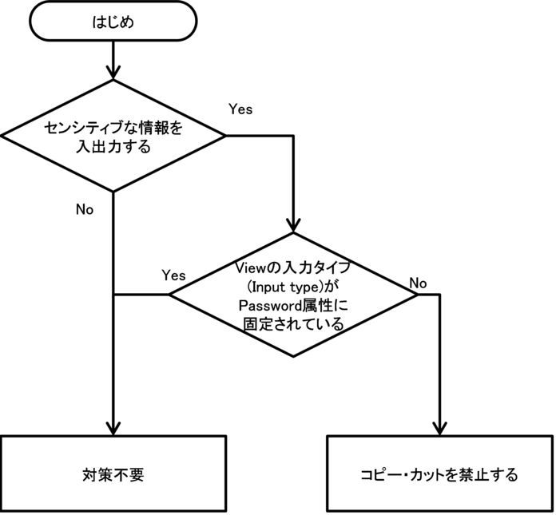

難しい問題
==========

AndroidにはOSの仕様やOSが提供する機能の仕様上、アプリの実装でセキュリティを担保するのが困難な問題が存在する。これらの機能は悪意を持った第三者に悪用されたり、ユーザーが注意せずに利用したりすることで、情報漏洩を始めセキュリティ上の問題に繋がってしまう危険性を常に抱えている。この章ではそのような機能に対して、開発者が取りうるリスク削減策などを提示しながら注意喚起が必要な話題を記事として取り上げる。

Clipboardから情報漏洩する危険性
-------------------------------

コピー＆ペーストはユーザーが普段から何気なく使っている機能であろう。例えば、この機能を使って、メールやWebページで気になった情報や忘れたら困る情報をメモ帳に残しておいたり、設定したパスワードを忘れないようにメモ帳に保存しておき、必要な時にコピー＆ペーストして使うというユーザーは少なからず存在する。これらは一見何気ない行為であるが、実はユーザーの扱う情報が盗まれるという危険が潜んでいる。

これにはAndroidのコピー＆ペーストの仕組みが関係している。ユーザーやアプリによってコピーされた情報は、一旦Clipboardと呼ばれるバッファに格納される。ユーザーやアプリによってペーストされたときに、このClipboardの内容が各アプリに再配布されるわけである。このClipboardに情報漏洩に結び付く危険性がある。Android端末の仕様では、Clipboardの実体は端末に1つであり、ClipboardManagerを利用することで、どのアプリからでも常時Clipboardの中身が取得できるようになっているからである。このことは、ユーザーがコピー・カットした情報は全て悪意あるアプリに対して筒抜けになることを意味している。

よって、アプリ開発者は、このAndroidの仕様を考慮しながら情報漏洩の可能性を最小限に抑える対策を講じなくてはならない。

### サンプルコード<!-- 1de829ee -->

Clipboardから情報漏洩する可能性を抑える対策には、大きく分けて次の2つが考えられる。

(1) 他アプリから自アプリへコピーする際の対策

(2) 自アプリから他アプリへコピーする際の対策

最初に、1.について説明する。ここでは、ユーザーがメモ帳やWebブラウザ、メーラーアプリなど他アプリから文字列をコピーし、それを自アプリのEditTextに貼り付けるシナリオを想定している。結論だけを言ってしまうと、このシナリオでコピー・カットによってセンシティブな情報が漏洩してしまうことを防ぐ根本的な対策は存在しない。第三者アプリのコピー機能を制御するような機能がAndroidにはないからだ。

よって、1.についてはセンシティブな情報をコピー・カットする危険性をユーザーに説明し、行為自体を減らしていく啓発活動を継続的に行っていくしか対策はない。

次に、2.を説明する。ここでは、自アプリが表示している情報がユーザーによってコピーされるシナリオを想定する。この場合、漏洩に対する確実な対策は、View(TextView,
EditTextなど)からのコピー・カットを禁止にすることである。個人情報などセンシティブな情報が入力あるいは出力されるViewにコピー・カット機能がなければ、自アプリからのClipboardを介した情報の漏洩もないからだ。

コピー・カットを禁止する方法はいくつか考えられるが、ここでは、実装が簡単でかつ効果のある方法として、Viewの長押し無効化の方法と文字列選択時のメニューからコピー・カットの項目を削除する方法を扱う。

対策要否は、図 6.1‑1の判定フローによって判定することができる。図
6.1‑1において、入力タイプ(Input
Type)がPassword属性に固定されているとは、入力タイプ(Input
Type)がアプリの実行時に常に下記のいずれかであることを指す。この場合は、デフォルトでコピー・カットが禁止されているので、特に対策する必要はない。

-   InputType.TYPE\_CLASS\_TEXT \|
    InputType.TYPE\_TEXT\_VARIATION\_PASSWORD

-   InputType.TYPE\_CLASS\_TEXT \|
    InputType.TYPE\_TEXT\_VARIATION\_WEB\_PASSWORD

-   InputType.TYPE\_CLASS\_NUMBER \|
    InputType.TYPE\_NUMBER\_VARIATION\_PASSWORD

{width="3.9358267716535433in"
height="3.6429133858267715in"}

[[]{#_Ref350183803 .anchor}]{#_Ref350183809 .anchor}図
6.1‑1対策要否の判定フロー

以下で、それぞれの対策の詳細を説明し、サンプルコードを示す。

#### 文字列選択時のメニューからコピー・カットを削除する

TextView.setCustomSelectionActionModeCallback()メソッドによって、文字列選択時のメニューをカスタマイズできる。これを用いて、文字列選択時のメニューからコピー・カットのアイテムを削除すれば、ユーザーが文字列をコピー・カットすることはできなくなる。

以下、EditTextの文字列選択時のメニューからコピー・カットの項目を削除するサンプルコードを示す。

> ポイント：

1.  文字列選択時のメニューからandroid.R.id.copyを削除する。

&nbsp;

1.  文字列選択時のメニューからandroid.R.id.cutを削除する。

UncopyableActivity.java
```eval_rst
.. literalinclude:: Files/LeakageViaClipboard.UncopyableActivity.java
   :language: java
   :encoding: shift-jis
```

#### Viewの長押し(Long Click)を無効にする

コピー・カットを禁止する方法は、Viewの長押し(Long
Click)を無効にすることでも実現できる。Viewの長押し無効化はレイアウトのxmlファイルで指定することができる。

> ポイント：

1.  コピー･カットを禁止するViewはandroid:longClickableをfalseにする。

unlongclickable.xml
```eval_rst
.. literalinclude:: Files/UnlongClickableEditview.app.src.main.res.layout.unlongclickable.xml
   :language: xml
   :encoding: shift-jis
```

### ルールブック<!-- d89ca9b9 -->

自アプリから他アプリへのセンシティブな情報のコピーが発生する可能性がある場合は、以下のルールを守ること。

1.  Viewに表示されている文字列のコピー・カットを無効にする (必須)

#### Viewに表示されている文字列のコピー・カットを無効にする (必須)

アプリがセンシティブな情報を表示するViewを持っている場合、それがEditTextのようにコピー・カットが可能なViewならば、Clipboardを介してその情報が漏洩してしまう可能性がある。そのため、センシティブな情報を表示するViewはコピー・カットを無効にしておかなければならない。

コピー・カットを無効にする方法には、文字列選択時のメニューからコピー・カットの項目を削除する方法と、Viewの長押しを無効化する方法がある。

「6.1.3.1 ルール適用の際の注意」も参照のこと。

### アドバンスト<!-- ad4d40cb -->

#### ルール適用の際の注意

TextViewはデフォルトでは文字列選択不可であるため、通常は対策不要であるが、アプリの仕様によってはコピーを可能にする場合もある。TextView.setTextIsSelectable()メソッドを使うことで、文字列の選択可否とコピー可否を動的に設定することができる。TextViewをコピー可能とする場合は、そのTextViewにセンシティブな情報が表示される可能性がないかよく検討し、その可能性があるのであれば、コピー可にすべきでない。

また、「6.1.1
サンプルコード」の判定フローにも記載されているように、パスワードの入力を想定した入力タイプ(InputType.TYPE\_CLASS\_TEXT
\|
InputType.TYPE\_TEXT\_VARIATION\_PASSWORDなど)のEditTextについては、デフォルトで文字列のコピーが禁止されているため通常は対策不要である。しかし、「5.1.2.2.
パスワードを平文表示するオプションを用意する
（必須）」に記載したように「パスワードを平文表示する」オプションを用意している場合は、パスワード平文表示の際に入力タイプが変化し、コピー・カットが有効になってしまうので、同様の対策が必要である。

なお、ルールを適用する際には、ユーザビリティの面も考慮する必要があるだろう。例えば、ユーザーが自由にテキストを入力できるViewの場合、センシティブな情報が入力される「可能性がゼロでない」からといってコピー・カットを無効にしてしまったら、ユーザーの使い勝手が悪くなるだろう。もちろん、重要度の高い情報を入出力するViewやセンシティブな情報を単独で入力するようなViewにはルールを無条件で適用するべきであるが、それ以外のViewを扱う場合は、次のことを考慮しながら対応を考えると良い。

-   センシティブな情報の入力や表示を行う専用のコンポーネントを用意できないか

-   連携先(ペースト先)アプリが分かっている場合は、他の方法で情報を送信できないか

-   アプリでユーザーに入出力に関する注意喚起ができないか

-   本当にそのViewが必要か

Android
OSのClipboardとClipboardManagerの仕様にセキュリティに対する考慮がされていないことが情報漏洩の可能性を生む根本的な要因ではあるが、アプリ開発者は、ユーザー保護やユーザビリティ、提供する機能など様々な観点からこうしたClipboardの仕様に対して対応し、質の高いアプリを作成する必要がある。

#### Clipboardに格納されている情報の操作

「6.1 Clipboardから情報漏洩する危険性」で述べたように、ClipboardManagerを利用することでアプリからClipboardに格納された情報を操作することができる。また、ClipboardManagerの利用には特別なPermissionを設定する必要が無いため、アプリはユーザーに知られることなくClipboardManagerを利用できる。

Clipboardに格納されている情報(ClipDataと呼ぶ)は、ClipboardManager.getPrimaryClip()メソッドによって取得できる。タイミングに関しても、OnPrimaryClipChangedListenerを実装してClipboardManager.addPrimaryClipChangedListener()メソッドでClipboardManagerに登録すれば、ユーザーの操作などにより発生するコピー・カットの度にListenerが呼び出されるので、タイミングを逃すことなくClipDataを取得することができる。ここでListenerの呼び出しは、どのアプリでコピー・カットが発生したかに関係なく行われる。

以下、端末内でコピー・カットが発生する度にClipDataを取得し、Toastで表示するServiceのソースコードを示す。下記のような簡単なコードによりClipboardに格納された情報が筒抜けになってしまうことを実感していただきたい。アプリを実装する際は、少なくとも下記のコードによってセンシティブな情報が取得されてしまうことのないように注意する必要がある。

ClipboardListeningService.java
```eval_rst
.. literalinclude:: Files/ClipboardListening.ClipboardListeningService.java
   :language: java
   :encoding: shift-jis
```

次に、上記ClipboardListeningServiceを利用するActivityのソースコードの例を示す。

ClipboardListeningActivity.java
```eval_rst
.. literalinclude:: Files/ClipboardListening.ClipboardListeningActivity.java
   :language: java
   :encoding: shift-jis
```

ここまでは、Clipboardに格納された情報を取得する方法について述べたが、ClipboardManager.setPrimaryClip()メソッドによって、Clipboardに新しく情報を格納することも可能である。

ただし、setPrimaryClip()はClipboardに格納されていた情報を上書きするので、ユーザーが予めコピー・カット操作により格納しておいた情報が失われる可能性がある点に注意が必要である。これらのメソッドを使用して独自のコピー機能あるいはカット機能を提供する場合は、必要に応じて、内容が改変される旨を警告するダイアログを表示するなど、Clipboardに格納されている内容がユーザーの意図しない内容に変更されることのないように設計・実装する必要がある。

[^1]: ただし、ポイント1, 2,
    6を遵守している場合を除いてはIntentが第三者に読み取られるおそれがあることに注意する必要がある。詳細はルールブックセクションの4.1.2.2、4.1.2.3を参照すること。

[^2]: 江川、藤井、麻野、藤田、山田、山岡、佐野、竹端著「Google Android
    プログラミング入門」 (アスキー・メディアワークス、2009年7月)

[^3]: [[http://developer.android.com/guide/components/tasks-and-back-stack.html]{.underline}](http://developer.android.com/guide/components/tasks-and-back-stack.html)

[^4]: intent-filterが定義されていれば公開Activity、定義されていなければ非公開Activityとなる。
    https://developer.android.com/guide/topics/manifest/activity-element.html\#exported
    を参照のこと。

[^5]: Fragment Injectionの詳細は以下のURLを参照のこと

    https://securityintelligence.com/new-vulnerability-android-framework-fragment-injection/

[^6]: 「利用アプリ」と「Autofill
    service」は、それぞれ同じパッケージ(APKファイル)であることも、別パッケージであることもあり得る。

[^7]: intent-filterが定義されていれば公開Receiver、定義されていなければ非公開Receiverとなる。
    https://developer.android.com/guide/topics/manifest/receiver-element.html\#exported
    を参照のこと。

[^8]: Android
    3.0未満ではアプリのインストールをしただけでReceiverが登録される

[^9]: ただし、Content Providerの非公開設定はAndroid 2.2 (API Level 8)
    以前では機能しない。

[^10]: intent-filterが定義されていれば公開Service、定義されていなければ非公開Serviceとなる。
    https://developer.android.com/guide/topics/manifest/service-element.html\#exported
    を参照のこと。

[^11]: ファイルの配置に関しては、SQLiteOpenHelperのコンストラクタの第2引数（name）にファイルの絶対パスも指定できる。そのため、誤ってSDカードを直接指定した場合には他のアプリからの読み書きが可能になるので注意が必要である。

[^12]: どちらのメソッドも該当するアプリだけが読み書き権限を与えられ、他のアプリからはアクセスができないディレクトリ（パッケージディレクトリ）のサブディレクトリ以下のパスが取得できる。

[^13]: （ドキュメントに記述はないが）SQLiteOpenHelper
    の実装ではDBの名前にはファイルのフルパスを指定できるので、SDカードなどアクセス権の設定できない場所のパスが意図せず入力されないように注意が必要である。

[^14]: MODE\_WORLD\_READABLEおよびMODE\_WORLD\_WRITEABLEの性質と注意点については、「4.6.3.2
    ディレクトリのアクセス権設定」を参照

[^15]: getReableDatabase
    は基本的にはgetWritableDatabaseで取得するのと同じオブジェクトを返す。ディスクフルなどの状況で書き込み可能オブジェクトを生成できない場合にリードオンリーのオブジェクトを返すという仕様である（getWritableDatabaseはディスクフルなどの状況では実行エラーとなる）。

[^16]: MODE\_WORLD\_READABLEおよびMODE\_WORLD\_WRITEABLEは API Level17
    以降ではdeprecated となっており、API Level 24
    以降ではセキュリティ例外が発生するため使用できなくなっている。

[^17]: 内部ストレージから外部記憶装置(SDカードなど)への移動などマウントポイントを超えた移動はできない。そのため、読み取り権限のない内部ストレージファイルが外部記憶装置に移動されて読み書き可能になるようなことはない。

[^18]: LogCat に出力されたログ情報は、READ\_LOGS
    Permissionを利用宣言したアプリであれば読み取り可能である。ただしAndroid
    4.1 以降ではLogCat
    に出力された他のアプリのログ情報は読み取り不可となった。また、スマートフォンユーザーであれば、ADB
    経由でLogCat のログ情報を参照することも可能である。

[^19]: http://developer.android.com/intl/ja/reference/android/util/Log.html

[^20]: 前述のサンプルコードを、条件式にBuildConfig.DEBUGを用いたif文で囲った。Log.d()呼び出し前のif文は不要であるが、前述のサンプルコードと対比させるため、そのまま残した。

[^21]: 厳密に言えば安全性を保証できるコンテンツであればJavaScriptを有効にしてよい。自社管理のコンテンツであれば自社の努力で安全性を確保できるし責任も取れる。では信頼できる提携会社のコンテンツは安全だろうか？これは会社間の信頼関係により決まる。信頼できる提携会社のコンテンツを安全であると信頼してJavaScriptを有効にしてもよいが、万一の場合は自社責任も伴うため、ビジネス責任者の判断が必要となる。

[^22]: http://www.w3.org/TR/webmessaging/

[^23]: オリジンとは、URLのスキーム、ホスト名、ポート番号の組み合わせのこと。詳細な定義は[[http://tools.ietf.org/html/rfc6454]{.underline}](http://tools.ietf.org/html/rfc6454)を参照。

[^24]: Uri.EMPTYおよびUri.parse(\"\")がワイルドカードとして機能する(2016年9月1日版執筆時)

[^25]: Android 6.0(API Level
    23)以降では、ユーザー確認と権限の付与はインストール時に行われず、アプリの実行中に権限の利用を要求する仕様に変更された。詳細は「5.2.1.4
    Android 6.0以降でDangerous Permissionを利用する方法」および「5.2.3.6
    Android
    6.0以降のPermissionモデルの仕様変更について」を参照すること。

[^26]: Normal/Dangerous
    Permissionを利用する場合には、Permissionが未定義のまま利用側アプリが先にインストールされると、利用側アプリへの権限の付与が行われず、提供側アプリがインストールされた後もアクセスができない

[^27]: Normal PermissionおよびSignature PermissionはAndroid
    OSにより自動的に付与されるため、ユーザー確認を行う必要はない。

[^28]: この場合も、アプリによるandroid.permission.READ\_CALENDARとandroid.permission.WRITE\_CALENDARの利用宣言はともに必要である。

[^29]: Account
    Managerはオンラインサービスとの同期の仕組みも提供するが、本節では扱っていない。

[^30]: WRITE\_CONTACTS
    Permissionを利用宣言しているAuthenticatorはアカウント情報をContactsProviderに書き込むとの想定で、READ\_CONTACTS
    Permissionを持つアプリにアカウント情報取得を許可していると考えられる。

[^31]: Android 8.0(API Level
    26)以降ではプラットフォームレベルでSSLv3を用いた接続が非サポートになっている。

[^32]: 　本サンプルコード内で画像検索APIとして利用している Google Image
    Search API
    は2016年2月15日をもって正式にサービス提供を終了している。そのため、サンプルコードをそのまま動作させるには同等のサービスに置き換える必要がある。

[^33]: 中間者攻撃については次のページを参照。[[http://www.ipa.go.jp/about/press/20140919\_1.html]{.underline}](http://www.ipa.go.jp/about/press/20140919_1.html)

[^34]: 本サンプルコード内で画像検索APIとして利用している Google Image
    Search API
    は2016年2月15日をもって正式にサービス提供を終了している。そのため、サンプルコードをそのまま動作させるには同等のサービスに置き換える必要がある。

[^35]: Android 8.0(API Level
    26)以降ではプラットフォームレベルで禁止しているためSSLv3での接続は起こらないが、サーバー側でのSSLv3無効化対策は行うことをお勧めする。

[^36]: この危険性については以下の記事で詳しく説明されている

    [[https://www.cigital.com/blog/ineffective-certificate-pinning-implementations/]{.underline}](https://www.cigital.com/blog/ineffective-certificate-pinning-implementations/)

[^37]: Network Security Configurationの詳細については以下を参照すること
    https://developer.android.com/training/articles/security-config.html

[^38]: HTTP以外の通信方式に対してどのような制御が行われるかについては、以下を参照すること
    https://developer.android.com/reference/android/security/NetworkSecurityPolicy.html\#isCleartextTrafficPermitted()

[^39]: http://www.kddilabs.jp/tech/public-tech/appgen.html

[^40]: 2016年9月1日版執筆時点の情報。後日、修正される可能性がある。
