**Androidアプリのセキュア設計**

**●**

**セキュアコーディングガイド**

**2017年2月1日版**

**一般社団法人日本スマートフォンセキュリティ協会（JSSEC）**

**セキュアコーディングWG**

※　本ガイドの内容は執筆時点のものです。サンプルコードを使用する場合はこの点にあらかじめご注意ください。

※　JSSECならびに執筆関係者は、このガイド文書に関するいかなる責任も負うものではありません。全ては自己責任にてご活用ください。

> ※　Android™は、Google,
> Inc.の商標または登録商標です。また、本文書に登場する会社名、製品名、サービス名は、一般に各社の登録商標または商標です。本文中では®、TM、©
> マークは明記していません。
>
> ※　この文書の内容の一部は、Google,
> Inc.が作成、提供しているコンテンツをベースに複製したもので、クリエイティブ・コモンズの表示
> 3.0 ライセンスに記載の条件に従って使用しています。

[]{#_Toc472676056
.anchor}Androidアプリのセキュア設計・セキュアコーディングガイド

{width="0.8131944444444444in"
height="0.9840277777777777in"}{width="0.8131944444444444in"
height="0.9840277777777777in"}【ベータ版】

2017年2月1日

一般社団法人日本スマートフォンセキュリティ協会

セキュアコーディングWG

目　次

[*Androidアプリのセキュア設計・セキュアコーディングガイド*
1](#_Toc472676056)

[*1.* *はじめに* 13](#はじめに)

[*1.1.* *スマートフォンを安心して利用出来る社会へ*
13](#スマートフォンを安心して利用出来る社会へ)

[*1.2.* *常にベータ版でタイムリーなフィードバックを*
14](#常にベータ版でタイムリーなフィードバックを)

[*1.3.* *本文書の利用許諾* 15](#本文書の利用許諾)

[*1.4.* *2016年9月1日版からの訂正記事について*
16](#年9月1日版からの訂正記事について)

[*2.* *ガイド文書の構成* 18](#ガイド文書の構成)

[*2.1.* *開発者コンテキスト* 18](#開発者コンテキスト)

[*2.2.* *サンプルコード、ルールブック、アドバンスト*
19](#サンプルコードルールブックアドバンスト)

[*2.3.* *ガイド文書のスコープ* 21](#ガイド文書のスコープ)

[*2.4.* *Androidセキュアコーディング関連書籍の紹介*
22](#androidセキュアコーディング関連書籍の紹介)

[*2.5.* *サンプルコードのAndroid Studioへの取り込み手順*
23](#サンプルコードのandroid-studioへの取り込み手順)

[*3.* *セキュア設計・セキュアコーディングの基礎知識*
36](#セキュア設計セキュアコーディングの基礎知識)

[*3.1.* *Androidアプリのセキュリティ* 36](#androidアプリのセキュリティ)

[*3.2.* *入力データの安全性を確認する*
48](#入力データの安全性を確認する)

[*4.* *安全にテクノロジーを活用する* 50](#安全にテクノロジーを活用する)

[*4.1.* *Activityを作る・利用する* 50](#activityを作る利用する)

[*4.2.* *Broadcastを受信する・送信する*
95](#broadcastを受信する送信する)

[*4.3.* *Content Providerを作る・利用する*
126](#content-providerを作る利用する)

[*4.4.* *Serviceを作る・利用する* 173](#serviceを作る利用する)

[*4.5.* *SQLiteを使う* 214](#sqliteを使う)

[*4.6.* *ファイルを扱う* 232](#ファイルを扱う)

[*4.7.* *Browsable Intentを利用する* 260](#browsable-intentを利用する)

[*4.8.* *LogCatにログ出力する* 263](#logcatにログ出力する)

[*4.9.* *WebViewを使う* 275](#webviewを使う)

[*4.10.* *Notificationを使用する* 287](#notificationを使用する)

[*5.* *セキュリティ機能の使い方* 298](#セキュリティ機能の使い方)

[*5.1.* *パスワード入力画面を作る* 298](#パスワード入力画面を作る)

[*5.2.* *PermissionとProtection Level*
313](#permissionとprotection-level)

[*5.3.* *Account Managerに独自アカウントを追加する*
345](#account-managerに独自アカウントを追加する)

[*5.4.* *HTTPSで通信する* 363](#httpsで通信する)

[*5.5.* *プライバシー情報を扱う* 392](#プライバシー情報を扱う)

[*5.6.* *暗号技術を利用する* 423](#暗号技術を利用する)

[*5.7.* *指紋認証機能を利用する* 452](#指紋認証機能を利用する)

[*6.* *難しい問題* 463](#難しい問題)

[*6.1.* *Clipboardから情報漏洩する危険性*
463](#clipboardから情報漏洩する危険性)

更新履歴

  --------------------------------------------------------------------------------------------------------------------------------------------------------------------------------------------------------------------
  日付                                                                                       改訂内容
  ------------------------------------------------------------------------------------------ -------------------------------------------------------------------------------------------------------------------------
  2012-06-01                                                                                 -   初版
                                                                                             

  2012-11-01                                                                                 -   下記の構成・内容を見直し拡充致しました
                                                                                             
                                                                                                 -   4.1 Activityを作る・利用する
                                                                                             
                                                                                                 -   4.2 Broadcastを受信する・送信する
                                                                                             
                                                                                                 -   4.3 Content Providerを作る・利用する
                                                                                             
                                                                                                 -   4.4 Serviceを作る・利用する
                                                                                             
                                                                                                 -   5.2 PermissionとProtection Level
                                                                                             

                                                                                             -   下記の新しい記事を追加致しました
                                                                                             
                                                                                                 -   2.5 サンプルコードのAndroid Studioへの取り込み手順
                                                                                             
                                                                                                 -   3.1 Androidアプリのセキュリティ
                                                                                             
                                                                                                 -   4.7 Browsable Intentを利用する
                                                                                             
                                                                                                 -   5.3 Account Managerに独自アカウントを追加する
                                                                                             
                                                                                                 -   6.1 Clipboardから情報漏洩する危険性
                                                                                             

  2013-04-01                                                                                 -   下記の記事の内容を見直し書き直しました
                                                                                             
                                                                                                 -   5.3 Account Managerに独自アカウントを追加する
                                                                                             
                                                                                             -   下記の新しい記事を追加致しました
                                                                                             
                                                                                                 -   4.8 LogCatにログ出力する
                                                                                             
                                                                                                 -   5.4 HTTPSで通信する
                                                                                             
                                                                                                 -   4.9 WebViewを使う
                                                                                             

  2014-07-01                                                                                 -   下記の新しい記事を追加致しました
                                                                                             
                                                                                                 -   5.5 プライバシー情報を扱う
                                                                                             
                                                                                                 -   5.6　暗号技術を利用する
                                                                                             

  2015-06-01                                                                                 -   下記の方針で本書全体の内容を見直し書き直しました
                                                                                             
                                                                                                 -   開発環境の変更(Eclipse -&gt; Android Studio)
                                                                                             
                                                                                                 -   Android最新版Lollipopへの対応
                                                                                             
                                                                                                 -   対応するAPI Levelの見直し(8以降 -&gt; 15以降)
                                                                                             

  2016-02-01                                                                                 -   下記の新しい記事を追加致しました
                                                                                             
                                                                                                 -   4.10 Notificationを使用する
                                                                                             
                                                                                                 -   5.7 指紋認証機能を利用する
                                                                                             
                                                                                             -   下記の構成・内容を見直し拡充致しました
                                                                                             
                                                                                                 -   5.2 PermissionとProtection Level
                                                                                             

  2016-09-01                                                                                 -   下記の構成・内容を見直し拡充致しました
                                                                                             
                                                                                                 -   2.5 サンプルコードのAndroid Studioへの取り込み手順
                                                                                             
                                                                                                 -   5.4 HTTPSで通信する
                                                                                             
                                                                                                 -   5.6 暗号技術を利用する
                                                                                             

  2017-02-01                                                                                 -   下記の新しい記事を追加致しました
                                                                                             
                                                                                                 -   5.4.3.7 Network Security Configuration
                                                                                             
                                                                                                 -   4.6.3.5 Android 7.0（API Level 24）における外部ストレージの特定ディレクトリへのアクセスに関する仕様変更について
                                                                                             
                                                                                             -   下記の構成・内容を見直し拡充致しました
                                                                                             
                                                                                                 -   4.1 Activityを作る・利用する
                                                                                             
                                                                                                 -   4.2 Broadcastを受信する・送信する
                                                                                             
                                                                                                 -   4.4 Serviceを作る・利用する
                                                                                             
                                                                                                 -   4.5 SQLiteを使う
                                                                                             
                                                                                                 -   4.6 ファイルを扱う
                                                                                             
                                                                                             -   下記の記事を削除致しました
                                                                                             
                                                                                                 -   4.8.3.4 BuildConfig.DEBUG はADT 21 以降で使う
                                                                                             
                                                                                             -   下記の方針で本書全体の内容を見直し書き直しました
                                                                                             
                                                                                                 -   Android 4.0.3（API Level 15）未満に関する本文中の記述を削除または脚注へ移動
                                                                                             
                                                                                             ※ 改訂内容の詳細については「1.4 2016年9月1日版からの訂正記事について」を参照して下さい

  -   新版の公開にあたり、皆様から頂いたご意見・コメントを元に本ガイドの内容を更新しました
  
  --------------------------------------------------------------------------------------------------------------------------------------------------------------------------------------------------------------------

■制作■

一般社団法人日本スマートフォンセキュリティ協会

技術部会　セキュアコーディングWG

> リーダー 奥山　謙 ソニーデジタルネットワークアプリケーションズ株式会社
>
> メンバー 荒木　成治 Androidセキュリティ部
>
> 島野 映司 Androidセキュリティ部
>
> 大内　智美 株式会社SRA
>
> 福本　郁哉 株式会社SRA
>
> 山野井 陽一 株式会社SRA
>
> 武井　滋紀 エヌ・ティ・ティ・ソフトウェア株式会社
>
> 塩田 明弘 株式会社エヌ・ティ・ティ・データ
>
> 高橋 哲也 株式会社スクウェア・エニックス
>
> 山地　秀典 ソニー株式会社
>
> 安藤　彰 ソニーデジタルネットワークアプリケーションズ株式会社

小木曽　純 ソニーデジタルネットワークアプリケーションズ株式会社

> 松並 勝 ソニーデジタルネットワークアプリケーションズ株式会社
>
> 谷口　岳 タオソフトウェア株式会社
>
> （執筆関係者、社名五十音順）

■2016年9月1日版制作者■

リーダー

> 松並　勝 ソニーデジタルネットワークアプリケーションズ株式会社

メンバー

  -----------------------------------------------------------------------------------------
  荒木　成治                         Androidセキュリティ部
  ---------------------------------- ------------------------------------------------------
  大内　智美、福本　郁哉             株式会社SRA

  武井　滋紀                         エヌ・ティ・ティ・ソフトウェア株式会社

  大園　通                           シスコシステムズ合同会社

  山地　秀典                         ソニー株式会社

  安藤　彰、大谷　三岳、小木曽　純   ソニーデジタルネットワークアプリケーションズ株式会社
                                     
  奥山　謙                           

  島野　英司、谷口　岳               タオソフトウェア株式会社

  満園　大祐                         日本システム株式会社
  -----------------------------------------------------------------------------------------

> (執筆関係者、社名五十音順)

■2016年2月1日版制作者■

リーダー

> 松並　勝 ソニーデジタルネットワークアプリケーションズ株式会社

メンバー

  ------------------------------------------------------------------------------------------
  安達　正臣                          Androidセキュリティ部
  ----------------------------------- ------------------------------------------------------
  福本　郁哉、星本　英史              株式会社SRA

  武井　滋紀                          エヌ・ティ・ティ・ソフトウェア株式会社

  大園　通                            シスコシステムズ合同会社

  安藤　彰、伊藤 妙子、大谷　三岳、   ソニーデジタルネットワークアプリケーションズ株式会社
                                      
  奥山　謙、楫 節子、西村　宗晃       

  山地　秀典                          ソニーモバイルコミュニケーションズ株式会社

  笠原 正弘                           ソフトバンクモバイル株式会社

  島野　英司、谷口　岳                タオソフトウェア株式会社
  ------------------------------------------------------------------------------------------

> (執筆関係者、社名五十音順)

■2015年6月1日版制作者■

リーダー

> 松並　勝 ソニーデジタルネットワークアプリケーションズ株式会社

メンバー

  -------------------------------------------------------------------------------------------
  星本　英史                           株式会社SRA
  ------------------------------------ ------------------------------------------------------
  武井　滋紀                           エヌ・ティ・ティ・ソフトウェア株式会社

  大園　通                             シスコシステムズ合同会社

  安藤　彰、奥山　謙、西村　宗晃       ソニーデジタルネットワークアプリケーションズ株式会社

  笠原 正弘                            ソフトバンクモバイル株式会社

  島野　英司、谷口　岳                 タオソフトウェア株式会社

  八津川　直伸                         日本ユニシス株式会社

  谷田部　茂                           株式会社フォーマルハウト・テクノ・ソリューションズ

  今西　杏丞、河原　豊、近藤　昭雄、   株式会社ブリリアントサービス
                                       
  志村　直彦、新谷　正人、原　昇平、   
                                       
  藤澤　智之、藤田　竜史、三竹　一馬   
  -------------------------------------------------------------------------------------------

> (執筆関係者、社名五十音順)

■2014年7月1日版制作者■

リーダー

> 松並　勝 ソニーデジタルネットワークアプリケーションズ株式会社

メンバー

  熊澤　努、星本　英史                                   株式会社SRA
  ------------------------------------------------------ ------------------------------------------------------
  武井　滋紀                                             エヌ・ティ・ティ・ソフトウェア株式会社
  竹森　敬祐、磯原 隆将                                  KDDI株式会社
  大園　通                                               シスコシステムズ合同会社
  安藤　彰、伊藤 妙子、奥山　謙、楫 節子、　片岡　良典   ソニーデジタルネットワークアプリケーションズ株式会社
  笠原 正弘                                              ソフトバンクモバイル株式会社
  島野　英司、谷口　岳                                   タオソフトウェア株式会社
  佐藤　導吉                                             東京システムハウス株式会社
  八津川　直伸                                           日本ユニシス株式会社
  谷田部　茂                                             株式会社フォーマルハウト・テクノ・ソリューションズ

> (執筆関係者、社名五十音順)

■2013年4月1日版制作者■

リーダー

> 松並　勝 ソニーデジタルネットワークアプリケーションズ株式会社

メンバー

  ------------------------------------------------------------------------------------------------------------------------------------------
  安達　正臣、長谷川　智之                                                         Androidセキュリティ部
  -------------------------------------------------------------------------------- ---------------------------------------------------------
  安部　勇気、大内　智美、熊澤　努、                                               株式会社SRA
                                                                                   
  澤田　寿実、畑　清志、比嘉　陽一、                                               
                                                                                   
  福井　悠、福本　郁哉、星本　英史、                                               
                                                                                   
  横井　俊、吉澤　孝和                                                             

  藤原　健                                                                         NRIセキュアテクノロジーズ株式会社

  武井　滋紀                                                                       エヌ・ティ・ティ・ソフトウェア株式会社

  竹森　敬祐                                                                       KDDI株式会社

  久保　正樹、熊谷　裕志、戸田　洋三                                               一般社団法人JPCERTコーディネーションセンター(JPCERT/CC)

  大園　通                                                                         シスコシステムズ合同会社

  新井　幹也、坂本　昌彦                                                           株式会社セキュアスカイ・テクノロジー

  浅野　徹、安藤　彰、池邉　亮志、小木曽　純、奥山　謙、片岡　良典、西村　宗晃、   ソニーデジタルネットワークアプリケーションズ株式会社
                                                                                   
  古澤　浩司、山岡　研二                                                           

  谷口　岳                                                                         タオソフトウェア株式会社

  八津川　直伸                                                                     日本ユニシス株式会社

  谷田部　茂                                                                       株式会社フォーマルハウト・テクノ・ソリューションズ
  ------------------------------------------------------------------------------------------------------------------------------------------

> (執筆関係者、社名五十音順)

■2012年11月1日版制作者■

リーダー

> 松並　勝 ソニーデジタルネットワークアプリケーションズ株式会社

メンバー

  ------------------------------------------------------------------------------------------------------
  佐藤　勝彦、中口　明彦                       Androidセキュリティ部
  -------------------------------------------- ---------------------------------------------------------
  大内　智美、大平　直之、熊澤　努、           株式会社SRA
                                               
  関川　未来、中野　正剛、比嘉　陽一、         
                                               
  福本　郁哉、星本　英史、安田　章一           
                                               
  八尋　唯行、吉澤　孝和                       

  武井　滋紀                                   エヌ・ティ・ティ・ソフトウェア株式会社

  竹森　敬祐                                   KDDI株式会社

  久保　正樹、熊谷　裕志、戸田　洋三           一般社団法人JPCERTコーディネーションセンター(JPCERT/CC)

  大園　通                                     シスコシステムズ合同会社

  浅野　徹、安藤　彰、池邉　亮志、市川　茂、   ソニーデジタルネットワークアプリケーションズ株式会社
                                               
  大谷　三岳、小木曽　純、奥山　謙、           
                                               
  片岡　良典、佐藤　郁恵、西村　宗晃、         
                                               
  山岡　一夫、吉川　岳流                       

  谷口　岳、島野　英司、北村　久雄             タオソフトウェア株式会社

  山川　隆郎                                   一般社団法人日本オンラインゲーム協会

  石原　正樹、森　靖晃                         日本システム開発株式会社

  八津川　直伸                                 日本ユニシス株式会社

  谷田部　茂                                   株式会社フォーマルハウト・テクノ・ソリューションズ

  藤井　茂樹                                   ユニアデックス株式会社
  ------------------------------------------------------------------------------------------------------

> (執筆関係者、社名五十音順)

■2012年6月1日版制作者■

リーダー

> 松並　勝 ソニーデジタルネットワークアプリケーションズ株式会社

メンバー

  ------------------------------------------------------------------------------------------------------
  佐藤　勝彦                                   Androidセキュリティ部
  -------------------------------------------- ---------------------------------------------------------
  大内　智美、比嘉　陽一、星本　英史           株式会社SRA

  武井　滋紀                                   エヌ・ティ・ティ・ソフトウェア株式会社

  千田　雅明                                   グリー株式会社

  久保　正樹、熊谷　裕志、戸田　洋三           一般社団法人JPCERTコーディネーションセンター(JPCERT/CC)

  大園　通、谷田部　茂                         シスコシステムズ合同会社

  田口　陽一                                   株式会社システムハウス. アイエヌジー

  坂本　昌彦                                   株式会社セキュアスカイ・テクノロジー

  安藤　彰、市川　茂、奥山　謙、佐藤　郁恵、   ソニーデジタルネットワークアプリケーションズ株式会社
                                               
  西村　宗晃、山岡　一夫                       

  谷口　岳、島野　英司、北村　久雄             タオソフトウェア株式会社

  佐藤　導吉                                   東京システムハウス株式会社

  服部　正和                                   トレンドマイクロ株式会社

  八津川　直伸                                 日本ユニシス株式会社

  谷田部　茂                                   株式会社フォーマルハウト・テクノ・ソリューションズ

  藤井　茂樹                                   ユニアデックス株式会社
  ------------------------------------------------------------------------------------------------------

> (執筆関係者、社名五十音順)

はじめに
========

スマートフォンを安心して利用出来る社会へ
----------------------------------------

本ガイドはAndroidアプリケーション開発者向けのセキュア設計、セキュアコーディングのノウハウをまとめたTips集です。できるだけ多くのAndroidアプリケーション開発者に活用していただきたく思い、ここに公開いたします。

昨今、スマートフォン市場は急拡大しており、さらにその勢いは増すばかりです。スマートフォン市場の急拡大は多種多彩なアプリケーション群によってもたらされています。従来の携帯電話ではセキュリティ制約によって利用できなかったさまざまな携帯電話の重要な機能がスマートフォンアプリケーションには開放され、従来の携帯電話では実現できなかった多種多彩なアプリケーション群がスマートフォンの魅力を引き立てています。

スマートフォンのアプリケーション開発者にはそれ相応の責任が生じています。従来の携帯電話ではあらかじめ課せられたセキュリティ制約によって、セキュリティについてあまり意識せずに開発したアプリケーションであっても比較的安全性が保たれていました。スマートフォンでは前述のとおり、携帯電話の重要な機能がアプリケーション開発者に開放されているため、アプリケーション開発者がセキュリティを意識して設計、コーディングをしなければ、スマートフォン利用者の個人情報が漏洩したり、料金の発生する携帯電話機能をマルウェアに悪用されたりといった被害が生じます。

AndroidスマートフォンはiPhoneに比べると、アプリケーション開発者のセキュリティへの配慮がより多く求められます。iPhoneに比べAndroidスマートフォンはアプリケーション開発者に開放された携帯電話機能が多く、App
Storeに比べGoogle Play（旧Android
Market）は無審査でアプリケーション公開ができるなど、アプリケーションのセキュリティがほぼ全面的にアプリケーション開発者に任されているためです。

スマートフォン市場の急拡大にともない、様々な分野のソフトウェア技術者が一気にスマートフォンアプリケーション開発市場に流れ込んできており、スマートフォン特有のセキュリティを考慮したセキュア設計、セキュアコーディングのノウハウ集約、共有が急務となっています。

このような状況を踏まえ、一般社団法人日本スマートフォンセキュリティ協会はセキュアコーディングWGを立ち上げ、Androidアプリケーションのセキュア設計、セキュアコーディングのノウハウを集めて、公開することにいたしました。それがこのガイド文書です。多くのAndroidアプリケーション開発者にセキュア設計、セキュアコーディングのノウハウを知っていただき、アプリケーション開発に活かしていただくことで、市場にリリースされる多くのAndroidアプリケーションのセキュリティを高めることを狙っています。その結果、安心、安全なスマートフォン社会づくりに貢献したいと考えています。

常にベータ版でタイムリーなフィードバックを
------------------------------------------

私たちJSSECセキュアコーディングWGはこのガイド文書の内容について、できるだけ間違いがないように心がけておりますが、その正しさを保証するものではありません。私たちはタイムリーにノウハウを公開し共有していくことが第一と考え、最新かつその時点で正しいと思われることをできるだけ記載・公開し、間違いがあればフィードバックを頂いて常に正しい情報に更新し、タイムリーに提供するよう心がける、いわゆる常にベータ版というアプローチをとっています。このアプローチはこのガイド文書をご利用いただく多くのAndroidアプリケーション開発者のみなさまにとって有意義であると私たちは信じています。

このガイド文書とサンプルコードの最新版はいつでも下記URLから入手できます。

-   [*http://www.jssec.org/dl/android\_securecoding.pdf*](http://www.jssec.org/dl/android_securecoding.pdf)
    ガイド文書

-   [*http://www.jssec.org/dl/android\_securecoding.zip*](http://www.jssec.org/dl/android_securecoding.zip)
    サンプルコード一式

本文書の利用許諾
----------------

このガイド文書のご利用に際しては次の2つの注意事項に同意いただく必要がございます。

1.  このガイド文書には間違いが含まれている可能性があります。ご自身の責任のもとでご利用ください。

2.  このガイド文書に含まれる間違いを見つけた場合には、下記連絡先までメールにてご連絡ください。ただしお返事することや修正をお約束するものではありませんのでご了承ください。

一般社団法人 日本スマートフォンセキュリティ協会

セキュアコーディングWG問い合わせ

メール宛先：
[*jssec-securecoding-qa@googlegroups.com*](mailto:jssec-securecoding-qa@googlegroups.com)

件名：【コメント応募】Androidアプリのセキュア設計・セキュアコーディングガイド
2016年9月1日版

内容：氏名(任意)/所属(任意)/連絡先E-mail(任意)/ご意見(必須)/その他ご希望(任意)

[[]{#_Toc321181222 .anchor}]{#_Toc321159819 .anchor}

2016年9月1日版からの訂正記事について
------------------------------------

本節では、前版の記事について事実関係と照らし合わせることで判明した訂正事項を一覧にして掲載しています。各訂正記事は、執筆者による継続的な調査結果だけでなく読者の方々の貴重なご指摘を広く取り入れたものです。特に、いただいたご指摘は、本改訂版をより実践に即したガイドとして高い完成度を得るための最も重要な糧となっています。

前版を元にアプリケーション開発を進めていた読者は、以下の訂正記事一覧に特に目を通していただきますようお願いいたします。なお、ここで掲げる項目には、誤植の修正、記事の追加、構成の変更、単なる表現上の改善は含みません。

本ガイドに対するコメントは、今後もお気軽にお寄せくださいますようよろしくお願いいたします。

**訂正記事一覧**

  --------------------------------------------------------------------------------------------------------------------------------------------------------------------------------------------------------------------------------------------------------------------------------------------------------------------
  2016年9月1日版の修正個所                                                           本改訂版の訂正記事                                                                                                 訂正の要旨
  ---------------------------------------------------------------------------------- ------------------------------------------------------------------------------------------------------------------ --------------------------------------------------------------------------------------------------------------
  4.1.3.1 exported設定とintent-filter設定の組み合わせ（Activityの場合）              4.1.3.1 exported 設定とintent-filter設定の組み合わせ(Activityの場合)                                               intent-filter定義の有無に関わりなくActivityのexported属性を指定すべきである旨を追記しました。

  4.2.3.1使用してよいexported設定とintent-filter設定の組み合わせ（Receiverの場合）   4.2.3.1 使用してよいexported 設定とintent-filter設定の組み合わせ(Receiverの場合)                                   intent-filter定義の有無に関わりなくReceiverのexported属性を指定すべきである旨を追記しました。

  4.4.3.1 exported設定とintent-filter設定の組み合わせ（Serviceの場合）               4.4.3.1 exported 設定とintent-filter設定の組み合わせ(Serviceの場合)                                                intent-filter定義の有無に関わりなくServiceのexported属性を指定すべきである旨を追記しました。

  （全般）                                                                           （全般）                                                                                                           Android 4.0.3（API Level 15）未満に関する記述を削除もしくは脚注に移動しました。

  （該当なし）                                                                       5.4.3.7 Network Security Configuration                                                                             Network Security Configurationについての解説を記載しました。

  4.8.3.4 BuildConfig.DEBUG はADT 21 以降で使う                                      （該当なし）                                                                                                       ADT に関する記述を削除しました。

  4.2.2.6　Sticky Broadcastにはセンシティブな情報は含めない                        4.2.2.6　Sticky Broadcastにはセンシティブな情報は含めない                                                        Sticky Broadcastの使用がAPI Level 21以降非推奨となった旨を追記しました。
                                                                                                                                                                                                        
  4.2.3.4　Broadcastの種類とその特徴                                                 4.2.3.4　Broadcastの種類とその特徴                                                                                 

  4.5.2.1 DBファイルの配置場所、アクセス権を正しく設定する                           4.5.2.1 DBファイルの配置場所、アクセス権を正しく設定する                                                           MODE\_WORLD\_READABLEおよびMODE\_WORLD\_WRITEABLEの使用が API Level17 以降非推奨となった旨を追記しました。
                                                                                                                                                                                                        
  4.6.3.2 ディレクトリのアクセス権設定                                               4.6.3.2 ディレクトリのアクセス権設定                                                                               

  （該当なし）                                                                       4.6.3.5　Android 7.0（API Level 24）における外部ストレージの特定ディレクトリへのアクセスに関する仕様変更について   外部ストレージへのアクセスに関する仕様がAPI Level 19において変更されたことについての解説を記載しました。
  --------------------------------------------------------------------------------------------------------------------------------------------------------------------------------------------------------------------------------------------------------------------------------------------------------------------

ガイド文書の構成
================

開発者コンテキスト
------------------

セキュアコーディング系のガイド文書は「こういうコーディングは危ない、だからこのようにコーディングすべき」といった内容で構成されることが多いのですが、このような構成はすでにコーディングされたソースコードをレビューするときには役立つ反面、これから開発者がコーディングしようというときには、どの記事を読んだらよいのか分かりにくいという問題があります。

このガイド文書では、開発者がいま何をしようとしているか？という開発者コンテキストに着目し、開発者コンテキストに合わせた切り口の記事を用意する方針をとっています。たとえば「Activityを作る・利用する」や「SQLiteを使う」という開発者が行うであろう作業単位ごとに記事を用意しています。

開発者コンテキストに合わせて記事を用意することにより、開発者は必要な記事を見つけやすく、業務にすぐ役立つようになると考えています。

サンプルコード、ルールブック、アドバンスト
------------------------------------------

それぞれの記事はサンプルコード、ルールブック、アドバンストの3つのセクションで構成されています。お急ぎの方はサンプルコードとルールブックをご覧ください。ある程度再利用可能なパターンに落とし込んだ内容にしてあります。サンプルコードセクションとルールブックセクションに収まらない課題をお持ちの方はアドバンストをご覧ください。個別課題の解決方法を検討するための考慮材料を記載してあります。

なお、サンプルコードおよび記事の内容は特別な記述がない限りAndroid
4.0.3(API Level 15)以降を対象にしています。Android 4.0.3(API Level
15)より前のバージョンにおいては動作確認をしておらず、対策として効果がない場合もありますのでご注意ください。また、対象範囲内のバージョンであっても、組み込んだ端末で動作をご確認の上、ご自身の責任のもとでご利用ください。

### サンプルコード

サンプルコードセクションでは、その記事がテーマとする開発者コンテキストにおいて基本的なお手本となるサンプルコードを掲載しています。複数のパターンがある場合はその分類方法とそれぞれのパターンのサンプルコードを用意しています。解説においては簡潔さを心がけており、セキュリティ上考慮すべきポイントを本文中で「**ポイント：**」部分に番号付き箇条書きで記載し、その箇条書き番号Nに対応するサンプルコードにも「**★ポイントN★**」と記載しコメントで解説しています。一つのポイントがサンプルコード上では複数個所に対応する場合があることにご注意ください。このようにセキュリティを考慮すべき個所はソースコード全体に対して僅かな量ですが、それらの個所は点在します。セキュリティの考慮が必要な個所を見渡すことができるように、サンプルコードはクラス単位でまるごと掲載するようにしています。

このガイド文書で掲載しているサンプルコードは一部です。すべてのサンプルコードをまとめた圧縮ファイルも下記のURLに公開しています。Apache
License, Version
2.0で公開していますので、自由にサンプルコードをコピー&ペーストしてご利用いただけます。ただしエラー処理についてはサンプルコードが長くなり過ぎないように最小限にしていますのでご注意ください。

-   [*http://www.jssec.org/dl/android\_securecoding.pdf*](http://www.jssec.org/dl/android_securecoding.pdf)
    ガイド文書

-   [*http://www.jssec.org/dl/android\_securecoding.zip*](http://www.jssec.org/dl/android_securecoding.zip)
    サンプルコード一式

サンプルコードに添付するProjects/keystoreファイルはAPK署名用の開発者鍵を含んだキーストアファイルです。パスワードは「android」です。自社限定系のサンプルコードをAPK署名する際にご利用ください。

デバッグ用にキーストアファイルdebug.keystoreを用意しているので、Android
Studioで開発する場合は、Android
Studioの個別のプロジェクトで設定しておくと、自社限定系のサンプルコードの動作確認に便利です。また、複数のAPKから成るサンプルコードにおいて、各APK間の連携動作を確認するためには、各々のAndroidManifest.xml内のandroid:debuggableの設定を合わせる必要があります。Android
StudioからAPKをインストールする場合は、明示的に設定が無ければ自動的にandroid:debuggable=”true”になります。

サンプルコードおよびキーストアファイルをAndroid
Studioに取り込む方法については「2.5 サンプルコードのAndroid
Studioへの取り込み手順」をご参照ください。

### ルールブック

ルールブックセクションでは、その記事がテーマとする開発者コンテキストにおいて、セキュリティ観点から守るべきルールや考慮事項を掲載しています。ルールブックセクションの冒頭にはそのセクションで扱っているルールを表形式で一覧表示し、「必須」または「推奨」のレベル分けをしています。ルールには肯定文または否定文の2種類がありますので、必須の肯定文は「やらなきゃだめ」、推奨の肯定文は「やったほうがよい」、必須の否定文は「やったらだめ」、推奨の否定文は「やらないほうがよい」といったレベル感で表現しています。もちろんこのレベル分けは執筆者の主観に基づくものですので、参考程度としてお取扱いください。

サンプルコードセクションに掲載されているサンプルコードはこれらのルールや考慮事項が反映されたものとなっていますが、その詳しい説明はルールブックセクションに記載されています。また、サンプルコードセクションでは扱っていないルールや考慮事項についてもルールブックセクションでは扱っています。

### アドバンスト

アドバンストセクションでは、その記事がテーマとする開発者コンテキストにおいて、サンプルコードセクションやルールブックセクションで説明できなかった、しかし注意を要する事項について記載しています。その記事がテーマとする開発者コンテキストにまつわる、コラム的な話題やAndroid
OSの限界に関する話題など、サンプルコードセクションやルールブックセクションの内容で解決できなかった個別課題の解決方法を検討するための考慮材料として役立てることができます。

開発者のみなさんは常に多忙です。開発者の多くは、Androidの深遠なるセキュリティの構造について深く理解することよりも、ある程度のAndroidセキュリティの知識を持って、迅速にかつ安全なAndroidアプリケーションをどんどん生産することが求められます。一方、セキュリティ設計が重要なアプリケーションもあります。このようなアプリケーションの開発者はAndroidのセキュリティについて深く理解している必要があります。

このようにスピード重視の開発者とセキュリティ重視の開発者の両方を支援するために、このガイド文書のすべての記事はサンプルコード、ルールブック、アドバンストの3つのセクションに分けて記述しています。サンプルコードとルールブックセクションは「そういうことがしたければ、これをしておけば安全ですよ」といった一般化できる内容が書いてあり、可能な限りソースコードのコピー&ペーストで自動的に安全なコーディングができることを狙っています。アドバンストセクションは「こんなときはこういう問題があって、こういう考え方をするとよい」といった考えるための材料が書いてあり、開発者が取り組んでいる個別のアプリケーションで最適なセキュア設計、セキュアコーディングを検討できることを狙っています。

ガイド文書のスコープ
--------------------

このガイド文書は一般のAndroidアプリケーション開発者に必要なセキュリティTipsを集めることを目的としています。そのため主にマーケットで配布されるAndroidアプリケーションの開発におけるセキュリティTips（下図の「アプリのセキュリティ」）が主なスコープとなっています。

{width="6.889763779527559in"
height="3.6992125984251967in"}

図 2.3‑1

Android
OS層以下のAndroid端末実装に関するセキュリティ（上図の「端末のセキュリティ」）はスコープ外です。またAndroid端末にユーザーがインストールする一般のAndroidアプリケーションと、Android端末メーカーがプレインストールするAndroidアプリケーションでは気を付けるべきセキュリティの観点で異なるところがありますが、特に現行版においては前者のみを扱っており、後者については扱っていません。現行版ではJavaにより実装するTipsだけを記載しておりますが、JNI実装についても今後の版で記載していく予定です。

root権限が奪取される脅威についても今のところ扱っていません。基本的にはroot権限が奪われていないセキュアなAndroid端末を前提とし、Android
OSのセキュリティモデルを活用したセキュリティTipsをまとめています。なお、資産と脅威の扱いについては「3.1.3
資産分類と保護施策」にて詳しく説明しておりますので、合わせてご確認ください。

Androidセキュアコーディング関連書籍の紹介
-----------------------------------------

このガイド文書ではAndroidセキュアコーディングのすべてを扱うことはとてもできないので、下記で紹介する書籍を併用することをお勧めします。

-   Android Security 安全なアプリケーションを作成するために\
    著者：タオソフトウェア株式会社　ISBN978-4-8443-3134-6\
    [*http://www.amazon.co.jp/dp/4844331345/*](http://www.amazon.co.jp/dp/4844331345/)

-   Javaセキュアコーディングスタンダード CERT/ Oracle版\
    著者：Fred Long, Dhruv Mohindra, Robert C. Seacord, Dean F.
    Sutherland, David Svoboda\
    監修：歌代和正　翻訳：久保正樹, 戸田洋三　ISBN978-4-04-886070-3\
    [*http://www.amazon.co.jp/dp/4048860704/*](http://www.amazon.co.jp/dp/4048860704/)

サンプルコードのAndroid Studioへの取り込み手順
----------------------------------------------

サンプルコードのAndroid
Studioへの取り込み手順を説明します。サンプルコードは目的ごとに複数のプロジェクトにわかれています。これらのプロジェクトをまとめて取り込む方法を「2.5.1
サンプルプロジェクトを取り込む」に、選択して取り込む方法を「2.5.2サンプルの各プロジェクトを選択して取り込む」に示します。プロジェクトの取り込みが終わったら「2.5.3
サンプルコード動作確認用debug.keystoreを設定する」を参照してdebug.keystoreファイルをAndroid
Studioに設定してください。なお、確認は下記の環境で行っております。

-   OS

    -   Windows 7 Ultimate SP1

&nbsp;
-   Android Studio

    -   2.1.2

-   Android SDK

    -   Android 6.0(API 23)

        -   特に注意のないサンプルプロジェクトはAndroid 6.0(API
            23)でビルドできます。

[]{#_Ref338255148 .anchor}

### サンプルプロジェクトを取り込む

1.  サンプルコードをダウンロードする

「2.2.1 サンプルコード」で紹介したURLよりサンプルコードを取得します。

1.  サンプルコードを展開する

Zipで圧縮されたサンプルコードを右クリックし、表示されたメニューの“すべて展開”をクリックします。

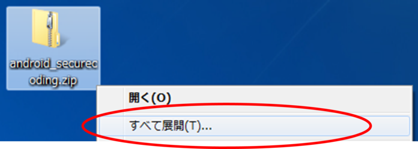{width="4.6875in" height="1.6666666666666667in"}

図 2.5‑1

1.  展開先を指定する

ここでは“C:\\android\_securecoding”という名前でワークスペースを作成します。そのため、“C:\\
”を指定し“展開”ボタンをクリックします。

{width="3.8645833333333335in"
height="3.1354166666666665in"}

図 2.5‑2

"展開"ボタンをクリックすると“C:\\”直下に“android\_securecoding”というフォルダが作成されます。

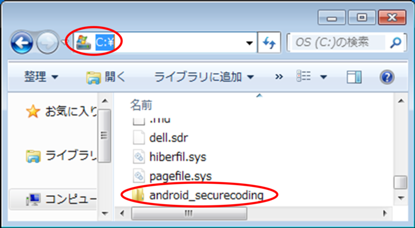{width="5.458333333333333in"
height="3.0104166666666665in"}

図 2.5‑3

“android\_securecoding”フォルダの中にはサンプルコードが含まれています。

例えば、「4.1 Activityを作る・利用する」の「4.1.1.3
パートナー限定Activityを作る・利用する」においてサンプルコードを参照したい場合は以下をご覧ください。

android\_securecoding/

　Create Use Activity/

　　　Activity PartnerActivity/

以上のように、“android\_securecoding”フォルダ配下は、節ごとに「サンプルコードのプロジェクト」が配置された構成となります。

1.  Android Studioを起動しワークスペースを指定する

スタートメニューやデスクトップアイコンなどからAndroid
Studioを起動します。

{width="4.1672484689413825in"
height="3.125436351706037in"}

図 2.5‑4

起動後、表示されたダイアログからインポートを行います。

{width="4.145574146981628in"
height="3.2916666666666665in"}

図 2.5‑5

また、既にプロジェクトを読み込んでいる場合は、そのWindowが表示されるため、メニューより"File
-&gt; Close Project"で表示しているプロジェクトをクローズします。

{width="2.5416666666666665in"
height="3.888246937882765in"}

図 2.5‑6

1.  インポートを開始する

表示されているダイアログの"Import project (Eclipse ADT, Gradle,
etc.)"をクリックします。

{width="3.9375in" height="3.1264501312335957in"}

図 2.5‑7

1.  プロジェクトを選択する

インポートするプロジェクトフォルダを展開し、同フォルダ内の
"gradle\\build.gradle" を選択します。

{width="3.15625in" height="3.6427154418197727in"}

図 2.5‑8

本ガイドのサンプルコードプロジェクトと使用しているAndroid
StudioのGradleバージョンが異なる場合、Gradleが最適化されます。

{width="4.46875in" height="0.859686132983377in"}

図 2.5‑9

画面に従い、"Update"をクリックし、Android Gradle
Pluginのアップデートを開始してください。

{width="4.645833333333333in"
height="2.2020713035870516in"}

図 2.5‑10

以下のメッセージが表示されるので"Fix Gradle wapper and re-import project
Gradle setting"をクリックし、Gradle Wrapperの更新を行ってください。

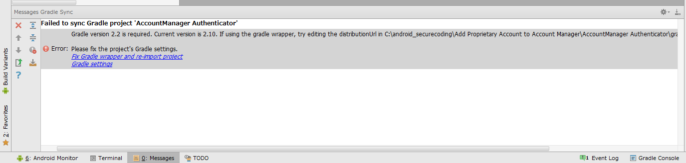{width="6.1375in" height="1.4638888888888888in"}

図 2.5‑11

1.  インポートの完了

> プロジェクトがインポートされ完了します。

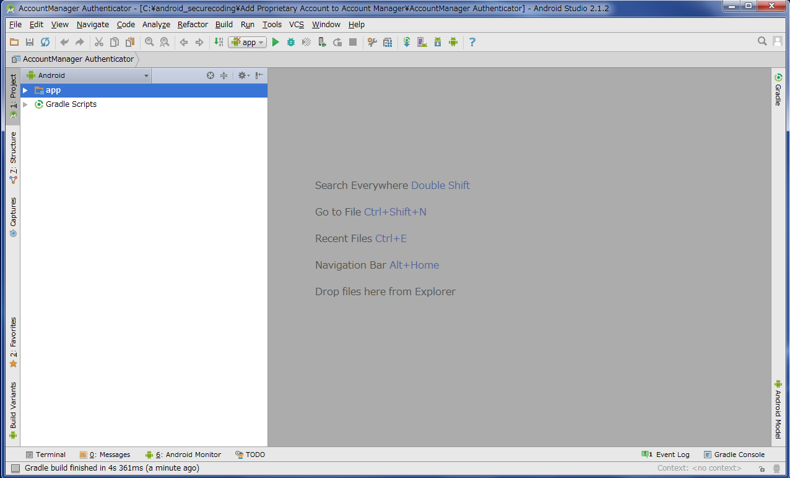{width="4.928546587926509in"
height="2.9895833333333335in"}

図 2.5‑12

Android
Studioは、Eclipseとは違い、１つのプロジェクトに対して１つのWindowで表示されます。違うプロジェクトをインポートし開く場合は、"File
-&gt; Import Project..."をクリックしインポートします。

{width="2.1770833333333335in"
height="3.3672222222222223in"}

図 2.5‑13

[]{#_Ref339636397 .anchor}

### サンプルコード動作確認用debug.keystoreを設定する

サンプルコードから作成したアプリをAndroid端末やエミュレーターで動作させるためには署名が必要です。この署名に使うデバッグ用の鍵ファイル“debug.keystore”をAndroid
Studioのプロジェクトに設定します。

1.  File -&gt;Project Structure...をクリックする

{width="2.1875in" height="3.401966316710411in"}

図 2.5‑14

1.  Signingを追加する

左欄のModulesからプロジェクト名を選択し、Signingタブを選択後、「＋」ボタンをクリックします。

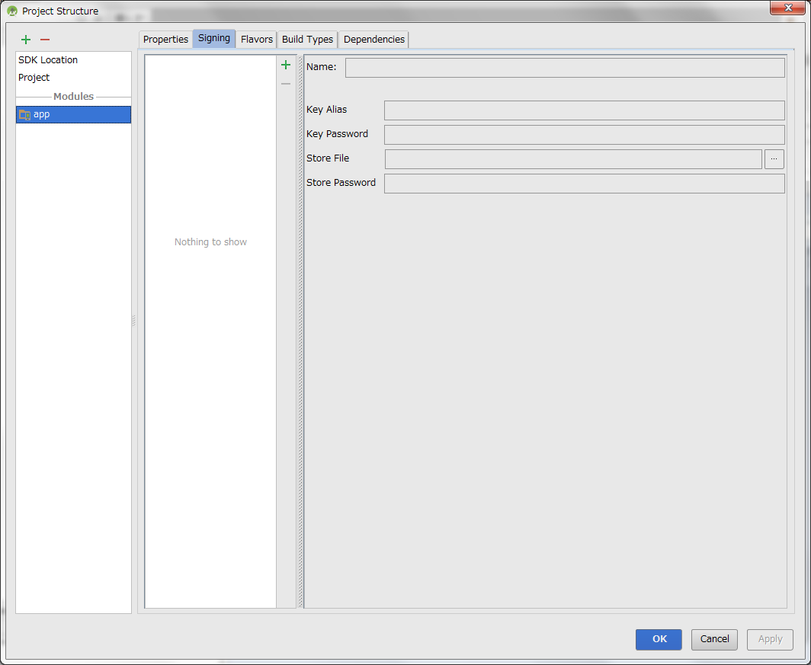{width="4.572916666666667in"
height="3.7520034995625546in"}

図 2.5‑15

1.  “debug.keystore”を選択する

debug.keystoreはサンプルコードに含まれています。(android\_securecodingフォルダ直下)

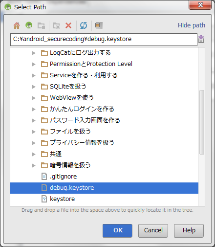{width="3.0132010061242345in"
height="3.4583333333333335in"}

図 2.5‑16

1.  Signingの名前を入力

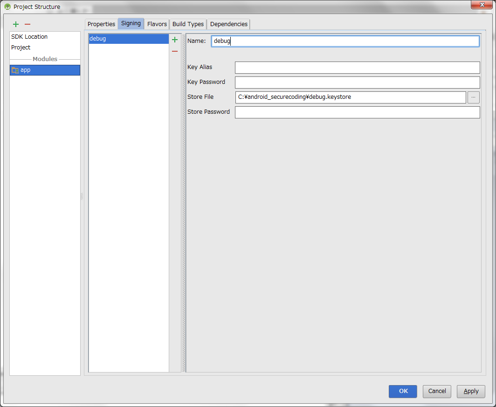{width="5.177083333333333in"
height="4.247711067366579in"}

図 2.5‑17

1.  Build TypesでSigning Configを設定

Build Typesタブを選択し、debugビルド用のSigning
ConfigをSingningで追加した"debug"を選択し、OKをクリックします。

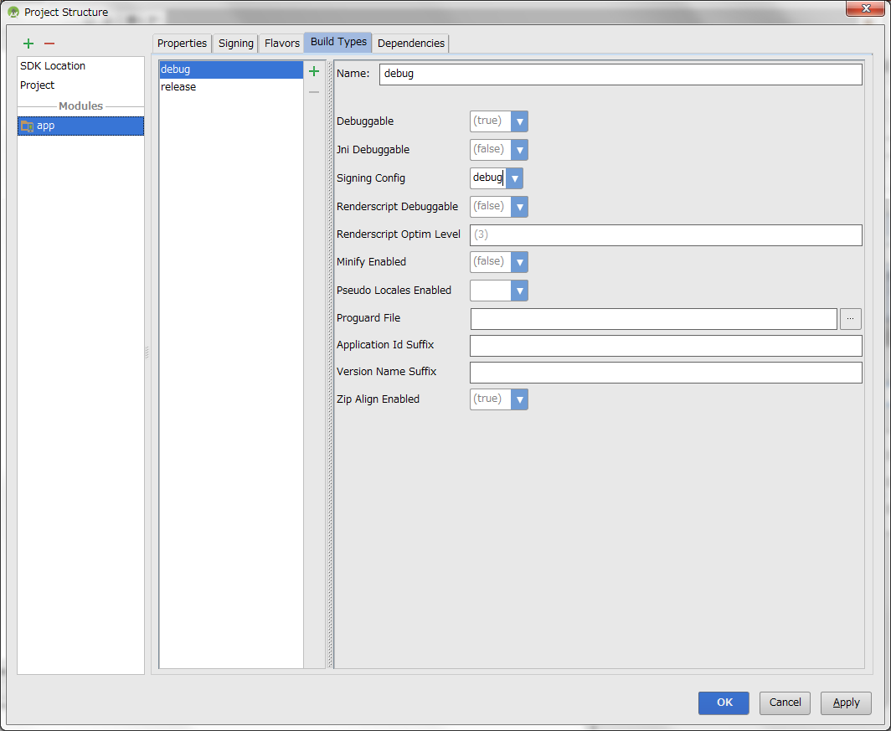{width="5.4375in" height="4.461379046369204in"}

図 2.5‑18

1.  build.gradleファイルで確認

signingConfigsに選択したdebug.keystoreのパスが表示され、buildTypesのdebugにsigningConfigが表示されます。

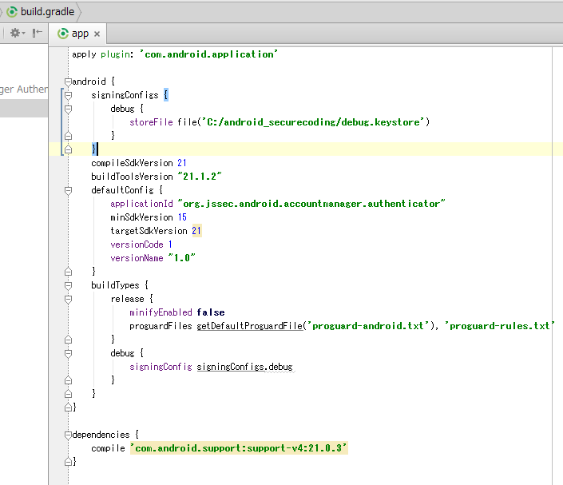{width="5.5in" height="4.7354538495188105in"}

図 2.5‑19

セキュア設計・セキュアコーディングの基礎知識
============================================

このガイド文書はAndroidアプリ開発におけるセキュリティTipsをまとめるものであるが、この章ではAndroidスマートフォン／タブレットを例に一般的なセキュア設計・セキュアコーディングの基礎知識を扱う。後続の章において一般的なセキュア設計・セキュアコーディングの解説が必要なときに、本章の記事を参照するため、後続の章を読み進める前に本章の内容に一通り目を通しておくことをお勧めする。

Androidアプリのセキュリティ
---------------------------

システムやアプリのセキュリティについて検討するとき、定番の考え方のフレームワークがある。まずそのシステムやアプリにおいて守るべき対象を把握する。これを「資産」と呼ぶ。次にその資産を脅かす攻撃を把握する。これを「脅威」と呼ぶ。最後に「資産」を「脅威」から守るための施策を検討・実施する。この施策を「対策」と呼ぶ。

ここで「対策」とは、システムやアプリに適切なセキュア設計・セキュアコーディングを施すことであり、このガイド文書では4章以降でこれを扱っている。本節では「資産」および「脅威」について焦点を当てる。

### 「資産」　守るべき対象

システムやアプリにおける「守るべき対象」には「情報」と「機能」の2つがある。これらをそれぞれ「情報資産」と「機能資産」と呼ぶ。「情報資産」とは、許可された人だけが参照や変更ができる情報のことであり、それ以外の人には一切参照や変更ができてはならない情報のことである。「機能資産」とは許可された人だけが利用できる機能のことであり、それ以外の人には一切利用できてはならない機能のことである。

以下、Androidスマートフォン／タブレットにおける情報資産と機能資産にどのようなものがあるかを紹介する。AndroidアプリやAndroidスマートフォン／タブレットを活用したシステムを開発するときの資産の洗い出しの参考にしてほしい。以降では、Androidスマートフォン／タブレットを総称してAndroidスマートフォンと呼ぶ。

#### Androidスマートフォンにおける情報資産

表 3.1‑1および表
3.1‑2はAndroidスマートフォンに入っている情報の一例である。これらの情報はスマートフォンユーザーに関する個人情報、プライバシー情報またはそれらに類する情報に該当するため適切な保護が必要である。

[[]{#_Ref351773743 .anchor}]{#_Ref351773749 .anchor}表 3.1‑1
Androidスマートフォンが管理する情報の例

  情報             備考
  ---------------- -------------------------------
  電話番号         スマートフォン自身の電話番号
  通話履歴         受発信の日時や相手番号
  IMEI             スマートフォンの端末ID
  IMSI             回線契約者ID
  センサー情報     GPS、地磁気、加速度…
  各種設定情報     WiFi設定値…
  アカウント情報   各種アカウント情報、認証情報…
  メディアデータ   写真、動画、音楽、録音…
  …                

[]{#_Ref335920354 .anchor}表 3.1‑2 アプリが管理する情報の例

  情報                    備考
  ----------------------- --------------------------
  電話帳                  知人の連絡先
  Eメールアドレス         ユーザーのメールアドレス
  Eメールメールボックス   送受信メール本文、添付…
  Webブックマーク         ブックマーク
  Web閲覧履歴             閲覧履歴
  カレンダー              予定、ToDo、イベント…
  Facebook                SNSコンテンツ…
  Twitter                 SNSコンテンツ…
  …                       

表
3.1‑1の情報は主にAndroidスマートフォン本体またはSDカードに含まれる情報であり、表
3.1‑2の情報は主にアプリが管理する情報である。特に表
3.1‑2の情報については、アプリがインストールされればされるほど、どんどん本体の中に増えていくことになるのである。

表
3.1‑3は電話帳の1件のエントリに含まれる情報である。この情報はスマートフォンユーザーに関する情報ではなく、スマートフォンユーザーの知人、友人等に関する情報である。つまりスマートフォンにはその利用者であるユーザーのみならず、ほかの人々の情報も含まれていることに注意が必要だ。

[]{#_Ref331683482 .anchor}表 3.1‑3
電話帳（Contacts）の1件のエントリに含まれる情報の例

  情報                         内容
  ---------------------------- --------------------------------------------------------------------
  電話番号                     自宅、携帯電話、仕事、FAX、MMS…
  Eメールアドレス              自宅、仕事、携帯電話…
  プロフィール画像             サムネール画像、大きな画像…
  インスタントメッセンジャー   AIM、MSN、Yahoo、Skype、QQ、Google Talk、ICQ、Jabber、Netmeeting…
  ニックネーム                 略称、イニシャル、旧姓、別名…
  住所                         国、郵便番号、地域、地方、町、通り…
  グループ                     お気に入り、家族、友達、同僚…
  ウェブサイト                 ブログ、プロフィールサイト、ホームページ、FTPサーバー、自宅、会社…
  イベント                     誕生日、記念日、その他…
  関係する人物                 配偶者、子供、父、母、マネージャー、助手、同棲関係、パートナー…
  SIPアドレス                  自宅、仕事、その他…
  …                            …

これまでの説明では主にスマートフォンユーザーの情報を紹介してきたが、アプリはユーザー以外の情報も扱っている。図
3.1‑1は1つのアプリが管理している情報を表しており、大きく分けるとプログラム部分とデータ部分に分かれる。プログラム部分は主にアプリメーカーの情報であり、データ部分は主にユーザーの情報である。アプリメーカーの情報の中には、勝手にユーザーに利用されたくない情報もあり得るため、そうした情報についてはユーザーが参照・変更できないような保護が必要である。

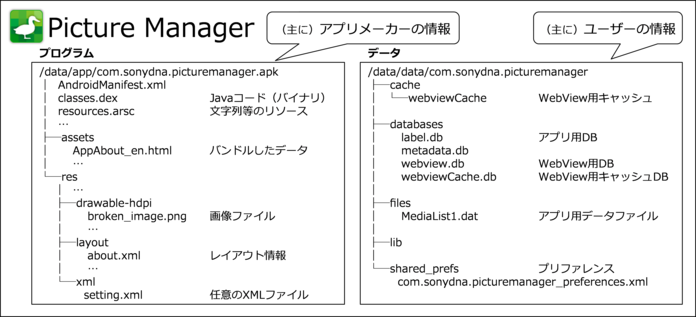{width="7.26875in" height="3.3047561242344705in"}

[]{#_Ref331686850 .anchor}図 3.1‑1 アプリが抱えている情報

Androidアプリを作る場合には図
3.1‑1のようなアプリ自身が管理する情報のみならず、表 3.1‑1、表 3.1‑2、表
3.1‑3のようなAndroidスマートフォン本体や他のアプリから取得した情報に関しても適切に保護する必要があることにも注意が必要だ。

#### Androidスマートフォンにおける機能資産

表 3.1‑4はAndroid
OSがアプリに提供する機能の一例である。これらの機能がマルウェア等に勝手に利用されてしまうとユーザーの意図しない課金が生じたり、プライバシーが損なわれるなどの被害が生じたりする。そのため情報資産と同様にこうした機能資産も適切に保護されなければならない。

[]{#_Ref331693267 .anchor}表 3.1‑4 Android OSがアプリに提供する機能
の一例

  機能                               機能
  ------------------------------- -- ----------------------------------
  SMSメッセージを送受する機能        カメラ撮影機能
  電話を掛ける機能                   音量変更機能
  ネットワーク通信機能               電話番号、携帯状態の読み取り機能
  GPS等で現在位置を得る機能          SDカード書き込み機能
  Bluetooth通信機能                  システム設定変更機能
  NFC通信機能                        ログデータの読み取り機能
  インターネット通話（SIP）機能      実行中アプリ情報の取得機能
  …                                  …

Android
OSがアプリに提供する機能に加え、Androidアプリのアプリ間連携機能も機能資産に含まれる。Androidアプリはそのアプリ内で実現している機能を他のアプリから利用できるように提供することができ、このような仕組みをアプリ間連携と呼んでいる。この機能は便利である反面、Android
アプリの開発者がセキュアコーディングの知識がないために、アプリ内部だけで利用する機能を誤って他のアプリから利用できるようにしてしまっているケースもある。他のアプリから利用できる機能の内容によっては、マルウェアから利用されては困ることもあるため、意図したアプリだけから利用できるように適切な保護が必要となることがある。

### 「脅威」　資産を脅かす攻撃

前節ではAndroidスマートフォンにおける資産について解説した。ここではそれらの脅威、つまり資産を脅かす攻撃について解説する。資産が脅かされるとは簡単に言えば、情報資産が他人に勝手に参照・変更・削除・作成されることを言い、機能資産が他人に勝手に利用されることを言う、といった具合だ。こうした資産を直接的および間接的に操作する攻撃行為を「脅威」と呼ぶ。また攻撃行為を行う人や物のことを「脅威源」と呼ぶ。攻撃者やマルウェアは脅威源であって脅威ではない。攻撃者やマルウェアが行う攻撃行為のことを脅威と呼ぶのである。これら用語間の関係を図
3.1‑2 資産、脅威、脅威源、脆弱性、被害の関係に示す。

{width="5.854166666666667in"
height="3.1041666666666665in"}

[]{#_Ref338433596 .anchor}図 3.1‑2
資産、脅威、脅威源、脆弱性、被害の関係

図
3.1‑3はAndroidアプリが動作する一般的な環境を表現したものだ。以降ではこの図をベースにしてAndroidアプリにおける脅威の説明を展開するため、初めにこの図の見方を解説する。

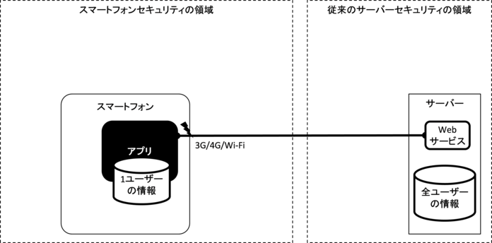{width="7.020833333333333in" height="3.46875in"}

[]{#_Ref332187235 .anchor}図 3.1‑3 Androidアプリが動作する一般的な環境

図の左右にスマートフォンとサーバーを配置している。スマートフォンやサーバーは3G/4G/Wi-Fiおよびインターネットを経由して通信している。スマートフォンの中には複数のアプリが存在するが、以降の説明で1つのアプリに関する脅威を説明するため、この図では1つのアプリに絞って説明している。スマートフォン上のアプリはそのユーザーの情報を主に扱うが、サーバー上のWebサービスは全ユーザーの情報を集中管理することを表現している。そのため従来同様にサーバーセキュリティの重要性は変わらない。サーバーセキュリティについては、このガイド文書ではスコープ外であるため言及しない。

以降ではこの図を使ってAndroidアプリにおける脅威を説明していく。

#### ネットワーク上の第三者による脅威

{width="7.020833333333333in" height="3.46875in"}

[]{#_Ref332194106 .anchor}図 3.1‑4
ネットワーク上の悪意ある第三者がアプリを攻撃する

スマートフォンアプリはユーザーの情報をサーバーで管理する形態が一般的である。そのため情報資産がネットワーク上を移動することになる。図
3.1‑4に示すように、ネットワーク上の悪意ある第三者は通信中の情報を参照（盗聴）したり、情報を変更（改ざん）したりしようとする。また本物のサーバーになりすまして、アプリの通信相手になろうとする。もちろん従来同様、ネットワーク上の悪意ある第三者はサーバーも攻撃する。

#### ユーザーがインストールしたマルウェアによる脅威

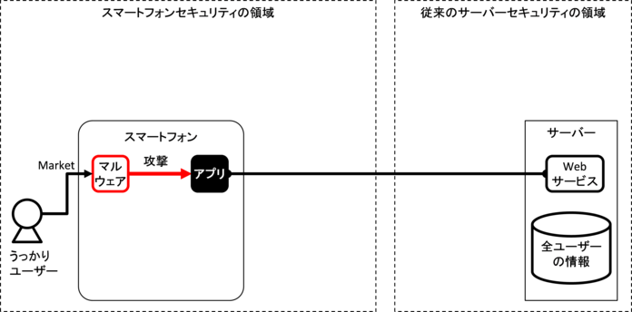{width="7.020833333333333in" height="3.46875in"}

[]{#_Ref332194149 .anchor}図 3.1‑5
ユーザーがインストールしてしまったマルウェアがアプリを攻撃する

スマートフォンは多種多様なアプリをマーケットから入手しインストールすることで機能拡張できることがその最大の特徴である。ユーザーがうっかりマルウェアアプリをインストールしてしまうこともある。図
3.1‑5が示すように、マルウェアはアプリ間連携機能やアプリの脆弱性を悪用してアプリの情報資産や機能資産にアクセスしようとする。

#### アプリの脆弱性を悪用する攻撃ファイルによる脅威

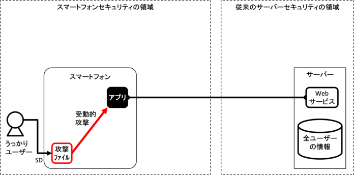{width="7.020833333333333in" height="3.46875in"}

[]{#_Ref332194411 .anchor}図 3.1‑6
アプリの脆弱性を悪用する攻撃ファイルがアプリを攻撃する

インターネット上には音楽や写真、動画、文書など、様々なタイプのファイルが大量に公開されており、ユーザーがそれらのファイルをSDカードにダウンロードし、スマートフォンで利用する形態が一般的である。またスマートフォンで受信したメールに添付されるファイルを利用する形態も一般的である。これらのファイルは閲覧用や編集用のアプリでオープンされ利用される。

こうしたファイルを処理するアプリの機能に脆弱性があると、攻撃ファイルにより、そのアプリの情報資産や機能資産が悪用されてしまう。特に複雑なデータ構造を持ったファイル形式の処理においては脆弱性が入り込みやすい。攻撃ファイルは巧みに脆弱性を悪用してアプリを操作し、攻撃ファイルの作成者の目的を達成する。

図
3.1‑6に示すように、攻撃ファイルは脆弱なアプリによってオープンされるまでは何もせず、いったんオープンされるとアプリの脆弱性を悪用した攻撃を始める。攻撃者が能動的に行う攻撃行為と比較して、このような攻撃手法を受動的攻撃（Passive
Attack）と呼ぶ。

#### 悪意あるスマートフォンユーザーによる脅威

{width="7.020833333333333in" height="3.46875in"}

[]{#_Ref332194952 .anchor}図 3.1‑7
悪意あるスマートフォンユーザーがアプリを攻撃する

Androidスマートフォンのアプリ開発においては、一般ユーザーに対してアプリを開発、解析する環境や機能が公式に提供されている。提供されている機能の中でも、特にADBと呼ばれる充実したデバッグ機能は、誰でも何の登録・審査もなく利用可能であり、この機能によりAndroidスマートフォンユーザーはOS解析行為やアプリ解析行為を容易に行うことができる。

図
3.1‑7に示すように、悪意あるスマートフォンユーザーはADB等のデバッグ機能を利用してアプリを解析し、アプリが抱える情報資産や機能資産にアクセスしようとする。アプリが抱える資産がユーザー自身のものである場合には問題とならないが、アプリメーカー等ユーザー以外のステークホルダーの資産である場合に問題となる。このようにスマートフォンのユーザー自身が悪意を持ってアプリ内の資産を狙うことがあることにも注意が必要だ。

#### スマートフォンの近くにいる第三者による脅威

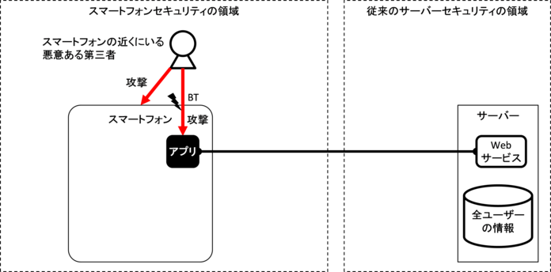{width="7.020833333333333in" height="3.46875in"}

[]{#_Ref332196096 .anchor}図 3.1‑8
スマートフォンの近くにいる悪意ある第三者がアプリを攻撃する

スマートフォンはその携帯性の良さや、Bluetooth等の近距離無線通信機能を標準搭載していることから、物理的にスマートフォンの近くにいる悪意ある第三者から攻撃され得ることも忘れてはならない。攻撃者はユーザーが入力中のパスワードを肩越しに覗き見したり、図
3.1‑8に示すように、Bluetooth通信機能を持つアプリに対してBluetoothでアクセスしたり、スマートフォン自体を盗んだり破壊したりする。特にスマートフォン自体の窃盗や破壊については、機密度の高さからスマートフォン内から一切外に出さない運用としている情報資産が失われてしまう脅威であり、アプリ設計の段階で見過ごされてしまうこともあるので注意が必要だ。

#### 様々な脅威

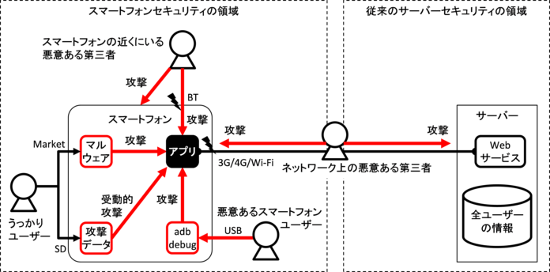{width="7.020833333333333in" height="3.46875in"}

[]{#_Ref332196512 .anchor}図 3.1‑9
スマートフォンアプリは様々な攻撃にさらされている

図
3.1‑9はこれまで説明した脅威をひとまとめにした図である。このようにスマートフォンアプリを取り巻く脅威には様々なものがあり、この図はそのすべてを書き出しているものではない。日々の情報収集により、Androidアプリを取り巻く脅威について認識を広め、アプリのセキュア設計・セキュアコーディングに活かしていく努力が必要である。一般社団法人日本スマートフォンセキュリティ協会が作成した次の文書もスマートフォンの脅威について役立つ情報を提供しているので参考にしていただきたい。

-   『スマートフォン＆タブレットの業務利用に関するセキュリティガイドライン』
    【第二版】\
    [*http://www.jssec.org/dl/guidelines\_v2.pdf*](http://www.jssec.org/dl/guidelines_v2.pdf)\
    [*http://www.jssec.org/dl/guidelines2012enew\_v1.0.pdf*](http://www.jssec.org/dl/guidelines2012enew_v1.0.pdf)
    (English)

-   『スマートフォンネットワークセキュリティ実装ガイド』 【第一版】\
    [*http://www.jssec.org/dl/NetworkSecurityGuide1.pdf*](http://www.jssec.org/dl/NetworkSecurityGuide1.pdf)

-   『スマートフォンの業務利用におけるクラウド活用ガイド』 【ベータ版】\
    [*http://www.jssec.org/dl/cloudguide2012\_beta.pdf*](http://www.jssec.org/dl/cloudguide2012_beta.pdf)

-   『MDM導入・運用検討ガイド』【第一版】\
    [*http://www.jssec.org/dl/MDMGuideV1.pdf*](http://www.jssec.org/dl/MDMGuideV1.pdf)

### 資産分類と保護施策

前節までで解説した通りAndroidスマートフォンには様々な脅威が存在する。それら脅威から、アプリが扱うすべての資産を保護することは、開発にかかる時間や技術的限界などから困難な場合がある。そのため、Androidアプリ開発者は、アプリが扱う資産の重要度や容認される被害レベルを判断基準とした優先度に応じて、資産に対する妥当な対策を検討することが必要になる。

資産毎の保護施策を決めるため、アプリが扱うそれぞれの資産について、その重要度・保護に関する法的根拠・被害発生時の影響・開発者（または組織）の社会的責任などを検討した上で、資産を分類し、分類毎に保護施策のレベルを定める。これが、それぞれの資産をどのように扱い、どのような対策を施すかを決める判断基準となる。この分類はアプリ開発者（または組織）として資産をどのように扱い保護するかを定める基準そのものであるため、アプリ開発者（または組織）がそれぞれの事情に合わせて、分類方法や対策内容を定める必要がある。

参考までに、本ガイドにおける資産分類と保護施策のレベルを以下に示す。

表 3.1‑5　資産分類と保護施策のレベル

  ----------------------------------------------------------------------------------------------------------------------------------------------------------------------------------------------------------------------------------------------------------------
  資産分類   > 資産のレベル                                                                                             保護施策のレベル
  ---------- ---------------------------------------------------------------------------------------------------------- ------------------------------------------------------------------------------------------------------------------------------------------
  高位       資産が被害にあった場合、組織または個人の活動に致命的または壊滅的な影響をあたえるもの                       -   Android OSのセキュリティモデルを破る、root権限を奪取した状態からの攻撃やAPKのdex部分を改造するといった、高度な攻撃に対しても保護する
                                                                                                                        
             > 例）資産が被害にあった場合、当該組織が事業を継続できなくなるレベル                                       -   UX等の他要素よりもセキュリティ確保を優先する
                                                                                                                        

  中位       資産が被害にあった場合、組織または個人の活動に重大な影響をあたえるもの                                     -   Android OSのセキュリティモデルを活用し、その範囲内で保護する
                                                                                                                        
             > 例）資産が被害にあった場合、当該組織の利益が悪化し、事業に影響を及ぼすレベル                             -   UX等の他要素よりもセキュリティ確保を優先する
                                                                                                                        

  低位       資産が被害にあった場合、組織または個人の活動に限定的な影響をあたえるもの                                   -   Android OSのセキュリティモデルを活用し、その範囲内で保護する
                                                                                                                        
             > 例）資産が被害にあった場合、当該組織の利益に影響を与え得るが、他の要素により利益の補てんが可能なレベル   -   UX等の他要素とセキュリティを比較し、他要素を優先しても良い
                                                                                                                        
  ----------------------------------------------------------------------------------------------------------------------------------------------------------------------------------------------------------------------------------------------------------------

本ガイドにおける資産分類と保護施策は、基本的にはroot権限が奪われていないセキュアなAndroid端末を前提とし、Android
OSのセキュリティモデルを活用したセキュリティ施策を基準にしている。具体的には、資産分類で中位レベル以下の資産に対してAndroid
OSのセキュリティモデルが機能していることを前提に、Android
OSのセキュリティモデルを活用した保護施策を想定している。一方、高位レベルの資産は、root権限が奪取された状態からの攻撃や、APK解析・改造による攻撃といった、Android
OSのセキュリティモデルが破られた状態での攻撃からも、保護が必要な資産であると想定している。このような資産を守るためには、Android
OSのセキュリティモデルが活用できないため、暗号化、難読化、ハードウェア支援、サーバー支援など複数の手段を組み合わせて高度な防御設計をする。これはガイド文書に簡潔に書けるようなノウハウではないし、個別の状況に応じて適切な防御設計は異なるため本ガイドの対象外としている。root権限奪取からの攻撃やAPK解析・改造などの高度な攻撃に対する保護が必要な場合は、Androidの耐タンパ設計に詳しいセキュリティ専門家に相談することをお勧めする。

### センシティブな情報

本ガイドのこれ以降の文章において情報資産を「センシティブな情報」と表現している。前節で述べたようにアプリが扱う個々の情報資産ごとに資産のレベルや保護施策のレベルを判断しなければならない。

入力データの安全性を確認する
----------------------------

入力データの安全性確認はもっとも基礎的で効果の高いセキュアコーディング作法である。プログラムに入力されるデータのうち、攻撃者が直接的、間接的にそのデータの値を操作可能であるものはすべて、入力データの安全性確認が必要である。以下、Activityをプログラムに見立て、Intentを入力データに見立てた場合を例にして、入力データの安全性確認の在り方について解説する。

Activityが受け取ったIntentには攻撃者が細工した​データが含まれている可能性がある。攻撃者はプログラマが想定していない形式・値のデータを送り付けることで、アプリの誤動作を誘発し、結果として何らかのセキュリティ被害を生じさせるのである。ユーザーも攻撃者の一人となり得ることも忘れてはならない。

Intentはactionやdata、extrasなどのデータで構成されるが、攻撃者が制御可能なデータはすべて気を付けなければならない。攻撃者が制御可能なデータを扱うコードでは、必ず次の事項を確認しなければならない。

(a) 受け取ったデータは、プログラマが想定した形式であって、値は想定の範囲内に収まっているか？

(b) 想定している形式、値のあらゆるデータを受け取っても、そのデータを扱うコードが想定外の動作をしないと保証できるか？

次の例は指定URL のInternet 上のWeb ページのHTML
を取得し、画面上のTextView に表示するだけの簡単なサンプルである。
しかしこれには不具合がある。

> Internet上のWebページのHTMLをTextViewに表示するサンプルコード

TextView tv = (TextView) findViewById(R.id.textview);

InputStreamReader isr = null;

char\[\] text = new char\[1024\];

int read;

try {

String urlstr = getIntent().getStringExtra("WEBPAGE\_URL");

URL url = new URL(urlstr);

isr = new InputStreamReader(url.openConnection().getInputStream());

while ((read=isr.read(text)) != -1) {

tv.append(new String(text, 0, read));

}

} catch (MalformedURLException e) { ...

(a)の観点で「urlstrが正しいURLである」ことをnew
URL()でMalformedURLExceptionが発生しないことに​より確認している。しかしこれは不十分であり、urlstrに「file://～」形式のURLが指定されるとInternet上のWebページではなく、内部ファイルシステム上のファイルを開いてTextViewに表示してしまう。プログラマが想定した動作を保証していないため、(b)の観点を満たしていない。

次は改善例である。(a)の観点で「urlstrは正規のURLであって、protocolはhttpまたはhttpsに限定される」ことを確認している。これにより(b)の観点でもurl.openConnection().getInputStream()でInternet経由のInputStreamを取得することが保証される。

> Internet上のWebページのHTMLをTextViewに表示するサンプルコードの修正版

TextView tv = (TextView) findViewById(R.id.textview);

InputStreamReader isr = null;

char\[\] text = new char\[1024\];

int read;

try {

String urlstr = getIntent().getStringExtra("WEBPAGE\_URL");

URL url = new URL(urlstr);

String prot = url.getProtocol();

if (!”http”.equals(prot) && !”https”.equals(prot)) {

throw new MalformedURLException("invalid protocol");

}

isr = new InputStreamReader(url.openConnection().getInputStream());

while ((read=isr.read(text)) != -1) {

tv.append(new String(text, 0, read));

}

} catch (MalformedURLException e) { ...

入力データの安全性確認はInput
Validationと呼ばれる基礎的なセキュアコーディング作法である。Input
Validationという言葉の語感から(a)の観点のみ気を付けて(b)の観点を忘れてしまいがちである。データはプログラムに入ってきたときではなく、プログラムがそのデータを「使う」ときに被害が発生することに気を付けていただきたい。下記URLもぜひ参考にしていただきたい。

-   IPA 「セキュアプログラミング講座」\
    [*http://www.ipa.go.jp/security/awareness/vendor/programmingv2/clanguage.html*](http://www.ipa.go.jp/security/awareness/vendor/programmingv2/clanguage.html)

-   JPCERT CC 「Java セキュアコーディングスタンダード CERT/Oracle 版」\
    [*http://www.jpcert.or.jp/java-rules/*](http://www.jpcert.or.jp/java-rules/)

-   JPCERT CC 「Java Androidアプリケーション開発へのルールの適用」\
    [*http://www.jpcert.or.jp/java-rules/android-j.html*](http://www.jpcert.or.jp/java-rules/android-j.html)

[[[[[[[[[[[[[[[[[[[]{#_Toc318925749 .anchor}]{#_Toc321181237
.anchor}]{#_Toc321159835 .anchor}]{#_Toc321144480
.anchor}]{#_Toc325955316 .anchor}]{#_Toc325137810
.anchor}]{#_Toc321181236 .anchor}]{#_Toc321159834
.anchor}]{#_Toc321144479 .anchor}]{#_Toc325955315
.anchor}]{#_Toc321333491 .anchor}]{#_Toc321181235
.anchor}]{#_Toc321159833 .anchor}]{#_Toc321144478
.anchor}]{#_Toc333324380 .anchor}]{#_Toc321183638
.anchor}]{#_Toc321181231 .anchor}]{#_Toc321159829
.anchor}]{#_Toc321144474 .anchor}

安全にテクノロジーを活用する
============================

Androidで言えばActivityやSQLiteなど、テクノロジーごとにセキュリティ観点の癖というものがある。そうしたセキュリティの癖を知らずに設計、コーディングしていると思わぬ脆弱性をつくりこんでしまうことがある。この章では開発者がAndroidのテクノロジーを活用するシーンを想定した記事を扱う。

[[]{#_Toc318922363 .anchor}]{#_Ref318917948 .anchor}

Activityを作る・利用する
------------------------

### サンプルコード

Activityがどのように利用されるかによって、Activityが抱えるリスクや適切な防御手段が異なる。ここでは、Activityがどのように利用されるかという観点で、Activityを4つのタイプに分類した。次の判定フローによって作成するActivityがどのタイプであるかを判断できる。なお、どのような相手を利用するかによって適切な防御手段が決まるため、Activityの利用側の実装についても合わせて説明する。

{width="6.889763779527559in"
height="3.0074803149606297in"}

図 4.1‑1

#### 非公開Activityを作る・利用する

非公開Activityは、同一アプリ内でのみ利用されるActivityであり、もっとも安全性の高いActivityである。

同一アプリ内だけで利用されるActivity（非公開Activity）を利用する際は、クラスを指定する明示的Intentを使えば誤って外部アプリにIntentを送信してしまうことがない。ただし、Activityを呼び出す際に使用するIntentは第三者によって読み取られる恐れがある。そのため、Activityに送信するIntentにセンシティブな情報を格納する場合には、その情報が悪意のある第三者に読み取られることのないように、適切な対応を実施する必要がある。

以下に非公開Activityを作る側のサンプルコードを示す。

> ポイント(Activityを作る)：

1.  [[]{#_Ref350850659 .anchor}]{#_Ref339532102
    .anchor}taskAffinityを指定しない

2.  []{#_Ref339532105 .anchor}launchModeを指定しない

3.  exported="false"により、明示的に非公開設定する

4.  同一アプリからのIntentであっても、受信Intentの安全性を確認する

5.  利用元アプリは同一アプリであるから、センシティブな情報を返送してよい

Activityを非公開設定するには、AndroidManifest.xmlのactivity要素のexported属性をfalseと指定する。

> AndroidManifest.xml

&lt;?xml version="1.0" encoding="utf-8"?&gt;

&lt;manifest xmlns:android="http://schemas.android.com/apk/res/android"

package="org.jssec.android.activity.privateactivity" &gt;

&lt;application

android:allowBackup="false"

android:icon="@drawable/ic\_launcher"

android:label="@string/app\_name" &gt;

&lt;!-- 非公開Activity --&gt;

&lt;!-- ★ポイント1★ taskAffinityを指定しない --&gt;

&lt;!-- ★ポイント2★ launchModeを指定しない --&gt;

&lt;!-- ★ポイント3★ exported="false"により、明示的に非公開設定する
--&gt;

&lt;activity

android:name=".PrivateActivity"

android:label="@string/app\_name"

android:exported="false" /&gt;

&lt;!-- ランチャーから起動する公開Activity --&gt;

&lt;activity

android:name=".PrivateUserActivity"

android:label="@string/app\_name"

android:exported="true" &gt;

&lt;intent-filter&gt;

&lt;action android:name="android.intent.action.MAIN" /&gt;

&lt;category android:name="android.intent.category.LAUNCHER" /&gt;

&lt;/intent-filter&gt;

&lt;/activity&gt;

&lt;/application&gt;

&lt;/manifest&gt;

> PrivateActivity.java

package org.jssec.android.activity.privateactivity;

import android.app.Activity;

import android.content.Intent;

import android.os.Bundle;

import android.view.View;

import android.widget.Toast;

public class PrivateActivity extends Activity {

@Override

public void onCreate(Bundle savedInstanceState) {

super.onCreate(savedInstanceState);

setContentView(R.layout.private\_activity);

// ★ポイント4★
同一アプリからのIntentであっても、受信Intentの安全性を確認する

// サンプルにつき割愛。「3.2 入力データの安全性を確認する」を参照。

String param = getIntent().getStringExtra("PARAM");

Toast.makeText(this, String.format("パラメータ「%s」を受け取った。",
param), Toast.LENGTH\_LONG).show();

}

public void onReturnResultClick(View view) {

// ★ポイント5★
利用元アプリは同一アプリであるから、センシティブな情報を返送してよい

Intent intent = new Intent();

intent.putExtra("RESULT", "センシティブな情報");

setResult(RESULT\_OK, intent);

finish();

}

}

次に非公開Activityを利用する側のサンプルコードを示す。

> ポイント(Activityを利用する)：

1.  []{#_Ref339532110
    .anchor}Activityに送信するIntentには、フラグFLAG\_ACTIVITY\_NEW\_TASKを設定しない

2.  同一アプリ内Activityはクラス指定の明示的Intentで呼び出す

3.  利用先アプリは同一アプリであるから、センシティブな情報をputExtra()を使う場合に限り送信してもよい[^1]

4.  同一アプリ内Activityからの結果情報であっても、受信データの安全性を確認する

> PrivateUserActivity.java

package org.jssec.android.activity.privateactivity;

import android.app.Activity;

import android.content.Intent;

import android.os.Bundle;

import android.view.View;

import android.widget.Toast;

public class PrivateUserActivity extends Activity {

private static final int REQUEST\_CODE = 1;

@Override

public void onCreate(Bundle savedInstanceState) {

super.onCreate(savedInstanceState);

setContentView(R.layout.user\_activity);

}

public void onUseActivityClick(View view) {

// ★ポイント6★
Activityに送信するIntentには、フラグFLAG\_ACTIVITY\_NEW\_TASKを設定しない

// ★ポイント7★ 同一アプリ内Activityはクラス指定の明示的Intentで呼び出す

Intent intent = new Intent(this, PrivateActivity.class);

// ★ポイント8★
利用先アプリは同一アプリであるから、センシティブな情報をputExtra()を使う場合に限り送信してもよい

intent.putExtra("PARAM", "センシティブな情報");

startActivityForResult(intent, REQUEST\_CODE);

}

@Override

public void onActivityResult(int requestCode, int resultCode, Intent
data) {

super.onActivityResult(requestCode, resultCode, data);

if (resultCode != RESULT\_OK) return;

switch (requestCode) {

case REQUEST\_CODE:

String result = data.getStringExtra("RESULT");

// ★ポイント9★
同一アプリ内Activityからの結果情報であっても、受信データの安全性を確認する

// サンプルにつき割愛。「3.2 入力データの安全性を確認する」を参照。

Toast.makeText(this, String.format("結果「%s」を受け取った。", result),
Toast.LENGTH\_LONG).show();

break;

}

}

}

#### 公開Activityを作る・利用する

公開Activityは、不特定多数のアプリに利用されることを想定したActivityである。マルウェアが送信したIntentを受信することがあることに注意が必要である。また、公開Activityを利用する場合には、送信するIntentがマルウェアに受信される、あるいは読み取られることがあることに注意が必要である。

以下に公開Activityを作る側のサンプルコードを示す。

> ポイント(Activityを作る)：

1.  exported="true"により、明示的に公開設定する

2.  受信Intentの安全性を確認する

&nbsp;
1.  結果を返す場合、センシティブな情報を含めない

> AndroidManifest.xml

&lt;?xml version="1.0" encoding="utf-8"?&gt;

&lt;manifest xmlns:android="http://schemas.android.com/apk/res/android"

package="org.jssec.android.activity.publicactivity" &gt;

&lt;application

android:allowBackup="false"

android:icon="@drawable/ic\_launcher"

android:label="@string/app\_name" &gt;

&lt;!-- 公開Activity --&gt;

&lt;!-- ★ポイント1★ exported="true"により、明示的に公開設定する --&gt;

&lt;activity

android:name=".PublicActivity"

android:label="@string/app\_name"

android:exported="true" &gt;

&lt;!-- Action指定による暗黙的Intentを受信するようにIntent Filterを定義
--&gt;

&lt;intent-filter&gt;

&lt;action android:name="org.jssec.android.activity.MY\_ACTION" /&gt;

&lt;category android:name="android.intent.category.DEFAULT" /&gt;

&lt;/intent-filter&gt;

&lt;/activity&gt;

&lt;/application&gt;

&lt;/manifest&gt;

> PublicActivity.java

package org.jssec.android.activity.publicactivity;

import android.app.Activity;

import android.content.Intent;

import android.os.Bundle;

import android.view.View;

import android.widget.Toast;

public class PublicActivity extends Activity {

@Override

public void onCreate(Bundle savedInstanceState) {

super.onCreate(savedInstanceState);

setContentView(R.layout.main);

// ★ポイント2★ 受信Intentの安全性を確認する

// 公開Activityであるため利用元アプリがマルウェアである可能性がある。

// サンプルにつき割愛。「3.2 入力データの安全性を確認する」を参照。

String param = getIntent().getStringExtra("PARAM");

Toast.makeText(this, String.format("パラメータ「%s」を受け取った。",
param), Toast.LENGTH\_LONG).show();

}

public void onReturnResultClick(View view) {

// ★ポイント3★ 結果を返す場合、センシティブな情報を含めない

// 公開Activityであるため利用元アプリがマルウェアである可能性がある。

//
マルウェアに取得されても問題のない情報であれば結果として返してもよい。

Intent intent = new Intent();

intent.putExtra("RESULT", "センシティブではない情報");

setResult(RESULT\_OK, intent);

finish();

}

}

次に公開Activityを利用する側のサンプルコードを示す。

> ポイント(Activityを利用する)：

1.  センシティブな情報を送信してはならない

2.  結果を受け取る場合、結果データの安全性を確認する

> PublicUserActivity.java

package org.jssec.android.activity.publicuser;

import android.app.Activity;

import android.content.ActivityNotFoundException;

import android.content.Intent;

import android.os.Bundle;

import android.view.View;

import android.widget.Toast;

public class PublicUserActivity extends Activity {

private static final int REQUEST\_CODE = 1;

@Override

public void onCreate(Bundle savedInstanceState) {

super.onCreate(savedInstanceState);

setContentView(R.layout.main);

}

public void onUseActivityClick(View view) {

try {

// ★ポイント4★ センシティブな情報を送信してはならない

Intent intent = new Intent("org.jssec.android.activity.MY\_ACTION");

intent.putExtra("PARAM", "センシティブではない情報");

startActivityForResult(intent, REQUEST\_CODE);

} catch (ActivityNotFoundException e) {

Toast.makeText(this, "利用先Activityが見つからない。",
Toast.LENGTH\_LONG).show();

}

}

@Override

public void onActivityResult(int requestCode, int resultCode, Intent
data) {

super.onActivityResult(requestCode, resultCode, data);

// ★ポイント5★ 結果を受け取る場合、結果データの安全性を確認する

// サンプルにつき割愛。「3.2 入力データの安全性を確認する」を参照。

if (resultCode != RESULT\_OK) return;

switch (requestCode) {

case REQUEST\_CODE:

String result = data.getStringExtra("RESULT");

Toast.makeText(this, String.format("結果「%s」を受け取った。", result),
Toast.LENGTH\_LONG).show();

break;

}

}

}

#### パートナー限定Activityを作る・利用する

パートナー限定Activityは、特定のアプリだけから利用できるActivityである。パートナー企業のアプリと自社アプリが連携してシステムを構成し、パートナーアプリとの間で扱う情報や機能を守るために利用される。

Activityを呼び出す際に使用するIntentは第三者によって読み取られる恐れがある。そのため、Activityに送信するIntentにセンシティブな情報を格納する場合には、その情報が悪意のある第三者に読み取られることのないように、適切な対応を実施する必要がある。

以下にパートナー限定Activityを作る側のサンプルコードを示す。

> ポイント(Activityを作る)：

1.  taskAffinityを指定しない

&nbsp;
1.  launchModeを指定しない

2.  Intent Filterを定義せず、exported="true"を明示的に設定する

3.  利用元アプリの証明書がホワイトリストに登録されていることを確認する

4.  パートナーアプリからのIntentであっても、受信Intentの安全性を確認する

5.  パートナーアプリに開示してよい情報に限り返送してよい

ホワイトリストを用いたアプリの確認方法については、「4.1.3.2
利用元アプリを確認する」を参照すること。また、ホワイトリストに指定する利用先アプリの証明書ハッシュ値の確認方法は「5.2.1.3
アプリの証明書のハッシュ値を確認する方法」を参照すること。

> AndroidManifest.xml

&lt;?xml version="1.0" encoding="utf-8"?&gt;

&lt;manifest xmlns:android="http://schemas.android.com/apk/res/android"

package="org.jssec.android.activity.partneractivity" &gt;

&lt;application

android:allowBackup="false"

android:icon="@drawable/ic\_launcher"

android:label="@string/app\_name" &gt;

&lt;!-- パートナー限定Activity --&gt;

&lt;!-- ★ポイント1★ taskAffinityを指定しない --&gt;

&lt;!-- ★ポイント2★ launchModeを指定しない --&gt;

&lt;!-- ★ポイント3★ Intent
Filterを定義せず、exported="true"を明示的に設定する --&gt;

&lt;activity

android:name=".PartnerActivity"

android:exported="true" /&gt;

&lt;/application&gt;

&lt;/manifest&gt;

> PartnerActivity.java

package org.jssec.android.activity.partneractivity;

import org.jssec.android.shared.PkgCertWhitelists;

import org.jssec.android.shared.Utils;

import android.app.Activity;

import android.content.Context;

import android.content.Intent;

import android.os.Bundle;

import android.view.View;

import android.widget.Toast;

public class PartnerActivity extends Activity {

// ★ポイント4★
利用元アプリの証明書がホワイトリストに登録されていることを確認する

private static PkgCertWhitelists sWhitelists = null;

private static void buildWhitelists(Context context) {

boolean isdebug = Utils.isDebuggable(context);

sWhitelists = new PkgCertWhitelists();

// パートナーアプリ org.jssec.android.activity.partneruser
の証明書ハッシュ値を登録

sWhitelists.add("org.jssec.android.activity.partneruser", isdebug ?

// debug.keystoreの"androiddebugkey"の証明書ハッシュ値

"0EFB7236 328348A9 89718BAD DF57F544 D5CCB4AE B9DB34BC 1E29DD26
F77C8255" :

// keystoreの"partner key"の証明書ハッシュ値

"1F039BB5 7861C27A 3916C778 8E78CE00 690B3974 3EB8259F E2627B8D
4C0EC35A");

// 以下同様に他のパートナーアプリを登録...

}

private static boolean checkPartner(Context context, String pkgname) {

if (sWhitelists == null) buildWhitelists(context);

return sWhitelists.test(context, pkgname);

}

@Override

public void onCreate(Bundle savedInstanceState) {

super.onCreate(savedInstanceState);

setContentView(R.layout.main);

// ★ポイント4★
利用元アプリの証明書がホワイトリストに登録されていることを確認する

if (!checkPartner(this, getCallingActivity().getPackageName())) {

Toast.makeText(this, "利用元アプリはパートナーアプリではない。",
Toast.LENGTH\_LONG).show();

finish();

return;

}

// ★ポイント5★
パートナーアプリからのIntentであっても、受信Intentの安全性を確認する

// サンプルにつき割愛。「3.2 入力データの安全性を確認する」を参照。

Toast.makeText(this, "パートナーアプリからアクセスあり",
Toast.LENGTH\_LONG).show();

}

public void onReturnResultClick(View view) {

// ★ポイント6★ パートナーアプリに開示してよい情報に限り返送してよい

Intent intent = new Intent();

intent.putExtra("RESULT", "パートナーアプリに開示してよい情報");

setResult(RESULT\_OK, intent);

finish();

}

}

> PkgCertWhitelists.java

package org.jssec.android.shared;

import java.util.HashMap;

import java.util.Map;

import android.content.Context;

public class PkgCertWhitelists {

private Map&lt;String, String&gt; mWhitelists = new HashMap&lt;String,
String&gt;();

public boolean add(String pkgname, String sha256) {

if (pkgname == null) return false;

if (sha256 == null) return false;

sha256 = sha256.replaceAll(" ", "");

if (sha256.length() != 64) return false; // SHA-256は32バイト

sha256 = sha256.toUpperCase();

if (sha256.replaceAll("\[0-9A-F\]+", "").length() != 0) return false; //
0-9A-F 以外の文字がある

mWhitelists.put(pkgname, sha256);

return true;

}

public boolean test(Context ctx, String pkgname) {

// pkgnameに対応する正解のハッシュ値を取得する

String correctHash = mWhitelists.get(pkgname);

// pkgnameの実際のハッシュ値と正解のハッシュ値を比較する

return PkgCert.test(ctx, pkgname, correctHash);

}

}

> PkgCert.java

package org.jssec.android.shared;

import java.security.MessageDigest;

import java.security.NoSuchAlgorithmException;

import android.content.Context;

import android.content.pm.PackageInfo;

import android.content.pm.PackageManager;

import android.content.pm.PackageManager.NameNotFoundException;

import android.content.pm.Signature;

public class PkgCert {

public static boolean test(Context ctx, String pkgname, String
correctHash) {

if (correctHash == null) return false;

correctHash = correctHash.replaceAll(" ", "");

return correctHash.equals(hash(ctx, pkgname));

}

public static String hash(Context ctx, String pkgname) {

if (pkgname == null) return null;

try {

PackageManager pm = ctx.getPackageManager();

PackageInfo pkginfo = pm.getPackageInfo(pkgname,
PackageManager.GET\_SIGNATURES);

if (pkginfo.signatures.length != 1) return null; // 複数署名は扱わない

Signature sig = pkginfo.signatures\[0\];

byte\[\] cert = sig.toByteArray();

byte\[\] sha256 = computeSha256(cert);

return byte2hex(sha256);

} catch (NameNotFoundException e) {

return null;

}

}

private static byte\[\] computeSha256(byte\[\] data) {

try {

return MessageDigest.getInstance("SHA-256").digest(data);

} catch (NoSuchAlgorithmException e) {

return null;

}

}

private static String byte2hex(byte\[\] data) {

if (data == null) return null;

final StringBuilder hexadecimal = new StringBuilder();

for (final byte b : data) {

hexadecimal.append(String.format("%02X", b));

}

return hexadecimal.toString();

}

}

次にパートナー限定Activityを利用する側のサンプルコードを示す。ここではパートナー限定Activityを呼び出す方法を説明する。

> ポイント(Activityを利用する)：

1.  利用先パートナー限定Activityアプリの証明書がホワイトリストに登録されていることを確認する

2.  Activityに送信するIntentには、フラグFLAG\_ACTIVITY\_NEW\_TASKを設定しない

3.  利用先パートナー限定アプリに開示してよい情報はputExtra()を使う場合に限り送信してよい

4.  明示的Intentによりパートナー限定Activityを呼び出す

5.  startActivityForResult()によりパートナー限定Activityを呼び出す

6.  パートナー限定アプリからの結果情報であっても、受信Intentの安全性を確認する

ホワイトリストを用いたアプリの確認方法については、「4.1.3.2
利用元アプリを確認する」を参照すること。また、ホワイトリストに指定する利用先アプリの証明書ハッシュ値の確認方法は「5.2.1.3
アプリの証明書のハッシュ値を確認する方法」を参照すること。

> AndroidManifest.xml

&lt;?xml version="1.0" encoding="utf-8"?&gt;

&lt;manifest xmlns:android="http://schemas.android.com/apk/res/android"

package="org.jssec.android.activity.partneruser" &gt;

&lt;application

android:allowBackup="false"

android:icon="@drawable/ic\_launcher"

android:label="@string/app\_name" &gt;

&lt;activity

android:name=".PartnerUserActivity"

android:label="@string/app\_name"

android:exported="true" &gt;

&lt;intent-filter&gt;

&lt;action android:name="android.intent.action.MAIN" /&gt;

&lt;category android:name="android.intent.category.LAUNCHER" /&gt;

&lt;/intent-filter&gt;

&lt;/activity&gt;

&lt;/application&gt;

&lt;/manifest&gt;

> PartnerUserActivity.java

package org.jssec.android.activity.partneruser;

import org.jssec.android.shared.PkgCertWhitelists;

import org.jssec.android.shared.Utils;

import android.app.Activity;

import android.content.ActivityNotFoundException;

import android.content.Context;

import android.content.Intent;

import android.os.Bundle;

import android.view.View;

import android.widget.Toast;

public class PartnerUserActivity extends Activity {

// ★ポイント7★
利用先パートナー限定Activityアプリの証明書がホワイトリストに登録されていることを確認する

private static PkgCertWhitelists sWhitelists = null;

private static void buildWhitelists(Context context) {

boolean isdebug = Utils.isDebuggable(context);

sWhitelists = new PkgCertWhitelists();

// パートナー限定Activityアプリ
org.jssec.android.activity.partneractivity の証明書ハッシュ値を登録

sWhitelists.add("org.jssec.android.activity.partneractivity", isdebug ?

// debug.keystoreの"androiddebugkey"の証明書ハッシュ値

"0EFB7236 328348A9 89718BAD DF57F544 D5CCB4AE B9DB34BC 1E29DD26
F77C8255" :

// keystoreの"my company key"の証明書ハッシュ値

"D397D343 A5CBC10F 4EDDEB7C A10062DE 5690984F 1FB9E88B D7B3A7C2
42E142CA");

// 以下同様に他のパートナー限定Activityアプリを登録...

}

private static boolean checkPartner(Context context, String pkgname) {

if (sWhitelists == null) buildWhitelists(context);

return sWhitelists.test(context, pkgname);

}

private static final int REQUEST\_CODE = 1;

// 利用先のパートナー限定Activityに関する情報

private static final String TARGET\_PACKAGE =
"org.jssec.android.activity.partneractivity";

private static final String TARGET\_ACTIVITY =
"org.jssec.android.activity.partneractivity.PartnerActivity";

@Override

public void onCreate(Bundle savedInstanceState) {

super.onCreate(savedInstanceState);

setContentView(R.layout.main);

}

public void onUseActivityClick(View view) {

// ★ポイント7★
利用先パートナー限定Activityアプリの証明書がホワイトリストに登録されていることを確認する

if (!checkPartner(this, TARGET\_PACKAGE)) {

Toast.makeText(this, "利用先 Activity
アプリはホワイトリストに登録されていない。", Toast.LENGTH\_LONG).show();

return;

}

try {

Intent intent = new Intent();

// ★ポイント8★
Activityに送信するIntentには、フラグFLAG\_ACTIVITY\_NEW\_TASKを設定しない

// ★ポイント9★
利用先パートナー限定アプリに開示してよい情報をputExtra()を使う場合に限り送信してよい

intent.putExtra("PARAM", "パートナーアプリに開示してよい情報");

// ★ポイント10★ 明示的Intentによりパートナー限定Activityを呼び出す

intent.setClassName(TARGET\_PACKAGE, TARGET\_ACTIVITY);

// ★ポイント11★
startActivityForResult()によりパートナー限定Activityを呼び出す

startActivityForResult(intent, REQUEST\_CODE);

}

catch (ActivityNotFoundException e) {

Toast.makeText(this, "利用先Activityが見つからない。",
Toast.LENGTH\_LONG).show();

}

}

@Override

public void onActivityResult(int requestCode, int resultCode, Intent
data) {

super.onActivityResult(requestCode, resultCode, data);

if (resultCode != RESULT\_OK) return;

switch (requestCode) {

case REQUEST\_CODE:

String result = data.getStringExtra("RESULT");

// ★ポイント12★
パートナー限定アプリからの結果情報であっても、受信Intentの安全性を確認する

// サンプルにつき割愛。「3.2 入力データの安全性を確認する」を参照。

Toast.makeText(this,

String.format("結果「%s」を受け取った。", result),
Toast.LENGTH\_LONG).show();

break;

}

}

}

> PkgCertWhitelists.java

package org.jssec.android.shared;

import java.util.HashMap;

import java.util.Map;

import android.content.Context;

public class PkgCertWhitelists {

private Map&lt;String, String&gt; mWhitelists = new HashMap&lt;String,
String&gt;();

public boolean add(String pkgname, String sha256) {

if (pkgname == null) return false;

if (sha256 == null) return false;

sha256 = sha256.replaceAll(" ", "");

if (sha256.length() != 64) return false; // SHA-256は32バイト

sha256 = sha256.toUpperCase();

if (sha256.replaceAll("\[0-9A-F\]+", "").length() != 0) return false; //
0-9A-F 以外の文字がある

mWhitelists.put(pkgname, sha256);

return true;

}

public boolean test(Context ctx, String pkgname) {

// pkgnameに対応する正解のハッシュ値を取得する

String correctHash = mWhitelists.get(pkgname);

// pkgnameの実際のハッシュ値と正解のハッシュ値を比較する

return PkgCert.test(ctx, pkgname, correctHash);

}

}

> PkgCert.java

package org.jssec.android.shared;

import java.security.MessageDigest;

import java.security.NoSuchAlgorithmException;

import android.content.Context;

import android.content.pm.PackageInfo;

import android.content.pm.PackageManager;

import android.content.pm.PackageManager.NameNotFoundException;

import android.content.pm.Signature;

public class PkgCert {

public static boolean test(Context ctx, String pkgname, String
correctHash) {

if (correctHash == null) return false;

correctHash = correctHash.replaceAll(" ", "");

return correctHash.equals(hash(ctx, pkgname));

}

public static String hash(Context ctx, String pkgname) {

if (pkgname == null) return null;

try {

PackageManager pm = ctx.getPackageManager();

PackageInfo pkginfo = pm.getPackageInfo(pkgname,
PackageManager.GET\_SIGNATURES);

if (pkginfo.signatures.length != 1) return null; // 複数署名は扱わない

Signature sig = pkginfo.signatures\[0\];

byte\[\] cert = sig.toByteArray();

byte\[\] sha256 = computeSha256(cert);

return byte2hex(sha256);

} catch (NameNotFoundException e) {

return null;

}

}

private static byte\[\] computeSha256(byte\[\] data) {

try {

return MessageDigest.getInstance("SHA-256").digest(data);

} catch (NoSuchAlgorithmException e) {

return null;

}

}

private static String byte2hex(byte\[\] data) {

if (data == null) return null;

final StringBuilder hexadecimal = new StringBuilder();

for (final byte b : data) {

hexadecimal.append(String.format("%02X", b));

}

return hexadecimal.toString();

}

}

#### 自社限定Activityを作る・利用する

自社限定Activityは、自社以外のアプリから利用されることを禁止するActivityである。複数の自社製アプリでシステムを構成し、自社アプリが扱う情報や機能を守るために利用される。

Activityを呼び出す際に使用するIntentは第三者によって読み取られる恐れがある。そのため、Activityに送信するIntentにセンシティブな情報を格納する場合には、その情報が悪意のある第三者に読み取られることのないように、適切な対応を実施する必要がある。

以下に自社限定Activityを作る側のサンプルコードを示す。

> ポイント(Activityを作る)：

1.  独自定義Signature Permissionを定義する

&nbsp;
1.  taskAffinityを指定しない

2.  launchModeを指定しない

3.  独自定義Signature Permissionを要求宣言する

4.  Intent Filterを定義せず、exported="true"を明示的に設定する

5.  独自定義Signature
    Permissionが自社アプリにより定義されていることを確認する

6.  自社アプリからのIntentであっても、受信Intentの安全性を確認する

7.  利用元アプリは自社アプリであるから、センシティブな情報を返送してよい

8.  利用元アプリと同じ開発者鍵でAPKを署名する

> AndroidManifest.xml

&lt;?xml version="1.0" encoding="utf-8"?&gt;

&lt;manifest xmlns:android="http://schemas.android.com/apk/res/android"

package="org.jssec.android.activity.inhouseactivity" &gt;

&lt;!-- ★ポイント1★ 独自定義Signature Permissionを定義する --&gt;

&lt;permission

android:name="org.jssec.android.activity.inhouseactivity.MY\_PERMISSION"

android:protectionLevel="signature" /&gt;

&lt;application

android:allowBackup="false"

android:icon="@drawable/ic\_launcher"

android:label="@string/app\_name" &gt;

&lt;!-- 自社限定Activity --&gt;

&lt;!-- ★ポイント2★ taskAffinityを指定しない --&gt;

&lt;!-- ★ポイント3★ launchModeを指定しない --&gt;

&lt;!-- ★ポイント4★ 独自定義Signature Permissionを要求宣言する --&gt;

&lt;!-- ★ポイント5★ Intent
Filterを定義せず、exported="true"を明示的に設定する --&gt;

&lt;activity

android:name=".InhouseActivity"

android:exported="true"

android:permission="org.jssec.android.activity.inhouseactivity.MY\_PERMISSION"
&gt;

&lt;/activity&gt;

&lt;/application&gt;

&lt;/manifest&gt;

> InhouseActivity.java

package org.jssec.android.activity.inhouseactivity;

import org.jssec.android.shared.SigPerm;

import org.jssec.android.shared.Utils;

import android.app.Activity;

import android.content.Context;

import android.content.Intent;

import android.os.Bundle;

import android.view.View;

import android.widget.Toast;

public class InhouseActivity extends Activity {

// 自社のSignature Permission

private static final String MY\_PERMISSION =
"org.jssec.android.activity.inhouseactivity.MY\_PERMISSION";

// 自社の証明書のハッシュ値

private static String sMyCertHash = null;

private static String myCertHash(Context context) {

if (sMyCertHash == null) {

if (Utils.isDebuggable(context)) {

// debug.keystoreの"androiddebugkey"の証明書ハッシュ値

sMyCertHash = "0EFB7236 328348A9 89718BAD DF57F544 D5CCB4AE B9DB34BC
1E29DD26 F77C8255";

} else {

// keystoreの"my company key"の証明書ハッシュ値

sMyCertHash = "D397D343 A5CBC10F 4EDDEB7C A10062DE 5690984F 1FB9E88B
D7B3A7C2 42E142CA";

}

}

return sMyCertHash;

}

@Override

public void onCreate(Bundle savedInstanceState) {

super.onCreate(savedInstanceState);

setContentView(R.layout.main);

// ★ポイント6★ 独自定義Signature
Permissionが自社アプリにより定義されていることを確認する

if (!SigPerm.test(this, MY\_PERMISSION, myCertHash(this))) {

Toast.makeText(this, "独自定義Signature
Permissionが自社アプリにより定義されていない。",
Toast.LENGTH\_LONG).show();

finish();

return;

}

// ★ポイント7★
自社アプリからのIntentであっても、受信Intentの安全性を確認する

// サンプルにつき割愛。「3.2 入力データの安全性を確認する」を参照

String param = getIntent().getStringExtra("PARAM");

Toast.makeText(this, String.format("パラメータ「%s」を受け取った。",
param), Toast.LENGTH\_LONG).show();

}

public void onReturnResultClick(View view) {

// ★ポイント8★
利用元アプリは自社アプリであるから、センシティブな情報を返送してよい

Intent intent = new Intent();

intent.putExtra("RESULT", "センシティブな情報");

setResult(RESULT\_OK, intent);

finish();

}

}

> SigPerm.java

package org.jssec.android.shared;

import android.content.Context;

import android.content.pm.PackageManager;

import android.content.pm.PackageManager.NameNotFoundException;

import android.content.pm.PermissionInfo;

public class SigPerm {

public static boolean test(Context ctx, String sigPermName, String
correctHash) {

if (correctHash == null) return false;

correctHash = correctHash.replaceAll(" ", "");

return correctHash.equals(hash(ctx, sigPermName));

}

public static String hash(Context ctx, String sigPermName) {

if (sigPermName == null) return null;

try {

// sigPermNameを定義したアプリのパッケージ名を取得する

PackageManager pm = ctx.getPackageManager();

PermissionInfo pi;

pi = pm.getPermissionInfo(sigPermName, PackageManager.GET\_META\_DATA);

String pkgname = pi.packageName;

// 非Signature Permissionの場合は失敗扱い

if (pi.protectionLevel != PermissionInfo.PROTECTION\_SIGNATURE) return
null;

// sigPermNameを定義したアプリの証明書のハッシュ値を返す

return PkgCert.hash(ctx, pkgname);

} catch (NameNotFoundException e) {

return null;

}

}

}

> PkgCert.java

package org.jssec.android.shared;

import java.security.MessageDigest;

import java.security.NoSuchAlgorithmException;

import android.content.Context;

import android.content.pm.PackageInfo;

import android.content.pm.PackageManager;

import android.content.pm.PackageManager.NameNotFoundException;

import android.content.pm.Signature;

public class PkgCert {

public static boolean test(Context ctx, String pkgname, String
correctHash) {

if (correctHash == null) return false;

correctHash = correctHash.replaceAll(" ", "");

return correctHash.equals(hash(ctx, pkgname));

}

public static String hash(Context ctx, String pkgname) {

if (pkgname == null) return null;

try {

PackageManager pm = ctx.getPackageManager();

PackageInfo pkginfo = pm.getPackageInfo(pkgname,
PackageManager.GET\_SIGNATURES);

if (pkginfo.signatures.length != 1) return null; // 複数署名は扱わない

Signature sig = pkginfo.signatures\[0\];

byte\[\] cert = sig.toByteArray();

byte\[\] sha256 = computeSha256(cert);

return byte2hex(sha256);

} catch (NameNotFoundException e) {

return null;

}

}

private static byte\[\] computeSha256(byte\[\] data) {

try {

return MessageDigest.getInstance("SHA-256").digest(data);

} catch (NoSuchAlgorithmException e) {

return null;

}

}

private static String byte2hex(byte\[\] data) {

if (data == null) return null;

final StringBuilder hexadecimal = new StringBuilder();

for (final byte b : data) {

hexadecimal.append(String.format("%02X", b));

}

return hexadecimal.toString();

}

}

★ポイント9★APKをExportするときに、利用元アプリと同じ開発者鍵でAPKを署名する。

{width="4.647222222222222in"
height="3.2743055555555554in"}

図 4.1‑2

次に自社限定Activityを利用する側のサンプルコードを示す。ここでは自社限定Activityを呼び出す方法を説明する。

> ポイント(Activityを利用する)：

1.  独自定義Signature Permissionを利用宣言する

2.  独自定義Signature
    Permissionが自社アプリにより定義されていることを確認する

3.  利用先アプリの証明書が自社の証明書であることを確認する

4.  利用先アプリは自社アプリであるから、センシティブな情報をputExtra()を使う場合に限り送信してもよい

5.  明示的Intentにより自社限定Activityを呼び出す

6.  自社アプリからの結果情報であっても、受信Intentの安全性を確認する

7.  利用先アプリと同じ開発者鍵でAPKを署名する

> AndroidManifest.xml

&lt;?xml version="1.0" encoding="utf-8"?&gt;

&lt;manifest xmlns:android="http://schemas.android.com/apk/res/android"

package="org.jssec.android.activity.inhouseuser" &gt;

&lt;!-- ★ポイント10★ 独自定義Signature Permissionを利用宣言する --&gt;

&lt;uses-permission

android:name="org.jssec.android.activity.inhouseactivity.MY\_PERMISSION"
/&gt;

&lt;application

android:allowBackup="false"

android:icon="@drawable/ic\_launcher"

android:label="@string/app\_name" &gt;

&lt;activity

android:name="org.jssec.android.activity.inhouseuser.InhouseUserActivity"

android:label="@string/app\_name"

android:exported="true" &gt;

&lt;intent-filter&gt;

&lt;action android:name="android.intent.action.MAIN" /&gt;

&lt;category android:name="android.intent.category.LAUNCHER" /&gt;

&lt;/intent-filter&gt;

&lt;/activity&gt;

&lt;/application&gt;

&lt;/manifest&gt;

> InhouseUserActivity.java

package org.jssec.android.activity.inhouseuser;

import org.jssec.android.shared.PkgCert;

import org.jssec.android.shared.SigPerm;

import org.jssec.android.shared.Utils;

import android.app.Activity;

import android.content.ActivityNotFoundException;

import android.content.Context;

import android.content.Intent;

import android.os.Bundle;

import android.view.View;

import android.widget.Toast;

public class InhouseUserActivity extends Activity {

// 利用先のActivity情報

private static final String TARGET\_PACKAGE =
"org.jssec.android.activity.inhouseactivity";

private static final String TARGET\_ACTIVITY =
"org.jssec.android.activity.inhouseactivity.InhouseActivity";

// 自社のSignature Permission

private static final String MY\_PERMISSION =
"org.jssec.android.activity.inhouseactivity.MY\_PERMISSION";

// 自社の証明書のハッシュ値

private static String sMyCertHash = null;

private static String myCertHash(Context context) {

if (sMyCertHash == null) {

if (Utils.isDebuggable(context)) {

// debug.keystoreの"androiddebugkey"の証明書ハッシュ値

sMyCertHash = "0EFB7236 328348A9 89718BAD DF57F544 D5CCB4AE B9DB34BC
1E29DD26 F77C8255";

} else {

// keystoreの"my company key"の証明書ハッシュ値

sMyCertHash = "D397D343 A5CBC10F 4EDDEB7C A10062DE 5690984F 1FB9E88B
D7B3A7C2 42E142CA";

}

}

return sMyCertHash;

}

private static final int REQUEST\_CODE = 1;

@Override

public void onCreate(Bundle savedInstanceState) {

super.onCreate(savedInstanceState);

setContentView(R.layout.main);

}

public void onUseActivityClick(View view) {

// ★ポイント11★ 独自定義Signature
Permissionが自社アプリにより定義されていることを確認する

if (!SigPerm.test(this, MY\_PERMISSION, myCertHash(this))) {

Toast.makeText(this, "独自定義Signature
Permissionが自社アプリにより定義されていない。",
Toast.LENGTH\_LONG).show();

return;

}

// ★ポイント12★ 利用先アプリの証明書が自社の証明書であることを確認する

if (!PkgCert.test(this, TARGET\_PACKAGE, myCertHash(this))) {

Toast.makeText(this, "利用先アプリは自社アプリではない。",
Toast.LENGTH\_LONG).show();

return;

}

try {

Intent intent = new Intent();

// ★ポイント13★
利用先アプリは自社アプリであるから、センシティブな情報をputExtra()を使う場合に限り送信してもよい

intent.putExtra("PARAM", "センシティブな情報");

// ★ポイント14★ 明示的Intentにより自社限定Activityを呼び出す

intent.setClassName(TARGET\_PACKAGE, TARGET\_ACTIVITY);

startActivityForResult(intent, REQUEST\_CODE);

}

catch (ActivityNotFoundException e) {

Toast.makeText(this, "利用先Activityが見つからない。",
Toast.LENGTH\_LONG).show();

}

}

@Override

public void onActivityResult(int requestCode, int resultCode, Intent
data) {

super.onActivityResult(requestCode, resultCode, data);

if (resultCode != RESULT\_OK) return;

switch (requestCode) {

case REQUEST\_CODE:

String result = data.getStringExtra("RESULT");

// ★ポイント15★
自社アプリからの結果情報であっても、受信Intentの安全性を確認する

// サンプルにつき割愛。「3.2 入力データの安全性を確認する」を参照。

Toast.makeText(this, String.format("結果「%s」を受け取った。", result),
Toast.LENGTH\_LONG).show();

break;

}

}

}

> SigPerm.java

package org.jssec.android.shared;

import android.content.Context;

import android.content.pm.PackageManager;

import android.content.pm.PackageManager.NameNotFoundException;

import android.content.pm.PermissionInfo;

public class SigPerm {

public static boolean test(Context ctx, String sigPermName, String
correctHash) {

if (correctHash == null) return false;

correctHash = correctHash.replaceAll(" ", "");

return correctHash.equals(hash(ctx, sigPermName));

}

public static String hash(Context ctx, String sigPermName) {

if (sigPermName == null) return null;

try {

// sigPermNameを定義したアプリのパッケージ名を取得する

PackageManager pm = ctx.getPackageManager();

PermissionInfo pi;

pi = pm.getPermissionInfo(sigPermName, PackageManager.GET\_META\_DATA);

String pkgname = pi.packageName;

// 非Signature Permissionの場合は失敗扱い

if (pi.protectionLevel != PermissionInfo.PROTECTION\_SIGNATURE) return
null;

// sigPermNameを定義したアプリの証明書のハッシュ値を返す

return PkgCert.hash(ctx, pkgname);

} catch (NameNotFoundException e) {

return null;

}

}

}

> PkgCert.java

package org.jssec.android.shared;

import java.security.MessageDigest;

import java.security.NoSuchAlgorithmException;

import android.content.Context;

import android.content.pm.PackageInfo;

import android.content.pm.PackageManager;

import android.content.pm.PackageManager.NameNotFoundException;

import android.content.pm.Signature;

public class PkgCert {

public static boolean test(Context ctx, String pkgname, String
correctHash) {

if (correctHash == null) return false;

correctHash = correctHash.replaceAll(" ", "");

return correctHash.equals(hash(ctx, pkgname));

}

public static String hash(Context ctx, String pkgname) {

if (pkgname == null) return null;

try {

PackageManager pm = ctx.getPackageManager();

PackageInfo pkginfo = pm.getPackageInfo(pkgname,
PackageManager.GET\_SIGNATURES);

if (pkginfo.signatures.length != 1) return null; // 複数署名は扱わない

Signature sig = pkginfo.signatures\[0\];

byte\[\] cert = sig.toByteArray();

byte\[\] sha256 = computeSha256(cert);

return byte2hex(sha256);

} catch (NameNotFoundException e) {

return null;

}

}

private static byte\[\] computeSha256(byte\[\] data) {

try {

return MessageDigest.getInstance("SHA-256").digest(data);

} catch (NoSuchAlgorithmException e) {

return null;

}

}

private static String byte2hex(byte\[\] data) {

if (data == null) return null;

final StringBuilder hexadecimal = new StringBuilder();

for (final byte b : data) {

hexadecimal.append(String.format("%02X", b));

}

return hexadecimal.toString();

}

}

★ポイント16★APKをExportするときに、利用先アプリと同じ開発者鍵でAPKを署名する。

{width="4.647222222222222in"
height="3.2743055555555554in"}

図 4.1‑3

### ルールブック

Activityを作る際、またはActivityにIntentを送信する際には以下のルールを守ること。

1.  アプリ内でのみ使用するActivityは非公開設定する （必須）

2.  taskAffinityを指定しない （必須）

3.  launchModeを指定しない （必須）

4.  Activityに送信するIntentにはFLAG\_ACTIVITY\_NEW\_TASKを設定しない
    > （必須）

5.  受信Intentの安全性を確認する （必須）

6.  独自定義Signature
    > Permissionは、自社アプリが定義したことを確認して利用する （必須）

7.  結果情報を返す場合には、返送先アプリからの結果情報漏洩に注意する
    > （必須）

8.  利用先Activityが固定できる場合は明示的IntentでActivityを利用する
    > （必須）

9.  利用先Activityからの戻りIntentの安全性を確認する （必須）

10. 他社の特定アプリと連携する場合は利用先Activityを確認する （必須）

11. 資産を二次的に提供する場合には、その資産の従来の保護水準を維持する
    > （必須）

12. センシティブな情報はできる限り送らない （推奨）

#### アプリ内でのみ使用するActivityは非公開設定する （必須）

同一アプリ内からのみ利用されるActivityは他のアプリからIntentを受け取る必要がない。またこのようなActivityでは開発者もActivityを攻撃するIntentを想定しないことが多い。このようなActivityは明示的に非公開設定し、非公開Activityとする。

> AndroidManifest.xml

&lt;!-- 非公開Activity --&gt;

&lt;!-- ★ポイント3★ exported="false"により、明示的に非公開設定する
--&gt;

&lt;activity

android:name=".PrivateActivity"

android:label="@string/app\_name"

android:exported="false" /&gt;

同一アプリ内からのみ利用されるActivityではIntent
Filterを設置するような設計はしてはならない。Intent
Filterの性質上、同一アプリ内の非公開Activityを呼び出すつもりでも、Intent
Filter経由で呼び出したときに意図せず他アプリのActivityを呼び出してしまう可能性もある。詳細は、アドバンスト「4.1.3.1
exported
設定とintent-filter設定の組み合わせ(Activityの場合)」を参照すること。

> AndroidManifest.xml(非推奨)

&lt;!-- 非公開Activity --&gt;

&lt;!-- ★ポイント3★ exported="false"により、明示的に非公開設定する
--&gt;

&lt;activity

android:name=".PictureActivity"

android:label="@string/picture\_name"

android:exported="false" &gt;

&lt;intent-filter&gt;

&lt;action android:name=”org.jssec.android.activity.OPEN /&gt;

&lt;/intent-filter&gt;

&lt;/activity&gt;

#### taskAffinityを指定しない （必須）

Androidでは、Activityはタスクによって管理される。タスクの名前は、ルートActivityの持つアフィニティによって決定される。一方でルート以外のActivityに関しては、所属するタスクがアフィニティだけでは決定されず、Activityの起動モードにも依存する。詳細は「4.1.3.4
ルートActivityについて」を参照すること。

デフォルト設定では各Activityはパッケージ名をアフィニティとして持つ。その結果、タスクはアプリごとに割り当てられるので、同一アプリ内の全てのActivityは同一タスクに所属する。タスクの割り当てを変更するには、AndroidManifest.xmlへの明示的なアフィニティ記述や、Activityに送信するIntentへのフラグ設定をすればよい。ただし、タスクの割り当てを変更した場合は、異なるタスクに属するActivityに送信したIntentを別アプリによって読み出せる可能性がある。

センシティブな情報を含む送信Intentおよび受信Intentの内容を読み取られないようにするには、AndroidManifest.xml内のapplication要素およびactivity要素でandroid:taskAffinityを指定せず、デフォルト(パッケージ名と同一)のままにすべきである。

以下に非公開Activityの作成側と利用側におけるAndroidManifest.xmlを示す。

> AndroidManifest.xml

&lt;!-- ★ポイント1★ taskAffinityを指定しない --&gt;

&lt;application

android:icon="@drawable/ic\_launcher"

android:label="@string/app\_name" &gt;

&lt;!-- ★ポイント1★ taskAffinityを指定しない --&gt;

&lt;activity

android:name=".PrivateUserActivity"

android:label="@string/app\_name" &gt;

&lt;intent-filter&gt;

&lt;action android:name="android.intent.action.MAIN" /&gt;

&lt;category android:name="android.intent.category.LAUNCHER" /&gt;

&lt;/intent-filter&gt;

&lt;/activity&gt;

&lt;!-- 非公開Activity --&gt;

&lt;!-- ★ポイント1★ taskAffinityを指定しない --&gt;

&lt;activity

android:name=".PrivateActivity"

android:label="@string/app\_name"

android:exported="false" /&gt;

&lt;/application&gt;

タスクとアフィニティの詳細な解説は、「Google Android
プログラミング入門」 [^2]、あるいは、Google Developers API Guide “Tasks
and Back Stack”[^3]の解説および「4.1.3.3
Activityに送信されるIntentの読み取り」、「4.1.3.4
ルートActivityについて」を参照すること。

#### launchModeを指定しない （必須）

Activityの起動モードとは、Activityを呼び出す際に、Activityのインスタンスの新規生成や、タスクの新規生成を制御するための設定である。デフォルト設定は”standard”である。”standard”設定では、Intentを使ってActivityを呼び出すときには常に新規インスタンスを生成し、タスクは呼び出し側Activityが属するタスクに従い、新規にタスクが生成されることはない。タスクが新規に生成されると、呼び出しに使ったIntentが別のアプリから読み取り可能になる。そのため、センシティブな情報をIntentに含む場合には、Activityの起動モードには”standard”を用いるべきである。

Activityの起動モードはAndroidManifest.xml内にてandroid:launchModeで明示的に設定可能であるが、上記の理由により、各Activityに対してandroid:launchModeを指定せず、値をデフォルトのまま”standard”とするべきである。

> AndroidManifest.xml

&lt;!-- ★ポイント2★
ActivityにはlaunchModeを指定せず、値をデフォルトのまま”standard”とする
--&gt;

&lt;activity

android:name=".PrivateUserActivity"

android:label="@string/app\_name" &gt;

&lt;intent-filter&gt;

&lt;action android:name="android.intent.action.MAIN" /&gt;

&lt;category android:name="android.intent.category.LAUNCHER" /&gt;

&lt;/intent-filter&gt;

&lt;/activity&gt;

&lt;!-- 非公開Activity --&gt;

&lt;!-- ★ポイント2★
ActivityにはlaunchModeを指定せず、値をデフォルトのまま”standard”とする
--&gt;

&lt;activity

android:name=".PrivateActivity"

android:label="@string/app\_name"

android:exported="false" /&gt;

&lt;/application&gt;

> 「4.1.3.3 Activityに送信されるIntentの読み取り」、「4.1.3.4
> ルートActivityについて」を参照すること。

#### Activityに送信するIntentにはFLAG\_ACTIVITY\_NEW\_TASKを設定しない （必須）

Activityの起動モードはstartActivity()あるいはstartActivityForResult()の実行時にも変更することが可能であり、タスクが新規に生成される場合がある。そのため、Activityの起動モードを実行時に変更しないようにする必要がある。

Activityの起動モードを変更するには、setFlags()やaddFlags()を用いてIntentにフラグを設定し、そのIntentをstartActivity()またはstartActivityForResult()の引数とする。タスクを新規に生成するためのフラグはFLAG\_ACTIVITY\_NEW\_TASKである。FLAG\_ACTIVITY\_NEW\_TASKが設定されると、呼び出されたActivityのタスクがバックグラウンドあるいはフォアグラウンド上に存在しない場合に、新規にタスクが生成される。FLAG\_ACTIVITY\_MULTIPLE\_TASK
はFLAG\_ACTIVITY\_NEW\_TASKと同時に設定することもできる。この場合には、タスクが必ず新規生成される。どちらの設定もタスクを生成する可能性があるため、センシティブな情報を扱うIntentには設定しないようにすべきである。

> Intentの送信例

Intent intent = new Intent();

// ★ポイント6★
Activityに送信するIntentには、フラグFLAG\_ACTIVITY\_NEW\_TASKを設定しない

intent.setClass(this, PrivateActivity.class);

intent.putExtra("PARAM", "センシティブな情報");

startActivityForResult(intent, REQUEST\_CODE);

なお、Activityに送信するIntentにFLAG\_ACTIVITY\_EXCLUDE\_FROM\_RECENTSフラグを明示的に設定することで、タスクが生成されたとしてもその内容が読み取られないようにできると考えるかもしれない。しかしながら、この方法を用いても送信されたIntentの内容を読み取ることが可能である。したがって、FLAG\_ACTIVITY\_NEW\_TASKの使用は避けるべきである。

「4.1.3.1 exported
設定とintent-filter設定の組み合わせ(Activityの場合)」および「4.1.3.3
Activityに送信されるIntentの読み取り」、「4.1.3.4
ルートActivityについて」も参照すること。

#### 受信Intentの安全性を確認する （必須）

Activityのタイプによって若干リスクは異なるが、受信Intentのデータを処理する際には、まず受信Intentの安全性を確認しなければならない。

公開Activityは不特定多数のアプリからIntentを受け取るため、マルウェアの攻撃Intentを受け取る可能性がある。非公開Activityは他のアプリからIntentを直接受け取ることはない。しかし同一アプリ内の公開Activityが他のアプリから受け取ったIntentのデータを非公開Activityに転送することがあるため、受信Intentを無条件に安全であると考えてはならない。パートナー限定Activityや自社限定Activityはその中間のリスクであるため、やはり受信Intentの安全性を確認する必要がある。

「3.2入力データの安全性を確認する」を参照すること。

#### 独自定義Signature Permissionは、自社アプリが定義したことを確認して利用する （必須）

自社アプリだけから利用できる自社限定Activityを作る場合、独自定義Signature
Permissionにより保護しなければならない。AndroidManifest.xmlでのPermission定義、Permission要求宣言だけでは保護が不十分であるため、「5.2
PermissionとProtection Level」の「5.2.1.2 独自定義のSignature
Permissionで自社アプリ連携する方法」を参照すること。

#### 結果情報を返す場合には、返送先アプリからの結果情報漏洩に注意する （必須）

Activityのタイプによって、setResult()を用いて結果情報を返送する際の返送先アプリの信用度が異なる。公開Activityが結果情報を返送する場合、結果返送先アプリがマルウェアである可能性があり、結果情報が悪意を持って使われる危険性がある。非公開Activityや自社限定Activityの場合は、結果返送先は自社アプリであるため結果情報の扱いをあまり心配する必要はない。パートナー限定Activityの場合はその中間に位置する。

このようにActivityから結果情報を返す場合には、返送先アプリからの結果情報の漏洩に配慮しなければならない。

> 結果情報を返送する場合の例

public void onReturnResultClick(View view) {

// ★ポイント6★ パートナーアプリに開示してよい情報に限り返送してよい

Intent intent = new Intent();

intent.putExtra("RESULT", "パートナーアプリに開示してよい情報");

setResult(RESULT\_OK, intent);

finish();

}

#### 利用先Activityが固定できる場合は明示的IntentでActivityを利用する （必須）

暗黙的IntentによりActivityを利用すると、最終的にどのActivityにIntentが送信されるかはAndroid
OS任せになってしまう。もしマルウェアにIntentが送信されてしまうと情報漏洩が生じる。一方、明示的IntentによりActivityを利用すると、指定したActivity以外がIntentを受信することはなく比較的安全である。

処理を任せるアプリ（のActivity）をユーザーに選択させるなど、利用先Activityを実行時に決定したい場合を除けば、利用先Activityはあらかじめ特定できる。このようなActivityを利用する場合には明示的Intentを利用すべきである。

> 同一アプリ内のActivityを明示的Intentで利用する

Intent intent = new Intent(this, PictureActivity.class);

intent.putExtra("BARCODE", barcode);

startActivity(intent);

> 他のアプリの公開Activityを明示的Intentで利用する

Intent intent = new Intent();

intent.setClassName(

"org.jssec.android.activity.publicactivity",

"org.jssec.android.activity.publicactivity.PublicActivity");

startActivity(intent);

ただし他のアプリの公開Activityを明示的Intentで利用した場合も、相手先Activityを含むアプリがマルウェアである可能性がある。宛先をパッケージ名で限定したとしても、相手先アプリが実は本物アプリと同じパッケージ名を持つ偽物アプリである可能性があるからだ。このようなリスクを排除したい場合は、パートナー限定Activityや自社限定Activityの使用を検討する必要がある。

「4.1.3.1 exported
設定とintent-filter設定の組み合わせ(Activityの場合)」も参照すること。

#### 利用先Activityからの戻りIntentの安全性を確認する （必須）

Activityのタイプによって若干リスクは異なるが、戻り値として受信したIntentのデータを処理する際には、まず受信Intentの安全性を確認しなければならない。

利用先Activityが公開Activityの場合、不特定のアプリから戻りIntentを受け取るため、マルウェアの攻撃Intentを受け取る可能性がある。利用先Activityが非公開Activityの場合、同一アプリ内から戻りIntentを受け取るのでリスクはないように考えがちだが、他のアプリから受け取ったIntentのデータを間接的に戻り値として転送することがあるため、受信Intentを無条件に安全であると考えてはならない。利用先Activityがパートナー限定Activityや自社限定Activityの場合、その中間のリスクであるため、やはり受信Intentの安全性を確認する必要がある。

「3.2入力データの安全性を確認する」を参照すること。

#### 他社の特定アプリと連携する場合は利用先Activityを確認する （必須）

他社の特定アプリと連携する場合にはホワイトリストによる確認方法がある。自アプリ内に利用先アプリの証明書ハッシュを予め保持しておく。利用先の証明書ハッシュと保持している証明書ハッシュが一致するかを確認することで、なりすましアプリにIntentを発行することを防ぐことができる。具体的な実装方法についてはサンプルコードセクション「4.1.1.3
パートナー限定Activityを作る・利用する」を参照すること。また、技術的な詳細に関しては「4.1.3.2
利用元アプリを確認する」を参照すること。

#### 資産を二次的に提供する場合には、その資産の従来の保護水準を維持する （必須）

Permissionにより保護されている情報資産および機能資産を他のアプリに二次的に提供する場合には、提供先アプリに対して同一のPermissionを要求するなどして、その保護水準を維持しなければならない。AndroidのPermissionセキュリティモデルでは、保護された資産に対するアプリからの直接アクセスについてのみ権限管理を行う。この仕様上の特性により、アプリに取得された資産がさらに他のアプリに、保護のために必要なPermissionを要求することなく提供される可能性がある。このことはPermissionを再委譲(Redelegation)していることと実質的に等価なので、Permissionの再委譲問題と呼ばれる。「5.2.3.4　Permissionの再委譲問題」を参照すること。

#### センシティブな情報はできる限り送らない （推奨）

不特定多数のアプリと連携する場合にはセンシティブな情報を送ってはならない。特定のアプリと連携する場合においても、意図しないアプリにIntentを発行してしまった場合や第三者によるIntentの盗聴などで情報が漏洩してしまうリスクがある。「4.1.3.5
Activity利用時のログ出力について」を参照すること。

センシティブな情報をActivityに送付する場合、その情報の漏洩リスクを検討しなければならない。公開Activityに送付した情報は必ず漏洩すると考えなければならない。またパートナー限定Activityや自社限定Activityに送付した情報もそれらActivityの実装に依存して情報漏洩リスクの大小がある。非公開Activityに送付する情報に至っても、Intentのdataに含めた情報はLogCat経由で漏洩するリスクがある。IntentのextrasはLogCatに出力されないので、センシティブな情報はextrasで送付するとよい。

センシティブな情報はできるだけ送付しないように工夫すべきである。送付する場合も、利用先Activityは信頼できるActivityに限定し、Intentの情報がLogCatへ漏洩しないように配慮しなければならない。

また、ルートActivityにはセンシティブな情報を送ってはならない。ルートActivityとは、タスクが生成された時に最初に呼び出されたActivityのことである。例えば、ランチャーから起動されたActivityは常にルートActivityである。

ルートActivityに関しての詳細は、「4.1.3.3
Activityに送信されるIntentの読み取り」、「4.1.3.4
ルートActivityについて」も参照すること。

### アドバンスト

#### exported 設定とintent-filter設定の組み合わせ(Activityの場合)

[]{#_Ref320792918 .anchor}

このガイド文書では、Activityの用途から非公開Activity、公開Activity、パートナー限定Activity、自社限定Activityの4タイプのActivityについて実装方法を述べている。各タイプに許されているAndroidManifest.xmlのexported属性とintent-filter要素の組み合わせを次の表にまとめた。作ろうとしているActivityのタイプとexported属性およびintent-filter要素の対応が正しいことを確認すること。

表 4.1‑1

                            exported属性の値
  ------------------------- -------------------------------- -------------- --------------
                            true                             false          無指定
  intent-filter定義がある   公開                             （使用禁止）   （使用禁止）
  intent-filter定義がない   公開、パートナー限定、自社限定   非公開         （使用禁止）

Activityのexported属性が無指定である場合にそのActivityが公開されるか非公開となるかは、intent-filterの定義の有無により決まるが[^4]、本ガイドではActivityのexported属性を「無指定」にすることを禁止している。前述のようなAPIのデフォルトの挙動に頼る実装をすることは避けるべきであり、exported属性のようなセキュリティ上重要な設定を明示的に有効化する手段があるのであればそれを利用すべきであると考えられるためである。

exported属性の値で「intent-filter定義がある」&「exported=“false”」を使用禁止にしているのは、Androidの振る舞いに抜け穴があり、Intent
Filterの性質上、意図せず他アプリのActivityを呼び出してしまう場合が存在するためである。以下の2つの図は、その説明のためのものである。図
4.1‑4は、同一アプリ内からしか非公開Activity(アプリA）を暗黙的Intentで呼び出せない正常な動作の例である。Intent-filter(図中action="X")を定義しているのが、アプリAしかいないので意図通りの動きとなっている。

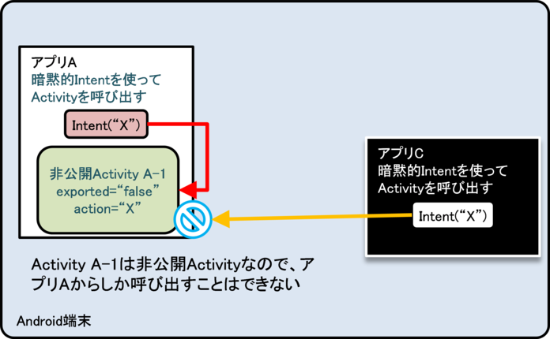{width="4.739583333333333in" height="2.9375in"}

[]{#_Ref332196748 .anchor}図 4.1‑4

図
4.1‑5は、アプリAに加えてアプリBでも同じintent-filter(図中action="X")を定義している場合である。図
4.1‑5では、アプリAが暗黙的Intentを送信して同一アプリ内の非公開Activityを呼び出そうとするが、「アプリケーションの選択」ダイアログが表示され、ユーザーの選択によって公開Activity(B-1)が呼び出されてしまう例を示している。これにより他アプリに対してセンシティブな情報を送信したり、意図せぬ戻り値を受け取る可能性が生じてしまう。

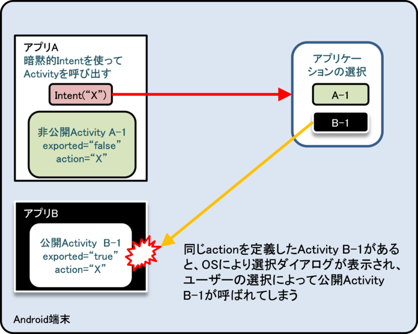{width="4.739583333333333in"
height="3.8020833333333335in"}

[]{#_Ref336007808 .anchor}図 4.1‑5

このように、Intent
Filterを用いた非公開Activityの暗黙的Intent呼び出しは、意図せぬアプリとの情報のやり取りを許してしまうので行うべきではない。なお、この挙動はアプリA、アプリBのインストール順序には依存しないことを確認している。

#### 利用元アプリを確認する

ここではパートナー限定Activityの実装に関する技術情報を解説する。パートナー限定Activityはホワイトリストに登録された特定のアプリからのアクセスを許可し、それ以外のアプリからはアクセスを拒否するActivityである。自社以外のアプリもアクセス許可対象となるため、Signature
Permissionによる防御手法は利用できない。

基本的な考え方は、パートナー限定Activityの利用元アプリの身元を確認し、ホワイトリストに登録されたアプリであればサービスを提供する、登録されていないアプリであればサービスを提供しないというものである。利用元アプリの身元確認は、利用元アプリが持つ証明書を取得し、その証明書のハッシュ値をホワイトリストのハッシュ値と比較することで行う。

ここでわざわざ利用元アプリの「証明書」を取得せずとも、利用元アプリの「パッケージ名」との比較で十分ではないか？と疑問を持たれた方もいるかと思う。しかしパッケージ名は任意に指定できるため他のアプリへの成りすましが簡単である。成りすまし可能なパラメータは身元確認用には使えない。一方、アプリの持つ証明書であれば身元確認に使うことができる。証明書に対応する署名用の開発者鍵は本物のアプリ開発者しか持っていないため、第三者が同じ証明書を持ち、尚且つ署名検証が成功するアプリを作成することはできないからだ。ホワイトリストはアクセスを許可したいアプリの証明書データを丸ごと保持してもよいが、サンプルコードではホワイトリストのデータサイズを小さくするために証明書データのSHA-256ハッシュ値を保持することにしている。

この方法には次の二つの制約条件がある。

-   利用元アプリにおいてstartActivity()ではなくstartActivityForResult()を使用しなければならない

-   利用元アプリにおいてActivity以外から呼び出すことはできない

2つ目の制約事項はいわば1つ目の制約事項の結果として課される制約であるので、厳密には1つの同じ制約と言える。この制約は呼び出し元アプリのパッケージ名を取得するActivity.getCallingPackage()の制約により生じている。Activity.getCallingPackage()はstartActivityForResult()で呼び出された場合にのみ利用元アプリのパッケージ名を返すが、残念ながらstartActivity()で呼び出された場合にはnullを返す仕様となっている。そのためここで紹介する方法は必ず利用元アプリが、たとえ戻り値が不要であったとしても、startActivityForResult()を使わなければならないという制約がある。さらにstartActivityForResult()はActivityクラスでしか使えないため、利用元はActivityに限定されるという制約もある。

> PartnerActivity.java

package org.jssec.android.activity.partneractivity;

import org.jssec.android.shared.PkgCertWhitelists;

import org.jssec.android.shared.Utils;

import android.app.Activity;

import android.content.Context;

import android.content.Intent;

import android.os.Bundle;

import android.view.View;

import android.widget.Toast;

public class PartnerActivity extends Activity {

// ★ポイント4★
利用元アプリの証明書がホワイトリストに登録されていることを確認する

private static PkgCertWhitelists sWhitelists = null;

private static void buildWhitelists(Context context) {

boolean isdebug = Utils.isDebuggable(context);

sWhitelists = new PkgCertWhitelists();

// パートナーアプリ org.jssec.android.activity.partneruser
の証明書ハッシュ値を登録

sWhitelists.add("org.jssec.android.activity.partneruser", isdebug ?

// debug.keystoreの"androiddebugkey"の証明書ハッシュ値

"0EFB7236 328348A9 89718BAD DF57F544 D5CCB4AE B9DB34BC 1E29DD26
F77C8255" :

// keystoreの"partner key"の証明書ハッシュ値

"1F039BB5 7861C27A 3916C778 8E78CE00 690B3974 3EB8259F E2627B8D
4C0EC35A");

// 以下同様に他のパートナーアプリを登録...

}

private static boolean checkPartner(Context context, String pkgname) {

if (sWhitelists == null) buildWhitelists(context);

return sWhitelists.test(context, pkgname);

}

@Override

public void onCreate(Bundle savedInstanceState) {

super.onCreate(savedInstanceState);

setContentView(R.layout.main);

// ★ポイント4★
利用元アプリの証明書がホワイトリストに登録されていることを確認する

if (!checkPartner(this, getCallingActivity().getPackageName())) {

Toast.makeText(this, "利用元アプリはパートナーアプリではない。",
Toast.LENGTH\_LONG).show();

finish();

return;

}

// ★ポイント5★
パートナーアプリからのIntentであっても、受信Intentの安全性を確認する

// サンプルにつき割愛。「3.2 入力データの安全性を確認する」を参照。

Toast.makeText(this, "パートナーアプリからアクセスあり",
Toast.LENGTH\_LONG).show();

}

public void onReturnResultClick(View view) {

// ★ポイント6★ パートナーアプリに開示してよい情報に限り返送してよい

Intent intent = new Intent();

intent.putExtra("RESULT", "パートナーアプリに開示してよい情報");

setResult(RESULT\_OK, intent);

finish();

}

}

> PkgCertWhitelists.java

package org.jssec.android.shared;

import java.util.HashMap;

import java.util.Map;

import android.content.Context;

public class PkgCertWhitelists {

private Map&lt;String, String&gt; mWhitelists = new HashMap&lt;String,
String&gt;();

public boolean add(String pkgname, String sha256) {

if (pkgname == null) return false;

if (sha256 == null) return false;

sha256 = sha256.replaceAll(" ", "");

if (sha256.length() != 64) return false; // SHA-256は32バイト

sha256 = sha256.toUpperCase();

if (sha256.replaceAll("\[0-9A-F\]+", "").length() != 0) return false; //
0-9A-F 以外の文字がある

mWhitelists.put(pkgname, sha256);

return true;

}

public boolean test(Context ctx, String pkgname) {

// pkgnameに対応する正解のハッシュ値を取得する

String correctHash = mWhitelists.get(pkgname);

// pkgnameの実際のハッシュ値と正解のハッシュ値を比較する

return PkgCert.test(ctx, pkgname, correctHash);

}

}

> PkgCert.java

package org.jssec.android.shared;

import java.security.MessageDigest;

import java.security.NoSuchAlgorithmException;

import android.content.Context;

import android.content.pm.PackageInfo;

import android.content.pm.PackageManager;

import android.content.pm.PackageManager.NameNotFoundException;

import android.content.pm.Signature;

public class PkgCert {

public static boolean test(Context ctx, String pkgname, String
correctHash) {

if (correctHash == null) return false;

correctHash = correctHash.replaceAll(" ", "");

return correctHash.equals(hash(ctx, pkgname));

}

public static String hash(Context ctx, String pkgname) {

if (pkgname == null) return null;

try {

PackageManager pm = ctx.getPackageManager();

PackageInfo pkginfo = pm.getPackageInfo(pkgname,
PackageManager.GET\_SIGNATURES);

if (pkginfo.signatures.length != 1) return null; // 複数署名は扱わない

Signature sig = pkginfo.signatures\[0\];

byte\[\] cert = sig.toByteArray();

byte\[\] sha256 = computeSha256(cert);

return byte2hex(sha256);

} catch (NameNotFoundException e) {

return null;

}

}

private static byte\[\] computeSha256(byte\[\] data) {

try {

return MessageDigest.getInstance("SHA-256").digest(data);

} catch (NoSuchAlgorithmException e) {

return null;

}

}

private static String byte2hex(byte\[\] data) {

if (data == null) return null;

final StringBuilder hexadecimal = new StringBuilder();

for (final byte b : data) {

hexadecimal.append(String.format("%02X", b));

}

return hexadecimal.toString();

}

}

[]{#_Ref334101062 .anchor}

#### Activityに送信されるIntentの読み取り(Android 5.0より前のバージョンについて)

Android 5.0(API Level
21)以降では、getRecentTasks()から取得できる情報が、自分自身のタスク情報およびホームアプリのような機密情報ではないものに限定された。しかし、Android
5.0より前のバージョンでは、自分自身のタスク以外の情報も読み取ることができる。以下にAndroid
5.0より前のバージョンで発生する本問題の内容を解説する。

タスクのルートActivityに送信されたIntentは、タスク履歴に追加される。ルートActivityとはタスクの起点となるActivityのことである。タスク履歴に追加されたIntentは、ActivityManagerクラスを使うことでどのアプリからも自由に読み出すことが可能である。

アプリからタスク履歴を参照するためのサンプルコードを以下に示す。タスク履歴を参照するためには、AndroidManifest.xmlにGET\_TASKS
Permissionの利用を指定する。

> AndroidManifest.xml

&lt;manifest xmlns:android="http://schemas.android.com/apk/res/android"

package="org.jssec.android.intent.maliciousactivity" &gt;

&lt;!-- GET\_TASKS Permissionを指定する --&gt;

&lt;uses-permission android:name="android.permission.GET\_TASKS" /&gt;

&lt;application

android:allowBackup="false"

android:icon="@drawable/ic\_launcher"

android:label="@string/app\_name"

android:theme="@style/AppTheme" &gt;

&lt;activity

android:name=".MaliciousActivity"

android:label="@string/title\_activity\_main"

android:exported="true" &gt;

&lt;intent-filter&gt;

&lt;action android:name="android.intent.action.MAIN" /&gt;

&lt;category android:name="android.intent.category.LAUNCHER" /&gt;

&lt;/intent-filter&gt;

&lt;/activity&gt;

&lt;/application&gt;

&lt;/manifest&gt;

> MaliciousActivity.java

package org.jssec.android.intent.maliciousactivity;

import java.util.List;

import java.util.Set;

import android.app.Activity;

import android.app.ActivityManager;

import android.content.Intent;

import android.os.Bundle;

import android.util.Log;

public class MaliciousActivity extends Activity {

@Override

public void onCreate(Bundle savedInstanceState) {

super.onCreate(savedInstanceState);

setContentView(R.layout.malicious\_activity);

// ActivityManagerを取得する

ActivityManager activityManager = (ActivityManager)
getSystemService(ACTIVITY\_SERVICE);

// タスクの履歴を最新100件取得する

List&lt;ActivityManager.RecentTaskInfo&gt; list = activityManager

.getRecentTasks(100, ActivityManager.RECENT\_WITH\_EXCLUDED);

for (ActivityManager.RecentTaskInfo r : list) {

// ルートActivityに送信されたIntentを取得し、Logに表示する

Intent intent = r.baseIntent;

Log.v("baseIntent", intent.toString());

Log.v(" action:", intent.getAction());

Log.v(" data:", intent.getDataString());

if (r.origActivity != null) {

Log.v(" pkg:", r.origActivity.getPackageName() +
r.origActivity.getClassName());

}

Bundle extras = intent.getExtras();

if (extras != null) {

Set&lt;String&gt; keys = extras.keySet();

for(String key : keys) {

Log.v(" extras:", key + "=" + extras.get(key).toString());

}

}

}

}

}

ActivityManagerクラスのgetRecentTasks()により、指定した件数のタスク履歴を取得することができる。各タスクの情報はActivityManager.RecentTaskInfoクラスのインスタンスに格納されるが、そのメンバー変数baseIntentには、タスクのルートActivityに送信されたIntentが格納されている。ルートActivityとはタスクが生成された時に呼び出されたActivityであるので、Activityを呼び出す際には、以下の条件をどちらも満たさないように注意しなければならない。

-   Activityが呼び出された際に、タスクが新規に生成される

-   呼び出されたActivityがバックグラウンドあるいはフォアグラウンド上に既に存在するタスクのルートActivityである

#### ルートActivityについて

ルートActivityとはタスクの起点となるActivityのことである。タスクが生成された時に起動されたActivityのことである、と言ってもよい。例えば、デフォルト設定のActivityがランチャーから起動された場合、そのActivityはルートActivityとなる。Androidの仕様によると、ルートActivityに送信されるIntentの内容は任意のアプリによって読み取られる恐れがある。そこで、ルートActivityへセンシティブな情報を送信しないように対策を講じる必要がある。本ガイドでは、呼び出されたActivityがルートとなるのを防ぐために以下の3点をルールに掲げた。

-   taskAffinityを指定しない

-   launchModeを指定しない

-   Activityに送信するIntentにはFLAG\_ACTIVITY\_NEW\_TASKを設定しない

以下、Activityがルートとなるのはどのような場合かを中心にルートActivityについて考察する。呼び出されたActivityがルートとなるための条件に関連するのは、以下に挙げる項目である。

-   呼び出されるActivityの起動モード

-   呼び出されるActivityのタスクとその起動状態

まず、「呼び出されるActivityの起動モード」について説明する。Activityの起動モードは、AndroidManifest.xmlにandroid:launchModeを記述することで設定できる。記述しない場合は”standard”とみなされる。また、起動モードはIntentに設定するフラグによっても変更可能である。FLAG\_ACTIVITY\_NEW\_TASKフラグは、Activityを”singleTask”モードで起動させる。

指定可能な起動モードは次のとおりである。特に、ルートActivityとの関連に焦点を当てて説明する。

##### standard

このモードで呼び出されたActivityはルートとなることはなく、呼び出し側のタスクに所属する。また、呼び出しの度にActivityのインスタンスが生成される。

##### singleTop

“standard”と同様であるが、フォアグラウンドタスクの最前面に表示されているActivityを起動する場合には、インスタンスが生成されないという点が異なる。

##### singleTask

Activityはアフィニティの値に従って所属するタスクが決まる。Activityのアフィニティと一致するタスクがバックグラウンドあるいはフォアグラウンドに存在しない場合には、タスクがActivityのインスタンスとともに新規に生成される。存在する場合にはどちらも生成されない。前者では、起動されたActivityのインスタンスはルートとなる。

##### singleInstance

“singleTask”と同様であるが、次の点で異なる。新規に生成されたタスクには、ルートActivityのみが所属できる点である。したがって、このモードで起動されたActivityのインスタンスは常にルートである。ここで注意が必要なのは、呼び出されるActivityが持つアフィニティと同じ名前のタスクが既に存在している場合であっても、呼び出されるActivityとタスクに含まれるActivityのクラス名が異なる場合である。その場合は、新規にタスクが生成される。

以上より、”singleTask”または”singleInstance”で起動されたActivityはルートになる可能性があることが分かる。アプリの安全性を確保するためには、これらのモードで起動しないようにしなければならない。

次に、「呼び出されるActivityのタスクとその起動状態」について説明する。たとえ、Activityが”standard”モードで呼び出されたとしても、そのActivityが所属するタスクの状態によってルートActivityとなる場合がある。

例として、呼び出されるActivityのタスクが既にバックグラウンドで起動している場合を考える。問題となるのは、そのタスクのActivityインスタンスが”singleInstance”で起動している場合である。”standard”で呼び出されたActivityのアフィニティがタスクと同じだった時に、既存の”singleInstance”のActivityの制限により、新規タスクが生成される。ただし、それぞれのActivityのクラス名が同じ場合は、タスクは生成されず、インスタンスは既存のものが利用される。いずれにしろ、呼び出されたActivityはルートActivityになる。

以上のように、ルートActivityが呼び出される条件は実行時の状態に依存するなど複雑である。アプリ開発の際には、”standard”モードでActivityを呼び出すように工夫すべきである。

非公開Activityに送信されるIntentが他アプリから読み取られる例として、非公開Activityの呼び出し側Activityを”singleInstance”モードで起動する場合のサンプルコードを以下に示す。このサンプルコードでは、非公開Activityが”standard”モードで起動されるが、呼び出し側Activityの”singleInstance”モードの条件により、非公開Activityは新規タスクのルートActivityとなってしまう。この時、非公開Activityに送信されるセンシティブな情報はタスク履歴に記録されるため、任意のアプリから読み取り可能である。なお、呼び出し側Activity、非公開Activityともに同一のアフィニティを持つ。

> AndroidManifest.xml(非推奨)

&lt;?xml version="1.0" encoding="utf-8"?&gt;

&lt;manifest xmlns:android="http://schemas.android.com/apk/res/android"

package="org.jssec.android.activity.singleinstanceactivity" &gt;

&lt;application

android:allowBackup="false"

android:icon="@drawable/ic\_launcher"

android:label="@string/app\_name" &gt;

&lt;!-- ルートActivityの起動モードを”singleInstance”とする --&gt;

&lt;!-- アフィニティは設定せず、アプリのパッケージ名とする --&gt;

&lt;activity

android:name=".PrivateUserActivity"

android:label="@string/app\_name"

android:launchMode="singleInstance"

android:exported="true" &gt;

&lt;intent-filter&gt;

&lt;action android:name="android.intent.action.MAIN" /&gt;

&lt;category android:name="android.intent.category.LAUNCHER" /&gt;

&lt;/intent-filter&gt;

&lt;/activity&gt;

&lt;!-- 非公開Activity --&gt;

&lt;!-- 起動モードを”standard”とする --&gt;

&lt;!-- アフィニティは設定せず、アプリのパッケージ名とする --&gt;

&lt;activity

android:name=".PrivateActivity"

android:label="@string/app\_name"

android:exported="false" /&gt;

&lt;/application&gt;

&lt;/manifest&gt;

非公開Activityは、受信したIntentに対して結果を返すのみである。

> PrivateActivity.java

package org.jssec.android.activity.singleinstanceactivity;

import android.app.Activity;

import android.content.Intent;

import android.os.Bundle;

import android.view.View;

import android.widget.Toast;

public class PrivateActivity extends Activity {

@Override

public void onCreate(Bundle savedInstanceState) {

super.onCreate(savedInstanceState);

setContentView(R.layout.private\_activity);

// 受信Intentの安全性を確認する

// サンプルにつき割愛。「3.2 入力データの安全性を確認する」を参照。

String param = getIntent().getStringExtra("PARAM");

Toast.makeText(this, String.format("パラメータ「%s」を受け取った。",
param), Toast.LENGTH\_LONG).show();

}

public void onReturnResultClick(View view) {

Intent intent = new Intent();

intent.putExtra("RESULT", "センシティブな情報");

setResult(RESULT\_OK, intent);

finish();

}

}

非公開Activityの呼び出し側では、Intentにフラグを設定せずに、”standard”モードで非公開Activityを起動している。

> PrivateUserActivity.java

package org.jssec.android.activity.singleinstanceactivity;

import android.app.Activity;

import android.content.Intent;

import android.os.Bundle;

import android.view.View;

import android.widget.Toast;

public class PrivateUserActivity extends Activity {

private static final int REQUEST\_CODE = 1;

@Override

public void onCreate(Bundle savedInstanceState) {

super.onCreate(savedInstanceState);

setContentView(R.layout.user\_activity);

}

public void onUseActivityClick(View view) {

// 非公開Activityを"standard"モードで起動する

Intent intent = new Intent();

intent.setClass(this, PrivateActivity.class);

intent.putExtra("PARAM", "センシティブな情報");

startActivityForResult(intent, REQUEST\_CODE);

}

@Override

public void onActivityResult(int requestCode, int resultCode, Intent
data) {

super.onActivityResult(requestCode, resultCode, data);

if (resultCode != RESULT\_OK) return;

switch (requestCode) {

case REQUEST\_CODE:

String result = data.getStringExtra("RESULT");

// 受信データの安全性を確認する

// サンプルにつき割愛。「3.2 入力データの安全性を確認する」を参照。

Toast.makeText(this, String.format("結果「%s」を受け取った。", result),
Toast.LENGTH\_LONG).show();

break;

}

}

}

[]{#_Ref333321814 .anchor}

#### Activity利用時のログ出力について

Activityを利用する際にActivityManagerがIntentの内容をLogCatに出力する。以下の内容はLogCatに出力されるため、センシティブな情報が含まれないように注意すべきだ。

-   利用先パッケージ名

-   利用先クラス名

-   Intent\#setData()で設定したURI

例えば、メール送信する場合、URIにメールアドレスを指定してIntentを発行するとメールアドレスがLogCatに出力されてしまう。Intent\#putExtra()で設定した値はLogCatに出力されないため、Extrasに設定して送るようにした方が良い。

次のようにメール送信するとLogCatにメールアドレスが表示されてしまう

> MainActivity.java

// URIはLogCatに出力される

Uri uri = Uri.parse("mailto:test@gmail.com");

Intent intent = new Intent(Intent.ACTION\_SENDTO, uri);

startActivity(intent);

次のようにExtrasを使用するとLogCatにメールアドレスが表示されなくなる

> MainActivity.java

// Extraに設定した内容はLogCatに出力されない

Uri uri = Uri.parse("mailto:");

Intent intent = new Intent(Intent.ACTION\_SENDTO, uri);

intent.putExtra(Intent.EXTRA\_EMAIL, new String\[\] {"test@gmail.com"});

startActivity(intent);

ただし、ActivityManager\#getRecentTasks() によって
IntentのExtrasを他のアプリから直接読める場合があるので、注意すること。詳しくは「4.1.2.2
taskAffinityを指定しない （必須）」、「4.1.2.3 launchModeを指定しない
（必須）」および「4.1.2.4Activityに送信するIntentにはFLAG\_ACTIVITY\_NEW\_TASKを設定しない
（必須）」を参照のこと。

#### PreferenceActivityのFragment Injection対策について

PreferenceActivityを継承したクラスが公開Activityとなっている場合、Fragment
Injection[^5]と呼ばれる問題が発生する可能性がある。この問題を防ぐためには
PreferenceActivity.IsValidFragment()をoverrideし、引数の値を適切にチェックすることでActivityが意図しないFragmentを扱わないようにする必要がある。(入力データの安全性については「3.2入力データの安全性を確認する」参照)

以下に、IsValidFragment()をoverrideしたサンプルを示す。なお、ソースコードの難読化を行うと、クラス名が変わり、引数の値との比較結果が変わってまう可能性があるので、別途対応が必要になる。

> overrideしたisValidFragment()メソッドの例

protected boolean isValidFragment(String fragmentName) {

　　　　// 難読化時の対応は別途行うこと

return PreferenceFragmentA.class.getName().equals(fragmentName)

|| PreferenceFragmentB.class.getName().equals(fragmentName)

|| PreferenceFragmentC.class.getName().equals(fragmentName)

|| PreferenceFragmentD.class.getName().equals(fragmentName);

}

なお、アプリのtargetSdkVersionが19以上である場合、PreferenceActivity.isValidFragment()をoverrideしないと、Fragmentが挿入された段階（isValidFragment()が呼ばれた段階）でセキュリティ例外が発生しアプリが終了するため、PreferenceActivity.isValidFragment()のoverrideが必須である。

Broadcastを受信する・送信する
-----------------------------

### サンプルコード

Broadcastを受信するにはBroadcast
Receiverを作る必要がある。どのようなBroadcastを受信するかによって、Broadcast
Receiverが抱えるリスクや適切な防御手段が異なる。次の判定フローによって作成するBroadcast
Receiverがどのタイプであるかを判断できる。ちなみに、パートナー限定の連携に必要なBroadcast送信元アプリのパッケージ名を受信側アプリで確認する手段がないため、パートナー限定Broadcast
Receiverを作る事はできない。

{width="6.395833333333333in"
height="3.4895833333333335in"}

図 4.2‑1

またBroadcast Receiverにはその定義方法により、静的Broadcast
Receiverと動的Broadcast
Receiverとの2種類があり、下表のような特徴の違いがある。サンプルコード中では両方の実装方法を紹介している。なお、どのような相手にBroadcastを送信するかによって送信する情報の適切な防御手段が決まるため、送信側の実装についても合わせて説明する。

表 4.2‑1

  ------------------------------------------------------------------------------------------------------------------------------------------------------------------------------------------------------------------------------------------------------------------------
                           定義方法                                                                                                                       特徴
  ------------------------ ------------------------------------------------------------------------------------------------------------------------------ ----------------------------------------------------------------------------------------------------------------
  静的Broadcast Receiver   AndroidManifest.xmlに&lt;receiver&gt;要素を記述することで定義する                                                              -   システムから送信される一部のBroadcast（ACTION\_BATTERY\_CHANGEDなど）を受信できない制約がある
                                                                                                                                                          
                                                                                                                                                          -   アプリが初回起動してからアンインストールされるまでの間、Broadcastを受信できる
                                                                                                                                                          

  動的Broadcast Receiver   プログラム中でregisterReceiver()およびunregisterReceiver()を呼び出すことにより、動的にBroadcast Receiverを登録／登録解除する   -   静的Broadcast Receiverでは受信できないBroadcastでも受信できる
                                                                                                                                                          
                                                                                                                                                          -   Activityが前面に出ている期間だけBroadcastを受信したいなど、Broadcastの受信可能期間をプログラムで制御できる
                                                                                                                                                          
                                                                                                                                                          -   非公開のBroadcast Receiverを作ることはできない
                                                                                                                                                          
  ------------------------------------------------------------------------------------------------------------------------------------------------------------------------------------------------------------------------------------------------------------------------

#### 非公開Broadcast Receiver - Broadcastを受信する・送信する

非公開Broadcast
Receiverは、同一アプリ内から送信されたBroadcastだけを受信できるBroadcast
Receiverであり、もっとも安全性の高いBroadcast
Receiverである。動的Broadcast
Receiverを非公開で登録することはできないため、非公開Broadcast
Receiverでは静的Broadcast Receiverだけで構成される。

> ポイント(Broadcastを受信する)：

1.  exported="false"により、明示的に非公開設定する

&nbsp;
1.  同一アプリ内から送信されたBroadcastであっても、受信Intentの安全性を確認する

2.  結果を返す場合、送信元は同一アプリ内であるから、センシティブな情報を返送してよい

> AndroidManifest.xml

&lt;?xml version="1.0" encoding="utf-8"?&gt;

&lt;manifest xmlns:android="http://schemas.android.com/apk/res/android"

package="org.jssec.android.broadcast.privatereceiver" &gt;

&lt;application

android:icon="@drawable/ic\_launcher"

android:label="@string/app\_name"

android:allowBackup="false" &gt;

&lt;!-- 非公開Broadcast Receiverを定義する --&gt;

&lt;!-- ★ポイント1★ exported="false"により、明示的に非公開設定する
--&gt;

&lt;receiver

android:name=".PrivateReceiver"

android:exported="false" /&gt;

&lt;activity

android:name=".PrivateSenderActivity"

android:label="@string/app\_name"

android:exported="true"&gt;

&lt;intent-filter&gt;

&lt;action android:name="android.intent.action.MAIN" /&gt;

&lt;category android:name="android.intent.category.LAUNCHER" /&gt;

&lt;/intent-filter&gt;

&lt;/activity&gt;

&lt;/application&gt;

&lt;/manifest&gt;

> PrivateReceiver.java

package org.jssec.android.broadcast.privatereceiver;

import android.app.Activity;

import android.content.BroadcastReceiver;

import android.content.Context;

import android.content.Intent;

import android.widget.Toast;

public class PrivateReceiver extends BroadcastReceiver {

@Override

public void onReceive(Context context, Intent intent) {

// ★ポイント2★
同一アプリ内から送信されたBroadcastであっても、受信Intentの安全性を確認する

// サンプルにつき割愛。「3.2 入力データの安全性を確認する」を参照。

String param = intent.getStringExtra("PARAM");

Toast.makeText(context,

String.format("「%s」を受信した。", param),

Toast.LENGTH\_SHORT).show();

// ★ポイント3★
送信元は同一アプリ内であるから、センシティブな情報を返送してよい

setResultCode(Activity.RESULT\_OK);

setResultData("センシティブな情報 from Receiver");

abortBroadcast();

}

}

次に非公開Broadcast ReceiverへBroadcast送信するサンプルコードを示す。

> ポイント(Broadcastを送信する)：

1.  同一アプリ内Receiverはクラス指定の明示的IntentでBroadcast送信する

2.  送信先は同一アプリ内Receiverであるため、センシティブな情報を送信してよい

3.  同一アプリ内Receiverからの結果情報であっても、受信データの安全性を確認する

> PrivateSenderActivity.java

package org.jssec.android.broadcast.privatereceiver;

import android.app.Activity;

import android.content.BroadcastReceiver;

import android.content.Context;

import android.content.Intent;

import android.os.Bundle;

import android.view.View;

import android.widget.TextView;

public class PrivateSenderActivity extends Activity {

public void onSendNormalClick(View view) {

// ★ポイント4★
同一アプリ内Receiverはクラス指定の明示的IntentでBroadcast送信する

Intent intent = new Intent(this, PrivateReceiver.class);

// ★ポイント5★
送信先は同一アプリ内Receiverであるため、センシティブな情報を送信してよい

intent.putExtra("PARAM", "センシティブな情報 from Sender");

sendBroadcast(intent);

}

public void onSendOrderedClick(View view) {

// ★ポイント4★
同一アプリ内Receiverはクラス指定の明示的IntentでBroadcast送信する

Intent intent = new Intent(this, PrivateReceiver.class);

// ★ポイント5★
送信先は同一アプリ内Receiverであるため、センシティブな情報を送信してよい

intent.putExtra("PARAM", "センシティブな情報 from Sender");

sendOrderedBroadcast(intent, null, mResultReceiver, null, 0, null,
null);

}

private BroadcastReceiver mResultReceiver = new BroadcastReceiver() {

@Override

public void onReceive(Context context, Intent intent) {

// ★ポイント6★
同一アプリ内Receiverからの結果情報であっても、受信データの安全性を確認する

// サンプルにつき割愛。「3.2 入力データの安全性を確認する」を参照。

String data = getResultData();

PrivateSenderActivity.this.logLine(

String.format("結果「%s」を受信した。", data));

}

};

private TextView mLogView;

@Override

public void onCreate(Bundle savedInstanceState) {

super.onCreate(savedInstanceState);

setContentView(R.layout.main);

mLogView = (TextView)findViewById(R.id.logview);

}

private void logLine(String line) {

mLogView.append(line);

mLogView.append("\\n");

}

}

#### 公開Broadcast Receiver - Broadcastを受信する・送信する

公開Broadcast
Receiverは、不特定多数のアプリから送信されたBroadcastを受信できるBroadcast
Receiverである。マルウェアが送信したBroadcastを受信することがあることに注意が必要だ。

> ポイント(Broadcastを受信する)：

1.  exported="true"により、明示的に公開設定する

2.  受信Intentの安全性を確認する

&nbsp;
1.  結果を返す場合、センシティブな情報を含めない

公開Broadcast ReceiverのサンプルコードであるPublic
Receiverは、静的Broadcast Receiverおよび動的Broadcast
Receiverの両方で利用される。

> PublicReceiver.java

package org.jssec.android.broadcast.publicreceiver;

import android.app.Activity;

import android.content.BroadcastReceiver;

import android.content.Context;

import android.content.Intent;

import android.widget.Toast;

public class PublicReceiver extends BroadcastReceiver {

private static final String MY\_BROADCAST\_PUBLIC =

"org.jssec.android.broadcast.MY\_BROADCAST\_PUBLIC";

public boolean isDynamic = false;

private String getName() {

return isDynamic ? "公開動的 Broadcast Receiver" : "公開静的 Broadcast
Receiver";

}

@Override

public void onReceive(Context context, Intent intent) {

// ★ポイント2★ 受信Intentの安全性を確認する

// 公開Broadcast
Receiverであるため利用元アプリがマルウェアである可能性がある。

// サンプルにつき割愛。「3.2 入力データの安全性を確認する」を参照。

if (MY\_BROADCAST\_PUBLIC.equals(intent.getAction())) {

String param = intent.getStringExtra("PARAM");

Toast.makeText(context,

String.format("%s:\\n「%s」を受信した。", getName(), param),

Toast.LENGTH\_SHORT).show();

}

// ★ポイント3★ 結果を返す場合、センシティブな情報を含めない

// 公開Broadcast Receiverであるため、

// Broadcastの送信元アプリがマルウェアである可能性がある。

//
マルウェアに取得されても問題のない情報であれば結果として返してもよい。

setResultCode(Activity.RESULT\_OK);

setResultData(String.format("センシティブではない情報 from %s",
getName()));

abortBroadcast();

}

}

静的Broadcast ReceiverはAndroidManifest.xmlで定義する。

> AndroidManifest.xml

&lt;?xml version="1.0" encoding="utf-8"?&gt;

&lt;manifest xmlns:android="http://schemas.android.com/apk/res/android"

package="org.jssec.android.broadcast.publicreceiver" &gt;

&lt;application

android:icon="@drawable/ic\_launcher"

android:label="@string/app\_name"

android:allowBackup="false" &gt;

&lt;!-- 公開静的Broadcast Receiverを定義する --&gt;

&lt;!-- ★ポイント1★ exported="true"により、明示的に公開設定する --&gt;

&lt;receiver android:name=".PublicReceiver"

android:exported="true" &gt;

&lt;intent-filter&gt;

&lt;action
android:name="org.jssec.android.broadcast.MY\_BROADCAST\_PUBLIC" /&gt;

&lt;/intent-filter&gt;

&lt;/receiver&gt;

&lt;service

android:name=".DynamicReceiverService"

android:exported="false" /&gt;

&lt;activity

android:name=".PublicReceiverActivity"

android:label="@string/app\_name"

android:exported="true" &gt;

&lt;intent-filter&gt;

&lt;action android:name="android.intent.action.MAIN" /&gt;

&lt;category android:name="android.intent.category.LAUNCHER" /&gt;

&lt;/intent-filter&gt;

&lt;/activity&gt;

&lt;/application&gt;

&lt;/manifest&gt;

動的Broadcast
Receiverはプログラム中でregisterReceiver()およびunregisterReceiver()を呼び出すことにより登録／登録解除する。ボタン操作により登録／登録解除を行うためにPublicReceiverActivity上にボタンを配置している。動的Broadcast
ReceiverインスタンスはPublicReceiverActivityより生存期間が長いためPublicReceiverActivityのメンバー変数として保持することはできない。そのためDynamicReceiverServiceのメンバー変数として動的Broadcast
Receiverのインスタンスを保持させ、DynamicReceiverServiceをPublicReceiverActivityから開始／終了することにより動的Broadcast
Receiverを間接的に登録／登録解除している。

> DynamicReceiverService.java

package org.jssec.android.broadcast.publicreceiver;

import android.app.Service;

import android.content.Intent;

import android.content.IntentFilter;

import android.os.IBinder;

import android.widget.Toast;

public class DynamicReceiverService extends Service {

private static final String MY\_BROADCAST\_PUBLIC =

"org.jssec.android.broadcast.MY\_BROADCAST\_PUBLIC";

private PublicReceiver mReceiver;

@Override

public IBinder onBind(Intent intent) {

return null;

}

@Override

public void onCreate() {

super.onCreate();

// 公開動的Broadcast Receiverを登録する

mReceiver = new PublicReceiver();

mReceiver.isDynamic = true;

IntentFilter filter = new IntentFilter();

filter.addAction(MY\_BROADCAST\_PUBLIC);

filter.setPriority(1); // 静的Broadcast Receiverより動的Broadcast
Receiverを優先させる

registerReceiver(mReceiver, filter);

Toast.makeText(this,

"動的 Broadcast Receiver を登録した。",

Toast.LENGTH\_SHORT).show();

}

@Override

public void onDestroy() {

super.onDestroy();

// 公開動的Broadcast Receiverを登録解除する

unregisterReceiver(mReceiver);

mReceiver = null;

Toast.makeText(this,

"動的 Broadcast Receiver を登録解除した。",

Toast.LENGTH\_SHORT).show();

}

}

> PublicReceiverActivity.java

package org.jssec.android.broadcast.publicreceiver;

import android.app.Activity;

import android.content.Intent;

import android.os.Bundle;

import android.view.View;

public class PublicReceiverActivity extends Activity {

@Override

protected void onCreate(Bundle savedInstanceState) {

super.onCreate(savedInstanceState);

setContentView(R.layout.main);

}

public void onRegisterReceiverClick(View view) {

Intent intent = new Intent(this, DynamicReceiverService.class);

startService(intent);

}

public void onUnregisterReceiverClick(View view) {

Intent intent = new Intent(this, DynamicReceiverService.class);

stopService(intent);

}

}

次に公開Broadcast
ReceiverへBroadcast送信するサンプルコードを示す。公開Broadcast
ReceiverにBroadcastを送信する場合、送信するBroadcastがマルウェアに受信されることがあることに注意が必要である。

> ポイント(Broadcastを送信する)：

1.  センシティブな情報を送信してはならない

2.  結果を受け取る場合、結果データの安全性を確認する

> PublicSenderActivity.java

package org.jssec.android.broadcast.publicsender;

import android.app.Activity;

import android.content.BroadcastReceiver;

import android.content.Context;

import android.content.Intent;

import android.os.Bundle;

import android.view.View;

import android.widget.TextView;

public class PublicSenderActivity extends Activity {

private static final String MY\_BROADCAST\_PUBLIC =

"org.jssec.android.broadcast.MY\_BROADCAST\_PUBLIC";

public void onSendNormalClick(View view) {

// ★ポイント4★ センシティブな情報を送信してはならない

Intent intent = new Intent(MY\_BROADCAST\_PUBLIC);

intent.putExtra("PARAM", "センシティブではない情報 from Sender");

sendBroadcast(intent);

}

public void onSendOrderedClick(View view) {

// ★ポイント4★ センシティブな情報を送信してはならない

Intent intent = new Intent(MY\_BROADCAST\_PUBLIC);

intent.putExtra("PARAM", "センシティブではない情報 from Sender");

sendOrderedBroadcast(intent, null, mResultReceiver, null, 0, null,
null);

}

public void onSendStickyClick(View view) {

// ★ポイント4★ センシティブな情報を送信してはならない

Intent intent = new Intent(MY\_BROADCAST\_PUBLIC);

intent.putExtra("PARAM", "センシティブではない情報 from Sender");

//sendStickyBroadcastメソッドはAPI Level 21でdeprecatedとなった

sendStickyBroadcast(intent);

}

public void onSendStickyOrderedClick(View view) {

// ★ポイント4★ センシティブな情報を送信してはならない

Intent intent = new Intent(MY\_BROADCAST\_PUBLIC);

intent.putExtra("PARAM", "センシティブではない情報 from Sender");

//sendStickyBroadcastメソッドはAPI Level 21でdeprecatedとなった

sendStickyOrderedBroadcast(intent, mResultReceiver, null, 0, null,
null);

}

public void onRemoveStickyClick(View view) {

Intent intent = new Intent(MY\_BROADCAST\_PUBLIC);

//removeStickyBroadcastメソッドはdeprecatedとなっている

removeStickyBroadcast(intent);

}

private BroadcastReceiver mResultReceiver = new BroadcastReceiver() {

@Override

public void onReceive(Context context, Intent intent) {

// ★ポイント5★ 結果を受け取る場合、結果データの安全性を確認する

// サンプルにつき割愛。「3.2 入力データの安全性を確認する」を参照。

String data = getResultData();

PublicSenderActivity.this.logLine(

String.format("結果「%s」を受信した。", data));

}

};

private TextView mLogView;

@Override

public void onCreate(Bundle savedInstanceState) {

super.onCreate(savedInstanceState);

setContentView(R.layout.main);

mLogView = (TextView)findViewById(R.id.logview);

}

private void logLine(String line) {

mLogView.append(line);

mLogView.append("\\n");

}

}

#### 自社限定Broadcast Receiver - Broadcastを受信する・送信する

自社限定Broadcast
Receiverは、自社以外のアプリから送信されたBroadcastを一切受信しないBroadcast
Receiverである。複数の自社製アプリでシステムを構成し、自社アプリが扱う情報や機能を守るために利用される。

> ポイント(Broadcastを受信する)：

1.  Broadcast受信用の独自定義Signature Permissionを定義する

&nbsp;
1.  結果受信用の独自定義Signature Permissionを利用宣言する

2.  exported="true"により、明示的に公開設定する

3.  静的Broadcast Receiver定義にて、独自定義Signature
    Permissionを要求宣言する

4.  動的Broadcast Receiverを登録するとき、独自定義Signature
    Permissionを要求宣言する

5.  独自定義Signature
    Permissionが自社アプリにより定義されていることを確認する

6.  自社アプリからのBroadcastであっても、受信Intentの安全性を確認する

7.  Broadcast送信元は自社アプリであるから、センシティブな情報を返送してよい

8.  Broadcast送信元アプリと同じ開発者鍵でAPKを署名する

自社限定Broadcast
ReceiverのサンプルコードであるProprietaryReciverは、静的Broadcast
Receiverおよび動的Broadcast Receiverの両方で利用される。

> InhouseReceiver.java

package org.jssec.android.broadcast.inhousereceiver;

import org.jssec.android.shared.SigPerm;

import org.jssec.android.shared.Utils;

import android.app.Activity;

import android.content.BroadcastReceiver;

import android.content.Context;

import android.content.Intent;

import android.widget.Toast;

public class InhouseReceiver extends BroadcastReceiver {

// 自社のSignature Permission

private static final String MY\_PERMISSION =
"org.jssec.android.broadcast.inhousereceiver.MY\_PERMISSION";

// 自社の証明書のハッシュ値

private static String sMyCertHash = null;

private static String myCertHash(Context context) {

if (sMyCertHash == null) {

if (Utils.isDebuggable(context)) {

// debug.keystoreの"androiddebugkey"の証明書ハッシュ値

sMyCertHash = "0EFB7236 328348A9 89718BAD DF57F544 D5CCB4AE B9DB34BC
1E29DD26 F77C8255";

} else {

// keystoreの"my company key"の証明書ハッシュ値

sMyCertHash = "D397D343 A5CBC10F 4EDDEB7C A10062DE 5690984F 1FB9E88B
D7B3A7C2 42E142CA";

}

}

return sMyCertHash;

}

private static final String MY\_BROADCAST\_INHOUSE =

"org.jssec.android.broadcast.MY\_BROADCAST\_INHOUSE";

public boolean isDynamic = false;

private String getName() {

return isDynamic ? "自社限定動的 Broadcast Receiver" : "自社限定静的
Broadcast Receiver";

}

@Override

public void onReceive(Context context, Intent intent) {

// ★ポイント6★ 独自定義Signature
Permissionが自社アプリにより定義されていることを確認する

if (!SigPerm.test(context, MY\_PERMISSION, myCertHash(context))) {

Toast.makeText(context, "独自定義Signature
Permissionが自社アプリにより定義されていない。",
Toast.LENGTH\_LONG).show();

return;

}

// ★ポイント7★
自社アプリからのBroadcastであっても、受信Intentの安全性を確認する

// サンプルにつき割愛。「3.2 入力データの安全性を確認する」を参照。

if (MY\_BROADCAST\_INHOUSE.equals(intent.getAction())) {

String param = intent.getStringExtra("PARAM");

Toast.makeText(context,

String.format("%s:\\n「%s」を受信した。", getName(), param),

Toast.LENGTH\_SHORT).show();

}

// ★ポイント8★
送信元は自社アプリであるから、センシティブな情報を返送してよい

setResultCode(Activity.RESULT\_OK);

setResultData(String.format("センシティブな情報 from %s", getName()));

abortBroadcast();

}

}

静的Broadcast ReceiverはAndroidManifest.xmlで定義する。

> AndroidManifest.xml

&lt;?xml version="1.0" encoding="utf-8"?&gt;

&lt;manifest xmlns:android="http://schemas.android.com/apk/res/android"

package="org.jssec.android.broadcast.inhousereceiver" &gt;

&lt;!-- ★ポイント1★ Broadcast受信用の独自定義Signature
Permissionを定義する --&gt;

&lt;permission

android:name="org.jssec.android.broadcast.inhousereceiver.MY\_PERMISSION"

android:protectionLevel="signature" /&gt;

&lt;!-- ★ポイント2★ 結果受信用の独自定義Signature
Permissionを利用宣言する --&gt;

&lt;uses-permission

android:name="org.jssec.android.broadcast.inhousesender.MY\_PERMISSION"
/&gt;

&lt;application

android:icon="@drawable/ic\_launcher"

android:label="@string/app\_name"

android:allowBackup="false"&gt;

&lt;!-- ★ポイント3★ exported="true"により、明示的に公開設定する --&gt;

&lt;!-- ★ポイント4★ 静的Broadcast Receiver定義にて、独自定義Signature
Permissionを要求宣言する --&gt;

&lt;receiver

android:name="org.jssec.android.broadcast.inhousereceiver.InhouseReceiver"

android:exported="true"

android:permission="org.jssec.android.broadcast.inhousereceiver.MY\_PERMISSION"&gt;

&lt;intent-filter&gt;

&lt;action
android:name="org.jssec.android.broadcast.MY\_BROADCAST\_INHOUSE" /&gt;

&lt;/intent-filter&gt;

&lt;/receiver&gt;

&lt;service

android:name="org.jssec.android.broadcast.inhousereceiver.DynamicReceiverService"

android:exported="false" /&gt;

&lt;activity

android:name="org.jssec.android.broadcast.inhousereceiver.InhouseReceiverActivity"

android:label="@string/app\_name"

android:exported="true" &gt;

&lt;intent-filter&gt;

&lt;action android:name="android.intent.action.MAIN" /&gt;

&lt;category android:name="android.intent.category.LAUNCHER" /&gt;

&lt;/intent-filter&gt;

&lt;/activity&gt;

&lt;/application&gt;

&lt;/manifest&gt;

動的Broadcast
Receiverはプログラム中でregisterReceiver()およびunregisterReceiver()を呼び出すことにより登録／登録解除する。ボタン操作により登録／登録解除を行うためにProprietaryReceiverActivity上にボタンを配置している。動的Broadcast
ReceiverインスタンスはProprietaryReceiverActivityより生存期間が長いためProprietaryReceiverActivityのメンバー変数として保持することはできない。そのためDynamicReceiverServiceのメンバー変数として動的Broadcast
Receiverのインスタンスを保持させ、DynamicReceiverServiceをProprietaryReceiverActivityから開始／終了することにより動的Broadcast
Receiverを間接的に登録／登録解除している。

> InhouseReceiverActivity.java

package org.jssec.android.broadcast.inhousereceiver;

import android.app.Activity;

import android.content.Intent;

import android.os.Bundle;

import android.view.View;

public class InhouseReceiverActivity extends Activity {

@Override

public void onCreate(Bundle savedInstanceState) {

super.onCreate(savedInstanceState);

setContentView(R.layout.main);

}

public void onRegisterReceiverClick(View view) {

Intent intent = new Intent(this, DynamicReceiverService.class);

startService(intent);

}

public void onUnregisterReceiverClick(View view) {

Intent intent = new Intent(this, DynamicReceiverService.class);

stopService(intent);

}}

> DynamicReceiverService.java

package org.jssec.android.broadcast.inhousereceiver;

import android.app.Service;

import android.content.Intent;

import android.content.IntentFilter;

import android.os.IBinder;

import android.widget.Toast;

public class DynamicReceiverService extends Service {

private static final String MY\_BROADCAST\_INHOUSE =

"org.jssec.android.broadcast.MY\_BROADCAST\_INHOUSE";

private InhouseReceiver mReceiver;

@Override

public IBinder onBind(Intent intent) {

return null;

}

@Override

public void onCreate() {

super.onCreate();

mReceiver = new InhouseReceiver();

mReceiver.isDynamic = true;

IntentFilter filter = new IntentFilter();

filter.addAction(MY\_BROADCAST\_INHOUSE);

filter.setPriority(1); // 静的Broadcast Receiverより動的Broadcast
Receiverを優先させる

// ★ポイント5★ 動的Broadcast Receiverを登録するとき、独自定義Signature
Permissionを要求宣言する

registerReceiver(mReceiver, filter,
"org.jssec.android.broadcast.inhousereceiver.MY\_PERMISSION", null);

Toast.makeText(this,

"動的 Broadcast Receiver を登録した。",

Toast.LENGTH\_SHORT).show();

}

@Override

public void onDestroy() {

super.onDestroy();

unregisterReceiver(mReceiver);

mReceiver = null;

Toast.makeText(this,

"動的 Broadcast Receiver を登録解除した。",

Toast.LENGTH\_SHORT).show();

}

}

> SigPerm.java

package org.jssec.android.shared;

import android.content.Context;

import android.content.pm.PackageManager;

import android.content.pm.PackageManager.NameNotFoundException;

import android.content.pm.PermissionInfo;

public class SigPerm {

public static boolean test(Context ctx, String sigPermName, String
correctHash) {

if (correctHash == null) return false;

correctHash = correctHash.replaceAll(" ", "");

return correctHash.equals(hash(ctx, sigPermName));

}

public static String hash(Context ctx, String sigPermName) {

if (sigPermName == null) return null;

try {

// sigPermNameを定義したアプリのパッケージ名を取得する

PackageManager pm = ctx.getPackageManager();

PermissionInfo pi;

pi = pm.getPermissionInfo(sigPermName, PackageManager.GET\_META\_DATA);

String pkgname = pi.packageName;

// 非Signature Permissionの場合は失敗扱い

if (pi.protectionLevel != PermissionInfo.PROTECTION\_SIGNATURE) return
null;

// sigPermNameを定義したアプリの証明書のハッシュ値を返す

return PkgCert.hash(ctx, pkgname);

} catch (NameNotFoundException e) {

return null;

}

}

}

> PkgCert.java

package org.jssec.android.shared;

import java.security.MessageDigest;

import java.security.NoSuchAlgorithmException;

import android.content.Context;

import android.content.pm.PackageInfo;

import android.content.pm.PackageManager;

import android.content.pm.PackageManager.NameNotFoundException;

import android.content.pm.Signature;

public class PkgCert {

public static boolean test(Context ctx, String pkgname, String
correctHash) {

if (correctHash == null) return false;

correctHash = correctHash.replaceAll(" ", "");

return correctHash.equals(hash(ctx, pkgname));

}

public static String hash(Context ctx, String pkgname) {

if (pkgname == null) return null;

try {

PackageManager pm = ctx.getPackageManager();

PackageInfo pkginfo = pm.getPackageInfo(pkgname,
PackageManager.GET\_SIGNATURES);

if (pkginfo.signatures.length != 1) return null; // 複数署名は扱わない

Signature sig = pkginfo.signatures\[0\];

byte\[\] cert = sig.toByteArray();

byte\[\] sha256 = computeSha256(cert);

return byte2hex(sha256);

} catch (NameNotFoundException e) {

return null;

}

}

private static byte\[\] computeSha256(byte\[\] data) {

try {

return MessageDigest.getInstance("SHA-256").digest(data);

} catch (NoSuchAlgorithmException e) {

return null;

}

}

private static String byte2hex(byte\[\] data) {

if (data == null) return null;

final StringBuilder hexadecimal = new StringBuilder();

for (final byte b : data) {

hexadecimal.append(String.format("%02X", b));

}

return hexadecimal.toString();

}

}

★ポイント9★APKをExportするときに、Broadcast送信元アプリと同じ開発者鍵でAPKを署名する。

{width="4.647222222222222in"
height="3.2743055555555554in"}

図 4.2‑2

次に自社限定Broadcast ReceiverへBroadcast送信するサンプルコードを示す。

> ポイント(Broadcastを送信する)：

1.  結果受信用の独自定義Signature Permissionを定義する

2.  Broadcast受信用の独自定義Signature Permissionを利用宣言する

3.  独自定義Signature
    Permissionが自社アプリにより定義されていることを確認する

4.  Receiverは自社アプリ限定であるから、センシティブな情報を送信してもよい

5.  Receiverに独自定義Signature Permissionを要求する

6.  結果を受け取る場合、結果データの安全性を確認する

7.  Receiver側アプリと同じ開発者鍵でAPKを署名する

> AndroidManifest.xml

&lt;?xml version="1.0" encoding="utf-8"?&gt;

&lt;manifest xmlns:android="http://schemas.android.com/apk/res/android"

package="org.jssec.android.broadcast.inhousesender" &gt;

&lt;uses-permission
android:name="android.permission.BROADCAST\_STICKY"/&gt;

&lt;!-- ★ポイント10★ 結果受信用の独自定義Signature Permissionを定義する
--&gt;

&lt;permission

android:name="org.jssec.android.broadcast.inhousesender.MY\_PERMISSION"

android:protectionLevel="signature" /&gt;

&lt;!-- ★ポイント11★ Broadcast受信用の独自定義Signature
Permissionを利用宣言する --&gt;

&lt;uses-permission

android:name="org.jssec.android.broadcast.inhousereceiver.MY\_PERMISSION"
/&gt;

&lt;application

android:icon="@drawable/ic\_launcher"

android:label="@string/app\_name"

android:allowBackup="false" &gt;

&lt;activity

android:name="org.jssec.android.broadcast.inhousesender.InhouseSenderActivity"

android:label="@string/app\_name"

android:exported="true" &gt;

&lt;intent-filter&gt;

&lt;action android:name="android.intent.action.MAIN" /&gt;

&lt;category android:name="android.intent.category.LAUNCHER" /&gt;

&lt;/intent-filter&gt;

&lt;/activity&gt;

&lt;/application&gt;

&lt;/manifest&gt;

> InhouseSenderActivity.java

package org.jssec.android.broadcast.inhousesender;

import org.jssec.android.shared.SigPerm;

import org.jssec.android.shared.Utils;

import android.app.Activity;

import android.content.BroadcastReceiver;

import android.content.Context;

import android.content.Intent;

import android.os.Bundle;

import android.view.View;

import android.widget.TextView;

import android.widget.Toast;

public class InhouseSenderActivity extends Activity {

// 自社のSignature Permission

private static final String MY\_PERMISSION =
"org.jssec.android.broadcast.inhousesender.MY\_PERMISSION";

// 自社の証明書のハッシュ値

private static String sMyCertHash = null;

private static String myCertHash(Context context) {

if (sMyCertHash == null) {

if (Utils.isDebuggable(context)) {

// debug.keystoreの"androiddebugkey"の証明書ハッシュ値

sMyCertHash = "0EFB7236 328348A9 89718BAD DF57F544 D5CCB4AE B9DB34BC
1E29DD26 F77C8255";

} else {

// keystoreの"my company key"の証明書ハッシュ値

sMyCertHash = "D397D343 A5CBC10F 4EDDEB7C A10062DE 5690984F 1FB9E88B
D7B3A7C2 42E142CA";

}

}

return sMyCertHash;

}

private static final String MY\_BROADCAST\_INHOUSE =

"org.jssec.android.broadcast.MY\_BROADCAST\_INHOUSE";

public void onSendNormalClick(View view) {

// ★ポイント12★ 独自定義Signature
Permissionが自社アプリにより定義されていることを確認する

if (!SigPerm.test(this, MY\_PERMISSION, myCertHash(this))) {

Toast.makeText(this, "独自定義Signature
Permissionが自社アプリにより定義されていない。",
Toast.LENGTH\_LONG).show();

return;

}

// ★ポイント13★
Receiverは自社アプリ限定であるから、センシティブな情報を送信してもよい

Intent intent = new Intent(MY\_BROADCAST\_INHOUSE);

intent.putExtra("PARAM", "センシティブな情報 from Sender");

// ★ポイント14★ Receiverに独自定義Signature Permissionを要求する

sendBroadcast(intent,
"org.jssec.android.broadcast.inhousesender.MY\_PERMISSION");

}

public void onSendOrderedClick(View view) {

// ★ポイント12★ 独自定義Signature
Permissionが自社アプリにより定義されていることを確認する

if (!SigPerm.test(this, MY\_PERMISSION, myCertHash(this))) {

Toast.makeText(this, "独自定義Signature
Permissionが自社アプリにより定義されていない。",
Toast.LENGTH\_LONG).show();

return;

}

// ★ポイント13★
Receiverは自社アプリ限定であるから、センシティブな情報を送信してもよい

Intent intent = new Intent(MY\_BROADCAST\_INHOUSE);

intent.putExtra("PARAM", "センシティブな情報 from Sender");

// ★ポイント14★ Receiverに独自定義Signature Permissionを要求する

sendOrderedBroadcast(intent,
"org.jssec.android.broadcast.inhousesender.MY\_PERMISSION",

mResultReceiver, null, 0, null, null);

}

private BroadcastReceiver mResultReceiver = new BroadcastReceiver() {

@Override

public void onReceive(Context context, Intent intent) {

// ★ポイント15★ 結果を受け取る場合、結果データの安全性を確認する

// サンプルにつき割愛。「3.2 入力データの安全性を確認する」を参照。

String data = getResultData();

InhouseSenderActivity.this.logLine(String.format("結果「%s」を受信した。",
data));

}

};

private TextView mLogView;

@Override

public void onCreate(Bundle savedInstanceState) {

super.onCreate(savedInstanceState);

setContentView(R.layout.main);

mLogView = (TextView)findViewById(R.id.logview);

}

private void logLine(String line) {

mLogView.append(line);

mLogView.append("\\n");

}

}

> SigPerm.java

package org.jssec.android.shared;

import android.content.Context;

import android.content.pm.PackageManager;

import android.content.pm.PackageManager.NameNotFoundException;

import android.content.pm.PermissionInfo;

public class SigPerm {

public static boolean test(Context ctx, String sigPermName, String
correctHash) {

if (correctHash == null) return false;

correctHash = correctHash.replaceAll(" ", "");

return correctHash.equals(hash(ctx, sigPermName));

}

public static String hash(Context ctx, String sigPermName) {

if (sigPermName == null) return null;

try {

// sigPermNameを定義したアプリのパッケージ名を取得する

PackageManager pm = ctx.getPackageManager();

PermissionInfo pi;

pi = pm.getPermissionInfo(sigPermName, PackageManager.GET\_META\_DATA);

String pkgname = pi.packageName;

// 非Signature Permissionの場合は失敗扱い

if (pi.protectionLevel != PermissionInfo.PROTECTION\_SIGNATURE) return
null;

// sigPermNameを定義したアプリの証明書のハッシュ値を返す

return PkgCert.hash(ctx, pkgname);

} catch (NameNotFoundException e) {

return null;

}

}

}

> PkgCert.java

package org.jssec.android.shared;

import java.security.MessageDigest;

import java.security.NoSuchAlgorithmException;

import android.content.Context;

import android.content.pm.PackageInfo;

import android.content.pm.PackageManager;

import android.content.pm.PackageManager.NameNotFoundException;

import android.content.pm.Signature;

public class PkgCert {

public static boolean test(Context ctx, String pkgname, String
correctHash) {

if (correctHash == null) return false;

correctHash = correctHash.replaceAll(" ", "");

return correctHash.equals(hash(ctx, pkgname));

}

public static String hash(Context ctx, String pkgname) {

if (pkgname == null) return null;

try {

PackageManager pm = ctx.getPackageManager();

PackageInfo pkginfo = pm.getPackageInfo(pkgname,
PackageManager.GET\_SIGNATURES);

if (pkginfo.signatures.length != 1) return null; // 複数署名は扱わない

Signature sig = pkginfo.signatures\[0\];

byte\[\] cert = sig.toByteArray();

byte\[\] sha256 = computeSha256(cert);

return byte2hex(sha256);

} catch (NameNotFoundException e) {

return null;

}

}

private static byte\[\] computeSha256(byte\[\] data) {

try {

return MessageDigest.getInstance("SHA-256").digest(data);

} catch (NoSuchAlgorithmException e) {

return null;

}

}

private static String byte2hex(byte\[\] data) {

if (data == null) return null;

final StringBuilder hexadecimal = new StringBuilder();

for (final byte b : data) {

hexadecimal.append(String.format("%02X", b));

}

return hexadecimal.toString();

}

}

★ポイント16★APKをExportするときに、Receiver側アプリと同じ開発者鍵でAPKを署名する。

{width="4.647222222222222in"
height="3.2743055555555554in"}

図 4.2‑3

### ルールブック

Broadcastを送受信する際には以下のルールを守ること。

1.  アプリ内でのみ使用するBroadcast Receiverは非公開設定する （必須）

2.  受信Intentの安全性を確認する （必須）

3.  []{#_Ref333403783 .anchor}独自定義Signature
    > Permissionは、自社アプリが定義したことを確認して利用する （必須）

4.  結果情報を返す場合には、返送先アプリからの結果情報漏洩に注意する
    > （必須）

5.  センシティブな情報をBroadcast送信する場合は、受信可能なReceiverを制限する
    > （必須）

6.  Sticky Broadcastにはセンシティブな情報を含めない （必須）

7.  receiverPermissionパラメータの指定なしOrdered
    > Broadcastは届かないことがあることに注意 （必須）

8.  Broadcast Receiverからの返信データの安全性を確認する （必須）

9.  資産を二次的に提供する場合には、その資産の従来の保護水準を維持する
    > （必須）

#### アプリ内でのみ使用するBroadcast Receiverは非公開設定する （必須）

アプリ内でのみ使用されるBroadcast
Receiverは非公開設定する。これにより、他のアプリから意図せずBroadcastを受け取ってしまうことがなくなり、アプリの機能を利用されたり、アプリの動作に異常をきたしたりするのを防ぐことができる。

同一アプリ内からのみ利用されるReceiverではIntent
Filterを設置するような設計はしてはならない。Intent
Filterの性質上、同一アプリ内の非公開Receiverを呼び出すつもりでも、Intent
Filter経由で呼び出したときに意図せず他アプリの公開Receiverを呼び出してしまう場合が存在するからである。

> AndroidManifest.xml(非推奨)

&lt;!-- 外部アプリに非公開とするBroadcast Receiver --&gt;

&lt;!-- ポイント1: exported=“false”とする --&gt;

&lt;receiver android:name=".PrivateReceiver"

android:exported="false" &gt;

&lt;intent-filter&gt;

&lt;action android:name="org.jssec.android.broadcast.MY\_ACTION" /&gt;

&lt;/intent-filter&gt;

&lt;/receiver&gt;

「4.2.3.1 使用してよいexported
設定とintent-filter設定の組み合わせ(Receiverの場合)」も参照すること。

#### 受信Intentの安全性を確認する （必須）

Broadcast
Receiverのタイプによって若干リスクは異なるが、受信Intentのデータを処理する際には、まず受信Intentの安全性を確認しなければならない。

公開Broadcast
Receiverは不特定多数のアプリからIntentを受け取るため、マルウェアの攻撃Intentを受け取る可能性がある。非公開Broadcast
Receiverは他のアプリからIntentを直接受け取ることはない。しかし同一アプリ内の公開Componentが他のアプリから受け取ったIntentのデータを非公開Broadcast
Receiverに転送することがあるため、受信Intentを無条件に安全であると考えてはならない。自社限定Broadcast
Receiverはその中間のリスクであるため、やはり受信Intentの安全性を確認する必要がある。

「3.2入力データの安全性を確認する」を参照すること。

#### 独自定義Signature Permissionは、自社アプリが定義したことを確認して利用する （必須）

自社のアプリから送信されたBroadcastだけを受信し、それ以外のBroadcastを一切受信しない自社限定Broadcast
Receiverを作る場合、独自定義Signature
Permissionにより保護しなければならない。AndroidManifest.xmlでのPermission定義、Permission要求宣言だけでは保護が不十分であるため、「5.2
PermissionとProtection Level」の「5.2.1.2 独自定義のSignature
Permissionで自社アプリ連携する方法」を参照すること。また独自定義Signature
PermissionをreceiverPermissionパラメータに指定してBroadcast送信する場合も同様に確認する必要がある。

#### 結果情報を返す場合には、返送先アプリからの結果情報漏洩に注意する （必須）

Broadcast
ReceiverのタイプによってsetResult()により結果情報を返すアプリの信用度が異なる。公開Broadcast
Receiverの場合は、結果返送先のアプリがマルウェアである可能性もあり、結果情報が悪意を持って使われる危険性がある。非公開Broadcast
Receiverや自社限定Broadcast
Receiverの場合は、結果返送先は自社開発アプリであるため結果情報の扱いをあまり心配する必要はない。

このようにBroadcast
Receiverから結果情報を返す場合には、返送先アプリからの結果情報の漏洩に配慮しなければならない。

#### センシティブな情報をBroadcast送信する場合は、受信可能なReceiverを制限する （必須）

Broadcastという名前が表すように、そもそもBroadcastは不特定多数のアプリに情報を一斉送信したり、タイミングを通知したりすることを意図して作られた仕組みである。そのためセンシティブな情報をBroadcast送信する場合には、マルウェアに情報を取得されないような注意深い設計が必要となる。

センシティブな情報をBroadcast送信する場合、信頼できるBroadcast
Receiverだけが受信可能であり、他のBroadcast
Receiverは受信不可能である必要がある。そのためのBroadcast送信方法には以下のようなものがある。

-   明示的IntentでBroadcast送信することで宛先を固定し、意図した信頼できるBroadcast
    ReceiverだけにBroadcastを届ける方法。この方法には次の2つのパターンがある。

    -   同一アプリ内Broadcast
        Receiver宛てであればIntent\#setClass(Context,
        Class)により宛先を限定する。具体的なコードについてはサンプルコードセクション「4.2.1.1非公開Broadcast
        Receiver - Broadcast」を参考にすること。

    -   他のアプリのBroadcast
        Receiver宛てであればIntent\#setClassName(String,
        String)により宛先を限定するが、Broadcast送信に先立ち宛先パッケージのAPK署名の開発者鍵をホワイトリストと照合して許可したアプリであることを確認してからBroadcastを送信する。実際には暗黙的Intentを利用できる次の方法が実用的である。

-   receiverPermissionパラメータに独自定義Signature
    Permissionを指定してBroadcast送信し、信頼するBroadcast
    Receiverに当該Signature
    Permissionを利用宣言してもらう方法。具体的なコードについてはサンプルコードセクション「4.2.1.3自社限定Broadcast
    Receiver」を参考にすること。またこのBroadcast送信方法を実装するにはルール「4.2.2.3独自定義Signature
    Permissionは、自社アプリが定義したことを確認して利用する
    （必須）」も適用しなければならない。

#### Sticky Broadcastにはセンシティブな情報を含めない （必須）

通常のBroadcastは、Broadcast送信時に受信可能状態にあるBroadcast
Receiverに受信処理されると、そのBroadcastは消滅してしまう。一方Sticky
Broadcast（およびSticky Ordered
Broadcast、以下同様）は、送信時に受信状態にあるBroadcast
Receiverに受信処理された後もシステム上に存在しつづけ、その後registerReceiver()により受信できることが特徴である。不要になったSticky
BroadcastはremoveStickyBroadcast()により任意のタイミングで削除できる。

Sticky
Broadcastは暗黙的Intentによる使用が前提であり、receiverPermissionパラメータを指定したBroadcast送信はできない。そのためSticky
Broadcastで送信した情報はマルウェアを含む不特定多数のアプリから取得できてしまう。したがってセンシティブな情報をSticky
Broadcastで送信してはならない。なお、Sticky Broadcastの使用はAndroid
5.0（API Level 21）において非推奨となっている。

#### receiverPermissionパラメータの指定なしOrdered Broadcastは届かないことがあることに注意 （必須）

receiverPermissionパラメータを指定せずに送信されたOrdered
Broadcastは、マルウェアを含む不特定多数のアプリが受信可能である。Ordered
BroadcastはReceiverからの返り情報を受け取るため、または複数のReceiverに順次処理をさせるために利用される。優先度の高いReceiverから順次Broadcastが配送されるため、優先度を高くしたマルウェアが最初にBroadcastを受信しabortBroadcast()すると、後続のReceiverにBroadcastが配信されなくなる。

#### Broadcast Receiverからの返信データの安全性を確認する （必須）

結果データを送り返してきたBroadcast
Receiverのタイプによって若干リスクは異なるが、基本的には受信した結果データが攻撃データである可能性を考慮して安全に処理しなければならない。

返信元Broadcast Receiverが公開Broadcast
Receiverの場合、不特定のアプリから戻りデータを受け取るため、マルウェアの攻撃データを受け取る可能性がある。返信元Broadcast
Receiverが非公開Broadcast
Receiverの場合、同一アプリ内からの結果データであるのでリスクはないように考えがちだが、他のアプリから受け取ったデータを間接的に結果データとして転送することがあるため、結果データを無条件に安全であると考えてはならない。返信元Broadcast
Receiverが自社限定Broadcast
Receiverの場合、その中間のリスクであるため、やはり結果データが攻撃データである可能性を考慮して安全に処理しなければならない。

「3.2入力データの安全性を確認する」を参照すること。

#### 資産を二次的に提供する場合には、その資産の従来の保護水準を維持する （必須）

Permissionにより保護されている情報資産および機能資産を他のアプリに二次的に提供する場合には、提供先アプリに対して同一のPermissionを要求するなどして、その保護水準を維持しなければならない。AndroidのPermissionセキュリティモデルでは、保護された資産に対するアプリからの直接アクセスについてのみ権限管理を行う。この仕様上の特性により、アプリに取得された資産がさらに他のアプリに、保護のために必要なPermissionを要求することなく提供される可能性がある。このことはPermissionを再委譲していることと実質的に等価なので、Permissionの再委譲問題と呼ばれる。「5.2.3.4　Permissionの再委譲問題」を参照すること。

### アドバンスト

#### 使用してよいexported 設定とintent-filter設定の組み合わせ(Receiverの場合)

表
4.2‑2は、Receiverを実装するときに使用してもよいexported属性とintent-filter要素の組み合わせを示している。「exported=”false”かつintent-filter定義あり」の使用を原則禁止としている理由については以下で説明する。

[]{#_Ref350162028 .anchor}表 4.2‑2
exported属性とintent-filter要素の組み合わせの使用可否

                            exported属性の値
  ------------------------- ------------------ ---------- --------
                            true               false      無指定
  intent-filter定義がある   可                 原則禁止   禁止
  intent-filter定義がない   可                 可         禁止

Receiverのexported属性が無指定である場合にそのReceiverが公開されるか非公開となるかは、intent-filterの定義の有無により決まるが[^6]、本ガイドではReceiverのexported属性を「無指定」にすることを禁止している。前述のようなAPIのデフォルトの挙動に頼る実装をすることは避けるべきであり、exported属性のようなセキュリティ上重要な設定を明示的に有効化する手段があるのであればそれを利用すべきであると考えられるためである。

intent-filterを定義し、かつ、exported=“false”を指定することを原則禁止としているのは、同一アプリ内の非公開Receiverに向けてBroadcastを送信したつもりでも、意図せず他アプリの公開Receiverを呼び出してしまう場合が存在するからである。以下の2つの図で意図せぬ呼び出しが起こる様子を説明する。

図
4.2‑4は、同一アプリ内からしか非公開Receiver(アプリA）を暗黙的Intentで呼び出せない正常な動作の例である。Intent-filter(図中action="X")を定義しているのが、アプリAしかいないので意図通りの動きとなっている。

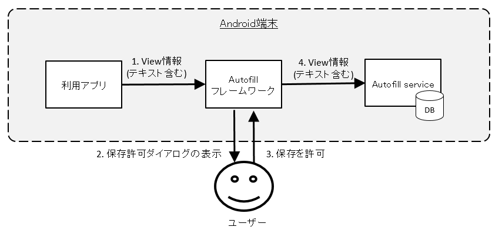{width="4.739583333333333in"
height="3.8020833333333335in"}

[]{#_Ref336007844 .anchor}図 4.2‑4

図
4.2‑5は、アプリAに加えてアプリBでも同じintent-filter(図中action="X")を定義している場合である。まず、他のアプリ(アプリC)が暗黙的IntentでBroadcastを送信するのは、非公開Receiver(A-1)側は受信をしないので特にセキュリティ的には問題にならない(図の橙色の矢印)。

セキュリティ面で問題になるのは、アプリAによる同一アプリ内の非公開Receiverの呼び出しである。アプリAが暗黙的IntentをBroadcastすると、同一アプリ内の非公開Receiverに加えて、同じIntent-filterを定義したBの持つ公開Receiver(B-1)もそのIntentを受信できてしまうからである(図の赤色の矢印)。AからアプリBに対してセンシティブな情報を送信する可能性が生じてしまう。アプリBがマルウェアであれば、そのままセンシティブな情報の漏洩に繋がる。また、BroadcastがOrdered
Broadcastであった場合は、意図しない結果情報を受け取ってしまう可能性もある。

{width="4.739583333333333in"
height="3.8020833333333335in"}

[]{#_Ref336007850 .anchor}図 4.2‑5

ただし、システムの送信するBroadcast
Intentのみを受信するBroadcastReceiverを実装する場合には、「exported=”false”かつintent-filter定義あり」を使用すること。かつ、これ以外の組み合わせは使っていけない。これは、システムが送信するBroadcast
Intentに関してはexported=”false”でも受信可能であるという事実にもとづく。システムが送信するBroadcast
Intentと同じACTIONのIntentを他アプリが送信した場合、それを受信してしまうと意図しない動作を引き起こす可能性があるが、これはexported=”false”を指定することによって防ぐことができる。

#### Receiverはアプリを起動しないと登録されない

AndroidManifest.xmlに静的に定義したBroadcast
Receiverは、インストールしただけでは有効にならないので注意が必要である[^7]。アプリを1回起動することで、それ以降のBroadcastを受信できるようになるため、インストール後にBroadcast受信をトリガーにして処理を起動させることはできない。ただしBroadcastの送信側でIntentにIntent.FLAG\_INCLUDE\_STOPPED\_PACKAGES
を設定してBroadcast送信した場合は、一度も起動していないアプリであってもこのBroadcast
を受信することができる。

#### 同じUIDを持つアプリから送信されたBroadcastは、非公開Broadcast Receiverでも受信できる

複数のアプリに同じUIDを持たせることができる。この場合、たとえ非公開Broadcast
Receiverであっても、同じUIDのアプリから送信されたBroadcastは受信してしまう。

しかしこれはセキュリティ上問題となることはない。同じUIDを持つアプリはAPKを署名する開発者鍵が一致することが保証されており、非公開Broadcast　Receiverが受信するのは自社アプリから送信されたBroadcastに限定されるからである。

#### Broadcastの種類とその特徴

送信するBroadcastはOrderedかそうでないか、Stickyかそうでないかの組み合わせにより4種類のBroadcastが存在する。Broadcast送信用メソッドに応じて、送信するBroadcastの種類が決まる。なお、Sticky
Broadcastの使用はAndroid 5.0（API Level 21）において非推奨となっている。

表 4.2‑3

  Broadcastの種類            送信用メソッド                 Ordered?   Sticky?
  -------------------------- ------------------------------ ---------- ---------
  Normal Broadcast           sendBroadcast()                No         No
  Ordered Broadcast          sendOrderedBroadcast()         Yes        No
  Sticky Broadcast           sendStickyBroadcast()          No         Yes
  Sticky Ordered Broadcast   sendStickyOrderedBroadcast()   Yes        Yes

それぞれのBroadcastの特徴は次のとおりである。

表 4.2‑4

  Broadcastの種類            Broadcastの種類ごとの特徴
  -------------------------- -----------------------------------------------------------------------------------------------------------------------------------------------------------------------------------------------------------------------------------------------------------------------------------------------------------------------------------------------------------------------------------------------------------------------------------------------------------------------------------------------------------------------------------------------------------------------------------------------------------------------------------------
  Normal Broadcast           Normal Broadcastは送信時に受信可能な状態にあるBroadcast Receiverに配送されて消滅する。Ordered Broadcastと異なり、複数のBroadcast Receiverが同時にBroadcastを受信するのが特徴である。特定のPermissionを持つアプリのBroadcast ReceiverだけにBroadcastを受信させることもできる。
  Ordered Broadcast          Ordered Broadcastは送信時に受信可能な状態にあるBroadcast Receiverが一つずつ順番にBroadcastを受信することが特徴である。よりpriority値が大きいBroadcast Receiverが先に受信する。すべてのBroadcast Receiverに配送完了するか、途中のBroadcast　ReceiverがabortBroadcast()を呼び出した場合に、Broadcastは消滅する。特定のPermissionを利用宣言したアプリのBroadcast ReceiverだけにBroadcastを受信させることもできる。またOrdered Broadcastでは送信元がBroadcast Receiverからの結果情報を受け取ることもできる。SMS受信通知Broadcast（SMS\_RECEIVED）はOrdered Broadcastの代表例である。
  Sticky Broadcast           Sticky Broadcastは送信時に受信可能な状態にあるBroadcast Receiverに配送された後に消滅することはなくシステムに残り続け、後にregisterReceiver()を呼び出したアプリがSticky Broadcastを受信することができることが特徴である。Sticky Broadcastは他のBroadcastと異なり自動的に消滅することはないので、Sticky Broadcastが不要になったときに、明示的にremoveStickyBroadcast()を呼び出してSticky Broadcastを消滅させる必要がある。他のBroadcastと異なり、特定のPermissionを持つアプリのBroadcast ReceiverだけにBroadcastを受信させることはできない。バッテリー状態変更通知Broadcast（ACTION\_BATTERY\_CHANGED）はSticky Broadcastの代表例である。
  Sticky Ordered Broadcast   Ordered BroadcastとSticky Broadcastの両方の特徴を持ったBroadcastである。Sticky Broadcastと同様、特定のPermissionを持つアプリのBroadcast ReceiverだけにBroadcastを受信させることはできない。

Broadcastの特徴的な振る舞いの視点で、上表を逆引き的に再整理すると下表になる。

表 4.2‑5

  -------------------------------------------------------------------------------------------------------------
  Broadcastの特徴的な振る舞い                              Normal      Ordered     Sticky      Sticky Ordered
                                                                                               
                                                           Broadcast   Broadcast   Broadcast   Broadcast
  -------------------------------------------------------- ----------- ----------- ----------- ----------------
  受信可能なBroadcast ReceiverをPermissionにより制限する   ○           ○           －          －

  Broadcast Receiverからの処理結果を取得する               －          ○           －          ○

  順番にBroadcast ReceiverにBroadcastを処理させる          －          ○           －          ○

  既に送信されているBroadcastを後から受信する              －          －          ○           ○
  -------------------------------------------------------------------------------------------------------------

#### Broadcast送信した情報がLogCatに出力される場合がある

Broadcastの送受信は基本的にLogCatに出力されない。しかし、受信側のPermission不足によるエラーや、送信側のPermission不足によるエラーの際にLogCatにエラーログが出力される。エラーログにはBroadcastで送信するIntent情報も含まれるので、エラー発生時にはBroadcast送信する場合はLogCatに表示されることに注意してほしい。

> 送信側のPermission不足時のエラー

W/ActivityManager(266): Permission Denial: broadcasting Intent {
act=org.jssec.android.broadcastreceiver.creating.action.MY\_ACTION }
from org.jssec.android.broadcast.sending (pid=4685, uid=10058) requires
org.jssec.android.permission.MY\_PERMISSION due to receiver
org.jssec.android.broadcastreceiver.creating/org.jssec.android.broadcastreceiver.creating.CreatingType3Receiver

> 受信側のPermission不足時のエラー

W/ActivityManager(275): Permission Denial: receiving Intent {
act=org.jssec.android.broadcastreceiver.creating.action.MY\_ACTION } to
org.jssec.android.broadcastreceiver.creating requires
org.jssec.android.permission.MY\_PERMISSION due to sender
org.jssec.android.broadcast.sending (uid 10158)

#### ホーム画面（アプリ）にショートカットを配置する際の注意点

ホーム画面にアプリを起動するためのショートカットボタンやWebブラウザのブックマークのようなURLショートカットを作成する場合の注意点について説明する。例として、以下のような実装を考えてみる。

> ホーム画面（アプリ）にショートカットを配置する

Intent targetIntent = new Intent(this, TargetActivity.class);

// ショートカット作成依頼のためのIntent

Intent intent = new
Intent("com.android.launcher.action.INSTALL\_SHORTCUT");

// ショートカットのタップ時に起動するIntentを指定

intent.putExtra(Intent.EXTRA\_SHORTCUT\_INTENT, targetIntent);

Parcelable icon = Intent.ShortcutIconResource.fromContext(context,
iconResource);

intent.putExtra(Intent.EXTRA\_SHORTCUT\_ICON\_RESOURCE, icon);

intent.putExtra(Intent.EXTRA\_SHORTCUT\_NAME, title);

intent.putExtra("duplicate", false);

// BroadCastを使って、システムにショートカット作成を依頼する

context.sendBroadcast(intent);

上記で送信しているBroadcastは、受け手がホーム画面アプリであり、パッケージ名を特定することが難しいため、暗黙的Intentによる公開Receiverへの送信となっていることに注意が必要である。つまり、上記で送信したBroadcastはマルウェアを含めた任意のアプリが受信することができ、そのため、Intentにセンシティブな情報が含まれていると情報漏えいの被害につながる可能性がある。URLを基にしたショートカットを作成する場合、URLに秘密の情報が含まれていることもあるため、特に注意が必要である。

対策方法としては、「4.2.1.2公開Broadcast Receiver -
Broadcastを受信する・送信する」に記載されているポイントに従い、送信するIntentにセンシティブな情報が含まないようにすることが必要である。

Content Providerを作る・利用する
--------------------------------

ContentResolverとSQLiteDatabaseのインターフェースが似ているため、Content
ProviderはSQLiteDatabaseと密接に関係があると勘違いされることが多い。しかし実際にはContent
Providerはアプリ間データ共有のインターフェースを規定するだけで、データ保存の形式は一切問わないことに注意が必要だ。作成するContent
Provider内部でデータの保存にSQLiteDatabaseを使うこともできるし、XMLファイルなどの別の保存形式を使うこともできる。なお、ここで紹介するサンプルコードにはデータを保存する処理を含まないので、必要に応じて追加すること。

### サンプルコード

Content Providerがどのように利用されるかによって、Content
Providerが抱えるリスクや適切な防御手段が異なる。次の判定フローによって作成するContent
Providerがどのタイプであるかを判断できる。

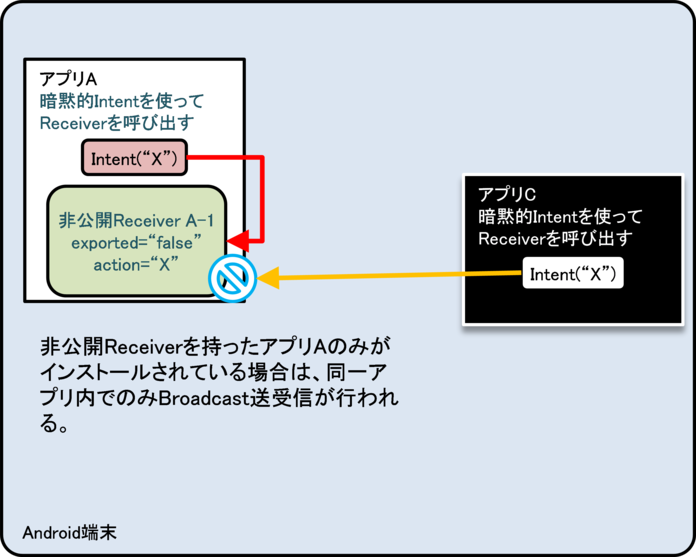{width="6.889763779527559in"
height="3.0866141732283463in"}

図 4.3‑1

#### 非公開Content Providerを作る・利用する

非公開Content Providerは、同一アプリ内だけで利用されるContent
Providerであり、もっとも安全性の高いContent Providerである[^8]。

以下、非公開Content Providerの実装例を示す。

> ポイント(Content Providerを作る）：

1.  exported="false"により、明示的に非公開設定する

&nbsp;
1.  同一アプリ内からのリクエストであっても、パラメータの安全性を確認する

2.  利用元アプリは同一アプリであるから、センシティブな情報を返送してよい

> AndroidManifest.xml

&lt;?xml version="1.0" encoding="utf-8"?&gt;

&lt;manifest xmlns:android="http://schemas.android.com/apk/res/android"

package="org.jssec.android.provider.privateprovider"&gt;

&lt;application

android:icon="@drawable/ic\_launcher"

android:label="@string/app\_name" &gt;

&lt;activity

android:name=".PrivateUserActivity"

android:label="@string/app\_name"

android:exported="true" &gt;

&lt;intent-filter&gt;

&lt;action android:name="android.intent.action.MAIN" /&gt;

&lt;category android:name="android.intent.category.LAUNCHER" /&gt;

&lt;/intent-filter&gt;

&lt;/activity&gt;

&lt;!-- ★ポイント1★ exported="false"により、明示的に非公開設定する
--&gt;

&lt;provider

android:name=".PrivateProvider"

android:authorities="org.jssec.android.provider.privateprovider"

android:exported="false" /&gt;

&lt;/application&gt;

&lt;/manifest&gt;

> PrivateProvider.java

package org.jssec.android.provider.privateprovider;

import android.content.ContentProvider;

import android.content.ContentUris;

import android.content.ContentValues;

import android.content.UriMatcher;

import android.database.Cursor;

import android.database.MatrixCursor;

import android.net.Uri;

public class PrivateProvider extends ContentProvider {

public static final String AUTHORITY =
"org.jssec.android.provider.privateprovider";

public static final String CONTENT\_TYPE =
"vnd.android.cursor.dir/vnd.org.jssec.contenttype";

public static final String CONTENT\_ITEM\_TYPE =
"vnd.android.cursor.item/vnd.org.jssec.contenttype";

// Content Providerが提供するインターフェースを公開

public interface Download {

public static final String PATH = "downloads";

public static final Uri CONTENT\_URI = Uri.parse("content://" +
AUTHORITY + "/" + PATH);

}

public interface Address {

public static final String PATH = "addresses";

public static final Uri CONTENT\_URI = Uri.parse("content://" +
AUTHORITY + "/" + PATH);

}

// UriMatcher

private static final int DOWNLOADS\_CODE = 1;

private static final int DOWNLOADS\_ID\_CODE = 2;

private static final int ADDRESSES\_CODE = 3;

private static final int ADDRESSES\_ID\_CODE = 4;

private static UriMatcher sUriMatcher;

static {

sUriMatcher = new UriMatcher(UriMatcher.NO\_MATCH);

sUriMatcher.addURI(AUTHORITY, Download.PATH, DOWNLOADS\_CODE);

sUriMatcher.addURI(AUTHORITY, Download.PATH + "/\#",
DOWNLOADS\_ID\_CODE);

sUriMatcher.addURI(AUTHORITY, Address.PATH, ADDRESSES\_CODE);

sUriMatcher.addURI(AUTHORITY, Address.PATH + "/\#",
ADDRESSES\_ID\_CODE);

}

//
DBを使用せずに固定値を返す例にしているため、queryメソッドで返すCursorを事前に定義

private static MatrixCursor sAddressCursor = new MatrixCursor(new
String\[\] { "\_id", "pref" });

static {

sAddressCursor.addRow(new String\[\] { "1", "北海道" });

sAddressCursor.addRow(new String\[\] { "2", "青森" });

sAddressCursor.addRow(new String\[\] { "3", "岩手" });

}

private static MatrixCursor sDownloadCursor = new MatrixCursor(new
String\[\] { "\_id", "path" });

static {

sDownloadCursor.addRow(new String\[\] { "1",
"/sdcard/downloads/sample.jpg" });

sDownloadCursor.addRow(new String\[\] { "2",
"/sdcard/downloads/sample.txt" });

}

@Override

public boolean onCreate() {

return true;

}

@Override

public String getType(Uri uri) {

// ★ポイント2★
同一アプリ内からのリクエストであっても、パラメータの安全性を確認する

// ここではuriが想定の範囲内であることを、UriMatcher\#match()とswitch
caseで確認している。

// 「3.2 入力データの安全性を確認する」を参照。

// ★ポイント3★
利用元アプリは同一アプリであるから、センシティブな情報を返送してよい

// ただしgetTypeの結果がセンシティブな意味を持つことはあまりない。

switch (sUriMatcher.match(uri)) {

case DOWNLOADS\_CODE:

case ADDRESSES\_CODE:

return CONTENT\_TYPE;

case DOWNLOADS\_ID\_CODE:

case ADDRESSES\_ID\_CODE:

return CONTENT\_ITEM\_TYPE;

default:

throw new IllegalArgumentException("Invalid URI：" + uri);

}

}

@Override

public Cursor query(Uri uri, String\[\] projection, String selection,

String\[\] selectionArgs, String sortOrder) {

// ★ポイント2★
同一アプリ内からのリクエストであっても、パラメータの安全性を確認する

// ここではuriが想定の範囲内であることを、UriMatcher\#match()とswitch
caseで確認している。

// その他のパラメータの確認はサンプルにつき省略。「3.2
入力データの安全性を確認する」を参照。

// ★ポイント3★
利用元アプリは同一アプリであるから、センシティブな情報を返送してよい

// queryの結果がセンシティブな意味を持つかどうかはアプリ次第。

switch (sUriMatcher.match(uri)) {

case DOWNLOADS\_CODE:

case DOWNLOADS\_ID\_CODE:

return sDownloadCursor;

case ADDRESSES\_CODE:

case ADDRESSES\_ID\_CODE:

return sAddressCursor;

default:

throw new IllegalArgumentException("Invalid URI：" + uri);

}

}

@Override

public Uri insert(Uri uri, ContentValues values) {

// ★ポイント2★
同一アプリ内からのリクエストであっても、パラメータの安全性を確認する

// ここではuriが想定の範囲内であることを、UriMatcher\#match()とswitch
caseで確認している。

// その他のパラメータの確認はサンプルにつき省略。「3.2
入力データの安全性を確認する」を参照。

// ★ポイント3★
利用元アプリは同一アプリであるから、センシティブな情報を返送してよい

//
Insert結果、発番されるIDがセンシティブな意味を持つかどうかはアプリ次第。

switch (sUriMatcher.match(uri)) {

case DOWNLOADS\_CODE:

return ContentUris.withAppendedId(Download.CONTENT\_URI, 3);

case ADDRESSES\_CODE:

return ContentUris.withAppendedId(Address.CONTENT\_URI, 4);

default:

throw new IllegalArgumentException("Invalid URI：" + uri);

}

}

@Override

public int update(Uri uri, ContentValues values, String selection,

String\[\] selectionArgs) {

// ★ポイント2★
同一アプリ内からのリクエストであっても、パラメータの安全性を確認する

// ここではuriが想定の範囲内であることを、UriMatcher\#match()とswitch
caseで確認している。

// その他のパラメータの確認はサンプルにつき省略。「3.2
入力データの安全性を確認する」を参照。

// ★ポイント3★
利用元アプリは同一アプリであるから、センシティブな情報を返送してよい

//
Updateされたレコード数がセンシティブな意味を持つかどうかはアプリ次第。

switch (sUriMatcher.match(uri)) {

case DOWNLOADS\_CODE:

return 5; // updateされたレコード数を返す

case DOWNLOADS\_ID\_CODE:

return 1;

case ADDRESSES\_CODE:

return 15;

case ADDRESSES\_ID\_CODE:

return 1;

default:

throw new IllegalArgumentException("Invalid URI：" + uri);

}

}

@Override

public int delete(Uri uri, String selection, String\[\] selectionArgs) {

// ★ポイント2★
同一アプリ内からのリクエストであっても、パラメータの安全性を確認する

// ここではuriが想定の範囲内であることを、UriMatcher\#match()とswitch
caseで確認している。

// その他のパラメータの確認はサンプルにつき省略。「3.2
入力データの安全性を確認する」を参照。

// ★ポイント3★
利用元アプリは同一アプリであるから、センシティブな情報を返送してよい

//
Deleteされたレコード数がセンシティブな意味を持つかどうかはアプリ次第。

switch (sUriMatcher.match(uri)) {

case DOWNLOADS\_CODE:

return 10; // deleteされたレコード数を返す

case DOWNLOADS\_ID\_CODE:

return 1;

case ADDRESSES\_CODE:

return 20;

case ADDRESSES\_ID\_CODE:

return 1;

default:

throw new IllegalArgumentException("Invalid URI：" + uri);

}

}

}

次に、非公開Content Providerを利用するActivityの例を示す。

> ポイント(Content Providerを利用する)：

1.  同一アプリ内へのリクエストであるから、センシティブな情報をリクエストに含めてよい

2.  同一アプリ内からの結果情報であっても、受信データの安全性を確認する

> PrivateUserActivity.java

package org.jssec.android.provider.privateprovider;

import android.app.Activity;

import android.database.Cursor;

import android.net.Uri;

import android.os.Bundle;

import android.view.View;

import android.widget.TextView;

public class PrivateUserActivity extends Activity {

public void onQueryClick(View view) {

logLine("\[Query\]");

// ★ポイント4★
同一アプリ内へのリクエストであるから、センシティブな情報をリクエストに含めてよい

Cursor cursor = null;

try {

cursor = getContentResolver().query(

PrivateProvider.Download.CONTENT\_URI, null, null, null, null);

// ★ポイント5★
同一アプリ内からの結果情報であっても、受信データの安全性を確認する

// サンプルにつき割愛。「3.2 入力データの安全性を確認する」を参照。

if (cursor == null) {

logLine(" null cursor");

} else {

boolean moved = cursor.moveToFirst();

while (moved) {

logLine(String.format(" %d, %s", cursor.getInt(0),
cursor.getString(1)));

moved = cursor.moveToNext();

}

}

}

finally {

if (cursor != null) cursor.close();

}

}

public void onInsertClick(View view) {

logLine("\[Insert\]");

// ★ポイント4★
同一アプリ内へのリクエストであるから、センシティブな情報をリクエストに含めてよい

Uri uri =
getContentResolver().insert(PrivateProvider.Download.CONTENT\_URI,
null);

// ★ポイント5★
同一アプリ内からの結果情報であっても、受信データの安全性を確認する

// サンプルにつき割愛。「3.2 入力データの安全性を確認する」を参照。

logLine(" uri:" + uri);

}

public void onUpdateClick(View view) {

logLine("\[Update\]");

// ★ポイント4★
同一アプリ内へのリクエストであるから、センシティブな情報をリクエストに含めてよい

int count =
getContentResolver().update(PrivateProvider.Download.CONTENT\_URI, null,
null, null);

// ★ポイント5★
同一アプリ内からの結果情報であっても、受信データの安全性を確認する

// サンプルにつき割愛。「3.2 入力データの安全性を確認する」を参照。

logLine(String.format(" %s records updated", count));

}

public void onDeleteClick(View view) {

logLine("\[Delete\]");

// ★ポイント4★
同一アプリ内へのリクエストであるから、センシティブな情報をリクエストに含めてよい

int count = getContentResolver().delete(

PrivateProvider.Download.CONTENT\_URI, null, null);

// ★ポイント5★
同一アプリ内からの結果情報であっても、受信データの安全性を確認する

// サンプルにつき割愛。「3.2 入力データの安全性を確認する」を参照。

logLine(String.format(" %s records deleted", count));

}

private TextView mLogView;

@Override

public void onCreate(Bundle savedInstanceState) {

super.onCreate(savedInstanceState);

setContentView(R.layout.main);

mLogView = (TextView)findViewById(R.id.logview);

}

private void logLine(String line) {

mLogView.append(line);

mLogView.append("\\n");

}

}

#### 公開Content Providerを作る・利用する

公開Content
Providerは、不特定多数のアプリに利用されることを想定したContent
Providerである。クライアントを限定しないことにより、マルウェアからselect()によって保持しているデータを抜き取られたり、update()によってデータを書き換えられたり、insert()/delete()によって偽のデータの挿入やデータの削除といった攻撃を受けたりして改ざんされ得ることに注意が必要だ。

また、Android OS既定ではない独自作成の公開Content
Providerを利用する場合、その公開Content
Providerに成り済ましたマルウェアにリクエストパラメータを受信されることがあること、および、攻撃結果データを受け取ることがあることに注意が必要である。Android
OS既定のContactsやMediaStore等も公開Content
Providerであるが、マルウェアはそれらContent
Providerに成り済ましできない。

以下、公開Content Providerの実装例を示す。

> ポイント(Content Providerを作る)：

1.  exported="true"により、明示的に公開設定する

2.  リクエストパラメータの安全性を確認する

&nbsp;
1.  センシティブな情報を返送してはならない

> AndroidManifest.xml

&lt;?xml version="1.0" encoding="utf-8"?&gt;

&lt;manifest xmlns:android="http://schemas.android.com/apk/res/android"

package="org.jssec.android.provider.publicprovider"&gt;

&lt;application

android:icon="@drawable/ic\_launcher"

android:label="@string/app\_name" &gt;

&lt;!-- ★ポイント1★ exported="true"により、明示的に公開設定する --&gt;

&lt;provider

android:name=".PublicProvider"

android:authorities="org.jssec.android.provider.publicprovider"

android:exported="true"/&gt;

&lt;/application&gt;

&lt;/manifest&gt;

> PublicProvider.java

package org.jssec.android.provider.publicprovider;

import android.content.ContentProvider;

import android.content.ContentUris;

import android.content.ContentValues;

import android.content.UriMatcher;

import android.database.Cursor;

import android.database.MatrixCursor;

import android.net.Uri;

public class PublicProvider extends ContentProvider {

public static final String AUTHORITY =
"org.jssec.android.provider.publicprovider";

public static final String CONTENT\_TYPE =
"vnd.android.cursor.dir/vnd.org.jssec.contenttype";

public static final String CONTENT\_ITEM\_TYPE =
"vnd.android.cursor.item/vnd.org.jssec.contenttype";

// Content Providerが提供するインターフェースを公開

public interface Download {

public static final String PATH = "downloads";

public static final Uri CONTENT\_URI = Uri.parse("content://" +
AUTHORITY + "/" + PATH);

}

public interface Address {

public static final String PATH = "addresses";

public static final Uri CONTENT\_URI = Uri.parse("content://" +
AUTHORITY + "/" + PATH);

}

// UriMatcher

private static final int DOWNLOADS\_CODE = 1;

private static final int DOWNLOADS\_ID\_CODE = 2;

private static final int ADDRESSES\_CODE = 3;

private static final int ADDRESSES\_ID\_CODE = 4;

private static UriMatcher sUriMatcher;

static {

sUriMatcher = new UriMatcher(UriMatcher.NO\_MATCH);

sUriMatcher.addURI(AUTHORITY, Download.PATH, DOWNLOADS\_CODE);

sUriMatcher.addURI(AUTHORITY, Download.PATH + "/\#",
DOWNLOADS\_ID\_CODE);

sUriMatcher.addURI(AUTHORITY, Address.PATH, ADDRESSES\_CODE);

sUriMatcher.addURI(AUTHORITY, Address.PATH + "/\#",
ADDRESSES\_ID\_CODE);

}

//
DBを使用せずに固定値を返す例にしているため、queryメソッドで返すCursorを事前に定義

private static MatrixCursor sAddressCursor = new MatrixCursor(new
String\[\] { "\_id", "pref" });

static {

sAddressCursor.addRow(new String\[\] { "1", "北海道" });

sAddressCursor.addRow(new String\[\] { "2", "青森" });

sAddressCursor.addRow(new String\[\] { "3", "岩手" });

}

private static MatrixCursor sDownloadCursor = new MatrixCursor(new
String\[\] { "\_id", "path" });

static {

sDownloadCursor.addRow(new String\[\] { "1",
"/sdcard/downloads/sample.jpg" });

sDownloadCursor.addRow(new String\[\] { "2",
"/sdcard/downloads/sample.txt" });

}

@Override

public boolean onCreate() {

return true;

}

@Override

public String getType(Uri uri) {

switch (sUriMatcher.match(uri)) {

case DOWNLOADS\_CODE:

case ADDRESSES\_CODE:

return CONTENT\_TYPE;

case DOWNLOADS\_ID\_CODE:

case ADDRESSES\_ID\_CODE:

return CONTENT\_ITEM\_TYPE;

default:

throw new IllegalArgumentException("Invalid URI：" + uri);

}

}

@Override

public Cursor query(Uri uri, String\[\] projection, String selection,

String\[\] selectionArgs, String sortOrder) {

// ★ポイント2★ リクエストパラメータの安全性を確認する

// ここではuriが想定の範囲内であることを、UriMatcher\#match()とswitch
caseで確認している。

// その他のパラメータの確認はサンプルにつき省略。「3.2
入力データの安全性を確認する」を参照。

// ★ポイント3★ センシティブな情報を返送してはならない

// queryの結果がセンシティブな意味を持つかどうかはアプリ次第。

// リクエスト元のアプリがマルウェアである可能性がある。

//
マルウェアに取得されても問題のない情報であれば結果として返してもよい。

switch (sUriMatcher.match(uri)) {

case DOWNLOADS\_CODE:

case DOWNLOADS\_ID\_CODE:

return sDownloadCursor;

case ADDRESSES\_CODE:

case ADDRESSES\_ID\_CODE:

return sAddressCursor;

default:

throw new IllegalArgumentException("Invalid URI：" + uri);

}

}

@Override

public Uri insert(Uri uri, ContentValues values) {

// ★ポイント2★ リクエストパラメータの安全性を確認する

// ここではuriが想定の範囲内であることを、UriMatcher\#match()とswitch
caseで確認している。

// その他のパラメータの確認はサンプルにつき省略。「3.2
入力データの安全性を確認する」を参照。

// ★ポイント3★ センシティブな情報を返送してはならない

//
Insert結果、発番されるIDがセンシティブな意味を持つかどうかはアプリ次第。

// リクエスト元のアプリがマルウェアである可能性がある。

//
マルウェアに取得されても問題のない情報であれば結果として返してもよい。

switch (sUriMatcher.match(uri)) {

case DOWNLOADS\_CODE:

return ContentUris.withAppendedId(Download.CONTENT\_URI, 3);

case ADDRESSES\_CODE:

return ContentUris.withAppendedId(Address.CONTENT\_URI, 4);

default:

throw new IllegalArgumentException("Invalid URI：" + uri);

}

}

@Override

public int update(Uri uri, ContentValues values, String selection,

String\[\] selectionArgs) {

// ★ポイント2★ リクエストパラメータの安全性を確認する

// ここではuriが想定の範囲内であることを、UriMatcher\#match()とswitch
caseで確認している。

// その他のパラメータの確認はサンプルにつき省略。「3.2
入力データの安全性を確認する」を参照。

// ★ポイント3★ センシティブな情報を返送してはならない

//
Updateされたレコード数がセンシティブな意味を持つかどうかはアプリ次第。

// リクエスト元のアプリがマルウェアである可能性がある。

//
マルウェアに取得されても問題のない情報であれば結果として返してもよい。

switch (sUriMatcher.match(uri)) {

case DOWNLOADS\_CODE:

return 5; // updateされたレコード数を返す

case DOWNLOADS\_ID\_CODE:

return 1;

case ADDRESSES\_CODE:

return 15;

case ADDRESSES\_ID\_CODE:

return 1;

default:

throw new IllegalArgumentException("Invalid URI：" + uri);

}

}

@Override

public int delete(Uri uri, String selection, String\[\] selectionArgs) {

// ★ポイント2★ リクエストパラメータの安全性を確認する

// ここではuriが想定の範囲内であることを、UriMatcher\#match()とswitch
caseで確認している。

// その他のパラメータの確認はサンプルにつき省略。「3.2
入力データの安全性を確認する」を参照。

// ★ポイント3★ センシティブな情報を返送してはならない

//
Deleteされたレコード数がセンシティブな意味を持つかどうかはアプリ次第。

// リクエスト元のアプリがマルウェアである可能性がある。

//
マルウェアに取得されても問題のない情報であれば結果として返してもよい。

switch (sUriMatcher.match(uri)) {

case DOWNLOADS\_CODE:

return 10; // deleteされたレコード数を返す

case DOWNLOADS\_ID\_CODE:

return 1;

case ADDRESSES\_CODE:

return 20;

case ADDRESSES\_ID\_CODE:

return 1;

default:

throw new IllegalArgumentException("Invalid URI：" + uri);

}

}

}

次に、公開Content Providerを利用するActivityの例を示す。

> ポイント(Content Providerを利用する)：

1.  センシティブな情報をリクエストに含めてはならない

2.  結果データの安全性を確認する

> PublicUserActivity.java

package org.jssec.android.provider.publicuser;

import android.app.Activity;

import android.content.ContentValues;

import android.content.pm.ProviderInfo;

import android.database.Cursor;

import android.net.Uri;

import android.os.Bundle;

import android.view.View;

import android.widget.TextView;

public class PublicUserActivity extends Activity {

// 利用先のContent Provider情報

private static final String AUTHORITY =
"org.jssec.android.provider.publicprovider";

private interface Address {

public static final String PATH = "addresses";

public static final Uri CONTENT\_URI = Uri.parse("content://" +
AUTHORITY + "/" + PATH);

}

public void onQueryClick(View view) {

logLine("\[Query\]");

if (!providerExists(Address.CONTENT\_URI)) {

logLine(" Content Providerが不在");

return;

}

// ★ポイント4★ センシティブな情報をリクエストに含めてはならない

// リクエスト先のアプリがマルウェアである可能性がある。

//
マルウェアに取得されても問題のない情報であればリクエストに含めてもよい。

Cursor cursor = null;

try {

cursor = getContentResolver().query(Address.CONTENT\_URI, null, null,
null, null);

// ★ポイント5★ 結果データの安全性を確認する

// サンプルにつき割愛。「3.2 入力データの安全性を確認する」を参照。

if (cursor == null) {

logLine(" null cursor");

} else {

boolean moved = cursor.moveToFirst();

while (moved) {

logLine(String.format(" %d, %s", cursor.getInt(0),
cursor.getString(1)));

moved = cursor.moveToNext();

}

}

}

finally {

if (cursor != null) cursor.close();

}

}

public void onInsertClick(View view) {

logLine("\[Insert\]");

if (!providerExists(Address.CONTENT\_URI)) {

logLine(" Content Providerが不在");

return;

}

// ★ポイント4★ センシティブな情報をリクエストに含めてはならない

// リクエスト先のアプリがマルウェアである可能性がある。

//
マルウェアに取得されても問題のない情報であればリクエストに含めてもよい。

ContentValues values = new ContentValues();

values.put("pref", "東京都");

Uri uri = getContentResolver().insert(Address.CONTENT\_URI, values);

// ★ポイント5★ 結果データの安全性を確認する

// サンプルにつき割愛。「3.2 入力データの安全性を確認する」を参照。

logLine(" uri:" + uri);

}

public void onUpdateClick(View view) {

logLine("\[Update\]");

if (!providerExists(Address.CONTENT\_URI)) {

logLine(" Content Providerが不在");

return;

}

// ★ポイント4★ センシティブな情報をリクエストに含めてはならない

// リクエスト先のアプリがマルウェアである可能性がある。

//
マルウェアに取得されても問題のない情報であればリクエストに含めてもよい。

ContentValues values = new ContentValues();

values.put("pref", "東京都");

String where = "\_id = ?";

String\[\] args = { "4" };

int count = getContentResolver().update(Address.CONTENT\_URI, values,
where, args);

// ★ポイント5★ 結果データの安全性を確認する

// サンプルにつき割愛。「3.2 入力データの安全性を確認する」を参照。

logLine(String.format(" %s records updated", count));

}

public void onDeleteClick(View view) {

logLine("\[Delete\]");

if (!providerExists(Address.CONTENT\_URI)) {

logLine(" Content Providerが不在");

return;

}

// ★ポイント4★ センシティブな情報をリクエストに含めてはならない

// リクエスト先のアプリがマルウェアである可能性がある。

//
マルウェアに取得されても問題のない情報であればリクエストに含めてもよい。

int count = getContentResolver().delete(Address.CONTENT\_URI, null,
null);

// ★ポイント5★ 結果データの安全性を確認する

// サンプルにつき割愛。「3.2 入力データの安全性を確認する」を参照。

logLine(String.format(" %s records deleted", count));

}

private boolean providerExists(Uri uri) {

ProviderInfo pi =
getPackageManager().resolveContentProvider(uri.getAuthority(), 0);

return (pi != null);

}

private TextView mLogView;

@Override

public void onCreate(Bundle savedInstanceState) {

super.onCreate(savedInstanceState);

setContentView(R.layout.main);

mLogView = (TextView)findViewById(R.id.logview);

}

private void logLine(String line) {

mLogView.append(line);

mLogView.append("\\n");

}

}

#### パートナー限定Content Providerを作る・利用する

パートナー限定Content Providerは、特定のアプリだけから利用できるContent
Providerである。パートナー企業のアプリと自社アプリが連携してシステムを構成し、パートナーアプリとの間で扱う情報や機能を守るために利用される。

以下、パートナー限定Content Providerの実装例を示す。

> ポイント(Content Providerを作る)：

1.  exported="true"により、明示的に公開設定する

2.  利用元アプリの証明書がホワイトリストに登録されていることを確認する

&nbsp;
1.  パートナーアプリからのリクエストであっても、パラメータの安全性を確認する

2.  パートナーアプリに開示してよい情報に限り返送してよい

> AndroidManifest.xml

&lt;?xml version="1.0" encoding="utf-8"?&gt;

&lt;manifest xmlns:android="http://schemas.android.com/apk/res/android"

package="org.jssec.android.provider.partnerprovider"&gt;

&lt;application

android:icon="@drawable/ic\_launcher"

android:label="@string/app\_name" &gt;

&lt;!-- ★ポイント1★ exported="true"により、明示的に公開設定する --&gt;

&lt;provider

android:name="org.jssec.android.provider.partnerprovider.PartnerProvider"

android:authorities="org.jssec.android.provider.partnerprovider"

android:exported="true"/&gt;

&lt;/application&gt;

&lt;/manifest&gt;

> PartnerProvider.java

package org.jssec.android.provider.partnerprovider;

import java.util.List;

import org.jssec.android.shared.PkgCertWhitelists;

import org.jssec.android.shared.Utils;

import android.app.ActivityManager;

import android.app.ActivityManager.RunningAppProcessInfo;

import android.content.ContentProvider;

import android.content.ContentUris;

import android.content.ContentValues;

import android.content.Context;

import android.content.UriMatcher;

import android.database.Cursor;

import android.database.MatrixCursor;

import android.net.Uri;

import android.os.Binder;

import android.os.Build;

public class PartnerProvider extends ContentProvider {

public static final String AUTHORITY =
"org.jssec.android.provider.partnerprovider";

public static final String CONTENT\_TYPE =
"vnd.android.cursor.dir/vnd.org.jssec.contenttype";

public static final String CONTENT\_ITEM\_TYPE =
"vnd.android.cursor.item/vnd.org.jssec.contenttype";

// Content Providerが提供するインターフェースを公開

public interface Download {

public static final String PATH = "downloads";

public static final Uri CONTENT\_URI = Uri.parse("content://" +
AUTHORITY + "/" + PATH);

}

public interface Address {

public static final String PATH = "addresses";

public static final Uri CONTENT\_URI = Uri.parse("content://" +
AUTHORITY + "/" + PATH);

}

// UriMatcher

private static final int DOWNLOADS\_CODE = 1;

private static final int DOWNLOADS\_ID\_CODE = 2;

private static final int ADDRESSES\_CODE = 3;

private static final int ADDRESSES\_ID\_CODE = 4;

private static UriMatcher sUriMatcher;

static {

sUriMatcher = new UriMatcher(UriMatcher.NO\_MATCH);

sUriMatcher.addURI(AUTHORITY, Download.PATH, DOWNLOADS\_CODE);

sUriMatcher.addURI(AUTHORITY, Download.PATH + "/\#",
DOWNLOADS\_ID\_CODE);

sUriMatcher.addURI(AUTHORITY, Address.PATH, ADDRESSES\_CODE);

sUriMatcher.addURI(AUTHORITY, Address.PATH + "/\#",
ADDRESSES\_ID\_CODE);

}

//
DBを使用せずに固定値を返す例にしているため、queryメソッドで返すCursorを事前に定義

private static MatrixCursor sAddressCursor = new MatrixCursor(new
String\[\] { "\_id", "pref" });

static {

sAddressCursor.addRow(new String\[\] { "1", "北海道" });

sAddressCursor.addRow(new String\[\] { "2", "青森" });

sAddressCursor.addRow(new String\[\] { "3", "岩手" });

}

private static MatrixCursor sDownloadCursor = new MatrixCursor(new
String\[\] { "\_id", "path" });

static {

sDownloadCursor.addRow(new String\[\] { "1",
"/sdcard/downloads/sample.jpg" });

sDownloadCursor.addRow(new String\[\] { "2",
"/sdcard/downloads/sample.txt" });

}

// ★ポイント2★
利用元アプリの証明書がホワイトリストに登録されていることを確認する

private static PkgCertWhitelists sWhitelists = null;

private static void buildWhitelists(Context context) {

boolean isdebug = Utils.isDebuggable(context);

sWhitelists = new PkgCertWhitelists();

// パートナーアプリ org.jssec.android.provider.partneruser
の証明書ハッシュ値を登録

sWhitelists.add("org.jssec.android.provider.partneruser", isdebug ?

// debug.keystoreの"androiddebugkey"の証明書ハッシュ値

"0EFB7236 328348A9 89718BAD DF57F544 D5CCB4AE B9DB34BC 1E29DD26
F77C8255" :

// keystoreの"partner key"の証明書ハッシュ値

"1F039BB5 7861C27A 3916C778 8E78CE00 690B3974 3EB8259F E2627B8D
4C0EC35A");

// 以下同様に他のパートナーアプリを登録...

}

private static boolean checkPartner(Context context, String pkgname) {

if (sWhitelists == null) buildWhitelists(context);

return sWhitelists.test(context, pkgname);

}

// 利用元アプリのパッケージ名を取得

private String getCallingPackage(Context context) {

String pkgname;

if (Build.VERSION.SDK\_INT &gt;= Build.VERSION\_CODES.KITKAT) {

pkgname = super.getCallingPackage();

} else {

pkgname = null;

ActivityManager am = (ActivityManager)
context.getSystemService(Context.ACTIVITY\_SERVICE);

List&lt;RunningAppProcessInfo&gt; procList =
am.getRunningAppProcesses();

int callingPid = Binder.getCallingPid();

if (procList != null) {

for (RunningAppProcessInfo proc : procList) {

if (proc.pid == callingPid) {

pkgname = proc.pkgList\[proc.pkgList.length - 1\];

break;

}

}

}

}

return pkgname;

}

@Override

public boolean onCreate() {

return true;

}

@Override

public String getType(Uri uri) {

switch (sUriMatcher.match(uri)) {

case DOWNLOADS\_CODE:

case ADDRESSES\_CODE:

return CONTENT\_TYPE;

case DOWNLOADS\_ID\_CODE:

case ADDRESSES\_ID\_CODE:

return CONTENT\_ITEM\_TYPE;

default:

throw new IllegalArgumentException("Invalid URI：" + uri);

}

}

@Override

public Cursor query(Uri uri, String\[\] projection, String selection,

String\[\] selectionArgs, String sortOrder) {

// ★ポイント2★
利用元アプリの証明書がホワイトリストに登録されていることを確認する

if (!checkPartner(getContext(), getCallingPackage(getContext()))) {

throw new SecurityException("利用元アプリはパートナーアプリではない。");

}

// ★ポイント3★
パートナーアプリからのリクエストであっても、パラメータの安全性を確認する

// ここではuriが想定の範囲内であることを、UriMatcher\#match()とswitch
caseで確認している。

// 「3.2 入力データの安全性を確認する」を参照。

// ★ポイント4★ パートナーアプリに開示してよい情報に限り返送してよい

// queryの結果がパートナーアプリに開示してよい情報かどうかはアプリ次第。

switch (sUriMatcher.match(uri)) {

case DOWNLOADS\_CODE:

case DOWNLOADS\_ID\_CODE:

return sDownloadCursor;

case ADDRESSES\_CODE:

case ADDRESSES\_ID\_CODE:

return sAddressCursor;

default:

throw new IllegalArgumentException("Invalid URI：" + uri);

}

}

@Override

public Uri insert(Uri uri, ContentValues values) {

// ★ポイント2★
利用元アプリの証明書がホワイトリストに登録されていることを確認する

if (!checkPartner(getContext(), getCallingPackage(getContext()))) {

throw new SecurityException("利用元アプリはパートナーアプリではない。");

}

// ★ポイント3★
パートナーアプリからのリクエストであっても、パラメータの安全性を確認する

// ここではuriが想定の範囲内であることを、UriMatcher\#match()とswitch
caseで確認している。

// 「3.2 入力データの安全性を確認する」を参照。

// ★ポイント4★ パートナーアプリに開示してよい情報に限り返送してよい

//
Insert結果、発番されるIDがパートナーアプリに開示してよい情報かどうかはアプリ次第。

switch (sUriMatcher.match(uri)) {

case DOWNLOADS\_CODE:

return ContentUris.withAppendedId(Download.CONTENT\_URI, 3);

case ADDRESSES\_CODE:

return ContentUris.withAppendedId(Address.CONTENT\_URI, 4);

default:

throw new IllegalArgumentException("Invalid URI：" + uri);

}

}

@Override

public int update(Uri uri, ContentValues values, String selection,

String\[\] selectionArgs) {

// ★ポイント2★
利用元アプリの証明書がホワイトリストに登録されていることを確認する

if (!checkPartner(getContext(), getCallingPackage(getContext()))) {

throw new SecurityException("利用元アプリはパートナーアプリではない。");

}

// ★ポイント3★
パートナーアプリからのリクエストであっても、パラメータの安全性を確認する

// ここではuriが想定の範囲内であることを、UriMatcher\#match()とswitch
caseで確認している。

// 「3.2 入力データの安全性を確認する」を参照。

// ★ポイント4★ パートナーアプリに開示してよい情報に限り返送してよい

//
Updateされたレコード数がセンシティブな意味を持つかどうかはアプリ次第。

switch (sUriMatcher.match(uri)) {

case DOWNLOADS\_CODE:

return 5; // updateされたレコード数を返す

case DOWNLOADS\_ID\_CODE:

return 1;

case ADDRESSES\_CODE:

return 15;

case ADDRESSES\_ID\_CODE:

return 1;

default:

throw new IllegalArgumentException("Invalid URI：" + uri);

}

}

@Override

public int delete(Uri uri, String selection, String\[\] selectionArgs) {

// ★ポイント2★
利用元アプリの証明書がホワイトリストに登録されていることを確認する

if (!checkPartner(getContext(), getCallingPackage(getContext()))) {

throw new SecurityException("利用元アプリはパートナーアプリではない。");

}

// ★ポイント3★
パートナーアプリからのリクエストであっても、パラメータの安全性を確認する

// ここではuriが想定の範囲内であることを、UriMatcher\#match()とswitch
caseで確認している。

// 「3.2 入力データの安全性を確認する」を参照。

// ★ポイント4★ パートナーアプリに開示してよい情報に限り返送してよい

//
Deleteされたレコード数がセンシティブな意味を持つかどうかはアプリ次第。

switch (sUriMatcher.match(uri)) {

case DOWNLOADS\_CODE:

return 10; // deleteされたレコード数を返す

case DOWNLOADS\_ID\_CODE:

return 1;

case ADDRESSES\_CODE:

return 20;

case ADDRESSES\_ID\_CODE:

return 1;

default:

throw new IllegalArgumentException("Invalid URI：" + uri);

}

}

}

次に、パートナー限定Content Providerを利用するActivityの例を示す。

> ポイント(Content Providerを利用する)：

1.  利用先パートナー限定Content
    Providerアプリの証明書がホワイトリストに登録されていることを確認する

2.  パートナー限定Content
    Providerアプリに開示してよい情報に限りリクエストに含めてよい

3.  パートナー限定Content
    Providerアプリからの結果であっても、結果データの安全性を確認する

> PartnerUserActivity.java

package org.jssec.android.provider.partneruser;

import org.jssec.android.shared.PkgCertWhitelists;

import org.jssec.android.shared.Utils;

import android.app.Activity;

import android.content.ContentValues;

import android.content.Context;

import android.content.pm.ProviderInfo;

import android.database.Cursor;

import android.net.Uri;

import android.os.Bundle;

import android.view.View;

import android.widget.TextView;

public class PartnerUserActivity extends Activity {

// 利用先のContent Provider情報

private static final String AUTHORITY =
"org.jssec.android.provider.partnerprovider";

private interface Address {

public static final String PATH = "addresses";

public static final Uri CONTENT\_URI = Uri.parse("content://" +
AUTHORITY + "/" + PATH);

}

// ★ポイント5★ 利用先パートナー限定Content
Providerアプリの証明書がホワイトリストに登録されていることを確認する

private static PkgCertWhitelists sWhitelists = null;

private static void buildWhitelists(Context context) {

boolean isdebug = Utils.isDebuggable(context);

sWhitelists = new PkgCertWhitelists();

// パートナー限定Content Providerアプリ
org.jssec.android.provider.partnerprovider の証明書ハッシュ値を登録

sWhitelists.add("org.jssec.android.provider.partnerprovider", isdebug ?

// debug.keystoreの"androiddebugkey"の証明書ハッシュ値

"0EFB7236 328348A9 89718BAD DF57F544 D5CCB4AE B9DB34BC 1E29DD26
F77C8255" :

// keystoreの"my company key"の証明書ハッシュ値

"D397D343 A5CBC10F 4EDDEB7C A10062DE 5690984F 1FB9E88B D7B3A7C2
42E142CA");

// 以下同様に他のパートナー限定Content Providerアプリを登録...

}

private static boolean checkPartner(Context context, String pkgname) {

if (sWhitelists == null) buildWhitelists(context);

return sWhitelists.test(context, pkgname);

}

// uriをAUTHORITYとするContent Providerのパッケージ名を取得

private String providerPkgname(Uri uri) {

String pkgname = null;

ProviderInfo pi =
getPackageManager().resolveContentProvider(uri.getAuthority(), 0);

if (pi != null) pkgname = pi.packageName;

return pkgname;

}

public void onQueryClick(View view) {

logLine("\[Query\]");

// ★ポイント5★ 利用先パートナー限定Content
Providerアプリの証明書がホワイトリストに登録されていることを確認する

if (!checkPartner(this, providerPkgname(Address.CONTENT\_URI))) {

logLine(" 利用先 Content Provider
アプリはホワイトリストに登録されていない。");

return;

}

// ★ポイント6★ パートナー限定Content
Providerアプリに開示してよい情報に限りリクエストに含めてよい

Cursor cursor = null;

try {

cursor = getContentResolver().query(Address.CONTENT\_URI, null, null,
null, null);

// ★ポイント7★ パートナー限定Content
Providerアプリからの結果であっても、結果データの安全性を確認する

// サンプルにつき割愛。「3.2 入力データの安全性を確認する」を参照。

if (cursor == null) {

logLine(" null cursor");

} else {

boolean moved = cursor.moveToFirst();

while (moved) {

logLine(String.format(" %d, %s", cursor.getInt(0),
cursor.getString(1)));

moved = cursor.moveToNext();

}

}

}

finally {

if (cursor != null) cursor.close();

}

}

public void onInsertClick(View view) {

logLine("\[Insert\]");

// ★ポイント5★ 利用先パートナー限定Content
Providerアプリの証明書がホワイトリストに登録されていることを確認する

if (!checkPartner(this, providerPkgname(Address.CONTENT\_URI))) {

logLine(" 利用先 Content Provider
アプリはホワイトリストに登録されていない。");

return;

}

// ★ポイント6★ パートナー限定Content
Providerアプリに開示してよい情報に限りリクエストに含めてよい

ContentValues values = new ContentValues();

values.put("pref", "東京都");

Uri uri = getContentResolver().insert(Address.CONTENT\_URI, values);

// ★ポイント7★ パートナー限定Content
Providerアプリからの結果であっても、結果データの安全性を確認する

// サンプルにつき割愛。「3.2 入力データの安全性を確認する」を参照。

logLine(" uri:" + uri);

}

public void onUpdateClick(View view) {

logLine("\[Update\]");

// ★ポイント5★ 利用先パートナー限定Content
Providerアプリの証明書がホワイトリストに登録されていることを確認する

if (!checkPartner(this, providerPkgname(Address.CONTENT\_URI))) {

logLine(" 利用先 Content Provider
アプリはホワイトリストに登録されていない。");

return;

}

// ★ポイント6★ パートナー限定Content
Providerアプリに開示してよい情報に限りリクエストに含めてよい

ContentValues values = new ContentValues();

values.put("pref", "東京都");

String where = "\_id = ?";

String\[\] args = { "4" };

int count = getContentResolver().update(Address.CONTENT\_URI, values,
where, args);

// ★ポイント7★ パートナー限定Content
Providerアプリからの結果であっても、結果データの安全性を確認する

// サンプルにつき割愛。「3.2 入力データの安全性を確認する」を参照。

logLine(String.format(" %s records updated", count));

}

public void onDeleteClick(View view) {

logLine("\[Delete\]");

// ★ポイント5★ 利用先パートナー限定Content
Providerアプリの証明書がホワイトリストに登録されていることを確認する

if (!checkPartner(this, providerPkgname(Address.CONTENT\_URI))) {

logLine(" 利用先 Content Provider
アプリはホワイトリストに登録されていない。");

return;

}

// ★ポイント6★ パートナー限定Content
Providerアプリに開示してよい情報に限りリクエストに含めてよい

int count = getContentResolver().delete(Address.CONTENT\_URI, null,
null);

// ★ポイント7★ パートナー限定Content
Providerアプリからの結果であっても、結果データの安全性を確認する

// サンプルにつき割愛。「3.2 入力データの安全性を確認する」を参照。

logLine(String.format(" %s records deleted", count));

}

private TextView mLogView;

@Override

public void onCreate(Bundle savedInstanceState) {

super.onCreate(savedInstanceState);

setContentView(R.layout.main);

mLogView = (TextView)findViewById(R.id.logview);

}

private void logLine(String line) {

mLogView.append(line);

mLogView.append("\\n");

}

}

> PkgCertWhitelists.java

package org.jssec.android.shared;

import java.util.HashMap;

import java.util.Map;

import android.content.Context;

public class PkgCertWhitelists {

private Map&lt;String, String&gt; mWhitelists = new HashMap&lt;String,
String&gt;();

public boolean add(String pkgname, String sha256) {

if (pkgname == null) return false;

if (sha256 == null) return false;

sha256 = sha256.replaceAll(" ", "");

if (sha256.length() != 64) return false; // SHA-256は32バイト

sha256 = sha256.toUpperCase();

if (sha256.replaceAll("\[0-9A-F\]+", "").length() != 0) return false; //
0-9A-F 以外の文字がある

mWhitelists.put(pkgname, sha256);

return true;

}

public boolean test(Context ctx, String pkgname) {

// pkgnameに対応する正解のハッシュ値を取得する

String correctHash = mWhitelists.get(pkgname);

// pkgnameの実際のハッシュ値と正解のハッシュ値を比較する

return PkgCert.test(ctx, pkgname, correctHash);

}

}

> PkgCert.java

package org.jssec.android.shared;

import java.security.MessageDigest;

import java.security.NoSuchAlgorithmException;

import android.content.Context;

import android.content.pm.PackageInfo;

import android.content.pm.PackageManager;

import android.content.pm.PackageManager.NameNotFoundException;

import android.content.pm.Signature;

public class PkgCert {

public static boolean test(Context ctx, String pkgname, String
correctHash) {

if (correctHash == null) return false;

correctHash = correctHash.replaceAll(" ", "");

return correctHash.equals(hash(ctx, pkgname));

}

public static String hash(Context ctx, String pkgname) {

if (pkgname == null) return null;

try {

PackageManager pm = ctx.getPackageManager();

PackageInfo pkginfo = pm.getPackageInfo(pkgname,
PackageManager.GET\_SIGNATURES);

if (pkginfo.signatures.length != 1) return null; // 複数署名は扱わない

Signature sig = pkginfo.signatures\[0\];

byte\[\] cert = sig.toByteArray();

byte\[\] sha256 = computeSha256(cert);

return byte2hex(sha256);

} catch (NameNotFoundException e) {

return null;

}

}

private static byte\[\] computeSha256(byte\[\] data) {

try {

return MessageDigest.getInstance("SHA-256").digest(data);

} catch (NoSuchAlgorithmException e) {

return null;

}

}

private static String byte2hex(byte\[\] data) {

if (data == null) return null;

final StringBuilder hexadecimal = new StringBuilder();

for (final byte b : data) {

hexadecimal.append(String.format("%02X", b));

}

return hexadecimal.toString();

}

}

#### 自社限定Content Providerを作る・利用する

自社限定Content
Providerは、自社以外のアプリから利用されることを禁止するContent
Providerである。複数の自社製アプリでシステムを構成し、自社アプリが扱う情報や機能を守るために利用される。

以下、自社限定Content Providerの実装例を示す。

> ポイント(Content Providerを作る)：

1.  独自定義Signature Permissionを定義する

&nbsp;
1.  独自定義Signature Permissionを要求宣言する

2.  exported="true"により、明示的に公開設定する

3.  独自定義Signature
    Permissionが自社アプリにより定義されていることを確認する

4.  自社アプリからのリクエストであっても、パラメータの安全性を確認する

5.  利用元アプリは自社アプリであるから、センシティブな情報を返送してよい

6.  利用元アプリと同じ開発者鍵でAPKを署名する

> AndroidManifest.xml

&lt;?xml version="1.0" encoding="utf-8"?&gt;

&lt;manifest xmlns:android="http://schemas.android.com/apk/res/android"

package="org.jssec.android.provider.inhouseprovider"&gt;

&lt;!-- ★ポイント1★ 独自定義Signature Permissionを定義する --&gt;

&lt;permission

android:name="org.jssec.android.provider.inhouseprovider.MY\_PERMISSION"

android:protectionLevel="signature" /&gt;

&lt;application

android:icon="@drawable/ic\_launcher"

android:label="@string/app\_name" &gt;

&lt;!-- ★ポイント2★ 独自定義Signature Permissionを要求宣言する --&gt;

&lt;!-- ★ポイント3★ exported="true"により、明示的に公開設定する --&gt;

&lt;provider

android:name="org.jssec.android.provider.inhouseprovider.InhouseProvider"

android:authorities="org.jssec.android.provider.inhouseprovider"

android:permission="org.jssec.android.provider.inhouseprovider.MY\_PERMISSION"

android:exported="true"/&gt;

&lt;/application&gt;

&lt;/manifest&gt;

> InhouseProvider.java

package org.jssec.android.provider.inhouseprovider;

import org.jssec.android.shared.SigPerm;

import org.jssec.android.shared.Utils;

import android.content.ContentProvider;

import android.content.ContentUris;

import android.content.ContentValues;

import android.content.Context;

import android.content.UriMatcher;

import android.database.Cursor;

import android.database.MatrixCursor;

import android.net.Uri;

public class InhouseProvider extends ContentProvider {

public static final String AUTHORITY =
"org.jssec.android.provider.inhouseprovider";

public static final String CONTENT\_TYPE =
"vnd.android.cursor.dir/vnd.org.jssec.contenttype";

public static final String CONTENT\_ITEM\_TYPE =
"vnd.android.cursor.item/vnd.org.jssec.contenttype";

// Content Providerが提供するインターフェースを公開

public interface Download {

public static final String PATH = "downloads";

public static final Uri CONTENT\_URI = Uri.parse("content://" +
AUTHORITY + "/" + PATH);

}

public interface Address {

public static final String PATH = "addresses";

public static final Uri CONTENT\_URI = Uri.parse("content://" +
AUTHORITY + "/" + PATH);

}

// UriMatcher

private static final int DOWNLOADS\_CODE = 1;

private static final int DOWNLOADS\_ID\_CODE = 2;

private static final int ADDRESSES\_CODE = 3;

private static final int ADDRESSES\_ID\_CODE = 4;

private static UriMatcher sUriMatcher;

static {

sUriMatcher = new UriMatcher(UriMatcher.NO\_MATCH);

sUriMatcher.addURI(AUTHORITY, Download.PATH, DOWNLOADS\_CODE);

sUriMatcher.addURI(AUTHORITY, Download.PATH + "/\#",
DOWNLOADS\_ID\_CODE);

sUriMatcher.addURI(AUTHORITY, Address.PATH, ADDRESSES\_CODE);

sUriMatcher.addURI(AUTHORITY, Address.PATH + "/\#",
ADDRESSES\_ID\_CODE);

}

//
DBを使用せずに固定値を返す例にしているため、queryメソッドで返すCursorを事前に定義

private static MatrixCursor sAddressCursor = new MatrixCursor(new
String\[\] { "\_id", "pref" });

static {

sAddressCursor.addRow(new String\[\] { "1", "北海道" });

sAddressCursor.addRow(new String\[\] { "2", "青森" });

sAddressCursor.addRow(new String\[\] { "3", "岩手" });

}

private static MatrixCursor sDownloadCursor = new MatrixCursor(new
String\[\] { "\_id", "path" });

static {

sDownloadCursor.addRow(new String\[\] { "1",
"/sdcard/downloads/sample.jpg" });

sDownloadCursor.addRow(new String\[\] { "2",
"/sdcard/downloads/sample.txt" });

}

// 自社のSignature Permission

private static final String MY\_PERMISSION =
"org.jssec.android.provider.inhouseprovider.MY\_PERMISSION";

// 自社の証明書のハッシュ値

private static String sMyCertHash = null;

private static String myCertHash(Context context) {

if (sMyCertHash == null) {

if (Utils.isDebuggable(context)) {

// debug.keystoreの"androiddebugkey"の証明書ハッシュ値

sMyCertHash = "0EFB7236 328348A9 89718BAD DF57F544 D5CCB4AE B9DB34BC
1E29DD26 F77C8255";

} else {

// keystoreの"my company key"の証明書ハッシュ値

sMyCertHash = "D397D343 A5CBC10F 4EDDEB7C A10062DE 5690984F 1FB9E88B
D7B3A7C2 42E142CA";

}

}

return sMyCertHash;

}

@Override

public boolean onCreate() {

return true;

}

@Override

public String getType(Uri uri) {

switch (sUriMatcher.match(uri)) {

case DOWNLOADS\_CODE:

case ADDRESSES\_CODE:

return CONTENT\_TYPE;

case DOWNLOADS\_ID\_CODE:

case ADDRESSES\_ID\_CODE:

return CONTENT\_ITEM\_TYPE;

default:

throw new IllegalArgumentException("Invalid URI：" + uri);

}

}

@Override

public Cursor query(Uri uri, String\[\] projection, String selection,

String\[\] selectionArgs, String sortOrder) {

// ★ポイント4★ 独自定義Signature
Permissionが自社アプリにより定義されていることを確認する

if (!SigPerm.test(getContext(), MY\_PERMISSION,
myCertHash(getContext()))) {

throw new SecurityException("独自定義Signature
Permissionが自社アプリにより定義されていない。");

}

// ★ポイント5★
自社アプリからのリクエストであっても、パラメータの安全性を確認する

// ここではuriが想定の範囲内であることを、UriMatcher\#match()とswitch
caseで確認している。

// 「3.2 入力データの安全性を確認する」を参照。

// ★ポイント6★
利用元アプリは自社アプリであるから、センシティブな情報を返送してよい

// queryの結果が自社アプリに開示してよい情報かどうかはアプリ次第。

switch (sUriMatcher.match(uri)) {

case DOWNLOADS\_CODE:

case DOWNLOADS\_ID\_CODE:

return sDownloadCursor;

case ADDRESSES\_CODE:

case ADDRESSES\_ID\_CODE:

return sAddressCursor;

default:

throw new IllegalArgumentException("Invalid URI：" + uri);

}

}

@Override

public Uri insert(Uri uri, ContentValues values) {

// ★ポイント4★ 独自定義Signature
Permissionが自社アプリにより定義されていることを確認する

if (!SigPerm.test(getContext(), MY\_PERMISSION,
myCertHash(getContext()))) {

throw new SecurityException("独自定義Signature
Permissionが自社アプリにより定義されていない。");

}

// ★ポイント5★
自社アプリからのリクエストであっても、パラメータの安全性を確認する

// ここではuriが想定の範囲内であることを、UriMatcher\#match()とswitch
caseで確認している。

// 「3.2 入力データの安全性を確認する」を参照。

// ★ポイント6★
利用元アプリは自社アプリであるから、センシティブな情報を返送してよい

//
Insert結果、発番されるIDが自社アプリに開示してよい情報かどうかはアプリ次第。

switch (sUriMatcher.match(uri)) {

case DOWNLOADS\_CODE:

return ContentUris.withAppendedId(Download.CONTENT\_URI, 3);

case ADDRESSES\_CODE:

return ContentUris.withAppendedId(Address.CONTENT\_URI, 4);

default:

throw new IllegalArgumentException("Invalid URI：" + uri);

}

}

@Override

public int update(Uri uri, ContentValues values, String selection,

String\[\] selectionArgs) {

// ★ポイント4★ 独自定義Signature
Permissionが自社アプリにより定義されていることを確認する

if (!SigPerm.test(getContext(), MY\_PERMISSION,
myCertHash(getContext()))) {

throw new SecurityException("独自定義Signature
Permissionが自社アプリにより定義されていない。");

}

// ★ポイント5★
自社アプリからのリクエストであっても、パラメータの安全性を確認する

// ここではuriが想定の範囲内であることを、UriMatcher\#match()とswitch
caseで確認している。

// 「3.2 入力データの安全性を確認する」を参照。

// ★ポイント6★
利用元アプリは自社アプリであるから、センシティブな情報を返送してよい

//
Updateされたレコード数がセンシティブな意味を持つかどうかはアプリ次第。

switch (sUriMatcher.match(uri)) {

case DOWNLOADS\_CODE:

return 5; // updateされたレコード数を返す

case DOWNLOADS\_ID\_CODE:

return 1;

case ADDRESSES\_CODE:

return 15;

case ADDRESSES\_ID\_CODE:

return 1;

default:

throw new IllegalArgumentException("Invalid URI：" + uri);

}

}

@Override

public int delete(Uri uri, String selection, String\[\] selectionArgs) {

// ★ポイント4★ 独自定義Signature
Permissionが自社アプリにより定義されていることを確認する

if (!SigPerm.test(getContext(), MY\_PERMISSION,
myCertHash(getContext()))) {

throw new SecurityException("独自定義Signature
Permissionが自社アプリにより定義されていない。");

}

// ★ポイント5★
自社アプリからのリクエストであっても、パラメータの安全性を確認する

// ここではuriが想定の範囲内であることを、UriMatcher\#match()とswitch
caseで確認している。

// 「3.2 入力データの安全性を確認する」を参照。

// ★ポイント6★
利用元アプリは自社アプリであるから、センシティブな情報を返送してよい

//
Deleteされたレコード数がセンシティブな意味を持つかどうかはアプリ次第。

switch (sUriMatcher.match(uri)) {

case DOWNLOADS\_CODE:

return 10; // deleteされたレコード数を返す

case DOWNLOADS\_ID\_CODE:

return 1;

case ADDRESSES\_CODE:

return 20;

case ADDRESSES\_ID\_CODE:

return 1;

default:

throw new IllegalArgumentException("Invalid URI：" + uri);

}

}

}

> SigPerm.java

package org.jssec.android.shared;

import android.content.Context;

import android.content.pm.PackageManager;

import android.content.pm.PackageManager.NameNotFoundException;

import android.content.pm.PermissionInfo;

public class SigPerm {

public static boolean test(Context ctx, String sigPermName, String
correctHash) {

if (correctHash == null) return false;

correctHash = correctHash.replaceAll(" ", "");

return correctHash.equals(hash(ctx, sigPermName));

}

public static String hash(Context ctx, String sigPermName) {

if (sigPermName == null) return null;

try {

// sigPermNameを定義したアプリのパッケージ名を取得する

PackageManager pm = ctx.getPackageManager();

PermissionInfo pi;

pi = pm.getPermissionInfo(sigPermName, PackageManager.GET\_META\_DATA);

String pkgname = pi.packageName;

// 非Signature Permissionの場合は失敗扱い

if (pi.protectionLevel != PermissionInfo.PROTECTION\_SIGNATURE) return
null;

// sigPermNameを定義したアプリの証明書のハッシュ値を返す

return PkgCert.hash(ctx, pkgname);

} catch (NameNotFoundException e) {

return null;

}

}

}

> PkgCert.java

package org.jssec.android.shared;

import java.security.MessageDigest;

import java.security.NoSuchAlgorithmException;

import android.content.Context;

import android.content.pm.PackageInfo;

import android.content.pm.PackageManager;

import android.content.pm.PackageManager.NameNotFoundException;

import android.content.pm.Signature;

public class PkgCert {

public static boolean test(Context ctx, String pkgname, String
correctHash) {

if (correctHash == null) return false;

correctHash = correctHash.replaceAll(" ", "");

return correctHash.equals(hash(ctx, pkgname));

}

public static String hash(Context ctx, String pkgname) {

if (pkgname == null) return null;

try {

PackageManager pm = ctx.getPackageManager();

PackageInfo pkginfo = pm.getPackageInfo(pkgname,
PackageManager.GET\_SIGNATURES);

if (pkginfo.signatures.length != 1) return null; // 複数署名は扱わない

Signature sig = pkginfo.signatures\[0\];

byte\[\] cert = sig.toByteArray();

byte\[\] sha256 = computeSha256(cert);

return byte2hex(sha256);

} catch (NameNotFoundException e) {

return null;

}

}

private static byte\[\] computeSha256(byte\[\] data) {

try {

return MessageDigest.getInstance("SHA-256").digest(data);

} catch (NoSuchAlgorithmException e) {

return null;

}

}

private static String byte2hex(byte\[\] data) {

if (data == null) return null;

final StringBuilder hexadecimal = new StringBuilder();

for (final byte b : data) {

hexadecimal.append(String.format("%02X", b));

}

return hexadecimal.toString();

}

}

★ポイント7★　APKをExportするときに、利用元アプリと同じ開発者鍵でAPKを署名する。

{width="4.647222222222222in"
height="3.2743055555555554in"}

図 4.3‑2

次に、自社限定Content Providerを利用するActivityの例を示す。

> ポイント(Content Providerを利用する)：

1.  独自定義Signature Permissionを利用宣言する

2.  独自定義Signature
    Permissionが自社アプリにより定義されていることを確認する

3.  利用先Content
    Providerアプリの証明書が自社の証明書であることを確認する

4.  自社限定Content
    Providerアプリに開示してよい情報に限りリクエストに含めてよい

5.  自社限定Content
    Providerアプリからの結果であっても、結果データの安全性を確認する

6.  利用先アプリと同じ開発者鍵でAPKを署名する

> AndroidManifest.xml

&lt;?xml version="1.0" encoding="utf-8"?&gt;

&lt;manifest xmlns:android="http://schemas.android.com/apk/res/android"

package="org.jssec.android.provider.inhouseuser"&gt;

&lt;!-- ★ポイント7★ 独自定義Signature Permissionを利用宣言する --&gt;

&lt;uses-permission

android:name="org.jssec.android.provider.inhouseprovider.MY\_PERMISSION"
/&gt;

&lt;application

android:icon="@drawable/ic\_launcher"

android:label="@string/app\_name" &gt;

&lt;activity

android:name="org.jssec.android.provider.inhouseuser.InhouseUserActivity"

android:label="@string/app\_name"

android:exported="true" &gt;

&lt;intent-filter&gt;

&lt;action android:name="android.intent.action.MAIN" /&gt;

&lt;category android:name="android.intent.category.LAUNCHER" /&gt;

&lt;/intent-filter&gt;

&lt;/activity&gt;

&lt;/application&gt;

&lt;/manifest&gt;

> InhouseUserActivity.java

package org.jssec.android.provider.inhouseuser;

import org.jssec.android.shared.PkgCert;

import org.jssec.android.shared.SigPerm;

import org.jssec.android.shared.Utils;

import android.app.Activity;

import android.content.ContentValues;

import android.content.Context;

import android.content.pm.PackageManager;

import android.content.pm.ProviderInfo;

import android.database.Cursor;

import android.net.Uri;

import android.os.Bundle;

import android.view.View;

import android.widget.TextView;

public class InhouseUserActivity extends Activity {

// 利用先のContent Provider情報

private static final String AUTHORITY =
"org.jssec.android.provider.inhouseprovider";

private interface Address {

public static final String PATH = "addresses";

public static final Uri CONTENT\_URI = Uri.parse("content://" +
AUTHORITY + "/" + PATH);

}

// 自社のSignature Permission

private static final String MY\_PERMISSION =
"org.jssec.android.provider.inhouseprovider.MY\_PERMISSION";

// 自社の証明書のハッシュ値

private static String sMyCertHash = null;

private static String myCertHash(Context context) {

if (sMyCertHash == null) {

if (Utils.isDebuggable(context)) {

// debug.keystoreの"androiddebugkey"の証明書ハッシュ値

sMyCertHash = "0EFB7236 328348A9 89718BAD DF57F544 D5CCB4AE B9DB34BC
1E29DD26 F77C8255";

} else {

// keystoreの"my company key"の証明書ハッシュ値

sMyCertHash = "D397D343 A5CBC10F 4EDDEB7C A10062DE 5690984F 1FB9E88B
D7B3A7C2 42E142CA";

}

}

return sMyCertHash;

}

// 利用先Content Providerのパッケージ名を取得

private static String providerPkgname(Context context, Uri uri) {

String pkgname = null;

PackageManager pm = context.getPackageManager();

ProviderInfo pi = pm.resolveContentProvider(uri.getAuthority(), 0);

if (pi != null) pkgname = pi.packageName;

return pkgname;

}

public void onQueryClick(View view) {

logLine("\[Query\]");

// ★ポイント9★ 独自定義Signature
Permissionが自社アプリにより定義されていることを確認する

if (!SigPerm.test(this, MY\_PERMISSION, myCertHash(this))) {

logLine(" 独自定義Signature
Permissionが自社アプリにより定義されていない。");

return;

}

// ★ポイント10★ 利用先Content
Providerアプリの証明書が自社の証明書であることを確認する

String pkgname = providerPkgname(this, Address.CONTENT\_URI);

if (!PkgCert.test(this, pkgname, myCertHash(this))) {

logLine(" 利用先 Content Provider は自社アプリではない。");

return;

}

// ★ポイント11★ 自社限定Content
Providerアプリに開示してよい情報に限りリクエストに含めてよい

Cursor cursor = null;

try {

cursor = getContentResolver().query(Address.CONTENT\_URI, null, null,
null, null);

// ★ポイント12★ 自社限定Content
Providerアプリからの結果であっても、結果データの安全性を確認する

// サンプルにつき割愛。「3.2 入力データの安全性を確認する」を参照。

if (cursor == null) {

logLine(" null cursor");

} else {

boolean moved = cursor.moveToFirst();

while (moved) {

logLine(String.format(" %d, %s", cursor.getInt(0),
cursor.getString(1)));

moved = cursor.moveToNext();

}

}

}

finally {

if (cursor != null) cursor.close();

}

}

public void onInsertClick(View view) {

logLine("\[Insert\]");

// ★ポイント9★ 独自定義Signature
Permissionが自社アプリにより定義されていることを確認する

String correctHash = myCertHash(this);

if (!SigPerm.test(this, MY\_PERMISSION, correctHash)) {

logLine(" 独自定義Signature
Permissionが自社アプリにより定義されていない。");

return;

}

// ★ポイント10★ 利用先Content
Providerアプリの証明書が自社の証明書であることを確認する

String pkgname = providerPkgname(this, Address.CONTENT\_URI);

if (!PkgCert.test(this, pkgname, correctHash)) {

logLine(" 利用先 Content Provider は自社アプリではない。");

return;

}

// ★ポイント11★ 自社限定Content
Providerアプリに開示してよい情報に限りリクエストに含めてよい

ContentValues values = new ContentValues();

values.put("pref", "東京都");

Uri uri = getContentResolver().insert(Address.CONTENT\_URI, values);

// ★ポイント12★ 自社限定Content
Providerアプリからの結果であっても、結果データの安全性を確認する

// サンプルにつき割愛。「3.2 入力データの安全性を確認する」を参照。

logLine(" uri:" + uri);

}

public void onUpdateClick(View view) {

logLine("\[Update\]");

// ★ポイント9★ 独自定義Signature
Permissionが自社アプリにより定義されていることを確認する

String correctHash = myCertHash(this);

if (!SigPerm.test(this, MY\_PERMISSION, correctHash)) {

logLine(" 独自定義Signature
Permissionが自社アプリにより定義されていない。");

return;

}

// ★ポイント10★ 利用先Content
Providerアプリの証明書が自社の証明書であることを確認する

String pkgname = providerPkgname(this, Address.CONTENT\_URI);

if (!PkgCert.test(this, pkgname, correctHash)) {

logLine(" 利用先 Content Provider は自社アプリではない。");

return;

}

// ★ポイント11★ 自社限定Content
Providerアプリに開示してよい情報に限りリクエストに含めてよい

ContentValues values = new ContentValues();

values.put("pref", "東京都");

String where = "\_id = ?";

String\[\] args = { "4" };

int count = getContentResolver().update(Address.CONTENT\_URI, values,
where, args);

// ★ポイント12★ 自社限定Content
Providerアプリからの結果であっても、結果データの安全性を確認する

// サンプルにつき割愛。「3.2 入力データの安全性を確認する」を参照。

logLine(String.format(" %s records updated", count));

}

public void onDeleteClick(View view) {

logLine("\[Delete\]");

// ★ポイント9★ 独自定義Signature
Permissionが自社アプリにより定義されていることを確認する

String correctHash = myCertHash(this);

if (!SigPerm.test(this, MY\_PERMISSION, correctHash)) {

logLine(" 独自定義Signature
Permissionが自社アプリにより定義されていない。");

return;

}

// ★ポイント10★ 利用先Content
Providerアプリの証明書が自社の証明書であることを確認する

String pkgname = providerPkgname(this, Address.CONTENT\_URI);

if (!PkgCert.test(this, pkgname, correctHash)) {

logLine(" 利用先 Content Provider は自社アプリではない。");

return;

}

// ★ポイント11★ 自社限定Content
Providerアプリに開示してよい情報に限りリクエストに含めてよい

int count = getContentResolver().delete(Address.CONTENT\_URI, null,
null);

// ★ポイント12★ 自社限定Content
Providerアプリからの結果であっても、結果データの安全性を確認する

// サンプルにつき割愛。「3.2 入力データの安全性を確認する」を参照。

logLine(String.format(" %s records deleted", count));

}

private TextView mLogView;

@Override

public void onCreate(Bundle savedInstanceState) {

super.onCreate(savedInstanceState);

setContentView(R.layout.main);

mLogView = (TextView)findViewById(R.id.logview);

}

private void logLine(String line) {

mLogView.append(line);

mLogView.append("\\n");

}

}

> SigPerm.java

package org.jssec.android.shared;

import android.content.Context;

import android.content.pm.PackageManager;

import android.content.pm.PackageManager.NameNotFoundException;

import android.content.pm.PermissionInfo;

public class SigPerm {

public static boolean test(Context ctx, String sigPermName, String
correctHash) {

if (correctHash == null) return false;

correctHash = correctHash.replaceAll(" ", "");

return correctHash.equals(hash(ctx, sigPermName));

}

public static String hash(Context ctx, String sigPermName) {

if (sigPermName == null) return null;

try {

// sigPermNameを定義したアプリのパッケージ名を取得する

PackageManager pm = ctx.getPackageManager();

PermissionInfo pi;

pi = pm.getPermissionInfo(sigPermName, PackageManager.GET\_META\_DATA);

String pkgname = pi.packageName;

// 非Signature Permissionの場合は失敗扱い

if (pi.protectionLevel != PermissionInfo.PROTECTION\_SIGNATURE) return
null;

// sigPermNameを定義したアプリの証明書のハッシュ値を返す

return PkgCert.hash(ctx, pkgname);

} catch (NameNotFoundException e) {

return null;

}

}

}

> PkgCert.java

package org.jssec.android.shared;

import java.security.MessageDigest;

import java.security.NoSuchAlgorithmException;

import android.content.Context;

import android.content.pm.PackageInfo;

import android.content.pm.PackageManager;

import android.content.pm.PackageManager.NameNotFoundException;

import android.content.pm.Signature;

public class PkgCert {

public static boolean test(Context ctx, String pkgname, String
correctHash) {

if (correctHash == null) return false;

correctHash = correctHash.replaceAll(" ", "");

return correctHash.equals(hash(ctx, pkgname));

}

public static String hash(Context ctx, String pkgname) {

if (pkgname == null) return null;

try {

PackageManager pm = ctx.getPackageManager();

PackageInfo pkginfo = pm.getPackageInfo(pkgname,
PackageManager.GET\_SIGNATURES);

if (pkginfo.signatures.length != 1) return null; // 複数署名は扱わない

Signature sig = pkginfo.signatures\[0\];

byte\[\] cert = sig.toByteArray();

byte\[\] sha256 = computeSha256(cert);

return byte2hex(sha256);

} catch (NameNotFoundException e) {

return null;

}

}

private static byte\[\] computeSha256(byte\[\] data) {

try {

return MessageDigest.getInstance("SHA-256").digest(data);

} catch (NoSuchAlgorithmException e) {

return null;

}

}

private static String byte2hex(byte\[\] data) {

if (data == null) return null;

final StringBuilder hexadecimal = new StringBuilder();

for (final byte b : data) {

hexadecimal.append(String.format("%02X", b));

}

return hexadecimal.toString();

}

}

★ポイント13★APKをExportするときに、利用先アプリと同じ開発者鍵でAPKを署名する。

{width="4.647222222222222in"
height="3.2743055555555554in"}

図 4.3‑3

#### 一時許可Content Providerを作る・利用する

一時許可Content Providerは、基本的には非公開のContent
Providerであるが、特定のアプリに対して一時的に特定URIへのアクセスを許可するContent
Providerである。特殊なフラグを指定したIntentを対象アプリに送付することにより、そのアプリに一時的なアクセス権限が付されるようになっている。Content
Provider側アプリが能動的に他のアプリにアクセス許可を与えることもできるし、一時的なアクセス許可を求めてきたアプリにContent
Provider側アプリが受動的にアクセス許可を与えることもできる。

以下、一時許可Content Providerの実装例を示す。

> ポイント(Content Providerを作る)：

1.  exported="false”により、一時許可するPath以外を非公開設定する

&nbsp;
1.  grant-uri-permissionにより、一時許可するPathを指定する

2.  一時的に許可したアプリからのリクエストであっても、パラメータの安全性を確認する

3.  一時的に許可したアプリに開示してよい情報に限り返送してよい

4.  一時的にアクセスを許可するURIをIntentに指定する

5.  一時的に許可するアクセス権限をIntentに指定する

6.  一時的にアクセスを許可するアプリに明示的Intentを送信する

7.  一時許可の要求元アプリにIntentを返信する

> AndroidManifest.xml

&lt;?xml version="1.0" encoding="utf-8"?&gt;

&lt;manifest xmlns:android="http://schemas.android.com/apk/res/android"

package="org.jssec.android.provider.temporaryprovider"&gt;

&lt;application

android:icon="@drawable/ic\_launcher"

android:label="@string/app\_name" &gt;

&lt;activity

android:name=".TemporaryActiveGrantActivity"

android:label="@string/app\_name"

android:exported="true" &gt;

&lt;intent-filter&gt;

&lt;action android:name="android.intent.action.MAIN" /&gt;

&lt;category android:name="android.intent.category.LAUNCHER" /&gt;

&lt;/intent-filter&gt;

&lt;/activity&gt;

&lt;!-- 一時許可Content Provider --&gt;

&lt;!-- ★ポイント1★
exported="false"により、一時許可するPath以外を非公開設定する --&gt;

&lt;provider

android:name=".TemporaryProvider"

android:authorities="org.jssec.android.provider.temporaryprovider"

android:exported="false" &gt;

&lt;!-- ★ポイント2★
grant-uri-permissionにより、一時許可するPathを指定する --&gt;

&lt;grant-uri-permission android:path="/addresses" /&gt;

&lt;/provider&gt;

&lt;activity

android:name=".TemporaryPassiveGrantActivity"

android:label="@string/app\_name"

android:exported="true" /&gt;

&lt;/application&gt;

&lt;/manifest&gt;

> TemporaryProvider.java

package org.jssec.android.provider.temporaryprovider;

import android.content.ContentProvider;

import android.content.ContentUris;

import android.content.ContentValues;

import android.content.UriMatcher;

import android.database.Cursor;

import android.database.MatrixCursor;

import android.net.Uri;

public class TemporaryProvider extends ContentProvider {

public static final String AUTHORITIY =
"org.jssec.android.provider.temporaryprovider";

public static final String CONTENT\_TYPE =
"vnd.android.cursor.dir/vnd.org.jssec.contenttype";

public static final String CONTENT\_ITEM\_TYPE =
"vnd.android.cursor.item/vnd.org.jssec.contenttype";

// Content Providerが提供するインターフェースを公開

public interface Download {

public static final String PATH = "downloads";

public static final Uri CONTENT\_URI = Uri.parse("content://" +
AUTHORITIY + "/" + PATH);

}

public interface Address {

public static final String PATH = "addresses";

public static final Uri CONTENT\_URI = Uri.parse("content://" +
AUTHORITIY + "/" + PATH);

}

// UriMatcher

private static final int DOWNLOADS\_CODE = 1;

private static final int DOWNLOADS\_ID\_CODE = 2;

private static final int ADDRESSES\_CODE = 3;

private static final int ADDRESSES\_ID\_CODE = 4;

private static UriMatcher sUriMatcher;

static {

sUriMatcher = new UriMatcher(UriMatcher.NO\_MATCH);

sUriMatcher.addURI(AUTHORITIY, Download.PATH, DOWNLOADS\_CODE);

sUriMatcher.addURI(AUTHORITIY, Download.PATH + "/\#",
DOWNLOADS\_ID\_CODE);

sUriMatcher.addURI(AUTHORITIY, Address.PATH, ADDRESSES\_CODE);

sUriMatcher.addURI(AUTHORITIY, Address.PATH + "/\#",
ADDRESSES\_ID\_CODE);

}

//
DBを使用せずに固定値を返す例にしているため、queryメソッドで返すCursorを事前に定義

private static MatrixCursor sAddressCursor = new MatrixCursor(new
String\[\] { "\_id", "pref" });

static {

sAddressCursor.addRow(new String\[\] { "1", "北海道" });

sAddressCursor.addRow(new String\[\] { "2", "青森" });

sAddressCursor.addRow(new String\[\] { "3", "岩手" });

}

private static MatrixCursor sDownloadCursor = new MatrixCursor(new
String\[\] { "\_id", "path" });

static {

sDownloadCursor.addRow(new String\[\] { "1",
"/sdcard/downloads/sample.jpg" });

sDownloadCursor.addRow(new String\[\] { "2",
"/sdcard/downloads/sample.txt" });

}

@Override

public boolean onCreate() {

return true;

}

@Override

public String getType(Uri uri) {

switch (sUriMatcher.match(uri)) {

case DOWNLOADS\_CODE:

case ADDRESSES\_CODE:

return CONTENT\_TYPE;

case DOWNLOADS\_ID\_CODE:

case ADDRESSES\_ID\_CODE:

return CONTENT\_ITEM\_TYPE;

default:

throw new IllegalArgumentException("Invalid URI：" + uri);

}

}

@Override

public Cursor query(Uri uri, String\[\] projection, String selection,

String\[\] selectionArgs, String sortOrder) {

// ★ポイント3★
一時的に許可したアプリからのリクエストであっても、パラメータの安全性を確認する

// ここではuriが想定の範囲内であることを、UriMatcher\#match()とswitch
caseで確認している。

// その他のパラメータの確認はサンプルにつき省略。「3.2
入力データの安全性を確認する」を参照。

// ★ポイント4★
一時的に許可したアプリに開示してよい情報に限り返送してよい

// queryの結果がセンシティブな意味を持つかどうかはアプリ次第。

switch (sUriMatcher.match(uri)) {

case DOWNLOADS\_CODE:

case DOWNLOADS\_ID\_CODE:

return sDownloadCursor;

case ADDRESSES\_CODE:

case ADDRESSES\_ID\_CODE:

return sAddressCursor;

default:

throw new IllegalArgumentException("Invalid URI：" + uri);

}

}

@Override

public Uri insert(Uri uri, ContentValues values) {

// ★ポイント3★
一時的に許可したアプリからのリクエストであっても、パラメータの安全性を確認する

// ここではuriが想定の範囲内であることを、UriMatcher\#match()とswitch
caseで確認している。

// その他のパラメータの確認はサンプルにつき省略。「3.2
入力データの安全性を確認する」を参照。

// ★ポイント4★
一時的に許可したアプリに開示してよい情報に限り返送してよい

//
Insert結果、発番されるIDがセンシティブな意味を持つかどうかはアプリ次第。

switch (sUriMatcher.match(uri)) {

case DOWNLOADS\_CODE:

return ContentUris.withAppendedId(Download.CONTENT\_URI, 3);

case ADDRESSES\_CODE:

return ContentUris.withAppendedId(Address.CONTENT\_URI, 4);

default:

throw new IllegalArgumentException("Invalid URI：" + uri);

}

}

@Override

public int update(Uri uri, ContentValues values, String selection,

String\[\] selectionArgs) {

// ★ポイント3★
一時的に許可したアプリからのリクエストであっても、パラメータの安全性を確認する

// ここではuriが想定の範囲内であることを、UriMatcher\#match()とswitch
caseで確認している。

// その他のパラメータの確認はサンプルにつき省略。「3.2
入力データの安全性を確認する」を参照。

// ★ポイント4★
一時的に許可したアプリに開示してよい情報に限り返送してよい

//
Updateされたレコード数がセンシティブな意味を持つかどうかはアプリ次第。

switch (sUriMatcher.match(uri)) {

case DOWNLOADS\_CODE:

return 5; // updateされたレコード数を返す

case DOWNLOADS\_ID\_CODE:

return 1;

case ADDRESSES\_CODE:

return 15;

case ADDRESSES\_ID\_CODE:

return 1;

default:

throw new IllegalArgumentException("Invalid URI：" + uri);

}

}

@Override

public int delete(Uri uri, String selection, String\[\] selectionArgs) {

// ★ポイント3★
一時的に許可したアプリからのリクエストであっても、パラメータの安全性を確認する

// ここではuriが想定の範囲内であることを、UriMatcher\#match()とswitch
caseで確認している。

// その他のパラメータの確認はサンプルにつき省略。「3.2
入力データの安全性を確認する」を参照。

// ★ポイント4★
一時的に許可したアプリに開示してよい情報に限り返送してよい

//
Deleteされたレコード数がセンシティブな意味を持つかどうかはアプリ次第。

switch (sUriMatcher.match(uri)) {

case DOWNLOADS\_CODE:

return 10; // deleteされたレコード数を返す

case DOWNLOADS\_ID\_CODE:

return 1;

case ADDRESSES\_CODE:

return 20;

case ADDRESSES\_ID\_CODE:

return 1;

default:

throw new IllegalArgumentException("Invalid URI：" + uri);

}

}

}

> TemporaryActiveGrantActivity.java

package org.jssec.android.provider.temporaryprovider;

import android.app.Activity;

import android.content.ActivityNotFoundException;

import android.content.Intent;

import android.os.Bundle;

import android.view.View;

import android.widget.Toast;

public class TemporaryActiveGrantActivity extends Activity {

// User Activityに関する情報

private static final String TARGET\_PACKAGE =
"org.jssec.android.provider.temporaryuser";

private static final String TARGET\_ACTIVITY =
"org.jssec.android.provider.temporaryuser.TemporaryUserActivity";

@Override

protected void onCreate(Bundle savedInstanceState) {

super.onCreate(savedInstanceState);

setContentView(R.layout.active\_grant);

}

// Content
Provider側アプリが能動的に他のアプリにアクセス許可を与えるケース

public void onSendClick(View view) {

try {

Intent intent = new Intent();

// ★ポイント5★ 一時的にアクセスを許可するURIをIntentに指定する

intent.setData(TemporaryProvider.Address.CONTENT\_URI);

// ★ポイント6★ 一時的に許可するアクセス権限をIntentに指定する

intent.setFlags(Intent.FLAG\_GRANT\_READ\_URI\_PERMISSION);

// ★ポイント7★ 一時的にアクセスを許可するアプリに明示的Intentを送信する

intent.setClassName(TARGET\_PACKAGE, TARGET\_ACTIVITY);

startActivity(intent);

} catch (ActivityNotFoundException e) {

Toast.makeText(this, "User Activityが見つからない。",
Toast.LENGTH\_LONG).show();

}

}

}

> TemporaryPassiveGrantActivity.java

package org.jssec.android.provider.temporaryprovider;

import android.app.Activity;

import android.content.Intent;

import android.os.Bundle;

import android.view.View;

public class TemporaryPassiveGrantActivity extends Activity {

@Override

protected void onCreate(Bundle savedInstanceState) {

super.onCreate(savedInstanceState);

setContentView(R.layout.passive\_grant);

}

// 一時的なアクセス許可を求めてきたアプリにContent
Provider側アプリが受動的にアクセス許可を与えるケース

public void onGrantClick(View view) {

Intent intent = new Intent();

// ★ポイント5★ 一時的にアクセスを許可するURIをIntentに指定する

intent.setData(TemporaryProvider.Address.CONTENT\_URI);

// ★ポイント6★ 一時的に許可するアクセス権限をIntentに指定する

intent.setFlags(Intent.FLAG\_GRANT\_READ\_URI\_PERMISSION);

// ★ポイント8★ 一時許可の要求元アプリにIntentを返信する

setResult(Activity.RESULT\_OK, intent);

finish();

}

public void onCloseClick(View view) {

finish();

}

}

次に、一時許可Content Providerを利用するActivityの例を示す。

> ポイント(Content Providerを利用する)：

1.  センシティブな情報をリクエストに含めてはならない

2.  結果データの安全性を確認する

> TemporaryUserActivity.java

package org.jssec.android.provider.temporaryuser;

import android.app.Activity;

import android.content.ActivityNotFoundException;

import android.content.Intent;

import android.content.pm.ProviderInfo;

import android.database.Cursor;

import android.net.Uri;

import android.os.Bundle;

import android.view.View;

import android.widget.TextView;

import android.widget.Toast;

public class TemporaryUserActivity extends Activity {

// Provider Activityに関する情報

private static final String TARGET\_PACKAGE =
"org.jssec.android.provider.temporaryprovider";

private static final String TARGET\_ACTIVITY =
"org.jssec.android.provider.temporaryprovider.TemporaryPassiveGrantActivity";

// 利用先のContent Provider情報

private static final String AUTHORITY =
"org.jssec.android.provider.temporaryprovider";

private interface Address {

public static final String PATH = "addresses";

public static final Uri CONTENT\_URI = Uri.parse("content://" +
AUTHORITY + "/" + PATH);

}

private static final int REQUEST\_CODE = 1;

public void onQueryClick(View view) {

logLine("\[Query\]");

Cursor cursor = null;

try {

if (!providerExists(Address.CONTENT\_URI)) {

logLine(" Content Providerが不在");

return;

}

// ★ポイント9★ センシティブな情報をリクエストに含めてはならない

// リクエスト先のアプリがマルウェアである可能性がある。

//
マルウェアに取得されても問題のない情報であればリクエストに含めてもよい。

cursor = getContentResolver().query(Address.CONTENT\_URI, null, null,
null, null);

// ★ポイント10★ 結果データの安全性を確認する

// サンプルにつき割愛。「3.2 入力データの安全性を確認する」を参照。

if (cursor == null) {

logLine(" null cursor");

} else {

boolean moved = cursor.moveToFirst();

while (moved) {

logLine(String.format(" %d, %s", cursor.getInt(0),
cursor.getString(1)));

moved = cursor.moveToNext();

}

}

} catch (SecurityException ex) {

logLine(" 例外:" + ex.getMessage());

}

finally {

if (cursor != null) cursor.close();

}

}

// このアプリが一時的なアクセス許可を要求し、Content
Provider側アプリが受動的にアクセス許可を与えるケース

public void onGrantRequestClick(View view) {

Intent intent = new Intent();

intent.setClassName(TARGET\_PACKAGE, TARGET\_ACTIVITY);

try {

startActivityForResult(intent, REQUEST\_CODE);

} catch (ActivityNotFoundException e) {

logLine("Grantの要求に失敗しました。\\nTemporaryProviderがインストールされているか確認してください。");

}

}

private boolean providerExists(Uri uri) {

ProviderInfo pi =
getPackageManager().resolveContentProvider(uri.getAuthority(), 0);

return (pi != null);

}

private TextView mLogView;

// Content
Provider側アプリが能動的にこのアプリにアクセス許可を与えるケース

@Override

public void onCreate(Bundle savedInstanceState) {

super.onCreate(savedInstanceState);

setContentView(R.layout.main);

mLogView = (TextView)findViewById(R.id.logview);

}

private void logLine(String line) {

mLogView.append(line);

mLogView.append("\\n");

}

}

### ルールブック

Content Providerの実装時には以下のルールを守ること。

1.  アプリ内でのみ使用するContent Providerは非公開設定する （必須）

2.  リクエストパラメータの安全性を確認する （必須）

3.  独自定義Signature
    > Permissionは、自社アプリが定義したことを確認して利用する （必須）

4.  結果情報を返す場合には、返送先アプリからの結果情報漏洩に注意する
    > （必須）

5.  資産を二次的に提供する場合には、その資産の従来の保護水準を維持する
    > （必須）

また、利用側は、以下のルールも守ること。

1.  Content Providerの結果データの安全性を確認する （必須）

#### アプリ内でのみ使用するContent Providerは非公開設定する （必須）

同一アプリ内からのみ利用されるContent
Providerは他のアプリからアクセスできる必要がないだけでなく、開発者もContent
Providerを攻撃するアクセスを考慮しないことが多い。Content
Providerはデータ共有するための仕組みであるため、デフォルトでは公開扱いになってしまう。同一アプリ内からのみ利用されるContent
Providerは明示的に非公開設定し、非公開Content Providerとすべきである。

> AndroidManifest.xml

&lt;!-- ★ポイント2★ exported="false"により、明示的に非公開設定する
--&gt;

&lt;provider

android:name=".PrivateProvider"

android:authorities="org.jssec.android.provider.privateprovider"

android:exported="false" /&gt;

#### リクエストパラメータの安全性を確認する （必須）

Content
Providerのタイプによって若干リスクは異なるが、リクエストパラメータを処理する際には、まずその安全性を確認しなければならない。

Content
Providerの各メソッドはSQL文の構成要素パラメータを受け取ることを想定したインターフェースになってはいるものの、仕組みの上では単に任意の文字列を受け渡すだけのものであり、Content
Provider側では想定外のパラメータが与えられるケースを想定しなければならないことに注意が必要だ。

公開Content
Providerは不特定多数のアプリからリクエストを受け取るため、マルウェアの攻撃リクエストを受け取る可能性がある。非公開Content
Providerは他のアプリからリクエストを直接受け取ることはない。しかし同一アプリ内の公開Activityが他のアプリから受け取ったIntentのデータを非公開Content
Providerに転送するといったケースも考えられるため、リクエストを無条件に安全であると考えてはならない。その他のContent
Providerについても、やはりリクエストの安全性を確認する必要がある。

「3.2入力データの安全性を確認する」を参照すること。

#### 独自定義Signature Permissionは、自社アプリが定義したことを確認して利用する （必須）

自社アプリだけから利用できる自社限定Content
Providerを作る場合、独自定義Signature
Permissionにより保護しなければならない。AndroidManifest.xmlでのPermission定義、Permission要求宣言だけでは保護が不十分であるため、「5.2
PermissionとProtection Level」の「5.2.1.2 独自定義のSignature
Permissionで自社アプリ連携する方法」を参照すること。

#### 結果情報を返す場合には、返送先アプリからの結果情報漏洩に注意する （必須）

query()やinsert()ではリクエスト要求元アプリに結果情報としてCursorやUriが返送される。結果情報にセンシティブな情報が含まれる場合、返送先アプリから情報漏洩する可能性がある。またupdate()やdelete()では更新または削除されたレコード数がリクエスト要求元アプリに結果情報として返送される。まれにアプリ仕様によっては更新または削除されたレコード数がセンシティブな意味を持つ場合があるので注意すべきだ。

#### 資産を二次的に提供する場合には、その資産の従来の保護水準を維持する （必須）

Permissionにより保護されている情報資産および機能資産を他のアプリに二次的に提供する場合には、提供先アプリに対して同一のPermissionを要求するなどして、その保護水準を維持しなければならない。AndroidのPermissionセキュリティモデルでは、保護された資産に対するアプリからの直接アクセスについてのみ権限管理を行う。この仕様上の特性により、アプリに取得された資産がさらに他のアプリに、保護のために必要なPermissionを要求することなく提供される可能性がある。このことはPermissionを再委譲していることと実質的に等価なので、Permissionの再委譲問題と呼ばれる。「5.2.3.4　Permissionの再委譲問題」を参照すること。

#### Content Providerの結果データの安全性を確認する （必須）

Content
Providerのタイプによって若干リスクは異なるが、結果データを処理する際には、まず結果データの安全性を確認しなければならない。

利用先Content Providerが公開Content Providerの場合、公開Content
Providerに成り済ましたマルウェアが攻撃結果データを返送してくる可能性がある。利用先Content
Providerが非公開Content
Providerの場合、同一アプリ内から結果データを受け取るのでリスクは少ないが、結果データを無条件に安全であると考えてはならない。その他のContent
Providerについても、やはり結果データの安全性を確認する必要がある。

「3.2入力データの安全性を確認する」を参照すること。

Serviceを作る・利用する
-----------------------

### サンプルコード

Serviceがどのように利用されるかによって、Serviceが抱えるリスクや適切な防御手段が異なる。次の判定フローによって作成するServiceがどのタイプであるかを判断できる。なお、作成するServiceのタイプによってServiceを利用する側の実装も決まるので、利用側の実装についても合わせて説明する。

{width="7.26875in" height="3.186301399825022in"}

図 4.4‑1

Serviceには複数の実装方法があり、その中から作成するServiceのタイプに合った方法を選択することになる。下表の縦の項目が本文書で扱う実装方法であり、5種類に分類した。表中の○印は実現可能な組み合わせを示し、その他は実現不可能もしくは困難なものを示す。

なお、Serviceの実装方法の詳細については、「4.4.3.2
Serviceの実装方法について」および各Serviceタイプのサンプルコード（表中で\*印の付いたもの）を参照すること。

[]{#_Ref338407860 .anchor}表 4.4‑1

  -------------------------------------------------------------------------
  分類               非公開    公開      パートナー限定Service   自社限定
                                                                 
                     Service   Service                           Service
  ------------------ --------- --------- ----------------------- ----------
  startService型     **○\***   ○         -                       ○

  IntentService型    ○         **○\***   -                       ○

  local bind型       ○         -         -                       -

  Messenger bind型   ○         ○         -                       **○\***

  AIDL bind型        ○         ○         **○\***                 ○
  -------------------------------------------------------------------------

以下では表
4.4‑1中の\*印の組み合わせを使って各セキュリティタイプのServiceのサンプルコードを示す。[]{#_非公開Serviceを作る・利用する
.anchor}

#### 非公開Serviceを作る・利用する

非公開Serviceは、同一アプリ内でのみ利用されるServiceであり、もっとも安全性の高いServiceである。

また、非公開Serviceを利用するには、クラスを指定する明示的Intentを使えば誤って外部アプリにIntentを送信してしまうことがない。

以下、startService型のServiceを使用した例を示す。

> ポイント(Serviceを作る）：

1.  exported="false"により、明示的に非公開設定する

&nbsp;
1.  同一アプリからのIntentであっても、受信Intentの安全性を確認する

2.  結果を返す場合、利用元アプリは同一アプリであるから、センシティブな情報を返送してよい

> AndroidManifest.xml

&lt;?xml version="1.0" encoding="utf-8"?&gt;

&lt;manifest xmlns:android="http://schemas.android.com/apk/res/android"

package="org.jssec.android.service.privateservice" &gt;

&lt;application

android:icon="@drawable/ic\_launcher"

android:label="@string/app\_name"

android:allowBackup="false"&gt;

&lt;activity

android:name=".PrivateUserActivity"

android:label="@string/app\_name"

android:exported="true" &gt;

&lt;intent-filter&gt;

&lt;action android:name="android.intent.action.MAIN" /&gt;

&lt;category android:name="android.intent.category.LAUNCHER" /&gt;

&lt;/intent-filter&gt;

&lt;/activity&gt;

&lt;!-- 非公開Service --&gt;

&lt;!-- ★ポイント1★ exported="false"により、明示的に非公開設定する
--&gt;

&lt;service android:name=".PrivateStartService"
android:exported="false"/&gt;

&lt;!-- IntentServiceを継承したService --&gt;

&lt;!-- 非公開Service --&gt;

&lt;!-- ★ポイント1★ exported="false"により、明示的に非公開設定する
--&gt;

&lt;service android:name=".PrivateIntentService"
android:exported="false"/&gt;

&lt;/application&gt;

&lt;/manifest&gt;

> PrivateStartService.java

package org.jssec.android.service.privateservice;

import android.app.Service;

import android.content.Intent;

import android.os.IBinder;

import android.widget.Toast;

public class PrivateStartService extends Service{

// Serviceが起動するときに１回だけ呼び出される

@Override

public void onCreate() {

Toast.makeText(this, this.getClass().getSimpleName() + " - onCreate()",
Toast.LENGTH\_SHORT).show();

}

// startService()が呼ばれた回数だけ呼び出される

@Override

public int onStartCommand(Intent intent, int flags, int startId) {

// ★ポイント2★
同一アプリからのIntentであっても、受信Intentの安全性を確認する

// サンプルにつき割愛。「3.2 入力データの安全性を確認する」を参照。

String param = intent.getStringExtra("PARAM");

Toast.makeText(this, String.format("パラメータ「%s」を受け取った。",
param), Toast.LENGTH\_LONG).show();

// サービスは明示的に終了させる

// stopSelf や stopService を実行したときにサービスを終了する

// START\_NOT\_STICKY
は、メモリが少ない等でkillされた場合に自動的には復帰しない

return Service.START\_NOT\_STICKY;

}

// Serviceが終了するときに１回だけ呼び出される

@Override

public void onDestroy() {

Toast.makeText(this, this.getClass().getSimpleName() + " - onDestroy()",
Toast.LENGTH\_SHORT).show();

}

@Override

public IBinder onBind(Intent intent) {

// このサービスにはバインドしない

return null;

}

}

次に非公開Serviceを利用するActivityのサンプルコードを示す。

> ポイント(Serviceを利用する）：

1.  同一アプリ内Serviceはクラス指定の明示的Intentで呼び出す

2.  利用先アプリは同一アプリであるから、センシティブな情報を送信してもよい

3.  結果を受け取る場合、同一アプリ内Serviceからの結果情報であっても、受信データの安全性を確認する

> PrivateUserActivity.java

package org.jssec.android.service.privateservice;

import android.app.Activity;

import android.content.Intent;

import android.os.Bundle;

import android.view.View;

public class PrivateUserActivity extends Activity {

@Override

public void onCreate(Bundle savedInstanceState) {

super.onCreate(savedInstanceState);

setContentView(R.layout.privateservice\_activity);

}

// サービス開始

public void onStartServiceClick(View v) {

// ★ポイント4★ 同一アプリ内Serviceはクラス指定の明示的Intentで呼び出す

Intent intent = new Intent(this, PrivateStartService.class);

// ★ポイント5★
利用先アプリは同一アプリであるから、センシティブな情報を送信してもよい

intent.putExtra("PARAM", "センシティブな情報");

startService(intent);

}

// サービス停止ボタン

public void onStopServiceClick(View v) {

doStopService();

}

@Override

public void onStop(){

super.onStop();

// サービスが終了していない場合は終了する

doStopService();

}

// サービスを停止する

private void doStopService() {

// ★ポイント4★ 同一アプリ内Serviceはクラス指定の明示的Intentで呼び出す

Intent intent = new Intent(this, PrivateStartService.class);

stopService(intent);

}

// IntentService 開始ボタン

public void onIntentServiceClick(View v) {

// ★ポイント4★ 同一アプリ内Serviceはクラス指定の明示的Intentで呼び出す

Intent intent = new Intent(this, PrivateIntentService.class);

// ★ポイント5★
利用先アプリは同一アプリであるから、センシティブな情報を送信してもよい

intent.putExtra("PARAM", "センシティブな情報");

startService(intent);

}

}

#### 公開Serviceを作る・利用する

公開Serviceは、不特定多数のアプリに利用されることを想定したServiceである。マルウェアが送信した情報（Intentなど）を受信することがあることに注意が必要である。また、公開Serviceを利用するには、送信する情報（Intentなど）がマルウェアに受信されることがあることに注意が必要である。

以下、IntentService型のServiceを使用した例を示す。

> ポイント（Serviceを作る）：

1.  exported="true"により、明示的に公開設定する

2.  受信Intentの安全性を確認する

&nbsp;
1.  結果を返す場合、センシティブな情報を含めない

> AndroidManifest.xml

&lt;?xml version="1.0" encoding="utf-8"?&gt;

&lt;manifest xmlns:android="http://schemas.android.com/apk/res/android"

package="org.jssec.android.service.publicservice" &gt;

&lt;application

android:icon="@drawable/ic\_launcher"

android:label="@string/app\_name"

android:allowBackup="false" &gt;

&lt;!-- 最も標準的なService --&gt;

&lt;!-- ★ポイント1★ exported="true"により、明示的に公開設定する --&gt;

&lt;service android:name=".PublicStartService"
android:exported="true"&gt;

&lt;intent-filter&gt;

&lt;action
android:name="org.jssec.android.service.publicservice.action.startservice"
/&gt;

&lt;/intent-filter&gt;

&lt;/service&gt;

&lt;!-- IntentServiceを継承したService --&gt;

&lt;!-- ★ポイント1★ exported="true"により、明示的に公開設定する --&gt;

&lt;service android:name=".PublicIntentService"
android:exported="true"&gt;

&lt;intent-filter&gt;

&lt;action
android:name="org.jssec.android.service.publicservice.action.intentservice"
/&gt;

&lt;/intent-filter&gt;

&lt;/service&gt;

&lt;/application&gt;

&lt;/manifest&gt;

> PublicIntentService.java

package org.jssec.android.service.publicservice;

import android.app.IntentService;

import android.content.Intent;

import android.widget.Toast;

public class PublicIntentService extends IntentService{

/\*\*

\* IntentServiceを継承した場合、引数無しのコンストラクタを必ず用意する。

\* これが無い場合、エラーになる。

\*/

public PublicIntentService() {

super("CreatingTypeBService");

}

// Serviceが起動するときに１回だけ呼び出される

@Override

public void onCreate() {

super.onCreate();

Toast.makeText(this, this.getClass().getSimpleName() + " - onCreate()",
Toast.LENGTH\_SHORT).show();

}

// Serviceで行いたい処理をこのメソッドに記述する

@Override

protected void onHandleIntent(Intent intent) {

// ★ポイント2★ 受信Intentの安全性を確認する

// 公開Activityであるため利用元アプリがマルウェアである可能性がある。

// サンプルにつき割愛。「3.2 入力データの安全性を確認する」を参照。

String param = intent.getStringExtra("PARAM");

Toast.makeText(this, String.format("パラメータ「%s」を受け取った。",
param), Toast.LENGTH\_LONG).show();

}

// Serviceが終了するときに１回だけ呼び出される

@Override

public void onDestroy() {

Toast.makeText(this, this.getClass().getSimpleName() + " - onDestroy()",
Toast.LENGTH\_SHORT).show();

}

}

次に公開Serviceを利用するActivityのサンプルコードを示す。

> ポイント（Serviceを利用する）：

1.  センシティブな情報を送信してはならない

2.  結果を受け取る場合、結果データの安全性を確認する

> AndroidManifest.xml

&lt;?xml version="1.0" encoding="utf-8"?&gt;

&lt;manifest xmlns:android="http://schemas.android.com/apk/res/android"

package="org.jssec.android.service.publicserviceuser" &gt;

&lt;application

android:icon="@drawable/ic\_launcher"

android:label="@string/app\_name"

android:allowBackup="false" &gt;

&lt;activity

android:name=".PublicUserActivity"

android:label="@string/app\_name"

android:exported="true"&gt;

&lt;intent-filter&gt;

&lt;action android:name="android.intent.action.MAIN" /&gt;

&lt;category android:name="android.intent.category.LAUNCHER" /&gt;

&lt;/intent-filter&gt;

&lt;/activity&gt;

&lt;/application&gt;

&lt;/manifest&gt;

> PublicUserActivity.java

package org.jssec.android.service.publicserviceuser;

import android.app.Activity;

import android.content.Intent;

import android.os.Bundle;

import android.view.View;

public class PublicUserActivity extends Activity {

// 利用先Service情報

private static final String TARGET\_PACKAGE =
"org.jssec.android.service.publicservice";

private static final String TARGET\_START\_CLASS =
"org.jssec.android.service.publicservice.PublicStartService";

private static final String TARGET\_INTENT\_CLASS =
"org.jssec.android.service.publicservice.PublicIntentService";

@Override

public void onCreate(Bundle savedInstanceState) {

super.onCreate(savedInstanceState);

setContentView(R.layout.publicservice\_activity);

}

// サービス開始

public void onStartServiceClick(View v) {

Intent intent = new
Intent("org.jssec.android.service.publicservice.action.startservice");

// ★ポイント4★ Serviceは明示的Intentで呼び出す

intent.setClassName(TARGET\_PACKAGE, TARGET\_START\_CLASS);

// ★ポイント5★ センシティブな情報を送信してはならない

intent.putExtra("PARAM", "センシティブではない情報");

startService(intent);

// ★ポイント6★ 結果を受け取る場合、結果データの安全性を確認する

// 本サンプルは
startService()を使ったService利用の例の為、結果情報は受け取らない

}

// サービス停止ボタン

public void onStopServiceClick(View v) {

doStopService();

}

// IntentService 開始ボタン

public void onIntentServiceClick(View v) {

Intent intent = new
Intent("org.jssec.android.service.publicservice.action.intentservice");

// ★ポイント4★ Serviceは明示的Intentで呼び出す

intent.setClassName(TARGET\_PACKAGE, TARGET\_INTENT\_CLASS);

// ★ポイント5★ センシティブな情報を送信してはならない

intent.putExtra("PARAM", "センシティブではない情報");

startService(intent);

}

@Override

public void onStop(){

super.onStop();

// サービスが終了していない場合は終了する

doStopService();

}

// サービスを停止する

private void doStopService() {

Intent intent = new
Intent("org.jssec.android.service.publicservice.action.startservice");

// ★ポイント4★ Serviceは明示的Intentで呼び出す

intent.setClassName(TARGET\_PACKAGE, TARGET\_START\_CLASS);

stopService(intent);

}

}

#### パートナー限定Service

パートナー限定Serviceは、特定のアプリだけから利用できるServiceである。パートナー企業のアプリと自社アプリが連携してシステムを構成し、パートナーアプリとの間で扱う情報や機能を守るために利用される。

以下、AIDL bind型のServiceを使用した例を示す。

> ポイント(Serviceを作る)：

1.  Intent Filterを定義せず、exported="true"を明示的に設定する

&nbsp;
1.  利用元アプリの証明書がホワイトリストに登録されていることを確認する

2.  onBind(onStartCommand,onHandleIntent)で呼び出し元がパートナーかどうか判別できない

3.  パートナーアプリからのIntentであっても、受信Intentの安全性を確認する

4.  パートナーアプリに開示してよい情報に限り返送してよい

なお、ホワイトリストに指定する利用先アプリの証明書ハッシュ値の確認方法は「[*5.2.1.3*
アプリの証明書のハッシュ値を確認する方法](#_アプリの証明書のハッシュ値を確認する方法)」を参照すること。

> AndroidManifest.xml

&lt;?xml version="1.0" encoding="utf-8"?&gt;

&lt;manifest xmlns:android="http://schemas.android.com/apk/res/android"

package="org.jssec.android.service.partnerservice.aidl" &gt;

&lt;application

android:icon="@drawable/ic\_launcher"

android:label="@string/app\_name"

android:allowBackup="false"&gt;

&lt;!-- AIDLを利用したService --&gt;

&lt;!-- ★ポイント1★ Intent
Filterを定義せず、exported="true"を明示的に設定する --&gt;

&lt;service

android:name="org.jssec.android.service.partnerservice.aidl.PartnerAIDLService"

android:exported="true" /&gt;

&lt;/application&gt;

&lt;/manifest&gt;

今回の例ではAIDLファイルを２つ作成する。１つは、ServiceからActivityにデータを渡すためのコールバックインターフェースで、もう１つはActivityからServiceにデータを渡し、情報を取得するインターフェースである。なお、AIDLファイルに記述するパッケージ名は、javaファイルに記述するパッケージ名と同様に、AIDLファイルを作成するディレクトリ階層に一致させる必要がある。

> IPartnerAIDLServiceCallback.aidl

package org.jssec.android.service.partnerservice.aidl;

interface IPartnerAIDLServiceCallback {

/\*\*

\* 値が変わった時に呼び出される

\*/

void valueChanged(String info);

}

> IPartnerAIDLService.aidl

package org.jssec.android.service.partnerservice.aidl;

import
org.jssec.android.service.partnerservice.aidl.IExclusiveAIDLServiceCallback;

interface IPartnerAIDLService {

/\*\*

\* コールバックを登録する

\*/

void registerCallback(IPartnerAIDLServiceCallback cb);

/\*\*

\* 情報を取得する

\*/

String getInfo(String param);

/\*\*

\* コールバックを解除する

\*/

void unregisterCallback(IPartnerAIDLServiceCallback cb);

}

> PartnerAIDLService.java

package org.jssec.android.service.partnerservice.aidl;

import org.jssec.android.shared.PkgCertWhitelists;

import org.jssec.android.shared.Utils;

import android.app.Service;

import android.content.Context;

import android.content.Intent;

import android.os.Handler;

import android.os.IBinder;

import android.os.Message;

import android.os.RemoteCallbackList;

import android.os.RemoteException;

import android.widget.Toast;

public class PartnerAIDLService extends Service {

private static final int REPORT\_MSG = 1;

private static final int GETINFO\_MSG = 2;

// Serviceからクライアントに通知する値

private int mValue = 0;

// ★ポイント2★
利用元アプリの証明書がホワイトリストに登録されていることを確認する

private static PkgCertWhitelists sWhitelists = null;

private static void buildWhitelists(Context context) {

boolean isdebug = Utils.isDebuggable(context);

sWhitelists = new PkgCertWhitelists();

// パートナーアプリ org.jssec.android.service.partnerservice.aidluser
の証明書ハッシュ値を登録

sWhitelists.add("org.jssec.android.service.partnerservice.aidluser",
isdebug ?

// debug.keystoreの"androiddebugkey"の証明書ハッシュ値

"0EFB7236 328348A9 89718BAD DF57F544 D5CCB4AE B9DB34BC 1E29DD26
F77C8255" :

// keystoreの"partner key"の証明書ハッシュ値

"1F039BB5 7861C27A 3916C778 8E78CE00 690B3974 3EB8259F E2627B8D
4C0EC35A");

// 以下同様に他のパートナーアプリを登録...

}

private static boolean checkPartner(Context context, String pkgname) {

if (sWhitelists == null) buildWhitelists(context);

return sWhitelists.test(context, pkgname);

}

// コールバックを登録するオブジェクト。

// RemoteCallbackList の提供するメソッドはスレッドセーフになっている。

private final RemoteCallbackList&lt;IPartnerAIDLServiceCallback&gt;
mCallbacks =

new RemoteCallbackList&lt;&gt;();

// コールバックに対してServiceからデータを送信するためのHandler

protected static class ServiceHandler extends Handler{

private Context mContext;

private RemoteCallbackList&lt;IPartnerAIDLServiceCallback&gt;
mCallbacks;

private int mValue = 0;

public ServiceHandler(Context context,
RemoteCallbackList&lt;IPartnerAIDLServiceCallback&gt; callback, int
value){

this.mContext = context;

this.mCallbacks = callback;

this.mValue = value;

}

@Override

public void handleMessage(Message msg) {

switch (msg.what) {

case REPORT\_MSG: {

if(mCallbacks == null){

return;

}

// 通知を開始する

//
beginBroadcast()は、getBroadcastItem()で取得可能なコピーを作成している

final int N = mCallbacks.beginBroadcast();

for (int i = 0; i &lt; N; i++) {

IPartnerAIDLServiceCallback target = mCallbacks.getBroadcastItem(i);

try {

// ★ポイント5★ パートナーアプリに開示してよい情報に限り送信してよい

target.valueChanged("パートナーアプリに開示してよい情報(callback from
Service) No." + (++mValue));

} catch (RemoteException e) {

//
RemoteCallbackListがコールバックを管理しているので、ここではunregeisterしない

// RemoteCallbackList.kill()によって全て解除される

}

}

// finishBroadcast()は、beginBroadcast()と対になる処理

mCallbacks.finishBroadcast();

// 10秒後に繰り返す

sendEmptyMessageDelayed(REPORT\_MSG, 10000);

break;

}

case GETINFO\_MSG: {

if(mContext != null) {

Toast.makeText(mContext,

(String) msg.obj, Toast.LENGTH\_LONG).show();

}

break;

}

default:

super.handleMessage(msg);

break;

} // switch

}

}

protected final ServiceHandler mHandler = new ServiceHandler(this,
mCallbacks, mValue);

// AIDLで定義したインターフェース

private final IPartnerAIDLService.Stub mBinder = new
IPartnerAIDLService.Stub() {

private boolean checkPartner() {

Context ctx = PartnerAIDLService.this;

if (!PartnerAIDLService.checkPartner(ctx,
Utils.getPackageNameFromUid(ctx, getCallingUid()))) {

mHandler.post(new Runnable() {

@Override

public void run() {

Toast.makeText(PartnerAIDLService.this,
"利用元アプリはパートナーアプリではない。", Toast.LENGTH\_LONG).show();

}

});

return false;

}

return true;

}

public void registerCallback(IPartnerAIDLServiceCallback cb) {

// ★ポイント2★
利用元アプリの証明書がホワイトリストに登録されていることを確認する

if (!checkPartner()) {

return;

}

if (cb != null) mCallbacks.register(cb);

}

public String getInfo(String param) {

// ★ポイント2★
利用元アプリの証明書がホワイトリストに登録されていることを確認する

if (!checkPartner()) {

return null;

}

// ★ポイント4★
パートナーアプリからのIntentであっても、受信Intentの安全性を確認する

// サンプルにつき割愛。「3.2 入力データの安全性を確認する」を参照。

Message msg = new Message();

msg.what = GETINFO\_MSG;

msg.obj =
String.format("パートナーアプリからのメソッド呼び出し。「%s」を受信した。",
param);

PartnerAIDLService.this.mHandler.sendMessage(msg);

// ★ポイント5★ パートナーアプリに開示してよい情報に限り返送してよい

return "パートナーアプリに開示してよい情報(method from Service)";

}

public void unregisterCallback(IPartnerAIDLServiceCallback cb) {

// ★ポイント2★
利用元アプリの証明書がホワイトリストに登録されていることを確認する

if (!checkPartner()) {

return;

}

if (cb != null) mCallbacks.unregister(cb);

}

};

@Override

public IBinder onBind(Intent intent) {

// ★ポイント3★ onBindで呼び出し元がパートナーかどうか判別できない

// AIDL で定義したメソッドの呼び出し毎にチェックが必要になる。

return mBinder;

}

@Override

public void onCreate() {

Toast.makeText(this, this.getClass().getSimpleName() + " - onCreate()",
Toast.LENGTH\_SHORT).show();

// Serviceが実行中の間は、定期的にインクリメントした数字を通知する

mHandler.sendEmptyMessage(REPORT\_MSG);

}

@Override

public void onDestroy() {

Toast.makeText(this, this.getClass().getSimpleName() + " - onDestroy()",
Toast.LENGTH\_SHORT).show();

// コールバックを全て解除する

mCallbacks.kill();

mHandler.removeMessages(REPORT\_MSG);

}

}

> PkgCertWhitelists.java

package org.jssec.android.shared;

import java.util.HashMap;

import java.util.Map;

import android.content.Context;

public class PkgCertWhitelists {

private Map&lt;String, String&gt; mWhitelists = new HashMap&lt;String,
String&gt;();

public boolean add(String pkgname, String sha256) {

if (pkgname == null) return false;

if (sha256 == null) return false;

sha256 = sha256.replaceAll(" ", "");

if (sha256.length() != 64) return false; // SHA-256は32バイト

sha256 = sha256.toUpperCase();

if (sha256.replaceAll("\[0-9A-F\]+", "").length() != 0) return false; //
0-9A-F 以外の文字がある

mWhitelists.put(pkgname, sha256);

return true;

}

public boolean test(Context ctx, String pkgname) {

// pkgnameに対応する正解のハッシュ値を取得する

String correctHash = mWhitelists.get(pkgname);

// pkgnameの実際のハッシュ値と正解のハッシュ値を比較する

return PkgCert.test(ctx, pkgname, correctHash);

}

}

> PkgCert.java

package org.jssec.android.shared;

import java.security.MessageDigest;

import java.security.NoSuchAlgorithmException;

import android.content.Context;

import android.content.pm.PackageInfo;

import android.content.pm.PackageManager;

import android.content.pm.PackageManager.NameNotFoundException;

import android.content.pm.Signature;

public class PkgCert {

public static boolean test(Context ctx, String pkgname, String
correctHash) {

if (correctHash == null) return false;

correctHash = correctHash.replaceAll(" ", "");

return correctHash.equals(hash(ctx, pkgname));

}

public static String hash(Context ctx, String pkgname) {

if (pkgname == null) return null;

try {

PackageManager pm = ctx.getPackageManager();

PackageInfo pkginfo = pm.getPackageInfo(pkgname,
PackageManager.GET\_SIGNATURES);

if (pkginfo.signatures.length != 1) return null; // 複数署名は扱わない

Signature sig = pkginfo.signatures\[0\];

byte\[\] cert = sig.toByteArray();

byte\[\] sha256 = computeSha256(cert);

return byte2hex(sha256);

} catch (NameNotFoundException e) {

return null;

}

}

private static byte\[\] computeSha256(byte\[\] data) {

try {

return MessageDigest.getInstance("SHA-256").digest(data);

} catch (NoSuchAlgorithmException e) {

return null;

}

}

private static String byte2hex(byte\[\] data) {

if (data == null) return null;

final StringBuilder hexadecimal = new StringBuilder();

for (final byte b : data) {

hexadecimal.append(String.format("%02X", b));

}

return hexadecimal.toString();

}

}

次にパートナー限定Serviceを利用するActivityのサンプルコードを示す。

> ポイント(Serviceを利用する)：

1.  利用先パートナー限定Serviceアプリの証明書がホワイトリストに登録されていることを確認する

2.  利用先パートナー限定アプリに開示してよい情報に限り送信してよい

3.  明示的Intentによりパートナー限定Serviceを呼び出す

4.  パートナー限定アプリからの結果情報であっても、受信Intentの安全性を確認する

> PartnerAIDLUserActivity.java

package org.jssec.android.service.partnerservice.aidluser;

import
org.jssec.android.service.partnerservice.aidl.IPartnerAIDLService;

import
org.jssec.android.service.partnerservice.aidl.IPartnerAIDLServiceCallback;

import org.jssec.android.service.partnerservice.aidl.R;

import org.jssec.android.shared.PkgCertWhitelists;

import org.jssec.android.shared.Utils;

import android.app.Activity;

import android.content.ComponentName;

import android.content.Context;

import android.content.Intent;

import android.content.ServiceConnection;

import android.os.Bundle;

import android.os.Handler;

import android.os.IBinder;

import android.os.Message;

import android.os.RemoteException;

import android.view.View;

import android.widget.Toast;

public class PartnerAIDLUserActivity extends Activity {

private boolean mIsBound;

private Context mContext;

private final static int MGS\_VALUE\_CHANGED = 1;

// ★ポイント6★
利用先パートナー限定Serviceアプリの証明書がホワイトリストに登録されていることを確認する

private static PkgCertWhitelists sWhitelists = null;

private static void buildWhitelists(Context context) {

boolean isdebug = Utils.isDebuggable(context);

sWhitelists = new PkgCertWhitelists();

// パートナー限定Serviceアプリ
org.jssec.android.service.partnerservice.aidl の証明書ハッシュ値を登録

sWhitelists.add("org.jssec.android.service.partnerservice.aidl", isdebug
?

// debug.keystoreの"androiddebugkey"の証明書ハッシュ値

"0EFB7236 328348A9 89718BAD DF57F544 D5CCB4AE B9DB34BC 1E29DD26
F77C8255" :

// keystoreの"my company key"の証明書ハッシュ値

"D397D343 A5CBC10F 4EDDEB7C A10062DE 5690984F 1FB9E88B D7B3A7C2
42E142CA");

// 以下同様に他のパートナー限定Serviceアプリを登録...

}

private static boolean checkPartner(Context context, String pkgname) {

if (sWhitelists == null) buildWhitelists(context);

return sWhitelists.test(context, pkgname);

}

// 利用先のパートナー限定Activityに関する情報

private static final String TARGET\_PACKAGE =
"org.jssec.android.service.partnerservice.aidl";

private static final String TARGET\_CLASS =
"org.jssec.android.service.partnerservice.aidl.PartnerAIDLService";

private static class ReceiveHandler extends Handler{

private Context mContext;

public ReceiveHandler(Context context){

this.mContext = context;

}

@Override

public void handleMessage(Message msg) {

switch (msg.what) {

case MGS\_VALUE\_CHANGED: {

String info = (String)msg.obj;

Toast.makeText(mContext,
String.format("コールバックで「%s」を受信した。", info),
Toast.LENGTH\_SHORT).show();

break;

}

default:

super.handleMessage(msg);

break;

} // switch

}

}

private final ReceiveHandler mHandler = new ReceiveHandler(this);

// AIDLで定義したインターフェース。Serviceからの通知を受け取る。

private final IPartnerAIDLServiceCallback.Stub mCallback =

new IPartnerAIDLServiceCallback.Stub() {

@Override

public void valueChanged(String info) throws RemoteException {

Message msg = mHandler.obtainMessage(MGS\_VALUE\_CHANGED, info);

mHandler.sendMessage(msg);

}

};

// AIDLで定義したインターフェース。Serviceへ通知する。

private IPartnerAIDLService mService = null;

//
Serviceと接続する時に利用するコネクション。bindServiceで実装する場合は必要になる。

private ServiceConnection mConnection = new ServiceConnection() {

// Serviceに接続された場合に呼ばれる

@Override

public void onServiceConnected(ComponentName className, IBinder service)
{

mService = IPartnerAIDLService.Stub.asInterface(service);

try{

// Serviceに接続

mService.registerCallback(mCallback);

}catch(RemoteException e){

// Serviceが異常終了した場合

}

Toast.makeText(mContext, "Connected to service",
Toast.LENGTH\_SHORT).show();

}

// Serviceが異常終了して、コネクションが切断された場合に呼ばれる

@Override

public void onServiceDisconnected(ComponentName className) {

Toast.makeText(mContext, "Disconnected from service",
Toast.LENGTH\_SHORT).show();

}

};

@Override

public void onCreate(Bundle savedInstanceState) {

super.onCreate(savedInstanceState);

setContentView(R.layout.partnerservice\_activity);

mContext = this;

}

// サービス開始ボタン

public void onStartServiceClick(View v) {

// bindServiceを実行する

doBindService();

}

// 情報取得ボタン

public void onGetInfoClick(View v) {

getServiceinfo();

}

// サービス停止ボタン

public void onStopServiceClick(View v) {

doUnbindService();

}

@Override

public void onDestroy() {

super.onDestroy();

doUnbindService();

}

/\*\*

\* Serviceに接続する

\*/

private void doBindService() {

if (!mIsBound){

// ★ポイント6★
利用先パートナー限定Serviceアプリの証明書がホワイトリストに登録されていることを確認する

if (!checkPartner(this, TARGET\_PACKAGE)) {

Toast.makeText(this, "利用先 Service
アプリはホワイトリストに登録されていない。", Toast.LENGTH\_LONG).show();

return;

}

Intent intent = new Intent();

// ★ポイント7★
利用先パートナー限定アプリに開示してよい情報に限り送信してよい

intent.putExtra("PARAM", "パートナーアプリに開示してよい情報");

// ★ポイント8★ 明示的Intentによりパートナー限定Serviceを呼び出す

intent.setClassName(TARGET\_PACKAGE, TARGET\_CLASS);

bindService(intent, mConnection, Context.BIND\_AUTO\_CREATE);

mIsBound = true;

}

}

/\*\*

\* Serviceへの接続を切断する

\*/

private void doUnbindService() {

if (mIsBound) {

// 登録していたレジスタがある場合は解除

if(mService != null){

try{

mService.unregisterCallback(mCallback);

}catch(RemoteException e){

// Serviceが異常終了していた場合

// サンプルにつき処理は割愛

}

}

unbindService(mConnection);

Intent intent = new Intent();

// ★ポイント8★ 明示的Intentによりパートナー限定Serviceを呼び出す

intent.setClassName(TARGET\_PACKAGE, TARGET\_CLASS);

stopService(intent);

mIsBound = false;

}

}

/\*\*

\* Serviceから情報を取得する

\*/

void getServiceinfo() {

if (mIsBound && mService != null) {

String info = null;

try {

// ★ポイント7★
利用先パートナー限定アプリに開示してよい情報に限り送信してよい

info = mService.getInfo("パートナーアプリに開示してよい情報(method from
activity)");

} catch (RemoteException e) {

e.printStackTrace();

}

// ★ポイント9★
パートナー限定アプリからの結果情報であっても、受信Intentの安全性を確認する

// サンプルにつき割愛。「3.2 入力データの安全性を確認する」を参照。

Toast.makeText(mContext, String.format("サービスから「%s」を取得した。",
info), Toast.LENGTH\_SHORT).show();

}

}

}

> PkgCertWhitelists.java

package org.jssec.android.shared;

import java.util.HashMap;

import java.util.Map;

import android.content.Context;

public class PkgCertWhitelists {

private Map&lt;String, String&gt; mWhitelists = new HashMap&lt;String,
String&gt;();

public boolean add(String pkgname, String sha256) {

if (pkgname == null) return false;

if (sha256 == null) return false;

sha256 = sha256.replaceAll(" ", "");

if (sha256.length() != 64) return false; // SHA-256は32バイト

sha256 = sha256.toUpperCase();

if (sha256.replaceAll("\[0-9A-F\]+", "").length() != 0) return false; //
0-9A-F 以外の文字がある

mWhitelists.put(pkgname, sha256);

return true;

}

public boolean test(Context ctx, String pkgname) {

// pkgnameに対応する正解のハッシュ値を取得する

String correctHash = mWhitelists.get(pkgname);

// pkgnameの実際のハッシュ値と正解のハッシュ値を比較する

return PkgCert.test(ctx, pkgname, correctHash);

}

}

> PkgCert.java

package org.jssec.android.shared;

import java.security.MessageDigest;

import java.security.NoSuchAlgorithmException;

import android.content.Context;

import android.content.pm.PackageInfo;

import android.content.pm.PackageManager;

import android.content.pm.PackageManager.NameNotFoundException;

import android.content.pm.Signature;

public class PkgCert {

public static boolean test(Context ctx, String pkgname, String
correctHash) {

if (correctHash == null) return false;

correctHash = correctHash.replaceAll(" ", "");

return correctHash.equals(hash(ctx, pkgname));

}

public static String hash(Context ctx, String pkgname) {

if (pkgname == null) return null;

try {

PackageManager pm = ctx.getPackageManager();

PackageInfo pkginfo = pm.getPackageInfo(pkgname,
PackageManager.GET\_SIGNATURES);

if (pkginfo.signatures.length != 1) return null; // 複数署名は扱わない

Signature sig = pkginfo.signatures\[0\];

byte\[\] cert = sig.toByteArray();

byte\[\] sha256 = computeSha256(cert);

return byte2hex(sha256);

} catch (NameNotFoundException e) {

return null;

}

}

private static byte\[\] computeSha256(byte\[\] data) {

try {

return MessageDigest.getInstance("SHA-256").digest(data);

} catch (NoSuchAlgorithmException e) {

return null;

}

}

private static String byte2hex(byte\[\] data) {

if (data == null) return null;

final StringBuilder hexadecimal = new StringBuilder();

for (final byte b : data) {

hexadecimal.append(String.format("%02X", b));

}

return hexadecimal.toString();

}

}

#### 自社限定Service

[]{#_自社限定Service .anchor}

自社限定Serviceは、自社以外のアプリから利用されることを禁止するServiceである。複数の自社製アプリでシステムを構成し、自社アプリが扱う情報や機能を守るために利用される。

以下、Messenger bind型のServiceを使用した例を示す。

> ポイント（Serviceを作る）：

1.  独自定義Signature Permissionを定義する

&nbsp;
1.  独自定義Signature Permissionを要求宣言する

2.  Intent Filterを定義せず、exported="true"を明示的に設定する

3.  独自定義Signature
    Permissionが自社アプリにより定義されていることを確認する

4.  自社アプリからのIntentであっても、受信Intentの安全性を確認する

5.  利用元アプリは自社アプリであるから、センシティブな情報を返送してよい

6.  利用元アプリと同じ開発者鍵でAPKを署名する

> AndroidManifest.xml

&lt;?xml version="1.0" encoding="utf-8"?&gt;

&lt;manifest xmlns:android="http://schemas.android.com/apk/res/android"

package="org.jssec.android.service.inhouseservice.messenger" &gt;

&lt;!-- ★ポイント1★ 独自定義Signature Permissionを定義する --&gt;

&lt;permission

android:name="org.jssec.android.service.inhouseservice.messenger.MY\_PERMISSION"

android:protectionLevel="signature" /&gt;

&lt;application

android:icon="@drawable/ic\_launcher"

android:label="@string/app\_name"

android:allowBackup="false" &gt;

&lt;!-- Messengerを利用したService --&gt;

&lt;!-- ★ポイント2★ 独自定義Signature Permissionを要求宣言する --&gt;

&lt;!-- ★ポイント3★ Intent
Filterを定義せず、exported="true"を明示的に設定する --&gt;

&lt;service

android:name="org.jssec.android.service.inhouseservice.messenger.InhouseMessengerService"

android:exported="true"

android:permission="org.jssec.android.service.inhouseservice.messenger.MY\_PERMISSION"
/&gt;

&lt;/application&gt;

&lt;/manifest&gt;

> InhouseMessengerService.java

package org.jssec.android.service.inhouseservice.messenger;

import org.jssec.android.shared.SigPerm;

import org.jssec.android.shared.Utils;

import java.util.ArrayList;

import java.util.Iterator;

import android.app.Service;

import android.content.Context;

import android.content.Intent;

import android.os.Bundle;

import android.os.Handler;

import android.os.IBinder;

import android.os.Message;

import android.os.Messenger;

import android.os.RemoteException;

import android.widget.Toast;

public class InhouseMessengerService extends Service{

// 自社のSignature Permission

private static final String MY\_PERMISSION =
"org.jssec.android.service.inhouseservice.messenger.MY\_PERMISSION";

// 自社の証明書のハッシュ値

private static String sMyCertHash = null;

private static String myCertHash(Context context) {

if (sMyCertHash == null) {

if (Utils.isDebuggable(context)) {

// debug.keystoreの"androiddebugkey"の証明書ハッシュ値

sMyCertHash = "0EFB7236 328348A9 89718BAD DF57F544 D5CCB4AE B9DB34BC
1E29DD26 F77C8255";

} else {

// keystoreの"my company key"の証明書ハッシュ値

sMyCertHash = "D397D343 A5CBC10F 4EDDEB7C A10062DE 5690984F 1FB9E88B
D7B3A7C2 42E142CA";

}

}

return sMyCertHash;

}

// Serviceのクライアント(データ送信先)をリストで管理する

private ArrayList&lt;Messenger&gt; mClients = new
ArrayList&lt;Messenger&gt;();

// クライアントからのデータを受信するときに利用するMessenger

private final Messenger mMessenger = new Messenger(new
ServiceSideHandler(mClients));

// クライアントから受け取ったMessageを処理するHandler

private static class ServiceSideHandler extends Handler{

private ArrayList&lt;Messenger&gt; mClients;

public ServiceSideHandler(ArrayList&lt;Messenger&gt; clients){

this.mClients = clients;

}

@Override

public void handleMessage(Message msg){

switch(msg.what){

case CommonValue.MSG\_REGISTER\_CLIENT:

// クライアントから受け取ったMessengerを追加

mClients.add(msg.replyTo);

break;

case CommonValue.MSG\_UNREGISTER\_CLIENT:

mClients.remove(msg.replyTo);

break;

case CommonValue.MSG\_SET\_VALUE:

// クライアントにデータを送る

sendMessageToClients(mClients);

break;

default:

super.handleMessage(msg);

break;

}

}

}

/\*\*

\* クライアントにデータを送る

\*/

private static void sendMessageToClients(ArrayList&lt;Messenger&gt;
mClients){

// ★ポイント6★
利用元アプリは自社アプリであるから、センシティブな情報を返送してよい

String sendValue = "センシティブな情報(from Service)";

// 登録されているクライアントへ、順番に送信する

//
ループ途中でremoveしても全てのデータにアクセスしたいのでIteratorを利用する

Iterator&lt;Messenger&gt; ite = mClients.iterator();

while(ite.hasNext()){

try {

Message sendMsg = Message.obtain(null, CommonValue.MSG\_SET\_VALUE,
null);

Bundle data = new Bundle();

data.putString("key", sendValue);

sendMsg.setData(data);

Messenger next = ite.next();

next.send(sendMsg);

} catch (RemoteException e) {

// クライアントが存在しない場合は、リストから取り除く

ite.remove();

}

}

}

@Override

public IBinder onBind(Intent intent) {

// ★ポイント4★ 独自定義Signature
Permissionが自社アプリにより定義されていることを確認する

if (!SigPerm.test(this, MY\_PERMISSION, myCertHash(this))) {

Toast.makeText(this, "独自定義Signature
Permissionが自社アプリにより定義されていない。",
Toast.LENGTH\_LONG).show();

return null;

}

// ★ポイント5★
自社アプリからのIntentであっても、受信Intentの安全性を確認する

// サンプルにつき割愛。「3.2 入力データの安全性を確認する」を参照。

String param = intent.getStringExtra("PARAM");

Toast.makeText(this, String.format("パラメータ「%s」を受け取った。",
param), Toast.LENGTH\_LONG).show();

return mMessenger.getBinder();

}

@Override

public void onCreate() {

Toast.makeText(this, "Service - onCreate()",
Toast.LENGTH\_SHORT).show();

}

@Override

public void onDestroy() {

Toast.makeText(this, "Service - onDestroy()",
Toast.LENGTH\_SHORT).show();

}

}

> SigPerm.java

package org.jssec.android.shared;

import android.content.Context;

import android.content.pm.PackageManager;

import android.content.pm.PackageManager.NameNotFoundException;

import android.content.pm.PermissionInfo;

public class SigPerm {

public static boolean test(Context ctx, String sigPermName, String
correctHash) {

if (correctHash == null) return false;

correctHash = correctHash.replaceAll(" ", "");

return correctHash.equals(hash(ctx, sigPermName));

}

public static String hash(Context ctx, String sigPermName) {

if (sigPermName == null) return null;

try {

// sigPermNameを定義したアプリのパッケージ名を取得する

PackageManager pm = ctx.getPackageManager();

PermissionInfo pi;

pi = pm.getPermissionInfo(sigPermName, PackageManager.GET\_META\_DATA);

String pkgname = pi.packageName;

// 非Signature Permissionの場合は失敗扱い

if (pi.protectionLevel != PermissionInfo.PROTECTION\_SIGNATURE) return
null;

// sigPermNameを定義したアプリの証明書のハッシュ値を返す

return PkgCert.hash(ctx, pkgname);

} catch (NameNotFoundException e) {

return null;

}

}

}

> PkgCert.java

package org.jssec.android.shared;

import java.security.MessageDigest;

import java.security.NoSuchAlgorithmException;

import android.content.Context;

import android.content.pm.PackageInfo;

import android.content.pm.PackageManager;

import android.content.pm.PackageManager.NameNotFoundException;

import android.content.pm.Signature;

public class PkgCert {

public static boolean test(Context ctx, String pkgname, String
correctHash) {

if (correctHash == null) return false;

correctHash = correctHash.replaceAll(" ", "");

return correctHash.equals(hash(ctx, pkgname));

}

public static String hash(Context ctx, String pkgname) {

if (pkgname == null) return null;

try {

PackageManager pm = ctx.getPackageManager();

PackageInfo pkginfo = pm.getPackageInfo(pkgname,
PackageManager.GET\_SIGNATURES);

if (pkginfo.signatures.length != 1) return null; // 複数署名は扱わない

Signature sig = pkginfo.signatures\[0\];

byte\[\] cert = sig.toByteArray();

byte\[\] sha256 = computeSha256(cert);

return byte2hex(sha256);

} catch (NameNotFoundException e) {

return null;

}

}

private static byte\[\] computeSha256(byte\[\] data) {

try {

return MessageDigest.getInstance("SHA-256").digest(data);

} catch (NoSuchAlgorithmException e) {

return null;

}

}

private static String byte2hex(byte\[\] data) {

if (data == null) return null;

final StringBuilder hexadecimal = new StringBuilder();

for (final byte b : data) {

hexadecimal.append(String.format("%02X", b));

}

return hexadecimal.toString();

}

}

★ポイント7★APKをExportするときに、利用元アプリと同じ開発者鍵でAPKを署名する。

{width="4.647222222222222in"
height="3.2743055555555554in"}

図 4.4‑2

次に自社限定Serviceを利用するActivityのサンプルコードを示す。

> ポイント(Serviceを利用する)：

1.  独自定義Signature Permissionを利用宣言する

2.  独自定義Signature
    Permissionが自社アプリにより定義されていることを確認する

3.  利用先アプリの証明書が自社の証明書であることを確認する

4.  利用先アプリは自社アプリであるから、センシティブな情報を送信してもよい

5.  明示的Intentにより自社限定Serviceを呼び出す

6.  自社アプリからの結果情報であっても、受信Intentの安全性を確認する

7.  利用先アプリと同じ開発者鍵でAPKを署名する

> AndroidManifest.xml

&lt;?xml version="1.0" encoding="utf-8"?&gt;

&lt;manifest xmlns:android="http://schemas.android.com/apk/res/android"

package="org.jssec.android.service.inhouseservice.messengeruser" &gt;

&lt;!-- ★ポイント8★ 独自定義Signature Permissionを利用宣言する --&gt;

&lt;uses-permission

android:name="org.jssec.android.service.inhouseservice.messenger.MY\_PERMISSION"
/&gt;

&lt;application

android:icon="@drawable/ic\_launcher"

android:label="@string/app\_name"

android:allowBackup="false" &gt;

&lt;activity

android:name="org.jssec.android.service.inhouseservice.messengeruser.InhouseMessengerUserActivity"

android:label="@string/app\_name"

android:exported="true" &gt;

&lt;intent-filter&gt;

&lt;action android:name="android.intent.action.MAIN" /&gt;

&lt;category android:name="android.intent.category.LAUNCHER" /&gt;

&lt;/intent-filter&gt;

&lt;/activity&gt;

&lt;/application&gt;

&lt;/manifest&gt;

> InhouseMessengerUserActivity.java

package org.jssec.android.service.inhouseservice.messengeruser;

import org.jssec.android.shared.PkgCert;

import org.jssec.android.shared.SigPerm;

import org.jssec.android.shared.Utils;

import android.app.Activity;

import android.content.ComponentName;

import android.content.Context;

import android.content.Intent;

import android.content.ServiceConnection;

import android.os.Bundle;

import android.os.Handler;

import android.os.IBinder;

import android.os.Message;

import android.os.Messenger;

import android.os.RemoteException;

import android.view.View;

import android.widget.Toast;

public class InhouseMessengerUserActivity extends Activity {

private boolean mIsBound;

private Context mContext;

// 利用先のActivity情報

private static final String TARGET\_PACKAGE =
"org.jssec.android.service.inhouseservice.messenger";

private static final String TARGET\_CLASS =
"org.jssec.android.service.inhouseservice.messenger.InhouseMessengerService";

// 自社のSignature Permission

private static final String MY\_PERMISSION =
"org.jssec.android.service.inhouseservice.messenger.MY\_PERMISSION";

// 自社の証明書のハッシュ値

private static String sMyCertHash = null;

private static String myCertHash(Context context) {

if (sMyCertHash == null) {

if (Utils.isDebuggable(context)) {

// debug.keystoreの"androiddebugkey"の証明書ハッシュ値

sMyCertHash = "0EFB7236 328348A9 89718BAD DF57F544 D5CCB4AE B9DB34BC
1E29DD26 F77C8255";

} else {

// keystoreの"my company key"の証明書ハッシュ値

sMyCertHash = "D397D343 A5CBC10F 4EDDEB7C A10062DE 5690984F 1FB9E88B
D7B3A7C2 42E142CA";

}

}

return sMyCertHash;

}

// Serviceからデータを受信するときに利用するMessenger

private Messenger mServiceMessenger = null;

// Serviceにデータを送信するときに利用するMessenger

private final Messenger mActivityMessenger = new Messenger(new
ActivitySideHandler());

// Serviceから受け取ったMessageを処理するHandler

private class ActivitySideHandler extends Handler {

@Override

public void handleMessage(Message msg) {

switch (msg.what) {

case CommonValue.MSG\_SET\_VALUE:

Bundle data = msg.getData();

String info = data.getString("key");

// ★ポイント13★ 自社アプリからの結果情報であっても、値の安全性を確認する

// サンプルにつき割愛。「3.2 入力データの安全性を確認する」を参照。

Toast.makeText(mContext, String.format("サービスから「%s」を取得した。",
info),

Toast.LENGTH\_SHORT).show();

break;

default:

super.handleMessage(msg);

}

}

}

//
Serviceと接続する時に利用するコネクション。bindServiceで実装する場合は必要になる。

private ServiceConnection mConnection = new ServiceConnection() {

// Serviceに接続された場合に呼ばれる

@Override

public void onServiceConnected(ComponentName className, IBinder service)
{

mServiceMessenger = new Messenger(service);

Toast.makeText(mContext, "Connect to service",
Toast.LENGTH\_SHORT).show();

try {

// Serviceに自分のMessengerを渡す

Message msg = Message.obtain(null, CommonValue.MSG\_REGISTER\_CLIENT);

msg.replyTo = mActivityMessenger;

mServiceMessenger.send(msg);

} catch (RemoteException e) {

// Serviceが異常終了していた場合

}

}

// Serviceが異常終了して、コネクションが切断された場合に呼ばれる

@Override

public void onServiceDisconnected(ComponentName className) {

mServiceMessenger = null;

Toast.makeText(mContext, "Disconnected from service",
Toast.LENGTH\_SHORT).show();

}

};

@Override

public void onCreate(Bundle savedInstanceState) {

super.onCreate(savedInstanceState);

setContentView(R.layout.publicservice\_activity);

mContext = this;

}

// サービス開始ボタン

public void onStartServiceClick(View v) {

// bindServiceを実行する

doBindService();

}

// 情報取得ボタン

public void onGetInfoClick(View v) {

getServiceinfo();

}

// サービス停止ボタン

public void onStopServiceClick(View v) {

doUnbindService();

}

@Override

protected void onDestroy() {

super.onDestroy();

doUnbindService();

}

/\*\*

\* Serviceに接続する

\*/

void doBindService() {

if (!mIsBound){

// ★ポイント9★ 独自定義Signature
Permissionが自社アプリにより定義されていることを確認する

if (!SigPerm.test(this, MY\_PERMISSION, myCertHash(this))) {

Toast.makeText(this, "独自定義Signature
Permissionが自社アプリにより定義されていない。",
Toast.LENGTH\_LONG).show();

return;

}

// ★ポイント10★ 利用先アプリの証明書が自社の証明書であることを確認する

if (!PkgCert.test(this, TARGET\_PACKAGE, myCertHash(this))) {

Toast.makeText(this, "利用先サービスは自社アプリではない。",
Toast.LENGTH\_LONG).show();

return;

}

Intent intent = new Intent();

// ★ポイント11★
利用先アプリは自社アプリであるから、センシティブな情報を送信してもよい

intent.putExtra("PARAM", "センシティブな情報");

// ★ポイント12★ 明示的Intentにより自社限定Serviceを呼び出す

intent.setClassName(TARGET\_PACKAGE, TARGET\_CLASS);

bindService(intent, mConnection, Context.BIND\_AUTO\_CREATE);

mIsBound = true;

}

}

/\*\*

\* Serviceへの接続を切断する

\*/

void doUnbindService() {

if (mIsBound) {

unbindService(mConnection);

mIsBound = false;

}

}

/\*\*

\* Serviceから情報を取得する

\*/

void getServiceinfo() {

if (mServiceMessenger != null) {

try {

// 情報の送信を要求する

Message msg = Message.obtain(null, CommonValue.MSG\_SET\_VALUE);

mServiceMessenger.send(msg);

} catch (RemoteException e) {

// Serviceが異常終了していた場合

}

}

}

}

> SigPerm.java

package org.jssec.android.shared;

import android.content.Context;

import android.content.pm.PackageManager;

import android.content.pm.PackageManager.NameNotFoundException;

import android.content.pm.PermissionInfo;

public class SigPerm {

public static boolean test(Context ctx, String sigPermName, String
correctHash) {

if (correctHash == null) return false;

correctHash = correctHash.replaceAll(" ", "");

return correctHash.equals(hash(ctx, sigPermName));

}

public static String hash(Context ctx, String sigPermName) {

if (sigPermName == null) return null;

try {

// sigPermNameを定義したアプリのパッケージ名を取得する

PackageManager pm = ctx.getPackageManager();

PermissionInfo pi;

pi = pm.getPermissionInfo(sigPermName, PackageManager.GET\_META\_DATA);

String pkgname = pi.packageName;

// 非Signature Permissionの場合は失敗扱い

if (pi.protectionLevel != PermissionInfo.PROTECTION\_SIGNATURE) return
null;

// sigPermNameを定義したアプリの証明書のハッシュ値を返す

return PkgCert.hash(ctx, pkgname);

} catch (NameNotFoundException e) {

return null;

}

}

}

> PkgCert.java

package org.jssec.android.shared;

import java.security.MessageDigest;

import java.security.NoSuchAlgorithmException;

import android.content.Context;

import android.content.pm.PackageInfo;

import android.content.pm.PackageManager;

import android.content.pm.PackageManager.NameNotFoundException;

import android.content.pm.Signature;

public class PkgCert {

public static boolean test(Context ctx, String pkgname, String
correctHash) {

if (correctHash == null) return false;

correctHash = correctHash.replaceAll(" ", "");

return correctHash.equals(hash(ctx, pkgname));

}

public static String hash(Context ctx, String pkgname) {

if (pkgname == null) return null;

try {

PackageManager pm = ctx.getPackageManager();

PackageInfo pkginfo = pm.getPackageInfo(pkgname,
PackageManager.GET\_SIGNATURES);

if (pkginfo.signatures.length != 1) return null; // 複数署名は扱わない

Signature sig = pkginfo.signatures\[0\];

byte\[\] cert = sig.toByteArray();

byte\[\] sha256 = computeSha256(cert);

return byte2hex(sha256);

} catch (NameNotFoundException e) {

return null;

}

}

private static byte\[\] computeSha256(byte\[\] data) {

try {

return MessageDigest.getInstance("SHA-256").digest(data);

} catch (NoSuchAlgorithmException e) {

return null;

}

}

private static String byte2hex(byte\[\] data) {

if (data == null) return null;

final StringBuilder hexadecimal = new StringBuilder();

for (final byte b : data) {

hexadecimal.append(String.format("%02X", b));

}

return hexadecimal.toString();

}

}

★ポイント14★APKをExportするときに、利用先アプリと同じ開発者鍵でAPKを署名する。

{width="4.647222222222222in"
height="3.2743055555555554in"}

図 4.4‑3

### ルールブック

Service実装時には以下のルールを守ること。

1.  アプリ内でのみ使用するServiceは非公開設定する （必須）

&nbsp;
1.  受信データの安全性を確認する （必須）

2.  独自定義Signature
    > Permissionは、自社アプリが定義したことを確認して利用する （必須）

3.  連携するタイミングでServiceの機能を提供するかを判定する （必須）

4.  結果情報を返す場合には、返送先アプリからの結果情報漏洩に注意する
    > （必須）

5.  利用先Serviceが固定できる場合は明示的IntentでServiceを利用する
    > （必須）

6.  他社の特定アプリと連携する場合は利用先Serviceを確認する （必須）

7.  資産を二次的に提供する場合には、その資産の従来の保護水準を維持する
    > （必須）

8.  センシティブな情報はできる限り送らない （推奨）

#### アプリ内でのみ使用するServiceは非公開設定する （必須）

アプリ内（または、同じUID）でのみ使用されるServiceは非公開設定する。これにより、他のアプリから意図せずIntentを受け取ってしまうことがなくなり、アプリの機能を利用される、アプリの動作に異常をきたす等の被害を防ぐことができる。

実装上はAndroidManifest.xmlでServiceを定義する際に、exported属性をfalseにするだけである。

> AndroidManifest.xml

&lt;!-- 非公開Service --&gt;

&lt;!-- ★ポイント1★ exported="false"により、明示的に非公開設定する
--&gt;

&lt;service android:name=".PrivateStartService"
android:exported="false"/&gt;

また、ケースは少ないと思われるが、同一アプリ内からのみ利用されるServiceであり、かつIntent
Filterを設置するような設計はしてはならない。Intent
Filterの性質上、同一アプリ内の非公開Serviceを呼び出すつもりでも、Intent
Filter経由で呼び出したときに意図せず他アプリの公開Serviceを呼び出してしまう場合が存在するからである。

> AndroidManifest.xml(非推奨)

&lt;!-- 非公開Service --&gt;

&lt;!-- ★ポイント1★ exported="false"により、明示的に非公開設定する
--&gt;

&lt;service android:name=".PrivateStartService"
android:exported="false"&gt;

&lt;intent-filter&gt;

&lt;action android:name=”org.jssec.android.service.OPEN /&gt;

&lt;/intent-filter&gt;

&lt;/service&gt;

「4.4.3.1 exported
設定とintent-filter設定の組み合わせ(Serviceの場合)」も参照すること。

#### 受信データの安全性を確認する （必須）

ServiceもActivityと同様に、受信Intentのデータを処理する際には、まず受信Intentの安全性を確認しなければならない。Serviceを利用する側もServiceからの結果(として受信した）情報の安全性を確認する必要がある。Activityの「4.1.2.5
受信Intentの安全性を確認する （必須）」「4.1.2.9
利用先Activityからの戻りIntentの安全性を確認する
（必須）」も参照すること。

Serviceにおいては、Intent以外にもメソッドの呼び出しやMessageによるデータの送受信などがあるため、それぞれ注意して実装を行わなければならない。

「3.2入力データの安全性を確認する」を参照すること。

#### 独自定義Signature Permissionは、自社アプリが定義したことを確認して利用する （必須）

自社アプリだけから利用できる自社限定Serviceを作る場合、独自定義Signature
Permissionにより保護しなければならない。AndroidManifest.xmlでのPermission定義、Permission要求宣言だけでは保護が不十分であるため、「5.2
PermissionとProtection Level」の「5.2.1.2 独自定義のSignature
Permissionで自社アプリ連携する方法」を参照すること。

#### 連携するタイミングでServiceの機能を提供するかを判定する （必須）

Intentパラメータの確認や独自定義Signature
Permissionの確認といったセキュリティチェックをonCreateに入れてはいけない。その理由は、Serviceが起動中に新しい要求を受けたときにonCreateの処理が実施されないためである。したがって、startServiceによって開始されるServiceを実装する場合は、onStartCommand（IntentServiceを利用する場合はonHandleIntent）で判定を行わなければならない。bindServiceで開始するServiceを実装する場合も同様のことが言えるので、onBindで判定をしなければならない。

#### 結果情報を返す場合には、返送先アプリからの結果情報漏洩に注意する （必須）

Serviceのタイプによって結果情報の返送先（コールバックの呼び出し先やMessageの送信先）アプリの信用度が異なる。返送先がマルウェアである可能性も考慮して十分に情報漏洩に対する配慮をしなければならない。

詳細は、Activityの「4.1.2.7
結果情報を返す場合には、返送先アプリからの結果情報漏洩に注意する
（必須）」を参照すること。

#### 利用先Serviceが固定できる場合は明示的IntentでServiceを利用する （必須）

暗黙的IntentによりServiceを利用すると、Intent
Filterの定義が同じ場合には先にインストールしたServiceにIntentが送信されてしまう。もし意図的に同じIntent
Filterを定義したマルウェアが先にインストールされていた場合、マルウェアにIntentが送信されてしまい、情報漏洩が生じる。一方、明示的IntentによりServiceを利用すると、指定したService以外がIntentを受信することはなく比較的安全である。

ただし、別途考慮すべき点があるので、Activityの「4.1.2.8
利用先Activityが固定できる場合は明示的IntentでActivityを利用する
（必須）」を参照すること。

#### 他社の特定アプリと連携する場合は利用先Serviceを確認する （必須）

他社の特定アプリと連携する場合にはホワイトリストによる確認方法がある。自アプリ内に利用先アプリの証明書ハッシュを予め保持しておく。利用先の証明書ハッシュと保持している証明書ハッシュが一致するかを確認することで、なりすましアプリにIntentを発行することを防ぐことができる。具体的な実装方法についてはサンプルコードセクション「4.4.1.3パートナー限定Service」を参照すること。

#### 資産を二次的に提供する場合には、その資産の従来の保護水準を維持する （必須）

Permissionにより保護されている情報資産および機能資産を他のアプリに二次的に提供する場合には、提供先アプリに対して同一のPermissionを要求するなどして、その保護水準を維持しなければならない。AndroidのPermissionセキュリティモデルでは、保護された資産に対するアプリからの直接アクセスについてのみ権限管理を行う。この仕様上の特性により、アプリに取得された資産がさらに他のアプリに、保護のために必要なPermissionを要求することなく提供される可能性がある。このことはPermissionを再委譲していることと実質的に等価なので、Permissionの再委譲問題と呼ばれる。「5.2.3.4　Permissionの再委譲問題」を参照すること。

#### センシティブな情報はできる限り送らない （推奨）

不特定多数のアプリと連携する場合にはセンシティブな情報を送ってはならない。

センシティブな情報をServiceと受け渡しする場合、その情報の漏洩リスクを検討しなければならない。公開Serviceに送付した情報は必ず漏洩すると考えなければならない。またパートナー限定Serviceや自社限定Serviceに送付した情報もそれらServiceの実装に依存して情報漏洩リスクの大小がある。

センシティブな情報はできるだけ送付しないように工夫すべきである。送付する場合も、利用先Serviceは信頼できるServiceに限定し、情報がLogCatなどに漏洩しないように配慮しなければならない。

### アドバンスト

#### exported 設定とintent-filter設定の組み合わせ(Serviceの場合)

このガイド文書では、Serviceの用途から非公開Service、公開Service、パートナー限定Service、自社限定Serviceの4タイプのServiceについて実装方法を述べている。各タイプに許されているAndroidManifest.xmlのexported属性とintent-filter要素の組み合わせを次の表にまとめた。作ろうとしているServiceのタイプとexported属性およびintent-filter要素の対応が正しいことを確認すること。

表 4.4‑2

                            exported属性の値
  ------------------------- -------------------------------- -------------- --------------
                            true                             false          無指定
  intent-filter定義がある   公開                             （使用禁止）   （使用禁止）
  intent-filter定義がない   公開、パートナー限定、自社限定   非公開         （使用禁止）

Serviceのexported属性が無指定である場合にそのServiceが公開されるか非公開となるかは、intent-filterの定義の有無により決まるが[^9]、本ガイドではServiceのexported属性を「無指定」にすることを禁止している。前述のようなAPIのデフォルトの挙動に頼る実装をすることは避けるべきであり、exported属性のようなセキュリティ上重要な設定を明示的に有効化する手段があるのであればそれを利用すべきであると考えられるためである。

「intent-filter定義がある」&「exported=“false”」を使用禁止にしているのは、Androidの振る舞いとして、同一アプリ内の非公開Serviceを呼び出したつもりでも、意図せず他アプリの公開Serviceを呼び出してしまう場合が存在するためである。

具体的には、Androidは以下のような振る舞いをするのでアプリ設計時に検討が必要である。

-   複数のServiceで同じ内容のintent-filterを定義した場合、先にインストールしたアプリ内のServiceの定義が優先される

-   暗黙的Intentを使った場合は、OSによって優先のServiceが自動的に選ばれて、呼び出される。

以下の3つの図でAndroidの振る舞いによる意図せぬ呼び出しが起こる仕組みを説明する。図
4.4‑4は、同一アプリ内からしか非公開Service(アプリA）を暗黙的Intentで呼び出せない正常な動作の例である。Intent-filter(図中action="X")を定義しているのが、アプリAしかいないので意図通りの動きとなっている。

{width="4.739583333333333in" height="2.9375in"}

[]{#_Ref336007893 .anchor}図 4.4‑4

図 4.4‑5および図
4.4‑6は、アプリAに加えてアプリBでも同じintent-filter(図中action="X")を定義している場合である。

図
4.4‑5は、アプリA→アプリBの順でインストールされた場合である。この場合、アプリCが暗黙的Intentを送信すると、非公開のService(A-1)を呼び出そうとして失敗する。一方、アプリAは暗黙的Intentを使って意図通りに同一アプリ内の非公開Serviceを呼び出せるので、セキュリティの(マルウェア対策の)面では問題は起こらない。

{width="4.739583333333333in"
height="3.8020833333333335in"}

[]{#_Ref336007902 .anchor}図 4.4‑5

図
4.4‑6は、アプリB→アプリAの順でインストールされた場合であり、セキュリティ面からみて問題がある。アプリAが暗黙的Intentを送信して同一アプリ内の非公開Serviceを呼び出そうとするが、先にインストールしたアプリBの公開Activity(B-1)が呼び出されてしまう例を示している。これによりアプリAからアプリBに対してセンシティブな情報を送信する可能性が生じてしまう。アプリBがマルウェアであれば、そのままセンシティブな情報の漏洩に繋がる。

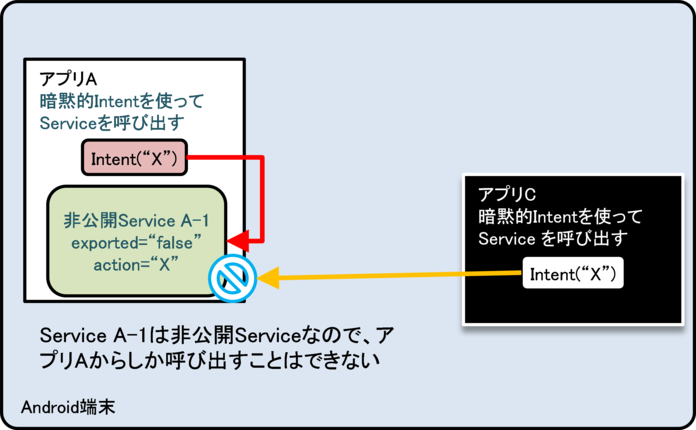{width="4.739583333333333in"
height="3.8020833333333335in"}

[]{#_Ref336007914 .anchor}図 4.4‑6

このように、Intent
Filterを用いた非公開Serviceの暗黙的Intent呼び出しは、意図せぬアプリの呼び出しや意図せぬアプリへのセンシティブな情報の送信を避けるためにも行うべきではない。

#### Serviceの実装方法について

Serviceの実装方法は多様であり、サンプルコードで分類したセキュリティ上のタイプとの相性もあるため簡単に特徴を示す。startServiceを利用する場合とbindServiceを利用する場合とに大きく分かれるが、startServiceとbindServiceの両方で利用できるServiceを作成することも可能である。Serviceの実装方法を決定するために、次のような項目について検討を行うことになる。

-   Serviceを別アプリに公開するか（Serviceの公開）

-   実行中にデータのやり取りを行うか(データの相互送受信)

-   Serviceを制御するか（起動や終了など）

-   別プロセスとして実行するか（プロセス間通信）

-   複数の処理を同時に行うか(並行処理)

実装方法の分類と各々の項目の実現の可否を表にすると、表
4.4‑3のようになる。×は実現不可能かもしくは提供される機能とは別の枠組みが必要な場合を表す。

[]{#_Ref338407990 .anchor}表 4.4‑3 Serviceの実装方法の分類

  ---------------------------------------------------------------------------------------------------
  分類               Serviceの公開   データの相互送受信   Serviceの制御   プロセス間通信   並行処理
                                                                                           
                                                          (起動・終了)                     
  ------------------ --------------- -------------------- --------------- ---------------- ----------
  startService型     ○               ×                    ○               ○                ×

  IntentService型    ○               ×                    ×               ○                ×

  local bind型       ×               ○                    ○               ×                ×

  Messenger bind型   ○               ○                    ○               ○                ×

  AIDL bind型        ○               ○                    ○               ○                ○
  ---------------------------------------------------------------------------------------------------

##### startService型

最も基本的なServiceである。Serviceクラスを継承し、onStartCommandで処理を行うServiceのことを指す。

利用する側は、Service
をIntentで指定してstartServiceを使用して呼び出す。Intentの送信元に対して、結果などのデータを直接返すことはできないため、Broadcastなど別の方法を組み合わせて実現する必要がある。具体的な実装例は、「4.4.1.1非公開Serviceを作る・利用する」を参照のこと。

セキュリティ上のチェックはonStartCommandで行う必要があるが、送信元のパッケージ名が取得できないためパートナー限定Serviceには使用できない。

##### IntentService型

IntentServiceはServiceを継承して作られているクラスである。呼び出し方は、startService型と同様である。通常のService（startService型）に比べて以下の特徴がある。

-   Intentの処理はonHandleIntentで行う。（onStartCommandは使わない）

-   別スレッドで実行される

-   処理がキューイングされる

処理が別スレッドのため呼び出しは即座に返され、キューイング機構によりシーケンシャルにIntentに対する処理が行われる。各Intentの並行処理はされないが、製品の要件によっては実装の簡素化の一つとして選択が可能である。Intentの送信元に対して、結果などのデータを直接返すことはできないため、Broadcastなど別の方法を組み合わせて実現する必要がある。具体的な実装例は、「4.4.1.2公開Serviceを作る・利用する」を参照のこと。

セキュリティ上のチェックはonHandleIntentで行う必要があるが、送信元のパッケージ名が取得できないためパートナー限定Serviceには使用できない。

##### local bind型

アプリと同じプロセス内でのみ動くローカルServiceを実装するための方法を指す。Binderクラスから派生したクラスを定義して、Serviceで実装した機能（メソッド）を呼び出し元に提供できるようにする。

利用する側は、Service
をIntentで指定してbindServiceを使用して呼び出す。Serviceをbindする方法の中では、最もシンプルな実装であるが、別プロセスでの起動やServiceの公開ができないため用途は限定される。具体的な実装例は、サンプルコードに含まれるプロジェクト「Service
PrivateServiceLocalBind」を参照のこと。

セキュリティ的には非公開Serviceのみ実装可能である。

##### Messenger bind型

Messengerの仕組みを利用してServiceとの連携を実現する方法を指す。

Serviceを利用する側からもMessageの返信先としてMessengerを渡すことができるため、双方でのデータのやり取りが比較的容易に実現可能である。また、処理はキューイングされるため、スレッドセーフに動作する特徴がある。各Messageの並行処理はされないが、製品の要件によっては実装の簡素化の一つとして選択が可能である。利用する側は、Service
をIntentで指定してbindServiceを使用して呼び出す。具体的な実装例は、「4.4.1.4自社限定Service」を参照のこと。

セキュリティ上のチェックはonBindやMessage
Handlerで行う必要があるが、送信元のパッケージ名が取得できないためパートナー限定Serviceには使用できない。

##### AIDL bind型

AIDLの仕組みを利用してServiceとの連携を実現する方法を指す。AIDLによってインターフェースを定義し、Serviceの持つ機能をメソッドとして提供する。また、AIDLで定義したインターフェースを利用側で実装することで、コールバックを実現することもできる。マルチスレッド呼び出しは可能だが、排他処理はされないのでService側で明示的に実装する必要がある。

利用する側は、Service
をIntentで指定してbindServiceを使用して呼び出す。具体的な実装例は、「4.4.1.3パートナー限定Service」を参照のこと。

セキュリティ上のチェックは自社限定ServiceではonBindで、パートナー限定ServiceではAIDLで定義したインターフェースの各メソッドで行う必要がある。本文書で分類した全セキュリティタイプのServiceに利用可能である。

SQLiteを使う
------------

本文書ではSQLiteを使用してデータベースの作成および操作を行う際にセキュリティ上で注意すべき点をまとめる。主なポイントは、データベースファイルのアクセス権の適切な設定と
SQL
インジェクションに対する対策である。ここでは、直接外部からデータベースファイルの読み書きを許す(複数アプリで共有する)ようなデータベースはここでは想定せずContent
Provider
のバックエンドやアプリ単体での使用を前提とする。また、ある程度センシティブな情報を扱っていることを想定しているが、そうでない場合も他アプリからの想定外の読み書きを避けるためにもここで挙げる対策を適用することをお勧めする。

### サンプルコード

#### データベースの作成と操作　

Androidのアプリでデータベースを扱う場合、SQLiteOpenHelperを使用することでデータベースファイルの適切な配置およびアクセス権の設定（他のアプリがアクセスできない設定）ができる[^10]。ここでは、アプリ起動時にデータベースを作成し、UI上からデータの検索・追加・変更・削除を行う簡単なアプリを例に、外部からの入力に対して不正なSQLが実行されないようにSQLインジェクション対策したサンプルコードを示す。

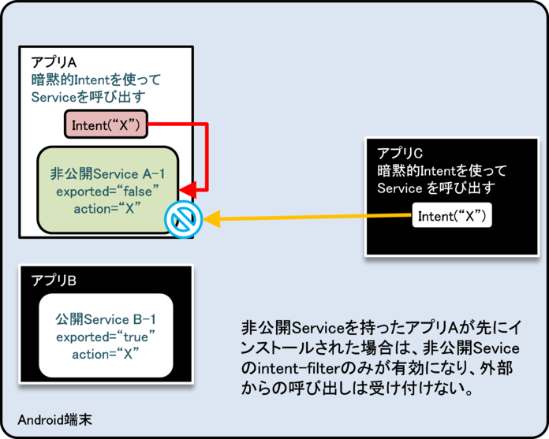{width="5.541666666666667in"
height="4.395833333333333in"}

図 4.5‑1

> ポイント：

1.  データベース作成にはSQLiteOpenHelperを使用する

&nbsp;
1.  SQLインジェクションの対策として入力値をSQL文に使用する場合にはプレースホルダを利用する

2.  SQLインジェクションの保険的な対策としてアプリ要件に従って入力値をチェックする

> SampleDbOpenHelper.java

package org.jssec.android.sqlite;

import android.content.Context;

import android.database.SQLException;

import android.database.sqlite.SQLiteDatabase;

import android.database.sqlite.SQLiteOpenHelper;

import android.util.Log;

import android.widget.Toast;

public class SampleDbOpenHelper extends SQLiteOpenHelper {

private SQLiteDatabase mSampleDb; //取り扱うデータを格納するデータベース

public static SampleDbOpenHelper newHelper(Context context)

{

//★ポイント1★ DB作成にはSQLiteOpenHelperを使用する

return new SampleDbOpenHelper(context);

}

public SQLiteDatabase getDb() {

return mSampleDb;

}

//WritableモードでDBを開く

public void openDatabaseWithHelper() {

try {

if (mSampleDb != null && mSampleDb.isOpen()) {

if (!mSampleDb.isReadOnly())// 既に読み書き可能でオープン済み

return;

mSampleDb.close();

}

mSampleDb = getWritableDatabase(); //この段階でオープンされる

} catch (SQLException e) {

//データベース構築に失敗した場合ログ出力

Log.e(mContext.getClass().toString(),
mContext.getString(R.string.DATABASE\_OPEN\_ERROR\_MESSAGE));

Toast.makeText(mContext, R.string.DATABASE\_OPEN\_ERROR\_MESSAGE,
Toast.LENGTH\_LONG).show();

}

}

//ReadOnlyモードでDBを開く

public void openDatabaseReadOnly() {

try {

if (mSampleDb != null && mSampleDb.isOpen()) {

if (mSampleDb.isReadOnly())// 既にReadOnlyでオープン済み

return;

mSampleDb.close();

}

SQLiteDatabase.openDatabase(mContext.getDatabasePath(CommonData.DBFILE\_NAME).getPath(),
null, SQLiteDatabase.OPEN\_READONLY);

} catch (SQLException e) {

//データベース構築に失敗した場合ログ出力

Log.e(mContext.getClass().toString(),
mContext.getString(R.string.DATABASE\_OPEN\_ERROR\_MESSAGE));

Toast.makeText(mContext, R.string.DATABASE\_OPEN\_ERROR\_MESSAGE,
Toast.LENGTH\_LONG).show();

}

}

//Database Close

public void closeDatabase() {

try {

if (mSampleDb != null && mSampleDb.isOpen()) {

mSampleDb.close();

}

} catch (SQLException e) {

//データベース構築に失敗した場合ログ出力

Log.e(mContext.getClass().toString(),
mContext.getString(R.string.DATABASE\_CLOSE\_ERROR\_MESSAGE));

Toast.makeText(mContext, R.string.DATABASE\_CLOSE\_ERROR\_MESSAGE,
Toast.LENGTH\_LONG).show();

}

}

//Contextを覚えておく

private Context mContext;

//テーブル作成コマンド

private static final String CREATE\_TABLE\_COMMANDS

= "CREATE TABLE " + CommonData.TABLE\_NAME + " ("

+ "\_id INTEGER PRIMARY KEY AUTOINCREMENT, "

+ "idno INTEGER UNIQUE, "

+ "name VARCHAR(" + CommonData.TEXT\_DATA\_LENGTH\_MAX + ") NOT NULL, "

+ "info VARCHAR(" + CommonData.TEXT\_DATA\_LENGTH\_MAX + ")"

+ ");";

public SampleDbOpenHelper(Context context) {

super(context, CommonData.DBFILE\_NAME, null, CommonData.DB\_VERSION);

mContext = context;

}

@Override

public void onCreate(SQLiteDatabase db) {

try {

db.execSQL(CREATE\_TABLE\_COMMANDS); //DB構築コマンドの実行

} catch (SQLException e) {

//データベース構築に失敗した場合ログ出力

Log.e(this.getClass().toString(),
mContext.getString(R.string.DATABASE\_CREATE\_ERROR\_MESSAGE));

}

}

@Override

public void onUpgrade(SQLiteDatabase arg0, int arg1, int arg2) {

//
データベースのバージョンアップ時に実行される、データ移行などの処理を記述する

}

}

> DataSearchTask.java （SQLite Databaseプロジェクト）

package org.jssec.android.sqlite.task;

import org.jssec.android.sqlite.CommonData;

import org.jssec.android.sqlite.DataValidator;

import org.jssec.android.sqlite.MainActivity;

import org.jssec.android.sqlite.R;

import android.database.Cursor;

import android.database.SQLException;

import android.database.sqlite.SQLiteDatabase;

import android.os.AsyncTask;

import android.util.Log;

//データ検索タスク

public class DataSearchTask extends AsyncTask&lt;String, Void,
Cursor&gt; {

private MainActivity mActivity;

private SQLiteDatabase mSampleDB;

public DataSearchTask(SQLiteDatabase db, MainActivity activity) {

mSampleDB = db;

mActivity = activity;

}

@Override

protected Cursor doInBackground(String... params) {

String idno = params\[0\];

String name = params\[1\];

String info = params\[2\];

String cols\[\] = {"\_id", "idno","name","info"};

Cursor cur;

//★ポイント3★ アプリ要件に従って入力値をチェックする

if (!DataValidator.validateData(idno, name, info))

{

return null;

}

//引数が全部nullだったら全件検索する）

if ((idno == null || idno.length() == 0) &&

(name == null || name.length() == 0) &&

(info == null || info.length() == 0) ) {

try {

cur = mSampleDB.query(CommonData.TABLE\_NAME, cols, null, null, null,
null, null);

} catch (SQLException e) {

Log.e(DataSearchTask.class.toString(),
mActivity.getString(R.string.SEARCHING\_ERROR\_MESSAGE));

return null;

}

return cur;

}

//Noが指定されていたらNoで検索

if (idno != null && idno.length() &gt; 0) {

String selectionArgs\[\] = {idno};

try {

//★ポイント2★ プレースホルダを使用する

cur = mSampleDB.query(CommonData.TABLE\_NAME, cols, "idno = ?",
selectionArgs, null, null, null);

} catch (SQLException e) {

Log.e(DataSearchTask.class.toString(),
mActivity.getString(R.string.SEARCHING\_ERROR\_MESSAGE));

return null;

}

return cur;

}

//Nameが指定されていたらNameで完全一致検索

if (name != null && name.length() &gt; 0) {

String selectionArgs\[\] = {name};

try {

//★ポイント2★ プレースホルダを使用する

cur = mSampleDB.query(CommonData.TABLE\_NAME, cols, "name = ?",
selectionArgs, null, null, null);

} catch (SQLException e) {

Log.e(DataSearchTask.class.toString(),
mActivity.getString(R.string.SEARCHING\_ERROR\_MESSAGE));

return null;

}

return cur;

}

//それ以外の場合はinfoを条件にして部分一致検索

String argString = info.replaceAll("@", "@@");
//入力として受け取ったinfo内の\$をエスケープ

argString = argString.replaceAll("%", "@%");
//入力として受け取ったinfo内の%をエスケープ

argString = argString.replaceAll("\_", "@\_");
//入力として受け取ったinfo内の\_をエスケープ

String selectionArgs\[\] = {argString};

try {

//★ポイント2★ プレースホルダを使用する

cur = mSampleDB.query(CommonData.TABLE\_NAME, cols, "info LIKE '%' || ?
|| '%' ESCAPE '@'", selectionArgs, null, null, null);

} catch (SQLException e) {

Log.e(DataSearchTask.class.toString(),
mActivity.getString(R.string.SEARCHING\_ERROR\_MESSAGE));

return null;

}

return cur;

}

@Override

protected void onPostExecute(Cursor resultCur) {

mActivity.updateCursor(resultCur);

}

}

> DataValidator.java

package org.jssec.android.sqlite;

public class DataValidator {

//入力値をチェックする

//数字チェック

public static boolean validateNo(String idno) {

//null、空文字はOK

if (idno == null || idno.length() == 0) {

return true;

}

//数字であることを確認する

try {

if (!idno.matches("\[1-9\]\[0-9\]\*")) {

//数字以外の時はエラー

return false;

}

} catch (NullPointerException e) {

//エラーを検出した

return false;

}

return true;

}

// 文字列の長さを調べる

public static boolean validateLength(String str, int max\_length) {

//null、空文字はOK

if (str == null || str.length() == 0) {

return true;

}

//文字列の長さがMAX以下であることを調べる

try {

if (str.length() &gt; max\_length) {

//MAXより長い時はエラー

return false;

}

} catch (NullPointerException e) {

//バグ

return false;

}

return true;

}

// 入力値チェック

public static boolean validateData(String idno, String name, String
info) {

if (!validateNo(idno)) {

return false;

}

if (!validateLength(name, CommonData.TEXT\_DATA\_LENGTH\_MAX)) {

return false;

}else if (!validateLength(info, CommonData.TEXT\_DATA\_LENGTH\_MAX)) {

return false;

}

return true;

}

}

### ルールブック

SQLiteを使用する際には以下のルールを守ること。

1.  DBファイルの配置場所、アクセス権を正しく設定する （必須）

&nbsp;
1.  他アプリとDBデータを共有する場合はContent Providerでアクセス制御する
    > （必須）

2.  DB 操作時に可変パラメータを扱う場合はプレースホルダを使用する
    > （必須）

[]{#_Ref321340134 .anchor}

#### DBファイルの配置場所、アクセス権を正しく設定する （必須）

DBファイルのデータの保護を考えた場合、DBファイルの配置場所とアクセス権の設定は合わせて考慮すべき重要な要素である。

例えば、ファイルのアクセス権を正しく設定したつもりでも、SD
カードなどアクセス権の設定を行えない場所に配置している場合には、誰からでもアクセス可能なDBファイルになってしまう。また、アプリディレクトリに配置した場合でも、アクセス権を正しく設定しないと意図しないアクセスを許してしまうことになる。ここでは、配置場所とアクセス権設定について守るべき点を挙げた後、それを実現するための方法について説明する。

まず配置場所とアクセス権設定については、DBファイル(データ)を保護する観点から考えると、以下の2点を実施する必要がある。

1\. 配置場所

> Context\#getDatabasePath(String
> name)で取得できるファイルパスや場合によってはContext\#getFilesDir
> で取得できるディレクトリの場所に配置する[^11]

2\. アクセス権

MODE\_PRIVATE（=ファイルを作成したアプリのみがアクセス可能）モードに設定する

この2点を実施することで、他のアプリからアクセスできないDBファイルの作成を行うことができる。これらを実施するためには以下の方法が挙げられる。

1\. SQLiteOpenHelperを使用する

2\. Context\#openOrCreateDatabaseを使用する

DBファイルの作成に際しては、SQLiteDatabase\#openOrCreateDatabaseを使用することもできる。しかし、このメソッドを使用した場合、Androidスマートフォンの機種によっては、他のアプリから読み取り可能なDBファイルが作成されることが分かっている。そのため、このメソッドの使用は避けて、他の方法を利用することを推奨する。上に挙げた2つの方法について、それぞれの特徴を以下で説明する。

##### SQLiteOpenHelperを使用する

SQLiteOpenHelperを使用する場合、開発者はあまり多くのことを考えなくてもよい。SQLiteOpenHelperを派生したクラスを作成し、コンストラクタの引数にDBの名前（ファイル名に使われる）[^12]を指定すれば、自動的に上記のセキュリティ要件を満たすDBファイルを作成してくれる。

「4.5.1.1
データベースの作成と操作」に具体的な使用方法を示しているので参照すること。

##### Context\#openOrCreateDatabaseを使用する

Context\#openOrCreateDatabaseメソッドを使用してDBの作成を行う場合、ファイルのアクセス権をオプションで指定する必要があり、明示的にMODE\_PRIVATEを指定する。

ファイルの配置に関しては、DB名（ファイル名に使用される）の指定をSQLiteOpenHelperと同様に行えるので、自動的に前述のセキュリティ要件を満たすファイルパスにファイルが作成される。ただし、フルパスも指定できるのでSDカードなどを指定した場合、MODE\_PRIVATEを指定しても他アプリからアクセス可能になってしまうため注意が必要である。

> DBに対して明示的にアクセス許可設定を行う例：MainActivity.java

public void onCreate(Bundle savedInstanceState) {

super.onCreate(savedInstanceState);

setContentView(R.layout.main);

//データベースの構築

try {

//MODE\_PRIVATEを設定してDBを作成

db = Context.openOrCreateDatabase("Sample.db",

MODE\_PRIVATE, null);

} catch (SQLException e) {

//データベース構築に失敗した場合ログ出力

Log.e(this.getClass().toString(),
getString(R.string.DATABASE\_OPEN\_ERROR\_MESSAGE));

return;

}

//省略 その他の初期化処理

}

なお、アクセス権の設定はMODE\_PRIVATE
と合わせて以下の3種類があり、MODE\_WORLD\_READABLEとMODE\_WORLD\_WRITEABLEはOR演算で同時指定することもできる。ただし、MODE\_PRIVATE以外はAPI
Level 17以降ではdeprecatedとなっており、API Level 24
以降ではセキュリティ例外が発生する。API Level
15以降を対象とする場合でも、通常はこのフラグを使用しないことが望ましい[^13]。

-   MODE\_PRIVATE 作成アプリのみ読み書き可能

-   MODE\_WORLD\_READABLE 作成アプリは読み書き可能、他は読み込みのみ

-   MODE\_WORLD\_WRITEABLE 作成アプリは読み書き可能、他は書き込みのみ

#### 他アプリとDBデータを共有する場合はContent Providerでアクセス制御する （必須）

他のアプリとDBデータを共有する手段として、DBファイルをWORLD\_READABLE、WORLD\_WRITABLEとして作成し、他のアプリから直接アクセスできるようにするという方法がある。しかし、この方法ではDBにアクセスするアプリやDBへの操作を制限できないため、意図しない相手（アプリ）にデータを読み書きされることもある。結果として、データの機密性や整合性に問題が生じたり、マルウェアの攻撃対象となったりする可能性も考えられる。

以上のことから、AndroidにおいてDBデータを他のアプリと共有する場合は、Content
Providerを使うことを強くお勧めする。Content
Providerを使うことにより、DBに対するアクセス制御を実現できるというセキュリティの観点からのメリットだけでなく、DBスキーマ構造をContent
Provider内に隠ぺいできるといった設計観点のメリットもある。

#### DB 操作時に可変パラメータを扱う場合はプレースホルダを使用する （必須）

SQLインジェクションを防ぐという意味で、任意の入力値を　SQL文に組み込む時はプレースホルダを使用するべきである。プレースホルダを使用したSQLの実行方法としては以下の2つの方法を挙げることができる。

1.  SQLiteDatabase\#compileStatement()を使用して SQLiteStatement
    を取得する。その後、
    SQLiteStatement\#bindString()、bindLong()などを使用してパラメータをプレースホルダに配置する

2.  SQLiteDatabeseクラスのexecSQL()、insert()、update()、delete()、query()、rawQuery()、replace()などを呼び出す際にプレースホルダを持ったSQL文を使用する

なお、SQLiteDatabase\#compileStatement()を使用して、SELECT
コマンドを実行する場合、

「SELECTコマンドの結果として先頭の1要素(1行1列目)しか取得できない」

という制限があるので用途が限られる。

どちらの方式を使う場合でも、プレースホルダに与えるデータの内容は事前にアプリ要件に従ってチェックされていることが望ましい。以下で、それぞれの方法について説明する。

##### SQLiteDatabase\#compileStatement()を使用する場合：

以下の手順でプレースホルダへデータを渡す。

1.  SQLiteDatabase\#compileStatement()を使用してプレースホルダを含んだSQL文をSQLiteStatementとして取得する。

2.  作成したSQLiteStatementオブジェクトに対して、bindLong()、bindString()などのメソッドを使用してプレースホルダに設定する。

3.  SQLiteStatementオブジェクトのexecute()などのメソッドによってSQLを実行する。

> プレースホルダ使用例：DataInsertTask.java（抜粋）

//データ追加タスク

public class DataInsertTask extends AsyncTask&lt;String, Void, Void&gt;
{

private MainActivity mActivity;

private SQLiteDatabase mSampleDB;

public DataInsertTask(SQLiteDatabase db, MainActivity activity) {

mSampleDB = db;

mActivity = activity;

}

@Override

protected Void doInBackground(String... params) {

String idno = params\[0\];

String name = params\[1\];

String info = params\[2\];

//★ポイント3★ アプリケーション要件に従って入力値をチェックする

if (!DataValidator.validateData(idno, name, info))

{

return null;

}

//データ追加処理

//プレースホルダを使用する

String commandString = "INSERT INTO " + CommonData.TABLE\_NAME + "
(idno, name, info) VALUES (?, ?, ?)";

SQLiteStatement sqlStmt = mSampleDB.compileStatement(commandString);

sqlStmt.bindString(1, idno);

sqlStmt.bindString(2, name);

sqlStmt.bindString(3, info);

try {

sqlStmt.executeInsert();

} catch (SQLException e) {

Log.e(DataInsertTask.class.toString(),
mActivity.getString(R.string.UPDATING\_ERROR\_MESSAGE));

} finally {

sqlStmt.close();

}

return null;

}

～省略～

}

あらかじめ実行するSQL文をオブジェクトとして作成しておきパラメータを当てはめる形である。実行する処理が確定しているので、SQLインジェクションが発生する余地はない。また、SQLiteStatementオブジェクトを再利用することで処理効率を高めることができるというメリットもある。

##### SQLiteDatabaseが提供する各処理用のメソッドを使用する場合：

SQLiteDatabaseが提供するDB操作メソッドには、SQL文を使用するものとそうでないものがある。SQL文を使用するメソッドにSQLiteDatabase\#
execSQL()/rawQuery()などがあり、以下の手順で実行する。

1.  プレースホルダを含んだSQL文を用意する。

2.  プレースホルダに割り当てるデータを作成する。

3.  SQL文とデータを引数として渡して処理用メソッドを実行する。

一方、SQL文を使用しないメソッドには、SQLiteDatabase\#insert()/update()/delete()/query()/replace()などがある。これらを使用する場合には、以下の手順でデータを渡す。

1.  DBに対して挿入/更新するデータがある場合には、ContentValuesに登録する。

2.  ContentValuesを引数として渡して、各処理用メソッド（以下の例ではSQLiteDatabase\#insert()）を実行する。

> 各処理用メソッド（SQLiteDatabase\#insert()）を使用する例

private SQLiteDatabase mSampleDB;

private void addUserData(String idno, String name, String info) {

//値の妥当性（型、範囲）チェック、エスケープ処理

if (!validateInsertData(idno, name, info)) {

//バリデーションを通過しなかった場合、ログ出力

Log.e(this.getClass().toString(),
getString(R.string.VALIDATION\_ERROR\_MESSAGE));

return

}

//挿入するデータの準備

ContentValues insertValues = new ContentValues();

insertValues.put("idno", idno);

insertValues.put("name", name);

insertValues.put("info", info);

//Insert実行

try {

mSampleDb.insert("SampleTable", null, insertValues);

} catch (SQLException e) {

Log.e(this.getClass().toString(),
getString(R.string.DB\_INSERT\_ERROR\_MESSAGE));

return;

}

}

この例では、SQLコマンドを直接記述せず、SQLiteDatabaseが提供する挿入用のメソッドを使用している。SQLコマンドを直接使用しないため、この方法もSQLインジェクションの余地はないと言える。

### アドバンスト

#### SQL文のLIKE述語でワイルドカードを使用する際にエスケープ処理を施す

LIKE述語のワイルドカード（%、\_）を含む文字列をプレースホルダの入力値として使用した場合、そのままだとワイルドカードとして機能するため、必要に応じて事前にエスケープ処理を施す必要がある。必要なケースとしてはワイルドカードを単体の文字（"%"や"\_"）として扱いたい場合が当てはまる。

実際のエスケープ処理は、以下のサンプルコードのようにESCAPE句を使用して行うことができる。

> LIKEを利用した場合のエスケープ処理の例

//データ検索タスク

public class DataSearchTask extends AsyncTask&lt;String, Void,
Cursor&gt; {

private MainActivity mActivity;

private SQLiteDatabase mSampleDB;

private ProgressDialog mProgressDialog;

public DataSearchTask(SQLiteDatabase db, MainActivity activity) {

mSampleDB = db;

mActivity = activity;

}

@Override

protected Cursor doInBackground(String... params) {

String idno = params\[0\];

String name = params\[1\];

String info = params\[2\];

String cols\[\] = {"\_id", "idno","name","info"};

Cursor cur;

～省略～

//infoを条件にしてlike検索（部分一致）

//ポイント：ワイルドカードに相当する文字はエスケープ処理する

String argString = info.replaceAll("@", "@@");
//入力として受け取ったinfo内の\$をエスケープ

argString = argString.replaceAll("%", "@%");
//入力として受け取ったinfo内の%をエスケープ

argString = argString.replaceAll("\_", "@\_");
//入力として受け取ったinfo内の\_をエスケープ

String selectionArgs\[\] = {argString};

try {

//ポイント：プレースホルダを使用する

cur = mSampleDB.query("SampleTable", cols, "info LIKE '%' || ? || '%'
ESCAPE '@'",

selectionArgs, null, null, null);

} catch (SQLException e) {

Toast.makeText(mActivity, R.string.SERCHING\_ERROR\_MESSAGE,
Toast.LENGTH\_LONG).show();

return null;

}

return cur;

}

@Override

protected void onPostExecute(Cursor resultCur) {

mProgressDialog.dismiss();

mActivity.updateCursor(resultCur);

}

}

#### プレースホルダを使用できないSQLコマンドに対して外部入力を使う

テーブルの作成や削除などのDBオブジェクトを処理対象としたSQL文を実行する場合、テーブル名などの値に対してプレースホルダを使うことはできない。基本的には、プレースホルダの使用できない値に対して、外部から入力された任意の文字列を使用するようなデータベースの設計はすべきでない。

仕様や機能上の制限でプレースホルダを使用できない場合は、入力値に危険が無いかどうか実行前に確認し、必要な処理を施すことが必須となる。

基本的には、

1.  文字列パラメータとして使用する場合、文字のエスケープやクォート処理を施す

2.  数値パラメータとして使用する場合、数字以外の文字が混入していないことを確認する

3.  識別子、コマンドとして使用する場合、1．に加え、使用できない文字が含まれていないことを確認する

を実施する。

> 参照：
> [*http://www.ipa.go.jp/security/vuln/documents/website\_security\_sql.pdf*](http://www.ipa.go.jp/security/vuln/documents/website_security_sql.pdf)

#### 不用意にデータベースの書き換えが行われないための対策を行う

SQLiteOpenHelper\#getReadableDatabase、getWritableDatabaseを使用してDBのインスタンスを取得した場合、どちらのメソッドを利用してもDBは読み書き可能な状態でオープンされる[^14]。また、Context\#openOrCreateDatabase、SQLiteDatabase\#openOrCreateDatabaseなども同様である。

これは、アプリ操作や実装の不具合により意図せずDBの中身を書き換えてしまう（書き換えられてしまう）可能性を意味している。基本的にはアプリの仕様と実装の範囲で対応できると考えられるが、アプリの検索機能など、読み取りしか必要のない機能を実装する場合は、データベースを読み取り専用でオープンすることで、設計や検証の簡素化ひいてはアプリ品質の向上に繋がる場合があるので、状況に応じて検討をお勧めする。

具体的には、SQLiteDatabase\#openDatabaseにOPEN\_READONLYを指定してデータベースをオープンする。

> 読み取り専用でデータベースをオープンする

～省略～

// データベースのオープン(データベースは作成済みとする)

SQLiteDatabase db

=
SQLiteDatabase.openDatabase(SQLiteDatabase.getDatabasePath("Sample.db"),
null, OPEN\_READONLY);

> 参照：[*http://developer.android.com/reference/android/database/sqlite/SQLiteOpenHelper.html
> -
> getReadableDatabase()*](http://developer.android.com/reference/android/database/sqlite/SQLiteOpenHelper.html#getReadableDatabase())

#### アプリの要件に従ってDBの入出力データの妥当性をチェックする

SQLiteは型に寛容なデータベースであり、DB上でIntegerとして宣言されているカラムに対して文字型のデータを格納することが可能である。DB内のデータは、数値型を含む全てのデータが平文の文字データとしてDB内に格納されている。このため、Integer型のカラムに対して文字列型の検索（　LIKE
‘%123%’ など）を行うことも可能である。また、VARCHAR(100)
のようにデータの最大長を記述してもそれ以上の長さのデータが入力可能であるなど、SQLiteでの値の制限（正当性確認）は期待できない。

このため、SQLiteを使用するアプリは、このようなDBの特性に注意して予期せぬデータをDBに格納したり取得したりしないようにアプリの要件に従って対処する必要がある。対処の方法としては次の2つがある。

1.  データをデータベースに格納する際、型や長さなどの条件が一致しているか確認する

2.  データベースから値を取得した際、データが想定外の型や長さでないか確認する

以下では、例として入力値が1以上の数字であることを検証するコードを示す。

> 例：入力データが1以上の数字であることを確認する（MainActivity.javaより抜粋）

public class MainActivity extends Activity {

～省略～

//追加処理

private void addUserData(String idno, String name, String info) {

//Noのチェック

if (!validateNo(idno, CommonData.REQUEST\_NEW)) {

return;

}

//データ追加処理

DataInsertTask task = new DataInsertTask(mSampleDb, this);

task.execute(idno, name, info);

}

～省略～

private boolean validateNo(String idno, int request) {

if (idno == null || idno.length() == 0) {

if (request == CommonData.REQUEST\_SEARCH) {

//検索処理の時は未指定をOKにする

return true;

} else {

//検索処理以外の時はnull、空文字はエラー

Toast.makeText(this, R.string.IDNO\_EMPTY\_MESSAGE,
Toast.LENGTH\_LONG).show();

return false;

}

}

//数字であることを確認する

try {

// 1以上の値

if (!idno.matches("\[1-9\]\[0-9\]\*")) {

//数字以外の時はエラー

Toast.makeText(this, R.string.IDNO\_NOT\_NUMERIC\_MESSAGE,
Toast.LENGTH\_LONG).show();

return false;

}

} catch (NullPointerException e) {

//今回のケースではあり得ない

return false;

}

return true;

}

～省略～

}

#### DBに格納するデータについての考察

SQLiteでは、データをファイルに格納する際に以下のような実装になっている。

-   数値型を含む全てのデータが平文の文字データとしてDBファイル内に格納される

-   DBに対してデータの削除を行ってもデータ自体はDBファイルから削除されない（削除マークが付くのみ）

-   データを更新した場合もDBファイル内には更新前のデータも削除されず残っている

よって、削除された「はず」の情報がDBファイル内に残ったままの状態になっている可能性がある。この場合でも、本文書に従って対策を施し、Android
のセキュリティ機能が有効であれば、他アプリを含む第三者からデータ・ファイルに直接アクセスされる心配はない。ただし、root権限を奪取されるなどAndroidの保護機構を迂回してファイルを抜き出される可能性を考えると、ビジネスに大きな影響を与えるデータが格納されている場合には、Android保護機構に頼らないデータ保護も検討しなければならない。

これらの理由により、端末のroot権限が奪取された場合でも守る必要があるような重要なデータはSQLiteのDBにそのまま格納すべきではない。どうしても重要なデータを格納せざるを得ない場合には暗号化したデータを格納する、DB全体を暗号化する、などの対策が必要となる。

実際に暗号化が必要な場合、暗号化に使う鍵の扱いやコードの難読化など本文書の範囲を超える課題が多いので、現時点でビジネスインパクトの大きなデータを扱うアプリの開発には専門家への相談をお勧めする。

参考として「4.5.3.6 \[参考\]SQLiteデータベースを暗号化する(SQLCipher for
Android)」に、データベースを暗号化するライブラリを紹介しておく。

#### \[参考\]SQLiteデータベースを暗号化する(SQLCipher for Android)

SQLCipherは、データベースファイルの透過的な256ビットAESの暗号化を提供するSQLite拡張である。現在は、オープンソース(BSDライセンス)化され、Zetetic
LLCによって維持・管理されている。モバイルの世界では、SQLCipherは、ノキア/QT
、アップルのiOSで広く使用されている。

SQLCipher for
Androidプロジェクトは、Android環境におけるSQLiteデータベースの標準の統合化された暗号化をサポートすることを目的としている。標準のSQLiteのAPIをSQLCipher用に作成することで、開発者は通常と同じコーディングで暗号化されたデータベースを利用できるようになっている。

参照：[*https://guardianproject.info/code/sqlcipher/*](https://guardianproject.info/code/sqlcipher/)

##### 使い方

アプリ開発者は以下の３つの作業をすることでSQLCipherの利用が可能になる。

1.  アプリの lib ディレクトリに sqlcipher.jar
    および、libdatabase\_sqlcipher.so、libsqlcipher\_android.so、libstlport\_shared.soを配置する。

2.  全てのソースファイルについて、import で指定されている
    android.database.sqlite.\*
    を全てinfo.guardianproject.database.sqlite.\*
    に変更する。なお、android.database.Cursorはそのまま使用可能である。

3.  onCreate()の中でデータベースを初期化し、データベースをオープンする際にパスワードを設定する。

> 簡単なコード例

SQLiteDatabase.loadLibs(this); //まず
ライブラリをContextを使用して初期化する

SQLiteOpenHelper.getWritableDatabase(passwoed):
//引数はパスワード（String型 セキュアに取得したものと仮定）

SQLCipher for
Androidは執筆時点でバージョン1.1.0であり、2.0.0版が開発進行中でRC4が公開されている状況である。Android
における使用実績やAPIの安定性という点で今後検証が必要となるが、現時点でAndroidで利用可能なSQLiteの暗号化ソリューションとして検討する余地はある。

##### ライブラリ構成

SQLCipherを使用するためにはSDKとして含まれている以下のファイルが必要となる。

-   assets/icudt46l.zip 2,252KB

> 端末の /system/usr/icu/
> 以下にicudt46l.datが存在しない場合に必要となる。
>
> icudt46l.datが見つからない場合、このzipが解凍されて使用される。

-   libs/armeabi/libdatabase\_sqlcipher.so 44KB

-   libs/armeabi/libsqlcipher\_android.so 1,117KB

-   libs/armeabi/libstlport\_shared.so 555KB

> Nativeライブラリ。
>
> SQLCipherの初期ロード時（SQLiteDatabase\#loadLibs()呼び出し時）に読み込まれる。

-   libs/commons-codec.jar 46KB

-   libs/guava-r09.jar 1,116KB

-   libs/sqlcipher.jar 102KB

> Nativeライブラリを呼び出すJavaライブラリ。
>
> sqlcipher.jarがメイン。あとはsqlcipher.jarから参照されている。

合計：約5.12MB

ただし、icudt46l.zipは解凍されると7MB程度になる。

ファイルを扱う
--------------

Androidのセキュリティ設計思想に従うと、ファイルは情報を永続化又は一時保存(キャッシュ)する目的にのみ利用し、原則非公開にするべきである。アプリ間の情報交換はファイルを直接アクセスさせるのではなく、ファイル内の情報をContent
ProviderやServiceといったアプリ間連携の仕組みによって交換するべきである。これによりアプリ間のアクセス制御も実現できる。

SDカード等の外部記憶デバイスは十分なアクセス制御ができないため、容量の大きなファイルを扱う場合や別の場所(PCなど)への情報の移動目的など、機能上どうしても必要な場合のみに使用を限定するべきである。基本的に外部記憶デバイス上にはセンシティブな情報を含んだファイルを配置してはならない。もしセンシティブな情報を外部記憶デバイス上のファイルに保存しなければならない場合は暗号化等の対策が必要になるが、ここでは言及しない。

### サンプルコード

前述のようにファイルは原則非公開にするべきである。しかしながらさまざまな事情によって、他のアプリにファイルを直接読み書きさせるべきときもある。セキュリティの観点から分類したファイルの種類と比較を表
4.6‑1に示す。ファイルの格納場所や他アプリへのアクセス許可の組み合わせにより4種類のファイルに分類している。以降ではこのファイルの分類ごとにサンプルコードを示し説明を加えていく。

[]{#_Ref338972309 .anchor}表
4.6‑1　セキュリティ観点によるファイルの分類と比較

  -----------------------------------------------------------------------------------------------------------------------------------------------------
  ファイルの分類         他アプリへのアクセス許可   格納場所                     概要
  ---------------------- -------------------------- ---------------------------- ----------------------------------------------------------------------
  非公開ファイル         なし                       アプリディレクトリ内         -   アプリ内でのみ読み書きできる。
                                                                                 
                                                                                 -   センシティブな情報を扱うことができる。
                                                                                 
                                                                                 -   ファイルは原則このタイプにするべき。
                                                                                 

  読み取り公開ファイル   読み取り                   アプリディレクトリ内         -   他アプリおよびユーザーも読み取り可能。
                                                                                 
                                                                                 -   アプリ外部に公開（閲覧）可能な情報を扱う。
                                                                                 

  読み書き公開ファイル   読み取り                   アプリディレクトリ内         -   他アプリおよびユーザーも読み書き可能。
                                                                                 
                         書き込み                                                -   セキュリティの観点からもアプリ設計の観点からも使用は避けるべき。
                                                                                 

  外部記憶ファイル       読み取り                   SDカードなどの外部記憶装置   -   アクセス権のコントロールができない。
                                                                                 
  (読み書き公開)         書き込み                                                -   他アプリやユーザーによるファイルの読み書き・削除が常に可能。
                                                                                 
                                                                                 -   使用は必要最小限にするべき。
                                                                                 
                                                                                 -   比較的容量の大きなファイルを扱うことができる。
                                                                                 
  -----------------------------------------------------------------------------------------------------------------------------------------------------

#### 非公開ファイルを扱う

同一アプリ内でのみ読み書きされるファイルを扱う場合であり、安全なファイルの使い方である。ファイルに格納する情報が公開可能かどうかに関わらず、できるだけファイルは非公開の状態で保持し、他アプリとの必要な情報のやり取りは別のAndroidの仕組み（Content
Provider、Service)を利用して行うことを原則とする。

> ポイント：

1.  ファイルは、アプリディレクトリ内に作成する

&nbsp;
1.  ファイルのアクセス権は、他のアプリが利用できないようにプライベートモードにする

2.  センシティブな情報を格納することができる

3.  ファイルに格納する(された)情報に対しては、その入手先に関わらず内容の安全性を確認する

> PrivateFileActivity.java

package org.jssec.android.file.privatefile;

import java.io.File;

import java.io.FileInputStream;

import java.io.FileNotFoundException;

import java.io.FileOutputStream;

import java.io.IOException;

import android.app.Activity;

import android.os.Bundle;

import android.view.View;

import android.widget.TextView;

public class PrivateFileActivity extends Activity {

private TextView mFileView;

private static final String FILE\_NAME = "private\_file.dat";

@Override

public void onCreate(Bundle savedInstanceState) {

super.onCreate(savedInstanceState);

setContentView(R.layout.file);

mFileView = (TextView) findViewById(R.id.file\_view);

}

/\*\*

\* ファイルの作成処理

\*

\* @param view

\*/

public void onCreateFileClick(View view) {

FileOutputStream fos = null;

try {

// ★ポイント1★ ファイルは、アプリディレクトリ内に作成する

// ★ポイント2★
ファイルのアクセス権は、他のアプリが利用できないようにプライベートモードにする

fos = openFileOutput(FILE\_NAME, MODE\_PRIVATE);

// ★ポイント3★ センシティブな情報を格納することができる

// ★ポイント4★
ファイルに格納する情報に対しては、その入手先に関わらず内容の安全性を確認する

// サンプルにつき割愛。「3.2 入力データの安全性を確認する」を参照。

fos.write(new String("センシティブな情報(File
Activity)\\n").getBytes());

} catch (FileNotFoundException e) {

mFileView.setText(R.string.file\_view);

} catch (IOException e) {

android.util.Log.e("PrivateFileActivity",
"ファイルの作成に失敗しました");

} finally {

if (fos != null) {

try {

fos.close();

} catch (IOException e) {

android.util.Log.e("PrivateFileActivity",
"ファイルの終了に失敗しました");

}

}

}

finish();

}

/\*\*

\* ファイルの読み込み処理

\*

\* @param view

\*/

public void onReadFileClick(View view) {

FileInputStream fis = null;

try {

fis = openFileInput(FILE\_NAME);

byte\[\] data = new byte\[(int) fis.getChannel().size()\];

fis.read(data);

String str = new String(data);

mFileView.setText(str);

} catch (FileNotFoundException e) {

mFileView.setText(R.string.file\_view);

} catch (IOException e) {

android.util.Log.e("PrivateFileActivity",
"ファイルの読込に失敗しました");

} finally {

if (fis != null) {

try {

fis.close();

} catch (IOException e) {

android.util.Log.e("PrivateFileActivity",
"ファイルの終了に失敗しました");

}

}

}

}

/\*\*

\* ファイルの削除処理

\*

\* @param view

\*/

public void onDeleteFileClick(View view) {

File file = new File(this.getFilesDir() + "/" + FILE\_NAME);

file.delete();

mFileView.setText(R.string.file\_view);

}

}

> PrivateUserActivity.java

package org.jssec.android.file.privatefile;

import java.io.FileInputStream;

import java.io.FileNotFoundException;

import java.io.FileOutputStream;

import java.io.IOException;

import android.app.Activity;

import android.content.Intent;

import android.os.Bundle;

import android.view.View;

import android.widget.TextView;

public class PrivateUserActivity extends Activity {

private TextView mFileView;

private static final String FILE\_NAME = "private\_file.dat";

@Override

public void onCreate(Bundle savedInstanceState) {

super.onCreate(savedInstanceState);

setContentView(R.layout.user);

mFileView = (TextView) findViewById(R.id.file\_view);

}

private void callFileActivity() {

Intent intent = new Intent();

intent.setClass(this, PrivateFileActivity.class);

startActivity(intent);

}

/\*\*

\* ファイルActivityの呼び出し処理

\*

\* @param view

\*/

public void onCallFileActivityClick(View view) {

callFileActivity();

}

/\*\*

\* ファイルの読み込み処理

\*

\* @param view

\*/

public void onReadFileClick(View view) {

FileInputStream fis = null;

try {

fis = openFileInput(FILE\_NAME);

byte\[\] data = new byte\[(int) fis.getChannel().size()\];

fis.read(data);

// ★ポイント4★
ファイルに格納された情報に対しては、その入手先に関わらず内容の安全性を確認する

// サンプルにつき割愛。「3.2 入力データの安全性を確認する」を参照。

String str = new String(data);

mFileView.setText(str);

} catch (FileNotFoundException e) {

mFileView.setText(R.string.file\_view);

} catch (IOException e) {

android.util.Log.d("PrivateFileActivity",
"ファイルの読込に失敗しました");

} finally {

if (fis != null) {

try {

fis.close();

} catch (IOException e) {

android.util.Log.d("PrivateFileActivity",
"ファイルの終了に失敗しました");

}

}

}

}

/\*\*

\* ファイルの追記処理

\*

\* @param view

\*/

public void onWriteFileClick(View view) {

FileOutputStream fos = null;

try {

// ★ポイント1★ ファイルは、アプリケーションディレクトリ内に作成する

// ★ポイント2★
ファイルのアクセス権は、他のアプリが利用できないようにプライベートモードにする

fos = openFileOutput(FILE\_NAME, MODE\_APPEND);

// ★ポイント3★ センシティブな情報を格納することができる

// ★ポイント4★
ファイルに格納する情報に対しては、その入手先に関わらず内容の安全性を確認する

// サンプルにつき割愛。「3.2 入力データの安全性を確認する」を参照。

fos.write(new String("センシティブな情報(User
Activity)\\n").getBytes());

} catch (FileNotFoundException e) {

mFileView.setText(R.string.file\_view);

} catch (IOException e) {

android.util.Log.d("PrivateFileActivity",
"ファイルの作成に失敗しました");

} finally {

if (fos != null) {

try {

fos.close();

} catch (IOException e) {

android.util.Log.d("PrivateFileActivity",
"ファイルの終了に失敗しました");

}

}

}

callFileActivity();

}

}

#### 読み取り公開ファイルを扱う

不特定多数のアプリに対して内容を公開するためのファイルである。以下のポイントに気を付けて実装すれば、比較的安全なファイルの使い方になる。ただし、公開ファイルを作成するための、MODE\_WORLD\_READABLE変数はAPI
Level17以降ではdeprecatedとなっており、API Level 24
以降ではセキュリティ例外が発生するため、Content
Providerによるファイル共有方法が望ましい。

> ポイント：

1.  ファイルは、アプリディレクトリ内に作成する

&nbsp;
1.  ファイルのアクセス権は、他のアプリに対しては読み取り専用モードにする

2.  センシティブな情報は格納しない

3.  ファイルに格納する(された)情報に対しては、その入手先に関わらず内容の安全性を確認する

> PublicFileActivity.java

package org.jssec.android.file.publicfile.readonly;

import java.io.File;

import java.io.FileInputStream;

import java.io.FileNotFoundException;

import java.io.FileOutputStream;

import java.io.IOException;

import android.app.Activity;

import android.os.Bundle;

import android.view.View;

import android.widget.TextView;

public class PublicFileActivity extends Activity {

private TextView mFileView;

private static final String FILE\_NAME = "public\_file.dat";

@Override

public void onCreate(Bundle savedInstanceState) {

super.onCreate(savedInstanceState);

setContentView(R.layout.file);

mFileView = (TextView) findViewById(R.id.file\_view);

}

/\*\*

\* ファイルの作成処理

\*

\* @param view

\*/

public void onCreateFileClick(View view) {

FileOutputStream fos = null;

try {

// ★ポイント1★ ファイルは、アプリディレクトリ内に作成する

// ★ポイント2★
ファイルのアクセス権は、他のアプリに対しては読み取り専用モードにする

// （読み取り専用モードのMODE\_WORLDREADABLEはAPI LEVEL
17でdeplicatedとなったため、

// 極力使用せず、ContentProviderなどによるデータのやり取りをすること）

fos = openFileOutput(FILE\_NAME, MODE\_WORLD\_READABLE);

// ★ポイント3★ センシティブな情報は格納しない

// ★ポイント4★
ファイルに格納する情報に対しては、その入手先に関わらず内容の安全性を確認する

// サンプルにつき割愛。「3.2 入力データの安全性を確認する」を参照。

fos.write(new String("センシティブでない情報(Public File Activity)\\n")

.getBytes());

} catch (FileNotFoundException e) {

mFileView.setText(R.string.file\_view);

} catch (IOException e) {

android.util.Log.e("PublicFileActivity",
"ファイルの作成に失敗しました");

} finally {

if (fos != null) {

try {

fos.close();

} catch (IOException e) {

android.util.Log.e("PublicFileActivity",
"ファイルの終了に失敗しました");

}

}

}

finish();

}

/\*\*

\* ファイルの読み込み処理

\*

\* @param view

\*/

public void onReadFileClick(View view) {

FileInputStream fis = null;

try {

fis = openFileInput(FILE\_NAME);

byte\[\] data = new byte\[(int) fis.getChannel().size()\];

fis.read(data);

String str = new String(data);

mFileView.setText(str);

} catch (FileNotFoundException e) {

mFileView.setText(R.string.file\_view);

} catch (IOException e) {

android.util.Log.e("PublicFileActivity",
"ファイルの読込に失敗しました");

} finally {

if (fis != null) {

try {

fis.close();

} catch (IOException e) {

android.util.Log.e("PublicFileActivity",
"ファイルの終了に失敗しました");

}

}

}

}

/\*\*

\* ファイルの削除処理

\*

\* @param view

\*/

public void onDeleteFileClick(View view) {

File file = new File(this.getFilesDir() + "/" + FILE\_NAME);

file.delete();

mFileView.setText(R.string.file\_view);

}

}

> PublicUserActivity.java

package org.jssec.android.file.publicuser.readonly;

import java.io.File;

import java.io.FileInputStream;

import java.io.FileNotFoundException;

import java.io.FileOutputStream;

import java.io.IOException;

import android.app.Activity;

import android.content.ActivityNotFoundException;

import android.content.Context;

import android.content.Intent;

import android.content.pm.PackageManager.NameNotFoundException;

import android.os.Bundle;

import android.view.View;

import android.widget.TextView;

public class PublicUserActivity extends Activity {

private TextView mFileView;

private static final String TARGET\_PACKAGE =
"org.jssec.android.file.publicfile.readonly";

private static final String TARGET\_CLASS =
"org.jssec.android.file.publicfile.readonly.PublicFileActivity";

private static final String FILE\_NAME = "public\_file.dat";

@Override

public void onCreate(Bundle savedInstanceState) {

super.onCreate(savedInstanceState);

setContentView(R.layout.user);

mFileView = (TextView) findViewById(R.id.file\_view);

}

private void callFileActivity() {

Intent intent = new Intent();

intent.setClassName(TARGET\_PACKAGE, TARGET\_CLASS);

try {

startActivity(intent);

} catch (ActivityNotFoundException e) {

mFileView.setText("(File Activity がありませんでした)");

}

}

/\*\*

\* ファイルActivityの呼び出し処理

\*

\* @param view

\*/

public void onCallFileActivityClick(View view) {

callFileActivity();

}

/\*\*

\* ファイルの読み込み処理

\*

\* @param view

\*/

public void onReadFileClick(View view) {

FileInputStream fis = null;

try {

File file = new File(getFilesPath(FILE\_NAME));

fis = new FileInputStream(file);

byte\[\] data = new byte\[(int) fis.getChannel().size()\];

fis.read(data);

// ★ポイント4★
ファイルに格納された情報に対しては、その入手先に関わらず内容の安全性を確認する

// サンプルにつき割愛。「3.2 入力データの安全性を確認する」を参照。

String str = new String(data);

mFileView.setText(str);

} catch (FileNotFoundException e) {

android.util.Log.e("PublicUserActivity", "ファイルがありません");

} catch (IOException e) {

android.util.Log.e("PublicUserActivity",
"ファイルの読込に失敗しました");

} finally {

if (fis != null) {

try {

fis.close();

} catch (IOException e) {

android.util.Log.e("PublicUserActivity",
"ファイルの終了に失敗しました");

}

}

}

}

/\*\*

\* ファイルの追記処理

\*

\* @param view

\*/

public void onWriteFileClick(View view) {

FileOutputStream fos = null;

boolean exception = false;

try {

File file = new File(getFilesPath(FILE\_NAME));

// 書き込みは失敗する。FileNotFoundExceptionが発生

fos = new FileOutputStream(file, true);

fos.write(new String("センシティブでない情報(Public User Activity)\\n")

.getBytes());

} catch (IOException e) {

mFileView.setText(e.getMessage());

exception = true;

} finally {

if (fos != null) {

try {

fos.close();

} catch (IOException e) {

exception = true;

}

}

}

if (!exception)

callFileActivity();

}

private String getFilesPath(String filename) {

String path = "";

try {

Context ctx = createPackageContext(TARGET\_PACKAGE,

Context.CONTEXT\_RESTRICTED);

File file = new File(ctx.getFilesDir(), filename);

path = file.getPath();

} catch (NameNotFoundException e) {

android.util.Log.e("PublicUserActivity", "ファイルがありません");

}

return path;

}

}

#### 読み書き公開ファイルを扱う

不特定多数のアプリに対して、読み書き権限を許可するファイルの使い方である。

不特定多数のアプリが読み書き可能ということは、マルウェアも当然内容の書き換えが可能であり、データの信頼性も安全性も全く保証されない。また、悪意のない場合でもファイル内のデータの形式や書き込みを行うタイミングなど制御が困難であり、そのようなファイルは機能面からも実用性が無いに等しい。

以上のように、セキュリティの観点からもアプリ設計の観点からも、読み書き公開ファイルを安全に運用することは不可能であり、読み書き公開ファイルの使用は避けなければならない。

> ポイント：

1.  他アプリから読み書き可能なアクセス権を設定したファイルは作らない

#### 外部記憶(読み書き公開)ファイルを扱う

SDカードのような外部記憶デバイス上にファイルを格納する場合である。比較的容量の大きな情報を格納する(Webからダウンロードしたファイルを置くなどの)場合や外部に情報を持ち出す(バックアップなどの)場合に利用することが想定される。

「外部記憶(読み書き公開)ファイル」は不特定多数のアプリに対して「読み取り公開ファイル」と同等の性質を持つ。さらにandroid.permission.WRITE\_EXTERNAL\_STORAGE
Permissionを利用宣言している不特定多数のアプリに対しては「読み書き公開ファイル」と同等の性質を持つ。そのため、外部記憶(読み書き公開)ファイルの使用は必要最小限にとどめるべきである。

Androidアプリの慣例として、バックアップファイルは外部記憶デバイス上に作成されることが多い。しかし外部記憶デバイス上のファイルは前述のようにマルウェアを含む他のアプリから改ざんや削除されてしまうリスクがある。ゆえにバックアップを出力するアプリでは「バックアップファイルは速やかにPC等の安全な場所にコピーしてください」といった警告表示をするなど、アプリの仕様や設計面でのリスク最小化の工夫も必要となる。

> ポイント：

1.  センシティブな情報は格納しない

&nbsp;
1.  アプリ毎にユニークなディレクトリにファイルを配置する

2.  ファイルに格納する(された)情報に対しては、その入手先に関わらず内容の安全性を確認する

3.  利用側のアプリで書き込みを行わない仕様にする

> AndroidManifest.xml

&lt;?xml version="1.0" encoding="utf-8"?&gt;

&lt;manifest xmlns:android="http://schemas.android.com/apk/res/android"

package="org.jssec.android.file.externalfile" &gt;

&lt;!-- android.permission.WRITE\_EXTERNAL\_STORAGE
Permissionを利用宣言する --&gt;

&lt;!-- Android 4.4 (API Level
19)以降では、外部ストレージのアプリデータ領域を

読み書きする際にPermissionが不要なため、maxSdkVersionを宣言する --&gt;

&lt;uses-permission
android:name="android.permission.WRITE\_EXTERNAL\_STORAGE"

android:maxSdkVersion="18"/&gt;

&lt;application

android:icon="@drawable/ic\_launcher"

android:label="@string/app\_name"

android:allowBackup="false" &gt;

&lt;activity

android:name=".ExternalFileActivity"

android:label="@string/app\_name"

android:exported="true" &gt;

&lt;intent-filter&gt;

&lt;action android:name="android.intent.action.MAIN" /&gt;

&lt;category android:name="android.intent.category.LAUNCHER" /&gt;

&lt;/intent-filter&gt;

&lt;/activity&gt;

&lt;/application&gt;

&lt;/manifest&gt;

> ExternalFileActivity.java

package org.jssec.android.file.externalfile;

import java.io.File;

import java.io.FileInputStream;

import java.io.FileNotFoundException;

import java.io.FileOutputStream;

import java.io.IOException;

import android.app.Activity;

import android.os.Bundle;

import android.view.View;

import android.widget.TextView;

public class ExternalFileActivity extends Activity {

private TextView mFileView;

private static final String TARGET\_TYPE = "external";

private static final String FILE\_NAME = "external\_file.dat";

@Override

public void onCreate(Bundle savedInstanceState) {

super.onCreate(savedInstanceState);

setContentView(R.layout.file);

mFileView = (TextView) findViewById(R.id.file\_view);

}

/\*\*

\* ファイルの作成処理

\*

\* @param view

\*/

public void onCreateFileClick(View view) {

FileOutputStream fos = null;

try {

// ★ポイント1★ センシティブな情報は格納しない

// ★ポイント2★ アプリ毎にユニークなディレクトリにファイルを配置する

File file = new File(getExternalFilesDir(TARGET\_TYPE), FILE\_NAME);

fos = new FileOutputStream(file, false);

// ★ポイント3★
ファイルに格納する情報に対しては、その入手先に関わらず内容の安全性を確認する

// サンプルにつき割愛。「3.2 入力データの安全性を確認する」を参照。

fos.write(new String("センシティブでない情報(External File
Activity)\\n")

.getBytes());

} catch (FileNotFoundException e) {

mFileView.setText(R.string.file\_view);

} catch (IOException e) {

android.util.Log.e("ExternalFileActivity",
"ファイルの読込に失敗しました");

} finally {

if (fos != null) {

try {

fos.close();

} catch (IOException e) {

android.util.Log.e("ExternalUserActivity",
"ファイルの終了に失敗しました");

}

}

}

finish();

}

/\*\*

\* ファイルの読み込み処理

\*

\* @param view

\*/

public void onReadFileClick(View view) {

FileInputStream fis = null;

try {

File file = new File(getExternalFilesDir(TARGET\_TYPE), FILE\_NAME);

fis = new FileInputStream(file);

byte\[\] data = new byte\[(int) fis.getChannel().size()\];

fis.read(data);

// ★ポイント3★
ファイルに格納された情報に対しては、その入手先に関わらず内容の安全性を確認する

// サンプルにつき割愛。「3.2 入力データの安全性を確認する」を参照。

String str = new String(data);

mFileView.setText(str);

} catch (FileNotFoundException e) {

mFileView.setText(R.string.file\_view);

} catch (IOException e) {

android.util.Log.e("ExternalFileActivity",
"ファイルの読込に失敗しました");

} finally {

if (fis != null) {

try {

fis.close();

} catch (IOException e) {

android.util.Log.e("ExternalFileActivity",
"ファイルの終了に失敗しました");

}

}

}

}

/\*\*

\* ファイルの削除処理

\*

\* @param view

\*/

public void onDeleteFileClick(View view) {

File file = new File(getExternalFilesDir(TARGET\_TYPE), FILE\_NAME);

file.delete();

mFileView.setText(R.string.file\_view);

}

}

> 利用側のサンプルコード
>
> ExternalFileUser.java

package org.jssec.android.file.externaluser;

import java.io.File;

import java.io.FileInputStream;

import java.io.FileNotFoundException;

import java.io.IOException;

import android.app.Activity;

import android.app.AlertDialog;

import android.content.ActivityNotFoundException;

import android.content.Context;

import android.content.DialogInterface;

import android.content.Intent;

import android.content.pm.PackageManager.NameNotFoundException;

import android.os.Bundle;

import android.view.View;

import android.widget.TextView;

public class ExternalUserActivity extends Activity {

private TextView mFileView;

private static final String TARGET\_PACKAGE =
"org.jssec.android.file.externalfile";

private static final String TARGET\_CLASS =
"org.jssec.android.file.externalfile.ExternalFileActivity";

private static final String TARGET\_TYPE = "external";

private static final String FILE\_NAME = "external\_file.dat";

@Override

public void onCreate(Bundle savedInstanceState) {

super.onCreate(savedInstanceState);

setContentView(R.layout.user);

mFileView = (TextView) findViewById(R.id.file\_view);

}

private void callFileActivity() {

Intent intent = new Intent();

intent.setClassName(TARGET\_PACKAGE, TARGET\_CLASS);

try {

startActivity(intent);

} catch (ActivityNotFoundException e) {

mFileView.setText("(File Activity がありませんでした)");

}

}

/\*\*

\* ファイルActivityの呼び出し処理

\*

\* @param view

\*/

public void onCallFileActivityClick(View view) {

callFileActivity();

}

/\*\*

\* ファイルの読み込み処理

\*

\* @param view

\*/

public void onReadFileClick(View view) {

FileInputStream fis = null;

try {

File file = new File(getFilesPath(FILE\_NAME));

fis = new FileInputStream(file);

byte\[\] data = new byte\[(int) fis.getChannel().size()\];

fis.read(data);

// ★ポイント3★
ファイルに格納された情報に対しては、その入手先に関わらず内容の安全性を確認する

// サンプルにつき割愛。「3.2 入力データの安全性を確認する」を参照。

String str = new String(data);

mFileView.setText(str);

} catch (FileNotFoundException e) {

mFileView.setText(R.string.file\_view);

} catch (IOException e) {

android.util.Log.e("ExternalUserActivity",
"ファイルの読込に失敗しました");

} finally {

if (fis != null) {

try {

fis.close();

} catch (IOException e) {

android.util.Log.e("ExternalUserActivity",
"ファイルの終了に失敗しました");

}

}

}

}

/\*\*

\* ファイルの追記処理

\*

\* @param view

\*/

public void onWriteFileClick(View view) {

// ★ポイント4★ 利用側のアプリで書き込みを行わない仕様にする

//
ただし、悪意のあるアプリが上書き・削除などを行うことを想定してアプリの設計を行うこと

final AlertDialog.Builder alertDialogBuilder = new AlertDialog.Builder(

this);

alertDialogBuilder.setTitle("ポイント4");

alertDialogBuilder.setMessage("利用側のアプリで書き込みを行わないこと");

alertDialogBuilder.setPositiveButton("OK",

new DialogInterface.OnClickListener() {

@Override

public void onClick(DialogInterface dialog, int which) {

callFileActivity();

}

});

alertDialogBuilder.create().show();

}

private String getFilesPath(String filename) {

String path = "";

try {

Context ctx = createPackageContext(TARGET\_PACKAGE,

Context.CONTEXT\_IGNORE\_SECURITY);

File file = new File(ctx.getExternalFilesDir(TARGET\_TYPE), filename);

path = file.getPath();

} catch (NameNotFoundException e) {

android.util.Log.e("ExternalUserActivity", "ファイルがありません");

}

return path;

}

}

> AndroidManifest.xml

&lt;?xml version="1.0" encoding="utf-8"?&gt;

&lt;manifest xmlns:android="http://schemas.android.com/apk/res/android"

package="org.jssec.android.file.externaluser" &gt;

&lt;!-- Android 4.0.3 (API Level
14)以降では、外部ストレージを読むためのPermissionが

定義されたので利用宣言をする。実際にはAndroid 4.4(API Level 19)以降で

他のアプリデータ領域を読む場合に必須となる --&gt;

&lt;uses-permission
android:name="android.permission.READ\_EXTERNAL\_STORAGE"/&gt;

&lt;application

android:icon="@drawable/ic\_launcher"

android:label="@string/app\_name"

android:allowBackup="false" &gt;

&lt;activity

android:name=".ExternalUserActivity"

android:label="@string/app\_name"

android:exported="true"&gt;

&lt;intent-filter&gt;

&lt;action android:name="android.intent.action.MAIN" /&gt;

&lt;category android:name="android.intent.category.LAUNCHER" /&gt;

&lt;/intent-filter&gt;

&lt;/activity&gt;

&lt;/application&gt;

&lt;/manifest&gt;

### ルールブック

ファイルを扱う場合には以下のルールを守ること。

1.  ファイルは原則非公開ファイルとして作成する （必須）

&nbsp;
1.  他のアプリから読み書き権限でアクセス可能なファイルは作成しない
    > （必須）

2.  SDカードなど外部記憶デバイスに格納するファイルの利用は必要最小限にする
    > （必須）

3.  ファイルの生存期間を考慮してアプリの設計を行う （必須）

    1.  #### ファイルは原則非公開ファイルとして作成する （必須）

「4.6ファイルを扱う」「4.6.1.1非公開ファイルを扱う」で述べたように、格納する情報の内容に関わらずファイルは原則非公開にするべきである。Androidのセキュリティ設計の観点からも、情報のやり取りとそのアクセス制御はContent
ProviderやServiceなどのAndroidの仕組みの中で行うべきであり、できない事情がある場合のみファイルのアクセス権で代用することを検討することになる。

各ファイルタイプのサンプルコードや以下のルールの項も参照のこと。

#### 他のアプリから読み書き権限でアクセス可能なファイルは作成しない （必須）

「4.6.1.3読み書き公開ファイルを扱う」で述べたように、他のアプリに対してファイルの読み書きを許可すると、ファイルに格納される情報の制御ができない。そのため、セキュリティ的な観点からも機能・設計的な観点からも読み書き公開ファイルを利用した情報の共有を考えるべきではない。

#### SDカードなど外部記憶デバイスに格納するファイルの利用は必要最小限にする （必須）

「4.6.1.4外部記憶(読み書き公開)ファイルを扱う」で述べたように、SDカードをはじめとする外部記憶デバイスにファイルを置くことは、セキュリティおよび機能の両方の観点から潜在的な問題を抱えることに繋がる。一方で、SDカードはアプリディレクトリより生存期間の長いファイルを扱え、アプリ外部にデータを持ち出すのに常時使える唯一のストレージなので、アプリの仕様によっては使用せざるを得ないケースも多いと考えられる。

外部記憶デバイスにファイルを格納する場合、不特定多数のアプリおよびユーザーが読み・書き・削除できることを考慮して、サンプルコードで述べたポイントを含めて以下のようなポイントに気をつけてアプリの設計を行う必要がある。

-   原則としてセンシティブな情報は外部記憶デバイス上のファイルに保存しない

-   もしセンシティブな情報を外部記憶デバイス上のファイルに保存する場合は暗号化する

-   他アプリやユーザーに改ざんされては困る情報を外部記憶デバイス上のファイルに保存する場合は電子署名も一緒に保存する

-   外部記憶デバイス上のファイルを読み込む場合、読み込むデータの安全性を確認してからデータを利用する

-   他のアプリやユーザーによって外部記憶デバイス上のファイルはいつでも削除されることを想定してアプリを設計しなければならない

「4.6.2.4ファイルの生存期間を考慮してアプリの設計を行う
（必須）」も参照すること。

#### ファイルの生存期間を考慮してアプリの設計を行う （必須）

アプリディレクトリに保存されたデータは以下のユーザー操作により消去される。アプリの生存期間と一致する、またはアプリの生存期間より短いのが特徴である。

-   アプリのアンインストール

-   各アプリのデータおよびキャッシュの消去（「設定」→「アプリケーション」→「アプリケーションの管理」）

SDカード等の外部記憶デバイス上に保存されたファイルは、アプリの生存期間よりファイルの生存期間が長いことが特徴である。さらに次の状況も想定する必要がある。

-   ユーザーによるファイルの消去

-   SDカードの抜き取り・差し替え・アンマウント

-   マルウェアによるファイルの消去

このようにファイルの保存場所によってファイルの生存期間が異なるため、本節で説明したようなセンシティブな情報を保護する観点だけでなく、アプリとして正しい動作を実現する観点でもファイルの保存場所を正しく選択する必要がある。

### アドバンスト

#### ファイルディスクリプタ経由のファイル共有

他のアプリに公開ファイルを直接アクセスさせるのではなく、ファイルディスクリプタ経由でファイル共有する方法がある。Content
ProviderとServiceでこの方法が使える。Content
ProviderやServiceの中で非公開ファイルをオープンし、そのファイルディスクリプタを相手のアプリに渡す。相手アプリはファイルディスクリプタ経由でファイルを読み書きできる。

他のアプリにファイルを直接アクセスさせるファイル共有方法とファイルディスクリプタ経由のファイル共有方法の比較を表
4.6‑2に示す。アクセス権のバリエーションとアクセス許可するアプリの範囲でメリットがある。特にアクセスを許可するアプリを細かく制御できるところがセキュリティ観点ではメリットが大きい。

[]{#_Ref338963383 .anchor}表 4.6‑2　アプリ間ファイル共有方法の比較

  -------------------------------------------------------------------------------------------------------------------------------------------------------------------------------------------------
  ファイル共有方法                                       アクセス権設定のバリエーション   アクセスを許可するアプリの範囲
  ------------------------------------------------------ -------------------------------- ---------------------------------------------------------------------------------------------------------
  他のアプリにファイルを直接アクセスさせるファイル共有   読み取り                         すべてのアプリに対して一律アクセス許可してしまう
                                                                                          
                                                         書き込み                         
                                                                                          
                                                         読み取り＋書き込み               

  ファイルディスクリプタ経由のファイル共有               読み取り                         Content ProviderやServiceにアクセスしてくるアプリに対して個別に一時的にアクセス許可・不許可を制御できる
                                                                                          
                                                         書き込み                         
                                                                                          
                                                         追記のみ                         
                                                                                          
                                                         読み取り＋書き込み               
                                                                                          
                                                         読み取り＋追記のみ               
  -------------------------------------------------------------------------------------------------------------------------------------------------------------------------------------------------

上記ファイル共有方法のどちらにも共通することであるが、他のアプリにファイルの書き込みを許可するとファイル内容の完全性が保証しづらくなる。特に複数のアプリから同時に書き込みが行われると、ファイル内容のデータ構造が壊れてしまいアプリが正常に動作しなくなるリスクがある。他のアプリとのファイル共有においては、読み込み権限だけを許可するのが望ましい。

以下では、Content
Providerでファイルを共有する実装例(非公開Providerの場合)をサンプルコードとして掲載する。

> ポイント

1.  利用元アプリは自社アプリであるから、センシティブな情報を保存してよい

&nbsp;
1.  自社限定Content
    Providerアプリからの結果であっても、結果データの安全性を確認する

> InhouseProvider.java

package org.jssec.android.file.inhouseprovider;

import java.io.File;

import java.io.FileNotFoundException;

import java.io.FileOutputStream;

import java.io.IOException;

import org.jssec.android.shared.SigPerm;

import org.jssec.android.shared.Utils;

import android.content.ContentProvider;

import android.content.ContentValues;

import android.content.Context;

import android.database.Cursor;

import android.net.Uri;

import android.os.ParcelFileDescriptor;

public class InhouseProvider extends ContentProvider {

private static final String FILENAME = "sensitive.txt";

// 自社のSignature Permission

private static final String MY\_PERMISSION =
"org.jssec.android.file.inhouseprovider.MY\_PERMISSION";

// 自社の証明書のハッシュ値

private static String sMyCertHash = null;

private static String myCertHash(Context context) {

if (sMyCertHash == null) {

if (Utils.isDebuggable(context)) {

// debug.keystoreの"androiddebugkey"の証明書ハッシュ値

sMyCertHash = "0EFB7236 328348A9 89718BAD DF57F544 D5CCB4AE B9DB34BC
1E29DD26 F77C8255";

} else {

// keystoreの"my company key"の証明書ハッシュ値

sMyCertHash = "D397D343 A5CBC10F 4EDDEB7C A10062DE 5690984F 1FB9E88B
D7B3A7C2 42E142CA";

}

}

return sMyCertHash;

}

@Override

public boolean onCreate() {

File dir = getContext().getFilesDir();

FileOutputStream fos = null;

try {

fos = new FileOutputStream(new File(dir, FILENAME));

// ★ポイント1★
利用元アプリは自社アプリであるから、センシティブな情報を保存してよい

fos.write(new String("センシティブな情報").getBytes());

} catch (IOException e) {

android.util.Log.e("InHouseProvider", "ファイル保存に失敗しました");

} finally {

try {

fos.close();

} catch (IOException e) {

android.util.Log.e("InHouseProvider", "ファイル終了に失敗しました");

}

}

return true;

}

@Override

public ParcelFileDescriptor openFile(Uri uri, String mode)

throws FileNotFoundException {

// 独自定義Signature
Permissionが自社アプリにより定義されていることを確認する

if (!SigPerm

.test(getContext(), MY\_PERMISSION, myCertHash(getContext()))) {

throw new SecurityException(

"独自定義Signature Permissionが自社アプリにより定義されていない。");

}

File dir = getContext().getFilesDir();

File file = new File(dir, FILENAME);

// サンプルのため読み取り専用を常に返す

int modeBits = ParcelFileDescriptor.MODE\_READ\_ONLY;

return ParcelFileDescriptor.open(file, modeBits);

}

@Override

public String getType(Uri uri) {

return "";

}

@Override

public Cursor query(Uri uri, String\[\] projection, String selection,

String\[\] selectionArgs, String sortOrder) {

return null;

}

@Override

public Uri insert(Uri uri, ContentValues values) {

return null;

}

@Override

public int update(Uri uri, ContentValues values, String selection,

String\[\] selectionArgs) {

return 0;

}

@Override

public int delete(Uri uri, String selection, String\[\] selectionArgs) {

return 0;

}

}

> InhouseUserActivity.java

package org.jssec.android.file.inhouseprovideruser;

import java.io.FileInputStream;

import java.io.FileNotFoundException;

import java.io.IOException;

import org.jssec.android.shared.PkgCert;

import org.jssec.android.shared.SigPerm;

import org.jssec.android.shared.Utils;

import android.app.Activity;

import android.content.Context;

import android.content.pm.PackageManager;

import android.content.pm.ProviderInfo;

import android.net.Uri;

import android.os.Bundle;

import android.os.ParcelFileDescriptor;

import android.view.View;

import android.widget.TextView;

public class InhouseUserActivity extends Activity {

// 利用先のContent Provider情報

private static final String AUTHORITY =
"org.jssec.android.file.inhouseprovider";

// 自社のSignature Permission

private static final String MY\_PERMISSION =
"org.jssec.android.file.inhouseprovider.MY\_PERMISSION";

// 自社の証明書のハッシュ値

private static String sMyCertHash = null;

private static String myCertHash(Context context) {

if (sMyCertHash == null) {

if (Utils.isDebuggable(context)) {

// debug.keystoreの"androiddebugkey"の証明書ハッシュ値

sMyCertHash = "0EFB7236 328348A9 89718BAD DF57F544 D5CCB4AE B9DB34BC
1E29DD26 F77C8255";

} else {

// keystoreの"my company key"の証明書ハッシュ値

sMyCertHash = "D397D343 A5CBC10F 4EDDEB7C A10062DE 5690984F 1FB9E88B
D7B3A7C2 42E142CA";

}

}

return sMyCertHash;

}

// 利用先Content Providerのパッケージ名を取得

private static String providerPkgname(Context context, String authority)
{

String pkgname = null;

PackageManager pm = context.getPackageManager();

ProviderInfo pi = pm.resolveContentProvider(authority, 0);

if (pi != null)

pkgname = pi.packageName;

return pkgname;

}

public void onReadFileClick(View view) {

logLine("\[ReadFile\]");

// 独自定義Signature
Permissionが自社アプリにより定義されていることを確認する

if (!SigPerm.test(this, MY\_PERMISSION, myCertHash(this))) {

logLine(" 独自定義Signature
Permissionが自社アプリにより定義されていない。");

return;

}

// 利用先Content
Providerアプリの証明書が自社の証明書であることを確認する

String pkgname = providerPkgname(this, AUTHORITY);

if (!PkgCert.test(this, pkgname, myCertHash(this))) {

logLine(" 利用先 Content Provider は自社アプリではない。");

return;

}

// 自社限定Content
Providerアプリに開示してよい情報に限りリクエストに含めてよい

ParcelFileDescriptor pfd = null;

try {

pfd = getContentResolver().openFileDescriptor(

Uri.parse("content://" + AUTHORITY), "r");

} catch (FileNotFoundException e) {

android.util.Log.e("InHouseUserActivity", "ファイルがありません");

}

if (pfd != null) {

FileInputStream fis = new FileInputStream(pfd.getFileDescriptor());

if (fis != null) {

try {

byte\[\] buf = new byte\[(int) fis.getChannel().size()\];

fis.read(buf);

// ★ポイント2★ 自社限定Content
Providerアプリからの結果であっても、結果データの安全性を確認する

// サンプルにつき割愛。「3.2 入力データの安全性を確認する」を参照。

logLine(new String(buf));

} catch (IOException e) {

android.util.Log.e("InHouseUserActivity",
"ファイルの読み込みに失敗しました");

} finally {

try {

fis.close();

} catch (IOException e) {

android.util.Log.e("InHouseUserActivity",
"ファイルの終了に失敗しました");

}

}

}

try {

pfd.close();

} catch (IOException e) {

android.util.Log.e("InHouseUserActivity",
"ファイルディスクリプタの終了に失敗しました");

}

} else {

logLine(" null file descriptor");

}

}

private TextView mLogView;

@Override

public void onCreate(Bundle savedInstanceState) {

super.onCreate(savedInstanceState);

setContentView(R.layout.main);

mLogView = (TextView) findViewById(R.id.logview);

}

private void logLine(String line) {

mLogView.append(line);

mLogView.append("\\n");

}

}

#### ディレクトリのアクセス権設定

これまでファイルに着目してセキュリティの考慮点を説明してきた。ファイルのコンテナであるディレクトリについてもセキュリティの考慮が必要である。ここではディレクトリのアクセス権設定についてセキュリティ上の考慮ポイントを説明する。

Androidには、アプリディレクトリ内にサブディレクトリを取得・作成するメソッドがいくつか用意されている。主なものを表
4.6‑3に示す。

[]{#_Ref338968127 .anchor}表
4.6‑3　アプリディレクトリ配下のサブディレクトリ取得・作成メソッド

  ------------------------------------------------------------------------------------------------------------------------------------
                                           他アプリに対する          ユーザーによる削除
                                                                     
                                           アクセス権の指定          
  ---------------------------------------- ------------------------- -----------------------------------------------------------------
  Context\#getFilesDir()                   不可(実行権限のみ)        「設定」→「アプリ」→アプリケーションを選択→「データを消去」

  Context\#getCacheDir()                   不可(実行権限のみ)        「設定」→「アプリ」→アプリケーションを選択→「キャッシュを消去」
                                                                     
                                                                     ※「データを消去」でも削除される。

  Context\#getDir(String name, int mode)   mode に以下を指定可能。   「設定」→「アプリ」→アプリケーションを選択→「データを消去」
                                                                     
                                           MODE\_PRIVATE             
                                                                     
                                           MODE\_WORLD\_READABLE     
                                                                     
                                           MODE\_WORLD\_WRITEABLE    
  ------------------------------------------------------------------------------------------------------------------------------------

ここで特に気を付けるのはContext\#getDir()によるアクセス権の設定である。ファイルの作成でも説明しているように、Androidのセキュリティ設計の観点からディレクトリも基本的には非公開にするべきであり、アクセス権の設定によって情報の共有を行うと思わぬ副作用があるので、情報の共有には他の手段を考えるべきである。

##### MODE\_WORLD\_READABLE

すべてのアプリに対してディレクトリの読み取り権限を与えるフラグである。すべてのアプリがディレクトリ内のファイル一覧や個々のファイルの属性情報を取得可能になる。このディレクトリ配下に秘密のファイルを配置することはできないため、通常はこのフラグを使用してはならない[]{#_Ref472502438
.anchor}[^15]。

##### MODE\_WORLD\_WRITEABLE

他アプリに対してディレクトリの書き込み権限を与えるフラグである。すべてのアプリがディレクトリ内のファイルを作成、移動[^16]、リネーム、削除が可能になる。これらの操作はファイル自体のアクセス権設定（読み取り、書き込み、実行）とは無関係であり、ディレクトリの書き込み権限があるだけで可能となる操作であることに注意が必要だ。他のアプリから勝手にファイルを削除されたり置き換えられたりするため、通常はこのフラグを使用してはならない^15^。

表
4.6‑3の「ユーザーによる削除」に関しては、「4.6.2.4ファイルの生存期間を考慮してアプリの設計を行う
（必須）」を参照のこと。

#### Shared Preferenceやデータベースファイルのアクセス権設定

Shared
Preferenceやデータベースもファイルで構成される。アクセス権設定についてはファイルと同じことが言える。したがってShared
Preferenceもデータベースもファイルと同様に基本的には非公開ファイルとして作成し、内容の共有はAndroidのアプリ間連携の仕組みによって実現するべきである。

Shared
Preferenceの使用例を次に示す。MODE\_PRIVATEにより非公開ファイルとしてShared
Preferenceを作成している。

> Shared Preferenceファイルにアクセス制限を設定する例

import android.content.SharedPreferences;

import android.content.SharedPreferences.Editor;

～省略～

// Shared Preferenceを取得する（なければ作成される）

// ポイント：基本的にMODE\_PRIVATEモードを指定する

SharedPreferences preference = getSharedPreferences(

PREFERENCE\_FILE\_NAME, MODE\_PRIVATE);

// 値が文字列のプリファレンスを書き込む例

Editor editor = preference.edit();

editor.putString("prep\_key", "prep\_value");// key:"prep\_key",
value:"prep\_value"

editor.commit();

データベースについては「4.5 SQLiteを使う」を参照すること。

#### Android 4.4 (API Level 19)における外部ストレージへのアクセスに関する仕様変更について

Android 4.4 (API Level
19)以降の端末において、外部ストレージへのアクセスに関して以下のように仕様が変更された。

(1) 外部ストレージ上のアプリ固有ディレクトリに読み書きする場合は、WRITE\_EXTERNAL\_STORAGE/READ\_EXTERNAL\_STORAGE
    > Permissionが不要である(変更箇所)

(2) 外部ストレージ上のアプリ固有ディレクトリ以外の場所にあるファイルを読み込む場合は、READ\_EXTERNAL\_STORAGE
    > Permissionが必要である(変更箇所)

(3) プライマリ外部ストレージ上のアプリ固有ディレクトリ以外の場所にファイルを書き込む場合は、WRITE\_EXTERNAL\_STORAGE
    > Permissionが必要である

(4) セカンダリ以降の外部ストレージにはアプリ固有ディレクトリ以外の場所に書き込みは出来ない

この仕様では、Android
OSのバージョンによってPermissionの利用宣言の要・不要が変わっているため、Android
4.4 (API Level
19)をまたいで端末のサポートが必要なアプリの場合は、インストールする端末のバージョンによって不要なPermissionをユーザーに要求することになり、好ましい状況とは言えない。よって、上記仕様(1)のみに該当するアプリの場合は、&lt;uses-permission&gt;タグのmaxSdkVersion属性を以下のように記述して対応することをお薦めする。

> AndroidManifest.xml

&lt;?xml version="1.0" encoding="utf-8"?&gt;

&lt;manifest xmlns:android="http://schemas.android.com/apk/res/android"

package="org.jssec.android.file.externalfile" &gt;

&lt;!-- android.permission.WRITE\_EXTERNAL\_STORAGE
Permissionを利用宣言する --&gt;

&lt;!-- Android 4.4 (API Level
19)以降では、外部ストレージのアプリデータ領域を

読み書きする際にPermissionが不要なため、maxSdkVersionを宣言する --&gt;

&lt;uses-permission
android:name="android.permission.WRITE\_EXTERNAL\_STORAGE"

android:maxSdkVersion="18"/&gt;

&lt;application

android:icon="@drawable/ic\_launcher"

android:label="@string/app\_name"

android:allowBackup="false" &gt;

&lt;activity

android:name=".ExternalFileActivity"

android:label="@string/app\_name"

android:exported="true" &gt;

&lt;intent-filter&gt;

&lt;action android:name="android.intent.action.MAIN" /&gt;

&lt;category android:name="android.intent.category.LAUNCHER" /&gt;

&lt;/intent-filter&gt;

&lt;/activity&gt;

&lt;/application&gt;

&lt;/manifest&gt;

#### Android 7.0（API Level 24）における外部ストレージの特定ディレクトリへのアクセスに関する仕様変更について

Android 7.0（API Level
24）以降の端末において、外部ストレージの特定ディレクトリに対し、Permissionの利用宣言なしにアクセスできるための仕組みとして、「Scoped
Directory Access」が導入された。

Scoped Directory
Accessでは、StorageVolume\#createAccessIntentメソッドの引数にEnviromentクラスで定義されたディレクトリを指定し、Intentを生成する。生成されたIntentをstartActivityForResultで送信することで、画面上にアクセスの許可を求めるダイアログが表示され、ユーザーが許可をするとストレージボリュームごとの指定されたディレクトリへアクセスが可能となる。

表　4.6-4 Scoped Directory Accessによってアクセスできるディレクトリ

  DIRECTORY\_MUSIC           一般的な音楽ファイルの標準ディレクトリ
  -------------------------- --------------------------------------------------------
  DIRECTORY\_PODCASTS        ポッドキャストの標準ディレクトリ
  DIRECTORY\_RINGTONES       着信音の標準ディレクトリ
  DIRECTORY\_ALARMS          アラーム音の標準ディレクトリ
  DIRECTORY\_NOTIFICATIONS   通知音の標準ディレクトリ
  DIRECTORY\_PICTURES        画像ファイルの標準ディレクトリ
  DIRECTORY\_MOVIES          動画ファイルの標準ディレクトリ
  DIRECTORY\_DOWNLOADS       ユーザーがダウンロードしたファイルの標準ディレクトリ
  DIRECTORY\_DCIM            カメラによる画像・動画ファイルの標準ディレクトリ
  DIRECTORY\_DOCUMENTS       ユーザーによって作られたドキュメントの標準ディレクトリ

アプリがアクセスする必要のある領域が上記のディレクトリであるならば、Android
7.0以上の端末で動作させる場合は、以下の理由によりScoped Directory
Access機能を利用することを推奨する。Android7.0をまたいで端末のサポートが必要なアプリの場合は、「4.6.3.4
Android 4.4 (API Level
19)における外部ストレージへのアクセスに関する仕様変更について」で掲載したAndroidManifestの記述例を参照すること。

-   外部ストレージにアクセスできるPermissionを付与した場合、アプリの目的外のディレクトリにもアクセスできてしまう。

-   Storage Access
    Frameworkでアクセスできるディレクトリをユーザーに選択させる場合、その都度ピッカー上で煩雑な操作を求められる。また、外部ストレージのルートディレクトリにアクセス許可を与えた場合は、外部ストレージ全体にアクセスできる。

Browsable Intentを利用する
--------------------------

ブラウザからWebページのリンクに対応して起動するようにアプリを作ることができる。Browsable
Intentという機能である。アプリは、URIスキームをManifestファイルで指定することで、そのURIスキームを持つリンクへの移動(ユーザーのタップなど)に反応し、リンクをパラメータとして起動することが可能になる。

また、URIスキームを利用することでブラウザから対応するアプリを起動する方法は、AndroidのみならずiOS他のプラットフォームでも対応しており、Webアプリとの外部アプリ連携などに一般的に使われている。例えば、TwitterアプリやFacebookアプリでは次のようなURIスキームが定義されており、AndroidでもiOSでもブラウザから対応するアプリが起動するようになっている。

表 4.7‑1

  URIスキーム   対応するアプリ
  ------------- ----------------
  fb://         Facebook
  twitter://    Twitter

このように連携や利便性を考えた便利な機能であるが、悪意ある第三者に悪用される危険性も潜んでいる。悪意のあるWebサイトを用意してリンクのURLに不正なパラメータを仕込むことでアプリの機能を悪用したり、同じURIスキームに対応したマルウェアをインストールさせてURLに含まれる情報を横取りしたりするなどが考えられる。

このような危険性に対応するために、利用する際にはいくつかのポイントに気をつけなければならない。

### サンプルコード

以下に、Browsable Intentを利用したアプリのサンプルコードを示す。

> ポイント：

1.  (Webページ側)対応するURIスキーマを使ったリンクのパラメータにセンシティブな情報を含めない

&nbsp;
1.  URLのパラメータを利用する前に値の安全性を確認する

> Starter.html

&lt;html&gt;

&lt;body&gt;

&lt;!-- ★ポイント1★ URLにセンシティブな情報を含めない --&gt;

&lt;!--
URLパラメータとして渡す文字列は、UTF-8で、かつURIエンコードしておくこと
--&gt;

&lt;a href="secure://jssec?user=user\_id"&gt; Login &lt;/a&gt;

&lt;/body&gt;

&lt;/html&gt;

> AndroidManifest.xml

&lt;?xml version="1.0" encoding="utf-8"?&gt;

&lt;manifest xmlns:android="http://schemas.android.com/apk/res/android"

package="org.jssec.android.browsableintent" &gt;

&lt;application

android:icon="@drawable/ic\_launcher"

android:label="@string/app\_name"

android:allowBackup="false" &gt;

&lt;activity

android:name=".BrowsableIntentActivity"

android:label="@string/title\_activity\_browsable\_intent"

android:exported="true" &gt;

&lt;intent-filter&gt;

&lt;action android:name="android.intent.action.MAIN" /&gt;

&lt;category android:name="android.intent.category.LAUNCHER" /&gt;

&lt;/intent-filter&gt;

&lt;intent-filter&gt;

&lt;action android:name="android.intent.action.VIEW" /&gt;

// 暗黙的intentを受け付ける

&lt;category android:name="android.intent.category.DEFAULT" /&gt;

// Browsable intentを受け付ける

&lt;category android:name="android.intent.category.BROWSABLE" /&gt;

// URI 'secure://jssec' を受け付ける

&lt;data android:scheme="secure" android:host="jssec"/&gt;

&lt;/intent-filter&gt;

&lt;/activity&gt;

&lt;/application&gt;

&lt;/manifest&gt;

> BrowsableIntentActivity.java

package org.jssec.android.browsableintent;

import android.app.Activity;

import android.content.Intent;

import android.net.Uri;

import android.os.Bundle;

import android.widget.TextView;

public class BrowsableIntentActivity extends Activity {

@Override

public void onCreate(Bundle savedInstanceState) {

super.onCreate(savedInstanceState);

setContentView(R.layout.activity\_browsable\_intent);

Intent intent = getIntent();

Uri uri = intent.getData();

if (uri != null) {

// URLパラメータで渡されたユーザーIDを取得する

// ★ポイント2★ URLのパラメータを利用する前に値の安全性を確認する

// サンプルにつき割愛。「3.2 入力データの安全性を確認する」を参照。

String userID = "User ID = " + uri.getQueryParameter("user");

TextView tv = (TextView)findViewById(R.id.text\_userid);

tv.setText(userID);

}

}

}

### ルールブック

Browsable Intentを利用する場合には以下のルールを守ること。

1.  （Webページ側）対応するリンクのパラメータにセンシティブな情報を含めない
    > （必須）

&nbsp;
1.  URLのパラメータを利用する前に値の安全性を確認する （必須）

    1.  #### （Webページ側）対応するリンクのパラメータにセンシティブな情報を含めない （必須）

ブラウザ上でリンクをタップした際、data（Intent\#getDataにて取得)にURLの値が入ったIntentが発行され、システムにより該当するIntent
Filterを持つアプリが起動する。

この時、同じURIスキームを受け付けるようIntent
Filterが設定されたアプリが複数存在する場合は、通常の暗黙的Intentによる起動と同様にアプリ選択のダイアログが表示され、ユーザーの選択したアプリが起動することになる。仮に、アプリ選択画面の選択肢としてマルウェアが存在していた場合は、ユーザーが誤ってマルウェアを起動させてしまう危険性があり、パラメータがマルウェアに渡ることになる。

このようにWebページのリンクURLに含めたパラメータはすべてマルウェアに渡る可能性があるので、一般のWebページのリンクを作るときと同様に、URLのパラメータに直接センシティブな情報を含めることは避けなければならない。

> URLにユーザーIDとパスワードが入っている例

insecure://sample/login?userID=12345&password=abcdef

[]{#_Ref334021773
.anchor}また、URLのパラメータがユーザーIDなどセンシティブでない情報のみの場合でも、アプリ起動時のパスワード入力をアプリ側でさせるような仕様では、ユーザーが気付かずにマルウェアを起動してしまい、マルウェアに対してパスワードを入力してしまう危険性もある。そのため、一連のログイン処理自体はアプリ側で完結するような仕様を検討すべきである。Browsable
Intentによるアプリ起動はあくまで暗黙的Intentによるアプリ起動であり、意図したアプリが起動される保証がないことを念頭に置いたアプリ・サービス設計を心がける必要がある。

#### URLのパラメータを利用する前に値の安全性を確認する （必須）

URIスキーマに合わせたリンクは、アプリ開発者に限らず誰でも作成可能なので、アプリに渡されたURLのパラメータが正規のWebページから送られてくるとは限らない。また、渡されたURLのパラメータが正規のWebページから送られてきたかどうかを調べる方法もない。

そのため、渡されたURLのパラメータを利用する前に、パラメータに想定しない値が入っていないかなど、値の安全性を確認する必要がある。

LogCatにログ出力する
--------------------

AndroidはLogCatと呼ばれるシステムログ機構があり、システムのログ情報だけでなくアプリのログ情報もLogCatに出力される。LogCatのログ情報は同じ端末内の他のアプリからも読み取り可能[^17]であるため、センシティブな情報をLogCatにログ出力してしまうアプリには情報漏洩の脆弱性があるとされる。LogCatにはセンシティブな情報をログ出力すべきではない。

セキュリティ観点ではリリース版アプリでは一切ログ出力しないことが望ましい。しかし様々な理由によりリリース版アプリでもログ出力するケースがある。ここではリリース版アプリにおいてもログ出力しつつ、センシティブな情報はログ出力しない方法を紹介する。また「4.8.3.1
リリース版アプリにおけるログ出力の2つの考え方」も参照すること。

### サンプルコード

ここではProGuardを利用してリリース版アプリでのLogCatへのログ出力を制御する方法を紹介する。ProGuard
は使用されていないメソッド等、実質的に不要なコードを自動削除する最適化ツールの一つである。

Androidのandroid.util.Logクラスには5種類のログ出力メソッドLog.e()、Log.w()、Log.i()、Log.d()、Log.v()がある。ログ情報は、リリース版アプリで出力することを意図したログ情報（以下、運用ログ情報と呼ぶ）と、リリース版アプリで出力してはならない（たとえばデバッグ用の）ログ情報（以下、開発ログ情報と呼ぶ）を区別するべきである。運用ログ出力のためにはLog.e()/w()/i()を使用し、開発ログ出力のためにはLog.d()/v()を使用するとよい。5種類のログ出力メソッドの使い分けの詳細については「4.8.3.2
ログレベルとログ出力メソッドの選択基準」を参照すること。また、「4.8.3.3
DEBUGログとVERBOSEログは自動的に削除されるわけではない」も参照すること。

次ページ以降で、Log.d()/v()で出力する開発ログ情報を開発版アプリではログ出力し、リリース版アプリではログ出力しないサンプルコードを紹介する。このサンプルコードではLog.d()/v()呼び出しコードを自動削除するために、ProGuardを使用している。

> ポイント：

1.  []{#_Ref342576300
    .anchor}センシティブな情報はLog.e()/w()/i()、System.out/errで出力しない

&nbsp;
1.  [[]{#_Ref343526702 .anchor}]{#_Ref342576341
    .anchor}センシティブな情報をログ出力する場合はLog.d()/v()で出力する

2.  []{#_Ref343861062
    .anchor}Log.d()/v()の呼び出しでは戻り値を使用しない(代入や比較)

3.  [[]{#_Ref342579197 .anchor}]{#_Ref342576362
    .anchor}リリースビルドではLog.d()/v()の呼び出しが自動削除される仕組みを導入する

4.  []{#_Ref342579164
    .anchor}リリース版アプリのAPKファイルはリリースビルドで作成する

> ProGuardActivity.java

package org.jssec.android.log.proguard;

import android.app.Activity;

import android.os.Bundle;

import android.util.Log;

public class ProGuardActivity extends Activity {

final static String LOG\_TAG = "ProGuardActivity";

@Override

public void onCreate(Bundle savedInstanceState) {

super.onCreate(savedInstanceState);

setContentView(R.layout.activity\_proguard);

// ★ポイント1★
センシティブな情報はLog.e()/w()/i()、System.out/errで出力しない

Log.e(LOG\_TAG, "センシティブではない情報(ERROR)");

Log.w(LOG\_TAG, "センシティブではない情報(WARN)");

Log.i(LOG\_TAG, "センシティブではない情報(INFO)");

// ★ポイント2★
センシティブな情報をログ出力する場合はLog.d()/v()で出力する

// ★ポイント3★ Log.d()/v()の呼び出しでは戻り値を使用しない(代入や比較)

Log.d(LOG\_TAG, "センシティブな情報(DEBUG)");

Log.v(LOG\_TAG, "センシティブな情報(VERBOSE)");

}

}

> proguard-project.txt

\# クラス名、メソッド名等の変更を防ぐ

-dontobfuscate

\# ★ポイント4★
リリースビルドではLog.d()/v()の呼び出しが自動削除される仕組みを導入する

-assumenosideeffects class android.util.Log {

public static int d(...);

public static int v(...);

}

★ポイント5★ リリース版アプリのAPKファイルはリリースビルドで作成する

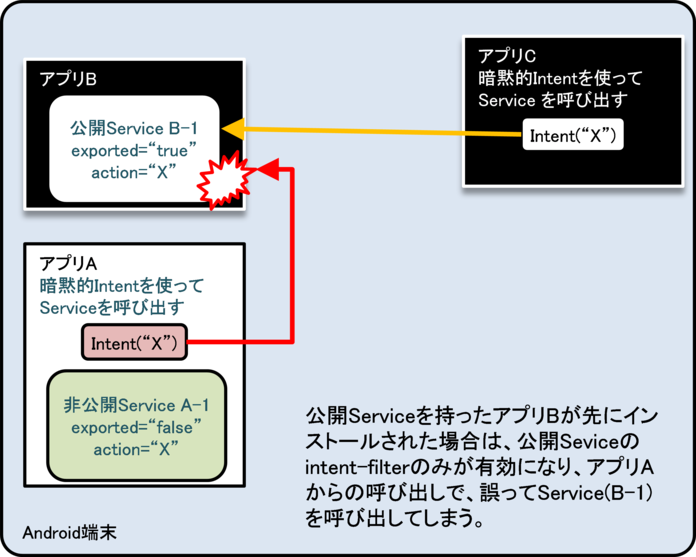{width="7.26875in" height="2.7849146981627295in"}

図 4.8‑1リリース版アプリを作成する方法(Exportする)

開発版アプリ（デバッグビルド）とリリース版アプリ（リリースビルド）のLogCat出力の違いを図
4.8‑2に示す。

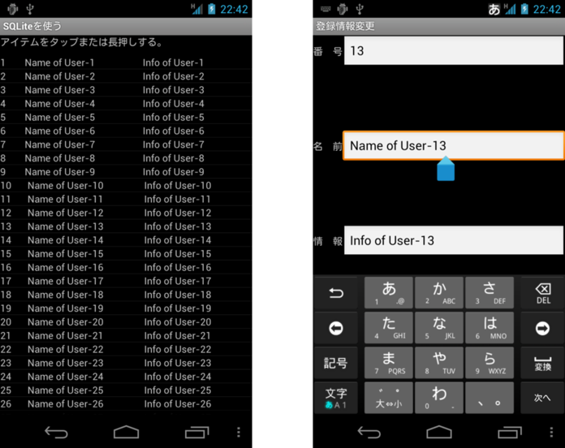{width="6.889763779527559in"
height="2.2236220472440946in"}

[]{#_Ref342927944 .anchor}図 4.8‑2
Logメソッドの開発版アプリとリリース版アプリのLogCat出力の違い

### ルールブック

LogCatにログを出力する際は、以下のルールを守ること。

1.  []{#_Ref349901376 .anchor}運用ログ情報にセンシティブな情報を含めない
    > （必須）

2.  []{#_Ref342569349
    > .anchor}開発ログ情報を出力するコードをリリースビルド時に自動削除する仕組みを導入する
    > （推奨）

3.  Throwableオブジェクトをログ出力するときはLog.d()/v()メソッドを使う
    > （推奨）

4.  ログ出力にはandroid.util.Logクラスのメソッドのみ使用する （推奨）

#### 運用ログ情報にセンシティブな情報を含めない （必須）

LogCatに出力したログは他のアプリから読むことができるので、リリース版アプリがユーザーのログイン情報などのセンシティブな情報をログ出力することがあってはならない。開発中にセンシティブな情報をログ出力するコードを書かないようにするか、あるいは、リリース前にそのようなコードを全て削除することが必要である。

このルールを順守するためには、運用ログ情報にセンシティブな情報を含めないこと。さらに、センシティブな情報を出力するコードをリリースビルド時に削除する仕組みを導入することを強く推奨する。「4.8.2.2
開発ログ情報を出力するコードをリリースビルド時に自動削除する仕組みを導入する
（推奨）」を参照すること。

#### 開発ログ情報を出力するコードをリリースビルド時に自動削除する仕組みを導入する （推奨）

アプリ開発中は、複雑なロジックの処理過程の中間的な演算結果、プログラム内部の状態情報、通信プロトコルの通信データ構造など、処理内容の確認やデバッグ用でセンシティブな情報をログ出力させたいことがある。アプリ開発時にセンシティブな情報をデバッグログとして出力するのは構わないが、この場合は、「4.8.2.1
運用ログ情報にセンシティブな情報を含めない
（必須）」で述べたように、リリース前に必ず該当するログ出力コードを削除すること。

リリースビルド時に開発ログ情報を出力するコードを確実に削除するために、何らかのツールを用いてコード削除を自動化する仕組みを導入すべきである。そのためのツールに4.8.1で紹介したProGuardがある。以下では、ProGuardを使ったコード削除の仕組みを導入する際の注意を説明する。ここでは、「4.8.3.2
ログレベルとログ出力メソッドの選択基準」に準拠し、開発ログ情報をLog.d()/v()のいずれかのみで出力しているアプリに対して仕組みを適用することを想定している。

ProGuardは使用されていないメソッド等、実質的に不要なコードを自動削除する。Log.d()/v()を-assumenosideeffectsオプションの引数に指定することにより、Log.d()、Log.v()の呼び出しが実質的に不要なコードとみなされ、自動削除される。

> Log.d()/v()を-assumenosideeffectsと指定することで、自動削除の対象にする

-assumenosideeffects class android.util.Log {

public static int d(...);

public static int v(...);

}

この自動削除の仕組みを利用する場合は、Log.v(),
Log.d()の戻り値を使用してしまうとLog.v()/d()のコードが削除されない点に注意が必要である。よって、Log.v(),
Log.d()の戻り値を使用してはならない。たとえば、次の実験コードにおいては、Log.v()が削除されない。

> 削除指定したLog.v()が削除されない実験コード

int i = android.util.Log.v("tag", "message");

System.out.println(String.format(“Log.v()が%dを返した。”, i)); //
実験のためLog.v()の戻り値を使用。

また、上記ProGuard設定により、Log.d()及びLog.v()が自動削除されることを前提としたソースコードがあったとする。もしそのソースコードをProGuard設定がされていない他のプロジェクトで再利用してしまうと、Log.d()及びLog.v()が削除されないため、センシティブな情報が漏洩してしまう危険性がある。ソースコードを再利用する際は、ProGuard設定を含めたプロジェクト環境の整合性を確保すること。

#### Throwableオブジェクトをログ出力するときはLog.d()/v()メソッドを使う （推奨）

「4.8.1 サンプルコード」および「4.8.3.2
ログレベルとログ出力メソッドの選択基準」に示した通り、Log.e()/w()/i()ではセンシティブな情報をログ出力してはならない。一方で、開発者がプログラムの異常を詳細にログ出力するために、例外発生時にLog.e(…,
Throwable tr)/w(…, Throwable tr)/i(…, Throwable
tr)でスタックトレースをLogCatにログ出力しているケースがみられる。しかしながら、スタックトレースはプログラムの内部構造を詳細に出力してしまうので、アプリケーションによってはセンシティブな情報が含まれてしまう場合がある。例えば、SQLiteExceptionをそのまま出力してしまうと、どのようなSQLステートメントが発行されたかが明らかになるので、SQLインジェクション攻撃の手がかりを与えてしまうことがある。よって、Throwableオブジェクトをログ出力する際には、Log.d()/Log.v()メソッドのみを使用することを推奨する。

#### ログ出力にはandroid.util.Logクラスのメソッドのみ使用する （推奨）

開発中にアプリが想定通りに動作していることを確認するために、System.out/errでログを出力することがあるだろう。もちろんSystem.out/errのprint()/println()メソッドでもLogCatにログを出力することは可能だが、以下の理由からログ出力にはandroid.util.Logクラスのメソッドのみを使用することを強く推奨する。

ログを出力するときは、一般には情報の緊急度に応じて出力メソッドを使い分け、出力を制御する。たとえば、深刻なエラー、警告、単なるアプリ情報通知などの区分が使われる。この区分をSystem.out/errに適用する手段の一つには、エラーと警告はSystem.err、それ以外はSystem.outで出力する方法がある。しかし、この場合、リリース時にも出力する必要のあるセンシティブでない情報(運用ログ情報)とセンシティブな情報が含まれている可能性のある情報(開発ログ情報)が同じメソッドによって出力されてしまう。よって、センシティブな情報を出力するコードを削除する際に、削除漏れが発生するおそれがある。

また、ログ出力にandroid.util.LogとSystem.out/errを使う場合は、android.util.Logのみを使う場合と比べて、ログ出力コードを削除する際に考慮することが増えるため、削除漏れなどのミスが生じるおそれがある。

上記のようなミスが生じる危険を減らすために、android.util.Logクラスのメソッドのみ使用することを推奨する。

### アドバンスト

#### リリース版アプリにおけるログ出力の2つの考え方

リリース版Androidアプリにおけるログ出力の考え方には大きく分けて、一切ログ出力すべきではないという考え方と、後の解析のために必要な情報をログ出力すべきという考え方の2つがある。セキュリティ観点ではリリース版アプリでは一切ログ出力しないことが望ましい。しかし様々な理由によりリリース版アプリでもログ出力するケースがある。ここでは両者のそれぞれの考え方について述べる。

1つ目は、リリース版アプリにおいてログ出力することにはあまり価値がなく、しかもセンシティブな情報を漏洩してしまうリスクがあるので、「一切ログ出力すべきではない」という考え方である。この考え方は、多くのWeb
アプリ運用環境などと違い、Androidアプリ運用環境ではリリース後のアプリのログ情報を開発者が収集する手段が用意されていないことによるものである。この考え方に基づくと、開発中に使用したログ出力コードを最終版のソースコードから削除してリリース版アプリを作成するという運用がなされる。

2つ目は、カスタマーサポート等でアプリの不具合解析を行う最終手段として、「後の解析のために必要な情報をログ出力すべき」という考え方である。この考え方に基づくと、リリース版アプリではセンシティブな情報を誤ってログ出力してしまわないよう細心の注意が必要となるため、サンプルコードセクションで紹介したような人為的ミスを排除する運用が必要となる。なお、下記のGoogleのCode
Style Guidelineも2つ目の考え方に基づいている。

> Code Style Guidelines for Contributors / Log Sparingly
>
> [*http://source.android.com/source/code-style.html\#log-sparingly*](http://source.android.com/source/code-style.html#log-sparingly)

#### ログレベルとログ出力メソッドの選択基準

Androidのandroid.util.LogクラスにはERROR、WARN、INFO、DEBUG,VERBOSEの5段階のログレベルが定義されている。出力したいログ情報のログレベルに応じて、適切なandroid.util.Logクラスのログ出力メソッドを選択する必要がある。選択基準を表
4.8‑1にまとめた。

[]{#_Ref342419215 .anchor}表 4.8‑1
ログレベルとログ出力メソッドの選択基準

  ログレベル   メソッド   出力するログ情報の趣旨                                                                                                                             アプリリリース時の注意
  ------------ ---------- -------------------------------------------------------------------------------------------------------------------------------------------------- --------------------------------------------------------------------------------------------------------------------------------------------------------------------------------------------------------------------------------------------
  ERROR        Log.e()    アプリが致命的な状況に陥ったときに出力するログ情報。                                                                                               左記のログ情報はユーザーも参照することが想定される情報であるため、開発版アプリとリリース版アプリの両方でログ出力されるべき情報である。そのためこのログレベルではセンシティブな情報をログ出力してはならない。
  WARN         Log.w()    アプリが深刻な予期せぬ状況に遭遇したときに出力するログ情報。                                                                                       
  INFO         Log.i()    上記以外で、アプリの注目すべき状態の変化や結果を知らせる目的で出力するログ情報。                                                                   
  DEBUG        Log.d()    アプリ開発時に特定のバグの原因究明のために一時的にログ出力したいプログラム内部の状態情報。                                                         左記のログ情報はアプリ開発者専用の情報であるため、リリース版アプリではログ出力されてはならない情報である。開発版アプリではセンシティブな情報を出力しても構わないが、リリース版アプリでは絶対にセンシティブな情報をログ出力してはならない。
  VERBOSE      Log.v()    以上のいずれにも該当しないログ情報。アプリ開発者がさまざまな目的で出力するログ情報が該当する。サーバーとの通信データをダンプ出力したい場合など。   

より詳細なログ出力の作法については下記URLを参照すること。

> Code Style Guidelines for Contributors / Log Sparingly
>
> [*http://source.android.com/source/code-style.html\#log-sparingly*](http://source.android.com/source/code-style.html#log-sparingly)

#### DEBUGログとVERBOSEログは自動的に削除されるわけではない

Developer
Referenceのandroid.util.Logクラスの解説[^18]には次のような記載がある。

The order in terms of verbosity, from least to most is ERROR, WARN,
INFO, DEBUG, VERBOSE. Verbose should never be compiled into an
application except during development. Debug logs are compiled in but
stripped at runtime. Error, warning and info logs are always kept.

開発者の中には、この文章からLogクラスの動作を次のように誤った解釈をしている人がいる。

-   Log.v()呼び出しはリリースビルド時にはコンパイルされず、VERBOSEログが出力されることがなくなる

-   Log.d()呼び出しはコンパイルされるが、実行時にはDEBUGログが出力されることはない

しかし実際にはLog
クラスはこのようには動作せず、デバッグビルド、リリースビルドを問わず全てのログを出力してしまう。よく読んでみるとわかるが、この英文はLogクラスの動作について語っているのではなく、ログ情報とはこうあるべきということを説明しているだけである。

この記事のサンプルコードでは、ProGuardを使って上記英文のような動作を実現する方法を紹介している。

#### ログ情報の組み立て処理を削除する

下記ソースコードをProGuardでリリースビルドしてLog.d()を削除した場合、Log.d()の呼び出し処理（下記コードの2行目）は削除されるものの、その前段でセンシティブな情報を組み立てる処理（下記コードの1行目）は削除されないことに注意が必要である。

String debug\_info = String.format("%s:%s", "センシティブな情報1",
"センシティブな情報2");

if (BuildConfig.DEBUG) android.util.Log.d(TAG, debug\_info);

上記ソースコードをリリースビルドしたAPKファイルを逆アセンブルすると次のようになる。確かにLog.d()の呼び出し処理は存在しないが、”センシティブな情報1”といった文字列定数定義とString\#format()メソッドの呼び出し処理が削除されず残っていることが分かる。

const-string v1, "%s:%s"

const/4 v2, 0x2

new-array v2, v2, \[Ljava/lang/Object;

const/4 v3, 0x0

const-string v4, "センシティブな情報1"

aput-object v4, v2, v3

const/4 v3, 0x1

const-string v4, "センシティブな情報2"

aput-object v4, v2, v3

invoke-static {v1, v2},
Ljava/lang/String;-&gt;format(Ljava/lang/String;\[Ljava/lang/Object;)Ljava/lang/String;

move-result-object v0

実際にはAPKファイルを逆アセンブルして、上記のようにログ出力情報を組み立てている箇所を発見するのは容易なことではない。しかし非常に機密度の高い情報を扱っているアプリにおいては、このような処理がAPKファイルに残ってしまってはならない場合もあり得る。

もし上記のようなログ出力情報の組み立て処理も削除してしまいたい場合には、次のように記述するとよい[^19]。リリースビルド時にはコンパイラの最適化処理によって、下記サンプルコードの処理は丸ごと削除される。

if (BuildConfig.DEBUG) {

String debug\_info = String.format("%s:%s", "センシティブな情報1",
"センシティブな情報2");

if (BuildConfig.DEBUG) android.util.Log.d(TAG, debug\_info);

}

なお、下記ソースコードにProGuardを適用した場合も、同様にログ情報の組み立て処理（"result:"
+ valueの部分）が残ってしまう。

Log.d(TAG, "result:" + value);

この場合も下記のように対処すればよい。

if (BuildConfig.DEBUG) Log.d(TAG, "result:" + value);

#### Intentの内容がLogCatに出力される

Activityを利用する際にActivityManagerがIntentの内容をLogCatに出力するため、注意が必要である。「4.1.3.5
Activity利用時のログ出力について」を参照すること。

#### System.out/errに出力されるログの抑制

System.out/errの出力先はLogCatである。System.out/errに出力されるのは、開発者がデバッグのために出力したログに限らない。例えば、次の場合、スタックトレースはSystem.errに出力される。

-   Exception\#printStackTrace()を使った場合

-   暗黙的にSystem.errに出力される場合

> （例外をアプリでキャッチしていない場合、システムがException\#printStackTrace()に渡すため。）

スタックトレースにはアプリ固有の情報が含まれるため、例外は開発者が正しくハンドリングすべきである。

保険的対策として、System.out/errの出力先をLogCat以外に変更する方法がある。以下に、リリースビルド時にSystem.out/errの出力先を変更し、どこにもログ出力しないようにする実装例を挙げる。ただし、この対応はSystem.out/errの出力先をアプリの実行時に一時的に書き換えるので、アプリやシステムの誤動作に繋がらないかどうかを充分に検討する必要がある。また、この対策はアプリ自身のプロセスには有効であるが、システムプロセスが生成するエラーログを抑制することはできない。すべてのエラーを抑制できるわけではないことに注意すること。

> OutputRedirectApplication.java

package org.jssec.android.log.outputredirection;

import java.io.IOException;

import java.io.OutputStream;

import java.io.PrintStream;

import android.app.Application;

public class OutputRedirectApplication extends Application {

// どこにも出力しないPrintStream

private final PrintStream emptyStream = new PrintStream(new
OutputStream() {

public void write(int oneByte) throws IOException {

// do nothing

}

});

@Override

public void onCreate() {

//
リリースビルド時にSystem.out/errをどこにも出力しないPrintStreamにリダイレクトする

// System.out/errの本来のストリームを退避する

PrintStream savedOut = System.out;

PrintStream savedErr = System.err;

// 一旦、System.out/errをどこにも出力しないPrintStreamにリダイレクトする

System.setOut(emptyStream);

System.setErr(emptyStream);

//
デバッグ時のみ本来のストリームに戻す(リリースビルドでは下記1行がProGuardにより削除される)

resetStreams(savedOut, savedErr);

}

// リリース時はProGuardにより下記メソッドがまるごと削除される

private void resetStreams(PrintStream savedOut, PrintStream savedErr) {

System.setOut(savedOut);

System.setErr(savedErr);

}

}

> AndroidManifest.xml

&lt;manifest xmlns:android="http://schemas.android.com/apk/res/android"

package="org.jssec.android.log.outputredirection" &gt;

&lt;application

android:icon="@drawable/ic\_launcher"

android:label="@string/app\_name"

android:name=".OutputRedirectApplication"

android:allowBackup="false" &gt;

&lt;activity

android:name=".LogActivity"

android:label="@string/app\_name"

android:exported="true" &gt;

&lt;intent-filter&gt;

&lt;action android:name="android.intent.action.MAIN" /&gt;

&lt;category android:name="android.intent.category.LAUNCHER" /&gt;

&lt;/intent-filter&gt;

&lt;/activity&gt;

&lt;/application&gt;

&lt;/manifest&gt;

> proguard-project.txt

\# クラス名、メソッド名等の変更を防ぐ

-dontobfuscate

\# リリースビルド時にLog.d()/v()の呼び出しを自動的に削除する

-assumenosideeffects class android.util.Log {

public static int d(...);

public static int v(...);

}

\# リリースビルド時にresetStreams()を自動的に削除する

-assumenosideeffects class
org.jssec.android.log.outputredirection.OutputRedirectApplication {

private void resetStreams(...);

}

開発版アプリ（デバッグビルド）とリリース版アプリ（リリースビルド）のLogCat出力の違いを図
4.8‑3に示す。

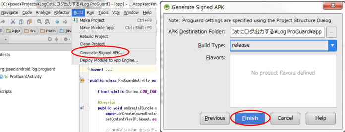{width="7.26875in" height="2.237303149606299in"}

[]{#_Ref342932556 .anchor}図 4.8‑3
System.out/errの開発版アプリとリリース版アプリのLogCat出力の違い

WebViewを使う
-------------

WebサイトやHTMLファイルを閲覧する機能を実装する方法として、WebViewを使用することができる。WebViewはHTMLをレンダリングする、JavaScriptを実行するなど、この目的のために有用な機能を提供する。

### サンプルコード

WebViewを使用することにより容易にWebサイト、HTMLファイル閲覧機能を実現することができるが、アクセスするコンテンツの特性によってWebViewが抱えるリスクや適切な防衛手段が異なってくる。

特に気をつけなければいけないのはJavaScriptの使用である。WebViewのデフォルト設定ではJavaScriptの機能が無効になっているが、WebSettings\#setJavaScriptEnabled()メソッドにより有効にすることが可能である。JavaScriptを使用することでインタラクティブなコンテンツの表示が可能になるが、悪意のある第三者により端末の情報を取得される、あるいは端末を操作されるという被害が発生する可能性がある。

WebViewを用いてコンテンツにアクセスするアプリを開発する際は、次の原則に従うこと[^20]。

(1) 自社が管理しているコンテンツにのみアクセスする場合に限りJavaScriptを有効にしてよい

(2) 上記以外の場合には、JavaScriptを有効にしてはならない

開発しているアプリがアクセスするコンテンツの特性を踏まえ、図
4.9‑1に従いサンプルコードを選択することが必要である。

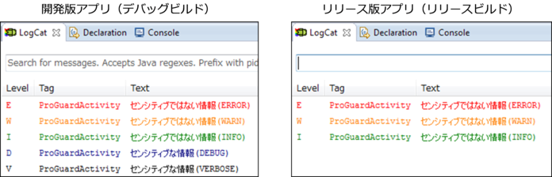{width="6.889763779527559in"
height="2.912204724409449in"}

[[]{#_Ref350458582 .anchor}]{#_Ref350458604 .anchor}図 4.9‑1
WebViewのサンプルコードを選択するフローチャート

#### assetsまたはresディレクトリに配置したコンテンツのみを表示する

端末内のローカルコンテンツをWebViewで表示するアプリに関しては、アプリのAPKに含まれるassetsあるいはresディレクトリ内のコンテンツにアクセスする場合に限りJavaScriptを有効にしてもよい。

以下にWebViewを使用してassetsディレクトリ内にあるHTMLファイルを表示するサンプルコードを示す。

> ポイント：

1.  assetsとresディレクトリ以外の場所に配置したファイルへのアクセスを禁止にする

&nbsp;
1.  JavaScriptを有効にしてよい

> WebViewAssetsActivity.java

package org.jssec.webview.assets;

import android.app.Activity;

import android.os.Bundle;

import android.webkit.WebSettings;

import android.webkit.WebView;

public class WebViewAssetsActivity extends Activity {

/\*\*

\* assets内のコンテンツを表示する

\*/

@Override

public void onCreate(Bundle savedInstanceState) {

super.onCreate(savedInstanceState);

setContentView(R.layout.activity\_main);

WebView webView = (WebView) findViewById(R.id.webView);

WebSettings webSettings = webView.getSettings();

// ★ポイント1★
assetsとresディレクトリ以外の場所に配置したファイルへのアクセスを禁止にする

webSettings.setAllowFileAccess(false);

// ★ポイント2★ JavaScriptを有効にしてよい

webSettings.setJavaScriptEnabled(true);

// assets内に配置したコンテンツを表示する

webView.loadUrl("file:///android\_asset/sample/index.html");

}

}

#### インターネット上の自社管理コンテンツを表示する

自社の管理するサービス上のコンテンツを表示する場合、サービス側、アプリ側の双方で適切な対策を施し、安全が確保できるならば、JavaScriptを有効にしてもよい。

-   サービス側の対策

> 図
> 4.9‑2に示したように、サービス側に用意するコンテンツは自社の管理していないコンテンツを参照してはならない。加えて、サービスに適切なセキュリティ対策が施されていることも必要である。その理由は、サービスを構成するコンテンツへの攻撃コードの埋め込みや改ざんを防止することにある。「4.9.2.1
> JavaScriptを有効にするのはコンテンツを自社が管理している場合に限定する
> （必須）」を参照すること。

-   アプリ側の対策

> 次にアプリ側での対策を述べる。アプリ側では、接続先が自社管理サービスであることを確認することが必要である。そのために、通信プロトコルはHTTPSを使用し、証明書が信頼できる場合のみ接続するように実装する。

以下では、アプリ側での実装の例として、WebViewを使って自社管理コンテンツを表示するActivityの例を示す。

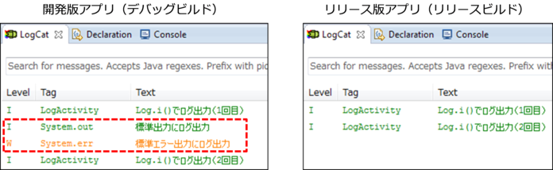{width="6.471653543307086in"
height="4.366141732283465in"}

[[]{#_Ref348614297 .anchor}]{#_Ref348614818 .anchor}図
4.9‑2アプリが読み込んでよい自社管理コンテンツ

> ポイント：

1.  WebViewのSSL通信エラーを適切にハンドリングする

&nbsp;
1.  WebViewのJavaScriptを有効にしてもよい

2.  WebViewで表示するURLをHTTPSプロトコルだけに限定する

3.  WebViewで表示するURLを自社管理コンテンツだけに限定する

> WebViewTrustedContentsActivity.java

package org.jssec.webview.trustedcontents;

import android.app.Activity;

import android.app.AlertDialog;

import android.content.DialogInterface;

import android.net.http.SslCertificate;

import android.net.http.SslError;

import android.os.Bundle;

import android.webkit.SslErrorHandler;

import android.webkit.WebView;

import android.webkit.WebViewClient;

import java.text.SimpleDateFormat;

public class WebViewTrustedContentsActivity extends Activity {

@Override

public void onCreate(Bundle savedInstanceState) {

super.onCreate(savedInstanceState);

setContentView(R.layout.main);

WebView webView = (WebView) findViewById(R.id.webView);

webView.setWebViewClient(new WebViewClient() {

@Override

public void onReceivedSslError(WebView view,

SslErrorHandler handler, SslError error) {

// ★ポイント1★ WebViewのSSL通信エラーを適切にハンドリングする

// SSLエラーが発生した場合には、SSLエラーが発生した旨をユーザに通知する

AlertDialog dialog = createSslErrorDialog(error);

dialog.show();

// ★ポイント1★ WebViewのSSL通信エラーを適切にハンドリングする

// SSLエラーが発生した場合、有効期限切れなど証明書に不備があるか、

//
もしくは中間者攻撃を受けている可能性があるので、安全のために接続を中止する。

handler.cancel();

}

});

// ★ポイント2★ WebViewのJavaScriptを有効にしてもよい

//
以下のコードでは、loadUrl()で自社管理コンテンツを読みこむことを想定している。

webView.getSettings().setJavaScriptEnabled(true);

// ★ポイント3★ WebViewで表示するURLをHTTPSプロトコルだけに限定する

// ★ポイント4★ WebViewで表示するURLを自社管理コンテンツだけに限定する

webView.loadUrl("https://url.to.your.contents/");

}

private AlertDialog createSslErrorDialog(SslError error) {

// ダイアログに表示するエラーメッセージ

String errorMsg = createErrorMessage(error);

// ダイアログのOKボタン押下時の挙動

DialogInterface.OnClickListener onClickOk = new
DialogInterface.OnClickListener() {

@Override

public void onClick(DialogInterface dialog, int which) {

setResult(RESULT\_OK);

}

};

// ダイアログの作成

AlertDialog dialog = new AlertDialog.Builder(

WebViewTrustedContentsActivity.this).setTitle("SSL接続エラー")

.setMessage(errorMsg).setPositiveButton("OK", onClickOk)

.create();

return dialog;

}

private String createErrorMessage(SslError error) {

SslCertificate cert = error.getCertificate();

SimpleDateFormat dateFormat = new SimpleDateFormat("yyyy/MM/dd
HH:mm:ss");

StringBuilder result = new StringBuilder()

.append("サイトのセキュリティ証明書が信頼できません。接続を終了しました。\\n\\nエラーの原因\\n");

switch (error.getPrimaryError()) {

case SslError.SSL\_EXPIRED:

result.append("証明書の有効期限が切れています。\\n\\n終了時刻=")

.append(dateFormat.format(cert.getValidNotAfterDate()));

return result.toString();

case SslError.SSL\_IDMISMATCH:

result.append("ホスト名が一致しません。\\n\\nCN=")

.append(cert.getIssuedTo().getCName());

return result.toString();

case SslError.SSL\_NOTYETVALID:

result.append("証明書はまだ有効ではありません\\n\\n開始時刻=")

.append(dateFormat.format(cert.getValidNotBeforeDate()));

return result.toString();

case SslError.SSL\_UNTRUSTED:

result.append("証明書を発行した認証局が信頼できません\\n\\n認証局\\n")

.append(cert.getIssuedBy().getDName());

return result.toString();

default:

result.append("原因不明のエラーが発生しました");

return result.toString();

}

}

}

#### 自社管理以外のコンテンツを表示する

自社で管理していないコンテンツをWebViewで接続・表示する場合は、JavaScriptを有効にしてはならない。攻撃者が用意したコンテンツに接続する可能性があるからである。

以下のサンプルコードはWebViewを使用して自社管理以外のコンテンツを表示するアプリである。このアプリは、アドレスバーに入力したURLの指すHTMLファイルなどのコンテンツを読み込み、画面に表示する。安全の確保のためにJavaScriptを無効化しているほか、HTTPSで通信していてSSLエラーが発生した場合は接続を中止する実装となっている。SSLエラーは「4.9.1.2
インターネット上の自社管理コンテンツを表示する」と同様の方法によりハンドリングしている。HTTPS通信についての詳細は、「5.4
HTTPSで通信する」を参照すること。

> ポイント：

1.  HTTPS 通信の場合にはSSL通信のエラーを適切にハンドリングする

2.  JavaScriptを有効にしない

> WebViewUntrustActivity.java

package org.jssec.webview.untrust;

import android.app.Activity;

import android.app.AlertDialog;

import android.content.DialogInterface;

import android.graphics.Bitmap;

import android.net.http.SslCertificate;

import android.net.http.SslError;

import android.os.Bundle;

import android.view.View;

import android.webkit.SslErrorHandler;

import android.webkit.WebView;

import android.webkit.WebViewClient;

import android.widget.Button;

import android.widget.EditText;

import java.text.SimpleDateFormat;

public class WebViewUntrustActivity extends Activity {

/\*

\* 自社管理以外のコンテンツを表示する
(簡易ブラウザとして機能するサンプルプログラム)

\*/

private EditText textUrl;

private Button buttonGo;

private WebView webView;

// この Activity が独自に URL
リクエストをハンドリングできるようにするために定義

private class WebViewUnlimitedClient extends WebViewClient {

@Override

public boolean shouldOverrideUrlLoading(WebView webView, String url) {

webView.loadUrl(url);

textUrl.setText(url);

return true;

}

// Webページの読み込み開始処理

@Override

public void onPageStarted(WebView webview, String url, Bitmap favicon) {

buttonGo.setEnabled(false);

textUrl.setText(url);

}

// SSL通信で問題があるとエラーダイアログを表示し、

// 接続を中止する

@Override

public void onReceivedSslError(WebView webview,

SslErrorHandler handler, SslError error) {

// ★ポイント 1★ HTTPS
通信の場合にはSSL通信のエラーを適切にハンドリングする

AlertDialog errorDialog = createSslErrorDialog(error);

errorDialog.show();

handler.cancel();

textUrl.setText(webview.getUrl());

buttonGo.setEnabled(true);

}

//
Webページのloadが終わったら表示されたページのURLをEditTextに表示させる

@Override

public void onPageFinished(WebView webview, String url) {

textUrl.setText(url);

buttonGo.setEnabled(true);

}

}

@Override

public void onCreate(Bundle savedInstanceState) {

super.onCreate(savedInstanceState);

setContentView(R.layout.main);

webView = (WebView) findViewById(R.id.webview);

webView.setWebViewClient(new WebViewUnlimitedClient());

// ★ポイント 2★ JavaScriptを有効にしない

// デフォルトの設定でJavaScript無効となっているが、明示的に無効化する

webView.getSettings().setJavaScriptEnabled(false);

webView.loadUrl(getString(R.string.texturl));

textUrl = (EditText) findViewById(R.id.texturl);

buttonGo = (Button) findViewById(R.id.go);

}

public void onClickButtonGo(View v) {

webView.loadUrl(textUrl.getText().toString());

}

private AlertDialog createSslErrorDialog(SslError error) {

// ダイアログに表示するエラーメッセージ

String errorMsg = createErrorMessage(error);

// ダイアログのOKボタン押下時の挙動

DialogInterface.OnClickListener onClickOk = new
DialogInterface.OnClickListener() {

@Override

public void onClick(DialogInterface dialog, int which) {

setResult(RESULT\_OK);

}

};

// ダイアログの作成

AlertDialog dialog = new AlertDialog.Builder(

WebViewUntrustActivity.this).setTitle("SSL接続エラー")

.setMessage(errorMsg).setPositiveButton("OK", onClickOk)

.create();

return dialog;

}

private String createErrorMessage(SslError error) {

SslCertificate cert = error.getCertificate();

SimpleDateFormat dateFormat = new SimpleDateFormat("yyyy/MM/dd
HH:mm:ss");

StringBuilder result = new StringBuilder()

.append("サイトのセキュリティ証明書が信頼できません。接続を終了しました。\\n\\nエラーの原因\\n");

switch (error.getPrimaryError()) {

case SslError.SSL\_EXPIRED:

result.append("証明書の有効期限が切れています。\\n\\n終了時刻=")

.append(dateFormat.format(cert.getValidNotAfterDate()));

return result.toString();

case SslError.SSL\_IDMISMATCH:

result.append("ホスト名が一致しません。\\n\\nCN=")

.append(cert.getIssuedTo().getCName());

return result.toString();

case SslError.SSL\_NOTYETVALID:

result.append("証明書はまだ有効ではありません\\n\\n開始時刻=")

.append(dateFormat.format(cert.getValidNotBeforeDate()));

return result.toString();

case SslError.SSL\_UNTRUSTED:

result.append("証明書を発行した認証局が信頼できません\\n\\n認証局\\n")

.append(cert.getIssuedBy().getDName());

return result.toString();

default:

result.append("原因不明のエラーが発生しました");

return result.toString();

}

}

}

### ルールブック

WebViewを使用する際には以下のルールを守ること。

1.  JavaScriptを有効にするのはコンテンツを自社が管理している場合に限定する
    > （必須）

2.  自社管理サービスとの通信にはHTTPSを使用する （必須）

3.  Intent経由など、他から受け取ったURLはJavaScriptが有効なWebViewには表示しない
    > （必須）

4.  SSL通信のエラーを適切にハンドリングする （必須）

#### JavaScriptを有効にするのはコンテンツを自社が管理している場合に限定する （必須）

WebViewを用いてコンテンツやサービスにアクセスするアプリを開発する際に、セキュリティの面で最も注意しなければならない点はJavaScriptを有効にするかどうかである。原則的には、自社が管理しているサービスにのみアプリがアクセスする場合に限りJavaScriptを有効にしてもよい。しかし、そうでないサービスにアクセスする可能性が少しでもある場合には、JavaScriptを有効にしてはならない。

##### 自社で管理しているサービス

自社で作成あるいは、運用、管理に責任を持つサービスは、自社が安全を保証できる。例として、自社管理サーバー上の自社開発コンテンツにアプリがアクセスする場合を考える。各コンテンツがサーバー内部のコンテンツのみを参照しており、かつ、自社管理サーバーに対して適切なセキュリティ対策が施されているならば、このサービスは自社以外が内容を書き換えていることはないとみなせる。この場合、自社管理サービスにアクセスするアプリのJavaScriptを有効にしてもよい。「4.9.1.2
インターネット上の自社管理コンテンツを表示する」を参照すること。また、他のアプリによる書き換えが不可能な端末内コンテンツ(APKのassetsまたはresディレクトリ内に配置されたコンテンツやアプリディレクトリ下のコンテンツ)にアクセスするアプリの場合も同様に考え、JavaScriptを有効にしてもよい。「4.9.1.1
assetsまたはresディレクトリに配置したコンテンツのみを表示する」を参照すること。

##### 自社で管理していないサービス

自社で管理していないコンテンツ・サービスは自社が安全を保証できると考えてはならない。それゆえ、アプリのJavaScriptを無効にしなければならない。「4.9.1.3
自社管理以外のコンテンツを表示する」を参照すること。加えて、SDカードのような端末の外部記憶装置に配置されたコンテンツは他のアプリによる書き換えが可能なので、自社が管理しているとは言えない。そのようなコンテンツにアクセスするアプリについてもJavaScriptを無効にしなければならない。

#### 自社管理サービスとの通信にはHTTPSを使用する （必須）

自社管理サービスにアクセスするアプリは、悪意ある第三者によるサービスのなりすましによる被害を防ぎ、対象サービスへ確実に接続する必要がある。そのためには、サービスとの通信にHTTPSを使用する。

詳細は「4.9.2.4 SSL通信のエラーを適切にハンドリングする
（必須）」、「5.4 HTTPSで通信する」を参照すること。

#### Intent経由など、他から受け取ったURLはJavaScriptが有効なWebViewには表示しない （必須）

他のアプリからIntentを受信し、そのIntentのパラメータで渡されたURLをWebViewに表示する実装が多くのアプリで見られる。ここでWebViewのJavaScriptが有効である場合、悪意あるWebページのURLをWebViewで表示してしまい、悪意あるJavaScriptがWebView上で実行されて何らかの被害が生じる可能性がある。この実装の問題点は、安全を保証できない不特定のURLをJavaScriptが有効なWebViewで表示してしまうことである。

サンプルコード「4.9.1.2
インターネット上の自社管理コンテンツを表示する」では、固定URL文字列定数で自社管理コンテンツを指定することで、WebViewで表示するコンテンツを自社管理コンテンツに限定し安全を確保している。

もしIntent等で受け取ったURLをJavaScriptが有効なWebViewで表示したい場合は、そのURLが自社管理コンテンツであることを保証しなければならない。あらかじめアプリ内に自社管理コンテンツURLのホワイトリストを正規表現等で保持しておき、このホワイトリストと照合して合致したURLだけをWebViewで表示することで安全を確保することができる。この場合も、ホワイトリスト登録するURLはHTTPSでなければならないことにも注意が必要だ。

#### SSL通信のエラーを適切にハンドリングする （必須）

HTTPS通信でSSLエラーが発生した場合は、エラーが発生した旨をダイアログ表示するなどの方法でユーザーに通知して、通信を終了しなければならない。

SSLエラーの発生は、サーバー証明書に不備がある可能性、あるいは中間者攻撃を受けている可能性を示唆する。しかし、WebViewには、サービスとの通信時に発生したSSLエラーに関する情報をユーザーに通知する仕組みが備わっていない。そこで、SSLエラーが発生した場合にはその旨をダイアログなどで表示することで、脅威にさらされている可能性があることをユーザーに通知する必要がある。エラー通知の例は、「4.9.1.2
インターネット上の自社管理コンテンツを表示する」のサンプルコードあるいは「4.9.1.3
自社管理以外のコンテンツを表示する」のサンプルコードを参照すること。

また、エラーの通知に加えて、アプリはサービスとの通信を終了しなければならない。特に、次のような実装を行ってはならない。

-   発生したエラーを無視してサービスとの通信を継続する

-   HTTPなどの非暗号化通信を使ってサービスと改めて通信する

HTTP通信/HTTPS通信の詳細は「5.4 HTTPSで通信する」を参照すること。

SSLエラーが発生した際には対象のサーバーと接続を行わないことがWebViewのデフォルトの挙動である。よって、WebViewのデフォルトの挙動にSSLエラーの通知機能を実装することで適切に通信エラーを取り扱うことができる。

### アドバンスト

#### Android 4.2未満の端末におけるaddJavascriptInterface()に起因する脆弱性について

Android 4.2（API Level
17）未満の端末にはaddJavascriptInterface()に起因する脆弱性があり、JavaScriptからJavaのリフレクションを行うことにより任意のJavaメソッドが実行できてしまう問題が存在する。

そのため、「4.9.2.1
JavaScriptを有効にするのはコンテンツを自社が管理している場合に限定する
（必須）」で解説した通り、自社で管理していないコンテンツ・サービスにアクセスする可能性がある場合は、JavaScriptを無効にする必要がある。

Android 4.2（API Level
17）以降の端末では、Javaのソースコード上で@JavascriptInterfaceというアノテーションが指定されたメソッドしかJavaScriptから操作できないようにAPIが仕様変更され、脆弱性の対策がされた。ただし、自社で管理していないコンテンツ・サービスにアクセスする可能性がある場合は、コンテンツ・サービス提供者が悪意あるJavaScriptを送信する恐れがあるため、JavaScriptを無効化する対策は引き続き必要である。

#### fileスキームに起因する問題について

WebViewをデフォルト設定で使用している場合、fileスキームを利用してアクセスすると当該アプリがアクセス可能なすべてのファイルにアクセスすることが可能になる。この動作を悪用された場合、例えば、JavaScriptからfileスキーム使ったリクエストすることで、アプリの専用フォルダに保存したファイル等を攻撃者に取得されてしまう可能性がある。

対策としては、「4.9.2.1
JavaScriptを有効にするのはコンテンツを自社が管理している場合に限定する
（必須）」で解説した通り、自社で管理していないコンテンツ・サービスにアクセスする可能性がある場合はJavaScriptを無効にする。この対策により意図しないfileスキームによるリクエストが送信されないようにする。

また、Android 4.1（API Level
16）以降の場合、setAllowFileAccessFromFileURLs()およびsetAllowUniversalAccessFromFileURLs()を利用することでfileスキームによるアクセスを禁止することができる。

> fileスキームの無効化

webView = (WebView) findViewById(R.id.webview);

webView.setWebViewClient(new WebViewUnlimitedClient());

WebSettings settings = webView.getSettings();

settings.setAllowUniversalAccessFromFileURLs(false);

settings.setAllowFileAccessFromFileURLs(false);

#### Web Messaging利用時の送信先オリジン指定について

Android 6.0(API Level 23)において、HTML5 Web
Messagingを実現するためのAPIが追加された。Web
Messagingは異なるブラウジング・コンテキスト間でデータを送受信するための仕組みであり、HTML5で定義されている[^21]。

WebViewクラスに追加されたpostWebMessage()はWeb
Messagingで定義されているCross-domain
messagingによるデータ送信を処理するメソッドである。このメソッドは第一引数で指定されたメッセージオブジェクトをWebViewに読み込んでいるブラウジング・コンテキストに対して送信するのだが、その際第二引数として送信先のオリジンを指定する必要がある。指定されたオリジン[^22]が送信先コンテキストのオリジンと一致しない限りメッセージは送信されない。送信先オリジンを制限することで、意図しない送信先にメッセージを渡してしまうことを防いでいるのである。

ただし、postWebMessage()メソッドではオリジンとしてワイルドカードを指定できることに注意が必要である[^23]。ワイルドカードを指定するとメッセージの送信先オリジンがチェックされず、どのようなオリジンに対してもメッセージを送信してしまう。もしWebViewに悪意のあるコンテンツが読み込まれている状況でオリジンの制限なしに重要なメッセージを送信してしまうと何らかの被害につながる可能性も生じる。WebViewを用いてWeb
messagingを行う際は、postWebMessage()メソッドに特定のオリジンを明示的に指定するべきである。

Notificationを使用する
----------------------

Androidにはエンドユーザーへのメッセージを通知するNotification機能がある。Notificationを使うと、画面上部のステータスバーと呼ばれる領域に、アイコンやメッセージを表示することができる。

{width="3.716666666666667in"
height="6.603472222222222in"}

図 4.10‑1　Notifcationの表示例

Notificationの通知機能は、Android 5.0(API Level
21)で強化され、アプリやユーザー設定によって、画面がロックされている状態であってもNotificationによる通知を表示することが可能になった。ただし、Notificationの使い方を誤ると、端末ユーザー本人にのみ見せるべきプライベートな情報が第三者の目に触れる恐れがある。したがって、プライバシーやセキュリティを考慮して適切に実装を行うことが重要である。

なお、Visibilityが取り得る値とNotificationの振る舞いは以下の通りである。

  Visibilityの値   Notificationの振る舞い
  ---------------- -----------------------------------------------------------------------------------------------------------------------------------------------------------------------------------------------------------------
  Public           すべてのロック画面上でNotificationが表示される
  Private          すべてのロック画面上でNotifcationが表示されるが、パスワード等で保護されたロック画面（セキュアロック）上では、Notificationのタイトルやテキスト等が隠される（プライベート情報が隠された公開可能な文に置き換わる）
  Secret           パスワード等で保護されたロック画面（セキュアロック）上では、Notificationが表示されなくなる（セキュアロック以外のロック画面ではNotificationは表示される）

### サンプルコード

Notificationに端末ユーザーのプライベートな情報を含む場合、プライベート情報を取り除いた通知を画面ロック時の表示用に作成し、加えておくこと。

{width="3.716666666666667in"
height="6.603472222222222in"}

図 4.10‑2　ロック画面上のNotification

プライベート情報を含んだ通知を行うサンプルコードを以下に示す。

> ポイント：

1.  プライベート情報を含んだ通知を行う場合は、公開用（画面ロック時の表示用）のNotification
    を用意する

2.  公開用（画面ロック時の表示用）の
    Notificationにはプライベート情報を含めない

3.  Visibility を明示的にPrivate に設定して、Notification を作成する

4.  Visibility が Private の場合、プライベート情報を含めて通知してもよい

> VisibilityPrivateNotificationActivity.java

package org.jssec.notification.visibilityPrivate;

import android.app.Activity;

import android.app.Notification;

import android.app.NotificationManager;

import android.content.Context;

import android.os.Build;

import android.os.Bundle;

import android.view.View;

public class VisibilityPrivateNotificationActivity extends Activity {

/\*\*

\* Private な Notification を表示する

\*/

private final int mNotificationId = 0;

@Override

public void onCreate(Bundle savedInstanceState) {

super.onCreate(savedInstanceState);

setContentView(R.layout.activity\_main);

}

public void onSendNotificationClick(View view) {

// ★ポイント1★
プライベート情報を含んだ通知を行う場合は、公開用（画面ロック時の表示用）のNotification
を用意する

Notification.Builder publicNotificationBuilder = new
Notification.Builder(this).setContentTitle("Notification : Public");

if (Build.VERSION.SDK\_INT &gt;= 21)

publicNotificationBuilder.setVisibility(Notification.VISIBILITY\_PUBLIC);

// ★ポイント1★ 公開用（画面ロック時の表示用）の
Notificationにはプライベート情報を含めない

publicNotificationBuilder.setContentText("Visibility Public : Omitting
sensitive data.");

publicNotificationBuilder.setSmallIcon(R.drawable.ic\_launcher);

Notification publicNotification = publicNotificationBuilder.build();

// プライベート情報を含む Notification を作成する

Notification.Builder privateNotificationBuilder = new
Notification.Builder(this).setContentTitle("Notification : Private");

// ★ポイント3★ 明示的に Visibility を Private に設定して、Notification
を作成する

if (Build.VERSION.SDK\_INT &gt;= 21)

privateNotificationBuilder.setVisibility(Notification.VISIBILITY\_PRIVATE);

// ★ポイント4★ Visibility が Private
の場合、プライベート情報を含めて通知してもよい

privateNotificationBuilder.setContentText("Visibility Private :
Including user info.");

privateNotificationBuilder.setSmallIcon(R.drawable.ic\_launcher);

//
VisibilityがPrivateのNotificationを利用する場合、VisibilityをPublicにした公開用のNotificationを合わせて設定する

if (Build.VERSION.SDK\_INT &gt;= 21)

privateNotificationBuilder.setPublicVersion(publicNotification);

Notification privateNotification = privateNotificationBuilder.build();

// 本サンプルでは実装していないが、Notificationでは
setContentIntent(PendingIntent intent) を使い

//
Notificationをクリックした際にIntentが送信されるように実装することが多い。

// このときに設定するIntentは、呼び出すコンポーネントの種類に合わせて、

//
安全な方法で呼び出すことが必要である（例えば、明示的Intentを使うなど）

// 各コンポーネントの安全な呼び出し方法は以下の項目を参照のこと

// 4.1. Activity を作る・利用する

// 4.2. Broadcast を受信する・送信する

// 4.4. Service を作る・利用する

NotificationManager notificationManager = (NotificationManager)
this.getSystemService(Context.NOTIFICATION\_SERVICE);

notificationManager.notify(mNotificationId, privateNotification);

}

}

### ルールブック

Notificationを利用する際には以下のルールを守ること。

1.  Visibilityの設定に依らず、Notificationにはセンシティブな情報を含めない（プライベート情報は例外）
    > （必須）

2.  Visibility PublicのNotificationには プライベート情報を含めない
    > （必須）

3.  （特にVisibility Privateにする場合）Visibility は明示的に設定する
    > （必須）

4.  VisibilityがPrivateのNotificationを利用する場合、VisibilityをPublicにした公開用のNotificationを併せて設定する
    > （推奨）

#### Visibilityの設定に依らず、Notificationにはセンシティブな情報を含めない（プライベート情報は例外） （必須）

Android4.3(API Level
18)以降の端末では、設定画面からユーザーがNotificationの読み取り許可をアプリに与えることができる。許可されたアプリは、全てのNotificationの情報を読み取ることが可能になるため、センシティブな情報をNotificationに含めてはならない。（ただし、プライベート情報はVisibilityの設定によってはNotificationに含めて良い）

Notificationに含まれた情報は、通常はNotificationを送信したアプリを除き、他のアプリから読み取ることはできない。しかし、ユーザーが明示的に許可を与えることで、ユーザーが指定したアプリは全てのNotificationの情報を読み取ることが可能になる。ユーザーが許可を与えたアプリのみがNotificationの情報を読み取れることから、ユーザー自身のプライベート情報をNotificationに含めることは問題ない。一方で、ユーザーのプライベート情報以外のセンシティブな情報（例えば、アプリ開発者のみが知り得る機密情報）をNotificationに含めると、ユーザー自身がNotificationに含まれた情報を読みとろうとしてNotificationへの閲覧をアプリに許可する可能性があるため、利用者のプライベート情報以外のセンシティブな情報を含めることは問題となる。

具体的な方法と条件は、「4.10.3.1
ユーザー許可によるNotificationの閲覧について」を参照の事。

#### Visibility PublicのNotificationには プライベート情報を含めない （必須）

VisibilityがPublicに設定されたNotificationによって通知を行う場合、ユーザーのプライベート情報をNotificationに含めてはならない。VisibilityがPublicに設定されたNotificationは、画面ロック中にもNotificationの情報が表示され、端末に物理的に接近できる第三者がプライベート情報を盗み見るリスクにつながるためである。

> VisibilityPrivateNotificationActivity.java

// 公開用（画面ロック時の表示用）の センシティブな情報を持たない
Notification を用意する

Notification.Builder publicNotificationBuilder = new
Notification.Builder(this).setContentTitle("Notification : Public");

publicNotificationBuilder.setVisibility(Notification.VISIBILITY\_PUBLIC);

// 公開用（画面ロック時の表示用）の
Notificationにはプライベート情報を含めない

publicNotificationBuilder.setContentText("Visibility Public :
センシティブな情報は含めずに通知");

publicNotificationBuilder.setSmallIcon(R.drawable.ic\_launcher);

プライベート情報の典型例としては、ユーザー宛てに送信されたメールやユーザーの位置情報など、「5.5.
プライバシー情報を扱う」で言及されている情報が挙げられる。

#### （特にVisibility Privateにする場合）Visibility は明示的に設定する （必須）

「4.10.2.2 Visibility PublicのNotificationには
プライベート情報を含めない （必須）」の通り、Android 5.0(API Level
21)以降の端末では、画面ロック中にもNotificationが表示されるため、Visibilityの設定が重要であり、デフォルト値に頼らず明示的に設定すること。

現状では、NotificationのVisibilityのデフォルト値はPrivateに設定されており、明示的にPublicを指定しない限りプライベート情報が盗み見られるリスクは発生しない。しかし、Visibilityのデフォルト値が将来変更になる可能性もあり、含める情報の取り扱いを常に意識するためにも、たとえVisiblityをPrivateにする場合であっても、NotificationのVisibilityは明示的に設定することを必須としている。

> VisibilityPrivateNotificationActivity.java

// プライベート情報を含む Notification を作成する

Notification.Builder priavteNotificationBuilder = new
Notification.Builder(this).setContentTitle("Notification : Private");

// ★ポイント★ 明示的に Visibility を Private に設定して、Notification
を作成する

priavteNotificationBuilder.setVisibility(Notification.VISIBILITY\_PRIVATE);

####  VisibilityがPrivateのNotificationを利用する場合、VisibilityをPublicにした公開用のNotificationを併せて設定する （推奨）

VisibilityがPrivateに設定されたNotificationを使って通知する場合、画面ロック中に表示される情報を制御するため、VisibilityをPublicにした公開用のNotificationを併せて設定することが望ましい。

VisibilityがPrivateに設定されたNotificationに公開用のNotificationを設定しない場合、画面ロック中にはシステムで用意されたデフォルトの文言が表示されるためセキュリティ上の問題はない。しかし、Notificationに含める情報の取り扱いを常に意識するためにも、公開用のNotificationを明示的に用意し設定することを推奨する。

> VisibilityPrivateNotificationActivity.java

// プライベート情報を含む Notification を作成する

Notification.Builder privateNotificationBuilder = new
Notification.Builder(this).setContentTitle("Notification : Private");

// ★ポイント★ 明示的に Visibility を Private に設定して、Notification
を作成する

if (Build.VERSION.SDK\_INT &gt;= 21)

privateNotificationBuilder.setVisibility(Notification.VISIBILITY\_PRIVATE);

// ★ポイント★ Visibility が Private
の場合、プライベート情報を含めて通知してもよい

privateNotificationBuilder.setContentText("Visibility Private :
Including user info.");

privateNotificationBuilder.setSmallIcon(R.drawable.ic\_launcher);

//
VisibilityがPrivateのNotificationを利用する場合、VisibilityをPublicにした公開用のNotificationを合わせて設定する

if (Build.VERSION.SDK\_INT &gt;= 21)

privateNotificationBuilder.setPublicVersion(publicNotification);

### アドバンスト

#### ユーザー許可によるNotificationの閲覧について

「4.10.2.1
Visibilityの設定に依らず、Notificationにはセンシティブな情報を含めない（プライベート情報は例外）
（必須）」で述べたように、Android4.3(API Level
18)以降の端末では、ユーザーが許可を与えた場合、指定されたアプリは全てのNotificationの情報を読み取ることが可能になる。ただし、ユーザー許可の対象となるためには、アプリがNotificationListenerServiceを継承したServiceを実装しておく必要がある。

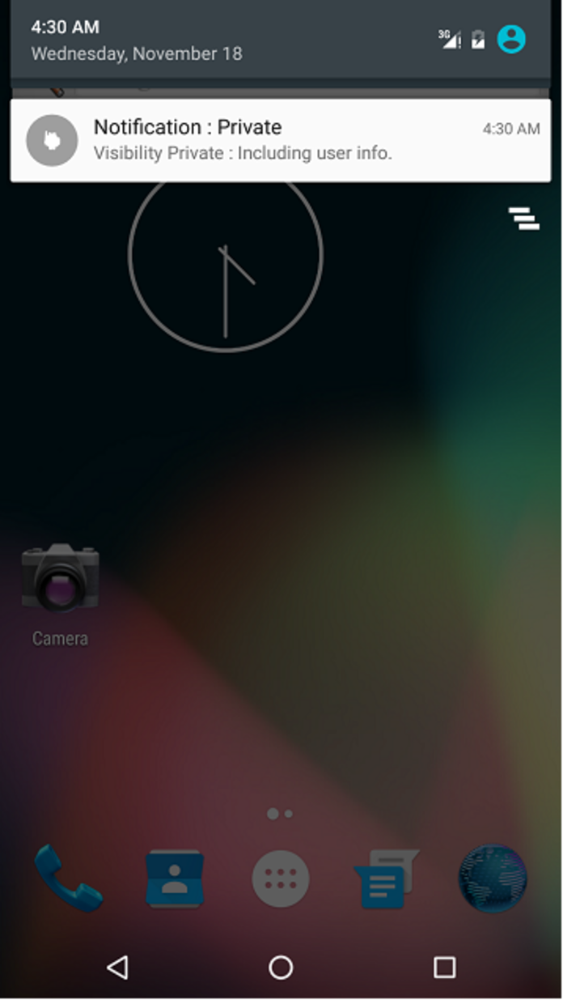{width="3.71875in" height="6.604166666666667in"}

図 4.10‑3　Notificationの読み取りを設定する「通知へのアクセス」画面

NotificationListenerServiceを使ったサンプルコードを以下に示す。

> AndroidManifest.xml

&lt;manifest xmlns:android="http://schemas.android.com/apk/res/android"

package="org.jssec.notification.notificationListenerService"&gt;

&lt;application

android:allowBackup="false"

android:icon="@drawable/ic\_launcher"

android:label="@string/app\_name" &gt;

&lt;service android:name=".MyNotificationListenerService"

android:label="@string/app\_name"

android:permission="android.permission.BIND\_NOTIFICATION\_LISTENER\_SERVICE"&gt;

&lt;intent-filter&gt;

&lt;action android:name=

"android.service.notification.NotificationListenerService" /&gt;

&lt;/intent-filter&gt;

&lt;/service&gt;

&lt;/application&gt;

&lt;/manifest&gt;

> MyNotificationListenerService.java

package org.jssec.notification.notificationListenerService;

import android.app.Notification;

import android.service.notification.NotificationListenerService;

import android.service.notification.StatusBarNotification;

import android.util.Log;

public class MyNotificationListenerService extends
NotificationListenerService {

@Override

public void onNotificationPosted(StatusBarNotification sbn) {

// Notification is posted.

outputNotificationData(sbn, "Notification Posted : ");

}

@Override

public void onNotificationRemoved(StatusBarNotification sbn) {

// Notification is deleted.

outputNotificationData(sbn, "Notification Deleted : ");

}

private void outputNotificationData(StatusBarNotification sbn, String
prefix) {

Notification notification = sbn.getNotification();

int notificationID = sbn.getId();

String packageName = sbn.getPackageName();

long PostTime = sbn.getPostTime();

String message = prefix + "Visibility :" + notification.visibility + "
ID : " + notificationID;

message += " Package : " + packageName + " PostTime : " + PostTime;

Log.d("NotificationListen", message);

}

}

上記の通り、NotificationListenerServiceを使い、ユーザーの許可を得ることで、Notificationを読み取ることが可能になるが、Notificationに含まれる情報には端末のプライベート情報が含まれることが多いため、取り扱いには十分な注意が必要である。

セキュリティ機能の使い方
========================

暗号や電子署名、Permissionなど、Androidにはさまざまなセキュリティ機能が用意されている。これらのセキュリティ機能は取り扱いを間違えるとセキュリティ機能が十分に発揮されず抜け道ができてしまう。この章では開発者がセキュリティ機能を活用するシーンを想定した記事を扱う。

パスワード入力画面を作る
------------------------

### サンプルコード

パスワード入力画面を作る際、セキュリティ上考慮すべきポイントについて述べる。ここではパスワードの入力に関する内容のみとする。パスワードの保存方法については今後の版にて別途記事を設ける予定である。

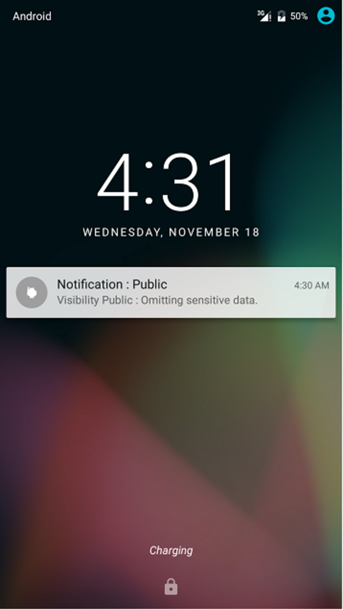{width="2.0in"
height="3.345138888888889in"}

図 5.1‑1

> ポイント：

1.  入力したパスワードはマスク表示（●で表示）する

&nbsp;
1.  パスワードを平文表示するオプションを用意する

2.  パスワード平文表示時の危険性を注意喚起する

> ポイント：　前回入力したパスワードを扱う場合には上記ポイントに加え、下記ポイントにも気を付けること

1.  Activity初期表示時に前回入力したパスワードがある場合、前回入力パスワードの桁数を推測されないよう固定桁数の●文字でダミー表示する

2.  前回入力パスワードをダミー表示しているとき、「パスワードを表示」した場合、前回入力パスワードをクリアして、新規にパスワードを入力できる状態とする

3.  前回入力パスワードをダミー表示しているとき、ユーザーがパスワードを入力しようとした場合、前回入力パスワードをクリアし、ユーザーの入力を新たなパスワードとして扱う

> password\_activity.xml

&lt;?xml version="1.0" encoding="utf-8"?&gt;

&lt;LinearLayout
xmlns:android="http://schemas.android.com/apk/res/android"

android:layout\_width="fill\_parent"

android:layout\_height="fill\_parent"

android:orientation="vertical"

android:padding="10dp" &gt;

&lt;!-- パスワード項目のラベル --&gt;

&lt;TextView

android:layout\_width="fill\_parent"

android:layout\_height="wrap\_content"

android:text="@string/password" /&gt;

&lt;!-- パスワード入力項目 --&gt;

&lt;!-- ★ポイント1★ 入力したパスワードはマスク表示（●で表示）する --&gt;

&lt;EditText

android:id="@+id/password\_edit"

android:layout\_width="fill\_parent"

android:layout\_height="wrap\_content"

android:hint="@string/hint\_password"

android:inputType="textPassword" /&gt;

&lt;!-- ★ポイント2★ パスワードを平文表示するオプションを用意する --&gt;

&lt;CheckBox

android:id="@+id/password\_display\_check"

android:layout\_width="fill\_parent"

android:layout\_height="wrap\_content"

android:text="@string/display\_password" /&gt;

&lt;!-- ★ポイント3★ パスワード平文表示時の危険性を注意喚起する --&gt;

&lt;TextView

android:layout\_width="fill\_parent"

android:layout\_height="wrap\_content"

android:text="@string/alert\_password" /&gt;

&lt;!-- キャンセル、OKボタン --&gt;

&lt;LinearLayout

android:layout\_width="fill\_parent"

android:layout\_height="wrap\_content"

android:layout\_marginTop="50dp"

android:gravity="center"

android:orientation="horizontal" &gt;

&lt;Button

android:layout\_width="0dp"

android:layout\_height="wrap\_content"

android:layout\_weight="1"

android:onClick="onClickCancelButton"

android:text="@android:string/cancel" /&gt;

&lt;Button

android:layout\_width="0dp"

android:layout\_height="wrap\_content"

android:layout\_weight="1"

android:onClick="onClickOkButton"

android:text="@android:string/ok" /&gt;

&lt;/LinearLayout&gt;

&lt;/LinearLayout&gt;

次のPasswordActivity.javaの最後に配置した3つのメソッドは用途に合わせて実装内容を調整すること。

-   private String getPreviousPassword()

-   private void onClickCancelButton(View view)

-   private void onClickOkButton(View view)

> PasswordActivity.java

package org.jssec.android.password.passwordinputui;

import android.app.Activity;

import android.os.Bundle;

import android.text.Editable;

import android.text.InputType;

import android.text.TextWatcher;

import android.view.View;

import android.view.WindowManager;

import android.widget.CheckBox;

import android.widget.CompoundButton;

import android.widget.CompoundButton.OnCheckedChangeListener;

import android.widget.EditText;

import android.widget.Toast;

public class PasswordActivity extends Activity {

// 状態保存用のキー

private static final String KEY\_DUMMY\_PASSWORD =
"KEY\_DUMMY\_PASSWORD";

// Activity内のView

private EditText mPasswordEdit;

private CheckBox mPasswordDisplayCheck;

// パスワードがダミー表示かを表すフラグ

private boolean mIsDummyPassword;

@Override

public void onCreate(Bundle savedInstanceState) {

super.onCreate(savedInstanceState);

setContentView(R.layout.password\_activity);

// スクリーンキャプチャを無効化する

getWindow().addFlags(WindowManager.LayoutParams.FLAG\_SECURE);

// Viewの取得

mPasswordEdit = (EditText) findViewById(R.id.password\_edit);

mPasswordDisplayCheck = (CheckBox)
findViewById(R.id.password\_display\_check);

// 前回入力パスワードがあるか

if (getPreviousPassword() != null) {

// ★ポイント4★ Activity初期表示時に前回入力したパスワードがある場合、

//
前回入力パスワードの桁数を推測されないよう固定桁数の●文字でダミー表示する

// 表示はダミーパスワードにする

mPasswordEdit.setText("\*\*\*\*\*\*\*\*\*\*");

//
パスワード入力時にダミーパスワードをクリアするため、テキスト変更リスナーを設定

mPasswordEdit.addTextChangedListener(new PasswordEditTextWatcher());

// ダミーパスワードフラグを設定する

mIsDummyPassword = true;

}

// パスワードを表示するオプションのチェック変更リスナーを設定

mPasswordDisplayCheck

.setOnCheckedChangeListener(new
OnPasswordDisplayCheckedChangeListener());

}

@Override

public void onSaveInstanceState(Bundle outState) {

super.onSaveInstanceState(outState);

// 画面の縦横変更でActivityが再生成されないよう指定した場合には不要

// Activityの状態保存

outState.putBoolean(KEY\_DUMMY\_PASSWORD, mIsDummyPassword);

}

@Override

public void onRestoreInstanceState(Bundle savedInstanceState) {

super.onRestoreInstanceState(savedInstanceState);

// 画面の縦横変更でActivityが再生成されないよう指定した場合には不要

// Activityの状態の復元

mIsDummyPassword = savedInstanceState.getBoolean(KEY\_DUMMY\_PASSWORD);

}

/\*\*

\* パスワードを入力した場合の処理

\*/

private class PasswordEditTextWatcher implements TextWatcher {

public void beforeTextChanged(CharSequence s, int start, int count,

int after) {

// 未使用

}

public void onTextChanged(CharSequence s, int start, int before,

int count) {

// ★ポイント6★
前回入力パスワードをダミー表示しているとき、ユーザーがパスワードを入力しようと

//
した場合、前回入力パスワードをクリアし、ユーザーの入力を新たなパスワードとして扱う

if (mIsDummyPassword) {

// ダミーパスワードフラグを設定する

mIsDummyPassword = false;

// パスワードを入力した文字だけにする

CharSequence work = s.subSequence(start, start + count);

mPasswordEdit.setText(work);

// カーソル位置が最初に戻るので最後にする

mPasswordEdit.setSelection(work.length());

}

}

public void afterTextChanged(Editable s) {

// 未使用

}

}

/\*\*

\* パスワードの表示オプションチェックを変更した場合の処理

\*/

private class OnPasswordDisplayCheckedChangeListener implements

OnCheckedChangeListener {

public void onCheckedChanged(CompoundButton buttonView,

boolean isChecked) {

// ★ポイント5★
前回入力パスワードをダミー表示しているとき、「パスワードを表示」した場合、

//
前回入力パスワードをクリアして、新規にパスワードを入力できる状態とする

if (mIsDummyPassword && isChecked) {

// ダミーパスワードフラグを設定する

mIsDummyPassword = false;

// パスワードを空表示にする

mPasswordEdit.setText(null);

}

// カーソル位置が最初に戻るので今のカーソル位置を記憶する

int pos = mPasswordEdit.getSelectionStart();

// ★ポイント2★ パスワードを平文表示するオプションを用意する

// InputTypeの作成

int type = InputType.TYPE\_CLASS\_TEXT;

if (isChecked) {

// チェックON時は平文表示

type |= InputType.TYPE\_TEXT\_VARIATION\_VISIBLE\_PASSWORD;

} else {

// チェックOFF時はマスク表示

type |= InputType.TYPE\_TEXT\_VARIATION\_PASSWORD;

}

// パスワードEditTextにInputTypeを設定

mPasswordEdit.setInputType(type);

// カーソル位置を設定する

mPasswordEdit.setSelection(pos);

}

}

// 以下のメソッドはアプリに合わせて実装すること

/\*\*

\* 前回入力パスワードを取得する

\*

\* @return 前回入力パスワード

\*/

private String getPreviousPassword() {

// 保存パスワードを復帰させたい場合にパスワード文字列を返す

// パスワードを保存しない用途ではnullを返す

return "hirake5ma";

}

/\*\*

\* キャンセルボタンの押下処理

\*

\* @param view

\*/

public void onClickCancelButton(View view) {

// Activityを閉じる

finish();

}

/\*\*

\* OKボタンの押下処理

\*

\* @param view

\*/

public void onClickOkButton(View view) {

// passwordを保存するとか認証に使うとか必要な処理を行う

String password = null;

if (mIsDummyPassword) {

//
最後までダミーパスワード表示だった場合は前回入力パスワードを確定パスワードとする

password = getPreviousPassword();

} else {

//
ダミーパスワード表示じゃない場合はユーザー入力パスワードを確定パスワードとする

password = mPasswordEdit.getText().toString();

}

// パスワードをToast表示する

Toast.makeText(this, "password is \\"" + password + "\\"",

Toast.LENGTH\_SHORT).show();

// Activityを閉じる

finish();

}

}

### ルールブック

パスワード入力画面を作る際には以下のルールを守ること。

1.  パスワードを入力するときにはマスク表示（●で表示する）機能を用意する
    > （必須）

&nbsp;
1.  パスワードを平文表示するオプションを用意する （必須）

2.  Activity起動時はパスワードをマスク表示にする （必須）

3.  前回入力したパスワードを表示する場合、ダミーパスワードを表示する
    > （必須）

#### パスワードを入力するときにはマスク表示（●で表示する）機能を用意する （必須）

スマートフォンは電車やバス等の人混みで利用されることが多く、第三者にパスワードを盗み見られるリスクが大きい。アプリの仕様として、パスワードをマスク表示する機能が必要である。

パスワードを入力するEditTextをマスク表示する方法には、静的にレイアウトXMLで指定する方法と、動的にプログラム上で切り替える方法の2種類がある。前者は、android:inputType属性に"textPassword"を指定することで実現でき、またandroid:password属性でも実現できる。後者は、EditTextクラスのsetInputType()メソッドでEditTextの入力タイプにInputType.TYPE\_TEXT\_VARIATION\_PASSWORDを追加することで実装できる。

以下、それぞれのサンプルコードを示す。

レイアウトXMLで指定する方法

> password\_activity.xml

&lt;!-- パスワード入力項目 --&gt;

&lt;!-- android:passwordをtrueに設定する --&gt;

&lt;EditText

android:id="@+id/password\_edit"

android:layout\_width="fill\_parent"

android:layout\_height="wrap\_content"

android:hint="@string/hint\_password"

android:inputType="textPassword" /&gt;

Activity内で指定する方法

> PasswordActivity.java

// パスワード表示タイプを設定

// InputTypeにTYPE\_TEXT\_VARIATION\_PASSWORDを設定する

EditText passwordEdit = (EditText) findViewById(R.id.password\_edit);

int type = InputType.TYPE\_CLASS\_TEXT

| InputType.TYPE\_TEXT\_VARIATION\_PASSWORD;

passwordEdit.setInputType(type);

#### パスワードを平文表示するオプションを用意する （必須）

スマートフォンにおけるパスワード入力はタッチパネルでの入力となるため、PC
でキーボード入力する場合と比較すると誤入力が生じやすい。その入力の煩わしさからユーザーは単純なパスワードを利用してしまう可能性があり、かえって危険である。また複数回のパスワード入力失敗によりアカウントをロックするなどのポリシーがある場合、誤入力はできるだけ避けるようにする必要もある。それらの解決策として、パスワードを平文表示できるオプションを用意することで、安全なパスワードを利用してもらえるようになる。

ただし、パスワードを平文表示した際に覗き見される可能性もあるため、そのオプションを使う際に、ユーザーに背後からの覗き見への注意を促す必要がある。また、平文表示するオプションをつけた場合、平文表示の時間を設定するなど平文表示の自動解除を行う仕組みも用意する必要がある。パスワードの平文表示の制限については今後の版にて別途記事を設ける予定である。そのため、この版のサンプルコードにはパスワードの平文表示の制限は含めていない。

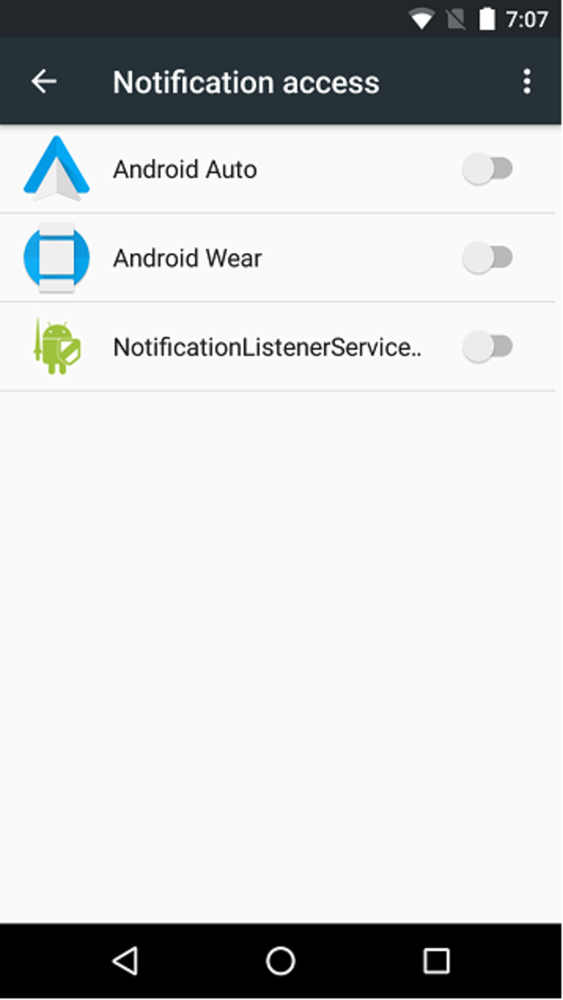{width="5.786111111111111in"
height="3.345833333333333in"}

図 5.1‑2

EditTextのInputType指定で、マスク表示と平文表示を切り替えることができる

> PasswordActivity.java

/\*\*

\* パスワードの表示オプションチェックを変更した場合の処理

\*/

private class OnPasswordDisplayCheckedChangeListener implements

OnCheckedChangeListener {

public void onCheckedChanged(CompoundButton buttonView,

boolean isChecked) {

// ★ポイント5★ ダミー表示時は空表示にする

if (mIsDummyPassword && isChecked) {

// ダミーパスワードフラグを設定する

mIsDummyPassword = false;

// パスワードを空表示にする

mPasswordEdit.setText(null);

}

// カーソル位置が最初に戻るので今のカーソル位置を記憶する

int pos = mPasswordEdit.getSelectionStart();

// ★ポイント2★ チェックに応じてパスワードを平文表示する

// InputTypeの作成

int type = InputType.TYPE\_CLASS\_TEXT;

if (isChecked) {

// チェックON時は平文表示

type |= InputType.TYPE\_TEXT\_VARIATION\_VISIBLE\_PASSWORD;

} else {

// チェックOFF時はマスク表示

type |= InputType.TYPE\_TEXT\_VARIATION\_PASSWORD;

}

// パスワードEditTextにInputTypeを設定

mPasswordEdit.setInputType(type);

// カーソル位置を設定する

mPasswordEdit.setSelection(pos);

}

}

#### Activity起動時はパスワードをマスク表示にする （必須）

意図せずパスワード表示してしまい、第三者に見られることを防ぐため、Activity起動時にパスワードを表示するオプションのデフォルト値はオフにするべきである。デフォルト値は安全側に定めるのが基本である。

#### 前回入力したパスワードを表示する場合、ダミーパスワードを表示する （必須）

前回入力したパスワードを指定する場合、第三者にパスワードのヒントを与えないように、固定文字数のマスク文字（●など）でダミー表示するべきである。また、ダミー表示時に「パスワードを表示する」とした場合は、パスワードをクリアしてから平文表示モードにする。これにより、スマートフォンが盗難される等によって第三者の手に渡ったとしても前回入力したパスワードが盗み見られる危険性を低く抑えることができる。なお、ダミー表示時にユーザーがパスワードを入力しようとした場合には、ダミー表示を解除して通常の入力状態に戻す必要がある。

前回入力したパスワードを表示する場合、ダミーパスワードを表示する

> PasswordActivity.java

@Override

public void onCreate(Bundle savedInstanceState) {

～省略～

// 前回入力パスワードがあるか

if (getPreviousPassword() != null) {

// ★ポイント4★ 前回入力パスワードがある場合はダミーパスワードを表示する

// 表示はダミーパスワードにする

mPasswordEdit.setText("\*\*\*\*\*\*\*\*\*\*");

//
パスワード入力時にダミーパスワードをクリアするため、テキスト変更リスナーを設定

mPasswordEdit.addTextChangedListener(new PasswordEditTextWatcher());

// ダミーパスワードフラグを設定する

mIsDummyPassword = true;

}

～省略～

}

/\*\*

\* 前回入力パスワードを取得する

\*

\* @return 前回入力パスワード

\*/

private String getPreviousPassword() {

// 保存パスワードを復帰させたい場合にパスワード文字列を返す

// パスワードを保存しない用途ではnullを返す

return "hirake5ma";

}

ダミー表示時は、パスワードを表示するオプションをオンにすると表示内容をクリアする

> PasswordActivity.java

/\*\*

\* パスワードの表示オプションチェックを変更した場合の処理

\*/

private class OnPasswordDisplayCheckedChangeListener implements

OnCheckedChangeListener {

public void onCheckedChanged(CompoundButton buttonView,

boolean isChecked) {

// ★ポイント5★ ダミー表示時は空表示にする

if (mIsDummyPassword && isChecked) {

// ダミーパスワードフラグを設定する

mIsDummyPassword = false;

// パスワードを空表示にする

mPasswordEdit.setText(null);

}

～省略～

}

}

ダミー表示時にユーザーがパスワードを入力した場合には、ダミー表示を解除する

> PasswordActivity.java

// 状態保存用のキー

private static final String KEY\_DUMMY\_PASSWORD =
"KEY\_DUMMY\_PASSWORD";

～省略～

// パスワードがダミー表示かを表すフラグ

private boolean mIsDummyPassword;

@Override

public void onCreate(Bundle savedInstanceState) {

～省略～

// 前回入力パスワードがあるか

if (getPreviousPassword() != null) {

// ★ポイント4★ 前回入力パスワードがある場合はダミーパスワードを表示する

// 表示はダミーパスワードにする

mPasswordEdit.setText("\*\*\*\*\*\*\*\*\*\*");

//
パスワード入力時にダミーパスワードをクリアするため、テキスト変更リスナーを設定

mPasswordEdit.addTextChangedListener(new PasswordEditTextWatcher());

// ダミーパスワードフラグを設定する

mIsDummyPassword = true;

}

～省略～

}

@Override

public void onSaveInstanceState(Bundle outState) {

super.onSaveInstanceState(outState);

// 画面の縦横変更でActivityが再生成されないよう指定した場合には不要

// Activityの状態保存

outState.putBoolean(KEY\_DUMMY\_PASSWORD, mIsDummyPassword);

}

@Override

public void onRestoreInstanceState(Bundle savedInstanceState) {

super.onRestoreInstanceState(savedInstanceState);

// 画面の縦横変更でActivityが再生成されないよう指定した場合には不要

// Activityの状態の復元

mIsDummyPassword = savedInstanceState.getBoolean(KEY\_DUMMY\_PASSWORD);

}

/\*\*

\* パスワードを入力した場合の処理

\*/

private class PasswordEditTextWatcher implements TextWatcher {

public void beforeTextChanged(CharSequence s, int start, int count,

int after) {

// 未使用

}

public void onTextChanged(CharSequence s, int start, int before,

int count) {

// ★ポイント6★
ダミー表示時にパスワードを再入力した場合は入力内容に応じた表示にする

if (mIsDummyPassword) {

// ダミーパスワードフラグを設定する

mIsDummyPassword = false;

// パスワードを入力した文字だけにする

CharSequence work = s.subSequence(start, start + count);

mPasswordEdit.setText(work);

// カーソル位置が最初に戻るので最後にする

mPasswordEdit.setSelection(work.length());

}

}

public void afterTextChanged(Editable s) {

// 未使用

}

}

### アドバンスト

#### ログイン処理について

パスワード入力が求められる場面の代表例はログイン処理である。ログイン処理で気を付けるポイントをいくつか紹介する。

##### ログイン失敗時のエラーメッセージ

ログイン処理ではID（アカウント）とパスワードの2つの情報を入力する。ログイン失敗時にはIDが存在しない場合と、IDは存在するがパスワードが間違っている場合の2つがある。ログイン失敗のメッセージでこの2つの場合を区別して表示すると、攻撃者は「指定したIDが存在するか否か」を推測できてしまう。このような推測を許さないためにも、ログイン失敗時のメッセージでは、上記2つの場合を区別せずに下記のように表示すべきである。

メッセージ例： ログインID または パスワード が間違っています。

##### 自動ログイン機能

一度、ログイン処理が成功すると次回以降はログインIDとパスワードの入力を省略して、自動的にログインを行う機能がある。自動ログイン機能は煩わしい入力が省略できるので利便性が高まるが、その反面スマートフォンが盗難された場合に第三者に悪用されるリスクが伴う。

第三者に悪用された場合の被害が受け入れられる用途か、十分なセキュリティ対策が可能な場合にのみ、自動ログイン機能は利用することができる。例えば、オンラインバンキングアプリの場合、第三者に端末を操作されると金銭的な被害が出るので自動ログイン機能に合わせてセキュリティ対策が必須となる。対策としては、「決済処理などの金銭的な処理が発生する直前にはパスワードの再入力を求める」、「自動ログイン設定時にユーザーに対して十分に注意を喚起し、確実な端末のロックを促す」などいくつか考えられる。自動ログインの利用にあたっては、これらの対策を前提に利便性とリスクを勘案して、慎重な検討を行うべきである。

#### パスワード変更について

一度設定したパスワードを別のパスワードに変更する場合、以下の入力項目を画面上に用意すべきである。

-   現在のパスワード

-   新しいパスワード

-   新しいパスワード（入力確認用）

自動ログイン機能がついている場合、第三者がアプリを利用できる可能性がある。その場合、勝手にパスワードを変更されないよう、現在のパスワードの入力を求める必要がある。また、新しいパスワードが入力ミスで使用不能に陥る危険を減らすため、新しいパスワードは2回、入力を求める必要がある。

#### システムの「パスワードを表示」設定メニューについて

Androidの設定メニューの中に「パスワードを表示」という設定がある。

設定 &gt;セキュリティ &gt; パスワードを表示

Android 5.0より前のバージョンまで、この手順で設定できる。ただしAndroid
5.0以降では、「パスワードを表示」はチェックボックスからトグルボタンに変更されている。

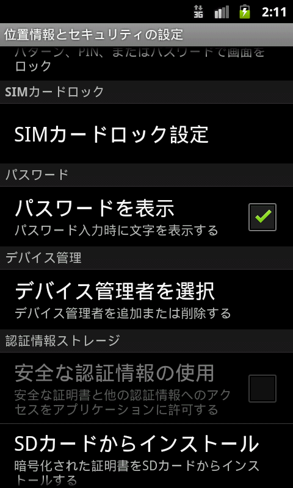{width="1.6598425196850393in"
height="2.7598425196850394in"}

図 5.1‑3

「パスワードを表示」設定をオンにすると最後に入力した１文字が平文表示となる。一定時間（2秒程度）経過後、または次の文字が入力されると平文表示されていた文字はマスク表示される。オフにすると、入力直後からマスク表示となる。これはシステム全体に影響する設定であり、EditTextのパスワード表示機能を使用しているすべてのアプリに適用される。

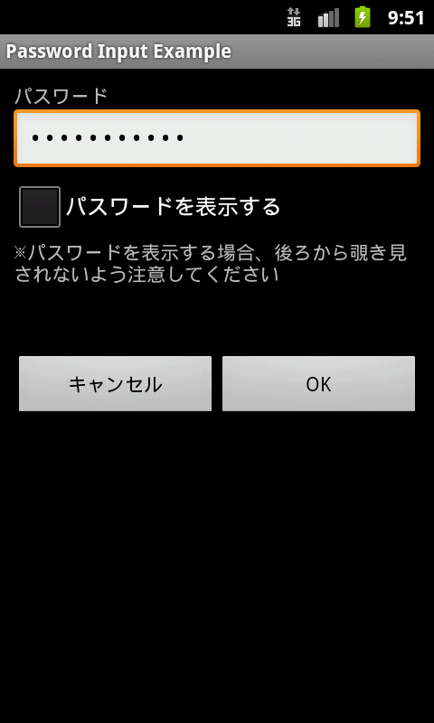{width="5.404166666666667in"
height="3.011111111111111in"}

図 5.1‑4

#### スクリーンキャプチャの無効化

パスワード入力画面ではパスワードなどの個人情報が画面上に表示される可能性がある。そのような画面では第三者によってスクリーンキャプチャから個人情報が流出してしまう恐れがある。よってパスワード入力画面などの個人情報が表示されてしまう恐れのある画面ではスクリーンキャプチャを無効にしておく必要がある。スクリーンキャプチャの無効化はWindowManagerにaddFlagでFLAG\_SECUREを設定することで実現できる。

PermissionとProtection Level
----------------------------

PermissionのProtection Levelにはnormal, dangerous, signature,
signatureOrSystemの4種類がある。その他に「development」「system」「appop」も存在するが、一般的なアプリでは使用しないので本章での説明は省略する。PermissionはどのProtection
Levelであるかによってそれぞれ、Normal Permission, Dangerous Permission,
Signature Permission, SignatureOrSystem
Permissionと呼ばれる。以下、このような名称を使う。

### サンプルコード

#### Android　OS既定のPermissionを利用する方法

Android
OSは電話帳やGPSなどのユーザー資産をマルウェアから保護するためのPermissionというセキュリティの仕組みがある。Android
OSが保護対象としている、こうした情報や機能にアクセスするアプリは、明示的にそれらにアクセスするための権限（Permission）を利用宣言しなければならない。ユーザー確認が必要なPermissionでは、そのPermissionを利用宣言したアプリがインストールされるときに次のようなユーザー確認画面が表示される[^24]。

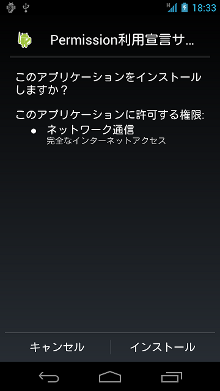{width="1.8645833333333333in"
height="3.34375in"}

図 5.2‑1

この確認画面により、ユーザーはそのアプリがどのような機能や情報にアクセスしようとしているのかを知ることができる。もし、アプリの動作に明らかに不必要な機能や情報にアクセスしようとしている場合は、そのアプリは悪意があるアプリの可能性が高い。ゆえに自分のアプリがマルウェアであると疑われないためにも、利用宣言するPermissionは最小限にしなければならない。

> ポイント：

1.  利用するPermissionをAndroidManifest.xmlにuses-permissionで利用宣言する

2.  不必要なPermissionは利用宣言しない

> AndroidManifest.xml

&lt;?xml version="1.0" encoding="utf-8"?&gt;

&lt;manifest xmlns:android="http://schemas.android.com/apk/res/android"

package="org.jssec.android.permission.usespermission"&gt;

&lt;!-- ★ポイント1★ アプリで利用するPermissionを利用宣言する --&gt;

&lt;!-- インターネットにアクセスするPermission --&gt;

&lt;uses-permission android:name="android.permission.INTERNET"/&gt;

&lt;!-- ★ポイント2★ 不必要なPermissionは利用宣言しない --&gt;

&lt;!--
アプリの動作に不必要なPermissionを利用宣言していると、ユーザーに不信感を与えてしまう
--&gt;

&lt;application

android:allowBackup="false"

android:icon="@drawable/ic\_launcher"

android:label="@string/app\_name" &gt;

&lt;activity

android:name=".MainActivity"

android:label="@string/app\_name"

android:exported="true" &gt;

&lt;intent-filter&gt;

&lt;action android:name="android.intent.action.MAIN" /&gt;

&lt;category android:name="android.intent.category.LAUNCHER" /&gt;

&lt;/intent-filter&gt;

&lt;/activity&gt;

&lt;/application&gt;

&lt;/manifest&gt;

#### 独自定義のSignature Permissionで自社アプリ連携する方法

Android
OSが定義する既定のPermissionの他に、アプリが独自にPermissionを定義することができる。独自定義のPermission（正確には独自定義のSignature　Permission）を使えば、自社アプリだけが連携できる仕組みを作ることができる。複数の自社製アプリをインストールした場合に、それぞれのアプリの単機能に加え、アプリ間連携による複合機能を提供することで、複数の自社製アプリをシリーズ販売して収益を上げる、といった用途がある。

サンプルプログラム「独自定義Signature
Permission（UserApp）」はサンプルプログラム「独自定義Signature
Permission（ProtectedApp）」にstartActivity()する。両アプリは同じ開発者鍵で署名されている必要がある。もし署名した開発者鍵が異なる場合は、UserAppはIntentを送信せず、ProtectedAppは受信したIntentを処理しない。またアドバンストセクションで説明しているインストール順序によるSignature
Permission回避の問題にも対処している。

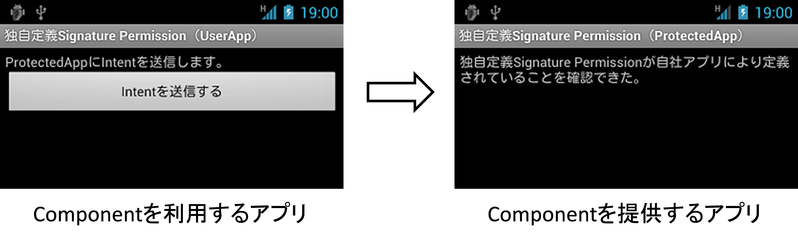{width="6.889763779527559in"
height="2.0933070866141734in"}

図 5.2‑2

> ポイント：Componentを提供するアプリ

1.  独自PermissionをprotectionLevel="signature"で定義する

&nbsp;
1.  Componentにはpermission属性で独自Permission名を指定する

2.  ComponentがActivityの場合にはintent-filterを定義しない

3.  ソースコード上で、独自定義Signature
    Permissionが自社アプリにより定義されていることを確認する

4.  Componentを利用するアプリと同じ開発者鍵でAPKを署名する

> AndroidManifest.xml

&lt;?xml version="1.0" encoding="utf-8"?&gt;

&lt;manifest xmlns:android="http://schemas.android.com/apk/res/android"

package="org.jssec.android.permission.protectedapp"&gt;

&lt;!-- ★ポイント1★
独自PermissionをprotectionLevel="signature"で定義する --&gt;

&lt;permission

android:name="org.jssec.android.permission.protectedapp.MY\_PERMISSION"

android:protectionLevel="signature" /&gt;

&lt;application

android:allowBackup="false"

android:icon="@drawable/ic\_launcher"

android:label="@string/app\_name" &gt;

&lt;!-- ★ポイント2★
Componentにはpermission属性で独自Permission名を指定する --&gt;

&lt;activity

android:name=".ProtectedActivity"

android:exported="true"

android:label="@string/app\_name"

android:permission="org.jssec.android.permission.protectedapp.MY\_PERMISSION"
&gt;

&lt;!-- ★ポイント3★
ComponentがActivityの場合にはintent-filterを定義しない --&gt;

&lt;/activity&gt;

&lt;/application&gt;

&lt;/manifest&gt;

> ProtectedActivity.java

package org.jssec.android.permission.protectedapp;

import org.jssec.android.shared.SigPerm;

import org.jssec.android.shared.Utils;

import android.app.Activity;

import android.content.Context;

import android.os.Bundle;

import android.widget.TextView;

public class ProtectedActivity extends Activity {

// 自社のSignature Permission

private static final String MY\_PERMISSION =
"org.jssec.android.permission.protectedapp.MY\_PERMISSION";

// 自社の証明書のハッシュ値

private static String sMyCertHash = null;

private static String myCertHash(Context context) {

if (sMyCertHash == null) {

if (Utils.isDebuggable(context)) {

// debug.keystoreの"androiddebugkey"の証明書ハッシュ値

sMyCertHash = "0EFB7236 328348A9 89718BAD DF57F544 D5CCB4AE B9DB34BC
1E29DD26 F77C8255";

} else {

// keystoreの"my company key"の証明書ハッシュ値

sMyCertHash = "D397D343 A5CBC10F 4EDDEB7C A10062DE 5690984F 1FB9E88B
D7B3A7C2 42E142CA";

}

}

return sMyCertHash;

}

private TextView mMessageView;

@Override

public void onCreate(Bundle savedInstanceState) {

super.onCreate(savedInstanceState);

setContentView(R.layout.main);

mMessageView = (TextView) findViewById(R.id.messageView);

// ★ポイント4★ ソースコード上で、独自定義Signature
Permissionが自社アプリにより定義されていることを確認する

if (!SigPerm.test(this, MY\_PERMISSION, myCertHash(this))) {

mMessageView.setText("独自定義Signature
Permissionが自社アプリにより定義されていない。");

return;

}

// ★ポイント4★ 証明書が一致する場合にのみ、処理を続行する

mMessageView.setText("独自定義Signature
Permissionが自社アプリにより定義されていることを確認できた。");

}

}

> SigPerm.java

package org.jssec.android.shared;

import android.content.Context;

import android.content.pm.PackageManager;

import android.content.pm.PackageManager.NameNotFoundException;

import android.content.pm.PermissionInfo;

public class SigPerm {

public static boolean test(Context ctx, String sigPermName, String
correctHash) {

if (correctHash == null) return false;

correctHash = correctHash.replaceAll(" ", "");

return correctHash.equals(hash(ctx, sigPermName));

}

public static String hash(Context ctx, String sigPermName) {

if (sigPermName == null) return null;

try {

// sigPermNameを定義したアプリのパッケージ名を取得する

PackageManager pm = ctx.getPackageManager();

PermissionInfo pi;

pi = pm.getPermissionInfo(sigPermName, PackageManager.GET\_META\_DATA);

String pkgname = pi.packageName;

// 非Signature Permissionの場合は失敗扱い

if (pi.protectionLevel != PermissionInfo.PROTECTION\_SIGNATURE) return
null;

// sigPermNameを定義したアプリの証明書のハッシュ値を返す

return PkgCert.hash(ctx, pkgname);

} catch (NameNotFoundException e) {

return null;

}

}

}

> PkgCert.java

package org.jssec.android.shared;

import java.security.MessageDigest;

import java.security.NoSuchAlgorithmException;

import android.content.Context;

import android.content.pm.PackageInfo;

import android.content.pm.PackageManager;

import android.content.pm.PackageManager.NameNotFoundException;

import android.content.pm.Signature;

public class PkgCert {

public static boolean test(Context ctx, String pkgname, String
correctHash) {

if (correctHash == null) return false;

correctHash = correctHash.replaceAll(" ", "");

return correctHash.equals(hash(ctx, pkgname));

}

public static String hash(Context ctx, String pkgname) {

if (pkgname == null) return null;

try {

PackageManager pm = ctx.getPackageManager();

PackageInfo pkginfo = pm.getPackageInfo(pkgname,
PackageManager.GET\_SIGNATURES);

if (pkginfo.signatures.length != 1) return null; // 複数署名は扱わない

Signature sig = pkginfo.signatures\[0\];

byte\[\] cert = sig.toByteArray();

byte\[\] sha256 = computeSha256(cert);

return byte2hex(sha256);

} catch (NameNotFoundException e) {

return null;

}

}

private static byte\[\] computeSha256(byte\[\] data) {

try {

return MessageDigest.getInstance("SHA-256").digest(data);

} catch (NoSuchAlgorithmException e) {

return null;

}

}

private static String byte2hex(byte\[\] data) {

if (data == null) return null;

final StringBuilder hexadecimal = new StringBuilder();

for (final byte b : data) {

hexadecimal.append(String.format("%02X", b));

}

return hexadecimal.toString();

}

}

★ポイント5★ Android Studioからメニュー：Build -&gt; Generated Signed
APKと選択し、Componentを提供するアプリと同じ開発者鍵で署名する。

{width="4.646481846019247in"
height="3.2817082239720037in"}

図 5.2‑3

> ポイント：Componentを利用するアプリ

1.  独自定義Signature Permissionは定義しない

&nbsp;
1.  uses-permissionにより独自Permissionを利用宣言する

2.  ソースコード上で、独自定義Signature
    Permissionが自社アプリにより定義されていることを確認する

3.  利用先アプリが自社アプリであることを確認する

4.  利用先ComponentがActivityの場合、明示的Intentを使う

5.  Componentを提供するアプリと同じ開発者鍵でAPKを署名する

> AndroidManifest.xml

&lt;?xml version="1.0" encoding="utf-8"?&gt;

&lt;manifest xmlns:android="http://schemas.android.com/apk/res/android"

package="org.jssec.android.permission.userapp"&gt;

&lt;!-- ★ポイント6★ 独自定義Signature Permissionは定義しない --&gt;

&lt;!-- ★ポイント7★ uses-permissionにより独自Permissionを利用宣言する
--&gt;

&lt;uses-permission

android:name="org.jssec.android.permission.protectedapp.MY\_PERMISSION"
/&gt;

&lt;application

android:allowBackup="false"

android:icon="@drawable/ic\_launcher"

android:label="@string/app\_name" &gt;

&lt;activity

android:name=".UserActivity"

android:label="@string/app\_name"

android:exported="true" &gt;

&lt;intent-filter&gt;

&lt;action android:name="android.intent.action.MAIN" /&gt;

&lt;category android:name="android.intent.category.LAUNCHER" /&gt;

&lt;/intent-filter&gt;

&lt;/activity&gt;

&lt;/application&gt;

&lt;/manifest&gt;

> UserActivity.java

package org.jssec.android.permission.userapp;

import org.jssec.android.shared.PkgCert;

import org.jssec.android.shared.SigPerm;

import org.jssec.android.shared.Utils;

import android.app.Activity;

import android.content.Context;

import android.content.Intent;

import android.os.Bundle;

import android.view.View;

import android.widget.Toast;

public class UserActivity extends Activity {

// 利用先のActivity情報

private static final String TARGET\_PACKAGE =
"org.jssec.android.permission.protectedapp";

private static final String TARGET\_ACTIVITY =
"org.jssec.android.permission.protectedapp.ProtectedActivity";

// 自社のSignature Permission

private static final String MY\_PERMISSION =
"org.jssec.android.permission.protectedapp.MY\_PERMISSION";

// 自社の証明書のハッシュ値

private static String sMyCertHash = null;

private static String myCertHash(Context context) {

if (sMyCertHash == null) {

if (Utils.isDebuggable(context)) {

// debug.keystoreの"androiddebugkey"の証明書ハッシュ値

sMyCertHash = "0EFB7236 328348A9 89718BAD DF57F544 D5CCB4AE B9DB34BC
1E29DD26 F77C8255";

} else {

// keystoreの"my company key"の証明書ハッシュ値

sMyCertHash = "D397D343 A5CBC10F 4EDDEB7C A10062DE 5690984F 1FB9E88B
D7B3A7C2 42E142CA";

}

}

return sMyCertHash;

}

@Override

public void onCreate(Bundle savedInstanceState) {

super.onCreate(savedInstanceState);

setContentView(R.layout.main);

}

public void onSendButtonClicked(View view) {

// ★ポイント8★ ソースコード上で、独自定義Signature
Permissionが自社アプリにより定義されていることを確認する

if (!SigPerm.test(this, MY\_PERMISSION, myCertHash(this))) {

Toast.makeText(this, "独自定義Signature
Permissionが自社アプリにより定義されていない。",
Toast.LENGTH\_LONG).show();

return;

}

// ★ポイント9★ 利用先アプリが自社アプリであることを確認する

if (!PkgCert.test(this, TARGET\_PACKAGE, myCertHash(this))) {

Toast.makeText(this, "利用先アプリは自社アプリではない。",
Toast.LENGTH\_LONG).show();

return;

}

// ★ポイント10★ 利用先ComponentがActivityの場合、明示的Intentを使う

try {

Intent intent = new Intent();

intent.setClassName(TARGET\_PACKAGE, TARGET\_ACTIVITY);

startActivity(intent);

} catch(Exception e) {

Toast.makeText(this,

String.format("例外発生:%s", e.getMessage()),

Toast.LENGTH\_LONG).show();

}

}

}

> PkgCertWhitelists.java

package org.jssec.android.shared;

import java.util.HashMap;

import java.util.Map;

import android.content.Context;

public class PkgCertWhitelists {

private Map&lt;String, String&gt; mWhitelists = new HashMap&lt;String,
String&gt;();

public boolean add(String pkgname, String sha256) {

if (pkgname == null) return false;

if (sha256 == null) return false;

sha256 = sha256.replaceAll(" ", "");

if (sha256.length() != 64) return false; // SHA-256は32バイト

sha256 = sha256.toUpperCase();

if (sha256.replaceAll("\[0-9A-F\]+", "").length() != 0) return false; //
0-9A-F 以外の文字がある

mWhitelists.put(pkgname, sha256);

return true;

}

public boolean test(Context ctx, String pkgname) {

// pkgnameに対応する正解のハッシュ値を取得する

String correctHash = mWhitelists.get(pkgname);

// pkgnameの実際のハッシュ値と正解のハッシュ値を比較する

return PkgCert.test(ctx, pkgname, correctHash);

}

}

> PkgCert.java

package org.jssec.android.shared;

import java.security.MessageDigest;

import java.security.NoSuchAlgorithmException;

import android.content.Context;

import android.content.pm.PackageInfo;

import android.content.pm.PackageManager;

import android.content.pm.PackageManager.NameNotFoundException;

import android.content.pm.Signature;

public class PkgCert {

public static boolean test(Context ctx, String pkgname, String
correctHash) {

if (correctHash == null) return false;

correctHash = correctHash.replaceAll(" ", "");

return correctHash.equals(hash(ctx, pkgname));

}

public static String hash(Context ctx, String pkgname) {

if (pkgname == null) return null;

try {

PackageManager pm = ctx.getPackageManager();

PackageInfo pkginfo = pm.getPackageInfo(pkgname,
PackageManager.GET\_SIGNATURES);

if (pkginfo.signatures.length != 1) return null; // 複数署名は扱わない

Signature sig = pkginfo.signatures\[0\];

byte\[\] cert = sig.toByteArray();

byte\[\] sha256 = computeSha256(cert);

return byte2hex(sha256);

} catch (NameNotFoundException e) {

return null;

}

}

private static byte\[\] computeSha256(byte\[\] data) {

try {

return MessageDigest.getInstance("SHA-256").digest(data);

} catch (NoSuchAlgorithmException e) {

return null;

}

}

private static String byte2hex(byte\[\] data) {

if (data == null) return null;

final StringBuilder hexadecimal = new StringBuilder();

for (final byte b : data) {

hexadecimal.append(String.format("%02X", b));

}

return hexadecimal.toString();

}

}

★ポイント11★ Android Studioからメニュー：Build -&gt; Generated Signed
APKと選択し、Componentを提供するアプリと同じ開発者鍵で署名する。

{width="4.646481846019247in"
height="3.2817082239720037in"}

図 5.2‑4

#### アプリの証明書のハッシュ値を確認する方法

このガイド文書の各所で出てくるアプリの証明書のハッシュ値を確認する方法を紹介する。厳密には「APKを署名するときに使った開発者鍵の公開鍵証明書のSHA256ハッシュ値」を確認する方法である。

##### Keytoolにより確認する方法

JDKに付属するkeytoolというプログラムを利用すると開発者鍵の公開鍵証明書のハッシュ値（証明書のフィンガープリントとも言う）を求めることができる。ハッシュ値にはハッシュアルゴリズムの違いによりMD5やSHA1、SHA256など様々なものがあるが、このガイド文書では暗号ビット長の安全性を考慮してSHA256の利用を推奨している。残念なことにAndroid
SDKで利用されているJDK6に付属するkeytoolはSHA256でのハッシュ値出力に対応しておらず、JDK7に付属するkeytoolを使う必要がある。

> Androidのデバッグ証明書の内容をkeytoolで出力する例

&gt; keytool -list -v -keystore &lt;キーストアファイル&gt; -storepass
&lt;パスワード&gt;

キーストアのタイプ: JKS

キーストア・プロバイダ: SUN

キーストアには1エントリが含まれます

別名: androiddebugkey

作成日: 2012/01/11

エントリ・タイプ: PrivateKeyEntry

証明書チェーンの長さ: 1

証明書\[1\]:

所有者: CN=Android Debug, O=Android, C=US

発行者: CN=Android Debug, O=Android, C=US

シリアル番号: 4f0cef98

有効期間の開始日: Wed Jan 11 11:10:32 JST 2012終了日: Fri Jan 03
11:10:32 JST 2042

証明書のフィンガプリント:

MD5: 9E:89:53:18:06:B2:E3:AC:B4:24:CD:6A:56:BF:1E:A1

SHA1: A8:1E:5D:E5:68:24:FD:F6:F1:ED:2F:C3:6E:0F:09:A3:07:F8:5C:0C

SHA256:
FB:75:E9:B9:2E:9E:6B:4D:AB:3F:94:B2:EC:A1:F0:33:09:74:D8:7A:CF:42:58:22:A2:56:85:1B:0F:85:C6:35

署名アルゴリズム名: SHA1withRSA

バージョン: 3

\*\*\*\*\*\*\*\*\*\*\*\*\*\*\*\*\*\*\*\*\*\*\*\*\*\*\*\*\*\*\*\*\*\*\*\*\*\*\*\*\*\*\*

\*\*\*\*\*\*\*\*\*\*\*\*\*\*\*\*\*\*\*\*\*\*\*\*\*\*\*\*\*\*\*\*\*\*\*\*\*\*\*\*\*\*\*

##### JSSEC証明書ハッシュ値チェッカーにより確認する方法

JDK7をインストールしなくても、JSSEC証明書ハッシュ値チェッカーを使えば簡単に証明書ハッシュ値を確認できる。

{width="3.93125in"
height="2.2180555555555554in"}

図 5.2‑5

これは端末にインストールされているアプリの証明書ハッシュ値を一覧表示するAndroidアプリである。上図中、「sha-256」の右に表示されている16進数文字列64文字が証明書ハッシュ値である。このガイド文書と一緒に配布しているサンプルコードの「JSSEC
CertHash
Checker」フォルダがそのソースコード一式である。ビルドして活用していただきたい。

#### Android 6.0以降でDangerous Permissionを利用する方法

アプリに対するPermission付与のタイミングについて、Android 6.0(API Level
23)でアプリの実装にかかわる仕様変更が行われた。

Android 5.1(API Level 22)以前のPermissionモデル（「5.2.3.6 Android
6.0以降のPermissionモデルの仕様変更について」参照）では、アプリが利用宣言しているPermissionは全てアプリのインストール時に付与される。しかし、Android
6.0以降では、Dangerous
Permissionについてはアプリが適切なタイミングでPermissionを要求するよう、アプリ開発者が明示的に実装しなければならない。アプリがPermissionを要求すると、Android
OSはユーザーに対して下記のような確認画面を表示し、そのPermissionの利用を許可するかどうかの判断を求めることになる。ユーザーがPermissionの利用を許可すれば、アプリはそのPermissionを必要とする処理を実行することができる。

{width="2.0072648731408576in"
height="3.571259842519685in"}

図 5.2‑6

Permissionを付与する単位にも変更が加えられている。従来はすべてのPermissionが一括して付与されていたが、Android
6.0（API Level 23）以降、Permission（Permission
Group）毎に個別に付与される。これに伴いユーザー確認画面も個別に表示され、ユーザーはPermission利用の可・不可について従来よりも柔軟に判断できるようになった。アプリ開発者は、Permissionの付与が拒否された場合も考慮して、アプリの仕様や設計を見直す必要がある。

Android 6.0以降のPermissionモデルについての詳細は「5.2.3.6 Android
6.0以降のPermissionモデルの仕様変更について」を参照すること。

> ポイント

1.  アプリで利用するPermissionを利用宣言する

2.  不必要なPermissionは利用宣言しない

3.  Permissionがアプリに付与されているか確認する

4.  Permissionを要求する（ユーザーに許可を求めるダイアログを表示する）

5.  Permissionの利用が許可されていない場合の処理を実装する

> AndroidManifest.xml

&lt;?xml version="1.0" encoding="utf-8"?&gt;

&lt;manifest xmlns:android="http://schemas.android.com/apk/res/android"

package="org.jssec.android.permission.permissionrequestingpermissionatruntime"
&gt;

&lt;!-- ★ポイント1★ アプリで利用するPermissionを利用宣言する --&gt;

&lt;!-- 連絡先情報を読み取るPermission (Protection Level: dangerous)
--&gt;

&lt;uses-permission android:name="android.permission.READ\_CONTACTS"
/&gt;

&lt;!-- ★ポイント2★ 不必要なPermissionは利用宣言しない --&gt;

&lt;application

android:allowBackup="true"

android:icon="@mipmap/ic\_launcher"

android:label="@string/app\_name"

android:supportsRtl="true"

android:theme="@style/AppTheme" &gt;

&lt;activity

android:name=".MainActivity"

android:exported="true"&gt;

&lt;intent-filter&gt;

&lt;action android:name="android.intent.action.MAIN" /&gt;

&lt;category android:name="android.intent.category.LAUNCHER" /&gt;

&lt;/intent-filter&gt;

&lt;/activity&gt;

&lt;activity

android:name=".ContactListActivity"

android:exported="false"&gt;

&lt;/activity&gt;

&lt;/application&gt;

&lt;/manifest&gt;

> MainActivity.java

package
org.jssec.android.permission.permissionrequestingpermissionatruntime;

import android.Manifest;

import android.content.Intent;

import android.content.pm.PackageManager;

import android.os.Bundle;

import android.support.v4.app.ActivityCompat;

import android.support.v4.content.ContextCompat;

import android.support.v7.app.AppCompatActivity;

import android.view.View;

import android.widget.Button;

import android.widget.Toast;

public class MainActivity extends AppCompatActivity implements
View.OnClickListener {

private static final int REQUEST\_CODE\_READ\_CONTACTS = 0;

@Override

protected void onCreate(Bundle savedInstanceState) {

super.onCreate(savedInstanceState);

setContentView(R.layout.activity\_main);

Button button = (Button)findViewById(R.id.button);

button.setOnClickListener(this);

}

@Override

public void onClick(View v) {

readContacts();

}

private void readContacts() {

// ★ポイント3★ Permissionがアプリに付与されているか確認する

if (ContextCompat.checkSelfPermission(getApplicationContext(),
Manifest.permission.READ\_CONTACTS) !=
PackageManager.PERMISSION\_GRANTED) {

// Permissionが付与されていない

// ★ポイント4★
Permissionを要求する(ユーザーに許可を求めるダイアログを表示する)

ActivityCompat.requestPermissions(this, new
String\[\]{Manifest.permission.READ\_CONTACTS},
REQUEST\_CODE\_READ\_CONTACTS);

} else {

// Permissionがすでに付与されている

showContactList();

}

}

// ユーザー選択の結果を受けるコールバックメソッド

@Override

public void onRequestPermissionsResult(int requestCode, String\[\]
permissions, int\[\] grantResults) {

switch (requestCode) {

case REQUEST\_CODE\_READ\_CONTACTS:

if (grantResults.length &gt; 0 && grantResults\[0\] ==
PackageManager.PERMISSION\_GRANTED) {

//
Permissionの利用が許可されているので、連絡先情報を利用する処理を実行できる

showContactList();

} else {

//
Permissionの利用が許可されていないため、連絡先情報を利用する処理は実行できない

// ★ポイント5★ Permissionの利用が許可されていない場合の処理を実装する

Toast.makeText(this, String.format("連絡先の利用が許可されていません"),
Toast.LENGTH\_LONG).show();

}

return;

}

}

// 連絡先一覧を表示

private void showContactList() {

// ContactListActivityを起動

Intent intent = new Intent();

intent.setClass(getApplicationContext(), ContactListActivity.class);

startActivity(intent);

}

}

### ルールブック

独自Permission利用時には以下のルールを守ること。

1.  Android OS規定のDangerous
    > Permissionはユーザーの資産を保護するためにだけ利用する （必須）

&nbsp;
1.  独自定義のDangerous Permissionは利用してはならない （必須）

2.  独自定義Signature PermissionはComponentの提供側アプリでのみ定義する
    > （必須）

3.  独自定義Signature
    > Permissionは自社アプリにより定義されていることを確認する （必須）

4.  独自定義のNormal Permissionは利用してはならない （推奨）

5.  独自定義のPermission名はアプリのパッケージ名を拡張した文字列にする
    > （推奨）

#### Android OS規定のDangerous Permissionはユーザーの資産を保護するためにだけ利用する （必須）

独自定義のDangerous Permissionの利用は非推奨（「5.2.2.2
独自定義のDangerous Permissionは利用してはならない
（必須）」参照）のため、ここではAndroid OS規定のDangerous
Permissionを前提に話をする。

Dangerous
Permissionは他の3つのPermissionと異なり、アプリにその権限を付与するかどうかをユーザーに判断を求める機能がある。Dangerous
Permissionを利用宣言しているアプリを端末にインストールするとき、次のような画面が表示される。これにより、そのアプリがどのような権限（Dangerous
PermissionおよびNormal
Permission）を利用しようとしているのかをユーザーが知ることができる。ユーザーが「インストール」をタップすることで、そのアプリは利用宣言した権限が付与され、インストールされるようになっている。

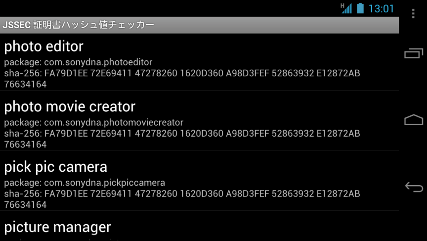{width="1.6666666666666667in"
height="2.7736111111111112in"}

図 5.2‑7

アプリの中には、ユーザーの資産とアプリ開発者が保護したい資産がある。それらのうち、Dangerous
Permissionで保護できるのはユーザーの資産だけであることに注意が必要である。なぜなら、権限の付与がユーザーの判断に委ねられているためである。一方、アプリ開発者が保護したい資産については、この方法では保護できない。

例えば、自社アプリだけと連携するComponentは他社アプリからのアクセスを禁止したい場合を考える。このようなComponentをDangerous
Permissionにより保護するように実装したとする。他社アプリがインストールされるときに、ユーザーの判断により他社アプリに対して権限の付与を許可してしまうと、保護すべき自社の資産が他社アプリに悪用される危険が生じる。このような場合に自社の資産を保護するためには、独自定義のSignature
Permissionを使うとよい。

#### 独自定義のDangerous Permissionは利用してはならない （必須）

独自定義のDangerous
Permissionを使用しても、インストール時に「ユーザーに権限の許可を求める」画面が表示されない場合がある。つまりDangerous
Permissionの特徴であるユーザーに判断を求める機能が働かないことがあるのだ。よって本ガイドでは「独自定義のDangerous
Permissionを利用しない」ことをルールとする。

まず説明のために2つのアプリを想定する。1つは独自のDangerous
Permissionを定義し、このPermissionにより保護したComponentを公開するアプリである。これをProtectedAppとする。もう1つはProtectedAppのComponentを悪用しようとする別のアプリでこれをAttackerAppとする。ここでAttackerAppはProtectedAppが定義したPermissionの利用宣言とともに同じPermissionの定義も行っているものとする。

AttackerAppがユーザーの許可なしにProtectedAppのComponentを利用できてしまうケースは以下のような場合に起きる。

1.  ユーザーがまずAttackerAppをインストールすると、Dangerous
    Permissionの利用許可を求める画面は表示されずに、そのままインストールが完了してしまう

2.  次にProtectedAppをインストールすると、ここでも特に警告もなくインストールできてしまう

3.  その後、ユーザーがAttackerAppを起動すると、AttackerAppはユーザーの気づかぬうちにProtectedAppのComponentにアクセスできてしまい、場合によっては被害に繋がる

このケースの原因は次の通りである。先にAttackerAppをインストールしようとするとuses-permissionにより利用宣言されたPermissionはまだその端末上では定義されていない。このときAndroid
OSはエラーとすることもなくインストールを続行してしまう。Dangerous
Permissionのユーザー確認はインストール時だけしか実施されないため、一度インストールされたアプリは権限を許可されたものとして扱われる。したがって後からインストールされるアプリのComponentを同名のDangerous
Permissionで保護していた場合、ユーザーの許可なく先にインストールされたアプリからそのComponentが利用できてしまうのである。

なお、Android OS既定のDangerous
Permissionはアプリがインストールされるときにはその存在が保証されているので、uses-permissionしているアプリがインストールされるときには必ずユーザー確認画面が表示される。独自定義のDangerous
Permissionの場合にだけこの問題は生じる。

現在、このケースでComponentへのアクセスを防止するよい方法は見つかっていない。したがって、独自定義のDangerous
Permissionは利用してはならない。

#### 独自定義Signature PermissionはComponentの提供側アプリでのみ定義する （必須）

自社アプリ間で連携する場合、実行時にSignature
Permissionをチェックすることでセキュリティを担保できることを「5.2.1.2
独自定義のSignature
Permissionで自社アプリ連携する方法」で例示した。この仕組みを利用する際には、Protection
LevelがSignatureの独自Permissionの定義は、Component提供側アプリのAndroidManifest.xmlでのみ行い、利用側アプリでは独自のSignature
Permissionを定義してはならない。

なお、signatureOrSystem　Permissionについても同様である。

以下がその理由となる。

提供側アプリより先にインストールされた利用側アプリが複数あり、どの利用側アプリも独自定義Permissionの利用宣言とともにPermissionの定義もしている場合を考える。この状況で提供側アプリをインストールすると、すべての利用側アプリから提供側アプリにアクセスすることが可能になる。次に、最初にインストールした利用側アプリをアンインストールすると、Permissionの定義が削除され、Permissionが未定義となる。そのため、残った利用側アプリからの提供側アプリの利用が不可能となってしまう。

このように、利用側アプリでPermissionの定義を行うと思わぬPermissionの未定義状態が発生するので、Permissionの定義は保護するComponentの提供側アプリのみ行い、利用側アプリでPermissionを定義するのは避けなければならない。

こうすることで、提供側アプリのインストール時に権限付与が行われ、かつ、アンインストール時にPermissionが未定義となり、提供側アプリとPermissionの定義の存在期間が必ず一致するので、適正なComponentの提供と保護が可能である。
なお、独自定義Signature
Permissionに関しては、連携するアプリのインストール順によらず、利用側アプリにPermission利用権限が付与されるため、この議論が成り立つことに注意[^25]。

#### 独自定義Signature Permissionは自社アプリにより定義されていることを確認する （必須）

AnroidManifest.xmlでSignature
Permissionを宣言し、ComponentをそのPermissionで保護しただけでは、実は保護が十分ではない。この詳細はアドバンストセクションの「5.2.3.1
独自定義Signature Permissionを回避できるAndroid
OSの特性とその対策」を参照すること。

以下、独自定義Signature Permissionを安全に正しく使う手順である。

まず、AndroidManifest.xmlにて次を行う。

1.  保護したいComponentのあるアプリのAndroidManifest.xmlにて、独自Signature
    Permissionを定義する（Permissionの定義）\
    例： &lt;permission android:name=”xxx”
    android:protectionLevel=”signature” /&gt;

2.  保護したいComponentのあるAndroidManifest.xmlにて、そのComponentの定義タグのpermission属性で、独自定義Signature
    Permissionを指定する（Permissionの要求宣言）\
    例： &lt;activity android:permission=”xxx” … &gt;…&lt;/activity&gt;

3.  保護したいComponentにアクセスする連携アプリのAndroidManifest.xmlにて、uses-permissionタグに独自定義Signature
    Permissionを指定する（Permissionの利用宣言）\
    例： &lt;uses-permission android:name=”xxx” /&gt;

続いて、ソースコード上にて次を実装する。

1.  保護したいComponentでリクエストを処理する前に、独自定義したSignature
    Permissionが自社アプリにより定義されたものかどうかを確認し、そうでなければリクエストを無視する（Component提供側による保護）

2.  保護したいComponentにアクセスする前に、独自定義したSignature
    Permissionが自社アプリにより定義されたものかどうかを確認し、そうでなければComponentにアクセスしない（Component利用側による保護）

最後にAndroid Studioの署名機能にて次を行う。

1.  連携するすべてのアプリのAPKを同じ開発者鍵で署名する

ここで「独自定義したSignature
Permissionが、自社アプリにより定義されたものかどうかを確認」する必要があるが、具体的な実装方法についてはサンプルコードセクションの「5.2.1.2
独自定義のSignature Permissionで自社アプリ連携する方法」を参照すること。

なお、signatureOrSystem　Permissionについても同様である。

#### 独自定義のNormal Permissionは利用してはならない （推奨）

Normal Permissionを利用するアプリはAndroid
Manifest.xmlにuses-permissionで利用宣言するだけでその権限を得ることができる。そのため、一度インストールされてしまったマルウェアからComponentを保護するような目的にNormal
Permissionは利用できない。

さらに独自定義Normal
Permissionを用いてアプリ間連携を行う場合、連携する各アプリへのPermissionの付与はインストール順に依存する。例えば、Permissionを定義したコンポーネントを持つアプリよりも先にそのPermissionを利用宣言したアプリをインストールすると、Permissionを定義したアプリをインストールした後も利用側アプリはPermissionで保護されたコンポーネントにアクセスすることができない。

インストール順によりアプリ間連携ができなくなる問題を回避する方法として、連携する全てのアプリにPermissionを定義することも考えられる。そうすることにより最初に利用側アプリがインストールされた場合でも、全ての利用側アプリが提供側アプリにアクセスすることが可能となる。しかし、最初にインストールした利用側アプリがアンインストールされた際にPermissionが未定義な状態となり、他に利用側アプリが存在していても、それらのアプリから提供側アプリにアクセスすることができなくなってしまうのである。

以上のようにアプリの可用性が損なわれる恐れがあることから、独自定義Normal
Permissionの利用は控えるべきである。

#### 独自定義のPermission名はアプリのパッケージ名を拡張した文字列にする （推奨）

複数のアプリが同じ名前でPermissionを定義する場合、先にインストールされたアプリが定義するProtection
Levelが適用される。先にインストールされたアプリがNormal
Permissionを定義し、後にインストールされたアプリが同じ名前でSignature
Permissionを定義した場合、Signature
Permissionによる保護がまったく効かない。悪意がない場合でも、複数のアプリにおいてPermission名が衝突して意図しないProtection
Levelで動作する可能性がある。このような事故を防ぐため、Permission名にはアプリのパッケージ名を入れた方が良い。

(パッケージ名).permission.(識別する文字列)

例えば、org.jssec.android.sampleというパッケージにREADアクセスのPermissionを定義するならば、次の様な命名が好ましい。

org.jssec.android.sample.permission.READ

### アドバンスト

#### 独自定義Signature Permissionを回避できるAndroid OSの特性とその対策

独自定義Signature
Permissionは、同じ開発者鍵で署名されたアプリ間だけでアプリ間連携を実現するPermissionである。開発者鍵はプライベート鍵であり絶対に公開してはならないものであるため、Signature
Permissionによる保護は自社アプリだけで連携する場合に使われることが多い。

まずは、AndroidのDev
Guide（[*http://developer.android.com/guide/topics/security/security.html*](http://developer.android.com/guide/topics/security/security.html)）で説明されている独自定義Signature
Permissionの基本的な使い方を紹介する。ただし、後述するように、この使い方にはPermission回避の問題があることが分かっており、本ガイドに掲載した対策が必要となる。

以下、独自定義Signature Permissionの基本的な使い方である。

1.  保護したいComponentのあるアプリのAndroidManifest.xmlにて、独自Signature
    > Permissionを定義する\
    > 例： &lt;permission android:name=”xxx”
    > android:protectionLevel=”signature” /&gt;

2.  保護したいComponentを持つアプリのAndroidManifest.xmlで、保護したいComponentにandroid:permission属性を指定し、1.で定義したSignature
    > Permissionを要求する\
    > 例： &lt;activity android:permission=”xxx”
    > … &gt;…&lt;/activity&gt;

3.  保護したいComponentにアクセスしたい連携アプリのAndroidManifest.xmlにて、独自定義Signature
    > Permissionを利用宣言する\
    > 例： &lt;uses-permission android:name=”xxx” /&gt;

4.  連携するすべてのアプリのAPKを同じ開発者鍵で署名する

実は、この使い方だけでは、次の条件が成立するとSignature
Permission回避の抜け道ができてしまう。

説明のために独自定義のSignature
Permissionで保護したアプリをProtectedAppとし、ProtectedAppとは異なる開発者鍵で署名したアプリをAttackerAppとする。ここでSignature
Permission回避の抜け道とは、AttackerAppは署名が一致していないにもかかわらず、ProtectedAppのComponentにアクセス可能になることである。

1.  AttackerAppもProtectedAppが独自定義したSignature
    Permissionと同じ名前でNormal Permissionを定義する（厳密にはSignature
    Permissionでも構わない）

> 例: &lt;permission android:name=" xxx "
> android:protectionLevel="normal" /&gt;

1.  AttackerAppは独自定義したNormal
    Permissionをuses-permissionで利用宣言する

> 例: &lt;uses-permission android:name="xxx" /&gt;

1.  AttackerAppをProtectedAppより先に端末にインストールする

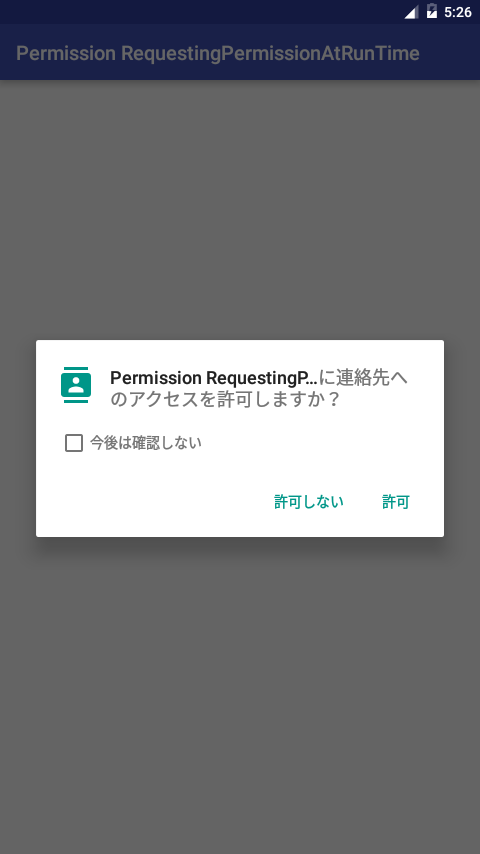{width="6.5in" height="4.270833333333333in"}

図 5.2‑8

条件1および条件2の成立に必要なProtectedApp独自定義のPermission名は、APKファイルからAndroidManifest.xmlを取り出せば攻撃者にとって容易に知ることができる。条件3もユーザーを騙すなどの方法により攻撃者にある程度制御の余地がある。

このように独自定義のSignature
Permissionには基本的な使い方だけでは保護を回避されてしまう危険性があり、抜け道をふさぐような対策が必要である。具体的にはルールセクションの「5.2.2.4
独自定義Signature
Permissionは自社アプリにより定義されていることを確認する
（必須）」に掲載している方法で対処できるので、そちらを参照のこと。

#### ユーザーがAndroidManifest.xmlを改ざんする

独自PermissionのProtection
Levelが意図しないものになるケースは既に説明した。そのことによる不具合を防ぐために、Javaのソースコード側で何らかの対応を実施する必要があった。ここでは、AndroidManifest.xmlが改ざんされるという視点から、ソースコード側の対応について述べる。改ざんを検知する簡易な実装例を提示するが、犯罪意識をもって改ざんを行うプロのハッカーに対してはほとんど効果がない方法であることに注意すること。

この節はアプリの改ざんに関するものであり、ユーザー自身が悪意を持っているケースである。本来はガイドラインの範囲外であるが、Permissionに関する事、これを行うツールがアプリとして公開されている事、から「プロでないハッカーに対する簡易な対策」として述べておくことにした。

Androidアプリは、root権限無しに改ざんできることを頭に置いておく必要がある。なぜなら、AndroidManifest.xmlを変更してAPKファイルを再生成、署名するツールが配布されているためである。このツールを使用する事で、誰でも任意のアプリからPermissionを削除することが可能になっている。

事例としてはINTERNET
Permissionを取り除いたAndroidManifest.xmlから別署名のAPKを生成し、アプリに組み込まれた広告モジュールが動作しないようにするケースが多いようである。個人情報がどこかに送信されているかもしれない等の不安が払拭されるということで、この種のツールの存在を評価しているユーザーも存在する。このような行為は、アプリに組み込まれた広告が機能しなくなるため、広告収入を期待している開発者に対して金銭的被害を与える行動であるとも言える。ユーザーのほとんどは罪の意識無くこれらの行為を行っていると思われる。

インターネットPermissionをuses-permissionで宣言しているアプリが、実行時に自身のAndroidManifest.xmlに記載されているPermissionを確認する実装例を次に示す。

public class CheckPermissionActivity extends Activity {

@Override

public void onCreate(Bundle savedInstanceState) {

super.onCreate(savedInstanceState);

setContentView(R.layout.main);

// AndroidManifest.xmlに定義したPermissionを取得

List&lt;String&gt; list = getDefinedPermissionList();

// 改ざんを検知する

if( checkPermissions(list) ){

// OK

Log.d("dbg", "OK.");

}else{

Log.d("dbg", "manifest file is stale.");

finish();

}

}

/\*\*

\* AndroidManifest.xmlに定義したPermissionをリストで取得する

\* @return

\*/

private List&lt;String&gt; getDefinedPermissionList(){

List&lt;String&gt; list = new ArrayList&lt;String&gt;();

list.add("android.permission.INTERNET");

return list;

}

/\*\*

\* Permissionが変更されていないことを確認する。

\* @param permissionList

\* @return

\*/

private boolean checkPermissions(List&lt;String&gt; permissionList){

try {

PackageInfo packageInfo = getPackageManager().getPackageInfo(

getPackageName(), PackageManager.GET\_PERMISSIONS);

String\[\] permissionArray = packageInfo.requestedPermissions;

if (permissionArray != null) {

for (String permission : permissionArray) {

if(! permissionList.remove(permission)){

// 意図しないPermissionが付加されている

return false;

}

}

}

if(permissionList.size() == 0){

// OK

return true;

}

} catch (NameNotFoundException e) {

}

return false;

}

}

#### APKの改ざんを検出する

「5.2.3.2
ユーザーがAndroidManifest.xmlを改ざんする」ではユーザーによるPermission改ざんの検出について説明した。しかし、アプリの改ざんはPermissionに限らず、リソースを差し替えて別のアプリとしてマーケットで配布するなど、ソースコードを変更することなく改ざんし流用する事例が多様に存在する。ここではAPKファイルが改ざんされたことを検出するためのより汎用的な方法を紹介する。

APKの改ざんを行うには、APKファイルを一度展開し、内容を改変した後に再びAPKファイルとして再構成する必要がある。その際に改ざん者は元の開発者の鍵を持ち得ないので、改ざん者自身の鍵でAPKを署名することになる。このようにAPKの改ざんには署名(証明書)の変更を伴うため、アプリ起動時にAPKの証明書と予めソースコードに埋め込んだ開発者の証明書を比較することで改ざんの有無を検出することができる。

以下にサンプルコードを示す。なお、実装例のままではプロのハッカーであれば改ざん検出の無効化が容易である。あくまで簡易な実装例であることを念頭においてアプリへの適用を検討するべきである。

> ポイント：

1.  主要な処理を行うまでの間に、アプリの証明書が開発者の証明書であることを確認する

> SignatureCheckActivity.java

package org.jssec.android.permission.signcheckactivity;

import org.jssec.android.shared.PkgCert;

import org.jssec.android.shared.Utils;

import android.app.Activity;

import android.content.Context;

import android.os.Bundle;

import android.widget.Toast;

public class SignatureCheckActivity extends Activity {

// 自己証明書のハッシュ値

private static String sMyCertHash = null;

private static String myCertHash(Context context) {

if (sMyCertHash == null) {

if (Utils.isDebuggable(context)) {

// debug.keystoreの"androiddebugkey"の証明書ハッシュ値

sMyCertHash = "0EFB7236 328348A9 89718BAD DF57F544 D5CCB4AE B9DB34BC
1E29DD26 F77C8255";

} else {

// keystoreの"my company key"の証明書ハッシュ値

sMyCertHash = "D397D343 A5CBC10F 4EDDEB7C A10062DE 5690984F 1FB9E88B
D7B3A7C2 42E142CA";

}

}

return sMyCertHash;

}

@Override

public void onCreate(Bundle savedInstanceState) {

super.onCreate(savedInstanceState);

setContentView(R.layout.main);

// ★ポイント1★
主要な処理を行うまでの間に、アプリの証明書が開発者の証明書であることを確認する

if (!PkgCert.test(this, this.getPackageName(), myCertHash(this))) {

Toast.makeText(this, "自己署名の照合　NG", Toast.LENGTH\_LONG).show();

finish();

return;

}

Toast.makeText(this, "自己署名の照合　OK", Toast.LENGTH\_LONG).show();

}

}

> PkgCert.java

package org.jssec.android.shared;

import java.security.MessageDigest;

import java.security.NoSuchAlgorithmException;

import android.content.Context;

import android.content.pm.PackageInfo;

import android.content.pm.PackageManager;

import android.content.pm.PackageManager.NameNotFoundException;

import android.content.pm.Signature;

public class PkgCert {

public static boolean test(Context ctx, String pkgname, String
correctHash) {

if (correctHash == null) return false;

correctHash = correctHash.replaceAll(" ", "");

return correctHash.equals(hash(ctx, pkgname));

}

public static String hash(Context ctx, String pkgname) {

if (pkgname == null) return null;

try {

PackageManager pm = ctx.getPackageManager();

PackageInfo pkginfo = pm.getPackageInfo(pkgname,
PackageManager.GET\_SIGNATURES);

if (pkginfo.signatures.length != 1) return null; // 複数署名は扱わない

Signature sig = pkginfo.signatures\[0\];

byte\[\] cert = sig.toByteArray();

byte\[\] sha256 = computeSha256(cert);

return byte2hex(sha256);

} catch (NameNotFoundException e) {

return null;

}

}

private static byte\[\] computeSha256(byte\[\] data) {

try {

return MessageDigest.getInstance("SHA-256").digest(data);

} catch (NoSuchAlgorithmException e) {

return null;

}

}

private static String byte2hex(byte\[\] data) {

if (data == null) return null;

final StringBuilder hexadecimal = new StringBuilder();

for (final byte b : data) {

hexadecimal.append(String.format("%02X", b));

}

return hexadecimal.toString();

}

}

#### Permissionの再委譲問題

アプリがAndroid
OSに保護されている電話帳やGPSといった情報や機能にアクセスするためにはPermissionを利用宣言しなければならない。Permissionを利用宣言し許可されると、そのアプリにはそのPermissionが委譲されたことになり、そのPermissionにより保護された情報や機能にアクセスできるようになる。

プログラムの組み方によっては、Permissionを委譲された（許可された）アプリはPermissionで保護されたデータを取得し、そのデータを別のアプリに何のPermissionも要求せずに提供することもできてしまう。これはPermissionを持たないアプリがPermissionで保護されたデータにアクセスできることに他ならない。実質的にPermissionを再委譲していることと等価になるので、これをPermissionの再委譲問題と呼ぶ。このようにAndroidのPermissionセキュリティモデルでは、保護されたデータへのアプリからの直接アクセスだけしか権限管理ができないという仕様上の性質がある。

具体例を図
5.2‑9に示す。中央のアプリはandroid.permission.READ\_CONTACTSを利用宣言したアプリが連絡先情報を読み取って自分のDBに蓄積している。何の制限もなくContent
Provider経由で蓄積した情報を他のアプリに提供した場合に、Permissionの再委譲問題が生じる。

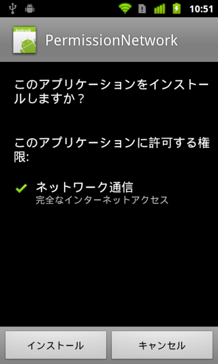{width="5.375in" height="3.8020833333333335in"}

[]{#_Ref337212915 .anchor}図
5.2‑9　Permissionを持たないアプリが連絡先情報を取得する

同様の例として、android.permission.CALL\_PHONEを利用宣言したアプリが、同Permissionを利用宣言していない他のアプリからの任意の電話番号を受け付け、ユーザーの確認もなくその番号に電話を掛けることができるならば、Permissionの再委譲問題がある。

Permissionの利用宣言をして得た情報資産・機能資産をほぼそのままの形で他のアプリに二次提供する場合には、提供先アプリに対し同じPermissionを要求するなどして、元の保護水準を維持しなければならない。また情報資産・機能資産の一部分のみを他のアプリに二次提供する場合には、その情報資産・機能資産の一部分が悪用されたときの被害度合に応じた適切な保護が必要である。たとえば前述と同様に同じPermissionを要求したり、ユーザーへ利用許諾を確認したり、「4.1.1.1
非公開Activityを作る・利用する」「4.1.1.4
自社限定Activityを作る・利用する」などを利用して対象アプリの制限を設けるなどの保護施策がある。

このような再委譲問題はPermissionに限ったことではない。Androidアプリでは、アプリに必要な情報･機能を他のアプリやネットワーク・記憶媒体から調達することが一般に行われている。提供元がAndroidアプリであればPermission、ネットワークであればログイン、記憶媒体であればアクセス制限といったように、それぞれ調達する際に必要な権限や制限が存在することも多い。こうして調達した情報や機能をその所有者であるユーザーから二次的に他のアプリに提供したり、ネットワークや記憶媒体に転送する際には、ユーザーの意図に反した利用がないように慎重に検討してアプリに対策を施すべきである。必要に応じて、Permissionの例と同様に提供先に対して権限の要求や使用の制限を行わなければならない。ユーザーへの利用許諾もその一環である。

以下では、READ\_CONTACTS　Permissionを利用して連絡先DBから一覧を取得したアプリが、情報提供先のアプリに対して同じREAD\_CONTACTS　Permissionを要求する例を示す。

> ポイント

1.  Manifestで提供元と同じPermissionを要求する

> AndroidManifest.xml

&lt;?xml version="1.0" encoding="utf-8"?&gt;

&lt;manifest xmlns:android="http://schemas.android.com/apk/res/android"

package="org.jssec.android.permission.transferpermission" &gt;

&lt;uses-permission
android:name="android.permission.READ\_CONTACTS"/&gt;

&lt;application

android:allowBackup="false"

android:icon="@drawable/ic\_launcher"

android:label="@string/app\_name"

android:theme="@style/AppTheme" &gt;

&lt;activity

android:name=".TransferPermissionActivity"

android:label="@string/title\_activity\_transfer\_permission" &gt;

&lt;intent-filter&gt;

&lt;action android:name="android.intent.action.MAIN" /&gt;

&lt;category android:name="android.intent.category.LAUNCHER" /&gt;

&lt;/intent-filter&gt;

&lt;/activity&gt;

&lt;provider

android:name=".TransferPermissionContentProvider"

&lt;!-- ★ポイント1★ Manifestで提供元と同じPermissionを要求する --&gt;

android:authorities="org.jssec.android.permission.transferpermission"

android:enabled="true"

android:exported="true"

android:readPermission="android.permission.READ\_CONTACTS" &gt;

&lt;/provider&gt;

&lt;/application&gt;

&lt;/manifest&gt;

アプリが複数のPermissionを要求する必要がある場合は、上記の方法では解決することができない。ソースコード上でContext\#checkCallingPermission()やPackageManager\#checkPermission()を使用して、呼び出し元のアプリがManifestですべてのPermissionの利用宣言を行っているかどうかを確認することになる。

> Activityの場合

public void onCreate(Bundle savedInstanceState) {

～省略～

if (checkCallingPermission("android.permission.READ\_CONTACTS") ==
PackageManager.PERMISSION\_GRANTED

&& checkCallingPermission("android.permission.WRITE\_CONTACTS") ==
PackageManager.PERMISSION\_GRANTED) {

// 呼び出し元が正しくPermissionを利用宣言していた時の処理

return;

}

finish();

}

#### 独自定義Permissionの署名チェック機構について (Android 5.0以降)

Android 5.0(API Level
21)以降の端末では、独自のPermissionを定義したアプリにおいて以下のような条件に合致するとインストールに失敗するように仕様変更された。

1.  既に同名のPermissionを定義したアプリがインストールされている

2.  そのインストール済みのアプリと署名が一致しない

この仕様変更により、保護対象の機能
(Component)の提供側アプリと利用側アプリの双方でPermissionを定義した場合には、同じPermissionを定義した署名の異なる他社アプリが両アプリと同時にインストールされるのを防ぐことができる。しかしながら、「5.2.2.3
独自定義Signature PermissionはComponentの提供側アプリでのみ定義する
（必須）」で言及した通り、アプリのアンインストール操作などによって、双方のアプリにPermissionを定義するとそのPermissionが意図せず未定義状態になる場合があるため、この仕様を自社の定義したSignature
Permissionが他アプリに定義されていないことのチェックに活用することはできないことが分かっている。

結果として、自社限定アプリで独自定義Signature
Permissionを利用する場合は、引き続き「5.2.2.3 独自定義Signature
PermissionはComponentの提供側アプリでのみ定義する
（必須）」、「5.2.2.4　独自定義Signature
Permissionは自社アプリにより定義されていることを確認する
（必須）」のルールを順守する必要がある。

#### Android 6.0以降のPermissionモデルの仕様変更について

Android 6.0(API Level
23)においてアプリの仕様や設計にも影響を及ぼすPermissionモデルの仕様変更が行われた。本節ではAndroid
6.0以降のPermissionモデルの概要を解説する。

##### 権限の付与・取り消しのタイミング

ユーザー確認が必要な権限（Dangerous
Permission）をアプリが利用宣言している場合（「5.2.2.1
Android　OS既定のPermissionを利用する方法」参照）、Android 5.1（API
Level
22）以前の仕様では、アプリのインストール時にその権限一覧が表示され、ユーザーがすべての権限を許可することでインストールが行われる。この時点で、アプリが利用宣言している(Dangerous
Permission以外の権限を含め)全ての権限はアプリに付与され、一度付与された権限はアプリが端末からアンインストールされるまで有効である。

しかしAndroid
6.0以降の仕様では、権限の付与はアプリの実行時に行う仕様となり、アプリのインストール時には権限の付与もユーザーへの確認も行われない。アプリは、Dangerous
Permissionを必要とする処理を実行する際、事前にその権限がアプリに付与されているかどうかを確認し、権限が付与されていない場合にはAndroid
OSに確認画面を表示させ、ユーザーに権限利用の許可を求める必要がある[^26]。ユーザーが確認画面で許可することでその権限はアプリに付与される。ただし、ユーザーは一度アプリに許可した権限(Dangerous
Permission)を、設定メニューを通じて任意のタイミングで取り消すことができる（図
5.2‑10）ため、権限がアプリに付与されておらず必要な情報や機能にアクセスすることができない状況においても、アプリが異常な動作を起こすことがないよう適切な処理を実装する必要がある。

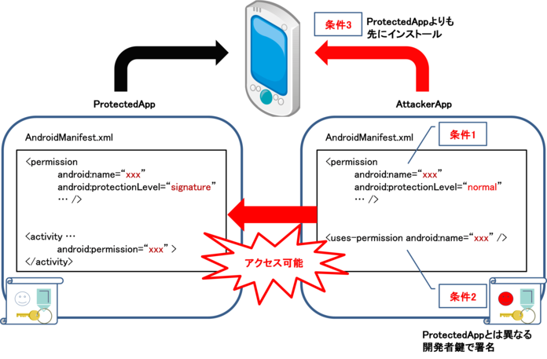{width="1.9999628171478565in"
height="3.558266622922135in"}

[]{#_Ref436138183 .anchor}図 5.2‑10

##### 権限の付与・取り消しの単位

いくつかのPermissionはその機能や関連する情報の種類に応じて、Permission
Groupと呼ばれる単位でグループ化されている。例えば、カレンダー情報の読み取りに必要なPermissionであるandroid.permission.READ\_CALENDARと、カレンダー情報の書き込みに必要なPermissionであるandroid.permission.WRITE\_CALENDARは、どちらもandroid.permission-group.CALENDARというPermission
Groupに属している。

Android
6.0以降の新しいPermissionモデルにおいて、権限の付与や取り消しはこのPermission
Groupを単位として行われる。つまり、アプリの実行時にandroid.permission.READ\_CALENDARの要求が行われ、ユーザーがこれを許可すると、Android
OSはandroid.permission.READ\_CALENDARとandroid.permission.WRITE\_CALENDARの利用が両方とも許可されたとみなし、その後android.permission.WRITE\_CALENDARが要求されても、ユーザーに確認ダイアログが表示されることなく即時に権限が付与されるのである[^27]。

Permission Groupの分類についてはDeveloper Reference
(http://developer.android.com/intl/ja/guide/topics/security/permissions.html\#perm-groups)を参照すること。

##### 仕様変更の影響範囲

アプリの実行時にPermission要求が必要なのは、端末がAndroid
6.0以降で動作していることに加え、アプリのmaxSdkVersionが23以上に設定されている場合に限られる。端末がAndroid
5.1以前で動作している場合や、アプリのmaxSdkVersionが23未満である場合、権限は従来通りアプリのインストール時にまとめて付与される。ただし、アプリのtargetSDKVersionが23未満であっても、端末がAndroid
6.0以降であれば、インストールされたアプリのPermissionをユーザーが任意のタイミングで取り消すことができるため、意図しないアプリの異常終了が起きる可能性がある。早急に仕様変更に対応するか、アプリのmaxSdkVersionを22以前に設定して、Android
6.0(API Level
23)以降の端末にイントールされないようにするなどの対応が必要である（表
5.2‑1）。

[]{#_Ref436138322 .anchor}表 5.2‑1

  端末のAndroid OSバージョン   アプリのtargetSDKVersion   アプリへの権限付与のタイミング   ユーザーによる権限制御
  ---------------------------- -------------------------- -------------------------------- ------------------------
  ≧6.0                         ≧23                        アプリ実行時                     あり
                               ＜23                       インストール時                   あり(早急な対応が必要)
  ≦5.1                         ≧23                        インストール時                   なし
                               ＜23                       インストール時                   なし

ただし、maxSdkVersion
の効果は限定的であることに注意が必要である。maxSdkVersionを22以前に設定した場合、アプリをGoogle
Play経由で配布したときには、Android 6.0(API Level
23)以降の端末が対象アプリのインストール可能端末としてリスト表示されなくなる。一方、Google
Play以外のマーケットプレイスではmaxSdkVersionの値がチェックされないことがあるため、Android
6.0(API Level 23)以降の端末に対象アプリをインストールできる場合がある。

このようにmaxSdkVersionの効果は限定的であること、さらにGoogleがmaxSdkVersionの使用を推奨していないことを踏まえ、早急に仕様変更に対応することをお勧めする。

なお、以下のネットワーク通信に関するPermissionは、Android
6.0以降Protection
Levelがdangerousからnormalに変更されている。つまり、これらのPermissionは利用宣言していても、ユーザーの明示的な許可を必要としないため、今回の仕様変更の影響を受けない。

-   android.permission.BLUETOOTH

-   android.permission.BLUETOOTH\_ADMIN

-   android.permission.CHANGE\_WIFI\_MULTICAST\_STATE

-   android.permission.CHANGE\_WIFI\_STATE

-   android.permission.CHANGE\_WIMAX\_STATE

-   android.permission.DISABLE\_KEYGUARD

-   android.permission.INTERNET

-   android.permission.NFC

Account Managerに独自アカウントを追加する
-----------------------------------------

Account
Managerはアプリがオンラインサービスへアクセスするために必要となるアカウント情報（アカウント名、パスワード）および認証トークンを一元管理するAndroid
OSの仕組みである[^28]。ユーザーは事前にアカウント情報をAccount
Managerに登録しておき、アプリがオンラインサービスにアクセスしようとしたときにユーザーの許可を得て、Account
Managerがアプリに認証トークンを自動提供する仕組みである。パスワードという極めてセンシティブな情報をアプリが扱わなくて済むことがAccount
Managerの利点である。

> Account Managerを使用したアカウント管理機能は図
> 5.3‑1のような構成となる。「利用アプリ」は認証トークンの提供を受けてオンラインサービスにアクセスするアプリであり、前述のアプリのことである。一方、「Authenticatorアプリ」はAccount
> Managerの機能拡張であり、Authenticatorと呼ばれるオブジェクトをAccount
> Managerに提供することにより、Account
> Managerがそのオンラインサービスのアカウント情報および認証トークンを一元管理できるようになる。利用アプリとAuthenticatorアプリは別のアプリである必要はなく、一つのアプリとして実装することもできる。
>
> 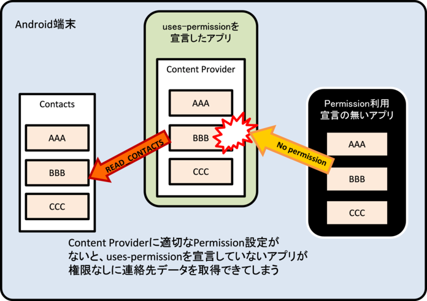{width="6.889763779527559in"
> height="1.9748031496062992in"}

[]{#_Ref351642081 .anchor}図 5.3‑1Account
Managerを使用したアカウント管理機能の構成

本来、利用アプリとAuthenticatorアプリは開発者の署名鍵が異なっていてもよい。しかしAndroid
4.0.x の端末に限りAndroid
Frameworkのバグがあり、利用アプリとAuthenticatorアプリの署名鍵が異なっていると利用アプリで例外が発生してしまい、独自アカウントが利用できない。ここで紹介するサンプルコードはこの不具合には対応できていない。詳しくは「5.3.3.2
Android
4.0.xでは利用アプリとAuthenticatorアプリの署名鍵が異なると例外が発生する」を参照すること。

### サンプルコード

Authenticatorアプリのサンプルとして「5.3.1.1
独自アカウントを作る」を、利用アプリのサンプルとして「5.3.1.2
独自アカウントを利用する」を用意した。JSSECのWebサイトで配布しているサンプルコード一式ではそれぞれAccountManager
AuthenticatorおよびAccountManager Userに対応している。

#### 独自アカウントを作る

ここではAccount
Managerが独自アカウントを扱えるようにするAuthenticatorアプリのサンプルコードを紹介する。このアプリはホーム画面から起動できるActivityは存在しない。もう一つのサンプルアプリ「5.3.1.2
独自アカウントを利用する」からAccount
Manager経由で間接的に呼び出されることに注意してほしい。

> ポイント：

1.  Authenticatorを提供するServiceは非公開Serviceとする

&nbsp;
1.  ログイン画面ActivityはAuthenticatorアプリで実装する

&nbsp;
1.  ログイン画面Acitivityは公開Activityとする

2.  KEY\_INTENTには、ログイン画面Activityのクラス名を指定した明示的Intentを与える

3.  アカウント情報や認証トークンなどのセンシティブな情報はログ出力しない

4.  Account Managerにパスワードを保存しない

5.  Authenticatorとオンラインサービスとの通信はHTTPSで行う

AndroidManifest.xmlにてAuthenticatorのIBinderをAccount
Managerに提供するサービスを定義。meta-dataにてAuthenticatorを記述したリソースXMLファイルを指定。

> AccountManager Authenticator/AndroidManifest.xml

&lt;manifest xmlns:android="http://schemas.android.com/apk/res/android"

package="org.jssec.android.accountmanager.authenticator"

xmlns:tools="http://schemas.android.com/tools"&gt;

&lt;!-- Authenticatorを実装するのに必要なPermission --&gt;

&lt;uses-permission android:name="android.permission.GET\_ACCOUNTS"
/&gt;

&lt;uses-permission
android:name="android.permission.AUTHENTICATE\_ACCOUNTS" /&gt;

&lt;application

android:allowBackup="false"

android:icon="@drawable/ic\_launcher"

android:label="@string/app\_name" &gt;

&lt;!-- AuthenticatorのIBinderをAccountManagerに提供するサービス --&gt;

&lt;!-- ★ポイント1★ Authenticatorを提供するServiceは非公開Serviceとする
--&gt;

&lt;service

android:name=".AuthenticationService"

android:exported="false" &gt;

&lt;!-- intent-filterとmeta-dataはお決まりのパターン --&gt;

&lt;intent-filter&gt;

&lt;action android:name="android.accounts.AccountAuthenticator" /&gt;

&lt;/intent-filter&gt;

&lt;meta-data

android:name="android.accounts.AccountAuthenticator"

android:resource="@xml/authenticator" /&gt;

&lt;/service&gt;

&lt;!-- アカウントを追加するときなどに表示されるログイン画面用のActivity
--&gt;

&lt;!-- ★ポイント2★ ログイン画面ActivityはAuthenticatorアプリで実装する
--&gt;

&lt;!-- ★ポイント3★ ログイン画面Activityは公開Activityとする --&gt;

&lt;activity

android:name=".LoginActivity"

android:exported="true"

android:label="@string/login\_activity\_title"

android:theme="@android:style/Theme.Dialog"

tools:ignore="ExportedActivity" /&gt;

&lt;/application&gt;

&lt;/manifest&gt;

XMLファイルでAuthenticatorを定義。独自アカウントのアカウントタイプ等を指定する。

> res/xml/authenticator.xml

&lt;account-authenticator
xmlns:android="http://schemas.android.com/apk/res/android"

android:accountType="org.jssec.android.accountmanager"

android:icon="@drawable/ic\_launcher"

android:label="@string/label"

android:smallIcon="@drawable/ic\_launcher"

android:customTokens="true" /&gt;

AuthenticatorのインスタンスをAccount
Managerに提供するサービス。このサンプルで実装するAuthenticatorであるJssecAuthenticatorクラスのインスタンスをonBind()でreturnするだけの簡単な実装でよい。

> AuthenticationService.java

package org.jssec.android.accountmanager.authenticator;

import android.app.Service;

import android.content.Intent;

import android.os.IBinder;

public class AuthenticationService extends Service {

private JssecAuthenticator mAuthenticator;

@Override

public void onCreate() {

mAuthenticator = new JssecAuthenticator(this);

}

@Override

public IBinder onBind(Intent intent) {

return mAuthenticator.getIBinder();

}

}

このサンプルで実装するAuthenticatorであるJssecAuthenticator。AbstractAccountAuthenticatorを継承してabstractメソッドをすべて実装する。これらのメソッドはAccount
Managerから呼ばれる。addAccount()およびgetAuthToken()では、オンラインサービスから認証トークンを取得するためのLoginActivityを起動するintentをAccount
Managerに返している。

> JssecAuthenticator.java

package org.jssec.android.accountmanager.authenticator;

import android.accounts.AbstractAccountAuthenticator;

import android.accounts.Account;

import android.accounts.AccountAuthenticatorResponse;

import android.accounts.AccountManager;

import android.accounts.NetworkErrorException;

import android.content.Context;

import android.content.Intent;

import android.os.Bundle;

public class JssecAuthenticator extends AbstractAccountAuthenticator {

public static final String JSSEC\_ACCOUNT\_TYPE =
"org.jssec.android.accountmanager";

public static final String JSSEC\_AUTHTOKEN\_TYPE = "webservice";

public static final String JSSEC\_AUTHTOKEN\_LABEL = "JSSEC Web
Service";

public static final String RE\_AUTH\_NAME = "reauth\_name";

protected final Context mContext;

public JssecAuthenticator(Context context) {

super(context);

mContext = context;

}

@Override

public Bundle addAccount(AccountAuthenticatorResponse response, String
accountType,

String authTokenType, String\[\] requiredFeatures, Bundle options)

throws NetworkErrorException {

AccountManager am = AccountManager.get(mContext);

Account\[\] accounts = am.getAccountsByType(JSSEC\_ACCOUNT\_TYPE);

Bundle bundle = new Bundle();

if (accounts.length &gt; 0) {

// 本サンプルコードではアカウントが既に存在する場合はエラーとする

bundle.putString(AccountManager.KEY\_ERROR\_CODE, String.valueOf(-1));

bundle.putString(AccountManager.KEY\_ERROR\_MESSAGE,

mContext.getString(R.string.error\_account\_exists));

} else {

// ★ポイント2★ ログイン画面ActivityはAuthenticatorアプリで実装する

// ★ポイント4★
KEY\_INTENTには、ログイン画面Activityのクラス名を指定した明示的Intentを与える

Intent intent = new Intent(mContext, LoginActivity.class);

intent.putExtra(AccountManager.KEY\_ACCOUNT\_AUTHENTICATOR\_RESPONSE,
response);

bundle.putParcelable(AccountManager.KEY\_INTENT, intent);

}

return bundle;

}

@Override

public Bundle getAuthToken(AccountAuthenticatorResponse response,
Account account,

String authTokenType, Bundle options) throws NetworkErrorException {

Bundle bundle = new Bundle();

if (accountExist(account)) {

// ★ポイント4★
KEY\_INTENTには、ログイン画面Activityのクラス名を指定した明示的Intentを与える

Intent intent = new Intent(mContext, LoginActivity.class);

intent.putExtra(RE\_AUTH\_NAME, account.name);

bundle.putParcelable(AccountManager.KEY\_INTENT, intent);

} else {

// 指定されたアカウントが存在しない場合はエラーとする

bundle.putString(AccountManager.KEY\_ERROR\_CODE, String.valueOf(-2));

bundle.putString(AccountManager.KEY\_ERROR\_MESSAGE,

mContext.getString(R.string.error\_account\_not\_exists));

}

return bundle;

}

@Override

public String getAuthTokenLabel(String authTokenType) {

return JSSEC\_AUTHTOKEN\_LABEL;

}

@Override

public Bundle confirmCredentials(AccountAuthenticatorResponse response,
Account account,

Bundle options) throws NetworkErrorException {

return null;

}

@Override

public Bundle editProperties(AccountAuthenticatorResponse response,
String accountType) {

return null;

}

@Override

public Bundle updateCredentials(AccountAuthenticatorResponse response,
Account account,

String authTokenType, Bundle options) throws NetworkErrorException {

return null;

}

@Override

public Bundle hasFeatures(AccountAuthenticatorResponse response, Account
account,

String\[\] features) throws NetworkErrorException {

Bundle result = new Bundle();

result.putBoolean(AccountManager.KEY\_BOOLEAN\_RESULT, false);

return result;

}

private boolean accountExist(Account account) {

AccountManager am = AccountManager.get(mContext);

Account\[\] accounts = am.getAccountsByType(JSSEC\_ACCOUNT\_TYPE);

for (Account ac : accounts) {

if (ac.equals(account)) {

return true;

}

}

return false;

}

}

オンラインサービスにアカウント名、パスワードを送信してログイン認証を行い、その結果として認証トークンを取得するLoginActivity。新規アカウント追加および認証トークン再取得の場合に表示される。オンラインサービスへの実際のアクセスはWebServiceクラス内で実装されるものとしている。

> LoginActivity.java

package org.jssec.android.accountmanager.authenticator;

import org.jssec.android.accountmanager.webservice.WebService;

import android.accounts.Account;

import android.accounts.AccountAuthenticatorActivity;

import android.accounts.AccountManager;

import android.content.Intent;

import android.os.Bundle;

import android.text.InputType;

import android.text.TextUtils;

import android.util.Log;

import android.view.View;

import android.view.Window;

import android.widget.EditText;

public class LoginActivity extends AccountAuthenticatorActivity {

private static final String TAG =
AccountAuthenticatorActivity.class.getSimpleName();

private String mReAuthName = null;

private EditText mNameEdit = null;

private EditText mPassEdit = null;

@Override

public void onCreate(Bundle icicle) {

super.onCreate(icicle);

// アラートアイコン表示

requestWindowFeature(Window.FEATURE\_LEFT\_ICON);

setContentView(R.layout.login\_activity);

getWindow().setFeatureDrawableResource(Window.FEATURE\_LEFT\_ICON,

android.R.drawable.ic\_dialog\_alert);

// widgetを見つけておく

mNameEdit = (EditText) findViewById(R.id.username\_edit);

mPassEdit = (EditText) findViewById(R.id.password\_edit);

// ★ポイント3★
ログイン画面Activityは公開Activityとして他のアプリからの攻撃アクセスを想定する

// 外部入力はIntent\#extrasのString型のRE\_AUTH\_NAMEだけしか扱わない

// この外部入力StringはTextEdit\#setText()、WebService\#login()、new
Account()に

//
引数として渡されるが、どんな文字列が与えられても問題が起きないことを確認している

mReAuthName =
getIntent().getStringExtra(JssecAuthenticator.RE\_AUTH\_NAME);

if (mReAuthName != null) {

//
ユーザー名指定でLoginActivityが呼び出されたので、ユーザー名を編集不可とする

mNameEdit.setText(mReAuthName);

mNameEdit.setInputType(InputType.TYPE\_NULL);

mNameEdit.setFocusable(false);

mNameEdit.setEnabled(false);

}

}

// ログインボタン押下時に実行される

public void handleLogin(View view) {

String name = mNameEdit.getText().toString();

String pass = mPassEdit.getText().toString();

if (TextUtils.isEmpty(name) || TextUtils.isEmpty(pass)) {

// 入力値が不正である場合の処理

setResult(RESULT\_CANCELED);

finish();

}

// 入力されたアカウント情報によりオンラインサービスにログインする

WebService web = new WebService();

String authToken = web.login(name, pass);

if (TextUtils.isEmpty(authToken)) {

// 認証が失敗した場合の処理

setResult(RESULT\_CANCELED);

finish();

}

//　以下、ログイン成功時の処理

// ★ポイント5★
アカウント情報や認証トークンなどのセンシティブな情報はログ出力しない

Log.i(TAG, "WebService login succeeded");

if (mReAuthName == null) {

// ログイン成功したアカウントをAccountManagerに登録する

// ★ポイント6★ Account Managerにパスワードを保存しない

AccountManager am = AccountManager.get(this);

Account account = new Account(name,
JssecAuthenticator.JSSEC\_ACCOUNT\_TYPE);

am.addAccountExplicitly(account, null, null);

am.setAuthToken(account, JssecAuthenticator.JSSEC\_AUTHTOKEN\_TYPE,
authToken);

Intent intent = new Intent();

intent.putExtra(AccountManager.KEY\_ACCOUNT\_NAME, name);

intent.putExtra(AccountManager.KEY\_ACCOUNT\_TYPE,

JssecAuthenticator.JSSEC\_ACCOUNT\_TYPE);

setAccountAuthenticatorResult(intent.getExtras());

setResult(RESULT\_OK, intent);

} else {

// 認証トークンを返却する

Bundle bundle = new Bundle();

bundle.putString(AccountManager.KEY\_ACCOUNT\_NAME, name);

bundle.putString(AccountManager.KEY\_ACCOUNT\_TYPE,

JssecAuthenticator.JSSEC\_ACCOUNT\_TYPE);

bundle.putString(AccountManager.KEY\_AUTHTOKEN, authToken);

setAccountAuthenticatorResult(bundle);

setResult(RESULT\_OK);

}

finish();

}

}

実際にはWebServiceクラスはダミー実装となっており、常に認証が成功し固定文字列を認証トークンとして返すサンプル実装になっている。

> WebService.java

package org.jssec.android.accountmanager.webservice;

public class WebService {

/\*\*

\* オンラインサービスのアカウント管理機能にアクセスする想定

\*

\* @param username アカウント名文字列

\* @param password パスワード文字列

\* @return 認証トークンを返す

\*/

public String login(String username, String password) {

// ★ポイント7★ Authenticatorとオンラインサービスとの通信はHTTPSで行う

// 実際には、サーバーとの通信処理を実装するが、 サンプルにつき割愛

return getAuthToken(username, password);

}

private String getAuthToken(String username, String password) {

//
実際にはサーバーから、ユニーク性と推測不可能性を保証された値を取得するが

// サンプルにつき、通信は行わずに固定値を返す

return "c2f981bda5f34f90c0419e171f60f45c";

}

}

#### 独自アカウントを利用する

独自アカウントの追加と認証トークンの取得を行うアプリのサンプルコードを以下に示す。もう一つのサンプルアプリ「5.3.1.1
独自アカウントを作る」が端末にインストールされているときに、独自アカウントの追加や認証トークンの取得ができる。「アクセスリクエスト」　画面は両アプリの署名鍵が異なる場合にだけ表示される。

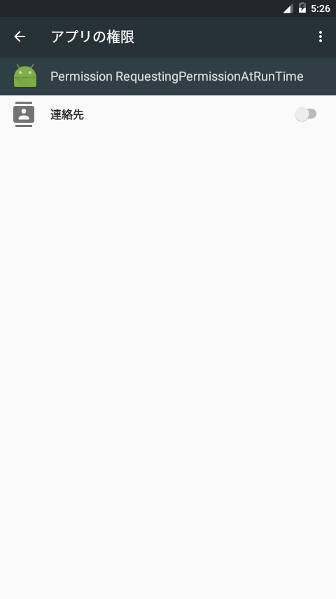{width="6.889763779527559in"
height="2.296456692913386in"}

図 5.3‑2 サンプルアプリAccountManager Userの動作画面

> ポイント：

1.  Authenticatorが正規のものであることを確認してからアカウント処理を実施する

利用アプリのAndroidManifest.xml。必要なPermissionを利用宣言。必要なPermissionについては「5.3.3.1
Account Managerの利用とPermission」を参照。

> AccountManager User/AndroidManifest.xml

&lt;manifest xmlns:android="http://schemas.android.com/apk/res/android"

package="org.jssec.android.accountmanager.user" &gt;

&lt;uses-permission android:name="android.permission.GET\_ACCOUNTS"
/&gt;

&lt;uses-permission android:name="android.permission.MANAGE\_ACCOUNTS"
/&gt;

&lt;uses-permission android:name="android.permission.USE\_CREDENTIALS"
/&gt;

&lt;application

android:allowBackup="false"

android:icon="@drawable/ic\_launcher"

android:label="@string/app\_name"

android:theme="@style/AppTheme" &gt;

&lt;activity

android:name=".UserActivity"

android:label="@string/app\_name"

android:exported="true" &gt;

&lt;intent-filter&gt;

&lt;action android:name="android.intent.action.MAIN" /&gt;

&lt;category android:name="android.intent.category.LAUNCHER" /&gt;

&lt;/intent-filter&gt;

&lt;/activity&gt;

&lt;/application&gt;

&lt;/manifest&gt;

利用アプリのActivity。画面上のボタンをタップするとaddAcount()またはgetAuthToken()が実行される。指定のアカウントタイプに対応したAuthenticatorが偽物であるケースがあるので、正規のAuthenticatorであることを確認してからアカウント処理を始めていることに注意。

> UserActivity.java

package org.jssec.android.accountmanager.user;

import java.io.IOException;

import org.jssec.android.shared.PkgCert;

import org.jssec.android.shared.Utils;

import android.accounts.Account;

import android.accounts.AccountManager;

import android.accounts.AccountManagerCallback;

import android.accounts.AccountManagerFuture;

import android.accounts.AuthenticatorDescription;

import android.accounts.AuthenticatorException;

import android.accounts.OperationCanceledException;

import android.app.Activity;

import android.content.Context;

import android.os.Bundle;

import android.view.View;

import android.widget.TextView;

public class UserActivity extends Activity {

// 利用するAuthenticatorの情報

private static final String JSSEC\_ACCOUNT\_TYPE =
"org.jssec.android.accountmanager";

private static final String JSSEC\_TOKEN\_TYPE = "webservice";

private TextView mLogView;

@Override

public void onCreate(Bundle savedInstanceState) {

super.onCreate(savedInstanceState);

setContentView(R.layout.user\_activity);

mLogView = (TextView)findViewById(R.id.logview);

}

public void addAccount(View view) {

logLine();

logLine("新しいアカウントを追加します");

// ★ポイント1★
Authenticatorが正規のものであることを確認してからアカウント処理を実施する

if (!checkAuthenticator()) return;

AccountManager am = AccountManager.get(this);

am.addAccount(JSSEC\_ACCOUNT\_TYPE, JSSEC\_TOKEN\_TYPE, null, null,
this,

new AccountManagerCallback&lt;Bundle&gt;() {

@Override

public void run(AccountManagerFuture&lt;Bundle&gt; future) {

try {

Bundle result = future.getResult();

String type = result.getString(AccountManager.KEY\_ACCOUNT\_TYPE);

String name = result.getString(AccountManager.KEY\_ACCOUNT\_NAME);

if (type != null && name != null) {

logLine("以下のアカウントを追加しました：");

logLine("　　アカウント種別: %s", type);

logLine("　　アカウント名: %s", name);

} else {

String code = result.getString(AccountManager.KEY\_ERROR\_CODE);

String msg = result.getString(AccountManager.KEY\_ERROR\_MESSAGE);

logLine("アカウントが追加できませんでした");

logLine(" エラーコード %s: %s", code, msg);

}

} catch (OperationCanceledException e) {

} catch (AuthenticatorException e) {

} catch (IOException e) {

}

}

},

null);

}

public void getAuthToken(View view) {

logLine();

logLine("トークンを取得します");

// ★ポイント1★
Authenticatorが正規のものであることを確認してからアカウント処理を実施する

if (!checkAuthenticator()) return;

AccountManager am = AccountManager.get(this);

Account\[\] accounts = am.getAccountsByType(JSSEC\_ACCOUNT\_TYPE);

if (accounts.length &gt; 0) {

Account account = accounts\[0\];

am.getAuthToken(account, JSSEC\_TOKEN\_TYPE, null, this,

new AccountManagerCallback&lt;Bundle&gt;() {

@Override

public void run(AccountManagerFuture&lt;Bundle&gt; future) {

try {

Bundle result = future.getResult();

String name = result.getString(AccountManager.KEY\_ACCOUNT\_NAME);

String authtoken = result.getString(AccountManager.KEY\_AUTHTOKEN);

logLine(" %sさんのトークン:", name);

if (authtoken != null) {

logLine(" %s", authtoken);

} else {

logLine(" 取得できませんでした");

}

} catch (OperationCanceledException e) {

logLine(" 例外: %s",e.getClass().getName());

} catch (AuthenticatorException e) {

logLine(" 例外: %s",e.getClass().getName());

} catch (IOException e) {

logLine(" 例外: %s",e.getClass().getName());

}

}

}, null);

} else {

logLine("アカウントが登録されていません");

}

}

// ★ポイント1★ Authenticatorが正規のものであることを確認する

private boolean checkAuthenticator() {

AccountManager am = AccountManager.get(this);

String pkgname = null;

for (AuthenticatorDescription ad : am.getAuthenticatorTypes()) {

if (JSSEC\_ACCOUNT\_TYPE.equals(ad.type)) {

pkgname = ad.packageName;

break;

}

}

if (pkgname == null) {

logLine("Authenticatorが見つかりません");

return false;

}

logLine(" アカウントタイプ： %s", JSSEC\_ACCOUNT\_TYPE);

logLine(" Authenticatorのパッケージ名：");

logLine(" %s", pkgname);

if (!PkgCert.test(this, pkgname, getTrustedCertificateHash(this))) {

logLine(" 正規のAuthenticatorではありません（証明書不一致）");

return false;

}

logLine(" 正規のAuthenticatorです");

return true;

}

// 正規のAuthenticatorアプリの証明書ハッシュ値

// サンプルアプリ JSSEC CertHash Checker で証明書ハッシュ値は確認できる

private String getTrustedCertificateHash(Context context) {

if (Utils.isDebuggable(context)) {

// debug.keystoreの"androiddebugkey"の証明書ハッシュ値

return "0EFB7236 328348A9 89718BAD DF57F544 D5CCB4AE B9DB34BC 1E29DD26
F77C8255";

} else {

// keystoreの"my company key"の証明書ハッシュ値

return "D397D343 A5CBC10F 4EDDEB7C A10062DE 5690984F 1FB9E88B D7B3A7C2
42E142CA";

}

}

private void log(String str) {

mLogView.append(str);

}

private void logLine(String line) {

log(line + "\\n");

}

private void logLine(String fmt, Object... args) {

logLine(String.format(fmt, args));

}

private void logLine() {

log("\\n");

}

}

> PkgCert.java

package org.jssec.android.shared;

import java.security.MessageDigest;

import java.security.NoSuchAlgorithmException;

import android.content.Context;

import android.content.pm.PackageInfo;

import android.content.pm.PackageManager;

import android.content.pm.PackageManager.NameNotFoundException;

import android.content.pm.Signature;

public class PkgCert {

public static boolean test(Context ctx, String pkgname, String
correctHash) {

if (correctHash == null) return false;

correctHash = correctHash.replaceAll(" ", "");

return correctHash.equals(hash(ctx, pkgname));

}

public static String hash(Context ctx, String pkgname) {

if (pkgname == null) return null;

try {

PackageManager pm = ctx.getPackageManager();

PackageInfo pkginfo = pm.getPackageInfo(pkgname,
PackageManager.GET\_SIGNATURES);

if (pkginfo.signatures.length != 1) return null; // 複数署名は扱わない

Signature sig = pkginfo.signatures\[0\];

byte\[\] cert = sig.toByteArray();

byte\[\] sha256 = computeSha256(cert);

return byte2hex(sha256);

} catch (NameNotFoundException e) {

return null;

}

}

private static byte\[\] computeSha256(byte\[\] data) {

try {

return MessageDigest.getInstance("SHA-256").digest(data);

} catch (NoSuchAlgorithmException e) {

return null;

}

}

private static String byte2hex(byte\[\] data) {

if (data == null) return null;

final StringBuilder hexadecimal = new StringBuilder();

for (final byte b : data) {

hexadecimal.append(String.format("%02X", b));

}

return hexadecimal.toString();

}

}

### ルールブック

Authenticatorアプリを実装する際には以下のルールを守ること。

1.  Authenticatorを提供するServiceは非公開Serviceとする （必須）

2.  ログイン画面ActivityはAuthenticatorアプリで実装する （必須）

3.  ログイン画面Activityは公開Activityとして他のアプリからの攻撃アクセスを想定する
    > （必須）

4.  KEY\_INTENTには、ログイン画面Activityのクラス名を指定した明示的Intentを与える
    > （必須）

5.  アカウント情報や認証トークンなどのセンシティブな情報はログ出力しない
    > （必須）

6.  Account Managerにパスワードを保存しない （推奨）

7.  Authenticatorとオンラインサービスとの通信はHTTPSで行う （必須）

利用アプリを実装する際には以下のルールを守ること。

1.  Authenticatorが正規のものであることを確認してからアカウント処理を実施する
    > （必須）

#### Authenticatorを提供するServiceは非公開Serviceとする （必須）

Authenticatorを提供するServiceはAccount
Managerから利用されることを前提としており、他のアプリがアクセスできてはならない。非公開Serviceとすることにより、他のアプリからのアクセスを排除することができる。またAccount
Managerはsystem権限で動作しているので非公開Serviceであってもアクセスできる。

#### ログイン画面ActivityはAuthenticatorアプリで実装する （必須）

新規アカウント追加および認証トークン再取得の場合に表示されるログイン画面はAuthenticatorアプリで実装すべきである。利用アプリ側で独自にログイン画面を用意してはならない。この記事の冒頭で「パスワードという極めてセンシティブな情報をアプリが扱わなくて済むことがAccount
Managerの利点である。」と呼べた。もし利用アプリ側でログイン画面を用意してしまうと、利用アプリがパスワードを扱ってしまうことになり、Account
Managerの思想から逸脱した設計となってしまう。

Authenticatorアプリがログイン画面を用意することにより、ログイン画面を操作できるのは端末のユーザーだけに限定される。これは悪意あるアプリが直接ログインを試みたり、アカウントを作成したりといったアカウント攻撃をする手段がないということである。

#### ログイン画面Activityは公開Activityとして他のアプリからの攻撃アクセスを想定する （必須）

ログイン画面Activityは利用アプリの権限で起動する仕組みとなっている。利用アプリとAuthenticatorアプリの署名鍵が異なる場合にもログイン画面Activityが表示されるためには、ログイン画面Activityは公開Activityとして実装しなければならない。

ログイン画面Activityが公開Activityであるということは、悪意あるアプリからも起動される可能性があるということである。入力データは一切信用してはならない。したがって「3.2
入力データの安全性を確認する」で述べたような対策が必要となる。

#### KEY\_INTENTには、ログイン画面Activityのクラス名を指定した明示的Intentを与える （必須）

Authenticatorがログイン画面Activityを開きたいときには、Account
Managerに返すBundleの中にログイン画面Activityを起動するIntentをKEY\_INTENTで与えることになっている。ここで与えるIntentはログイン画面Activityをクラス名で指定する明示的Intentでなければならない。もしアクション名指定の暗黙的Intentを指定してしまうと、Authenticatorアプリが自ら用意したログイン画面Activityではなく、他のアプリが用意したActivityが起動される可能性が生じてしまうからだ。悪意あるアプリが正規のログイン画面に似せたログイン画面を用意していた場合、偽のログイン画面でユーザーがパスワードを入力してしまう危険がある。

#### アカウント情報や認証トークンなどのセンシティブな情報はログ出力しない （必須）

オンラインサービスに接続するアプリは、その開発時だけでなく運用時においても、オンラインサービスにうまく接続できないトラブルに悩まされることがある。接続できない原因は多岐に渡り、ネットワーク環境の整備不足、通信プロトコルの実装ミス、Permission不足、認証エラーなど様々である。こうした原因の切り分けを目的として、プログラム内部で得られた情報をログ出力する実装もよくみられる。

パスワードや認証トークンなどのセンシティブな情報は決してログ出力してはならない。ログ情報は他のアプリからも読み取ることができるため情報漏洩の原因となりかねないからだ。アカウント名も漏洩も被害につながる場合にはログ出力してはならない。

#### Account Managerにパスワードを保存しない （推奨）

Account
Managerに登録するアカウントには、パスワードと認証トークンの2つの認証情報を保存することができる。これらの情報は次のディレクトリのaccounts.dbの中に平文で（つまり暗号化されず）保存される。\
・Android 4.1以前\
/data/system/accounts.db\
・Android 4.2以降\
/data/system/users/0/accounts.db\
※Android
4.2以降はマルチユーザー機能がサポートされているため、ユーザーに合わせたディレクトリへ保存されるように変更されている。

このaccounts.dbの内容を読み取るためにはroot権限またはsystem権限が必要であり、市販のAndroid端末では読み取ることができない。もし、攻撃者にroot権限やsystem権限が奪われてしまう脆弱性がAndroid
OSにある場合には、accounts.dbの中に保存された認証情報が危険にさらされることになる。

この記事で紹介しているAuthenticatorアプリは、Account
Managerに認証トークンは保存するが、ユーザーのパスワードは保存しない設計としている。一定の期間以内にオンラインサービスに継続的に接続していれば、認証トークンの有効期間が延長されるのが一般的であるため、パスワードを保存しない設計で十分であることが多い。

認証トークンは一般にパスワードよりも有効期限が短く、いつでも無効化できる特徴がある、いわば使い捨ての認証情報である。万一、認証トークンが漏洩したとしても、認証トークンを無効化することができるため、認証トークンはパスワードに比べ安全性が高いとされている。認証トークンが無効化された場合には、ユーザーはもう一度パスワードを入力して新しい認証トークンを取得すればよい。

パスワードが漏洩した場合、パスワードを無効化してしまうと、そのユーザーはオンラインサービスを利用できなくなってしまう。このような場合、コールセンター対応等が必要となってしまうため大きなコストが発生する。ゆえにAccount
Managerにパスワードを保存する設計はできるだけ避けるべきである。どうしてもパスワードを保存する設計をしなければならない場合は、パスワードを暗号化して、暗号化の鍵を難読化するなど、高度なリバースエンジニアリング対策を実施することになる。

#### Authenticatorとオンラインサービスとの通信はHTTPSで行う （必須）

パスワードや認証トークンはいわゆる認証情報といい、これを第三者に奪われてしまうと、第三者がユーザーになりすましできることになる。Authenticatorはオンラインサービスとこうした認証情報を送受信することになるので、HTTPS等の安全性の確立した暗号化通信方式で通信しなければならない。

#### Authenticatorが正規のものであることを確認してからアカウント処理を実施する （必須）

端末に同一のアカウントタイプを定義したAuthenticatorが複数存在する場合、先にインストールされたAuthenticatorが有効になる。自分のAuthenticatorが後にインストールされた場合には利用されないということである。

もし先にインストールされたAuthenticatorがマルウェアによる偽装であった場合には、ユーザーが入力したアカウント情報がマルウェアに奪われてしまう恐れがある。利用アプリはアカウント操作を行うアカウントタイプについて、正規のAuthenticatorがそのアカウントタイプに割り当てられていることを確認してから、アカウント操作を実施しなければならない。

あるアカウントタイプに割り当てられているAuthenticatorが正規のものであるかは、そのAuthenticatorを含むパッケージの証明書ハッシュ値を、事前に確認している正規の証明書ハッシュ値と一致するかどうかで確認できる。もし証明書ハッシュ値が一致しないことが判明した場合、そのアカウントタイプに割り当てられている意図しないAuthenticatorを含むパッケージをアンインストールするようユーザーを促すといった対処を施すことが望ましい。

### アドバンスト

#### Account Managerの利用とPermission

AccountManagerクラスの各メソッドを利用するためには、アプリのAndroidManifest.xmlにそれぞれ適正なPermissionの利用宣言をする必要がある。Permissionとメソッドの対応を表
5.3‑1に示す。

[]{#_Ref351768346 .anchor}表 5.3‑1　Account Managerの機能とPermission

  --------------------------------------------------------------------------------------------------------------------------------------------
                                                           Account Managerが提供する機能
  -------------------------------------------------------- -------------------------------- --------------------------------------------------
  Permission                                               メソッド                         説明

  AUTHENTICATE\_ACCOUNTS                                   getPassword()                    パスワードの取得
                                                                                            
  (Authenticatorと同じ鍵で署名されたPackageのみ利用可能)                                    

                                                           getUserData()                    利用者情報の取得

                                                           addAccountExplicitly()           アカウントのDBへの追加

                                                           peekAuthToken()                  キャッシュされたトークンの取得

                                                           setAuthToken()                   認証トークンの登録

                                                           setPassword()                    パスワードの変更

                                                           setUserData()                    利用者情報の設定

                                                           renameAccount()                  アカウント名の変更

  GET\_ACCOUNTS                                            getAccounts()                    すべてのアカウントの一覧取得

                                                           getAccountsByType()              アカウントタイプが同じアカウントの一覧取得

                                                           getAccountsByTypeAndFeatures()   指定した機能を持ったアカウントの一覧取得

                                                           addOnAccountsUpdatedListener()   イベントリスナーの登録

                                                           hasFeatures()                    指定した機能の有無

  MANAGE\_ACCOUNTS                                         getAuthTokenByFeatures()         指定した機能を持つアカウントの認証トークンの取得

                                                           addAccount()                     ユーザーへのアカウント追加要請

                                                           removeAccount()                  アカウントの削除

                                                           clearPassword()                  パスワードの初期化

                                                           updateCredentials()              ユーザーへのパスワード変更要請

                                                           editProperties()                 Authenticatorの設定変更

                                                           confirmCredentials()             ユーザーへのパスワード再入力要請

  USE\_CREDENTIALS                                         getAuthToken()                   認証トークンの取得

                                                           blockingGetAuthToken()           認証トークンの取得

  MANAGE\_ACCOUNTS                                         invalidateAuthToken()            キャッシュされたトークンの削除
                                                                                            
  または                                                                                    
                                                                                            
  USE\_CREDENTIALS                                                                          
  --------------------------------------------------------------------------------------------------------------------------------------------

ここで、AUTHENTICATE\_ACCOUNTS
Permissionが必要なメソッド群を使う場合にはPermissionに加えてパッケージの署名鍵に関する制限が設けられている。具体的には、Authenticatorを提供するパッケージの署名に使う鍵とメソッドを使うアプリのパッケージの署名に使う鍵が同じでなければならない。そのため、Authenticator以外にAUTHENTICATE\_ACCOUNTS
Permissionが必要なメソッド群を使うアプリを配布する際には、Authenticatorと同じ鍵で署名を施すことになる。

Android
Studioでの開発の際には設定した署名鍵が固定で使われるため、鍵のことを意識せずにPermissionだけで実装や動作確認が出来てしまう。特にアプリによって署名鍵を使い分けている開発者は、この制限を考慮してアプリに使う鍵を選定する必要があるので注意をすること。また、Account
Managerから取得するデータにはセンシティブな情報が含まれるため、漏洩や不正利用などのリスクを減らすように扱いには十分注意すること。

#### Android 4.0.xでは利用アプリとAuthenticatorアプリの署名鍵が異なると例外が発生する

Authenticatorを含むAuthenticatorアプリと異なる開発者鍵で署名された利用アプリから認証トークンの取得機能が要求された場合、Account
Managerは認証トークン使用許諾画面（GrantCredentialsPermissionActivity）を表示してユーザーに認証トークンの使用可否を確認する。しかし、Android
4.0.xのAndroid Frameworkには不具合があり、Account
Managerによってこの画面が開かれた途端、例外が発生し、アプリが強制終了してしまう（図
5.3‑3）。不具合の詳細は
[*https://code.google.com/p/android/issues/detail?id=23421*](https://code.google.com/p/android/issues/detail?id=23421)
に記載されている。Android 4.1.x以降ではこの不具合はない。

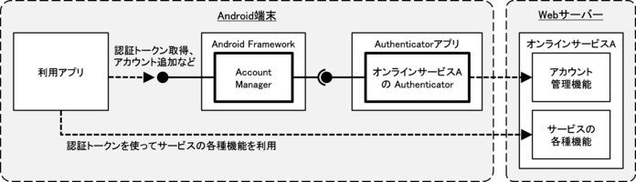{width="6.3597222222222225in" height="4.5in"}

[]{#_Ref351721722 .anchor}図
5.3‑3Android標準の認証トークン使用許諾画面を表示した場合

HTTPSで通信する
---------------

スマートフォンアプリはインターネット上のWebサーバーと通信するものが多い。その通信方式として当ガイドではHTTPとHTTPSの2方式に着目する。この2方式のうち、セキュリティの観点ではHTTPSによる通信が望ましい。近年GoogleやFacebookなど大手のWebサービスはHTTPSによる接続を基本とするように変わってきた。

2012年以降AndroidアプリのHTTPS通信の実装方法における欠陥が多く指摘されている。これは信頼できる第三者認証局から発行されたサーバー証明書ではなく、私的に発行されたサーバー証明書（以降、プライベート証明書と呼ぶ）により運用されているテスト用Webサーバーに接続するために実装された欠陥であると推察される。

この記事では、HTTPおよびHTTPS通信の方法について説明する。HTTPS通信の方法には、プライベート証明書で運用されているWebサーバーに安全に接続する方法も含む。

### サンプルコード

開発しているアプリの通信処理の特性を踏まえ、図
5.4‑1に従いサンプルコードを選択すること。

{width="6.900393700787402in"
height="4.751968503937008in"}

[]{#_Ref348001019 .anchor}図 5.4‑1
HTTP/HTTPSのサンプルコードを選択するフローチャート

センシティブな情報を送受信する場合はSSL/TLSで通信経路が暗号化されるHTTPS通信を用いる。HTTPS通信を用いたほうが良いセンシティブな情報としては以下のようなものがある。

-   WebサービスへのログインID、パスワード

-   認証状態を維持するための情報（セッションID、トークン、Cookieの情報など）

-   その他Webサービスの特性に応じた重要情報・秘密情報（個人情報やクレジットカード情報など）

ここで対象となっているスマートフォンアプリは、サーバーと通信を行うことで連携し、構築されるシステムの一部を担っている。従って、通信のどの部分をHTTPもしくはHTTPSとするのかについては、システム全体を考慮して適切なセキュア設計・セキュアコーディングを施すこと。HTTPとHTTPSの通信方式の違いは表
5.4‑1を参考にすること。またサンプルコードの違いについては表
5.4‑2を参考にすること。

[]{#_Ref347254555 .anchor}表 5.4‑1 HTTP通信方式、HTTPS通信方式の比較

+-----------------------+-----------------------+-----------------------+
|                       | HTTP                  | HTTPS                 |
+=======================+=======================+=======================+
| 特徴                  | URL                   | http://で始まる       |
|                       |                       |                       |
|                       | 通信内容の暗号化      | なし                  |
|                       |                       |                       |
|                       | 通信内容の改ざん検知  | 不可                  |
|                       |                       |                       |
|                       | 接続先サーバーの認証  | 不可                  |
+-----------------------+-----------------------+-----------------------+
| 被害\                 | 攻撃者による通信内容の読み取り | 高           |
| リスク                |                       |                       |
|                       |                       | 高                    |
|                       | 攻撃者による通信内容の書き換え |              |
|                       |                       | 高                    |
|                       |                       |                       |
|                       | アプリの偽サーバーへの接続 |                  |
+-----------------------+-----------------------+-----------------------+

[]{#_Ref347259253 .anchor}表 5.4‑2 HTTP/HTTPS通信のサンプルコードの説明

  ---------------------------------------------------------------------------------------------------------------------------------------------
  サンプルコード                      通信    センシティブな情報の送受信   サーバー証明書
  ----------------------------------- ------- ---------------------------- --------------------------------------------------------------------
  HTTP通信する                        HTTP    ×                            -

  HTTPS通信する                       HTTPS   ○                            CybertrustやVeriSign等の第三者認証局により発行されたサーバー証明書

  プライベート証明書でHTTPS通信する   HTTPS   ○                            プライベート証明書
                                                                           
                                                                           ※イントラサーバーやテストサーバーで良くみられる運用形態
  ---------------------------------------------------------------------------------------------------------------------------------------------

[]{#_Ref348015340
.anchor}なおAndroidがサポートし現在広く使われているHTTP/HTTPS通信用APIは、Java
SDK由来のjava.net.HttpURLConnection/javax.net.ssl.HttpsURLConnectionである。Apache
HTTPComponent由来のApache HttpClientライブラリについては、Android
6.0（API Level 23)でサポートが打ち切られている。

#### HTTP通信する

HTTP通信で送受信する情報はすべて攻撃者に盗聴・改ざんされる可能性があることを前提としなければならない。また接続先サーバーも攻撃者が用意した偽物のサーバーに接続することがあることも前提としなければならない。このような前提においても被害が生じない、または許容範囲に収まる用途のアプリにおいてのみ、HTTP通信を利用できる。こうした前提を受け入れられないアプリについては「5.4.1.2
HTTPS通信する」や「5.4.1.3
プライベート証明書でHTTPS通信する」を参照すること。

以下のサンプルコードは、Webサーバー上で画像検索を行い、検索画像を取得して表示するアプリである。1回の検索でサーバーとHTTP通信を2回行う。1回目の通信で画像検索を実施し、2回目の通信で画像を取得する。UIスレッドでの通信を避けるために、AsyncTaskを利用して通信処理用のワーカースレッドを作成している。Webサーバーとの通信で送受信する情報は、画像の検索文字列、画像のURL、画像データだが、どれもセンシティブな情報はないとみなしている。そのため、受信データである画像のURLと画像データは、攻撃者が用意した攻撃用のデータである可能性がある。簡単のため、サンプルコードでは受信データが攻撃データであっても許容されるとして対策を施していない。また、同様の理由により、JSONパース時や画像データを表示する時に発生する可能性のある例外に対する例外処理を省略している。アプリの仕様に応じて適切に処理を実装する必要があることに注意すること。

> ポイント：

1.  送信データにセンシティブな情報を含めない

2.  受信データが攻撃者からの送信データである場合を想定する

> HttpImageSearch.java

package org.jssec.android.https.imagesearch;

import android.os.AsyncTask;

import org.json.JSONException;

import org.json.JSONObject;

import java.io.BufferedInputStream;

import java.io.ByteArrayOutputStream;

import java.io.IOException;

import java.net.HttpURLConnection;

import java.net.URL;

public abstract class HttpImageSearch extends AsyncTask&lt;String, Void,
Object&gt; {

@Override

protected Object doInBackground(String... params) {

byte\[\] responseArray;

// --------------------------------------------------------

// 通信1回目：画像検索する

// --------------------------------------------------------

// ★ポイント1★ 送信データにセンシティブな情報を含めない

// 画像検索文字列を送信する

StringBuilder s = new StringBuilder();

for (String param : params){

s.append(param);

s.append('+');

}

s.deleteCharAt(s.length() - 1);

String search\_url =
"http://ajax.googleapis.com/ajax/services/search/images?v=1.0&q=" +

s.toString();

responseArray = getByteArray(search\_url);

if (responseArray == null) {

return null;

}

// ★ポイント2★ 受信データが攻撃者からの送信データである場合を想定する

// サンプルにつき検索結果が攻撃者からのデータである場合の処理は割愛

// サンプルにつきJSONパース時の例外処理は割愛

String image\_url;

try {

String json = new String(responseArray);

image\_url = new JSONObject(json).getJSONObject("responseData")

.getJSONArray("results").getJSONObject(0).getString("url");

} catch(JSONException e) {

return e;

}

// --------------------------------------------------------

// 通信2回目：画像を取得する

// --------------------------------------------------------

// ★ポイント1★ 送信データにセンシティブな情報を含めない

if (image\_url != null ) {

responseArray = getByteArray(image\_url);

if (responseArray == null) {

return null;

}

}

// ★ポイント2★ 受信データが攻撃者からの送信データである場合を想定する

return responseArray;

}

private byte\[\] getByteArray(String strUrl) {

byte\[\] buff = new byte\[1024\];

byte\[\] result = null;

HttpURLConnection response;

BufferedInputStream inputStream = null;

ByteArrayOutputStream responseArray = null;

int length;

try {

URL url = new URL(strUrl);

response = (HttpURLConnection) url.openConnection();

response.setRequestMethod("GET");

response.connect();

checkResponse(response);

inputStream = new BufferedInputStream(response.getInputStream());

responseArray = new ByteArrayOutputStream();

while ((length = inputStream.read(buff)) != -1) {

if (length &gt; 0) {

responseArray.write(buff, 0, length);

}

}

result = responseArray.toByteArray();

} catch (IOException e) {

e.printStackTrace();

} finally {

if (inputStream != null) {

try {

inputStream.close();

} catch (IOException e) {

// 例外処理は割愛

}

}

if (responseArray != null) {

try {

responseArray.close();

} catch (IOException e) {

// 例外処理は割愛

}

}

}

return result;

}

private void checkResponse(HttpURLConnection response) throws
IOException {

int statusCode = response.getResponseCode();

if (HttpURLConnection.HTTP\_OK != statusCode) {

throw new IOException("HttpStatus: " + statusCode);

}

}

}

> ImageSearchActivity.java

package org.jssec.android.https.imagesearch;

import android.app.Activity;

import android.graphics.Bitmap;

import android.graphics.BitmapFactory;

import android.os.AsyncTask;

import android.os.Bundle;

import android.view.View;

import android.widget.EditText;

import android.widget.ImageView;

import android.widget.TextView;

public class ImageSearchActivity extends Activity {

private EditText mQueryBox;

private TextView mMsgBox;

private ImageView mImgBox;

private AsyncTask&lt;String, Void, Object&gt; mAsyncTask ;

@Override

public void onCreate(Bundle savedInstanceState) {

super.onCreate(savedInstanceState);

setContentView(R.layout.activity\_main);

mQueryBox = (EditText)findViewById(R.id.querybox);

mMsgBox = (TextView)findViewById(R.id.msgbox);

mImgBox = (ImageView)findViewById(R.id.imageview);

}

@Override

protected void onPause() {

//
このあとActivityが破棄される可能性があるので非同期処理をキャンセルしておく

if (mAsyncTask != null) mAsyncTask.cancel(true);

super.onPause();

}

public void onHttpSearchClick(View view) {

String query = mQueryBox.getText().toString();

mMsgBox.setText("HTTP:" + query);

mImgBox.setImageBitmap(null);

// 直前の非同期処理が終わってないこともあるのでキャンセルしておく

if (mAsyncTask != null) mAsyncTask.cancel(true);

//
UIスレッドで通信してはならないので、AsyncTaskによりワーカースレッドで通信する

mAsyncTask = new HttpImageSearch() {

@Override

protected void onPostExecute(Object result) {

// UIスレッドで通信結果を処理する

if (result == null) {

mMsgBox.append("\\n例外発生\\n");

} else if (result instanceof Exception) {

Exception e = (Exception)result;

mMsgBox.append("\\n例外発生\\n" + e.toString());

} else {

// サンプルにつき画像表示の際の例外処理は割愛

byte\[\] data = (byte\[\])result;

Bitmap bmp = BitmapFactory.decodeByteArray(data, 0, data.length);

mImgBox.setImageBitmap(bmp);

}

}

}.execute(query); // 検索文字列を渡して非同期処理を開始

}

public void onHttpsSearchClick(View view) {

String query = mQueryBox.getText().toString();

mMsgBox.setText("HTTPS:" + query);

mImgBox.setImageBitmap(null);

// 直前の非同期処理が終わってないこともあるのでキャンセルしておく

if (mAsyncTask != null) mAsyncTask.cancel(true);

//
UIスレッドで通信してはならないので、AsyncTaskによりワーカースレッドで通信する

mAsyncTask = new HttpsImageSearch() {

@Override

protected void onPostExecute(Object result) {

// UIスレッドで通信結果を処理する

if (result instanceof Exception) {

Exception e = (Exception)result;

mMsgBox.append("\\n例外発生\\n" + e.toString());

} else {

byte\[\] data = (byte\[\])result;

Bitmap bmp = BitmapFactory.decodeByteArray(data, 0, data.length);

mImgBox.setImageBitmap(bmp);

}

}

}.execute(query); // 検索文字列を渡して非同期処理を開始

}

}

> AndroidManifest.xml

&lt;manifest xmlns:android="http://schemas.android.com/apk/res/android"

package="org.jssec.android.https.imagesearch"

android:versionCode="1"

android:versionName="1.0"&gt;

&lt;uses-permission android:name="android.permission.INTERNET"/&gt;

&lt;application

android:icon="@drawable/ic\_launcher"

android:allowBackup="false"

android:label="@string/app\_name" &gt;

&lt;activity

android:name=".ImageSearchActivity"

android:label="@string/app\_name"

android:theme="@android:style/Theme.Light"

android:exported="true" &gt;

&lt;intent-filter&gt;

&lt;action android:name="android.intent.action.MAIN" /&gt;

&lt;category android:name="android.intent.category.LAUNCHER" /&gt;

&lt;/intent-filter&gt;

&lt;/activity&gt;

&lt;/application&gt;

&lt;/manifest&gt;

#### HTTPS通信する

HTTPS通信では送受信するデータが暗号化されるだけでなく、接続先サーバーが本物かどうかの検証も行われる。そのためにHTTPS通信開始時のハンドシェイク処理において、サーバーから送られてくるサーバー証明書に対して、AndroidのHTTPSライブラリ内部で次のような観点で検証が行われる。

-   第三者認証局により署名されたサーバー証明書であること

-   サーバー証明書の期限等が有効であること

-   サーバー証明書のSubjectのCN（Common Name）またはSAN（Subject
    Altername
    Names）のDNS名が接続先サーバーのホスト名と一致していること

これらの検証に失敗するとサーバー証明書検証エラー（SSLException）が発生する。サーバー証明書に不備がある場合、もしくは攻撃者が中間者攻撃[^29]をしている場合にこのエラーが発生する。エラーが発生した場合には、アプリの仕様に応じて適切な処理を実行する必要がある点に注意すること。

ここでは第三者認証局から発行されたサーバー証明書で運用されているWebサーバーに接続するHTTPS通信のサンプルコードを示す。第三者認証局から発行されたサーバー証明書ではなく、私的に発行したサーバー証明書でHTTPS通信を実現したい場合には「5.4.1.3
プライベート証明書でHTTPS通信する」を参照すること。

以下のサンプルコードは、Webサーバー上で画像検索を行い、検索画像を取得して表示するアプリである。1回の検索でサーバーとHTTPS通信を2回行う。1回目の通信で画像検索を実施し、2回目の通信で画像を取得する。UIスレッドでの通信を避けるために、AsyncTaskを利用して通信処理用のワーカースレッドを作成している。Webサーバーとの通信で送受信する情報は、画像の検索文字列、画像のURL、画像データで、全てセンシティブな情報とみなしている。なお、簡単のため、SSLExceptionに対してはユーザーへの通知などの例外処理を行っていないが、アプリの仕様に応じて適切な処理を実装する必要がある。また、以下のサンプルコードではSSLv3を用いた通信が許容されている。SSLv3の脆弱性（通称
POODLE）に対する攻撃を回避するためには、接続先サーバーにおいてSSLv3を無効化する設定を施すことをお勧めする。

> ポイント：

1.  URIはhttps://で始める

2.  送信データにセンシティブな情報を含めてよい

3.  HTTPS接続したサーバーからのデータであっても、受信データの安全性を確認する

4.  SSLExceptionに対してアプリに適した例外処理を行う

> HttpsImageSearch.java

package org.jssec.android.https.imagesearch;

import org.json.JSONException;

import org.json.JSONObject;

import android.os.AsyncTask;

import java.io.BufferedInputStream;

import java.io.ByteArrayOutputStream;

import java.io.IOException;

import java.net.HttpURLConnection;

import java.net.URL;

public abstract class HttpsImageSearch extends AsyncTask&lt;String,
Void, Object&gt; {

@Override

protected Object doInBackground(String... params) {

byte\[\] responseArray;

// --------------------------------------------------------

// 通信1回目：画像検索する

// --------------------------------------------------------

// ★ポイント1★ URIはhttps://で始める

// ★ポイント2★ 送信データにセンシティブな情報を含めてよい

StringBuilder s = new StringBuilder();

for (String param : params){

s.append(param);

s.append('+');

}

s.deleteCharAt(s.length() - 1);

String search\_url =
"https://ajax.googleapis.com/ajax/services/search/images?v=1.0&q=" +

s.toString();

responseArray = getByteArray(search\_url);

if (responseArray == null) {

return null;

}

// ★ポイント3★
HTTPS接続したサーバーからのデータであっても、受信データの安全性を確認する

// サンプルにつき割愛。「3.2 入力データの安全性を確認する」を参照。

String image\_url;

try {

String json = new String(responseArray);

image\_url = new JSONObject(json).getJSONObject("responseData")

.getJSONArray("results").getJSONObject(0).getString("url");

} catch(JSONException e) {

return e;

}

// --------------------------------------------------------

// 通信2回目：画像を取得する

// --------------------------------------------------------

// ★ポイント1★ URIはhttps://で始める

// ★ポイント2★ 送信データにセンシティブな情報を含めてよい

if (image\_url != null ) {

responseArray = getByteArray(image\_url);

if (responseArray == null) {

return null;

}

}

return responseArray;

}

private byte\[\] getByteArray(String strUrl) {

byte\[\] buff = new byte\[1024\];

byte\[\] result = null;

HttpURLConnection response;

BufferedInputStream inputStream = null;

ByteArrayOutputStream responseArray = null;

int length;

try {

URL url = new URL(strUrl);

response = (HttpURLConnection) url.openConnection();

response.setRequestMethod("GET");

response.connect();

checkResponse(response);

inputStream = new BufferedInputStream(response.getInputStream());

responseArray = new ByteArrayOutputStream();

while ((length = inputStream.read(buff)) != -1) {

if (length &gt; 0) {

responseArray.write(buff, 0, length);

}

}

result = responseArray.toByteArray();

} catch (IOException e) {

e.printStackTrace();

} finally {

if (inputStream != null) {

try {

inputStream.close();

} catch (IOException e) {

// 例外処理は割愛

}

}

if (responseArray != null) {

try {

responseArray.close();

} catch (IOException e) {

// 例外処理は割愛

}

}

}

return result;

}

private void checkResponse(HttpURLConnection response) throws
IOException {

int statusCode = response.getResponseCode();

if (HttpURLConnection.HTTP\_OK != statusCode) {

throw new IOException("HttpStatus: " + statusCode);

}

}

}

サンプルコードの他のファイルについては「5.4.1.1　HTTP通信する」と共用しているので「5.4.1.1　HTTP通信する」も参照すること。

#### プライベート証明書でHTTPS通信する

ここでは第三者認証局から発行されたサーバー証明書ではなく、私的に発行したサーバー証明書（プライベート証明書）でHTTPS通信をするサンプルコードを示す。プライベート認証局のルート証明書とプライベート証明書の作成方法およびWebサーバーのHTTPS設定については「5.4.3.1
プライベート証明書の作成方法とサーバー設定」を参考にすること。またサンプルプログラムのassets中のcacert.crtファイルはプライベート認証局のルート証明書ファイルである。

以下のサンプルコードは、Webサーバー上の画像を取得して表示するアプリである。WebサーバーとはHTTPSを用いた通信を行う。UIスレッドでの通信を避けるために、AsyncTaskを利用して通信処理用のワーカースレッドを作成している。Webサーバーとの通信で送受信する情報は画像のURLと画像データで、このサンプルではどちらもセンシティブな情報とみなしている。また、簡単のため、SSLExceptionに対してはユーザーへの通知などの例外処理を行っていないが、アプリの仕様に応じて適切な処理を実装する必要がある。

> ポイント：

1.  プライベート認証局のルート証明書でサーバー証明書を検証する

2.  URIはhttps://で始める

3.  送信データにセンシティブな情報を含めてよい

4.  受信データを接続先サーバーと同じ程度に信用してよい

5.  SSLExceptionに対しユーザーに通知する等の適切な例外処理をする

> PrivateCertificateHttpsGet.java

package org.jssec.android.https.privatecertificate;

import java.io.BufferedInputStream;

import java.io.ByteArrayOutputStream;

import java.io.IOException;

import java.net.HttpURLConnection;

import java.net.URL;

import java.security.KeyStore;

import java.security.SecureRandom;

import javax.net.ssl.HostnameVerifier;

import javax.net.ssl.HttpsURLConnection;

import javax.net.ssl.SSLContext;

import javax.net.ssl.SSLException;

import javax.net.ssl.SSLSession;

import javax.net.ssl.TrustManagerFactory;

import android.content.Context;

import android.os.AsyncTask;

public abstract class PrivateCertificateHttpsGet extends
AsyncTask&lt;String, Void, Object&gt; {

private Context mContext;

public PrivateCertificateHttpsGet(Context context) {

mContext = context;

}

@Override

protected Object doInBackground(String... params) {

TrustManagerFactory trustManager;

BufferedInputStream inputStream = null;

ByteArrayOutputStream responseArray = null;

byte\[\] buff = new byte\[1024\];

int length;

try {

URL url = new URL(params\[0\]);

// ★ポイント1★ プライベート証明書でサーバー証明書を検証する

// assetsに格納しておいたプライベート証明書だけを含むKeyStoreを設定

KeyStore ks = KeyStoreUtil.getEmptyKeyStore();

KeyStoreUtil.loadX509Certificate(ks,

mContext.getResources().getAssets().open("cacert.crt"));

// ホスト名の検証を行う

HttpsURLConnection.setDefaultHostnameVerifier(new HostnameVerifier() {

@Override

public boolean verify(String hostname, SSLSession session) {

if (!hostname.equals(session.getPeerHost())) {

return false;

}

return true;

}

});

// ★ポイント2★ URIはhttps://で始める

// ★ポイント3★ 送信データにセンシティブな情報を含めてよい

trustManager =
TrustManagerFactory.getInstance(TrustManagerFactory.getDefaultAlgorithm());

trustManager.init(ks);

SSLContext sslCon = SSLContext.getInstance("TLS");

sslCon.init(null, trustManager.getTrustManagers(), new SecureRandom());

HttpURLConnection con = (HttpURLConnection)url.openConnection();

HttpsURLConnection response = (HttpsURLConnection)con;

response.setDefaultSSLSocketFactory(sslCon.getSocketFactory());

response.setSSLSocketFactory(sslCon.getSocketFactory());

checkResponse(response);

// ★ポイント4★ 受信データを接続先サーバーと同じ程度に信用してよい

inputStream = new BufferedInputStream(response.getInputStream());

responseArray = new ByteArrayOutputStream();

while ((length = inputStream.read(buff)) != -1) {

if (length &gt; 0) {

responseArray.write(buff, 0, length);

}

}

return responseArray.toByteArray();

} catch(SSLException e) {

// ★ポイント5★
SSLExceptionに対しユーザーに通知する等の適切な例外処理をする

// サンプルにつき例外処理は割愛

return e;

} catch(Exception e) {

return e;

} finally {

if (inputStream != null) {

try {

inputStream.close();

} catch (Exception e) {

// 例外処理は割愛

}

}

if (responseArray != null) {

try {

responseArray.close();

} catch (Exception e) {

// 例外処理は割愛

}

}

}

}

private void checkResponse(HttpURLConnection response) throws
IOException {

int statusCode = response.getResponseCode();

if (HttpURLConnection.HTTP\_OK != statusCode) {

throw new IOException("HttpStatus: " + statusCode);

}

}

}

> KeyStoreUtil.java

package org.jssec.android.https.privatecertificate;

import java.io.IOException;

import java.io.InputStream;

import java.security.KeyStore;

import java.security.KeyStoreException;

import java.security.NoSuchAlgorithmException;

import java.security.cert.Certificate;

import java.security.cert.CertificateException;

import java.security.cert.CertificateFactory;

import java.security.cert.X509Certificate;

import java.util.Enumeration;

public class KeyStoreUtil {

public static KeyStore getEmptyKeyStore() throws KeyStoreException,

NoSuchAlgorithmException, CertificateException, IOException {

KeyStore ks = KeyStore.getInstance("BKS");

ks.load(null);

return ks;

}

public static void loadAndroidCAStore(KeyStore ks)

throws KeyStoreException, NoSuchAlgorithmException,

CertificateException, IOException {

KeyStore aks = KeyStore.getInstance("AndroidCAStore");

aks.load(null);

Enumeration&lt;String&gt; aliases = aks.aliases();

while (aliases.hasMoreElements()) {

String alias = aliases.nextElement();

Certificate cert = aks.getCertificate(alias);

ks.setCertificateEntry(alias, cert);

}

}

public static void loadX509Certificate(KeyStore ks, InputStream is)

throws CertificateException, KeyStoreException {

try {

CertificateFactory factory = CertificateFactory.getInstance("X509");

X509Certificate x509 = (X509Certificate)factory.generateCertificate(is);

String alias = x509.getSubjectDN().getName();

ks.setCertificateEntry(alias, x509);

} finally {

try { is.close(); } catch (IOException e) { /\* 例外処理は割愛 \*/ }

}

}

}

> PrivateCertificateHttpsActivity.java

package org.jssec.android.https.privatecertificate;

import android.app.Activity;

import android.graphics.Bitmap;

import android.graphics.BitmapFactory;

import android.os.AsyncTask;

import android.os.Bundle;

import android.view.View;

import android.widget.EditText;

import android.widget.ImageView;

import android.widget.TextView;

public class PrivateCertificateHttpsActivity extends Activity {

private EditText mUrlBox;

private TextView mMsgBox;

private ImageView mImgBox;

private AsyncTask&lt;String, Void, Object&gt; mAsyncTask ;

@Override

public void onCreate(Bundle savedInstanceState) {

super.onCreate(savedInstanceState);

setContentView(R.layout.activity\_main);

mUrlBox = (EditText)findViewById(R.id.urlbox);

mMsgBox = (TextView)findViewById(R.id.msgbox);

mImgBox = (ImageView)findViewById(R.id.imageview);

}

@Override

protected void onPause() {

//
このあとActivityが破棄される可能性があるので非同期処理をキャンセルしておく

if (mAsyncTask != null) mAsyncTask.cancel(true);

super.onPause();

}

public void onClick(View view) {

String url = mUrlBox.getText().toString();

mMsgBox.setText(url);

mImgBox.setImageBitmap(null);

// 直前の非同期処理が終わってないこともあるのでキャンセルしておく

if (mAsyncTask != null) mAsyncTask.cancel(true);

//
UIスレッドで通信してはならないので、AsyncTaskによりワーカースレッドで通信する

mAsyncTask = new PrivateCertificateHttpsGet(this) {

@Override

protected void onPostExecute(Object result) {

// UIスレッドで通信結果を処理する

if (result instanceof Exception) {

Exception e = (Exception)result;

mMsgBox.append("\\n例外発生\\n" + e.toString());

} else {

byte\[\] data = (byte\[\])result;

Bitmap bmp = BitmapFactory.decodeByteArray(data, 0, data.length);

mImgBox.setImageBitmap(bmp);

}

}

}.execute(url); // URLを渡して非同期処理を開始

}

}

### ルールブック

HTTP通信、HTTPS通信する場合には以下のルールを守ること。

1.  センシティブな情報はHTTPS通信で送受信する （必須）

2.  HTTP通信では受信データの安全性を確認する （必須）

3.  SSLExceptionに対しユーザーに通知する等の適切な例外処理をする
    > （必須）

4.  独自のTrustManagerを作らない （必須）

5.  独自のHostnameVerifierは作らない （必須）

[]{#_Ref348021292 .anchor}

#### センシティブな情報はHTTPS通信で送受信する （必須）

HTTPを使った通信では、送受信する情報の盗聴・改ざん、または、接続先サーバーのなりすましが起こる可能性がある。センシティブな情報はHTTPS通信で送受信すること。

#### HTTP通信では受信データの安全性を確認する （必須）

HTTP通信における受信データは攻撃者が制御可能であるため、コード脆弱性を狙った攻撃データを受信する可能性がある。あらゆる値、形式のデータを受信することを想定して、受信データを処理するコードに脆弱性がないように気を付けてコーディングする必要がある。また、HTTPS通信における受信データについても、受信データを無条件に安全であると考えてはならない。HTTPS接続先のサーバーが攻撃者によって用意されたものである場合や、受信データが接続先サーバーとは別の場所で生成されたデータである場合もあるためである。「3.2
入力データの安全性を確認する」も参照すること。

#### SSLExceptionに対しユーザーに通知する等の適切な例外処理をする （必須）

HTTPS通信ではサーバー証明書の検証時にSSLExceptionが発生することがある。SSLExceptionはサーバー証明書の不備が原因となって発生する。証明書の不備は攻撃者による中間者攻撃によって発生している可能性があるので、SSLExceptionに対しては適切な例外処理を実装することが必要である。例外処理の例としては、SSLExceptionによる通信失敗をユーザーに通知すること、あるいはログに記録することが考えられる。その一方で、アプリによってはユーザーに対する特別な通知は必要とされないこともありうる。このように、実装すべき処理はアプリの仕様や特性によって異なるので、それらを十分に検討した上で決定しなければならない。

加えて、SSLExceptionが発生した場合には中間者攻撃を受けている可能性があるので、HTTPなどの非暗号化通信によってセンシティブな情報の送受信を再度試みるような実装してはならない。

#### 独自のTrustManagerを作らない （必須）

自己署名証明書などのプライベート証明書でHTTPS通信するためには、サーバー証明書検証に使うKeyStoreを変更するだけで済む。しかしながら「5.4.3.3　証明書検証を無効化する危険なコード」で説明しているように、インターネット上で公開されているサンプルコードには、危険なTrustManagerを実装する例を紹介しているものが多くある。これらのサンプルを参考にして実装されたアプリは、脆弱性を作りこむ可能性がある。

プライベート証明書でHTTPS通信をしたい場合には「5.4.1.3　プライベート証明書でHTTPS通信する」の安全なサンプルコードを参照すること。

本来ならば独自のTrustManagerを安全に実装することも可能であるが、暗号処理や暗号通信に十分な知識をもった技術者でなければミスを作り込む危険性があるため、このルールはあえて必須とした。

#### 独自のHostnameVerifierは作らない （必須）

自己署名証明書などのプライベート証明書でHTTPS通信するためには、サーバー証明書検証に使うKeyStoreを変更するだけで済む。しかしながら「5.4.3.3　証明書検証を無効化する危険なコード」で説明しているように、インターネット上で公開されているサンプルコードには、危険なHostnameVerifierを利用する例を紹介しているものが多くある。これらのサンプルを参考にして実装したアプリは、脆弱性を作りこむ可能性がある。

プライベート証明書でHTTPS通信をしたい場合には「5.4.1.3　プライベート証明書でHTTPS通信する」の安全なサンプルコードを参照すること。

本来ならば独自のHostnameVerifierを安全に実装することも可能であるが、暗号処理や暗号通信に十分な知識をもった技術者でなければミスを作り込む危険性があるため、このルールはあえて必須とした。

### アドバンスト

#### プライベート証明書の作成方法とサーバー設定

ここではUbuntuやCentOSなどのLinux環境におけるプライベート証明書の作成方法とサーバー設定について説明する。プライベート証明書は私的に発行されたサーバー証明書のことである。CybertrustやVeriSignなどの第三者認証局から発行されたサーバー証明書と区別してプライベート証明書と呼ばれる。

##### プライベート認証局の作成

まずプライベート証明書を発行するためのプライベート認証局を作成する。CybertrustやVeriSignなどの第三者認証局と区別してプライベート認証局と呼ばれる。1つのプライベート認証局で複数のプライベート証明書を発行できる。プライベート認証局を作成したPCは、限られた信頼できる人物しかアクセスできないように厳重に管理されなければならない。

プライベート認証局を作成するには、下記のシェルスクリプトnewca.shおよび設定ファイルopenssl.cnfを作成し実行する。シェルスクリプト中のCASTARTおよびCAENDは認証局の有効期間、CASUBJは認証局の名称であるので、作成する認証局に合わせて変更すること。シェルスクリプト実行の際には認証局アクセスのためのパスワードが合計3回聞かれるので、同じパスワードを入力すること。

> newca.sh – プライベート認証局を作成するシェルスクリプト

\#!/bin/bash

umask 0077

CONFIG=openssl.cnf

CATOP=./CA

CAKEY=cakey.pem

CAREQ=careq.pem

CACERT=cacert.pem

CAX509=cacert.crt

CASTART=130101000000Z \# 2013/01/01 00:00:00 GMT

CAEND=230101000000Z \# 2023/01/01 00:00:00 GMT

CASUBJ="/CN=JSSEC Private CA/O=JSSEC/ST=Tokyo/C=JP"

mkdir -p \${CATOP}

mkdir -p \${CATOP}/certs

mkdir -p \${CATOP}/crl

mkdir -p \${CATOP}/newcerts

mkdir -p \${CATOP}/private

touch \${CATOP}/index.txt

openssl req -new -newkey rsa:2048 -sha256 -subj "\${CASUBJ}" \\

-keyout \${CATOP}/private/\${CAKEY} -out \${CATOP}/\${CAREQ}

openssl ca -selfsign -md sha256 -create\_serial -batch \\

-keyfile \${CATOP}/private/\${CAKEY} \\

-startdate \${CASTART} -enddate \${CAEND} -extensions v3\_ca \\

-in \${CATOP}/\${CAREQ} -out \${CATOP}/\${CACERT} \\

-config \${CONFIG}

openssl x509 -in \${CATOP}/\${CACERT} -outform DER -out
\${CATOP}/\${CAX509}

> openssl.cnf -
> 2つのシェルスクリプトが共通に参照するopensslコマンドの設定ファイル

\[ ca \]

default\_ca = CA\_default \# The default ca section

\[ CA\_default \]

dir = ./CA \# Where everything is kept

certs = \$dir/certs \# Where the issued certs are kept

crl\_dir = \$dir/crl \# Where the issued crl are kept

database = \$dir/index.txt \# database index file.

\#unique\_subject = no \# Set to 'no' to allow creation of

\# several ctificates with same subject.

new\_certs\_dir = \$dir/newcerts \# default place for new certs.

certificate = \$dir/cacert.pem \# The CA certificate

serial = \$dir/serial \# The current serial number

crlnumber = \$dir/crlnumber \# the current crl number

\# must be commented out to leave a V1 CRL

crl = \$dir/crl.pem \# The current CRL

private\_key = \$dir/private/cakey.pem\# The private key

RANDFILE = \$dir/private/.rand \# private random number file

x509\_extensions = usr\_cert \# The extentions to add to the cert

name\_opt = ca\_default \# Subject Name options

cert\_opt = ca\_default \# Certificate field options

policy = policy\_match

\[ policy\_match \]

countryName = match

stateOrProvinceName = match

organizationName = supplied

organizationalUnitName = optional

commonName = supplied

emailAddress = optional

\[ usr\_cert \]

basicConstraints=CA:FALSE

nsComment = "OpenSSL Generated Certificate"

subjectKeyIdentifier=hash

authorityKeyIdentifier=keyid,issuer

\[ v3\_ca \]

subjectKeyIdentifier=hash

authorityKeyIdentifier=keyid:always,issuer

basicConstraints = CA:true

上記シェルスクリプトを実行すると、作業ディレクトリ直下にCAというディレクトリが作成される。このCAディレクトリがプライベート認証局である。CA/cacert.crtファイルがプライベート認証局のルート証明書であり、「5.4.1.3
プライベート証明書でHTTPS通信する」のassetsに使用されたり、「5.4.3.2　Android
OSの証明書ストアにプライベート認証局のルート証明書をインストールする」でAndroid端末にインストールされたりする。

##### プライベート証明書の作成

プライベート証明書を作成するには、下記のシェルスクリプトnewsv.shを作成し実行する。シェルスクリプト中のSVSTARTおよびSVENDはプライベート証明書の有効期間、SVSUBJはWebサーバーの名称であるので、対象Webサーバーに合わせて変更すること。特にSVSUBJの/CNで指定するWebサーバーのホスト名はタイプミスがないように気を付けること。シェルスクリプトを実行すると認証局アクセスのためのパスワードが聞かれるので、プライベート認証局を作成するときに指定したパスワードを入力すること。その後、合計2回のy/nを聞かれるのでyを入力すること。

> newsv.sh - プライベート証明書を発行するシェルスクリプト

\#!/bin/bash

umask 0077

CONFIG=openssl.cnf

CATOP=./CA

CAKEY=cakey.pem

CACERT=cacert.pem

SVKEY=svkey.pem

SVREQ=svreq.pem

SVCERT=svcert.pem

SVX509=svcert.crt

SVSTART=130101000000Z \# 2013/01/01 00:00:00 GMT

SVEND=230101000000Z \# 2023/01/01 00:00:00 GMT

SVSUBJ="/CN=selfsigned.jssec.org/O=JSSEC Secure Coding
Group/ST=Tokyo/C=JP"

openssl genrsa -out \${SVKEY} 2048

openssl req -new -key \${SVKEY} -subj "\${SVSUBJ}" -out \${SVREQ}

openssl ca -md sha256 \\

-keyfile \${CATOP}/private/\${CAKEY} -cert \${CATOP}/\${CACERT} \\

-startdate \${SVSTART} -enddate \${SVEND} \\

-in \${SVREQ} -out \${SVCERT} -config \${CONFIG}

openssl x509 -in \${SVCERT} -outform DER -out \${SVX509}

上記シェルスクリプトを実行すると、作業ディレクトリ直下にWebサーバー用のプライベートキーファイルsvkey.pemおよびプライベート証明書ファイルsvcert.pemが生成される。

WebサーバーがApacheである場合には、設定ファイル中に上で作成したprikey.pemとcert.pemを次のように指定するとよい。

SSLCertificateFile “/path/to/svcert.pem”

SSLCertificateKeyFile “/path/to/svkey.pem”

#### Android OSの証明書ストアにプライベート認証局のルート証明書をインストールする

「5.4.1.3
プライベート証明書でHTTPS通信する」のサンプルコードは、1つのアプリにプライベート認証局のルート証明書を持たせることで、プライベート証明書で運用するWebサーバーにHTTPS接続する方法を紹介した。ここではAndroid
OSにプライベート認証局のルート証明書をインストールすることで、すべてのアプリがプライベート証明書で運用するWebサーバーにHTTPS接続する方法を紹介する。インストールしてよいのは、信頼できる認証局の発行した証明書に限ることに注意すること。

まずプライベート認証局のルート証明書ファイルcacert.crtをAndroid端末の内部ストレージにコピーする。なおサンプルコードで使用しているルート証明書ファイルは[*https://selfsigned.jssec.org/cacert.crt*](https://selfsigned.jssec.org/cacert.crt)からも取得できる。

次にAndroidの設定メニューのセキュリティを開き、下図のような手順を進めることでAndroid
OSにルート証明書をインストールすることができる。

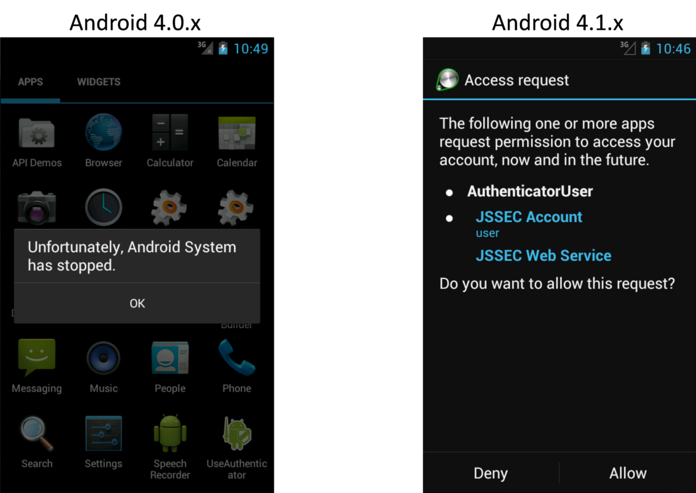{width="6.624409448818898in"
height="3.771259842519685in"}

図 5.4‑2　プライベート認証局のルート証明書のインストール手順

{width="6.448031496062992in"
height="3.665748031496063in"}

図 5.4‑3 ルート証明書がインストールされていることの確認

Android
OSにプライベート認証局のルート証明書をインストールすると、その認証局から発行されたプライベート証明書をすべてのアプリで正しく証明書検証できるようになる。下図はChromeブラウザで[*https://selfsigned.jssec.org/droid\_knight.png*](https://selfsigned.jssec.org/droid_knight.png)を表示した場合の例である。

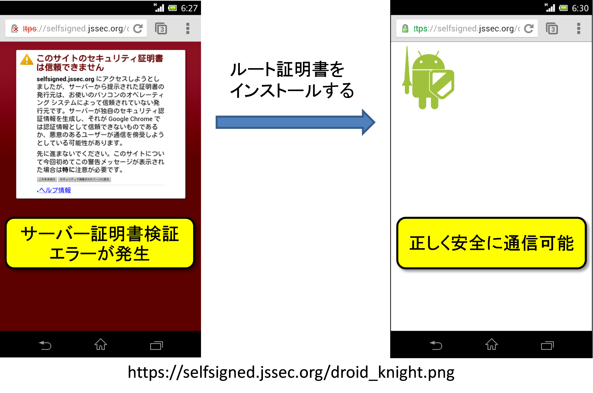{width="6.3082677165354335in"
height="4.186220472440945in"}

図
5.4‑4ルート証明書のインストール後はプライベート証明書を正しく検証できるようになる

この方法を使えば「5.4.1.2
HTTPS通信する」のサンプルコードでもプライベート証明書で運用するWebサーバーにHTTPS[]{#_Ref350225847
.anchor}接続できるようになる。

#### 証明書検証を無効化する危険なコード

インターネット上にはサーバー証明書検証エラーを無視してHTTPS通信をするサンプルコードが多数掲載されている。これらのサンプルコードはプライベート証明書を使ってHTTPS通信を実現する方法として紹介されているため、そうしたサンプルコードをコピー＆ペーストして利用しているアプリが多数存在している。残念ながらこうしたサンプルコードは中間者攻撃に脆弱なものであることが多く、この記事の冒頭で「2012年にはAndroidアプリのHTTPS通信の実装方法における欠陥が多く指摘された。」と述べたように、こうしたインターネット上の脆弱なサンプルコードを利用してしまったと思われる多くの脆弱なAndroidアプリが報告されている。

ここではこうした脆弱なHTTPS通信のサンプルコードの断片を紹介する。こうしたサンプルコードを見かけた場合には「5.4.1.3
プライベート証明書でHTTPS通信する」のサンプルコードに置き換えるなどしていただきたい。

> 危険：空っぽのTrustManagerを作るケース

TrustManager tm = new X509TrustManager() {

@Override

public void checkClientTrusted(X509Certificate\[\] chain,

String authType) throws CertificateException {

// 何もしない → どんな証明書でも受付ける

}

@Override

public void checkServerTrusted(X509Certificate\[\] chain,

String authType) throws CertificateException {

// 何もしない → どんな証明書でも受付ける

}

@Override

public X509Certificate\[\] getAcceptedIssuers() {

return null;

}

};

> 危険：空っぽのHostnameVerifierを作るケース

HostnameVerifier hv = new HostnameVerifier() {

@Override

public boolean verify(String hostname, SSLSession session) {

// 常にtrueを返す → どんなホスト名でも受付ける

return true;

}

};

> 危険：ALLOW\_ALL\_HOSTNAME\_VERIFIERを使っているケース

SSLSocketFactory sf;

…

sf.setHostnameVerifier(SSLSocketFactory.ALLOW\_ALL\_HOSTNAME\_VERIFIER);

#### HTTPリクエストヘッダを設定する際の注意点

HTTPおよびHTTPS通信において、独自のHTTPリクエストヘッダを設定したい場合は、URLConnectionクラスのsetRequestProperty()メソッド、もしくはaddRequestProperty()メソッドを使用する。これらメソッドの引数に外部からの入力データを用いる場合は、HTTPヘッダ・インジェクションの対策が必要となる。HTTPヘッダ・インジェクションによる攻撃の最初のステップとなるのは、HTTPヘッダの区切り文字である改行コードを入力データに含めることであるため、入力データから改行コードを排除するようにしなければならない。

> HTTPリクエストヘッダを設定する

public byte\[\] openConnection(String strUrl, String strLanguage, String
strCookie) {

// HttpURLConnection はURLConnectionの派生クラス

HttpURLConnection connection;

try {

URL url = new URL(strUrl);

connection = (HttpURLConnection) url.openConnection();

connection.setRequestMethod("GET");

// ★ポイント★
HTTPリクエストヘッダに入力値を使用する場合は、アプリケーション要件に従って

// 入力データをチェックする(「3.2 入力データの安全性を確認する」を参照)

if (strLanguage.matches("\^\[a-zA-Z ,-\]+\$")) {

connection.addRequestProperty("Accept-Language", strLanguage);

} else {

throw new IllegalArgumentException("Invalid Language : " + strLanguage);

}

// ★ポイント★
もしくは入力データをURLエンコードする(というアプリケーション要件にする)

connection.setRequestProperty("Cookie", URLEncoder.encode(strCookie,
"UTF-8"));

connection.connect();

～省略～

#### ピンニングによる検証の注意点と実装例

アプリがHTTPS通信を行う際は、通信開始時のハンドシェイク処理において、接続先サーバーから送られてくる証明書が第三者認証局により署名されているかどうかの検証が行われる。しかし、攻撃者が第三者認証局から不正な証明書を入手したり、認証局の署名鍵を入手して不正な証明書を作成したりした場合、その攻撃者により不正なサーバーへの誘導や中間者攻撃が行われても、アプリはそれらの攻撃をハンドシェイク処理で検出することができず、結果として被害につながってしまう可能性がある。

このような不正な第三者認証局の証明書を用いた中間者攻撃に対しては「ピンニングによる検証」が有効である。これは、あらかじめ接続先サーバーの証明書や公開鍵をアプリ内に保持しておき、それらの情報をハンドシェイク処理で用いたり、ハンドシェイク処理後に再検証したりする方法である。

ピンニングによる検証は、公開鍵基盤（PKI）の基礎である第三者認証局の信頼性が損なわれた場合に備え、通信の安全性を補填する目的で用いられる。開発者は自身のアプリが扱う資産レベルに応じて、この検証を行うかどうか検討してほしい。

##### アプリ内に保持した証明書・公開鍵をハンドシェイク処理で使用する

アプリ内に保持しておいた接続先サーバーの証明書や公開鍵の情報をハンドシェイク処理で用いるためには、それらの情報を含めた独自のKeyStoreを作成して通信に用いる。これにより、上記のような不正な第三者認証局の証明書を用いた中間者攻撃が行われても、ハンドシェイク処理において不正を検出することができるようになる。独自のKeyStoreを設定してHTTPS通信を行う具体的な方法は「5.4.1.3
プライベート証明書でHTTPS通信する」で紹介したサンプルコードを参照すること。

##### アプリ内に保持した証明書・公開鍵を用いてハンドシェイク処理後に再検証する

ハンドシェイク処理が行われた後に接続先を再検証するためには、まずハンドシェイク処理で検証されシステムに信頼された証明書チェーンを取得し、その証明書チェーンを、あらかじめアプリ内に保持しておいた情報と照合する。照合の結果、保持しておいた情報と一致するものが含まれていれば通信を許可し、含まれていなければ通信処理を中断させればよい。

ただし、ハンドシェイク処理でシステムに信頼された証明書チェーンを取得する際に以下のメソッドを使用すると、期待通りの証明書チェーンが得られず、結果としてピンニングによる検証が正常に機能しなくなってしまう危険がある[^30]。

-   javax.net.ssl.SSLSession.getPeerCertificates()

-   javax.net.ssl.SSLSession.getPeerCertificateChain()

これらのメソッドが返すのは、ハンドシェイク処理でシステムに信頼された証明書チェーンではなく、アプリが通信相手から受け取った証明書チェーンそのものである。そのため、中間者攻撃により不正な第三者認証局の証明書が証明書チェーンに付け加えられても、上記のメソッドはハンドシェイク処理でシステムが信用した証明書だけでなく、本来アプリが接続しようとしていたサーバーの証明書も一緒に返してしまう。この「本来アプリが接続しようとしていたサーバーの証明書」は、ピンニングによる検証のためアプリ内にあらかじめ保持しておいたものと同等の証明書なので、再検証を行っても不正を検出することができない。このような理由から、ハンドシェイク処理後の再検証を実装する際に上記のメソッドを使用することは避けるべきである。

Android 4.2（API Level
17）以上であれば、上記のメソッドの代わりにnet.http.X509TrustManagerExtensionsのcheckServerTrusted()を使用することで、ハンドシェイク処理でシステムに信頼された証明書チェーンのみを取得することができる。

> X509TrustManagerExtensionsを用いたピンニング検証の例

//
正しい通信先サーバーの証明書に含まれる公開鍵のSHA-256ハッシュ値を保持（ピンニング）

private static final Set&lt;String&gt; PINS = new
HashSet&lt;&gt;(Arrays.asList(

new String\[\] {

"d9b1a68fceaa460ac492fb8452ce13bd8c78c6013f989b76f186b1cbba1315c1",

"cd13bb83c426551c67fabcff38d4496e094d50a20c7c15e886c151deb8531cdc"

}

));

// AsyncTaskのワーカースレッドで通信する

protected Object doInBackground(String... strings) {

～省略～

//
ハンドシェイク時の検証によりシステムに信頼された証明書チェーンを取得する

X509Certificate\[\] chain = (X509Certificate\[\])
connection.getServerCertificates();

X509TrustManagerExtensions trustManagerExt = new
X509TrustManagerExtensions((X509TrustManager)
(trustManagerFactory.getTrustManagers()\[0\]));

List&lt;X509Certificate&gt; trustedChain =
trustManagerExt.checkServerTrusted(chain, "RSA", url.getHost());

// 公開鍵ピンニングを用いて検証する

boolean isValidChain = false;

for (X509Certificate cert : trustedChain) {

PublicKey key = cert.getPublicKey();

MessageDigest md = MessageDigest.getInstance("SHA-256");

String keyHash = bytesToHex(md.digest(key.getEncoded()));

// ピンニングしておいた公開鍵のハッシュ値と比較する

if(PINS.contains(keyHash)) isValidChain = true;

}

if (isValidChain) {

// 処理を継続する

} else {

// 処理を継続しない

}

～省略～

}

private String bytesToHex(byte\[\] bytes) {

StringBuilder sb = new StringBuilder();

for (byte b : bytes) {

String s = String.format("%02x", b);

sb.append(s);

}

return sb.toString();

}

#### Google Play開発者サービスを利用したOpenSSLの脆弱性対策

Google Play開発者サービス（バージョン5.0以降）では、Provider
Installerという仕組みが提供されている。これは、OpenSSLを含む暗号関連技術の実装であるSecurity
Providerの脆弱性対策に利用できる。詳しくは「5.6.3.5 Google
Play開発者サービスによるSecurity Providerの脆弱性対策」を参照のこと。

#### Network Security Configuration

Android 7.0（API Level
24）において、ネットワーク通信時のセキュリティ設定をアプリ毎に行うことができるNetwork
Security
Configurationが導入された。この仕組みを利用することにより、プライベート証明書でのHTTPS通信やピンニングによる証明書検証のほか、非暗号化（HTTP）通信の抑制、デバッグ時のみ有効なプライベート証明書の導入など、アプリのセキュリティを向上させる種々の施策をアプリに簡単に取り入れることができる[^31]。

Network Security
Configurationの各種機能はxmlファイルの設定を行うだけで使用でき、アプリが行うHTTPおよびHTTPS通信全てに適用することができる。その結果、アプリのコードに修正や追加処理を行う必要がなくなるため、実装がシンプルになりバグや脆弱性の作り込み防止に効果があると考えられる。

##### プライベート証明書でHTTPS通信する

「5.4.1.3プライベート証明書でHTTPS通信する」で、私的に発行したサーバー証明書（プライベート証明書）でHTTPS通信をするためのサンプルコードを示した。Network
Security
Configurationを用いれば、開発者がプライベート証明書の検証処理を明示的に実装しなくても、「5.4.1.2
HTTPS通信する」のサンプルコードで示した通常のHTTPS通信と同じ実装でプライベート証明書を用いることができる。

> 特定ドメインへの通信時にプライベート証明書を用いる

&lt;?xml version="1.0" encoding="utf-8"?&gt;

&lt;network-security-config&gt;

&lt;domain-config&gt;

&lt;domain includeSubdomains="true"&gt;jssec.org&lt;/domain&gt;

&lt;trust-anchors&gt;

&lt;certificates src="@raw/private\_ca" /&gt;

&lt;/trust-anchors&gt;

&lt;/domain-config&gt;

&lt;/network-security-config&gt;

上記の例では、通信で使用するプライベート証明書（private\_ca）をアプリ内にリソースとして保持しておき、それらを利用する条件や適用範囲をxmlファイルに記述している。&lt;domain-config&gt;タグを使用することで特定のドメインに対してのみプライベート証明書が適用される。アプリが行う全てのHTTPS通信に対してプライベート証明書を用いるためには、以下のように&lt;base-config&gt;タグを用いればよい。

> アプリが行う全てのHTTPS通信時にプライベート証明書を用いる

&lt;?xml version="1.0" encoding="utf-8"?&gt;

&lt;network-security-config&gt;

&lt;base-config&gt;

&lt;trust-anchors&gt;

&lt;certificates src="@raw/private\_ca" /&gt;

&lt;/trust-anchors&gt;

&lt;/base-config&gt;

&lt;/network-security-config&gt;

##### ピンニングによる検証

「5.4.3.5
ピンニングによる検証の注意点と実装例」でピンニングによる証明書の検証について説明した。Network
Security
Configurationを用い以下のように設定すれば、コード上の検証処理が不要となり、xmlの記述だけで検証を行うことができる。

> HTTPS通信時にピンニングによる検証を行う

&lt;?xml version="1.0" encoding="utf-8"?&gt;

&lt;network-security-config&gt;

&lt;domain-config&gt;

&lt;domain includeSubdomains="true"&gt;jssec.org&lt;/domain&gt;

&lt;pin-set expiration="2018-12-31"&gt;

&lt;pin
digest="SHA-256"&gt;e30Lky+iWK21yHSls5DJoRzNikOdvQUOGXvurPidc2E=&lt;/pin&gt;

&lt;!-- バックアップ用 --&gt;

&lt;pin
digest="SHA-256"&gt;fwza0LRMXouZHRC8Ei+4PyuldPDcf3UKgO/04cDM1oE=&lt;/pin&gt;

&lt;/pin-set&gt;

&lt;/domain-config&gt;

&lt;/network-security-config&gt;

上記の&lt;pin&gt;タグに記述するのは、ピンニング検証の対象となる公開鍵のハッシュ値をbase64でエンコードしたものである。また、ハッシュ関数はSHA-256のみサポートされている。

##### 非暗号化（HTTP）通信の抑制

Network Security
Configurationを用いて、アプリのHTTP通信（非暗号化通信）を抑制することができる。

> 非暗号化通信を抑制する

&lt;?xml version="1.0" encoding="utf-8"?&gt;

&lt;network-security-config&gt;

&lt;domain-config cleartextTrafficPermitted="false"&gt;

&lt;domain includeSubdomains="true"&gt;jssec.org&lt;/domain&gt;

&lt;/domain-config&gt;

&lt;/network-security-config&gt;

上記のように、&lt;domain-config&gt;タグに
cleartextTrafficPermitted="false"
を属性値として設定することにより、特定ドメインとのHTTP通信が抑制され、HTTPS通信を用いることが強制される。同様の属性値を&lt;base-config&gt;タグに設定すると、全てのドメインに対するHTTP通信が抑制される[^32]。ただし、この設定はWebViewには適用されないことに注意する必要がある

##### デバッグ専用のプライベート証明書

アプリ開発時にデバッグ目的でプライベート証明書を用いた開発用サーバーとのHTTPS通信を行う場合、開発者は「5.4.3.3
証明書検証を無効化する危険なコード」で述べたような、証明書検証を無効化させる危険な実装をアプリに組み込んでしまわないよう注意する必要がある。Network
Security
Configurationで以下のような設定を行えば、デバッグ時にのみ（AndroidManifest.xml内のandroid:debuggableが"true"である場合のみ）使用する証明書を指定することができるため、前述のような危険なコードを製品版に残してしまう危険性がなくなり、脆弱性の作り込み防止に役立てることができる。

> デバッグ時にのみプライベート証明書を用いる

&lt;?xml version="1.0" encoding="utf-8"?&gt;

&lt;network-security-config&gt;

&lt;debug-overrides&gt;

&lt;trust-anchors&gt;

&lt;certificates src="@raw/private\_cas" /&gt;

&lt;/trust-anchors&gt;

&lt;/debug-overrides&gt;

&lt;/network-security-config&gt;

プライバシー情報を扱う
----------------------

近年、プライバシー情報を守るための世界的な潮流として「プライバシー・バイ・デザイン」が提唱されており、この概念に基づき各国政府においてもプライバシー保護のための法制化を進めているところである。

スマ-トフォン内の利用者情報を活用するアプリは、利用者が個人情報やプライバシーの観点から安全・安心にアプリを活用できるように、利用者情報を適切に取り扱うとともに、利用者に対して分かりやすい説明を行い、利用者に利用の可否の選択を促すことが求められる。そのためには、アプリがどのような情報をどのように扱うか等を示したアプリ毎のアプリケーション・プライバシーポリシー（以下、アプリ・プライバシーポリシー）を作成・提示するとともに、慎重な取り扱いが求められる利用者情報の取得・利用については事前にユーザーの同意を得る必要がある。なお、アプリケーション・プライバシーポリシーは従来から存在する「個人情報保護方針」や「利用規約」等とは異なり別途作成を要するものであることに留意すること。

プライバシーポリシーの作成や運用に関して、詳しくは総務省が提唱する『スマートフォン
プライバシー イニシアティブ』及び『スマートフォン プライバシー
イニシアティブⅡ』（以下 総務省SPIと省略）を参照のこと。

また、本記事で扱う用語については、本文内の解説および「5.5.3.2用語解説」を参照すること。

### サンプルコード

アプリ・プライバシーポリシーの作成には、一般に公開されている「アプリケーション・プライバシーポリシー作成支援ツール[^33]」を利用することもできる。このツールの出力はHTML形式およびXML形式となっており、概要版アプリケーション・プライバシーポリシーと詳細版アプリケーション・プライバシーポリシーのそれぞれのファイルが作成される。作成されたXMLファイルには検査用のタグがつくなど、総務省SPIに準拠した形となっている。以下のサンプルコードでは、上記ツールを使って作成したHTMLファイルを利用してアプリ・プライバシーポリシーを提示する例を示す。

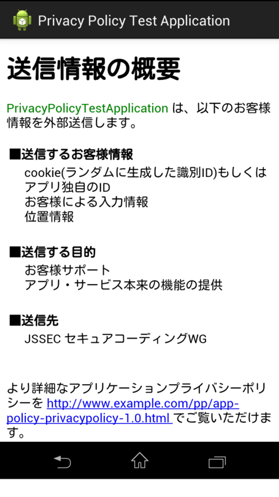{width="2.46875in" height="4.395833333333333in"}

図 5.5‑1概要版アプリケーション・プライバシーポリシーの例

具体的には、次の判定フローに従うことで利用するサンプルコードを判断できる。

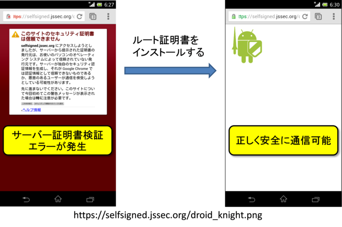{width="7.26875in" height="3.0257053805774277in"}

図 5.5‑2　 プライバシー情報を扱うサンプルコードを選択するフローチャート

ここで、包括同意とは、アプリ初回起動時のアプリ・プライバシーポリシーの提示・確認により、アプリがサーバーに送信する利用者情報について包括的に同意を得ることである。

また、個別同意とは、個々の利用者情報について送信の直前に個別の同意を得ることである。

#### \[包括同意・個別同意あり\] アプリ・プライバシーポリシーを組み込んだアプリ

> ポイント：(\[包括同意・個別同意あり\]
> アプリ・プライバシーポリシーを組み込んだアプリ)

1.  初回起動時(アップデート時)に、アプリが扱う利用者情報の送信について包括同意を得る

&nbsp;
1.  ユーザーの包括同意が得られていない場合は、利用者情報の送信はしない

2.  慎重な取り扱いが求められる利用者情報を送信する場合は、個別にユーザーの同意を得る

3.  ユーザーの個別同意が得られていない場合は、該当情報の送信はしない

4.  ユーザーがアプリ・プライバシーポリシーを確認できる手段を用意する

5.  送信した情報をユーザー操作により削除する手段を用意する

6.  ユーザー操作により利用者情報の送信を停止する手段を用意する

7.  利用者情報の紐づけにはUUID/cookieを利用する

8.  アプリ・プライバシーポリシー概要版をassetsフォルダ内に配置しておく

> MainActivity.java

package org.jssec.android.privacypolicy;

import java.io.IOException;

import org.json.JSONException;

import org.json.JSONObject;

import org.jssec.android.privacypolicy.ConfirmFragment.DialogListener;

import com.google.android.gms.common.ConnectionResult;

import com.google.android.gms.common.GooglePlayServicesClient;

import com.google.android.gms.common.GooglePlayServicesUtil;

import com.google.android.gms.location.LocationClient;

import android.location.Location;

import android.os.AsyncTask;

import android.os.Bundle;

import android.content.Intent;

import android.content.IntentSender;

import android.content.SharedPreferences;

import android.content.pm.PackageInfo;

import android.content.pm.PackageManager;

import android.content.pm.PackageManager.NameNotFoundException;

import android.support.v4.app.FragmentActivity;

import android.support.v4.app.FragmentManager;

import android.text.Editable;

import android.text.TextWatcher;

import android.view.Menu;

import android.view.MenuItem;

import android.view.View;

import android.widget.TextView;

import android.widget.Toast;

public class MainActivity extends FragmentActivity implements
GooglePlayServicesClient.ConnectionCallbacks,
GooglePlayServicesClient.OnConnectionFailedListener, DialogListener {

private static final String BASE\_URL = "https://www.example.com/pp";

private static final String GET\_ID\_URI = BASE\_URL + "/get\_id.php";

private static final String SEND\_DATA\_URI = BASE\_URL +
"/send\_data.php";

private static final String DEL\_ID\_URI = BASE\_URL + "/del\_id.php";

private static final String ID\_KEY = "id";

private static final String LOCATION\_KEY = "location";

private static final String NICK\_NAME\_KEY = "nickname";

private static final String PRIVACY\_POLICY\_COMPREHENSIVE\_AGREED\_KEY
= "privacyPolicyComprehensiveAgreed";

private static final String
PRIVACY\_POLICY\_DISCRETE\_TYPE1\_AGREED\_KEY =
"privacyPolicyDiscreteType1Agreed";

private static final String PRIVACY\_POLICY\_PREF\_NAME =
"privacypolicy\_preference";

private static final int CONNECTION\_FAILURE\_RESOLUTION\_REQUEST = 257;

private String UserId = "";

private LocationClient mLocationClient = null;

private final int DIALOG\_TYPE\_COMPREHENSIVE\_AGREEMENT = 1;

private final int DIALOG\_TYPE\_PRE\_CONFIRMATION = 2;

private static final int
VERSION\_TO\_SHOW\_COMPREHENSIVE\_AGREEMENT\_ANEW = 1;

private TextWatcher watchHandler = new TextWatcher() {

@Override

public void beforeTextChanged(CharSequence s, int start, int count, int
after) {

}

@Override

public void onTextChanged(CharSequence s, int start, int before, int
count) {

boolean buttonEnable = (s.length() &gt; 0);

MainActivity.this.findViewById(R.id.buttonStart).setEnabled(buttonEnable);

}

@Override

public void afterTextChanged(Editable s) {

}

};

@Override

protected void onCreate(Bundle savedInstanceState) {

super.onCreate(savedInstanceState);

setContentView(R.layout.activity\_main);

// ユーザー識別用IDをサーバーから取得する

new GetDataAsyncTask().execute();

findViewById(R.id.buttonStart).setEnabled(false);

((TextView)
findViewById(R.id.editTextNickname)).addTextChangedListener(watchHandler);

int resultCode =
GooglePlayServicesUtil.isGooglePlayServicesAvailable(this);

if (resultCode == ConnectionResult.SUCCESS) {

mLocationClient = new LocationClient(this, this, this);

}

}

@Override

protected void onStart() {

super.onStart();

SharedPreferences pref =
getSharedPreferences(PRIVACY\_POLICY\_PREF\_NAME, MODE\_PRIVATE);

int privacyPolicyAgreed =
pref.getInt(PRIVACY\_POLICY\_COMPREHENSIVE\_AGREED\_KEY, -1);

if (privacyPolicyAgreed &lt;=
VERSION\_TO\_SHOW\_COMPREHENSIVE\_AGREEMENT\_ANEW) {

// ★ポイント1★
初回起動時(アップデート時)に、アプリが扱う利用者情報の送信について包括同意を得る

//
アップデート時については、新しい利用者情報を扱うようになった場合にのみ、再度包括同意を得る必要がある。

ConfirmFragment dialog =
ConfirmFragment.newInstance(R.string.privacyPolicy,
R.string.agreePrivacyPolicy, DIALOG\_TYPE\_COMPREHENSIVE\_AGREEMENT);

dialog.setDialogListener(this);

FragmentManager fragmentManager = getSupportFragmentManager();

dialog.show(fragmentManager, "dialog");

}

// Location情報取得用

if (mLocationClient != null) {

mLocationClient.connect();

}

}

@Override

protected void onStop() {

if (mLocationClient != null) {

mLocationClient.disconnect();

}

super.onStop();

}

public void onSendToServer(View view) {

//
慎重な取り扱いが求められる利用者情報を送信について既に同意を得ているか確認する

// 実際には送信する情報の種別毎に同意を得る必要があることに注意すること

SharedPreferences pref =
getSharedPreferences(PRIVACY\_POLICY\_PREF\_NAME, MODE\_PRIVATE);

int privacyPolicyAgreed =
pref.getInt(PRIVACY\_POLICY\_DISCRETE\_TYPE1\_AGREED\_KEY, -1);

if (privacyPolicyAgreed &lt;=
VERSION\_TO\_SHOW\_COMPREHENSIVE\_AGREEMENT\_ANEW) {

// ★ポイント3★
慎重な取り扱いが求められる利用者情報を送信する場合は、個別にユーザーの同意を得る

ConfirmFragment dialog =
ConfirmFragment.newInstance(R.string.sendLocation,
R.string.cofirmSendLocation, DIALOG\_TYPE\_PRE\_CONFIRMATION);

dialog.setDialogListener(this);

FragmentManager fragmentManager = getSupportFragmentManager();

dialog.show(fragmentManager, "dialog");

} else {

// 同意済みのため、送信処理を開始する

onPositiveButtonClick(DIALOG\_TYPE\_PRE\_CONFIRMATION);

}

}

public void onPositiveButtonClick(int type) {

if (type == DIALOG\_TYPE\_COMPREHENSIVE\_AGREEMENT) {

// ★ポイント1★
初回起動時(アップデート時)に、アプリが扱う利用者情報の送信について包括同意を得る

SharedPreferences.Editor pref =
getSharedPreferences(PRIVACY\_POLICY\_PREF\_NAME, MODE\_PRIVATE).edit();

pref.putInt(PRIVACY\_POLICY\_COMPREHENSIVE\_AGREED\_KEY,
getVersionCode());

pref.apply();

} else if (type == DIALOG\_TYPE\_PRE\_CONFIRMATION) {

// ★ポイント3★
慎重な取り扱いが求められる利用者情報を送信する場合は、個別にユーザーの同意を得る

if (mLocationClient != null && mLocationClient.isConnected()) {

Location currentLocation = mLocationClient.getLastLocation();

if (currentLocation != null) {

String locationData = "Latitude:" + currentLocation.getLatitude() + ",
Longitude:" + currentLocation.getLongitude();

String nickname = ((TextView)
findViewById(R.id.editTextNickname)).getText().toString();

Toast.makeText(MainActivity.this, this.getClass().getSimpleName() + "\\n
- nickname : " + nickname + "\\n - location : " + locationData,
Toast.LENGTH\_SHORT).show();

new SendDataAsyncTack().execute(SEND\_DATA\_URI, UserId, locationData,
nickname);

}

}

// 同意を得た旨、状態を保存する

// 実際には送信する情報の種別毎に同意を得る必要があることに注意すること

SharedPreferences.Editor pref =
getSharedPreferences(PRIVACY\_POLICY\_PREF\_NAME, MODE\_PRIVATE).edit();

pref.putInt(PRIVACY\_POLICY\_DISCRETE\_TYPE1\_AGREED\_KEY,
getVersionCode());

pref.apply();

}

}

public void onNegativeButtonClick(int type) {

if (type == DIALOG\_TYPE\_COMPREHENSIVE\_AGREEMENT) {

// ★ポイント2★
ユーザーの包括同意が得られていない場合は、利用者情報の送信はしない

// サンプルアプリではアプリケーションを終了する

finish();

} else if (type == DIALOG\_TYPE\_PRE\_CONFIRMATION) {

// ★ポイント4★
ユーザーの個別同意が得られていない場合は、該当情報の送信はしない

// ユーザー同意が得られなかったので何もしない

}

}

private int getVersionCode() {

int versionCode = -1;

PackageManager packageManager = this.getPackageManager();

try {

PackageInfo packageInfo =
packageManager.getPackageInfo(this.getPackageName(),
PackageManager.GET\_ACTIVITIES);

versionCode = packageInfo.versionCode;

} catch (NameNotFoundException e) {

// 例外処理は割愛

}

return versionCode;

}

@Override

public boolean onCreateOptionsMenu(Menu menu) {

getMenuInflater().inflate(R.menu.main, menu);

return true;

}

@Override

public boolean onOptionsItemSelected(MenuItem item) {

switch (item.getItemId()) {

case R.id.action\_show\_pp:

// ★ポイント5★
ユーザーがアプリ・プライバシーポリシーを確認できる手段を用意する

Intent intent = new Intent();

intent.setClass(this, WebViewAssetsActivity.class);

startActivity(intent);

return true;

case R.id.action\_del\_id:

// ★ポイント6★ 送信した情報をユーザー操作により削除する手段を用意する

new SendDataAsyncTack().execute(DEL\_ID\_URI, UserId);

return true;

case R.id.action\_donot\_send\_id:

// ★ポイント7★
ユーザー操作により利用者情報の送信を停止する手段を用意する

//
利用者情報の送信を停止した場合、包括同意に関する同意は破棄されたものとする

SharedPreferences.Editor pref =
getSharedPreferences(PRIVACY\_POLICY\_PREF\_NAME, MODE\_PRIVATE).edit();

pref.putInt(PRIVACY\_POLICY\_COMPREHENSIVE\_AGREED\_KEY, 0);

pref.apply();

//
本サンプルでは利用者情報を送信しない場合、ユーザーに提供する機能が無くなるため

//
この段階でアプリを終了する。この処理はアプリ毎の都合に合わせて変更すること。

String message = getString(R.string.stopSendUserData);

Toast.makeText(MainActivity.this, this.getClass().getSimpleName() + " -
" + message, Toast.LENGTH\_SHORT).show();

finish();

return true;

}

return false;

}

@Override

public void onConnected(Bundle connectionHint) {

if (mLocationClient != null && mLocationClient.isConnected()) {

Location currentLocation = mLocationClient.getLastLocation();

if (currentLocation != null) {

String locationData = "Latitude \\t: " + currentLocation.getLatitude() +
"\\n\\tLongitude \\t: " + currentLocation.getLongitude();

String text = "\\n" + getString(R.string.your\_location\_title) +
"\\n\\t" + locationData;

TextView appText = (TextView) findViewById(R.id.appText);

appText.setText(text);

}

}

}

@Override

public void onConnectionFailed(ConnectionResult result) {

if (result.hasResolution()) {

try {

result.startResolutionForResult(this,
CONNECTION\_FAILURE\_RESOLUTION\_REQUEST);

} catch (IntentSender.SendIntentException e) {

e.printStackTrace();

}

}

}

@Override

public void onDisconnected() {

mLocationClient = null;

}

private class GetDataAsyncTask extends AsyncTask&lt;String, Void,
String&gt; {

private String extMessage = "";

@Override

protected String doInBackground(String... params) {

// ★ポイント8★ 利用者情報の紐づけにはUUID/cookieを利用する

// 本サンプルではサーバー側で生成したIDを利用する

SharedPreferences sp = getSharedPreferences(PRIVACY\_POLICY\_PREF\_NAME,
MODE\_PRIVATE);

UserId = sp.getString(ID\_KEY, null);

if (UserId == null) {

//
SharedPreferences内にトークンが存在しなため、サーバーからIDを取り寄せる。

try {

UserId = NetworkUtil.getCookie(GET\_ID\_URI, "", "id");

} catch (IOException e) {

// 証明書エラーなどの例外をキャッチする

extMessage = e.toString();

}

// 取り寄せたIDをSharedPreferencesに保存する。

sp.edit().putString(ID\_KEY, UserId).commit();

}

return UserId;

}

@Override

protected void onPostExecute(final String data) {

String status = (data != null) ? "success" : "error";

Toast.makeText(MainActivity.this, this.getClass().getSimpleName() + " -
" + status + " : " + extMessage, Toast.LENGTH\_SHORT).show();

}

}

private class SendDataAsyncTack extends AsyncTask&lt;String, Void,
Boolean&gt; {

private String extMessage = "";

@Override

protected Boolean doInBackground(String... params) {

String url = params\[0\];

String id = params\[1\];

String location = params.length &gt; 2 ? params\[2\] : null;

String nickname = params.length &gt; 3 ? params\[3\] : null;

Boolean result = false;

try {

JSONObject jsonData = new JSONObject();

jsonData.put(ID\_KEY, id);

if (location != null)

jsonData.put(LOCATION\_KEY, location);

if (nickname != null)

jsonData.put(NICK\_NAME\_KEY, nickname);

NetworkUtil.sendJSON(url, "", jsonData.toString());

result = true;

} catch (IOException e) {

// 証明書エラーなどの例外をキャッチする

extMessage = e.toString();

} catch (JSONException e) {

extMessage = e.toString();

}

return result;

}

@Override

protected void onPostExecute(Boolean result) {

String status = result ? "Success" : "Error";

Toast.makeText(MainActivity.this, this.getClass().getSimpleName() + " -
" + status + " : " + extMessage, Toast.LENGTH\_SHORT).show();

}

}

}

> ConfirmFragment.java

package org.jssec.android.privacypolicy;

import android.app.Activity;

import android.app.AlertDialog;

import android.app.Dialog;

import android.content.Context;

import android.content.DialogInterface;

import android.content.Intent;

import android.os.Bundle;

import android.support.v4.app.DialogFragment;

import android.view.LayoutInflater;

import android.view.View;

import android.view.View.OnClickListener;

import android.widget.TextView;

public class ConfirmFragment extends DialogFragment {

private DialogListener mListener = null;

public static interface DialogListener {

public void onPositiveButtonClick(int type);

public void onNegativeButtonClick(int type);

}

public static ConfirmFragment newInstance(int title, int sentence, int
type) {

ConfirmFragment fragment = new ConfirmFragment();

Bundle args = new Bundle();

args.putInt("title", title);

args.putInt("sentence", sentence);

args.putInt("type", type);

fragment.setArguments(args);

return fragment;

}

@Override

public Dialog onCreateDialog(Bundle args) {

// ★ポイント1★
初回起動時に、アプリが扱う利用者情報の送信について包括同意を得る

// ★ポイント3★
慎重な取り扱いが求められる利用者情報を送信する場合は、個別にユーザーの同意を得る

final int title = getArguments().getInt("title");

final int sentence = getArguments().getInt("sentence");

final int type = getArguments().getInt("type");

LayoutInflater inflater = (LayoutInflater)
getActivity().getSystemService(Context.LAYOUT\_INFLATER\_SERVICE);

View content = inflater.inflate(R.layout.fragment\_comfirm, null);

TextView linkPP = (TextView) content.findViewById(R.id.tx\_link\_pp);

linkPP.setOnClickListener(new OnClickListener() {

@Override

public void onClick(View v) {

// ★ポイント5★
ユーザーがアプリ・プライバシーポリシーを確認できる手段を用意する

Intent intent = new Intent();

intent.setClass(getActivity(), WebViewAssetsActivity.class);

startActivity(intent);

}

});

AlertDialog.Builder builder = new AlertDialog.Builder(getActivity());

builder.setIcon(R.drawable.ic\_launcher);

builder.setTitle(title);

builder.setMessage(sentence);

builder.setView(content);

builder.setPositiveButton(R.string.buttonOK, new
DialogInterface.OnClickListener() {

public void onClick(DialogInterface dialog, int whichButton) {

if (mListener != null) {

mListener.onPositiveButtonClick(type);

}

}

});

builder.setNegativeButton(R.string.buttonNG, new
DialogInterface.OnClickListener() {

public void onClick(DialogInterface dialog, int whichButton) {

if (mListener != null) {

mListener.onNegativeButtonClick(type);

}

}

});

Dialog dialog = builder.create();

dialog.setCanceledOnTouchOutside(false);

return dialog;

}

@Override

public void onAttach(Activity activity) {

super.onAttach(activity);

if (!(activity instanceof DialogListener)) {

throw new ClassCastException(activity.toString() + " must implement
DialogListener.");

}

mListener = (DialogListener) activity;

}

public void setDialogListener(DialogListener listener) {

mListener = listener;

}

}

> WebViewAssetsActivity.java

package org.jssec.android.privacypolicy;

import android.app.Activity;

import android.os.Bundle;

import android.webkit.WebSettings;

import android.webkit.WebView;

public class WebViewAssetsActivity extends Activity {

// ★ポイント9★
アプリ・プライバシーポリシー概要版をassetsフォルダ内に配置しておく

private static final String ABST\_PP\_URL =
"file:///android\_asset/PrivacyPolicy/app-policy-abst-privacypolicy-1.0.html";

@Override

public void onCreate(Bundle savedInstanceState) {

super.onCreate(savedInstanceState);

setContentView(R.layout.activity\_webview);

WebView webView = (WebView) findViewById(R.id.webView);

WebSettings webSettings = webView.getSettings();

webSettings.setAllowFileAccess(false);

webView.loadUrl(ABST\_PP\_URL);

}

}

#### \[包括同意あり\] アプリ・プライバシーポリシーを組み込んだアプリ

> ポイント：\[包括同意あり\]
> アプリ・プライバシーポリシーを組み込んだアプリ

1.  初回起動時(アップデート時)に、アプリが扱う利用者情報の送信について包括同意を得る

&nbsp;
1.  ユーザーの包括同意が得られていない場合は、利用者情報の送信はしない

2.  ユーザーがアプリ・プライバシーポリシーを確認できる手段を用意する

3.  送信した情報をユーザー操作により削除する手段を用意する

4.  ユーザー操作により利用者情報の送信を停止する手段を用意する

5.  利用者情報の紐づけにはUUID/cookieを利用する

6.  アプリ・プライバシーポリシー概要版をassetsフォルダ内に配置しておく

> MainActivity.java

package org.jssec.android.privacypolicynopreconfirm;

import java.io.IOException;

import org.json.JSONException;

import org.json.JSONObject;

import org.jssec.android.privacypolicynopreconfirm.MainActivity;

import org.jssec.android.privacypolicynopreconfirm.R;

import
org.jssec.android.privacypolicynopreconfirm.ConfirmFragment.DialogListener;

import android.os.AsyncTask;

import android.os.Bundle;

import android.content.Intent;

import android.content.SharedPreferences;

import android.content.pm.PackageInfo;

import android.content.pm.PackageManager;

import android.content.pm.PackageManager.NameNotFoundException;

import android.support.v4.app.FragmentActivity;

import android.support.v4.app.FragmentManager;

import android.telephony.TelephonyManager;

import android.text.Editable;

import android.text.TextWatcher;

import android.view.Menu;

import android.view.MenuItem;

import android.view.View;

import android.widget.TextView;

import android.widget.Toast;

public class MainActivity extends FragmentActivity implements
DialogListener {

private final String BASE\_URL = "https://www.example.com/pp";

private final String GET\_ID\_URI = BASE\_URL + "/get\_id.php";

private final String SEND\_DATA\_URI = BASE\_URL + "/send\_data.php";

private final String DEL\_ID\_URI = BASE\_URL + "/del\_id.php";

private final String ID\_KEY = "id";

private final String NICK\_NAME\_KEY = "nickname";

private final String IMEI\_KEY = "imei";

private final String PRIVACY\_POLICY\_AGREED\_KEY =
"privacyPolicyAgreed";

private final String PRIVACY\_POLICY\_PREF\_NAME =
"privacypolicy\_preference";

private String UserId = "";

private final int DIALOG\_TYPE\_COMPREHENSIVE\_AGREEMENT = 1;

private final int VERSION\_TO\_SHOW\_COMPREHENSIVE\_AGREEMENT\_ANEW = 1;

private TextWatcher watchHandler = new TextWatcher() {

@Override

public void beforeTextChanged(CharSequence s, int start, int count, int
after) {

}

@Override

public void onTextChanged(CharSequence s, int start, int before, int
count) {

boolean buttonEnable = (s.length() &gt; 0);

MainActivity.this.findViewById(R.id.buttonStart).setEnabled(buttonEnable);

}

@Override

public void afterTextChanged(Editable s) {

}

};

@Override

protected void onCreate(Bundle savedInstanceState) {

super.onCreate(savedInstanceState);

setContentView(R.layout.activity\_main);

// ユーザー識別用IDをサーバーから取得する

new GetDataAsyncTask().execute();

findViewById(R.id.buttonStart).setEnabled(false);

((TextView)
findViewById(R.id.editTextNickname)).addTextChangedListener(watchHandler);

}

@Override

protected void onStart() {

super.onStart();

SharedPreferences pref =
getSharedPreferences(PRIVACY\_POLICY\_PREF\_NAME, MODE\_PRIVATE);

int privacyPolicyAgreed = pref.getInt(PRIVACY\_POLICY\_AGREED\_KEY, -1);

if (privacyPolicyAgreed &lt;=
VERSION\_TO\_SHOW\_COMPREHENSIVE\_AGREEMENT\_ANEW) {

// ★ポイント1★
初回起動時(アップデート時)に、アプリが扱う利用者情報の送信について包括同意を得る

//
アップデート時については、新しい利用者情報を扱うようになった場合にのみ、再度包括同意を得る必要がある。

ConfirmFragment dialog =
ConfirmFragment.newInstance(R.string.privacyPolicy,
R.string.agreePrivacyPolicy, DIALOG\_TYPE\_COMPREHENSIVE\_AGREEMENT);

dialog.setDialogListener(this);

FragmentManager fragmentManager = getSupportFragmentManager();

dialog.show(fragmentManager, "dialog");

}

}

public void onSendToServer(View view) {

String nickname = ((TextView)
findViewById(R.id.editTextNickname)).getText().toString();

TelephonyManager tm = (TelephonyManager)
getSystemService(TELEPHONY\_SERVICE);

String imei = tm.getDeviceId();

Toast.makeText(MainActivity.this, this.getClass().getSimpleName() + "\\n
- nickname : " + nickname + ", imei = " + imei,
Toast.LENGTH\_SHORT).show();

new SendDataAsyncTack().execute(SEND\_DATA\_URI, UserId, nickname,
imei);

}

public void onPositiveButtonClick(int type) {

if (type == DIALOG\_TYPE\_COMPREHENSIVE\_AGREEMENT) {

// ★ポイント1★
初回起動時に、アプリが扱う利用者情報の送信について包括同意を得る

SharedPreferences.Editor pref =
getSharedPreferences(PRIVACY\_POLICY\_PREF\_NAME, MODE\_PRIVATE).edit();

pref.putInt(PRIVACY\_POLICY\_AGREED\_KEY, getVersionCode());

pref.apply();

}

}

public void onNegativeButtonClick(int type) {

if (type == DIALOG\_TYPE\_COMPREHENSIVE\_AGREEMENT) {

// ★ポイント2★
ユーザーの包括同意が得られていない場合は、利用者情報の送信はしない

// サンプルアプリではアプリケーションを終了する

finish();

}

}

private int getVersionCode() {

int versionCode = -1;

PackageManager packageManager = this.getPackageManager();

try {

PackageInfo packageInfo =
packageManager.getPackageInfo(this.getPackageName(),
PackageManager.GET\_ACTIVITIES);

versionCode = packageInfo.versionCode;

} catch (NameNotFoundException e) {

// 例外処理は割愛

}

return versionCode;

}

@Override

public boolean onCreateOptionsMenu(Menu menu) {

getMenuInflater().inflate(R.menu.main, menu);

return true;

}

@Override

public boolean onOptionsItemSelected(MenuItem item) {

switch (item.getItemId()) {

case R.id.action\_show\_pp:

// ★ポイント3★
ユーザーがアプリ・プライバシーポリシーを確認できる手段を用意する

Intent intent = new Intent();

intent.setClass(this, WebViewAssetsActivity.class);

startActivity(intent);

return true;

case R.id.action\_del\_id:

// ★ポイント4★ 送信した情報をユーザー操作により削除する手段を用意する

new SendDataAsyncTack().execute(DEL\_ID\_URI, UserId);

return true;

case R.id.action\_donot\_send\_id:

// ★ポイント5★
ユーザー操作により利用者情報の送信を停止する手段を用意する

//
利用者情報の送信を停止した場合、包括同意に関する同意は破棄されたものとする

SharedPreferences.Editor pref =
getSharedPreferences(PRIVACY\_POLICY\_PREF\_NAME, MODE\_PRIVATE).edit();

pref.putInt(PRIVACY\_POLICY\_AGREED\_KEY, 0);

pref.apply();

//
本サンプルでは利用者情報を送信しない場合、ユーザーに提供する機能が無くなるため

//
この段階でアプリを終了する。この処理はアプリ毎の都合に合わせて変更すること。

String message = getString(R.string.stopSendUserData);

Toast.makeText(MainActivity.this, this.getClass().getSimpleName() + " -
" + message, Toast.LENGTH\_SHORT).show();

finish();

return true; }

return false;

}

private class GetDataAsyncTask extends AsyncTask&lt;String, Void,
String&gt; {

private String extMessage = "";

@Override

protected String doInBackground(String... params) {

// ★ポイント6★ 利用者情報の紐づけにはUUID/cookieを利用する

// 本サンプルではサーバー側で生成したIDを利用する

SharedPreferences sp = getSharedPreferences(PRIVACY\_POLICY\_PREF\_NAME,
MODE\_PRIVATE);

UserId = sp.getString(ID\_KEY, null);

if (UserId == null) {

//
SharedPreferences内にトークンが存在しなため、サーバーからIDを取り寄せる。

try {

UserId = NetworkUtil.getCookie(GET\_ID\_URI, "", "id");

} catch (IOException e) {

// 証明書エラーなどの例外をキャッチする

extMessage = e.toString();

}

// 取り寄せたIDをSharedPreferencesに保存する。

sp.edit().putString(ID\_KEY, UserId).commit();

}

return UserId;

}

@Override

protected void onPostExecute(final String data) {

String status = (data != null) ? "success" : "error";

Toast.makeText(MainActivity.this, this.getClass().getSimpleName() + " -
" + status + " : " + extMessage, Toast.LENGTH\_SHORT).show();

}

}

private class SendDataAsyncTack extends AsyncTask&lt;String, Void,
Boolean&gt; {

private String extMessage = "";

@Override

protected Boolean doInBackground(String... params) {

String url = params\[0\];

String id = params\[1\];

String nickname = params.length &gt; 2 ? params\[2\] : null;

String imei = params.length &gt; 3 ? params\[3\] : null;

Boolean result = false;

try {

JSONObject jsonData = new JSONObject();

jsonData.put(ID\_KEY, id);

if (nickname != null)

jsonData.put(NICK\_NAME\_KEY, nickname);

if (imei != null)

jsonData.put(IMEI\_KEY, imei);

NetworkUtil.sendJSON(url, "", jsonData.toString());

result = true;

} catch (IOException e) {

// 証明書エラーなどの例外をキャッチする

extMessage = e.toString();

} catch (JSONException e) {

extMessage = e.toString();

}

return result;

}

@Override

protected void onPostExecute(Boolean result) {

String status = result ? "Success" : "Error";

Toast.makeText(MainActivity.this, this.getClass().getSimpleName() + " -
" + status + " : " + extMessage, Toast.LENGTH\_SHORT).show();

}

}

}

> ConfirmFragment.java

package org.jssec.android.privacypolicynopreconfirm;

import android.app.Activity;

import android.app.AlertDialog;

import android.app.Dialog;

import android.content.Context;

import android.content.DialogInterface;

import android.content.Intent;

import android.os.Bundle;

import android.support.v4.app.DialogFragment;

import android.view.LayoutInflater;

import android.view.View;

import android.view.View.OnClickListener;

import android.widget.TextView;

public class ConfirmFragment extends DialogFragment {

private DialogListener mListener = null;

public static interface DialogListener {

public void onPositiveButtonClick(int type);

public void onNegativeButtonClick(int type);

}

public static ConfirmFragment newInstance(int title, int sentence, int
type) {

ConfirmFragment fragment = new ConfirmFragment();

Bundle args = new Bundle();

args.putInt("title", title);

args.putInt("sentence", sentence);

args.putInt("type", type);

fragment.setArguments(args);

return fragment;

}

@Override

public Dialog onCreateDialog(Bundle args) {

// ★ポイント1★
初回起動時に、アプリが扱う利用者情報の送信について包括同意を得る

final int title = getArguments().getInt("title");

final int sentence = getArguments().getInt("sentence");

final int type = getArguments().getInt("type");

LayoutInflater inflater = (LayoutInflater)
getActivity().getSystemService(Context.LAYOUT\_INFLATER\_SERVICE);

View content = inflater.inflate(R.layout.fragment\_comfirm, null);

TextView linkPP = (TextView) content.findViewById(R.id.tx\_link\_pp);

linkPP.setOnClickListener(new OnClickListener() {

@Override

public void onClick(View v) {

// ★ポイント3★
ユーザーがアプリ・プライバシーポリシーを確認できる手段を用意する

Intent intent = new Intent();

intent.setClass(getActivity(), WebViewAssetsActivity.class);

startActivity(intent);

}

});

AlertDialog.Builder builder = new AlertDialog.Builder(getActivity());

builder.setIcon(R.drawable.ic\_launcher);

builder.setTitle(title);

builder.setMessage(sentence);

builder.setView(content);

builder.setPositiveButton(R.string.buttonOK, new
DialogInterface.OnClickListener() {

public void onClick(DialogInterface dialog, int whichButton) {

if (mListener != null) {

mListener.onPositiveButtonClick(type);

}

}

});

builder.setNegativeButton(R.string.buttonNG, new
DialogInterface.OnClickListener() {

public void onClick(DialogInterface dialog, int whichButton) {

if (mListener != null) {

mListener.onNegativeButtonClick(type);

}

}

});

Dialog dialog = builder.create();

dialog.setCanceledOnTouchOutside(false);

return dialog;

}

@Override

public void onAttach(Activity activity) {

super.onAttach(activity);

if (!(activity instanceof DialogListener)) {

throw new ClassCastException(activity.toString() + " must implement
DialogListener.");

}

mListener = (DialogListener) activity;

}

public void setDialogListener(DialogListener listener) {

mListener = listener;

}

}

> WebViewAssetsActivity.java

package org.jssec.android.privacypolicynopreconfirm;

import org.jssec.android.privacypolicynopreconfirm.R;

import android.app.Activity;

import android.os.Bundle;

import android.webkit.WebSettings;

import android.webkit.WebView;

public class WebViewAssetsActivity extends Activity {

// ★ポイント7★
アプリ・プライバシーポリシー概要版をassetsフォルダ内に配置しておく

private final String ABST\_PP\_URL =
"file:///android\_asset/PrivacyPolicy/app-policy-abst-privacypolicy-1.0.html";

@Override

public void onCreate(Bundle savedInstanceState) {

super.onCreate(savedInstanceState);

setContentView(R.layout.activity\_webview);

WebView webView = (WebView) findViewById(R.id.webView);

WebSettings webSettings = webView.getSettings();

webSettings.setAllowFileAccess(false);

webView.loadUrl(ABST\_PP\_URL);

}

}

#### \[包括同意なし\] アプリ・プライバシーポリシーを組み込んだアプリ

> ポイント：\[包括同意なし\]
> アプリ・プライバシーポリシーを組み込んだアプリ

1.  ユーザーがアプリ・プライバシーポリシーを確認できる手段を用意する

&nbsp;
1.  送信した情報をユーザー操作により削除する手段を用意する

2.  ユーザー操作により利用者情報の送信を停止する手段を用意する

3.  利用者情報の紐づけにはUUID/cookieを利用する

4.  アプリ・プライバシーポリシー概要版をassetsフォルダ内に配置しておく

> MainActivity.java

package org.jssec.android.privacypolicynocomprehensive;

import java.io.IOException;

import org.json.JSONException;

import org.json.JSONObject;

import android.os.AsyncTask;

import android.os.Bundle;

import android.content.Intent;

import android.content.SharedPreferences;

import android.support.v4.app.FragmentActivity;

import android.text.Editable;

import android.text.TextWatcher;

import android.view.Menu;

import android.view.MenuItem;

import android.view.View;

import android.widget.TextView;

import android.widget.Toast;

public class MainActivity extends FragmentActivity {

private static final String BASE\_URL = "https://www.example.com/pp";

private static final String GET\_ID\_URI = BASE\_URL + "/get\_id.php";

private static final String SEND\_DATA\_URI = BASE\_URL +
"/send\_data.php";

private static final String DEL\_ID\_URI = BASE\_URL + "/del\_id.php";

private static final String ID\_KEY = "id";

private static final String NICK\_NAME\_KEY = "nickname";

private static final String PRIVACY\_POLICY\_PREF\_NAME =
"privacypolicy\_preference";

private String UserId = "";

private TextWatcher watchHandler = new TextWatcher() {

@Override

public void beforeTextChanged(CharSequence s, int start, int count, int
after) {

}

@Override

public void onTextChanged(CharSequence s, int start, int before, int
count) {

boolean buttonEnable = (s.length() &gt; 0);

MainActivity.this.findViewById(R.id.buttonStart).setEnabled(buttonEnable);

}

@Override

public void afterTextChanged(Editable s) {

}

};

@Override

protected void onCreate(Bundle savedInstanceState) {

super.onCreate(savedInstanceState);

setContentView(R.layout.activity\_main);

// ユーザー識別用IDをサーバーから取得する

new GetDataAsyncTask().execute();

findViewById(R.id.buttonStart).setEnabled(false);

((TextView)
findViewById(R.id.editTextNickname)).addTextChangedListener(watchHandler);

}

public void onSendToServer(View view) {

String nickname = ((TextView)
findViewById(R.id.editTextNickname)).getText().toString();

Toast.makeText(MainActivity.this, this.getClass().getSimpleName() + "\\n
- nickname : " + nickname, Toast.LENGTH\_SHORT).show();

new sendDataAsyncTack().execute(SEND\_DATA\_URI, UserId, nickname);

}

@Override

public boolean onCreateOptionsMenu(Menu menu) {

getMenuInflater().inflate(R.menu.main, menu);

return true;

}

@Override

public boolean onOptionsItemSelected(MenuItem item) {

switch (item.getItemId()) {

case R.id.action\_show\_pp:

// ★ポイント1★
ユーザーがアプリ・プライバシーポリシーを確認できる手段を用意する

Intent intent = new Intent();

intent.setClass(this, WebViewAssetsActivity.class);

startActivity(intent);

return true;

case R.id.action\_del\_id:

// ★ポイント2★ 送信した情報をユーザー操作により削除する手段を用意する

new sendDataAsyncTack().execute(DEL\_ID\_URI, UserId);

return true;

case R.id.action\_donot\_send\_id:

// ★ポイント3★
ユーザー操作により利用者情報の送信を停止する手段を用意する

//
本サンプルでは利用者情報を送信しない場合、ユーザーに提供する機能が無くなるため

//
この段階でアプリを終了する。この処理はアプリ毎の都合に合わせて変更すること。

String message = getString(R.string.stopSendUserData);

Toast.makeText(MainActivity.this, this.getClass().getSimpleName() + " -
" + message, Toast.LENGTH\_SHORT).show();

finish();

return true;

}

return false;

}

private class GetDataAsyncTask extends AsyncTask&lt;String, Void,
String&gt; {

private String extMessage = "";

@Override

protected String doInBackground(String... params) {

// ★ポイント4★ 利用者情報の紐づけにはUUID/cookieを利用する

// 本サンプルではサーバー側で生成したIDを利用する

SharedPreferences sp = getSharedPreferences(PRIVACY\_POLICY\_PREF\_NAME,
MODE\_PRIVATE);

UserId = sp.getString(ID\_KEY, null);

if (UserId == null) {

//
SharedPreferences内にトークンが存在しなため、サーバーからIDを取り寄せる。

try {

UserId = NetworkUtil.getCookie(GET\_ID\_URI, "", "id");

} catch (IOException e) {

// 証明書エラーなどの例外をキャッチする

extMessage = e.toString();

}

// 取り寄せたIDをSharedPreferencesに保存する。

sp.edit().putString(ID\_KEY, UserId).commit();

}

return UserId;

}

@Override

protected void onPostExecute(final String data) {

String status = (data != null) ? "success" : "error";

Toast.makeText(MainActivity.this, this.getClass().getSimpleName() + " -
" + status + " : " + extMessage, Toast.LENGTH\_SHORT).show();

}

}

private class sendDataAsyncTack extends AsyncTask&lt;String, Void,
Boolean&gt; {

private String extMessage = "";

@Override

protected Boolean doInBackground(String... params) {

String url = params\[0\];

String id = params\[1\];

String nickname = params.length &gt; 2 ? params\[2\] : null;

Boolean result = false;

try {

JSONObject jsonData = new JSONObject();

jsonData.put(ID\_KEY, id);

if (nickname != null)

jsonData.put(NICK\_NAME\_KEY, nickname);

NetworkUtil.sendJSON(url, "", jsonData.toString());

result = true;

} catch (IOException e) {

// 証明書エラーなどの例外をキャッチする

extMessage = e.toString();

} catch (JSONException e) {

extMessage = e.toString();

}

return result;

}

@Override

protected void onPostExecute(Boolean result) {

String status = result ? "Success" : "Error";

Toast.makeText(MainActivity.this, this.getClass().getSimpleName() + " -
" + status + " : " + extMessage, Toast.LENGTH\_SHORT).show();

}

}

}

> WebViewAssetsActivity.java

package org.jssec.android.privacypolicynocomprehensive;

import org.jssec.android.privacypolicynocomprehensive.R;

import android.app.Activity;

import android.os.Bundle;

import android.webkit.WebSettings;

import android.webkit.WebView;

public class WebViewAssetsActivity extends Activity {

// ★ポイント5★
アプリ・プライバシーポリシー概要版をassetsフォルダ内に配置しておく

private static final String ABST\_PP\_URL =
"file:///android\_asset/PrivacyPolicy/app-policy-abst-privacypolicy-1.0.html";

@Override

public void onCreate(Bundle savedInstanceState) {

super.onCreate(savedInstanceState);

setContentView(R.layout.activity\_webview);

WebView webView = (WebView) findViewById(R.id.webView);

WebSettings webSettings = webView.getSettings();

webSettings.setAllowFileAccess(false);

webView.loadUrl(ABST\_PP\_URL);

}

}

#### アプリ・プライバシーポリシーを組み込まないアプリ

> ポイント：(アプリ・プライバシーポリシーを組み込まないアプリ)

1.  取得した情報を端末内部でのみ利用する場合、アプリ・プライバシーポリシーを表示しなくても良い

&nbsp;
1.  マーケットプレイス等のアプリ説明欄に、取得した情報を外部送信しない旨を記載する

> MainActivity.java

package org.jssec.android.privacypolicynoinfosent;

import com.google.android.gms.common.ConnectionResult;

import com.google.android.gms.common.GooglePlayServicesClient;

import com.google.android.gms.location.LocationClient;

import android.location.Location;

import android.net.Uri;

import android.os.Bundle;

import android.content.Intent;

import android.content.IntentSender;

import android.support.v4.app.FragmentActivity;

import android.view.Menu;

import android.view.View;

import android.widget.TextView;

import android.widget.Toast;

public class MainActivity extends FragmentActivity implements
GooglePlayServicesClient.ConnectionCallbacks,
GooglePlayServicesClient.OnConnectionFailedListener {

private LocationClient mLocationClient = null;

private final int CONNECTION\_FAILURE\_RESOLUTION\_REQUEST = 257;

@Override

protected void onCreate(Bundle savedInstanceState) {

super.onCreate(savedInstanceState);

setContentView(R.layout.activity\_main);

mLocationClient = new LocationClient(this, this, this);

}

@Override

protected void onStart() {

super.onStart();

// Location情報取得用

if (mLocationClient != null) {

mLocationClient.connect();

}

}

@Override

protected void onStop() {

if (mLocationClient != null) {

mLocationClient.disconnect();

}

super.onStop();

}

@Override

public boolean onCreateOptionsMenu(Menu menu) {

getMenuInflater().inflate(R.menu.main, menu);

return true;

}

public void onStartMap(View view) {

// ★ポイント1★
取得した情報を端末内部でのみ利用する場合、アプリ・プライバシーポリシーを表示しなくても良い

if (mLocationClient != null && mLocationClient.isConnected()) {

Location currentLocation = mLocationClient.getLastLocation();

if (currentLocation != null) {

Intent intent = new Intent(Intent.ACTION\_VIEW, Uri.parse("geo:" +
currentLocation.getLatitude() + "," + currentLocation.getLongitude()));

startActivity(intent);

}

}

}

@Override

public void onConnected(Bundle connectionHint) {

if (mLocationClient != null && mLocationClient.isConnected()) {

Location currentLocation = mLocationClient.getLastLocation();

if (currentLocation != null) {

String locationData = "Latitude \\t: " + currentLocation.getLatitude() +
"\\n\\tLongitude \\t: " + currentLocation.getLongitude();

String text = "\\n" + getString(R.string.your\_location\_title) +
"\\n\\t" + locationData;

Toast.makeText(MainActivity.this, this.getClass().getSimpleName() +
text, Toast.LENGTH\_SHORT).show();

TextView appText = (TextView) findViewById(R.id.appText);

appText.setText(text);

}

}

}

@Override

public void onConnectionFailed(ConnectionResult result) {

if (result.hasResolution()) {

try {

result.startResolutionForResult(this,
CONNECTION\_FAILURE\_RESOLUTION\_REQUEST);

} catch (IntentSender.SendIntentException e) {

e.printStackTrace();

}

}

}

@Override

public void onDisconnected() {

mLocationClient = null;

Toast.makeText(this, "Disconnected. Please re-connect.",
Toast.LENGTH\_SHORT).show();

}

}

★ポイント2★マーケットプレイス等のアプリ説明欄に、取得した情報を外部送信しない旨を記載する

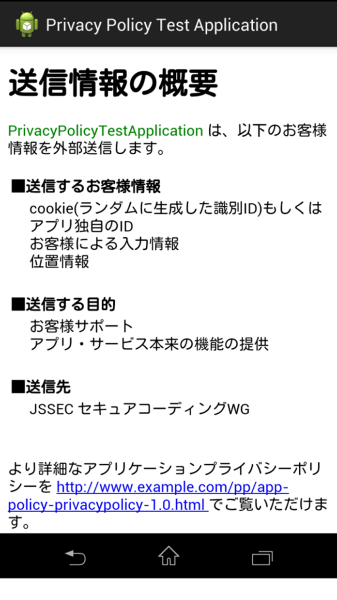{width="2.46875in" height="4.229166666666667in"}

図 5.5‑3　マーケットプレイス上での説明例

### ルールブック

プライバシー情報を扱う際には以下のルールを守ること。

1.  送信する利用者情報は必要最低限に留める （必須）

2.  初回起動時(アップデート時)に、ユーザーによる取り換えが困難、または、慎重な取り扱いが求められる利用者情報の送信について包括同意を得る
    > （必須）

3.  慎重な取り扱いが求められる利用者情報を送信する場合は、ユーザーに個別同意を得る
    > （必須）

4.  ユーザーがアプリ・プライバシーポリシーを確認できる手段を用意する
    > （必須）

5.  アプリ・プライバシーポリシー概要版をassetsフォルダ内に配置しておく
    > （推奨）

6.  送信した利用者情報をユーザー操作により削除および送信停止する手段を用意する
    > （推奨）

7.  端末固有IDとUUID/cookieを使い分ける （推奨）

8.  利用者情報を端末内のみで利用する場合、外部送信しない旨をユーザーに通知する
    > （推奨）

#### 送信する利用者情報は必要最低限に留める （必須）

アプリマニュアルなどの説明を元にユーザーが想起できるアプリの動作および目的以外で利用者情報にアクセスしないよう設計すること。また、アプリの動作および目的に必要な利用者情報であっても、アプリ内部でのみ必要な情報と外部サーバー等に送信すべき情報を精査し、必要最低限の情報のみを送信すること。

例えば、アラームアプリで、指定した時間にアラームが鳴る機能しか提供していないにもかかわらず位置情報をサーバーに送信している場合、ユーザーは位置情報とアプリの機能を関連付けることは難しい。一方で、このアラームアプリが、ユーザーがいる場所に応じて設定されたアラームを鳴らす機能を持つ場合は、アプリが位置情報を利用する理由を説明することができる。このように、ユーザーが機能と利用者情報との関連を理解できる説明が可能であれば、利用者情報の利用に妥当性があるとみなせる。

#### 初回起動時(アップデート時)に、ユーザーによる取り換えが困難、または、慎重な取り扱いが求められる利用者情報の送信について包括同意を得る （必須）

ユーザーによる取り換えが困難な利用者情報や慎重な取り扱いが求められる利用者情報を外部サーバーに送信する場合、ユーザーがアプリを使用する前に、アプリがどのような情報をどのような目的でサーバーに送信するか、第三者提供はあるかなどについて、事前にユーザーの同意(オプトイン)を得ることが求められる。具体的には、アプリの初回起動時にアプリ・プライバシーポリシーを提示して、ユーザーの確認と同意を得るようにするべきである。また、アプリケーションのアップデートにより、新たな利用者情報を外部サーバーに送信するようになった時にも、再度ユーザーの確認と同意を得るようにする必要がある。同意が得られない場合は、アプリを終了するなど、情報の送信が必要な機能(処理)を無効にすること。

これにより、ユーザーが利用者情報の利用状況を理解した上でアプリを使用していることが保証され、ユーザーに安心感を提供するとともにアプリへの信頼感を得ることが期待できる。

> MainActivity.java

protected void onStart() {

super.onStart();

～省略～

if (privacyPolicyAgreed &lt;=
VERSION\_TO\_SHOW\_COMPREHENSIVE\_AGREEMENT\_ANEW) {

// ★ポイント★
初回起動時(アップデート時)に、ユーザーによる取り換えが困難、または、慎重な取り扱いが求められる利用者情報の送信について包括同意を得る

//
アップデート時については、新しい利用者情報を扱うようになった場合にのみ、再度包括同意を得る必要がある。

ConfirmFragment dialog = ConfirmFragment.newInstance(

R.string.privacyPolicy, R.string.agreePrivacyPolicy,

DIALOG\_TYPE\_COMPREHENSIVE\_AGREEMENT);

dialog.setDialogListener(this);

FragmentManager fragmentManager = getSupportFragmentManager();

dialog.show(fragmentManager, "dialog");

}

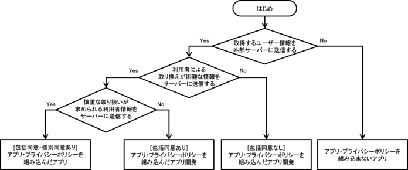{width="2.2083333333333335in"
height="3.7708333333333335in"}

図 5.5‑4　包括同意の例

#### 慎重な取り扱いが求められる利用者情報を送信する場合は、ユーザーに個別同意を得る （必須）

慎重な取扱いが求められる利用者情報を外部サーバーに送信する場合は、包括同意に加えて、利用者情報(または利用者情報の送信を伴う機能)毎に、事前にユーザーの同意(オプトイン)を得ることが必要である。ユーザーの同意が得られなかった場合は、外部サーバーへの情報送信は実施してはならない。

これにより、ユーザーは包括同意で確認した利用者情報の送信に関して、より具体的なアプリ機能(提供サービス)との関連を知ることができ、アプリ提供者はユーザーのより正確な判断による同意を得ることが期待できる。

> MainActivity.java

public void onSendToServer(View view) {

//
★ポイント★慎重な取り扱いが求められる利用者情報を送信する場合は、個別にユーザーの同意を得る

ConfirmFragment dialog =
ConfirmFragment.newInstance(R.string.sendLocation,
R.string.cofirmSendLocation, DIALOG\_TYPE\_PRE\_CONFIRMATION);

dialog.setDialogListener(this);

FragmentManager fragmentManager = getSupportFragmentManager();

dialog.show(fragmentManager, "dialog");

}

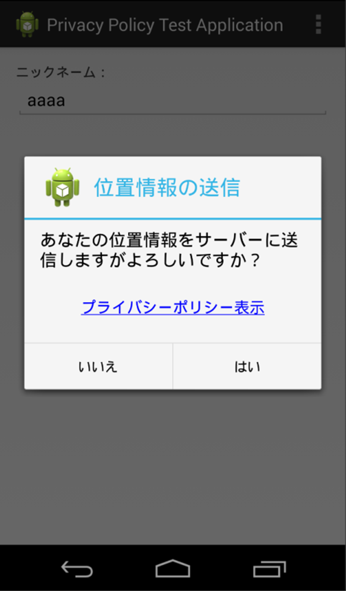{width="2.2083333333333335in"
height="3.7708333333333335in"}

図 5.5‑5 個別同意の例

#### ユーザーがアプリ・プライバシーポリシーを確認できる手段を用意する （必須）

一般に、ユーザーが該当アプリをインストールする前にアプリ・プライバシーポリシーを確認する手段として、Androidアプリのマーケットプレイス上にアプリ・プライバシーポリシーのリンクを表示する機能がある。この機能への対応に加え、アプリを端末にインストールした後でも、ユーザーがアプリ・プライバシーポリシーを参照できる手段を用意すること。特に利用者情報を外部サーバー等に送信する場合の個別同意確認時にはアプリ・プライバシーポリシーを容易に確認できる手段を用意し、ユーザーが正しく判断できるようにすることが望ましい。

> MainActivity.java

@Override

public boolean onOptionsItemSelected(MenuItem item) {

switch (item.getItemId()) {

case R.id.action\_show\_pp:

// ★ポイント★
ユーザーがアプリ・プライバシーポリシーを確認できる手段を用意する

Intent intent = new Intent();

intent.setClass(this, WebViewAssetsActivity.class);

startActivity(intent);

return true;

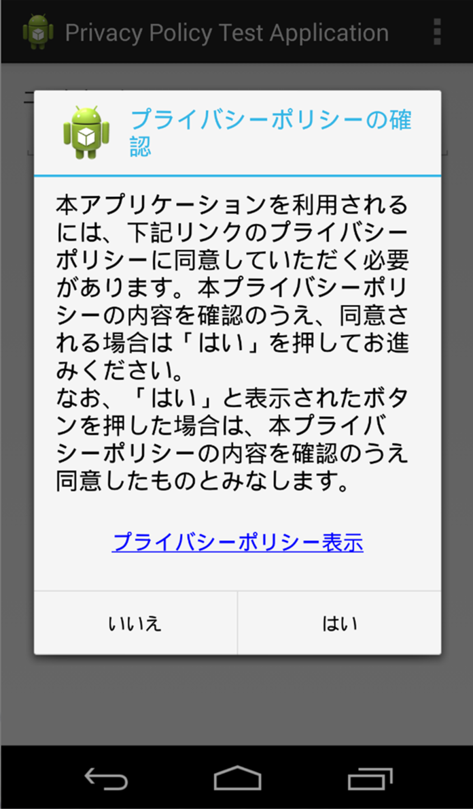{width="2.1979166666666665in"
height="3.7708333333333335in"}

図 5.5‑6　プライバシーポリシー表示用メニュー

#### アプリ・プライバシーポリシー概要版をassetsフォルダ内に配置しておく （推奨）

アプリ・プライバシーポリシーの概要版はassetsフォルダ内に配置しておき、必要に応じて閲覧に利用することが望ましい。アプリ・プライバシーポリシーがassetsフォルダにあれば、いつでも容易にアクセス可能であると同時に、悪意のある第三者により、偽造や改造されたアプリ・プライバシーポリシーを参照させられるリスクが回避可能なためである。また、assetsフォルダに配置するファイルは、利用者情報に関する第三者検証が可能であることが望ましい。本節で紹介した「アプリケーション・プライバシーポリシー作成支援ツール」を利用する場合、検査用タグのあるXMLファイルもassetsフォルダに配置することで第三者検証が可能になる。

#### 送信した利用者情報をユーザー操作により削除および送信停止する手段を用意する （推奨）

利用者の求めに応じ、外部サーバー上に送信された利用者情報を削除する機能を提供することが望ましい。同様に、アプリ自身で端末内に利用者情報（もしくはそのコピー）を保存した場合も、その情報を削除する機能をユーザーに提供することが望ましい。また、利用者の求めに応じ、利用者情報の送信を停止する機能を提供することが望ましい。

本ルール（推奨）の内、利用者情報の削除については、EUで提唱されている『忘れられる権利』により定められたものであるが、今後は利用者データ保護に関する個人の権利の強化も提案されているため、特に理由がない限り、本ガイドでは利用者情報の削除機能を用意することを推奨する。また、利用者情報の送信停止については、主にブラウザによる対応が進んでいる『Do
Not
Track（追跡拒否）』の観点により定められたものであり、削除同様に送信停止機能を用意することを推奨する。

> MainActivity.java

@Override

public boolean onOptionsItemSelected(MenuItem item) {

switch (item.getItemId()) {

～省略～

case R.id.action\_del\_id:

// ★ポイント★ 送信した情報をユーザー操作により削除する手段を用意する

new SendDataAsyncTack().execute(DEL\_ID\_URI, UserId);

return true;

}

#### 端末固有IDとUUID/cookieを使い分ける （推奨）

IMEIなどの端末固有IDは、利用者情報と紐付けて送信すべきでない。端末固有IDと利用者情報が紐付いた形で一度でも公開や漏えいしてしまうと、後から端末固有IDの変更が不可能なため、IDと利用者情報の紐づけを切ることができない（難しい）ことが、その理由である。この場合、端末固有IDに変わって、UUID/cookieなどの乱数をベースにした都度作成する変更可能なIDを使って、利用者情報との紐づけおよび送信をすると良い。これにより、上記で説明した『忘れられる権利』を考慮した実装とすることができる。

> MainActivity.java

@Override

protected String doInBackground(String... params) {

// ★ポイント★ 利用者情報の紐づけにはUUID/cookieを利用する

// 本サンプルではサーバー側で生成したIDを利用する

SharedPreferences sp = getSharedPreferences(PRIVACY\_POLICY\_PREF\_NAME,
MODE\_PRIVATE);

UserId = sp.getString(ID\_KEY, null);

if (UserId == null) {

//
SharedPreferences内にトークンが存在しなため、サーバーからIDを取り寄せる。

try {

UserId = NetworkUtil.getCookie(GET\_ID\_URI, "", "id");

} catch (IOException e) {

// 証明書エラーなどの例外をキャッチする

extMessage = e.toString();

}

// 取り寄せたIDをSharedPreferencesに保存する。

sp.edit().putString(ID\_KEY, UserId).commit();

}

return UserId;

}

#### 利用者情報を端末内のみで利用する場合、外部送信しない旨をユーザーに通知する （推奨）

利用者の端末内部で一時的に利用者情報にアクセスするのみの場合であっても、利用者の理解を助け透明性を高めるために、その旨を伝えることが望ましい。具体的には、アクセスした利用者情報は、ある決まった目的のために端末内部で一時的に使用するのみであり、端末内に保存したり、外部サーバに送信したりしない旨をを利用者に通知すると良い。通知方法としては、マーケットプレイス上でのアプリ説明欄に記載するなどの方法が考えられる。なお、端末内での一時利用のみの場合は、アプリ・プライバシーポリシーへの記載は必須ではない。

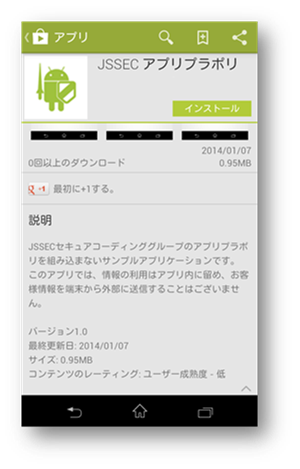{width="3.1145833333333335in" height="4.875in"}

図 5.5‑7　マーケットプレイス上での説明例

### アドバンスト

#### プライバシーポリシーを取りまく状況

スマートフォンにおける利用者情報を取得し、外部に送信する場合には、利用者に対してアプリがどのような情報をどのように扱うか等を示したアプリ・プライバシーポリシーを作成・提示する必要がある。アプリ・プライバシーポリシーに記載すべき内容は、総務省SPIにて定義されている。

アプリ・プライバシーポリシーは個々のアプリが扱うすべての利用者情報と、その用途や情報の保存先、送信先等を明らかにすることに主眼が置かれている。それとは別に事業者が個々のアプリから収集したすべての利用者情報をどのように保管・管理・廃棄をするかを示す事業者プライバシーポリシーも必要となる。従来、個人情報保護法をもとに作成されているプライバシーポリシーとはこの事業者プライバシーポリシーが相当する。

プライバシーポリシーの作成・提示方法やそれぞれのプラバシーポリシーの役割分担などは、『JSSEC　スマホ・アプリのプライバシーポリシー作成・開示についての考察』([*http://www.jssec.org/event/20140206/03-1\_app\_policy.pdf*](http://www.jssec.org/event/20140206/03-1_app_policy.pdf)）
に詳細説明が記載されているので参照のこと。

#### 用語解説

以下に、本ガイドで使用している用語について、『JSSEC　スマホ・アプリのプライバシーポリシー作成・開示についての考察』
([*http://www.jssec.org/event/20140206/03-1\_app\_policy.pdf*](http://www.jssec.org/event/20140206/03-1_app_policy.pdf))
に記載されている用語解説を引用しておく。

表 5.5‑1

  用語                                     解説
  ---------------------------------------- -------------------------------------------------------------------------------------------------------------------
  事業者プライバシーポリシー               事業者における個人情報保護方針を記したプライバシーポリシー。個人情報保護法に基づき作成
  アプリ・プライバシーポリシー             アプリケーション向けプライバシーポリシー。総務省SPIの指針に基づき作成。概要版と詳細版での解りやすい説明が望まれる
  概要版アプリ・プライバシーポリシー       アプリが取得する利用者情報、取得目的、第三者提供の有無などを簡潔に記述した文書
  詳細版アプリ・プライバシーポリシー       総務省SPIの定める８項目に準拠した詳細な内容を記述した文書
  利用者による取り換えが容易な利用者情報   cookie、UUIDなど
  利用者による取り換えが困難な利用者情報   IMEI、IMSI、ICCID、MACアドレス、OSが生成するIDなど
  慎重な取り扱いが求められる利用者情報     位置情報、アドレス帳、電話番号、メールアドレスなど

暗号技術を利用する
------------------

セキュリティの世界では、脅威を分析し対策するための観点として、機密性(Confidentiality)、完全性(Integrity)、可用性(Availavility)という用語が使われる。それぞれ秘密のデータを第三者に見られないようにすること、参照するデータが改ざんされないように(または、改ざんされたことを検知)すること、サービスやデータが必要な時にいつでも利用できることを意味しており、セキュリティを確保する際に考慮すべき大切な要素である。中でも、機密性や完全性のために暗号技術が用いられることが多く、Androidにおいてもアプリが機密性や完全性を実現するための様々な暗号機能が用意されている。

ここでは、Androidアプリにおける暗号化・復号(機密性の実現)、メッセージ認証コード/デジタル署名
(完全性の実現)の安全な実装方法をサンプルコードで示す。

### サンプルコード

「暗号化・復号する(機密性を確保する)」、「改ざんを検知する(完全性を確認する)」というユースケースの具体的な用途や条件に対して、様々な暗号方式が開発されている。ここでは、暗号技術をどのような用途で利用するかという観点から、暗号方式を大きく3つに分類してサンプルコードを用意している。それぞれの暗号技術の特徴から利用すべき暗号方式・鍵の種類を判断することができる。より細やかな判断が必要な場合には、「5.6.3.1
暗号方式の選択」も参照すること。

また、暗号技術を利用する実装をする際には、「5.6.3.3
乱数生成における脆弱性と対策」もあらかじめ参照すること。

-   第三者の盗聴からデータを守る

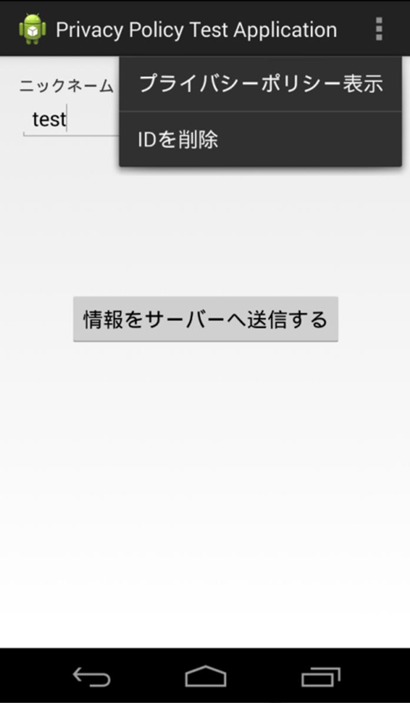{width="5.606944444444444in"
height="2.933333333333333in"}

[]{#_Ref389479993 .anchor}図 5.6‑1
盗聴からデータを守るサンプルコードを選択するフローチャート

-   第三者によるデータの改ざんを検知する

{width="5.720833333333333in"
height="2.933333333333333in"}

[]{#_Ref389479998 .anchor}図
5.6‑2　データの改ざんを検知するサンプルコードを選択するフローチャート

#### パスワード鍵を利用して暗号化・復号する

ユーザーの情報資産の秘匿性を守る目的にはパスワードベース鍵暗号を使うことができる。

> ポイント：

1.  明示的に暗号モードとパディングを設定する

&nbsp;
1.  脆弱でない(基準を満たす)暗号技術（アルゴリズム・モード・パディング等）を使用する

2.  パスワードから鍵を生成する場合は、Saltを使用する

3.  パスワードから鍵を生成する場合は、適正なハッシュの繰り返し回数を指定する

4.  十分安全な長さを持つ鍵を利用する

> AesCryptoPBEKey.java

package org.jssec.android.cryptsymmetricpasswordbasedkey;

import java.security.InvalidAlgorithmParameterException;

import java.security.InvalidKeyException;

import java.security.NoSuchAlgorithmException;

import java.security.SecureRandom;

import java.security.spec.InvalidKeySpecException;

import java.util.Arrays;

import javax.crypto.BadPaddingException;

import javax.crypto.Cipher;

import javax.crypto.IllegalBlockSizeException;

import javax.crypto.NoSuchPaddingException;

import javax.crypto.SecretKey;

import javax.crypto.SecretKeyFactory;

import javax.crypto.spec.IvParameterSpec;

import javax.crypto.spec.PBEKeySpec;

public final class AesCryptoPBEKey {

// ★ポイント1★ 明示的に暗号モードとパディングを設定する

// ★ポイント2★
脆弱でない(基準を満たす)暗号技術（アルゴリズム・モード・パディング等）を使用する

// Cipher クラスの getInstance に渡すパラメータ
（/\[暗号アルゴリズム\]/\[ブロック暗号モード\]/\[パディングルール\])

//
サンプルでは、暗号アルゴリズム=AES、ブロック暗号モード=CBC、パディングルール=PKCS7Padding

private static final String TRANSFORMATION = "AES/CBC/PKCS7Padding";

// 鍵を生成するクラスのインスタンスを取得するための文字列

private static final String KEY\_GENERATOR\_MODE =
"PBEWITHSHA256AND128BITAES-CBC-BC";

// ★ポイント3★ パスワードから鍵を生成する場合は、Saltを使用する

// Saltのバイト長

public static final int SALT\_LENGTH\_BYTES = 20;

// ★ポイント4★
パスワードから鍵を生成する場合は、適正なハッシュの繰り返し回数を指定する

// PBE で鍵を生成する際の攪拌の繰り返し回数

private static final int KEY\_GEN\_ITERATION\_COUNT = 1024;

// ★ポイント5★ 十分安全な長さを持つ鍵を利用する

// 鍵のビット長

private static final int KEY\_LENGTH\_BITS = 128;

private byte\[\] mIV = null;

private byte\[\] mSalt = null;

public byte\[\] getIV() {

return mIV;

}

public byte\[\] getSalt() {

return mSalt;

}

AesCryptoPBEKey(final byte\[\] iv, final byte\[\] salt) {

mIV = iv;

mSalt = salt;

}

AesCryptoPBEKey() {

mIV = null;

initSalt();

}

private void initSalt() {

mSalt = new byte\[SALT\_LENGTH\_BYTES\];

SecureRandom sr = new SecureRandom();

sr.nextBytes(mSalt);

}

public final byte\[\] encrypt(final byte\[\] plain, final char\[\]
password) {

byte\[\] encrypted = null;

try {

// ★ポイント1★ 明示的に暗号モードとパディングを設定する

// ★ポイント2★
脆弱でない(基準を満たす)暗号技術（アルゴリズム・モード・パディング等）を使用する

Cipher cipher = Cipher.getInstance(TRANSFORMATION);

// ★ポイント3★ パスワードから鍵を生成する場合は、Saltを使用する

SecretKey secretKey = generateKey(password, mSalt);

cipher.init(Cipher.ENCRYPT\_MODE, secretKey);

mIV = cipher.getIV();

encrypted = cipher.doFinal(plain);

} catch (NoSuchAlgorithmException e) {

} catch (NoSuchPaddingException e) {

} catch (InvalidKeyException e) {

} catch (IllegalBlockSizeException e) {

} catch (BadPaddingException e) {

} finally {

}

return encrypted;

}

public final byte\[\] decrypt(final byte\[\] encrypted, final char\[\]
password) {

byte\[\] plain = null;

try {

// ★ポイント1★ 明示的に暗号モードとパディングを設定する

// ★ポイント2★
脆弱でない(基準を満たす)暗号技術（アルゴリズム・モード・パディング等）を使用する

Cipher cipher = Cipher.getInstance(TRANSFORMATION);

// ★ポイント3★ パスワードから鍵を生成する場合は、Saltを使用する

SecretKey secretKey = generateKey(password, mSalt);

IvParameterSpec ivParameterSpec = new IvParameterSpec(mIV);

cipher.init(Cipher.DECRYPT\_MODE, secretKey, ivParameterSpec);

plain = cipher.doFinal(encrypted);

} catch (NoSuchAlgorithmException e) {

} catch (NoSuchPaddingException e) {

} catch (InvalidKeyException e) {

} catch (InvalidAlgorithmParameterException e) {

} catch (IllegalBlockSizeException e) {

} catch (BadPaddingException e) {

} finally {

}

return plain;

}

private static final SecretKey generateKey(final char\[\] password,
final byte\[\] salt) {

SecretKey secretKey = null;

PBEKeySpec keySpec = null;

try {

// ★ポイント2★
脆弱でない(基準を満たす)アルゴリズム・モード・パディングを使用する

// 鍵を生成するクラスのインスタンスを取得する

// 例では、AES-CBC 128 ビット用の鍵を SHA256 を利用して生成する
KeyFactory を使用。

SecretKeyFactory secretKeyFactory =
SecretKeyFactory.getInstance(KEY\_GENERATOR\_MODE);

// ★ポイント3★ パスワードから鍵を生成する場合は、Saltを使用する

// ★ポイント4★
パスワードから鍵を生成する場合は、適正なハッシュの繰り返し回数を指定する

// ★ポイント5★ 十分安全な長さを持つ鍵を利用する

keySpec = new PBEKeySpec(password, salt, KEY\_GEN\_ITERATION\_COUNT,
KEY\_LENGTH\_BITS);

// passwordのクリア

Arrays.fill(password, '?');

// 鍵を生成する

secretKey = secretKeyFactory.generateSecret(keySpec);

} catch (NoSuchAlgorithmException e) {

} catch (InvalidKeySpecException e) {

} finally {

keySpec.clearPassword();

}

return secretKey;

}

}

#### 公開鍵を利用して暗号化・復号する

アプリ側では公開鍵を保持してデータの暗号化のみを行い、復号を異なる安全な場所(サーバーなど)で秘密鍵によって行うような用途には公開鍵(非対称鍵)暗号を使うことができる。

> ポイント：

1.  明示的に暗号モードとパディングを設定する

&nbsp;
1.  脆弱でない(基準を満たす)暗号技術（アルゴリズム・モード・パディング等）を使用する

2.  十分安全な長さを持つ鍵を利用する

> RsaCryptoAsymmetricKey.java

package org.jssec.android.cryptasymmetrickey;

import java.security.InvalidKeyException;

import java.security.KeyFactory;

import java.security.NoSuchAlgorithmException;

import java.security.PrivateKey;

import java.security.PublicKey;

import java.security.interfaces.RSAPublicKey;

import java.security.spec.InvalidKeySpecException;

import java.security.spec.PKCS8EncodedKeySpec;

import java.security.spec.X509EncodedKeySpec;

import javax.crypto.BadPaddingException;

import javax.crypto.Cipher;

import javax.crypto.IllegalBlockSizeException;

import javax.crypto.NoSuchPaddingException;

public final class RsaCryptoAsymmetricKey {

// ★ポイント1★ 明示的に暗号モードとパディングを設定する

// ★ポイント2★
脆弱でない(基準を満たす)暗号技術（アルゴリズム・モード・パディング等）を使用する

// Cipher クラスの getInstance に渡すパラメータ
（/\[暗号アルゴリズム\]/\[ブロック暗号モード\]/\[パディングルール\])

//
サンプルでは、暗号アルゴリズム=RSA、ブロック暗号モード=NONE、パディングルール=OAEPPADDING

private static final String TRANSFORMATION = "RSA/NONE/OAEPPADDING";

// 暗号アルゴリズム

private static final String KEY\_ALGORITHM = "RSA";

// ★ポイント3★ 十分安全な長さを持つ鍵を利用する

// 鍵長チェック

private static final int MIN\_KEY\_LENGTH = 2000;

RsaCryptoAsymmetricKey() {

}

public final byte\[\] encrypt(final byte\[\] plain, final byte\[\]
keyData) {

byte\[\] encrypted = null;

try {

// ★ポイント1★ 明示的に暗号モードとパディングを設定する

// ★ポイント2★
脆弱でない(基準を満たす)暗号技術（アルゴリズム・モード・パディング等）を使用する

Cipher cipher = Cipher.getInstance(TRANSFORMATION);

PublicKey publicKey = generatePubKey(keyData);

if (publicKey != null) {

cipher.init(Cipher.ENCRYPT\_MODE, publicKey);

encrypted = cipher.doFinal(plain);

}

} catch (NoSuchAlgorithmException e) {

} catch (NoSuchPaddingException e) {

} catch (InvalidKeyException e) {

} catch (IllegalBlockSizeException e) {

} catch (BadPaddingException e) {

} finally {

}

return encrypted;

}

public final byte\[\] decrypt(final byte\[\] encrypted, final byte\[\]
keyData) {

// 本来、復号処理はサーバー側で実装すべきものであるが、

// 本サンプルでは動作確認用に、アプリ内でも復号処理を実装した。

//
実際にサンプルコードを利用する場合は、アプリ内に秘密鍵を保持しないようにすること。

byte\[\] plain = null;

try {

// ★ポイント1★ 明示的に暗号モードとパディングを設定する

// ★ポイント2★
脆弱でない(基準を満たす)暗号技術（アルゴリズム・モード・パディング等）を使用する

Cipher cipher = Cipher.getInstance(TRANSFORMATION);

PrivateKey privateKey = generatePriKey(keyData);

cipher.init(Cipher.DECRYPT\_MODE, privateKey);

plain = cipher.doFinal(encrypted);

} catch (NoSuchAlgorithmException e) {

} catch (NoSuchPaddingException e) {

} catch (InvalidKeyException e) {

} catch (IllegalBlockSizeException e) {

} catch (BadPaddingException e) {

} finally {

}

return plain;

}

private static final PublicKey generatePubKey(final byte\[\] keyData) {

PublicKey publicKey = null;

KeyFactory keyFactory = null;

try {

keyFactory = KeyFactory.getInstance(KEY\_ALGORITHM);

publicKey = keyFactory.generatePublic(new X509EncodedKeySpec(keyData));

} catch (IllegalArgumentException e) {

} catch (NoSuchAlgorithmException e) {

} catch (InvalidKeySpecException e) {

} finally {

}

// ★ポイント3★ 十分安全な長さを持つ鍵を利用する

// 鍵長のチェック

if (publicKey instanceof RSAPublicKey) {

int len = ((RSAPublicKey) publicKey).getModulus().bitLength();

if (len &lt; MIN\_KEY\_LENGTH) {

publicKey = null;

}

}

return publicKey;

}

private static final PrivateKey generatePriKey(final byte\[\] keyData) {

PrivateKey privateKey = null;

KeyFactory keyFactory = null;

try {

keyFactory = KeyFactory.getInstance(KEY\_ALGORITHM);

privateKey = keyFactory.generatePrivate(new
PKCS8EncodedKeySpec(keyData));

} catch (IllegalArgumentException e) {

} catch (NoSuchAlgorithmException e) {

} catch (InvalidKeySpecException e) {

} finally {

}

return privateKey;

}

}

#### 共通鍵を利用して暗号化・復号する

サイズの大きなデータを扱う場合やアプリの資産・ユーザーの資産の秘匿性を守る目的で使うことができる。

> ポイント：

1.  明示的に暗号モードとパディングを設定する

&nbsp;
1.  脆弱でない(基準を満たす)暗号技術（アルゴリズム・モード・パディング等）を使用する

2.  十分安全な長さを持つ鍵を利用する

> AesCryptoPreSharedKey.java

package org.jssec.android.cryptsymmetricpresharedkey;

import java.security.InvalidAlgorithmParameterException;

import java.security.InvalidKeyException;

import java.security.NoSuchAlgorithmException;

import javax.crypto.BadPaddingException;

import javax.crypto.Cipher;

import javax.crypto.IllegalBlockSizeException;

import javax.crypto.NoSuchPaddingException;

import javax.crypto.SecretKey;

import javax.crypto.spec.IvParameterSpec;

import javax.crypto.spec.SecretKeySpec;

public final class AesCryptoPreSharedKey {

// ★ポイント1★ 明示的に暗号モードとパディングを設定する

// ★ポイント2★
脆弱でない(基準を満たす)暗号技術（アルゴリズム・モード・パディング等）を使用する

// Cipher クラスの getInstance に渡すパラメータ
（/\[暗号アルゴリズム\]/\[ブロック暗号モード\]/\[パディングルール\])

//
サンプルでは、暗号アルゴリズム=AES、ブロック暗号モード=CBC、パディングルール=PKCS7Padding

private static final String TRANSFORMATION = "AES/CBC/PKCS7Padding";

// 暗号アルゴリズム

private static final String KEY\_ALGORITHM = "AES";

// IVのバイト長

public static final int IV\_LENGTH\_BYTES = 16;

// ★ポイント3★ 十分安全な長さを持つ鍵を利用する

// 鍵長チェック

private static final int MIN\_KEY\_LENGTH\_BYTES = 16;

private byte\[\] mIV = null;

public byte\[\] getIV() {

return mIV;

}

AesCryptoPreSharedKey(final byte\[\] iv) {

mIV = iv;

}

AesCryptoPreSharedKey() {

}

public final byte\[\] encrypt(final byte\[\] keyData, final byte\[\]
plain) {

byte\[\] encrypted = null;

try {

// ★ポイント1★ 明示的に暗号モードとパディングを設定する

// ★ポイント2★
脆弱でない(基準を満たす)暗号技術（アルゴリズム・モード・パディング等）を使用する

Cipher cipher = Cipher.getInstance(TRANSFORMATION);

SecretKey secretKey = generateKey(keyData);

if (secretKey != null) {

cipher.init(Cipher.ENCRYPT\_MODE, secretKey);

mIV = cipher.getIV();

encrypted = cipher.doFinal(plain);

}

} catch (NoSuchAlgorithmException e) {

} catch (NoSuchPaddingException e) {

} catch (InvalidKeyException e) {

} catch (IllegalBlockSizeException e) {

} catch (BadPaddingException e) {

} finally {

}

return encrypted;

}

public final byte\[\] decrypt(final byte\[\] keyData, final byte\[\]
encrypted) {

byte\[\] plain = null;

try {

// ★ポイント1★ 明示的に暗号モードとパディングを設定する

// ★ポイント2★
脆弱でない(基準を満たす)暗号技術（アルゴリズム・モード・パディング等）を使用する

Cipher cipher = Cipher.getInstance(TRANSFORMATION);

SecretKey secretKey = generateKey(keyData);

if (secretKey != null) {

IvParameterSpec ivParameterSpec = new IvParameterSpec(mIV);

cipher.init(Cipher.DECRYPT\_MODE, secretKey, ivParameterSpec);

plain = cipher.doFinal(encrypted);

}

} catch (NoSuchAlgorithmException e) {

} catch (NoSuchPaddingException e) {

} catch (InvalidKeyException e) {

} catch (InvalidAlgorithmParameterException e) {

} catch (IllegalBlockSizeException e) {

} catch (BadPaddingException e) {

} finally {

}

return plain;

}

private static final SecretKey generateKey(final byte\[\] keyData) {

SecretKey secretKey = null;

try {

// ★ポイント3★ 十分安全な長さを持つ鍵を利用する

if (keyData.length &gt;= MIN\_KEY\_LENGTH\_BYTES) {

// ★ポイント2★
脆弱でない(基準を満たす)暗号技術（アルゴリズム・モード・パディング等）を使用する

secretKey = new SecretKeySpec(keyData, KEY\_ALGORITHM);

}

} catch (IllegalArgumentException e) {

} finally {

}

return secretKey;

}

}

#### パスワード鍵を利用して改ざんを検知する

ユーザーの情報資産の完全性をチェックする目的にはパスワードベース(共通鍵)暗号を使うことができる。

> ポイント：

1.  明示的に暗号モードとパディングを設定する

&nbsp;
1.  脆弱でない(基準を満たす)暗号技術（アルゴリズム・モード・パディング等）を使用する

2.  パスワードから鍵を生成する場合は、Saltを使用する

3.  パスワードから鍵を生成する場合は、適正なハッシュの繰り返し回数を指定する

4.  十分安全な長さを持つ鍵を利用する

> HmacPBEKey.java

package org.jssec.android.signsymmetricpasswordbasedkey;

import java.security.InvalidKeyException;

import java.security.NoSuchAlgorithmException;

import java.security.SecureRandom;

import java.security.spec.InvalidKeySpecException;

import java.util.Arrays;

import javax.crypto.Mac;

import javax.crypto.SecretKey;

import javax.crypto.SecretKeyFactory;

import javax.crypto.spec.PBEKeySpec;

public final class HmacPBEKey {

// ★ポイント1★ 明示的に暗号モードとパディングを設定する

// ★ポイント2★
脆弱でない(基準を満たす)暗号技術（アルゴリズム・モード・パディング等）を使用する

// Mac クラスの getInstance に渡すパラメータ （認証モード)

private static final String TRANSFORMATION = "PBEWITHHMACSHA1";

// 鍵を生成するクラスのインスタンスを取得するための文字列

private static final String KEY\_GENERATOR\_MODE = "PBEWITHHMACSHA1";

// ★ポイント3★ パスワードから鍵を生成する場合は、Saltを使用する

// Saltのバイト長

public static final int SALT\_LENGTH\_BYTES = 20;

// ★ポイント4★
パスワードから鍵を生成する場合は、適正なハッシュの繰り返し回数を指定する

// PBE で鍵を生成する際の攪拌の繰り返し回数

private static final int KEY\_GEN\_ITERATION\_COUNT = 1024;

// ★ポイント5★ 十分安全な長さを持つ鍵を利用する

// 鍵のビット長

private static final int KEY\_LENGTH\_BITS = 160;

private byte\[\] mSalt = null;

public byte\[\] getSalt() {

return mSalt;

}

HmacPBEKey() {

initSalt();

}

HmacPBEKey(final byte\[\] salt) {

mSalt = salt;

}

private void initSalt() {

mSalt = new byte\[SALT\_LENGTH\_BYTES\];

SecureRandom sr = new SecureRandom();

sr.nextBytes(mSalt);

}

public final byte\[\] sign(final byte\[\] plain, final char\[\]
password) {

return calculate(plain, password);

}

private final byte\[\] calculate(final byte\[\] plain, final char\[\]
password) {

byte\[\] hmac = null;

try {

// ★ポイント1★ 明示的に暗号モードとパディングを設定する

// ★ポイント2★
脆弱でない(基準を満たす)暗号技術（アルゴリズム・モード・パディング等）を使用する

Mac mac = Mac.getInstance(TRANSFORMATION);

// ★ポイント3★ パスワードから鍵を生成する場合は、Saltを使用する

SecretKey secretKey = generateKey(password, mSalt);

mac.init(secretKey);

hmac = mac.doFinal(plain);

} catch (NoSuchAlgorithmException e) {

} catch (InvalidKeyException e) {

} finally {

}

return hmac;

}

public final boolean verify(final byte\[\] hmac, final byte\[\] plain,
final char\[\] password) {

byte\[\] hmacForPlain = calculate(plain, password);

if (Arrays.equals(hmac, hmacForPlain)) {

return true;

}

return false;

}

private static final SecretKey generateKey(final char\[\] password,
final byte\[\] salt) {

SecretKey secretKey = null;

PBEKeySpec keySpec = null;

try {

// ★ポイント2★
脆弱でない(基準を満たす)アルゴリズム・モード・パディングを使用する

// 鍵を生成するクラスのインスタンスを取得する

// 例では、AES-CBC 128 ビット用の鍵を SHA1 を利用して生成する KeyFactory
を使用。

SecretKeyFactory secretKeyFactory =
SecretKeyFactory.getInstance(KEY\_GENERATOR\_MODE);

// ★ポイント3★ パスワードから鍵を生成する場合は、Saltを使用する

// ★ポイント4★
パスワードから鍵を生成する場合は、適正なハッシュの繰り返し回数を指定する

// ★ポイント5★ 十分安全な長さを持つ鍵を利用する

keySpec = new PBEKeySpec(password, salt, KEY\_GEN\_ITERATION\_COUNT,
KEY\_LENGTH\_BITS);

// passwordのクリア

Arrays.fill(password, '?');

// 鍵を生成する

secretKey = secretKeyFactory.generateSecret(keySpec);

} catch (NoSuchAlgorithmException e) {

} catch (InvalidKeySpecException e) {

} finally {

keySpec.clearPassword();

}

return secretKey;

}

}

#### 公開鍵を利用して改ざんを検知する

異なる安全な場所(サーバーなど)で秘密鍵による署名を行ったデータに対して、アプリ側では公開鍵を保持してデータの署名検証のみを行うような用途には公開鍵(非対称鍵)暗号を使うことができる。

> ポイント：

1.  明示的に暗号モードとパディングを設定する

&nbsp;
1.  脆弱でない(基準を満たす)暗号技術（アルゴリズム・モード・パディング等）を使用する

2.  十分安全な長さを持つ鍵を利用する

> RsaSignAsymmetricKey.java

package org.jssec.android.signasymmetrickey;

import java.security.InvalidKeyException;

import java.security.KeyFactory;

import java.security.NoSuchAlgorithmException;

import java.security.PrivateKey;

import java.security.PublicKey;

import java.security.Signature;

import java.security.SignatureException;

import java.security.interfaces.RSAPublicKey;

import java.security.spec.InvalidKeySpecException;

import java.security.spec.PKCS8EncodedKeySpec;

import java.security.spec.X509EncodedKeySpec;

public final class RsaSignAsymmetricKey {

// ★ポイント1★ 明示的に暗号モードとパディングを設定する

// ★ポイント2★
脆弱でない(基準を満たす)暗号技術（アルゴリズム・モード・パディング等）を使用する

// Cipher クラスの getInstance に渡すパラメータ
（/\[暗号アルゴリズム\]/\[ブロック暗号モード\]/\[パディングルール\])

//
サンプルでは、暗号アルゴリズム=RSA、ブロック暗号モード=NONE、パディングルール=OAEPPADDING

private static final String TRANSFORMATION = "SHA256withRSA";

// 暗号アルゴリズム

private static final String KEY\_ALGORITHM = "RSA";

// ★ポイント3★ 十分安全な長さを持つ鍵を利用する

// 鍵長チェック

private static final int MIN\_KEY\_LENGTH = 2000;

RsaSignAsymmetricKey() {

}

public final byte\[\] sign(final byte\[\] plain, final byte\[\] keyData)
{

// 本来、署名処理はサーバー側で実装すべきものであるが、

// 本サンプルでは動作確認用に、アプリ内でも署名処理を実装した。

//
実際にサンプルコードを利用する場合は、アプリ内に秘密鍵を保持しないようにすること。

byte\[\] sign = null;

try {

// ★ポイント1★ 明示的に暗号モードとパディングを設定する

// ★ポイント2★
脆弱でない(基準を満たす)暗号技術（アルゴリズム・モード・パディング等）を使用する

Signature signature = Signature.getInstance(TRANSFORMATION);

PrivateKey privateKey = generatePriKey(keyData);

signature.initSign(privateKey);

signature.update(plain);

sign = signature.sign();

} catch (NoSuchAlgorithmException e) {

} catch (InvalidKeyException e) {

} catch (SignatureException e) {

} finally {

}

return sign;

}

public final boolean verify(final byte\[\] sign, final byte\[\] plain,
final byte\[\] keyData) {

boolean ret = false;

try {

// ★ポイント1★ 明示的に暗号モードとパディングを設定する

// ★ポイント2★
脆弱でない(基準を満たす)暗号技術（アルゴリズム・モード・パディング等）を使用する

Signature signature = Signature.getInstance(TRANSFORMATION);

PublicKey publicKey = generatePubKey(keyData);

signature.initVerify(publicKey);

signature.update(plain);

ret = signature.verify(sign);

} catch (NoSuchAlgorithmException e) {

} catch (InvalidKeyException e) {

} catch (SignatureException e) {

} finally {

}

return ret;

}

private static final PublicKey generatePubKey(final byte\[\] keyData) {

PublicKey publicKey = null;

KeyFactory keyFactory = null;

try {

keyFactory = KeyFactory.getInstance(KEY\_ALGORITHM);

publicKey = keyFactory.generatePublic(new X509EncodedKeySpec(keyData));

} catch (IllegalArgumentException e) {

} catch (NoSuchAlgorithmException e) {

} catch (InvalidKeySpecException e) {

} finally {

}

// ★ポイント3★ 十分安全な長さを持つ鍵を利用する

// 鍵長のチェック

if (publicKey instanceof RSAPublicKey) {

int len = ((RSAPublicKey) publicKey).getModulus().bitLength();

if (len &lt; MIN\_KEY\_LENGTH) {

publicKey = null;

}

}

return publicKey;

}

private static final PrivateKey generatePriKey(final byte\[\] keyData) {

PrivateKey privateKey = null;

KeyFactory keyFactory = null;

try {

keyFactory = KeyFactory.getInstance(KEY\_ALGORITHM);

privateKey = keyFactory.generatePrivate(new
PKCS8EncodedKeySpec(keyData));

} catch (IllegalArgumentException e) {

} catch (NoSuchAlgorithmException e) {

} catch (InvalidKeySpecException e) {

} finally {

}

return privateKey;

}

}

#### 共通鍵を利用して改ざんを検知する

アプリの資産・ユーザーの資産の完全性をチェックする目的で使うことができる。

> ポイント：

1.  明示的に暗号モードとパディングを設定する

&nbsp;
1.  脆弱でない(基準を満たす)暗号技術（アルゴリズム・モード・パディング等）を使用する

2.  十分安全な長さを持つ鍵を利用する

> HmacPreSharedKey.java

package org.jssec.android.signsymmetricpresharedkey;

import java.security.InvalidKeyException;

import java.security.NoSuchAlgorithmException;

import java.util.Arrays;

import javax.crypto.Mac;

import javax.crypto.SecretKey;

import javax.crypto.spec.SecretKeySpec;

public final class HmacPreSharedKey {

// ★ポイント1★ 明示的に暗号モードとパディングを設定する

// ★ポイント2★
脆弱でない(基準を満たす)暗号技術（アルゴリズム・モード・パディング等）を使用する

// Mac クラスの getInstance に渡すパラメータ （認証モード)

private static final String TRANSFORMATION = "HmacSHA256";

// 暗号アルゴリズム

private static final String KEY\_ALGORITHM = "HmacSHA256";

// ★ポイント3★ 十分安全な長さを持つ鍵を利用する

// 鍵長チェック

private static final int MIN\_KEY\_LENGTH\_BYTES = 16;

HmacPreSharedKey() {

}

public final byte\[\] sign(final byte\[\] plain, final byte\[\] keyData)
{

return calculate(plain, keyData);

}

public final byte\[\] calculate(final byte\[\] plain, final byte\[\]
keyData) {

byte\[\] hmac = null;

int count = 0;

try {

// ★ポイント1★ 明示的に暗号モードとパディングを設定する

// ★ポイント2★
脆弱でない(基準を満たす)暗号技術（アルゴリズム・モード・パディング等）を使用する

Mac mac = Mac.getInstance(TRANSFORMATION);

SecretKey secretKey = generateKey(keyData);

if (secretKey != null) {

mac.init(secretKey);

hmac = mac.doFinal(plain);

StringBuilder sb = new StringBuilder();

for (int i = 0; i &lt; hmac.length; i++) {

//System.out.println(Integer.toHexString(hmac\[i\] & 0xff));

sb.append(Integer.toHexString(hmac\[i\] & 0xff));

count++;

}

count = 0;

}

} catch (NoSuchAlgorithmException e) {

} catch (InvalidKeyException e) {

} finally {

}

return hmac;

}

public final boolean verify(final byte\[\] hmac, final byte\[\] plain,
final byte\[\] keyData) {

byte\[\] hmacForPlain = calculate(plain, keyData);

if (hmacForPlain != null && Arrays.equals(hmac, hmacForPlain)) {

return true;

}

return false;

}

private static final SecretKey generateKey(final byte\[\] keyData) {

SecretKey secretKey = null;

try {

// ★ポイント3★ 十分安全な長さを持つ鍵を利用する

if (keyData.length &gt;= MIN\_KEY\_LENGTH\_BYTES) {

// ★ポイント2★
脆弱でない(基準を満たす)暗号技術（アルゴリズム・モード・パディング等）を使用する

secretKey = new SecretKeySpec(keyData, KEY\_ALGORITHM);

}

} catch (IllegalArgumentException e) {

} finally {

}

return secretKey;

}

}

### ルールブック

暗号技術を利用する際には以下のルールを守ること。

1.  暗号を指定する場合は、明示的に暗号モードとパディングを設定する
    > （必須）

2.  脆弱でないアルゴリズム（基準を満たすもの）を使用する （必須）

3.  パスワードベース暗号のパスワードを端末内に保存しないこと （必須）

4.  パスワードから鍵を生成する場合は、Saltを使用する （必須）

5.  パスワードから鍵を生成する場合は、適正なハッシュの繰り返し回数を指定する
    > （必須）

&nbsp;
1.  パスワードの強度を高める工夫をする （推奨）

#### 暗号を指定する場合は、明示的に暗号モードとパディングを設定する （必須）

暗号化やデータ検証などで暗号技術を利用する場合、明示的に暗号モードとパディングを設定すること。Androidアプリの開発で暗号技術を利用する場合、主に
java.crypto のクラスである Cipher
クラスを利用する。Cipherクラスを利用する際、初めにどのような暗号を利用するかを指定してCipherクラスのオブジェクトを生成する。この指定をTransformationと呼ぶが、Transformationの指定の書式には以下の2種類が存在する

-   “algorithm/mode/padding”

-   “algorithm”

後者の場合、暗号モードとパディングは、Androidで利用可能な暗号化サービスプロバイダ固有のデフォルト値が使用される。このデフォルト値は、利便性や互換性などを優先し、あまり安全でないものが設定されていることがあり、セキュリティを確保するためには必ず、前者の暗号モードとパディングを指定する書式を利用する必要がある。

#### 脆弱でないアルゴリズム（基準を満たすもの）を使用する （必須）

暗号技術を利用する場合、アルゴリズムとして脆弱でない、一定の基準を満たしたものを使用すること。また、アルゴリズムとして複数の鍵長を許容する場合、アプリの製品ライフタイムを考慮して十分安全な鍵長を利用すること。さらには、暗号モードやパディングモードについても既知の攻撃方法が存在するものもあり、脆弱でない十分安全な方式を利用すること。

脆弱な暗号技術を利用した場合、例えば第三者からの盗聴を防ぐために暗号化したファイルでも、有効な保護になっておらず、第三者の盗聴を許してしまう為である。IT技術の進化に伴い、暗号解析の技術も向上されるため、利用する技術はアプリが稼働することを想定する期間中、安全が保護されることが期待できるアルゴリズムを検討し選択する必要がある。

実際の暗号技術の基準としては、以下のように各国の基準が利用できるため参考にすること。

表 5.6‑1　 NIST（米国） NIST SP800-57

  ----------------------------------------------------------------------------------------------
  アルゴリズムのライフタイム   対称鍵暗号   非対称暗号   楕円暗号   HASH             HASH
                                                                                     
                                                                    (デジタル署名,   (HMA,KD,
                                                                                     
                                                                    HASH)            乱数生成)
  ---------------------------- ------------ ------------ ---------- ---------------- -----------
  ～2010                       80           1024         160        160              160

  ～2030                       112          2048         224        224              160

  2030～                       128          3072         256        256              160
  ----------------------------------------------------------------------------------------------

単位：bit

表 5.6‑2　 ECRYPT II (EU)

  アルゴリズムのライフタイム   対称鍵暗号   非対称暗号   楕円暗号   HASH
  ---------------------------- ------------ ------------ ---------- ------
  2009～2012                   80           1248         160        160
  2009～2020                   96           1776         192        192
  2009～2030                   112          2432         224        224
  2009～2040                   128          3248         256        256
  2009～                       256          15424        512        512

> 単位：bit

表 5.6‑3　 CRYPTREC(日本) 電子政府推奨暗号リスト

  技術分類               名称
  ---------------------- ------------------------------- --------------------------------------
  公開鍵暗号             署名                            DSA,ECDSA,RSA-PSS,RSASSA-PKCS1-V1\_5
                         守秘                            RSA-OAEP
                         鍵共有                          DH,ECDH
  共通鍵暗号             64ビットブロック暗号            3-key Triple DES
                         128ビットブロック暗号           AES,Camellia
                         ストリーム暗号                  KCipher-2
  ハッシュ関数           SHA-256,SHA-384,SHA-512
  暗号利用モード         秘匿モード                      CBC,CFB,CTR,OFB
                         認証付き秘匿モード              CCM,GCM
  メッセージ認証コード   CMAC,HMAC
  エンティティ認証       ISO/IEC 9798-2,ISO/IEC 9798-3

#### パスワードベース暗号のパスワードを端末内に保存しないこと （必須）

パスワードベース暗号で、ユーザーから入力を受けたパスワードをベースに暗号鍵を生成する場合、入力されたパスワードを端末内に保存しないこと。パスワードベース暗号の利点は暗号鍵の管理を不要とすることであり、端末内にパスワードを保存してしまうと、その利点が得られなくなるためである。もちろん、端末内にパスワードを保存することで、他のアプリから盗聴されてしまうリスクが生じることもあり、安全面から考えても端末内への保存はしてはならない。

#### パスワードから鍵を生成する場合は、Saltを使用する （必須）

パスワードベース暗号で、ユーザーから入力を受けたパスワードをベースに暗号鍵を生成する場合、必ずSaltを使用すること。また、端末内の別ユーザーに機能を提供する場合は、ユーザー毎に異なるSaltを利用すること。Saltを利用せずに単純なハッシュ関数のみで暗号鍵を生成した場合、レインボーテーブルと呼ばれる技術を使うことで、容易に元のパスワードを類推することができるためである。Saltを付けた場合、同じパスワードから生成した鍵であっても異なる鍵（ハッシュ値）が生成されるようになり、レインボーテーブルによる鍵の探索を妨害することができる。

> パスワードから鍵を生成する場合に、Saltを使用する例

public final byte\[\] encrypt(final byte\[\] plain, final char\[\]
password) {

byte\[\] encrypted = null;

try {

// ★ポイント★ 明示的に暗号モードとパディングを設定する

// ★ポイント★
脆弱でない(基準を満たす)暗号技術（アルゴリズム・モード・パディング等）を使用する

Cipher cipher = Cipher.getInstance(TRANSFORMATION);

// ★ポイント★ パスワードから鍵を生成する場合は、Saltを使用する

SecretKey secretKey = generateKey(password, mSalt);

#### パスワードから鍵を生成する場合は、適正なハッシュの繰り返し回数を指定する （必須）

パスワードベース暗号で、ユーザーから入力を受けたパスワードをベースに暗号鍵を生成する場合、鍵生成で適用するハッシュ処理を十分安全な回数繰り返す（ストレッチングする）こと。一般に1,000回以上の繰り返しであれば良いとされる。さらに重要な資産を保護するために利用する場合は1,000,000回以上の繰り返しを行うこと。ハッシュ関数は一回の計算にかかる時間が非常に短時間であるため、攻撃者による総当たり攻撃が容易になる原因にもなっている。そのため、ハッシュ処理を繰り返し用いるストレッチング手法で、わざと時間がかかるようにして総当たり攻撃を困難にする。なお、ストレッチング回数はアプリの処理速度にも影響を及ぼすため、設定する回数には注意すること。

> パスワードから鍵を生成する場合に、ハッシュの繰り返し回数を指定する例

private static final SecretKey generateKey(final char\[\] password,
final byte\[\] salt) {

SecretKey secretKey = null;

PBEKeySpec keySpec = null;

～省略～

// ★ポイント★ パスワードから鍵を生成する場合は、Saltを使用する

// ★ポイント★
パスワードから鍵を生成する場合は、適正なハッシュの繰り返し回数を指定する

// ★ポイント★ 十分安全な長さを持つ鍵を利用する

keySpec = new PBEKeySpec(password, salt, KEY\_GEN\_ITERATION\_COUNT,
KEY\_LENGTH\_BITS);

#### パスワードの強度を高める工夫をする （推奨）

パスワードベース暗号で、ユーザーから入力を受けたパスワードをベースに暗号鍵を生成する場合、暗号鍵の強度はユーザーのパスワードの強度に直結するため、ユーザーから受け付けるパスワードの強度を高める工夫をすることが望ましい。例えば、パスワードの最低長を8文字以上としたり、複数の文字種の利用を必須としたり(英数記号を各1文字以上など)するなどの方法が考えられる。

### アドバンスト

#### 暗号方式の選択

「サンプルコード」では、暗号化・復号、改ざん検知の各々について3つの暗号方式の実装例を示した。用途によってどの暗号方式を使用するかも、「図
5.6‑1 盗聴からデータを守るサンプルコードを選択するフローチャート」、「図
5.6‑2　データの改ざんを検知するサンプルコードを選択するフローチャート」を利用して大まかに判断することができる。一方で、暗号方式の選択は、その特徴を比較することでより細やかに判断することもできる。以下に比較を示す。

-   暗号化・復号における暗号方式の比較

公開鍵暗号は、処理コストが高いため大きなサイズのデータ処理には向かないが、暗号化と復号に使う鍵が異なるため、公開鍵のみアプリ側で扱い（暗号化のみ行い）、復号を別の（安全な）場所で行うような場合は鍵の管理が比較的容易である。共通鍵暗号は、制限の少ない万能な暗号方式であるが、暗号化・復号ともに同じ鍵を使用するため、アプリ内に鍵を安全に保持する必要があり、鍵の保護が難しい。パスワードベース暗号(パスワードを元にした共通鍵暗号)は、ユーザーのパスワードから鍵を生成するため、端末内に鍵に関する秘密を保存する必要がない。用途としては、ユーザーの資産を保護する場合のみに使える。また、暗号の強度がパスワードの強度に依存するため、資産の保護レベルに応じてパスワードを複雑にする必要がある。「5.6.2.6
パスワードの強度を高める工夫をする （推奨）」も参照すること。

表 5.6‑4 暗号化・復号における暗号方式の比較

  ---------------------------------------------------------------------------------------------------------------------------
  暗号方式                     公開鍵                 共通鍵           パスワードベース
                                                                       
  項目                                                                 
  ---------------------------- ---------------------- ---------------- ------------------------------------------------------
  サイズの大きなデータの処理   NG(処理コストが高い)   OK               OK

  アプリ(サービス)資産の保護   OK                     OK               NG(ユーザーによる盗聴が可能)

  ユーザー資産の保護           OK                     OK               OK

  暗号の強度                   鍵の長さに依存         鍵の長さに依存   パスワードの強度、Salt、ハッシュの繰り返し回数に依存

  鍵の保護                     容易(公開鍵のみ)       困難             容易

  アプリで行う処理             暗号化                 暗号化・復号     暗号化・復号
                                                                       
                               (復号はサーバーなど)                    
  ---------------------------------------------------------------------------------------------------------------------------

-   改ざん検知における暗号方式の比較

データのサイズの項を除いた以外は、暗号化・復号における暗号方式の比較とほぼ同様である。

表 5.6‑5　改ざん検知における暗号方式の比較

  ------------------------------------------------------------------------------------------------------------------------------------
  暗号方式                     公開鍵                 共通鍵                    パスワードベース
                                                                                
  項目                                                                          
  ---------------------------- ---------------------- ------------------------- ------------------------------------------------------
  アプリ(サービス)資産の保護   OK                     OK                        NG(ユーザーによる改ざんが可能)

  ユーザー資産の保護           OK                     OK                        OK

  暗号の強度                   鍵の長さに依存         鍵の長さに依存            パスワードの強度、Salt、ハッシュの繰り返し回数に依存

  鍵の保護                     容易(公開鍵のみ)       困難                      容易
                                                                                
                                                      「5.6.3.4鍵の保護」参照   

  アプリで行う処理             署名検証               MAC計算・MAC検証          MAC計算・MAC検証
                                                                                
                               (署名はサーバーなど)                             
  ------------------------------------------------------------------------------------------------------------------------------------

MAC：メッセージ認証コード

なお本ガイドでは、「3.1.3
資産分類と保護施策」における資産レベル低中位の資産を主な保護対象としている。暗号の使用は鍵の管理問題など一般の保護施策(アクセス制御など)と比べて多くの検討事項を伴うため、Android
OSのセキュリティモデルでは資産の保護を充分にできない場合のみ、暗号の使用を検討することが望ましい。

#### 乱数の生成

暗号技術の利用おいて、強固な暗号アルゴリズムや暗号モードを選択し、十分な長さの鍵を使用することは、アプリやサービスで扱うデータのセキュリティを確保する上で非常に重要である。しかし、これらの選択が適切であっても秘密の起点となる鍵が漏洩したり、予測されたりすると、アルゴリズム等で保証するセキュリティの強度が全く意味をなさなくなってしまう。また、AES等の共通暗号で使用する初期化ベクトル(IV)やパスワードベース暗号で使用するSalt(ソルト)に関しても、偏りが大きいと第三者による攻撃が容易になり、情報の漏えいや改ざんなどの被害に繋がる可能性が高くなる。このような事態を防ぐには、第三者に鍵やIVの値の予測が困難な方法で生成する必要があり、それを実現するために極めて重要な役割を果たすのが乱数である。乱数を生成する装置は乱数生成器と呼ばれ、センサー等を用いて予測・再現が不可能とされる自然状態を観測することで乱数を生成するハードウェアの乱数生成器(RNG)に対して、ソフトウェアで実現する乱数生成器を疑似乱数生成器(PRNG)と呼ぶのが一般的である。

Androidアプリでは、暗号用途での利用に対して十分セキュアな乱数をSecureRandomクラス経由で取得することができる。SecureRandomクラスの機能は、Providerと呼ばれる実装によって提供される。また、内部に複数のProvider(実装)を持つことが可能であり、Providerを明示的に指定しない場合はデフォルトのProviderが選ばれる。そのため、実装時にProviderの存在を意識しないでSecureRandomを使うことも可能である。以下に、SecureRandomの使い方の例を示す。

なお、SecureRandomにはAndroidのバージョンによっていくつか脆弱性があり、実装上の対策が必要になる。「5.6.3.3　乱数生成における脆弱性と対策」を参照すること。

> SecureRandomの使用(デフォルトの実装を使用する)

import java.security.SecureRandom;

～省略～

SecureRandom random = new SecureRandom();

byte\[\] randomBuf = new byte \[128\];

random.nextBytes(randomBuf);

～省略～

> SecureRandomの使用(明示的にアルゴリズムを指定する)

import java.security.SecureRandom;

～省略～

SecureRandom random = SecureRandom.getInstance("SHA1PRNG");

byte\[\] randomBuf = new byte \[128\];

random.nextBytes(randomBuf);

～省略～

> SecureRandomの使用(明示的に実装(Provider)を指定する)

import java.security.SecureRandom;

～省略～

SecureRandom random = SecureRandom.getInstance("SHA1PRNG", “Crypto”);

byte\[\] randomBuf = new byte \[128\];

random.nextBytes(randomBuf);

～省略～

SecureRandomのようなプログラムで実現されている疑似乱数生成器は一般に「図
5.6‑3　疑似乱数生成器の内部プロセス」のように動作しており、乱数の種を入力して内部状態を初期化すると、乱数を生成する度に内部状態を一定のアルゴリズムで更新することで、次々と乱数列の生成が可能になる。

{width="5.697916666666667in"
height="1.9430555555555555in"}

[]{#_Ref389469644 .anchor}図 5.6‑3　疑似乱数生成器の内部プロセス

##### 乱数の種

疑似乱数生成器において乱数の種の役割は極めて重要である。

既に説明したように疑似乱数生成器は乱数の種による初期化が必要である。また、乱数の種で初期化された後は決められたアルゴリズムで乱数の生成が行われるので、同じ乱数の種からは同じ乱数列が生成されることになる。これは乱数の種が第三者に知られ(盗聴され)たり、予測可能であったりすると、第三者が同じ乱数列を取得することになり、乱数を起点にした機密性や完全性が失われることを意味している。

そのため、乱数の種はそれ自身機密性の高い情報であり、かつ予測困難でなければならない。例えば時刻情報や端末固有値(MACアドレス、IMEI、Android
IDなど)を乱数の種として使うべきではない。多くのAndroid端末においては、/dev/urandom,
/dev/random等が利用可能であり、Androidデフォルトで提供されるSecureRandomの実装もそれらのデバイスファイルを使って乱数の種を設定している。また、機密性に関しては、乱数の種がメモリ内にのみ存在するならば、root権限を取得したマルウェア・ツールでない限り、盗聴の危険性は低い。仮に、root化された端末でも安全にする必要の場合は、セキュア設計・実装の専門家と相談して対応すること。

##### 疑似乱数生成器の内部状態

疑似乱数生成器の内部状態は、乱数の種によって初期化され、乱数を生成する毎に状態が更新される。また、乱数の種と同様に、同じ内部状態の疑似乱数生成器が存在した場合は、その後に生成される乱数列はどちらもまったく同じものになる。よって、内部状態も第三者に対して、盗聴されないように気を付けなければならない。ただし、内部状態はメモリ内に存在するため、root権限を取得したマルウェア・ツールでない限り、盗聴の危険性は低い。root化された端末でも安全にする必要の場合は、セキュア設計・実装の専門家と相談して対応すること。

#### 乱数生成における脆弱性と対策

Android 4.3.x以前の”Crypto"
ProviderのSecureRandom実装には、内部状態のエントロピー(Randomness)が充分に確保されないという不具合がある。特にAndroid
4.1.x以前は、SecureRandomの実装が”Crypto"
Providerしかなく、SecureRandomを直接・間接的に使用するほとんどのアプリはこの脆弱性の影響を受ける。また、Android
4.2以降にSecureRandomのデフォルト実装となる”AndroidOpenSSL"
Providerでは、OpenSSLが「乱数の種」として使うデータの大部分がアプリ間で共有されるという不具合(対象はAnroid
4.2.x-4.3.x)により、あるアプリが別のアプリの生成する乱数を推測しやすくなるという脆弱性を抱えている。以下にAndroid
OSバージョンと各脆弱性の影響を受ける機能の整理しておく。

表 5.6‑6　 Android OSバージョンと各脆弱性の影響を受ける機能

  ------------------------------------------------------------------------------------------------------------------------------
  脆弱性                ”Crypto” Provider SecureRandomの実装におけるエントロピー不足   別アプリのOpenSSLの乱数の種が推測可能
                                                                                       
  Android OS                                                                           
  --------------------- -------------------------------------------------------------- -----------------------------------------
  Android 4.1.x以前     ・SecureRandomのデフォルト実装                                 影響なし
                                                                                       
                        ・Crypto Providerの明示的な使用                                
                                                                                       
                        ・Cipherクラスの提供する暗号機能                               
                                                                                       
                        ・HTTPS通信機能 etc.                                           

  Android 4.2 - 4.3.x   ・Crypto Providerの明示的な使用                                ・SecureRandomのデフォルト実装
                                                                                       
                                                                                       ・AndroidOpenSSL Providerの明示的な使用
                                                                                       
                                                                                       ・OpenSSLの乱数機能の直接使用
                                                                                       
                                                                                       ・Cipherクラスの提供する暗号機能
                                                                                       
                                                                                       ・HTTPS通信機能etc.

  Android 4.4以降       影響なし                                                       影響なし
  ------------------------------------------------------------------------------------------------------------------------------

2013年8月以降、これらAndroid
OSの脆弱性を修正するパッチがGoogleからパートナー(端末メーカーなど)に配布されている。しかし、これらSecureRandomに関する脆弱性は暗号機能、HTTPS通信機能を含めて広い範囲に影響する上に、パッチが適用されていない端末が多数存在することも考えられるため、Android
4.3.x以前のOSを対象とするアプリでは、以下のサイトで紹介されている対策(実装)を組み込んでおくことをお薦めする。

[*http://android-developers.blogspot.jp/2013/08/some-securerandom-thoughts.html*](http://android-developers.blogspot.jp/2013/08/some-securerandom-thoughts.html)

#### 鍵の保護

　　

センシティブな情報の安全性(機密性、完全性)を実現するために暗号技術を利用する際に、堅牢な暗号化アルゴリズムや鍵長を選んでも、鍵そのもののデータが簡単に取得できる状態では、第三者から情報の安全性を保つことはできない。そのため、暗号技術を利用する際の鍵の取り扱いは、もっとも重要な検討項目の一つである。一方で、守るべき資産のレベルによっては鍵の取り扱いは非常に高度な設計・実装を必要とするため本ガイドの範囲を超える。そこで本ガイドでは、鍵の配置場所と用途ごとに安全な鍵の取り扱いをするための基本的な考え方を示すにとどめ、具体的な実現方法に関しては言及しない。必要に応じてAndroidセキュリティ設計・実装に詳しい専門家に相談することをお勧めする。

まずは、Androidスマートフォン/タブレットにおいて暗号化等に使う鍵が存在する可能性のある場所とその保護方針の概観を「図
5.6‑4　暗号鍵が存在する場所と保護方針」に示す。

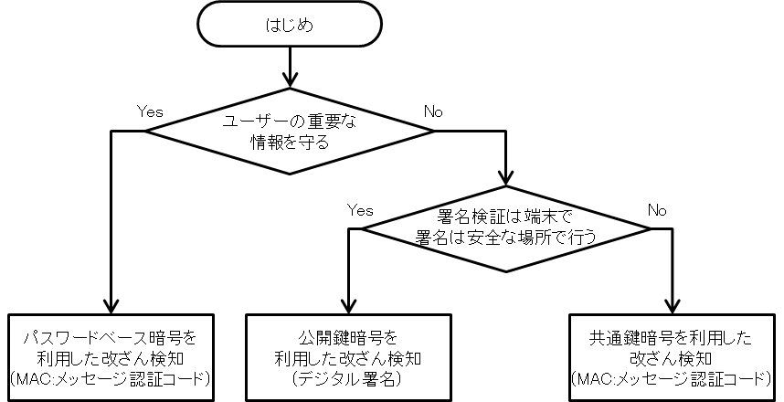{width="5.642125984251969in"
height="3.719685039370079in"}

[[]{#_Ref389469773 .anchor}]{#_Ref389469717 .anchor}図
5.6‑4　暗号鍵が存在する場所と保護方針

また、鍵によって守る資産の資産分類やオーナーによる保護方針の違いを表にまとめておく。資産レベルについては「3.1.3　資産分類と保護施策」を参照すること。

表 5.6‑7　資産分類と保護方針

  ---------------------------------------------------------------------------------------------------------------------------------------------------------------------------------------------------------
  **資産のオーナー**         > **端末のユーザー**                                                                **アプリ・サービス提供者**
  -------------------------- ----------------------------------------------------------------------------------- -------------------------------- -------------------------- ------------------------------
  **資産レベル**             > **高位**                                                                          > **中低位**                     **高位**                   **中低位**

  > **鍵の保存場所**         **保護方針**

  > **ユーザーの記憶**       > パスワードの強度の向上                                                            ユーザーパスワードの利用不可

  > **アプリディレクトリ**   > 鍵データの暗号化・難読化                                                          > アプリ以外からの読み書き禁止   鍵データの暗号化・難読化   アプリ以外からの読み書き禁止
  >                                                                                                                                                                          
  > **(非公開ストレージ)**                                                                                                                                                   

  > **APKファイル**          > 鍵データの難読化
                             >
                             > ※ProguardなどJavaの難読化ツールの多くは、データ(文字)列を難読化しないことに注意

  > **SDカードなど**         > 鍵データの暗号化・難読化
  >                          
  > **(公開ストレージ)**     
  ---------------------------------------------------------------------------------------------------------------------------------------------------------------------------------------------------------

以下、鍵の存在場所ごとに保護方針の補足を示す。

##### ユーザーの記憶

この項ではパスワードベース暗号を想定している。パスワードから生成される鍵の場合は、鍵の保管場所はユーザーの記憶の中にあるため、保存場所からマルウェア等に漏洩することはない。ただし、パスワードの強度によっては簡単に鍵が再現されてしまうため、サービスへのログインパスワード等と同様にユーザーに対して一定のパスワード強度になるようにUIによって制限したり、メッセージによる注意喚起したりすることが必要となる。「5.5.2.8利用者情報を端末内のみで利用する場合、外部送信しない旨をユーザーに通知する
（推奨）」も参照すること。また、ユーザーの記憶にあるパスワードは忘れる可能性も考慮にいれておかなければならない。パスワードを忘れた場合でもデータの復元が必要な場合は、バックアップデータを端末以外の安全な場所(サーバーなど)に保存しておく必要がある。

##### アプリディレクトリ内

アプリのディレクトリ内にPrivateモードで保存した場合は他のアプリから鍵データを読み取られることはない。また、バックアップ機能をアプリで無効にした場合には、ユーザーも参照できなくなるので、アプリの資産を守る鍵をアプリディレクトリ内に保存する場合はバックアップを無効にすれば良い。

ただし、root権限を持つアプリやユーザーからも鍵を保護したい場合は、鍵データを暗号化もしくは難読化する必要がある。ユーザー資産を守る鍵を暗号化する場合にはパスワードベース暗号が利用できる。ユーザーにも秘密にしたいアプリの資産を暗号化する鍵を保護する場合には、APKファイルに鍵暗号化鍵を埋める必要があり、鍵暗号化鍵データを難読化する必要がある。

##### APKファイル内

APKファイル内に存在するデータは読み取り可能であるため、基本的には鍵のような秘匿データを含めるべきではない。鍵を含める場合は鍵データを難読化して、容易にAPKファイルから鍵データが取得されないように対策を講じる必要がある。

##### 公開ストレージ(SDカードなど)内

公開ストレージはすべてのアプリから読み取り可能なため、基本的には鍵のような秘匿データを含めるべきではない。鍵を含める場合は鍵データを暗号化・難読化して容易に鍵データが取得されないように対策する必要がある。「アプリディレクトリ内」のroot権限を持つアプリやユーザーからも鍵を保護したい場合の対策も参照すること。

##### プロセスメモリ内の鍵の扱い

Androidの持つ暗号技術を使用する場合、上図におけるアプリプロセス以外の場所で暗号化もしくは難読化されていた鍵データは暗号処理の手前で必ず復号(パスワードベース鍵の場合は生成)が必要なため、プロセスメモリ内に鍵データが生のまま存在することになる。一方、アプリプロセスのメモリは通常別のアプリから読み書きすることはできないので、資産分類が本ガイドの対象範囲であれば、特別な対策を講じる必要性は少なく安全と言える。もし、アプリの扱う資産レベルや用途からプロセスメモリ内であっても鍵データがそのまま出現してはならない場合は、鍵データ・暗号ロジックの難読化など対策が必要であるが、一般にJava層での実現は難しく、JNI層での難読化ツールを使用することになる。これらの対応は本ガイドの範囲を超えるため、セキュア設計・実装の専門家と相談して対応すること。

#### Google Play開発者サービスによるSecurity Providerの脆弱性対策

Google Play開発者サービス（バージョン5.0以降）では、Provider
Installerという仕組みが提供されており、Security
Providerの脆弱性対策に利用できる。

まず、Security Providerとは、Java Cryptography
Architecture（JCA）に基づいて各種暗号関連アルゴリズムの実装を提供するものである。Androidアプリで暗号技術を用いる際には、Cipher、Signature、Macといったクラスを通じてこのSecurity
Providerを利用できる。一般に、暗号技術関連の実装で脆弱性が明らかになったときは迅速な対応が求められる。なぜなら脆弱性が悪用された際に大きな被害に繋がる可能性があるためである。Security
Providerも暗号技術が関係するため、脆弱性への修正がいち早く反映されることが望ましい。

Security
Providerの修正を反映する方法としては端末のアップデートが一般的である。端末のアップデートによる修正の反映は、メーカーがアップデートを用意し、ユーザーが用意されたアップデートを端末に適用するといったプロセスを経て行われる。そのため、アプリから、修正を含む最新の状態のSecurity
Providerを使えるかどうかは、メーカーとユーザーの対応に左右される実態がある。それに対して、Google
Play開発者サービスのProvider
Installerを利用すると、自動更新されるSecurity
Providerを使用できるようになる。

Google Play開発者サービスのProvider Installerでは、アプリからProvider
Installerを呼び出すことで、Google Play開発者サービスが提供するSecurity
Providerを使用できるようになる。Google Play開発者サービスは、Google
Playストアを通じて自動的にアップデートされるので、Provider
Installerで提供されるSecurity
Providerも、メーカーとユーザーの対応状況に関わらず、最新の状態に更新されている。

以下に、Provider Installerを呼び出すサンプルコードを示す。

> Provider Installerを呼び出す

import com.google.android.gms.common.GooglePlayServicesUtil;

import com.google.android.gms.security.ProviderInstaller;

public class MainActivity extends Activity

implements ProviderInstaller.ProviderInstallListener {

@Override

protected void onCreate(Bundle savedInstanceState) {

super.onCreate(savedInstanceState);

ProviderInstaller.installIfNeededAsync(this, this);

setContentView(R.layout.activity\_main);

}

@Override

public void onProviderInstalled() {

// Security Providerが最新、またはインストールが済んだときに呼ばれる

}

@Override

public void onProviderInstallFailed(int errorCode, Intent
recoveryIntent) {

GoogleApiAvailability.getInstance().showErrorNotification(this,
errorCode);

}

}

指紋認証機能を利用する
----------------------

生体認証の分野では、顔、声紋をはじめ、様々な方式が研究・開発されている。中でも、指紋認証は本人を特定する方法として古くから存在しており、署名（拇印）や犯罪捜査の目的で利用されてきた。コンピューターの世界においても様々な分野で応用が進み、近年ではスマートフォンの所有者識別（主に画面ロック解除）に採用されるなど、（入力の容易さなど）利便性の高い機能としての認識が浸透しつつある。

そのような流れを受けて、Android 6.0(API Level
23)では端末に指紋認証のフレームワークが組み込まれ、アプリから指紋認証（本人確認）機能が利用できるようになった。以下に、指紋認証を使った際のセキュリティ上の注意事項を記す。

### サンプルコード

以下に、Androidの指紋認証機能をアプリから利用するためのサンプルコードを示す。

> ポイント：

1.  USE\_FINGERPRINTパーミッションを利用宣言する

&nbsp;
1.  "AndroidKeyStore" Providerからインスタンスを取得する

2.  鍵を生成するためには指紋の登録が必要である旨をユーザーに伝える

3.  鍵生成(登録)時、暗号アルゴリズムは脆弱でないもの（基準を満たすもの）を使用する

4.  鍵生成(登録)時、ユーザー(指紋)認証の要求を有効にする（認証の有効期限は設定しない）

5.  鍵を作る時点と鍵を使う時点で指紋の登録状況が変わることを前提に設計を行う

6.  暗号化するデータは、指紋認証以外の手段で復元（代替）可能なものに限る

> MainActivity.java

package
authentication.fingerprint.android.jssec.org.fingerprintauthentication;

import android.app.AlertDialog;

import android.hardware.fingerprint.FingerprintManager;

import android.os.Bundle;

import android.support.v7.app.AppCompatActivity;

import android.util.Base64;

import android.view.View;

import android.widget.Button;

import android.widget.TextView;

import java.text.SimpleDateFormat;

import java.util.Date;

import javax.crypto.BadPaddingException;

import javax.crypto.Cipher;

import javax.crypto.IllegalBlockSizeException;

public class MainActivity extends AppCompatActivity {

private FingerprintAuthentication mFingerprintAuthentication;

private static final String SENSITIVE\_DATA = "sensitive data";

@Override

protected void onCreate(Bundle savedInstanceState) {

super.onCreate(savedInstanceState);

setContentView(R.layout.activity\_main);

mFingerprintAuthentication = new FingerprintAuthentication(this);

Button button\_fingerprint\_auth = (Button)
findViewById(R.id.button\_fingerprint\_auth);

button\_fingerprint\_auth.setOnClickListener(new View.OnClickListener()
{

@Override

public void onClick(View v) {

if (!mFingerprintAuthentication.isAuthenticating()) {

if (authenticateByFingerprint()) {

showEncryptedData(null);

setAuthenticationState(true);

}

} else {

mFingerprintAuthentication.cancel();

}

}

});

}

private boolean authenticateByFingerprint() {

if (!mFingerprintAuthentication.isFingerprintHardwareDetected()) {

// 指紋センサーが端末に搭載されていない

return false;

}

if (!mFingerprintAuthentication.isFingerprintAuthAvailable()) {

// ★ポイント3★
鍵を生成するためには指紋の登録が必要である旨をユーザーに伝える

new AlertDialog.Builder(this)

.setTitle(R.string.app\_name)

.setMessage("指紋情報が登録されていません。\\n" +

"設定メニューの「セキュリティ」で指紋を登録してください。\\n" +

"指紋を登録することにより、簡単に認証することができます。")

.setPositiveButton("OK", null)

.show();

return false;

}

// 指紋認証の結果を受け取るコールバック

FingerprintManager.AuthenticationCallback callback = new
FingerprintManager.AuthenticationCallback() {

@Override

public void onAuthenticationError(int errorCode, CharSequence errString)
{

showMessage(errString, R.color.colorError);

reset();

}

@Override

public void onAuthenticationHelp(int helpCode, CharSequence helpString)
{

showMessage(helpString, R.color.colorHelp);

}

@Override

public void
onAuthenticationSucceeded(FingerprintManager.AuthenticationResult
result) {

Cipher cipher = result.getCryptoObject().getCipher();

try {

// ★ポイント7★
暗号化するデータは、指紋認証以外の手段で復元(代替)可能なものに限る

byte\[\] encrypted = cipher.doFinal(SENSITIVE\_DATA.getBytes());

showEncryptedData(encrypted);

} catch (IllegalBlockSizeException | BadPaddingException e) {

}

showMessage(getString(R.string.fingerprint\_auth\_succeeded),
R.color.colorAuthenticated);

reset();

}

@Override

public void onAuthenticationFailed() {

showMessage(getString(R.string.fingerprint\_auth\_failed),
R.color.colorError);

}

};

if (mFingerprintAuthentication.startAuthentication(callback)) {

showMessage(getString(R.string.fingerprint\_processing),
R.color.colorNormal);

return true;

}

return false;

}

private void setAuthenticationState(boolean authenticating) {

Button button = (Button) findViewById(R.id.button\_fingerprint\_auth);

button.setText(authenticating ? R.string.cancel :
R.string.authenticate);

}

private void showEncryptedData(byte\[\] encrypted) {

TextView textView = (TextView) findViewById(R.id.encryptedData);

if (encrypted != null) {

textView.setText(Base64.encodeToString(encrypted, 0));

} else {

textView.setText("");

}

}

private String getCurrentTimeString() {

long currentTimeMillis = System.currentTimeMillis();

Date date = new Date(currentTimeMillis);

SimpleDateFormat simpleDateFormat = new
SimpleDateFormat("HH:mm:ss.SSS");

return simpleDateFormat.format(date);

}

private void showMessage(CharSequence msg, int colorId) {

TextView textView = (TextView) findViewById(R.id.textView);

textView.setText(getCurrentTimeString() + " :\\n" + msg);

textView.setTextColor(getResources().getColor(colorId, null));

}

private void reset() {

setAuthenticationState(false);

}

}

> FingerprintAuthentication.java

package
authentication.fingerprint.android.jssec.org.fingerprintauthentication;

import android.app.KeyguardManager;

import android.content.Context;

import android.hardware.fingerprint.FingerprintManager;

import android.os.CancellationSignal;

import android.security.keystore.KeyGenParameterSpec;

import android.security.keystore.KeyInfo;

import android.security.keystore.KeyPermanentlyInvalidatedException;

import android.security.keystore.KeyProperties;

import java.io.IOException;

import java.security.InvalidAlgorithmParameterException;

import java.security.InvalidKeyException;

import java.security.KeyStore;

import java.security.KeyStoreException;

import java.security.NoSuchAlgorithmException;

import java.security.NoSuchProviderException;

import java.security.UnrecoverableKeyException;

import java.security.cert.CertificateException;

import java.security.spec.InvalidKeySpecException;

import javax.crypto.Cipher;

import javax.crypto.KeyGenerator;

import javax.crypto.NoSuchPaddingException;

import javax.crypto.SecretKey;

import javax.crypto.SecretKeyFactory;

public class FingerprintAuthentication {

private static final String KEY\_NAME =
"KeyForFingerprintAuthentication";

private static final String PROVIDER\_NAME = "AndroidKeyStore";

private KeyguardManager mKeyguardManager;

private FingerprintManager mFingerprintManager;

private CancellationSignal mCancellationSignal;

private KeyStore mKeyStore;

private KeyGenerator mKeyGenerator;

private Cipher mCipher;

public FingerprintAuthentication(Context context) {

mKeyguardManager = (KeyguardManager)
context.getSystemService(Context.KEYGUARD\_SERVICE);

mFingerprintManager = (FingerprintManager)
context.getSystemService(Context.FINGERPRINT\_SERVICE);

reset();

}

public boolean startAuthentication(final
FingerprintManager.AuthenticationCallback callback) {

if (!generateAndStoreKey())

return false;

if (!initializeCipherObject())

return false;

FingerprintManager.CryptoObject cryptoObject = new
FingerprintManager.CryptoObject(mCipher);

mCancellationSignal = new CancellationSignal();

// 指紋認証の結果を受け取るコールバック

FingerprintManager.AuthenticationCallback hook = new
FingerprintManager.AuthenticationCallback() {

@Override

public void onAuthenticationError(int errorCode, CharSequence errString)
{

if (callback != null) callback.onAuthenticationError(errorCode,
errString);

reset();

}

@Override

public void onAuthenticationHelp(int helpCode, CharSequence helpString)
{

if (callback != null) callback.onAuthenticationHelp(helpCode,
helpString);

}

@Override

public void
onAuthenticationSucceeded(FingerprintManager.AuthenticationResult
result) {

if (callback != null) callback.onAuthenticationSucceeded(result);

reset();

}

@Override

public void onAuthenticationFailed() {

if (callback != null) callback.onAuthenticationFailed();

}

};

// 指紋認証を実行

mFingerprintManager.authenticate(cryptoObject, mCancellationSignal, 0,
hook, null);

return true;

}

public boolean isAuthenticating() {

return mCancellationSignal != null && !mCancellationSignal.isCanceled();

}

public void cancel() {

if (mCancellationSignal != null) {

if (!mCancellationSignal.isCanceled())

mCancellationSignal.cancel();

}

}

private void reset() {

try {

// ★ポイント2★ "AndroidKeyStore" Providerからインスタンスを取得する

mKeyStore = KeyStore.getInstance(PROVIDER\_NAME);

mKeyGenerator =
KeyGenerator.getInstance(KeyProperties.KEY\_ALGORITHM\_AES,
PROVIDER\_NAME);

mCipher = Cipher.getInstance(KeyProperties.KEY\_ALGORITHM\_AES

+ "/" + KeyProperties.BLOCK\_MODE\_CBC

+ "/" + KeyProperties.ENCRYPTION\_PADDING\_PKCS7);

} catch (KeyStoreException | NoSuchPaddingException

| NoSuchAlgorithmException | NoSuchProviderException e) {

throw new RuntimeException("failed to get cipher instances", e);

}

mCancellationSignal = null;

}

public boolean isFingerprintAuthAvailable() {

return (mKeyguardManager.isKeyguardSecure()

&& mFingerprintManager.hasEnrolledFingerprints()) ? true : false;

}

public boolean isFingerprintHardwareDetected() {

return mFingerprintManager.isHardwareDetected();

}

private boolean generateAndStoreKey() {

try {

mKeyStore.load(null);

if (mKeyStore.containsAlias(KEY\_NAME))

mKeyStore.deleteEntry(KEY\_NAME);

mKeyGenerator.init(

// ★ポイント4★
鍵生成(登録)時、暗号アルゴリズムは脆弱でないもの（基準を満たすもの）を使用する

new KeyGenParameterSpec.Builder(KEY\_NAME,
KeyProperties.PURPOSE\_ENCRYPT)

.setBlockModes(KeyProperties.BLOCK\_MODE\_CBC)

.setEncryptionPaddings(KeyProperties.ENCRYPTION\_PADDING\_PKCS7)

// ★ポイント5★
鍵生成(登録)時、ユーザー(指紋)認証の要求を有効にする（認証の有効期限は設定しない）

.setUserAuthenticationRequired(true)

.build());

// 鍵を生成し、Keystore(AndroidKeyStore)に保存する

mKeyGenerator.generateKey();

return true;

} catch (IllegalStateException e) {

return false;

} catch (NoSuchAlgorithmException | InvalidAlgorithmParameterException

| CertificateException | KeyStoreException | IOException e) {

throw new RuntimeException("failed to generate a key", e);

}

}

private boolean initializeCipherObject() {

try {

mKeyStore.load(null);

SecretKey key = (SecretKey) mKeyStore.getKey(KEY\_NAME, null);

SecretKeyFactory factory =
SecretKeyFactory.getInstance(KeyProperties.KEY\_ALGORITHM\_AES,
PROVIDER\_NAME);

KeyInfo info = (KeyInfo) factory.getKeySpec(key, KeyInfo.class);

mCipher.init(Cipher.ENCRYPT\_MODE, key);

return true;

} catch (KeyPermanentlyInvalidatedException e) {

// ★ポイント6★
鍵を作る時点と鍵を使う時点で指紋の登録状況が変わることを前提に設計を行う

return false;

} catch (KeyStoreException | CertificateException |
UnrecoverableKeyException | IOException

| NoSuchAlgorithmException | InvalidKeySpecException |
NoSuchProviderException | InvalidKeyException e) {

throw new RuntimeException("failed to init Cipher", e);

}

}

}

> AndroidManifest.xml

&lt;?xml version="1.0" encoding="utf-8"?&gt;

&lt;manifest xmlns:android="http://schemas.android.com/apk/res/android"

package="authentication.fingerprint.android.jssec.org.fingerprintauthentication"
&gt;

&lt;!-- ★ポイント1★
指紋認証機能を使用するためには、USE\_FINGERPRINTパーミッションを利用宣言する
--&gt;

&lt;uses-permission android:name="android.permission.USE\_FINGERPRINT"
/&gt;

&lt;application

android:allowBackup="true"

android:icon="@mipmap/ic\_launcher"

android:label="@string/app\_name"

android:supportsRtl="true"

android:theme="@style/AppTheme" &gt;

&lt;activity

android:name=".MainActivity"

android:screenOrientation="portrait" &gt;

&lt;intent-filter&gt;

&lt;action android:name="android.intent.action.MAIN" /&gt;

&lt;category android:name="android.intent.category.LAUNCHER" /&gt;

&lt;/intent-filter&gt;

&lt;/activity&gt;

&lt;/application&gt;

&lt;/manifest&gt;

### ルールブック

指紋認証機能を利用する場合には以下のルールを守ること。

1.  鍵生成(登録)時、暗号アルゴリズムは脆弱でないもの（基準を満たすもの）を使用する
    > （必須）

&nbsp;
1.  暗号化するデータは、指紋認証以外の手段で復元（代替）可能なものに限る
    > （必須）

2.  鍵を生成するためには指紋の登録が必要であり、ユーザーにその旨を伝える
    > （推奨）

#### 鍵生成(登録)時、暗号アルゴリズムは脆弱でないもの（基準を満たすもの）を使用する （必須）

「5.6　暗号技術を利用する」で解説したパスワード鍵や公開鍵等と同様に、指紋認証機能を用いて鍵を生成する場合においても、第三者による盗聴を防ぐため一定の基準を満たした脆弱でない暗号アルゴリズムを設定すること。また、暗号アルゴリズムだけではなく、暗号モードやパディングについても脆弱でない安全な方式を選択すること。

暗号アルゴリズムの選択については「5.6.2.2　脆弱でないアルゴリズム（基準を満たすもの）を使用する
（必須）」を参照すること。

#### 暗号化するデータは、指紋認証以外の手段で復元（代替）可能なものに限る （必須）

アプリ内データの暗号化に際して指紋認証機能を利用する場合は、そのデータが指紋認証機能以外の手段でも復元（代替）できるようにアプリを設計すること。一般に、生体情報には秘匿や変更の困難性、誤認識といった問題が付随しているため、認証を生体情報のみに頼ることは避けるべきである。

例えば、指紋認証機能を利用して生成した鍵を用いてアプリ内のデータを暗号化した後、端末に登録されていた指紋情報がユーザーによって削除されると、データの暗号化に用いていた鍵が使用できなくなり、データを復号することもできなくなる。データの復元が指紋認証機能以外の手段でも行えなければ、可用性が損なわれる可能性が生じるのである。

また、指紋認証機能を利用して生成した鍵が使用できなくなる状況は指紋情報の削除以外でも生じうる。Nexus5Xにおいては、指紋認証機能を利用して鍵を生成した後に新たに指紋情報を追加登録すると、それ以前に生成した鍵が使用できなくなることが確認されている[^34]。また、本来正しく使用できるべき鍵が指紋センサーの誤認識により使用できなくなる可能性も否定できない。

#### 鍵を生成するためには指紋の登録が必要であり、ユーザーにその旨を伝える （推奨）

指紋認証機能を利用して鍵を生成するためには端末にユーザーの指紋が登録されている必要がある。指紋登録ユーザーに促すため、設定メニューへ誘導する際には、指紋が重要な個人情報であることに留意し、ユーザーに対してアプリが指紋を利用する必要性や利便性について説明することが望ましい。

> 指紋認証の登録が必要である旨、ユーザーに伝える

if (!mFingerprintAuthentication.isFingerprintAuthAvailable()) {

// ★ポイント★
鍵を生成するためには指紋の登録が必要である旨をユーザーに伝える

new AlertDialog.Builder(this)

.setTitle(R.string.app\_name)

.setMessage("指紋情報が登録されていません。\\n" +

"設定メニューの「セキュリティ」で指紋を登録してください。\\n" +

"指紋を登録することにより、簡単に認証することができます。")

.setPositiveButton("OK", null)

.show();

return false;

}

### アドバンスト

#### Androidアプリにおける指紋認証機能利用の前提条件

アプリで指紋認証機能を利用するためには以下の2点が必要である。

-   端末にユーザーの指紋が登録されていること

-   登録された指紋に（アプリ固有の）鍵が紐づいていること

##### ユーザーの指紋登録

ユーザーの指紋情報は設定メニューの「セキュリティ」からしか登録することができず、一般のアプリが指紋登録処理を行うことはできない。そのため、アプリが指紋認証機能を利用する時点で端末に指紋が登録されていなければ、ユーザーを設定メニューに誘導し指紋の登録を促す必要がある。その際、アプリが指紋を利用する必要性や利便性についての説明がユーザーに対して行われることが望ましい。

なお、指紋登録が可能となる前提として、端末に予備の画面ロック方式が設定されていることが必要である。端末に指紋が登録されている状態で画面ロックを無効にすると、登録済みの指紋情報も削除される。

##### 鍵の生成・登録

端末に登録された指紋と鍵を紐付けるためには、"AndroidKeyStore"
Providerが提供するKeyGeneratorやKeyStoreインスタンス等を使用する際に、ユーザー（指紋）認証の要求を有効にして、新しい鍵の生成と登録、あるいは既存の鍵の登録を行う。

指紋情報と紐づいた鍵を生成する場合は、KeyGeneratorを生成する際のパラメータとして、ユーザー認証の要求を有効にするよう設定する。

> 指紋情報と紐づいた鍵の生成と登録

try {

// "AndroidKeyStore" ProviderからKeyGeneratorインスタンスを取得する

KeyGenerator keyGenerator =
KeyGenerator.getInstance(KeyProperties.KEY\_ALGORITHM\_AES,
"AndroidKeyStore");

keyGenerator.init(

new KeyGenParameterSpec.Builder(KEY\_NAME,
KeyProperties.PURPOSE\_ENCRYPT)

.setBlockModes(KeyProperties.BLOCK\_MODE\_CBC)

.setEncryptionPaddings(KeyProperties.ENCRYPTION\_PADDING\_PKCS7)

.setUserAuthenticationRequired(true) //
ユーザー（指紋）認証の要求を有効にする

.build());

keyGenerator.generateKey();

} catch (IllegalStateException e) {

// 端末に指紋が登録されていない

throw new RuntimeException(“No fingerprint registered”, e);

} catch (NoSuchAlgorithmException | InvalidAlgorithmParameterException

| CertificateException | KeyStoreException | IOException e) {

// 鍵の生成に失敗

throw new RuntimeException("Failed to generate a key", e);

}

既存の鍵に指紋情報を紐づける場合は、ユーザー認証の要求を有効にする設定を加えたKeyStoreエントリーに鍵を登録する。

> 既存の鍵に指紋情報を紐付ける

SecretKey key = …; // 既存の鍵

KeyStore keyStore = KeyStore.getInstance(“AndroidKeyStore”);

keyStore.load(null);

keyStore.setEntry(

"alias\_for\_the\_key",

new KeyStore.SecretKeyEntry(key),

new KeyProtection.Builder(KeyProperties.PURPOSE\_ENCRYPT)

.setUserAuthenticationRequired(true) //
ユーザー（指紋）認証の要求を有効にする

.build());

難しい問題
==========

AndroidにはOSの仕様やOSが提供する機能の仕様上、アプリの実装でセキュリティを担保するのが困難な問題が存在する。これらの機能は悪意を持った第三者に悪用されたり、ユーザーが注意せずに利用したりすることで、情報漏洩を始めセキュリティ上の問題に繋がってしまう危険性を常に抱えている。この章ではそのような機能に対して、開発者が取りうるリスク削減策などを提示しながら注意喚起が必要な話題を記事として取り上げる。

Clipboardから情報漏洩する危険性
-------------------------------

コピー＆ペーストはユーザーが普段から何気なく使っている機能であろう。例えば、この機能を使って、メールやWebページで気になった情報や忘れたら困る情報をメモ帳に残しておいたり、設定したパスワードを忘れないようにメモ帳に保存しておき、必要な時にコピー＆ペーストして使うというユーザーは少なからず存在する。これらは一見何気ない行為であるが、実はユーザーの扱う情報が盗まれるという危険が潜んでいる。

これにはAndroidのコピー＆ペーストの仕組みが関係している。ユーザーやアプリによってコピーされた情報は、一旦Clipboardと呼ばれるバッファに格納される。ユーザーやアプリによってペーストされたときに、このClipboardの内容が各アプリに再配布されるわけである。このClipboardに情報漏洩に結び付く危険性がある。Android端末の仕様では、Clipboardの実体は端末に1つであり、ClipboardManagerを利用することで、どのアプリからでも常時Clipboardの中身が取得できるようになっているからである。このことは、ユーザーがコピー・カットした情報は全て悪意あるアプリに対して筒抜けになることを意味している。

よって、アプリ開発者は、このAndroidの仕様を考慮しながら情報漏洩の可能性を最小限に抑える対策を講じなくてはならない。

### サンプルコード

Clipboardから情報漏洩する可能性を抑える対策には、大きく分けて次の2つが考えられる。

(1) 他アプリから自アプリへコピーする際の対策

(2) 自アプリから他アプリへコピーする際の対策

最初に、1.について説明する。ここでは、ユーザーがメモ帳やWebブラウザ、メーラーアプリなど他アプリから文字列をコピーし、それを自アプリのEditTextに貼り付けるシナリオを想定している。結論だけを言ってしまうと、このシナリオでコピー・カットによってセンシティブな情報が漏洩してしまうことを防ぐ根本的な対策は存在しない。第三者アプリのコピー機能を制御するような機能がAndroidにはないからだ。

よって、1.についてはセンシティブな情報をコピー・カットする危険性をユーザーに説明し、行為自体を減らしていく啓発活動を継続的に行っていくしか対策はない。

次に、2.を説明する。ここでは、自アプリが表示している情報がユーザーによってコピーされるシナリオを想定する。この場合、漏洩に対する確実な対策は、View(TextView,
EditTextなど)からのコピー・カットを禁止にすることである。個人情報などセンシティブな情報が入力あるいは出力されるViewにコピー・カット機能がなければ、自アプリからのClipboardを介した情報の漏洩もないからだ。

コピー・カットを禁止する方法はいくつか考えられるが、ここでは、実装が簡単でかつ効果のある方法として、Viewの長押し無効化の方法と文字列選択時のメニューからコピー・カットの項目を削除する方法を扱う。

対策要否は、図 6.1‑1の判定フローによって判定することができる。図
6.1‑1において、入力タイプ(Input
Type)がPassword属性に固定されているとは、入力タイプ(Input
Type)がアプリの実行時に常に下記のいずれかであることを指す。この場合は、デフォルトでコピー・カットが禁止されているので、特に対策する必要はない。

-   InputType.TYPE\_CLASS\_TEXT |
    InputType.TYPE\_TEXT\_VARIATION\_PASSWORD

-   InputType.TYPE\_CLASS\_TEXT |
    InputType.TYPE\_TEXT\_VARIATION\_WEB\_PASSWORD

-   InputType.TYPE\_CLASS\_NUMBER |
    InputType.TYPE\_NUMBER\_VARIATION\_PASSWORD

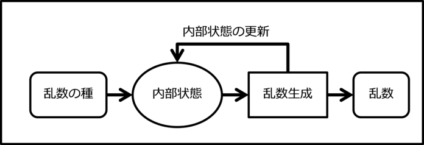{width="3.9358267716535433in"
height="3.6429133858267715in"}

[[]{#_Ref350183803 .anchor}]{#_Ref350183809 .anchor}図
6.1‑1対策要否の判定フロー

以下で、それぞれの対策の詳細を説明し、サンプルコードを示す。

#### 文字列選択時のメニューからコピー・カットを削除する

TextView.setCustomSelectionActionModeCallback()メソッドによって、文字列選択時のメニューをカスタマイズできる。これを用いて、文字列選択時のメニューからコピー・カットのアイテムを削除すれば、ユーザーが文字列をコピー・カットすることはできなくなる。

以下、EditTextの文字列選択時のメニューからコピー・カットの項目を削除するサンプルコードを示す。

> ポイント：

1.  文字列選択時のメニューからandroid.R.id.copyを削除する。

&nbsp;
1.  文字列選択時のメニューからandroid.R.id.cutを削除する。

> UncopyableActivity.java

package org.jssec.android.clipboard.leakage;

import android.app.Activity;

import android.os.Bundle;

import android.support.v4.app.NavUtils;

import android.view.ActionMode;

import android.view.Menu;

import android.view.MenuItem;

import android.widget.EditText;

public class UncopyableActivity extends Activity {

private EditText copyableEdit;

private EditText uncopyableEdit;

@Override

public void onCreate(Bundle savedInstanceState) {

super.onCreate(savedInstanceState);

setContentView(R.layout.uncopyable);

copyableEdit = (EditText) findViewById(R.id.copyable\_edit);

uncopyableEdit = (EditText) findViewById(R.id.uncopyable\_edit);

// setCustomSelectionActionModeCallbackメソッドにより、

// 文字列選択時のメニューをカスタマイズすることができる。

uncopyableEdit.setCustomSelectionActionModeCallback(actionModeCallback);

}

private ActionMode.Callback actionModeCallback = new
ActionMode.Callback() {

public boolean onPrepareActionMode(ActionMode mode, Menu menu) {

return false;

}

public void onDestroyActionMode(ActionMode mode) {

}

public boolean onCreateActionMode(ActionMode mode, Menu menu) {

// ★ポイント1★ 文字列選択時のメニューからandroid.R.id.copyを削除する。

MenuItem itemCopy = menu.findItem(android.R.id.copy);

if (itemCopy != null) {

menu.removeItem(android.R.id.copy);

}

// ★ポイント2★ 文字列選択時のメニューからandroid.R.id.cut削除する。

MenuItem itemCut = menu.findItem(android.R.id.cut);

if (itemCut != null) {

menu.removeItem(android.R.id.cut);

}

return true;

}

public boolean onActionItemClicked(ActionMode mode, MenuItem item) {

return false;

}

};

@Override

public boolean onCreateOptionsMenu(Menu menu) {

getMenuInflater().inflate(R.menu.uncopyable, menu);

return true;

}

@Override

public boolean onOptionsItemSelected(MenuItem item) {

switch (item.getItemId()) {

case android.R.id.home:

NavUtils.navigateUpFromSameTask(this);

return true;

}

return super.onOptionsItemSelected(item);

}

}

#### Viewの長押し(Long Click)を無効にする

コピー・カットを禁止する方法は、Viewの長押し(Long
Click)を無効にすることでも実現できる。Viewの長押し無効化はレイアウトのxmlファイルで指定することができる。

> ポイント：

1.  コピー･カットを禁止するViewはandroid:longClickableをfalseにする。

> unlongclickable.xml

&lt;LinearLayout
xmlns:android="http://schemas.android.com/apk/res/android"

xmlns:tools="http://schemas.android.com/tools"

android:layout\_width="match\_parent"

android:layout\_height="match\_parent"

android:orientation="vertical"&gt;

&lt;TextView

android:layout\_width="match\_parent"

android:layout\_height="wrap\_content"

android:text="@string/unlongclickable\_description" /&gt;

&lt;!-- コピー・カットを禁止するEditText --&gt;

&lt;!-- ★ポイント1★
コピー・カットを禁止するViewはandroid:longClickableをfalseにする。
--&gt;

&lt;EditText

android:layout\_width="match\_parent"

android:layout\_height="wrap\_content"

android:longClickable="false"

android:hint="@string/unlongclickable\_hint" /&gt;

&lt;/LinearLayout&gt;

### ルールブック

自アプリから他アプリへのセンシティブな情報のコピーが発生する可能性がある場合は、以下のルールを守ること。

1.  Viewに表示されている文字列のコピー・カットを無効にする (必須)

#### Viewに表示されている文字列のコピー・カットを無効にする (必須)

アプリがセンシティブな情報を表示するViewを持っている場合、それがEditTextのようにコピー・カットが可能なViewならば、Clipboardを介してその情報が漏洩してしまう可能性がある。そのため、センシティブな情報を表示するViewはコピー・カットを無効にしておかなければならない。

コピー・カットを無効にする方法には、文字列選択時のメニューからコピー・カットの項目を削除する方法と、Viewの長押しを無効化する方法がある。

「6.1.3.1 ルール適用の際の注意」も参照のこと。

### アドバンスト

#### ルール適用の際の注意

TextViewはデフォルトでは文字列選択不可であるため、通常は対策不要であるが、アプリの仕様によってはコピーを可能にする場合もある。TextView.setTextIsSelectable()メソッドを使うことで、文字列の選択可否とコピー可否を動的に設定することができる。TextViewをコピー可能とする場合は、そのTextViewにセンシティブな情報が表示される可能性がないかよく検討し、その可能性があるのであれば、コピー可にすべきでない。

また、「6.1.1
サンプルコード」の判定フローにも記載されているように、パスワードの入力を想定した入力タイプ(InputType.TYPE\_CLASS\_TEXT
|
InputType.TYPE\_TEXT\_VARIATION\_PASSWORDなど)のEditTextについては、デフォルトで文字列のコピーが禁止されているため通常は対策不要である。しかし、「5.1.2.2.
パスワードを平文表示するオプションを用意する
（必須）」に記載したように「パスワードを平文表示する」オプションを用意している場合は、パスワード平文表示の際に入力タイプが変化し、コピー・カットが有効になってしまうので、同様の対策が必要である。

なお、ルールを適用する際には、ユーザビリティの面も考慮する必要があるだろう。例えば、ユーザーが自由にテキストを入力できるViewの場合、センシティブな情報が入力される「可能性がゼロでない」からといってコピー・カットを無効にしてしまったら、ユーザーの使い勝手が悪くなるだろう。もちろん、重要度の高い情報を入出力するViewやセンシティブな情報を単独で入力するようなViewにはルールを無条件で適用するべきであるが、それ以外のViewを扱う場合は、次のことを考慮しながら対応を考えると良い。

-   センシティブな情報の入力や表示を行う専用のコンポーネントを用意できないか

-   連携先(ペースト先)アプリが分かっている場合は、他の方法で情報を送信できないか

-   アプリでユーザーに入出力に関する注意喚起ができないか

-   本当にそのViewが必要か

Android
OSのClipboardとClipboardManagerの仕様にセキュリティに対する考慮がされていないことが情報漏洩の可能性を生む根本的な要因ではあるが、アプリ開発者は、ユーザー保護やユーザビリティ、提供する機能など様々な観点からこうしたClipboardの仕様に対して対応し、質の高いアプリを作成する必要がある。

#### Clipboardに格納されている情報の操作

> 「6.1
> Clipboardから情報漏洩する危険性」で述べたように、ClipboardManagerを利用することでアプリからClipboardに格納された情報を操作することができる。また、ClipboardManagerの利用には特別なPermissionを設定する必要が無いため、アプリはユーザーに知られることなくClipboardManagerを利用できる。
>
> Clipboardに格納されている情報(ClipDataと呼ぶ)は、ClipboardManager.getPrimaryClip()メソッドによって取得できる。タイミングに関しても、OnPrimaryClipChangedListenerを実装してClipboardManager.addPrimaryClipChangedListener()メソッドでClipboardManagerに登録すれば、ユーザーの操作などにより発生するコピー・カットの度にListenerが呼び出されるので、タイミングを逃すことなくClipDataを取得することができる。ここでListenerの呼び出しは、どのアプリでコピー・カットが発生したかに関係なく行われる。

以下、端末内でコピー・カットが発生する度にClipDataを取得し、Toastで表示するServiceのソースコードを示す。下記のような簡単なコードによりClipboardに格納された情報が筒抜けになってしまうことを実感していただきたい。アプリを実装する際は、少なくとも下記のコードによってセンシティブな情報が取得されてしまうことのないように注意する必要がある。

> ClipboardListeningService.java

package org.jssec.android.clipboard;

import android.app.Service;

import android.content.ClipData;

import android.content.ClipboardManager;

import android.content.ClipboardManager.OnPrimaryClipChangedListener;

import android.content.Context;

import android.content.Intent;

import android.os.IBinder;

import android.util.Log;

import android.widget.Toast;

public class ClipboardListeningService extends Service {

private static final String TAG = "ClipboardListeningService";

private ClipboardManager mClipboardManager;

@Override

public IBinder onBind(Intent arg0) {

return null;

}

@Override

public void onCreate() {

super.onCreate();

mClipboardManager = (ClipboardManager)
getSystemService(Context.CLIPBOARD\_SERVICE);

if (mClipboardManager != null) {

mClipboardManager.addPrimaryClipChangedListener(clipListener);

} else {

Log.e(TAG,
"ClipboardServiceの取得に失敗しました。サービスを終了します。");

this.stopSelf();

}

}

@Override

public void onDestroy() {

super.onDestroy();

if (mClipboardManager != null) {

mClipboardManager.removePrimaryClipChangedListener(clipListener);

}

}

private OnPrimaryClipChangedListener clipListener = new
OnPrimaryClipChangedListener() {

public void onPrimaryClipChanged() {

if (mClipboardManager != null && mClipboardManager.hasPrimaryClip()) {

ClipData data = mClipboardManager.getPrimaryClip();

ClipData.Item item = data.getItemAt(0);

Toast

.makeText(

getApplicationContext(),

"コピーあるいはカットされた文字列:\\n"

+ item.coerceToText(getApplicationContext()),

Toast.LENGTH\_SHORT)

.show();

}

}

};

}

次に、上記ClipboardListeningServiceを利用するActivityのソースコードの例を示す。

> ClipboardListeningActivity.java

package org.jssec.android.clipboard;

import android.app.Activity;

import android.content.ComponentName;

import android.content.Intent;

import android.os.Bundle;

import android.util.Log;

import android.view.View;

import android.widget.Toast;

public class ClipboardListeningActivity extends Activity {

private static final String TAG = "ClipboardListeningActivity";

@Override

public void onCreate(Bundle savedInstanceState) {

super.onCreate(savedInstanceState);

setContentView(R.layout.activity\_clipboard\_listening);

}

public void onClickStartService(View view) {

if (view.getId() != R.id.start\_service\_button) {

Log.w(TAG, "View IDが不正です");

} else {

ComponentName cn = startService(

new Intent(ClipboardListeningActivity.this,
ClipboardListeningService.class));

if (cn == null) {

Log.e(TAG, "サービスの起動に失敗しました");

Toast.makeText(this, "サービスの起動に失敗しました",
Toast.LENGTH\_SHORT).show();

}

}

}

public void onClickStopService(View view) {

if (view.getId() != R.id.stop\_service\_button) {

Log.w(TAG, "View IDが不正です");

} else {

stopService(new Intent(ClipboardListeningActivity.this,
ClipboardListeningService.class));

}

}

}

ここまでは、Clipboardに格納された情報を取得する方法について述べたが、ClipboardManager.setPrimaryClip()メソッドによって、Clipboardに新しく情報を格納することも可能である。

ただし、setPrimaryClip()はClipboardに格納されていた情報を上書きするので、ユーザーが予めコピー・カット操作により格納しておいた情報が失われる可能性がある点に注意が必要である。これらのメソッドを使用して独自のコピー機能あるいはカット機能を提供する場合は、必要に応じて、内容が改変される旨を警告するダイアログを表示するなど、Clipboardに格納されている内容がユーザーの意図しない内容に変更されることのないように設計・実装する必要がある。

[^1]: ただし、ポイント1, 2,
    6を遵守している場合を除いてはIntentが第三者に読み取られるおそれがあることに注意する必要がある。詳細はルールブックセクションの4.1.2.2、4.1.2.3を参照すること。

[^2]: 江川、藤井、麻野、藤田、山田、山岡、佐野、竹端著「Google Android
    プログラミング入門」 (アスキー・メディアワークス、2009年7月)

[^3]: [*http://developer.android.com/guide/components/tasks-and-back-stack.html*](http://developer.android.com/guide/components/tasks-and-back-stack.html)

[^4]: intent-filterが定義されていれば公開Activity、定義されていなければ非公開Activityとなる。
    https://developer.android.com/guide/topics/manifest/activity-element.html\#exported
    を参照のこと。

[^5]: Fragment Injectionの詳細は以下のURLを参照のこと

    https://securityintelligence.com/new-vulnerability-android-framework-fragment-injection/

[^6]: intent-filterが定義されていれば公開Receiver、定義されていなければ非公開Receiverとなる。
    https://developer.android.com/guide/topics/manifest/receiver-element.html\#exported
    を参照のこと。

[^7]: Android
    3.0未満ではアプリのインストールをしただけでReceiverが登録される

[^8]: ただし、Content Providerの非公開設定はAndroid 2.2 (API Level 8)
    以前では機能しない。

[^9]: intent-filterが定義されていれば公開Service、定義されていなければ非公開Serviceとなる。
    https://developer.android.com/guide/topics/manifest/service-element.html\#exported
    を参照のこと。

[^10]: ファイルの配置に関しては、SQLiteOpenHelperのコンストラクタの第2引数（name）にファイルの絶対パスも指定できる。そのため、誤ってSDカードを直接指定した場合には他のアプリからの読み書きが可能になるので注意が必要である。

[^11]: どちらのメソッドも該当するアプリだけが読み書き権限を与えられ、他のアプリからはアクセスができないディレクトリ（パッケージディレクトリ）のサブディレクトリ以下のパスが取得できる。

[^12]: （ドキュメントに記述はないが）SQLiteOpenHelper
    の実装ではDBの名前にはファイルのフルパスを指定できるので、SDカードなどアクセス権の設定できない場所のパスが意図せず入力されないように注意が必要である。

[^13]: MODE\_WORLD\_READABLEおよびMODE\_WORLD\_WRITEABLEの性質と注意点については、「4.6.3.2
    ディレクトリのアクセス権設定」を参照

[^14]: getReableDatabase
    は基本的にはgetWritableDatabaseで取得するのと同じオブジェクトを返す。ディスクフルなどの状況で書き込み可能オブジェクトを生成できない場合にリードオンリーのオブジェクトを返すという仕様である（getWritableDatabaseはディスクフルなどの状況では実行エラーとなる）。

[^15]: MODE\_WORLD\_READABLEおよびMODE\_WORLD\_WRITEABLEは API Level17
    以降ではdeprecated となっており、API Level 24
    以降ではセキュリティ例外が発生するため使用できなくなっている。

[^16]: 内部ストレージから外部記憶装置(SDカードなど)への移動などマウントポイントを超えた移動はできない。そのため、読み取り権限のない内部ストレージファイルが外部記憶装置に移動されて読み書き可能になるようなことはない。

[^17]: LogCat に出力されたログ情報は、READ\_LOGS
    Permissionを利用宣言したアプリであれば読み取り可能である。ただしAndroid
    4.1 以降ではLogCat
    に出力された他のアプリのログ情報は読み取り不可となった。また、スマートフォンユーザーであれば、ADB
    経由でLogCat のログ情報を参照することも可能である。

[^18]: http://developer.android.com/intl/ja/reference/android/util/Log.html

[^19]: 前述のサンプルコードを、条件式にBuildConfig.DEBUGを用いたif文で囲った。Log.d()呼び出し前のif文は不要であるが、前述のサンプルコードと対比させるため、そのまま残した。

[^20]: 厳密に言えば安全性を保証できるコンテンツであればJavaScriptを有効にしてよい。自社管理のコンテンツであれば自社の努力で安全性を確保できるし責任も取れる。では信頼できる提携会社のコンテンツは安全だろうか？これは会社間の信頼関係により決まる。信頼できる提携会社のコンテンツを安全であると信頼してJavaScriptを有効にしてもよいが、万一の場合は自社責任も伴うため、ビジネス責任者の判断が必要となる。

[^21]: http://www.w3.org/TR/webmessaging/

[^22]: オリジンとは、URLのスキーム、ホスト名、ポート番号の組み合わせのこと。詳細な定義は[*http://tools.ietf.org/html/rfc6454*](http://tools.ietf.org/html/rfc6454)を参照。

[^23]: Uri.EMPTYおよびUri.parse("")がワイルドカードとして機能する(2016年9月1日版執筆時)

[^24]: Android 6.0(API Level
    23)以降では、ユーザー確認と権限の付与はインストール時に行われず、アプリの実行中に権限の利用を要求する仕様に変更された。詳細は「5.2.1.4
    Android 6.0以降でDangerous Permissionを利用する方法」および「5.2.3.6
    Android
    6.0以降のPermissionモデルの仕様変更について」を参照すること。

[^25]: Normal/Dangerous
    Permissionを利用する場合には、Permissionが未定義のまま利用側アプリが先にインストールされると、利用側アプリへの権限の付与が行われず、提供側アプリがインストールされた後もアクセスができない

[^26]: Normal PermissionおよびSignature PermissionはAndroid
    OSにより自動的に付与されるため、ユーザー確認を行う必要はない。

[^27]: この場合も、アプリによるandroid.permission.READ\_CALENDARとandroid.permission.WRITE\_CALENDARの利用宣言はともに必要である。

[^28]: Account
    Managerはオンラインサービスとの同期の仕組みも提供するが、本節では扱っていない。

[^29]: 中間者攻撃については次のページを参照。[*http://www.ipa.go.jp/about/press/20140919\_1.html*](http://www.ipa.go.jp/about/press/20140919_1.html)

[^30]: この危険性については以下の記事で詳しく説明されている

    [*https://www.cigital.com/blog/ineffective-certificate-pinning-implementations/*](https://www.cigital.com/blog/ineffective-certificate-pinning-implementations/)

[^31]: Network Security Configurationの詳細については以下を参照すること
    https://developer.android.com/training/articles/security-config.html

[^32]: HTTP以外の通信方式に対してどのような制御が行われるかについては、以下を参照すること
    https://developer.android.com/reference/android/security/NetworkSecurityPolicy.html\#isCleartextTrafficPermitted()

[^33]: http://www.kddilabs.jp/tech/public-tech/appgen.html

[^34]: 2016年9月1日版執筆時点の情報。後日、修正される可能性がある。
