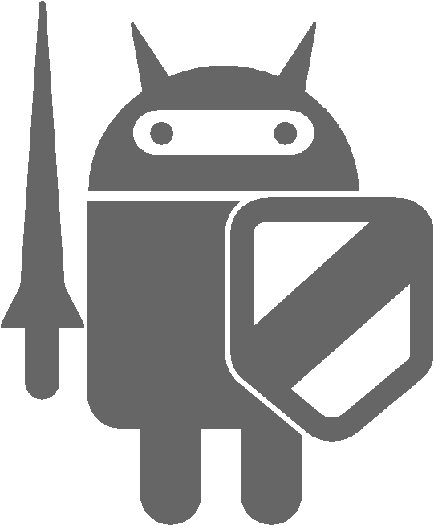

.. Secure Coding Guide documentation master file, created by
   sphinx-quickstart on Thu Oct 19 15:21:07 2017.
   You can adapt this file completely to your liking, but it should at least
   contain the root `toctree` directive.

Androidアプリのセキュア設計・セキュアコーディングガイド
=======================================================

| **2018年2月1日版**
| **一般社団法人日本スマートフォンセキュリティ協会（JSSEC）**
| **セキュアコーディングWG**
| 

※ 本ガイドの内容は執筆時点のものです。サンプルコードを使用する場合はこの点にあらかじめご注意ください。

※ JSSECならびに執筆関係者は、このガイド文書に関するいかなる責任も負うものではありません。全ては自己責任にてご活用ください。

※ Android™は、Google, Inc.の商標または登録商標です。また、本文書に登場する会社名、製品名、サービス名は、一般に各社の登録商標または商標です。本文中では®、TM、© マークは明記していません。

※ この文書の内容の一部は、Google, Inc.が作成、提供しているコンテンツをベースに複製したもので、クリエイティブ・コモンズの表示 3.0 ライセンスに記載の条件に従って使用しています。

Androidアプリのセキュア設計・セキュアコーディングガイド
-------------------------------------------------------

.. image:: media/image4.png
   :width: 0.8131944444444444in
   :height: 0.9840277777777777in
   :align: right

| 【ベータ版】
| 2018年2月1日
| 
| 一般社団法人日本スマートフォンセキュリティ協会
| セキュアコーディングWG
| 

.. toctree::
   :numbered: 4
   :maxdepth: 2
   :caption: 目次:

   1_introduction
   2_composition_of_the_guidebook
   3_basic_knowledge_of_secure_design_and_secure_coding
   4_using_technology_in_a_safe_way
   5_how_to_use_security_functions
   6_difficult_problems

Indices and tables
==================

* :ref:`genindex`
* :ref:`modindex`
* :ref:`search`

更新履歴
========

2012-06-01
    初版
2012-11-01
    下記の構成・内容を見直し拡充致しました
        - 4.1 Activityを作る・利用する
        - 4.2 Broadcastを受信する・送信する
        - 4.3 Content Providerを作る・利用する
        - 4.4 Serviceを作る・利用する
        - 5.2 PermissionとProtection Level
    下記の新しい記事を追加致しました
        - 2.5 サンプルコードのAndroid Studioへの取り込み手順
        - 3.1 Androidアプリのセキュリティ
        - 4.7 Browsable Intentを利用する
        - 5.3 Account Managerに独自アカウントを追加する
        - 6.1 Clipboardから情報漏洩する危険性
2013-04-01
    下記の記事の内容を見直し書き直しました
        - 5.3 Account Managerに独自アカウントを追加する
    下記の新しい記事を追加致しました
        - 4.8 LogCatにログ出力する
        - 5.4 HTTPSで通信する
        - 4.9 WebViewを使う
2014-07-01
    下記の新しい記事を追加致しました
        - 5.5 プライバシー情報を扱う
        - 5.6 暗号技術を利用する
2015-06-01
    下記の方針で本書全体の内容を見直し書き直しました
        - 開発環境の変更(Eclipse -> Android Studio)
        - Android最新版Lollipopへの対応
        - 対応するAPI Levelの見直し(8以降 -> 15以降)
2016-02-01
    下記の新しい記事を追加致しました
        - 4.10 Notificationを使用する
        - 5.7 指紋認証機能を利用する
    下記の構成・内容を見直し拡充致しました
        - 5.2 PermissionとProtection Level
2016-09-01
    下記の構成・内容を見直し拡充致しました
        - 2.5 サンプルコードのAndroid Studioへの取り込み手順
        - 5.4 HTTPSで通信する
        - 5.6 暗号技術を利用する
2017-02-01
    下記の新しい記事を追加致しました
        - 5.4.3.7 Network Security Configuration
        - 4.6.3.5 Android 7.0（API Level 24）における外部ストレージの特定ディレクトリへのアクセスに関する仕様変更について
    下記の構成・内容を見直し拡充致しました
        - 4.1 Activityを作る・利用する
        - 4.2 Broadcastを受信する・送信する
        - 4.4 Serviceを作る・利用する
        - 4.5 SQLiteを使う
        - 4.6 ファイルを扱う
    下記の記事を削除致しました
        - 4.8.3.4 BuildConfig.DEBUG はADT 21 以降で使う
    下記の方針で本書全体の内容を見直し書き直しました
        - Android 4.0.3（API Level 15）未満に関する本文中の記述を削除または脚注へ移動
2018-02-01
    下記の新しい記事を追加致しました
        - 4.1.3.7 Autofillフレームワークについて
        - 5.3.3.3 Android 8.0（API Level 26）以降で署名の一致しないAuthenticatorのアカウントを読めるケース
        - 5.4.3.8 （コラム）　セキュア接続のTLS1.2への移行について
        - 5.5.3.3 Android IDのバージョンによる違いについて
    下記の構成・内容を見直し拡充致しました
        - 4.2 Broadcastを受信する・送信する
        - 5.2 PermissionとProtection Level
        - 5.3 Account Managerに独自アカウントを追加する
        - 5.4 HTTPSで通信する
        - 5.5 プライバシー情報を扱う

    ※ 改訂内容の詳細については「1.4 2017年2月1日版からの訂正記事について」を参照して下さい。

新版の公開にあたり、皆様から頂いたご意見・コメントを元に本ガイドの内容を更新しました。

制作
----

一般社団法人 日本スマートフォンセキュリティ協会 技術部会 セキュアコーディングWG

+----------+-------------+---------------------------------------------------------+
| リーダー | 安藤 彰     | ソニーデジタルネットワークアプリケーションズ株式会社    |
+----------+-------------+---------------------------------------------------------+
| メンバー | 奥山 謙     | Androidセキュリティ部                                   |
+----------+-------------+---------------------------------------------------------+
|          | 星本 英史   | 株式会社SRA                                             |
+----------+-------------+---------------------------------------------------------+
|          | 武井 滋紀   | エヌ・ティ・ティ・ソフトウェア株式会社                  |
+----------+-------------+---------------------------------------------------------+
|          | 塩田 明弘   | 株式会社エヌ・ティ・ティ・データ                        |
+----------+-------------+---------------------------------------------------------+
|          | 福本 郁哉   | 一般社団法人JPCERTコーディネーションセンター(JPCERT/CC) |
+----------+-------------+---------------------------------------------------------+
|          | 吉田 万里子 | ソニーデジタルネットワークアプリケーションズ株式会社    |
+----------+-------------+---------------------------------------------------------+
|          | 山口 信明   | ソニーデジタルネットワークアプリケーションズ株式会社    |
+----------+-------------+---------------------------------------------------------+
|          | 久本 純樹   | ソニーデジタルネットワークアプリケーションズ株式会社    |
+----------+-------------+---------------------------------------------------------+
|          | 小木曽 純   | ソニーデジタルネットワークアプリケーションズ株式会社    |
+----------+-------------+---------------------------------------------------------+
|          | 笠原 正弘   | ソフトバンク株式会社                                    |
+----------+-------------+---------------------------------------------------------+
|          | 伊藤 健文   | 日本システム開発株式会社                                |
+----------+-------------+---------------------------------------------------------+
|          | 谷田部 茂   | 株式会社フォーマルハウト・テクノ・ソリューションズ      |
+----------+-------------+---------------------------------------------------------+

（執筆関係者、社名五十音順）

2017年2月1日版制作者
--------------------

リーダー

    奥山謙 ソニーデジタルネットワークアプリケーションズ株式会社

メンバー

================================== =====================================================
荒木 成治、島野 英司               Androidセキュリティ部
大内 智美、福本 郁哉、山野井 陽一  株式会社SRA
武井 滋紀                          エヌ・ティ・ティ・ソフトウェア株式会社
塩田 明弘                          株式会社エヌ・ティ・ティ・データ
高橋 哲也                          株式会社スクウェア・エニックス
山地 秀典                          ソニー株式会社
安藤 彰、小木曽 純、松並 勝        ソニーデジタルネットワークアプリケーションズ株式会社
谷口 岳                            タオソフトウェア株式会社
================================== =====================================================

(執筆関係者、社名五十音順)

2016年9月1日版制作者
--------------------

リーダー

    松並勝 ソニーデジタルネットワークアプリケーションズ株式会社

メンバー

+--------------------------------+------------------------------------------------------+
| 荒木 成治                      | Androidセキュリティ部                                |
+--------------------------------+------------------------------------------------------+
| 大内 智美、福本 郁哉           | 株式会社SRA                                          |
+--------------------------------+------------------------------------------------------+
| 武井 滋紀                      | エヌ・ティ・ティ・ソフトウェア株式会社               |
+--------------------------------+------------------------------------------------------+
| 大園 通                        | シスコシステムズ合同会社                             |
+--------------------------------+------------------------------------------------------+
| 山地 秀典                      | ソニー株式会社                                       |
+--------------------------------+------------------------------------------------------+
| 安藤 彰、大谷 三岳、           | ソニーデジタルネットワークアプリケーションズ株式会社 |
|                                |                                                      |
| 小木曽 純、奥山 謙             |                                                      |
+--------------------------------+------------------------------------------------------+
| 島野 英司、谷口 岳             | タオソフトウェア株式会社                             |
+--------------------------------+------------------------------------------------------+
| 満園 大祐                      | 日本システム開発株式会社                             |
+--------------------------------+------------------------------------------------------+

(執筆関係者、社名五十音順)

2016年2月1日版制作者
--------------------

リーダー

    松並勝 ソニーデジタルネットワークアプリケーションズ株式会社

メンバー

+---------------------------------+------------------------------------------------------+
| 安達 正臣                       | Androidセキュリティ部                                |
+---------------------------------+------------------------------------------------------+
| 福本 郁哉、星本 英史            | 株式会社SRA                                          |
+---------------------------------+------------------------------------------------------+
| 武井 滋紀                       | エヌ・ティ・ティ・ソフトウェア株式会社               |
+---------------------------------+------------------------------------------------------+
| 大園 通                         | シスコシステムズ合同会社                             |
+---------------------------------+------------------------------------------------------+
| 安藤 彰、伊藤 妙子、大谷 三岳、 | ソニーデジタルネットワークアプリケーションズ株式会社 |
|                                 |                                                      |
| 奥山 謙、楫 節子、西村 宗晃     |                                                      |
+---------------------------------+------------------------------------------------------+
| 山地 秀典                       | ソニーモバイルコミュニケーションズ株式会社           |
+---------------------------------+------------------------------------------------------+
| 笠原 正弘                       | ソフトバンクモバイル株式会社                         |
+---------------------------------+------------------------------------------------------+
| 島野 英司、谷口 岳              | タオソフトウェア株式会社                             |
+---------------------------------+------------------------------------------------------+

(執筆関係者、社名五十音順)

2015年6月1日版制作者
--------------------

リーダー

    松並勝 ソニーデジタルネットワークアプリケーションズ株式会社

メンバー

+--------------------------------+------------------------------------------------------+
| 星本 英史                      | 株式会社SRA                                          |
+--------------------------------+------------------------------------------------------+
| 武井 滋紀                      | エヌ・ティ・ティ・ソフトウェア株式会社               |
+--------------------------------+------------------------------------------------------+
| 大園 通                        | シスコシステムズ合同会社                             |
+--------------------------------+------------------------------------------------------+
| 安藤 彰、奥山 謙、西村 宗晃    | ソニーデジタルネットワークアプリケーションズ株式会社 |
+--------------------------------+------------------------------------------------------+
| 笠原 正弘                      | ソフトバンクモバイル株式会社                         |
+--------------------------------+------------------------------------------------------+
| 島野 英司、谷口 岳             | タオソフトウェア株式会社                             |
+--------------------------------+------------------------------------------------------+
| 八津川 直伸                    | 日本ユニシス株式会社                                 |
+--------------------------------+------------------------------------------------------+
| 谷田部 茂                      | 株式会社フォーマルハウト・テクノ・ソリューションズ   |
+--------------------------------+------------------------------------------------------+
| 今西 杏丞、河原 豊、近藤 昭雄、| 株式会社ブリリアントサービス                         |
|                                |                                                      |
| 志村 直彦、新谷 正人、原 昇平、|                                                      |
|                                |                                                      |
| 藤澤 智之、藤田 竜史、三竹 一馬|                                                      |
+--------------------------------+------------------------------------------------------+

(執筆関係者、社名五十音順)

2014年7月1日版制作者
--------------------

リーダー

    松並勝 ソニーデジタルネットワークアプリケーションズ株式会社

メンバー

================================================ =====================================================
熊澤 努、星本 英史                               株式会社SRA
武井 滋紀                                        エヌ・ティ・ティ・ソフトウェア株式会社
竹森 敬祐、磯原 隆将                             KDDI株式会社
大園 通                                          シスコシステムズ合同会社
安藤 彰、伊藤 妙子、奥山 謙、楫 節子、片岡 良典  ソニーデジタルネットワークアプリケーションズ株式会社
笠原 正弘                                        ソフトバンクモバイル株式会社
島野 英司、谷口 岳                               タオソフトウェア株式会社
佐藤 導吉                                        東京システムハウス株式会社
八津川 直伸                                      日本ユニシス株式会社
谷田部 茂                                        株式会社フォーマルハウト・テクノ・ソリューションズ
================================================ =====================================================

(執筆関係者、社名五十音順)

2013年4月1日版制作者
--------------------

リーダー

    松並勝 ソニーデジタルネットワークアプリケーションズ株式会社

メンバー

+--------------------------------+-----------------------------------------------------+
| 安達 正臣、長谷川 智之         | Androidセキュリティ部                               |
+--------------------------------+-----------------------------------------------------+
| 安部 勇気、大内 智美、熊澤 努、| 株式会社SRA                                         |
|                                |                                                     |
| 澤田 寿実、畑 清志、比嘉 陽一、|                                                     |
|                                |                                                     |
| 福井 悠、福本 郁哉、星本 英史、|                                                     |
|                                |                                                     |
| 横井 俊、吉澤 孝和             |                                                     |
+--------------------------------+-----------------------------------------------------+
| 藤原 健                        | NRIセキュアテクノロジーズ株式会社                   |
+--------------------------------+-----------------------------------------------------+
| 武井 滋紀                      | エヌ・ティ・ティ・ソフトウェア株式会社              |
+--------------------------------+-----------------------------------------------------+
| 竹森 敬祐                      | KDDI株式会社                                        |
+--------------------------------+-----------------------------------------------------+
| 久保 正樹、熊谷 裕志、戸田 洋三| 一般社団法人JPCERTコーディネーションセンター        |
|                                |                                                     |
|                                | (JPCERT/CC)                                         |
+--------------------------------+-----------------------------------------------------+
| 大園 通                        | シスコシステムズ合同会社                            |
+--------------------------------+-----------------------------------------------------+
| 新井 幹也、坂本 昌彦           | 株式会社セキュアスカイ・テクノロジー                |
+--------------------------------+-----------------------------------------------------+
| 浅野 徹、安藤 彰、池邉 亮志、  | ソニーデジタルネットワークアプリケーションズ株式会社|
|                                |                                                     |
| 小木曽 純、奥山 謙、片岡 良典、|                                                     |
|                                |                                                     |
| 西村 宗晃、古澤 浩司、山岡 研二|                                                     |
+--------------------------------+-----------------------------------------------------+
| 谷口 岳                        | タオソフトウェア株式会社                            |
+--------------------------------+-----------------------------------------------------+
| 八津川 直伸                    | 日本ユニシス株式会社                                |
+--------------------------------+-----------------------------------------------------+
| 谷田部 茂                      | 株式会社フォーマルハウト・テクノ・ソリューションズ  |
+--------------------------------+-----------------------------------------------------+

(執筆関係者、社名五十音順)

2012年11月1日版制作者
---------------------

リーダー

    松並勝 ソニーデジタルネットワークアプリケーションズ株式会社

メンバー

+-----------------------------------+----------------------------------------------------+
| 佐藤 勝彦、中口 明彦              | Androidセキュリティ部                              |
+-----------------------------------+----------------------------------------------------+
| 大内 智美、大平 直之、熊澤 努、   | 株式会社SRA                                        |
|                                   |                                                    |
| 関川 未来、中野 正剛、比嘉 陽一、 |                                                    |
|                                   |                                                    |
| 福本 郁哉、星本 英史、安田 章一   |                                                    |
|                                   |                                                    |
| 八尋 唯行、吉澤 孝和              |                                                    |
+-----------------------------------+----------------------------------------------------+
| 武井 滋紀                         | エヌ・ティ・ティ・ソフトウェア株式会社             |
+-----------------------------------+----------------------------------------------------+
| 竹森 敬祐                         | KDDI株式会社                                       |
+-----------------------------------+----------------------------------------------------+
| 久保 正樹、熊谷 裕志、            | 一般社団法人JPCERTコーディネーション               |
|                                   |                                                    |
| 戸田 洋三                         | センター(JPCERT/CC)                                |
+-----------------------------------+----------------------------------------------------+
| 大園 通                           | シスコシステムズ合同会社                           |
+-----------------------------------+----------------------------------------------------+
| 浅野 徹、安藤 彰、池邉 亮志、     | ソニーデジタルネットワーク                         |
|                                   |                                                    |
| 市川 茂、大谷 三岳、小木曽 純、   | アプリケーションズ株式会社                         |
|                                   |                                                    |
| 奥山 謙、片岡 良典、佐藤 郁恵、   |                                                    |
|                                   |                                                    |
| 西村 宗晃、山岡 一夫、吉川 岳流   |                                                    |
+-----------------------------------+----------------------------------------------------+
| 谷口 岳、島野 英司、北村 久雄     | タオソフトウェア株式会社                           |
+-----------------------------------+----------------------------------------------------+
| 山川 隆郎                         | 一般社団法人日本オンラインゲーム協会               |
+-----------------------------------+----------------------------------------------------+
| 石原 正樹、森 靖晃                | 日本システム開発株式会社                           |
+-----------------------------------+----------------------------------------------------+
| 八津川 直伸                       | 日本ユニシス株式会社                               |
+-----------------------------------+----------------------------------------------------+
| 谷田部 茂                         | 株式会社フォーマルハウト・テクノ・ソリューションズ |
+-----------------------------------+----------------------------------------------------+
| 藤井 茂樹                         | ユニアデックス株式会社                             |
+-----------------------------------+----------------------------------------------------+

(執筆関係者、社名五十音順)

2012年6月1日版制作者
--------------------

リーダー

    松並勝 ソニーデジタルネットワークアプリケーションズ株式会社

メンバー

+---------------------------------+-----------------------------------------------------+
| 佐藤 勝彦                       | Androidセキュリティ部                               |
+---------------------------------+-----------------------------------------------------+
| 大内 智美、比嘉 陽一、星本 英史 | 株式会社SRA                                         |
+---------------------------------+-----------------------------------------------------+
| 武井 滋紀                       | エヌ・ティ・ティ・ソフトウェア株式会社              |
+---------------------------------+-----------------------------------------------------+
| 千田 雅明                       | グリー株式会社                                      |
+---------------------------------+-----------------------------------------------------+
| 久保 正樹、熊谷 裕志、          | 一般社団法人JPCERTコーディネーション                |
|                                 |                                                     |
| 戸田 洋三                       | センター(JPCERT/CC)                                 |
+---------------------------------+-----------------------------------------------------+
| 大園 通、谷田部 茂              | シスコシステムズ合同会社                            |
+---------------------------------+-----------------------------------------------------+
| 田口 陽一                       | 株式会社システムハウス．アイエヌジー                |
+---------------------------------+-----------------------------------------------------+
| 坂本 昌彦                       | 株式会社セキュアスカイ・テクノロジー                |
+---------------------------------+-----------------------------------------------------+
| 安藤 彰、市川 茂、奥山 謙、     | ソニーデジタルネットワークアプリケーションズ株式会社|
|                                 |                                                     |
| 佐藤 郁恵、西村 宗晃、山岡 一夫 |                                                     |
+---------------------------------+-----------------------------------------------------+
| 谷口 岳、島野 英司、北村 久雄   | タオソフトウェア株式会社                            |
+---------------------------------+-----------------------------------------------------+
| 佐藤 導吉                       | 東京システムハウス株式会社                          |
+---------------------------------+-----------------------------------------------------+
| 服部 正和                       | トレンドマイクロ株式会社                            |
+---------------------------------+-----------------------------------------------------+
| 八津川 直伸                     | 日本ユニシス株式会社                                |
+---------------------------------+-----------------------------------------------------+
| 谷田部 茂                       | 株式会社フォーマルハウト・テクノ・ソリューションズ  |
+---------------------------------+-----------------------------------------------------+
| 藤井 茂樹                       | ユニアデックス株式会社                              |
+---------------------------------+-----------------------------------------------------+

(執筆関係者、社名五十音順)
